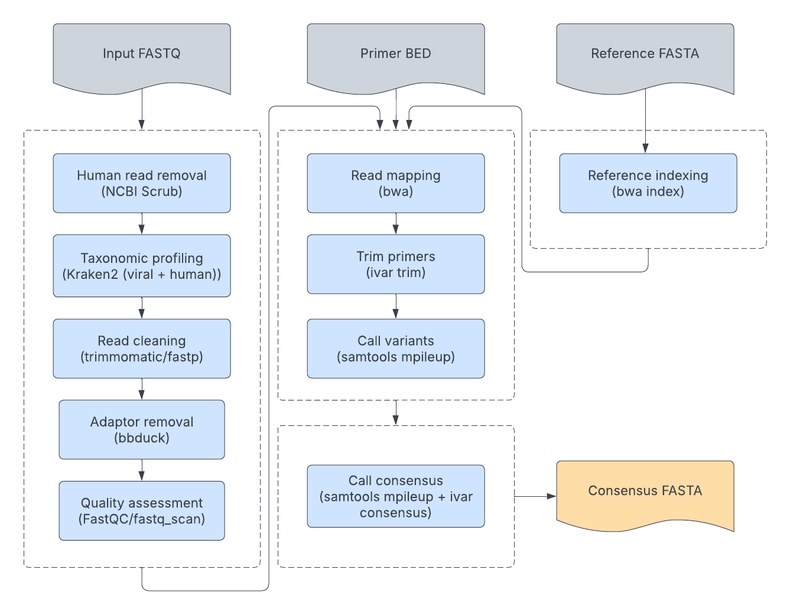

# Guide to Running Custom Organisms on TheiaCoV

We encourage users to refer to the [TheiaViral workflow series](../workflows/genomic_characterization/theiaviral.md) for assembling viruses that are not accounted for in TheiaCoV. 

## The TheiaCoV Workflow Series

The [**TheiaCoV Workflow Series**](../workflows/genomic_characterization/theiacov.md#theiacov-workflows) is a suite of bioinformatics workflows designed for the **assembly, quality assessment, and characterization of viral genomes**. These workflows accommodate various input data types and **support multiple viral organisms**, facilitating comprehensive genomic analyses for public health applications.

!!! caption "TheiaCoV Workflow Diagram"
    , with the exception of flu which is assembled by [IRMA](https://wonder.cdc.gov/amd/flu/irma/).* ](../assets/figures/TheiaCoV.png)

    **Figure 1: The TheiaCoV workflow diagram.** SARS-CoV-2 is the default organism, but compatibility with several others is directly implemented and custom viruses can be submitted for reference-based genome assembly. Depending on the organism provided, which is controlled by the `organism` optional input, independent and tailored genomic characterization modules are triggered. All organisms follow a consensus assembly approach computed by [iVar](https://github.com/andersen-lab/ivar), with the exception of flu which is assembled by [IRMA](https://wonder.cdc.gov/amd/flu/irma/).

### TheiaCoV Default Organisms

!!! dna "Supported Organisms"
    These workflows currently support the following organisms:

    - **SARS-CoV-2** (`"sars-cov-2"`, `"SARS-CoV-2"`) - *default organism input*
    - **Mpox virus** (`"MPXV"`, `"mpox"`, `"monkeypox"`, `"Monkeypox virus"`, `"Mpox"`)
    - **Human Immunodeficiency Virus** (`"HIV"`)
    - **West Nile Virus** (`"WNV"`, `"wnv"`, `"West Nile virus"`)
    - **Influenza** (`"flu"`, `"influenza"`, `"Flu"`, `"Influenza"`)
    - **RSV-A** (`"rsv_a"`, `"rsv-a"`, `"RSV-A"`, `"RSV_A"`)
    - **RSV-B** (`"rsv_b"`, `"rsv-b"`, `"RSV-B"`, `"RSV_B"`)
    - **Measles** (**`"measles"`**, `"Measles"`, `"mev"`, `"MeV"`, `"Morbillivirus"`, `"morbillivirus"`)

These workflows currently support seven organisms (see above). The workflows are adaptable, with parameters that can be customized for specific organisms. Input JSON files with preset configurations for each supported virus are provided [here](../workflows/genomic_characterization/theiacov.md#theiacov-workflows), streamlining the setup process.

Except for influenza, which follows a different process in TheiaCoV, **all organisms are assembled through consensus from a reference genome** (see Figure 2 below).

!!! caption "Assembly process in TheiaCoV"
    

    **Figure 2: TheiaCoV viral genome assembly flowchart.** FASTQ-formatted reads are binned into taxonomic groups, trimmed, QC’ed, mapped to the reference genome, and the consensus assembly is created with respect to the reference.

All non-influenza default organisms go through read quality control and consensus assembly with [iVar](https://github.com/andersen-lab/ivar). First, the human reads are removed from the sample with [NCBI's human read removal tool (HRRT)](https://github.com/ncbi/sra-human-scrubber), and the data is taxonomically profiled with [Kraken2](https://github.com/DerrickWood/kraken2) (using a database with all viral data in RefSeq and human) before and after human read removal. The reads are then trimmed with [trimmomatic](https://github.com/timflutre/trimmomatic) (default) or [fastp](https://github.com/OpenGene/fastp). Sequencing adapters, if they exist, are removed with [bbduck](https://sourceforge.net/projects/bbmap/), and raw and clean read quality is assessed using [fastq_scan](https://github.com/rpetit3/fastq-scan) (default) or [FastQC](https://github.com/s-andrews/FastQC). The clean reads are then mapped to the reference genome after indexing with [bwa](https://github.com/lh3/bwa). Primers are trimmed from the alignment with [iVar](https://github.com/andersen-lab/ivar), and variants are called with [samtools](https://github.com/samtools/samtools). Finally, [samtools](https://github.com/samtools/samtools) and [iVar](https://github.com/andersen-lab/ivar) are called to generate the consensus assembly. 

For default organisms, we provide all the necessary files for all of these processes. To successfully generate a consensus assembly for a non-default organism, depending on the workflow configuration, the intermediary files will need to be provided by the user. We drafted a set of recommendations below to facilitate this process.

### Workflow Recommendations for "Custom" Viruses

We encourage users to refer to the [TheiaViral workflow series](../workflows/genomic_characterization/theiaviral.md) for assembling viruses that are not accounted for in TheiaCoV. Tiled amplicon viruses may fail TheiaViral's *de novo* assembly process, though a reference genome can be provided by the user to bypass this step. The following is legacy information on running custom viruses with TheiaCoV.

TheiaCoV is not designed for custom viruses, so it is important to assess the validity of resulting assemblies. The custom virus approach requires a closely related reference genome as input, or else the workflow will fail due to an insufficient quantity of reads mapping to the reference. Such errors will occur at the `ivar_consensus` task during read alignment/extraction or during post-assembly variant calling because a consensus assembly comprising degenerate nucleotides was created. These errors primarily occur due to read mapping difficulty in small (< 20 kb), recombinant, or evolutionarily diverse lineages, such as norovirus or rhinovirus. Contamination can also cause reference mapping errors, so it is important to review the Kraken2 report to ensure the taxonomic composition of the sample sufficiently comprises the expected viral lineage.

!!! dna ""
    **Table 1:** Required and optional inputs for running custom viruses

    | **Task** | **Input** | **Description** | **Custom virus requirement** |
    | --- | --- | --- | --- |
    | theiacov_* | _genome_length_ | Expected genome length of organism | Required |
    | theiacov_* | _organism_ | Name of expected organism | Required |
    | theiacov_* | _reference_gff_ | Reference sequence in GFF3 format | Required for SE, PE, ONT; Omitted from FASTA |
    | theiacov_* | _primer_bed_ | Bed file with primer locations | Required for ONT; Optional for SE and PE only if *trim_primers* is set to False |
    | theiacov_* | _reference_gene_locations_bed_ | Bed file with gene location | Optional to estimate gene coverage |
    | theiacov_* | _reference_genome_ | Reference sequence in FASTA format | Required |
    | theiacov_* | _target_organism_ | Name of the expected organism in Kraken2 database | Optional to quantify percent of reads matching target organism |

### Request Support for Running TheiaCoV with "Custom" Viruses

Depending on your organism of interest, the guidance above might not be sufficient. For additional support, please reach out to <support@theiagen.com>! We'll be more than happy to assist you with your analyses.
