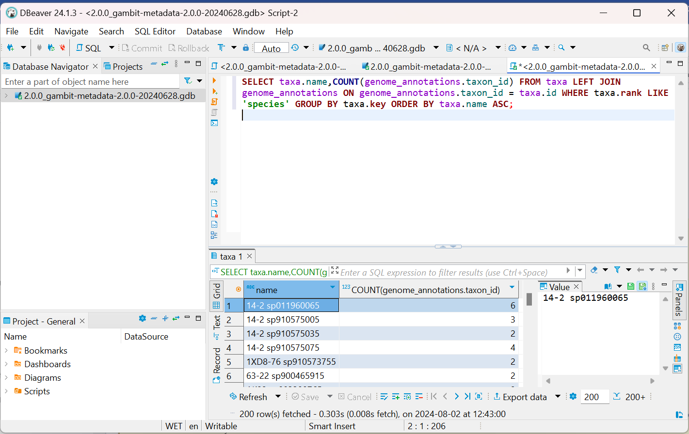

# GAMBIT

**GAMBIT (Genomic Approximation Method for Bacterial Identification and Tracking)** determines the taxon of the query genome assembly using a ***k*-mer-based approach** to match the assembly sequence to the closest complete genome in a database.

!!! dna "GAMBIT genomic distance metric correlates with sequence identity!"
    GAMBIT uses an efficient genomic distance metric along with a curated database to identify genome assemblies in seconds. You can read more about how the distance metric is calculated in the [Technical Details](#technical-details) section!

If the **distance between the query genome assembly and the closest genome in the database is within a built-in species threshold**, GAMBIT will assign the query genome to that species. Species thresholds are determined through a combination of automated and manual curation processes based on the diversity within the taxon.

!!! tip "GAMBIT includes a manually curated, high-quality database!"
    GAMBIT databases consist of two files:

    1. A **signatures file** containing the GAMBIT signatures (compressed representations) of all genomes represented in the database 
    2. A **metadata file** relating the represented genomes to their genome accessions, taxonomic identifications, and species thresholds
  
<div class="grid cards" markdown>

-   :material-file-code: **Latest GAMBIT Version**

    ---

    [GAMBIT v1.0.1 source code](https://github.com/jlumpe/gambit/releases/tag/v1.0.1)

-   :material-database: **Latest Database Version**

    ---

    [GAMBIT Prokaryotic GTDB Database v2.0.0](#gambit-gtdb-database-v200)

    [GAMBIT Fungal Database v1.0.0](#gambit-fungal-database-v100)

</div>

## GAMBIT on Terra.bio

[Theiagen](https://www.theiagen.com/)’s [Public Health Bioinformatics (PHB)](https://github.com/theiagen/public_health_bioinformatics) is a suite of workflows for characterization, epidemiology and sharing of pathogen genomes. Workflows are available for viruses, bacteria, and fungi.

## Importing and using GAMBIT via the PHB workflows

The [**GAMBIT_Query_PHB**](https://dockstore.org/workflows/github.com/theiagen/public_health_bioinformatics/Gambit_Query_PHB) workflow performs taxon assignment of a genome assembly using the GAMBIT. It can be imported directly to [Terra.bio](https://terra.bio) via [Dockstore](https://dockstore.org).

Two inputs are required for the **GAMBIT_Query_PHB** workflow: a genome assembly and a sample name associated with the genome assembly. The default GAMBIT database used for taxonomic identification is the Prokaryotic [GAMBIT Database GTDB v2.0.0](#gambit-gtdb-database-v200), but alternate GAMBIT databases can be provided.

!!! dna "Gambit_Query_PHB"
    More information on **GAMBIT_Query_PHB** is available [**here**](../workflows/standalone/gambit_query.md).

!!! tip inline end "Import workflows to [Terra.bio](https://terra.bio/):"
    **GAMBIT_Query_PHB**

    - [Gambit_Query_PHB](https://dockstore.org/workflows/github.com/theiagen/public_health_bioinformatics/Gambit_Query_PHB)
    
    **TheiaProk Workflow Series**
    
      - [TheiaProk_Illumina_PE_PHB](https://dockstore.org/workflows/github.com/theiagen/public_health_bioinformatics/TheiaProk_Illumina_PE_PHB)
      - [TheiaProk_Illumina_SE_PHB](https://dockstore.org/workflows/github.com/theiagen/public_health_bioinformatics/TheiaProk_Illumina_SE_PHB)
      - [TheiaProk_ONT_PHB](https://dockstore.org/workflows/github.com/theiagen/public_health_bioinformatics/TheiaProk_ONT_PHB)
      - [TheiaProk_FASTA_PHB](https://dockstore.org/workflows/github.com/theiagen/public_health_bioinformatics/TheiaProk_FASTA_PHB)
    
    **TheiaEuk Workflow Series**
   
      - [TheiaEuk_Illumina_PE_PHB](https://dockstore.org/workflows/github.com/theiagen/public_health_bioinformatics/TheiaEuk_Illumina_PE_PHB)

Additionally, GAMBIT is also part of the **TheiaProk** and **TheiaEuk** collection of workflows, the first dedicated to the analysis of prokaryotic data, and the second data to mycotics. The TheiaProk or TheiaEuk most appropriate for your type of input data can be imported from the Dockstore links on the right.

In both, GAMBIT is responsible for performing the taxonomic identification of the assembled sequences, which can trigger taxa-specific submodules for further genomic characterization. For TheiaProk, the default database is the Prokaryotic [GAMBIT Database GTDB v2.0.0](#gambit-gtdb-database-v200) and for TheiaEuk, the default database is the [Fungal GAMBIT Database v1.0.0](#gambit-fungal-database-v100).

!!! dna "TheiaProk and TheiaEuk"
    More information on TheiaProk and TheiaEuk is available on the following pages:

    - [**TheiaProk Workflow Series**](../workflows/genomic_characterization/theiaprok.md)
    - [**TheiaEuk Workflow Series**](../workflows/genomic_characterization/theiaeuk.md)

---

## Using GAMBIT on your local machine

This guide assumes you have prior knowledge of how to install software locally in a Unix command-line environment. The necessary databases will have to be downloaded independently to be used with GAMBIT. They are available in the [GAMBIT Databases](#gambit-databases) section of this document and should be placed in a directory of your choice. The directory should not contain any other files with the same extensions.

### Installation

#### Installation from Bioconda

The recommended way to install the tool is through the [Conda](https://www.anaconda.com/products/distribution) package manager from the [Bioconda](https://bioconda.github.io/) channel. You can simply run the following command to download GAMBIT’s latest version:

```bash
conda install -c bioconda gambit
```

#### Installation with Docker

The latest version of GAMBIT software is available as a Docker container in Theiagen’s [Google Artifact Registry (GAR)](https://cloud.google.com/artifact-registry). If [Docker is installed in your system](https://docs.docker.com/engine/install/) you can simply run the following command to download the container:

```bash
docker pull us-docker.pkg.dev/general-theiagen/staphb/gambit:1.0.0
```

You can access the container with the following command (note: with the `-v $PWD:/data`, your current directory is being mounted to the `data/` folder inside the container):

```bash
docker run -v $PWD:/data -it us-docker.pkg.dev/general-theiagen/staphb/gambit:1.0.0 bash
```

#### Installation from source

These instructions assume that you have [Git](https://git-scm.com/book/en/v2/Getting-Started-Installing-Git), [Python](https://www.python.org/downloads/) and [Pip](https://pip.pypa.io/en/stable/installation/) installed in your system. Navigate to <https://github.com/jlumpe/gambit> and clone the repository, or use the following command:

```bash
git clone https://github.com/jlumpe/gambit.git
```

Installing from source requires the Cython package as well as a C compiler to be installed on your system.  Navigate to the repository and install the package:

```bash
pip install .
```

### Usage

Positional arguments are one or more FASTA files containing query genome assemblies. You must provide the path to the directory containing the database files using either the `-d` option (*before* the `query` subcommand) or by setting the `GAMBIT_DB_PATH` environment variable. The results can be optionally outputted to a file, but by default, they are written to the terminal.

```bash
gambit [-d </path/to/database/>] query [-o results.csv] genome1.fasta genome2.fasta ...
```

#### Advanced Usage

There are many available commands in GAMBIT:

```text
Usage: gambit [OPTIONS] COMMAND [ARGS]...

  Tool for rapid taxonomic identification of microbial pathogens from genomic data.

Options:
  -d, --db DIRECTORY  Directory containing GAMBIT database files.
  --version           Show the version and exit.
  --help              Show this message and exit.

Commands:
  dist        Calculate the GAMBIT distances between a set of query...
  query       Predict taxonomy of microbial samples from genome sequences.
  signatures  Create and inspect GAMBIT signature files.
  tree        Estimate a relatedness tree for a set of genomes and output...
```

GAMBIT’s `query` is the most used as it computes the distance of a query genome to the genomes provided in the database.

```text
Usage: gambit query [OPTIONS] GENOMES...

  Predict taxonomy of microbial samples from genome sequences.

Options:
  -l LISTFILE                     File containing paths to query genomes, one
                                  per line.
  --ldir DIRECTORY                Parent directory of paths in LISTFILE.
  -o, --output FILENAME           File path to write to. If omitted will write
                                  to stdout.
  -f, --outfmt [csv|json|archive]
                                  Format to output results in.
  -s, --sigfile FILE              File containing query signatures, to use in
                                  place of GENOMES.
  --progress / --no-progress      Show/don't show progress meter.
  -c, --cores INTEGER RANGE       Number of CPU cores to use.  [x>=1]
  --help                          Show this message and exit.
```

---

## GAMBIT Databases

### GAMBIT Prokaryotic Databases

#### GAMBIT GTDB Database v2.0.0

??? toggle "Database Details"
    This database is a **major update** to the Curated v1.3.0 database. This iteration of the GAMBIT database relies upon the [Genome Taxonomy Database](https://gtdb.ecogenomic.org/) (GTDB), an initiative to establish a standardised microbial taxonomy based on genome phylogeny. The genomes used to construct the phylogeny are obtained from [RefSeq](https://www.ncbi.nlm.nih.gov/refseq/) and [GenBank](https://www.ncbi.nlm.nih.gov/genbank/), independently quality-controlled using [CheckM](https://github.com/Ecogenomics/CheckM/wiki) before inclusion in GTDB.

    This database was computed from [GTDB Release 214.1](https://gtdb.ecogenomic.org/stats/r214) as of April 28th, 2023. 

    - **Automated curation efforts**
        
        The following curation steps were followed for all species:
        
        - The candidates for an existing genus were collapsed (e.g genus_A, genus_B becomes genus)
        
        The following species were updated:
        
        - *Shigella* sp*.*
            - This genus is not present in GTDB  as it is collapsed under *Escherichia coli;*
            - All Shigella genomes in RefSeq were added to the database with no clustering using default quality criteria.
        - *Mycolicibacterium/Mycolicibacter/Mycolicibacillus/Mycobacteroides/Mycobacterium* sp.
            - All genomes available were used.
        - *Tropheryma whipplei*
            - This species has a low completeness score of 75%;
            - The CheckM completeness score was lowered to 70% for genomes belonging to this species.

    **Database Files**

    These database files are hosted in a public Google bucket by Theiagen Genomics:

    **GS URI (for [Terra.bio](https://terra.bio) usage):**

    - `gs://gambit-databases-rp/2.0.0/gambit-metadata-2.0.0-20240628.gdb`
    - `gs://gambit-databases-rp/2.0.0/gambit-signatures-2.0.0-20240628.gs`

    **HTTPS URL (for local download):**

    - <https://storage.cloud.google.com/gambit-databases-rp/2.0.0/gambit-metadata-2.0.0-20240628.gdb>
    - <https://storage.cloud.google.com/gambit-databases-rp/2.0.0/gambit-signatures-2.0.0-20240628.gs>

    **Taxa included in the GAMBIT database**

    Summary of species represented in the database with number of genomes representing each species and the species threshold:

    - <https://storage.cloud.google.com/gambit-databases-rp/2.0.0/gambit-taxa-2.0.0-20240628.tsv>
    
        Note: Species with a threshold of "0" have been sub-speciated. Subspecies are not listed in this table.

#### GAMBIT RefSeq Curated Database v1.3.0

??? toggle "Database Details"
    This database is a **patch update** to the Curated v1.2.0 database. In addition to all of the species included in the v1.2.0 database below, this database replaces all species in the **_Mycobacterium_, _Mycolicibacterium_, _Mycobacteroides_, and _Mycolicibacter_** genera with the available genomes in RefSeq as of October 16th, 2023.

    - **Manual curation efforts**
        
        The following species were updated:
        
        - *Mycolicibacterium/Mycolicibacter/Mycolicibacillus/Mycobacteroides/Mycobacterium* sp.
            - All genomes available were used

    **Database Files**

    These database files are hosted in a public Google bucket by Theiagen Genomics:

    **GS URI (for [Terra.bio](https://terra.bio) usage):**

    - `gs://gambit-databases-rp/1.3.0/gambit-metadata-1.3-231016.gdb`
    - `gs://gambit-databases-rp/1.3.0/gambit-signatures-1.3-231016.gs`

    **HTTPS URL (for local download):**

    - <https://storage.cloud.google.com/gambit-databases-rp/1.3.0/gambit-metadata-1.3-231016.gdb>
    - <https://storage.cloud.google.com/gambit-databases-rp/1.3.0/gambit-signatures-1.3-231016.gs>

    **Taxa included in the GAMBIT database**

    Summary of species represented in the database with number of genomes representing each species and the species threshold:

    - <https://storage.cloud.google.com/gambit-databases-rp/1.3.0/gambit-1.3-231016-taxa-list.txt>
        
        Note: Species with a threshold of "0" have been sub-speciated. Subspecies are not listed in this table.

#### GAMBIT RefSeq Curated Database v1.2.0

??? toggle "Database Details"
    This database is a **patch update** to the RefSeq Curated v1.1.0 database. In addition to all of the species included in the v1.1.0 database below, this database includes new species that were under-represented as of August 11th, 2023.

    - **Automated curation efforts**
       
        Automated addition of new species to the database that are genetically distant from all current species in the v1.1.0 GAMBIT database. 
        
        Genomes represented in the Genome Taxonomy Database ([GTDB](https://gtdb.ecogenomic.org/)) were added. These genomes predominantly originate from the RefSeq and GenBank databases with taxonomic metadata curated by GTDB. Any genomes added to the GAMBIT database from GTDB are added with the metadata from GTDB.
            
        - Genomes added from GTDB include the following species:
          
            [gambit-list-of-new-species-db-v1_2_0.txt](../assets/files/gambit-list-of-new-species-db-v1_2_0.txt)
                
    - **Manual curation efforts**
       
        Manually curated updates to several taxa relevant to public health. All genomes representing the taxa below were removed and replaced with the RefSeq genomes representing each species as of August 11th, 2023.
        
        - *Citrobacter, Providencia, Hafnia, Neisseria, Proteus, Achromobacter, Aeromonas, Bacillus, Brucella, Afipia, Burkholderia, Paraburkholderia, Corynebacterium, Morganella*

    **Database Files**

    These database files are hosted in a public Google bucket by Theiagen Genomics:

    **GS URI (for [Terra.bio](https://terra.bio) usage):**

    - `gs://gambit-databases-rp/1.2.0/gambit-metadata-1.2-231002.gdb`
    - `gs://gambit-databases-rp/1.2.0/gambit-signatures-1.2-231002.gs`

    **HTTPS URL (for local download):**

    - <https://storage.cloud.google.com/gambit-databases-rp/1.2.0/gambit-metadata-1.2-231002.gdb>
    - <https://storage.cloud.google.com/gambit-databases-rp/1.2.0/gambit-signatures-1.2-231002.gs>

    **Taxa included in the GAMBIT database**

    Summary of species represented in the database with number of genomes representing each species and the species threshold:

    - <https://storage.cloud.google.com/gambit-databases-rp/1.2.0/gambit-1.2-231002-taxa-list.txt>
        Note: Species with a threshold of "0" have been sub-speciated. Subspecies are not listed in this table.

#### GAMBIT RefSeq Curated Database v1.1.0

??? toggle "Database Details"
    This database is a **patch update** to the RefSeq Curated v1.0.0 database. In addition to all of the species included in the v1.0.0 database below, this database replaces all species in the **Enterobacter, Legionella, and Vibrio genera** with the available genomes in RefSeq as of April 17th, 2023.

    **Database Files**

    These database files are hosted in a public Google bucket by Theiagen:

    **GS URI (for [Terra.bio](https://terra.bio) usage):**

    - `gs://gambit-databases-rp/1.1.0/gambit-metadata-1.1-230417.gdb`
    - `gs://gambit-databases-rp/1.1.0/gambit-signatures-1.1-230417.gs`

    **HTTPS URL (for local download):**

    - <https://storage.cloud.google.com/gambit-databases-rp/1.1.0/gambit-metadata-1.1-230417.gdb>
    - <https://storage.cloud.google.com/gambit-databases-rp/1.1.0/gambit-signatures-1.1-230417.gs>

    **Taxa included in the GAMBIT database**

    Summary of species represented in the database with number of genomes representing each species and the species threshold:

    - <https://storage.cloud.google.com/gambit-databases-rp/1.1.0/gambit-1.1-230417-taxa-list.txt>
        
        Note: Species with a threshold of "0" have been sub-speciated. Subspecies are not listed in this table.

#### GAMBIT RefSeq Curated Database v1.0.0

??? toggle "Database Details"
    The GAMBIT RefSeq Curated v1.0.0 database was used for the analysis described in the [GAMBIT publication](https://doi.org/10.1371/journal.pone.0277575). This database was constructed based on the available genomes in RefSeq as of July 1st, 2016.  Genomes that did not have associated genus and/or species were removed. Additionally, at least two separate sequenced isolates for a given species were required in order to determine the classification threshold.  

    - **Manual curation efforts**
        
        Ambiguous genomes were removed if they met any of the following criteria: 
        
        1. A genome that did not cluster well with the majority of the other genomes within their species;
        2. A genome that clustered well with some members of their species but also several members of another species in the database<
        3. A genome that did not cluster well with any genomes in the database.

    **Database Files**

    These database files are hosted in a public Google bucket by Theiagen:

    **GS URI (for [Terra.bio](https://terra.bio) usage):**

    - `gs://gambit-databases-rp/1.0b2/gambit-genomes-1.0b2-rev2-211116.db`
    - `gs://gambit-databases-rp/1.0b2/gambit-signatures-1.0b1-210719.h5`

    **HTTPS URL (for local download):**

    - <https://storage.cloud.google.com/gambit-databases-rp/1.0b2/gambit-genomes-1.0b2-rev2-211116.db>
    - <https://storage.cloud.google.com/gambit-databases-rp/1.0b2/gambit-signatures-1.0b1-210719.h5>

    **Taxa included in the GAMBIT database**

    Summary of species represented in the database with number of genomes representing each species and the species threshold:

    - <https://storage.cloud.google.com/gambit-databases-rp/1.0b2/gambit-1.0b2-rev2-211116-taxa-list.txt>
        
        Note: Species with a threshold of "0" have been sub-speciated. Subspecies are not listed in this table.

---

### GAMBIT Fungal Databases

#### GAMBIT Fungal Database v1.0.0

??? toggle "Database Details"
    The GAMBIT Fungal Database v1.0.0 database was constructed based on the available genomes in RefSeq/GenBank as of December 13th, 2024. For inclusion in the database, species were required to have at least two genomes in GenBank and at least one genome representing the species in RefSeq.

    1. Species with a diameter of zero were excluded;
    2. Species with three or fewer genomes and a diameter greater than 0.75 were excluded.
    
    **Manual curation efforts**
    
     - Species were curated based on GAMBIT diameter:
     - The database was manually curated to remove highly distant genomes which were likely mislabeled.
     - Six species were divided into subspecies to ensure non-overlapping species diameters.
     - Two pairs of species were too closely related to distinguish (*Aspergillus flavus/Aspergillus oryzae* and *Aspergillus niger/Aspergillus welwitschiae*), therefore were combined.

    **Database Files**

    These database files are hosted in a public Google bucket by Theiagen:

    **GS URI (for [Terra.bio](https://terra.bio) usage):**

    - `gs://gambit-databases-rp/fungal-version/1.0.0/gambit-fungal-metadata-1.0.0-20241213.gdb`
    - `gs://gambit-databases-rp/fungal-version/1.0.0/gambit-fungal-signatures-1.0.0-20241213.gs`

    **HTTPS URL (for local download):**

    - <https://storage.cloud.google.com/gambit-databases-rp/fungal-version/1.0.0/gambit-fungal-metadata-1.0.0-20241213.gdb>
    - <https://storage.cloud.google.com/gambit-databases-rp/fungal-version/1.0.0/gambit-fungal-signatures-1.0.0-20241213.gs>

    **Taxa included in the GAMBIT database**

    360 fungal species from 176 genera are represented in the fungal database from a total of 8073 fungal genomes. A table indicating the number of genomes and species diameter for each species represented in the database is indicated below.

    [gambit-1.0.0-20241213-taxa-list.txt](../assets/files/gambit-1.0.0-20241213-taxa-list.txt)

#### GAMBIT Fungal Database v0.2.0

??? toggle "Database Details"
    The GAMBIT Fungal Database v0.2.0 database was used for the analysis described in the [TheiaEuk publication](https://doi.org/10.3389/fpubh.2023.1198213). This database was constructed based on the available genomes in GenBank as of November 30th, 2022. For inclusion in the database, species were required to have at least two genomes in GenBank and at least one genome representing the species in RefSeq.

    1. Species with a diameter of zero were excluded;
    2. Species with three or fewer genomes and a diameter greater than 0.75 were excluded.

    **Manual curation efforts**

    - Species were curated based on GAMBIT diameter:
    - The database was manually curated to remove highly distant genomes which were likely mislabeled.
    - Nine species were divided into subspecies to ensure non-overlapping species diameters.
    - Two pairs of species were too closely related to distinguish (*Aspergillus flavus/Aspergillus oryzae* and *Aspergillus niger/Aspergillus welwitschiae*), therefore were combined.

    **Database Files**

    These database files are hosted in a public Google bucket by Theiagen:

    **GS URI (for [Terra.bio](https://terra.bio) usage):**

    - `gs://gambit-databases-rp/fungal-version/0.2/221130-theiagen-fungal-v0.2.db`
    - `gs://gambit-databases-rp/fungal-version/0.2/221130-theiagen-fungal-v0.2.h5`

    **HTTPS URL (for local download):**

    - <https://storage.cloud.google.com/gambit-databases-rp/fungal-version/0.2/221130-theiagen-fungal-v0.2.db>
    - <https://storage.cloud.google.com/gambit-databases-rp/fungal-version/0.2/221130-theiagen-fungal-v0.2.h5>

    **Taxa included in the GAMBIT database**

    245 fungal species from 138 genera are represented in the fungal database from a total of 5,667 fungal genomes. A table indicating the number of genomes and species diameter for each species represented in the database is indicated below.

    [gambit-0.2.0-221130-taxa-list.tsv](../assets/files/gambit-0.2.0-221130-taxa-list.txt)

---

## Technical Details

### K-mer-based representation of the genomes

A GAMBIT signature is a compressed representation of a genome sequence that supports the efficient calculation of the **GAMBIT genomic distance metric**. It is defined as the set of *k*-mers present in the genome which occur immediately following a fixed prefix sequence. **GAMBIT finds all 11-mers in a genome assembly that immediately follows the prefix sequence ATGAC**.

This allows not only thousands of genomes to be represented in a relatively small (~3GB) database, but the comparison of the query genome to the set of references provided in the used GAMBIT database to be performed very fast.

!!! warning "Taxonomy information"
    The **GAMBIT database** used for classification consists of pre-calculated signatures for the reference genomes along with additional genome metadata and a taxonomy tree. As of GAMBIT Prokaryotic database v2.0.0, taxonomy information is derived from the  [Genome Taxonomy Database (GTDB)](https://gtdb.ecogenomic.org/) but restricted to the genus and species ranks and subject to additional curation. The other databases have the taxonomy information derived from the [NCBI taxonomy database](https://www.ncbi.nlm.nih.gov/taxonomy).

### Distance Metric Calculation

/// html | div[style='float: left; width: 50%; padding: 20px;']
The **Jaccard Index**, also known as the Jaccard Similarity Coefficient, is a statistic used for gauging the similarity and diversity between two sample sets. It ranges from 0 to 1, where if 0 the sets have no elements in common, whereas if 1 the sets are identical. In GAMBIT, the Jaccard Index is used to compare genetic sequences.

!!! warning "Jacard Distance vs Index"
    The **Jaccard Distance**, equal to one minus the Jaccard index, shares the same properties as the Jaccard index albeit inversely. It ranges from 0 to 1, where  0 the sets are identical and if 1, the sets have no elements in common.

In GAMBIT, the Jaccard Distance is calculated between two pre-computed k-mer sets in sparse coordinate format, one representing the query genome and another the GAMBIT database.

### Built-in Species Distance Threshold

GAMBIT classifies unknown genomes by finding the distance to the closest reference genome and comparing that distance against the thresholds of the reference genome’s species and genus.

For GAMBIT Prokaryotic database v2.0.0 and above, the threshold for a given species corresponds to the maximum intra-species distance ("max intra," or diameter) ([Figure 1](#figure1)). Some species are not well separated from their closest sister taxon and, in some cases, even overlap. Such as the case of *Escherichia coli* and *Shigella sonnei* in GAMBIT’s Prokaryotic Database. In these scenarios, the species were divided into subspecies groups based on clustering of their intra-species distances, and then reporting matches to these subgroups and their parent species.

If the query genome distance is greater than the species diameter, GAMBIT attempts to report the genus. Genus diameters are computed and manually curated based on the diversity of the genus.
///

/// html | div[style='float: right; width: 50%; padding: 20px;']
!!! caption "Distribution of GAMBIT distances"
    ##### Figure 1  {#figure1} 
    ![**Figure 1: Distribution of GAMBIT distances within a species and to the nearest sister taxon in the GAMBIT reference database.** Three histograms are shown in each panel (each normalized independently). The green histogram represents the distribution of GAMBIT distances from each reference genome in the species to the closest genome also within the same species. The blue histogram represents the distribution of GAMBIT distances for all pairwise comparisons within the species. The red histogram represents the distribution of GAMBIT distances from each genome in the species of interest to the closest genome in the species’ closest sister taxon. The dashed blue line represents the classification threshold for that species in the GAMBIT database, which in both cases was derived from the maximum intra-species distance. Panel A shows *Klebsiella pneumoniae* and its closest sister taxon *Klebsiella variicola*, panel B shows *Neisseria gonorrhoeae* and its closest sister taxon *Neisseria meningitidis*.  ****https://doi.org/10.1371/journal.pone.0277575.g004](../assets/figures/GAMBIT-distribution-of-distances.png)

    **Figure 1: Distribution of GAMBIT distances within a species and to the nearest sister taxon in the GAMBIT reference database.** Three histograms are shown in each panel (each normalized independently). The green histogram represents the distribution of GAMBIT distances from each reference genome in the species to the closest genome also within the same species. The blue histogram represents the distribution of GAMBIT distances for all pairwise comparisons within the species. The red histogram represents the distribution of GAMBIT distances from each genome in the species of interest to the closest genome in the species’ closest sister taxon. The dashed blue line represents the classification threshold for that species in the GAMBIT database, which in both cases was derived from the maximum intra-species distance. Panel A shows _Klebsiella pneumoniae_ and its closest sister taxon _Klebsiella variicola_, panel B shows _Neisseria gonorrhoeae_ and its closest sister taxon _Neisseria meningitidis_. 
    
    Sourced from <https://doi.org/10.1371/journal.pone.0277575.g004>.
///

/// html | div[style='clear: both;']
///

/// html | div[style='float: left; width: 50%; padding: 20px;']

### GAMBIT distances correlate with **sequence identity**

Average Nucleotide Identity (ANI) has been the benchmark for nucleic acid comparisons and was used as a baseline measure of genomic similarity to validate the GAMBIT distance metric. ANI is generally used to determine similarity at the species or genus level with thresholds above 0.92 being optimal for species-level calls.

The ANI values were compared against GAMBIT distances for all pairs of genomes in each of the four data sets:

!!! dna "Test sets for GAMBIT distance versus ANI"
    | Set | Number of Genomes | Phylogenetic Diversity | Assembly Quality | Reference |
    | --- | --- | --- | --- | ---|
    | Set 1 | 492 | Low (_E. coli_ only) | Medium | <https://doi.org/10.1186/s13059-016-0997-x> |
    | Set 2 | 70 | High (muliple phyla) | High | <https://doi.org/10.1073/pnas.0308653100> |
    | Set 3 | 88 | High (multiple phyla) | Medium | <https://doi.org/10.1371/journal.pone.0277575> |
    | Set 4 | 604 | High (multiple phyla) | Medium | <https://doi.org/10.1371/journal.pone.0277575> |
  
Spearman correlation was high in all four data sets ([Figure 2](#figure2)) (Set 1 = -0.977; Set 2 = -0.968; Set 3 = -0.969; Set 4 = -0.979) for comparisons in which the ANI was reported by the FastANI tool (100%, 5.59%, 7.42% and 47.4%), revealing a nearly monotonic relationship between GAMBIT distance and ANI.
///

/// html | div[style='float: right; width: 50%; padding: 20px;']
!!! caption "Relationship between GAMBIT distance and ANI"
    ##### Figure 2  {#figure2} 
     tool with default parameter values. GAMBIT distances were calculated for all sets using the same parameter (k = 11, prefix = ATGAC). As FastANI only reports ANI values greater than ~80%, the fraction of total pairwise comparisons shown here were 100%, 5.5%, 7.4% and 47.4% for data sets 1–4 respectively. https://doi.org/10.1371/journal.pone.0277575.g001](../assets/figures/GAMBIT-distance-vs-ani.png)

    **Figure 2: Relationship between GAMBIT distance and ANI (Average Nucleotide Identity).**  The relationship is nonlinear but very close to monotonic as measured by Spearman correlation (shown in the bottom left corner of each subplot). ANI was calculated using the [FastANI](https://github.com/ParBLiSS/FastANI) tool with default parameter values. GAMBIT distances were calculated for all sets using the same parameter (k = 11, prefix = ATGAC). As FastANI only reports ANI values greater than ~80%, the fraction of total pairwise comparisons shown here were 100%, 5.5%, 7.4% and 47.4% for data sets 1–4 respectively. 
    
    Sourced from <https://doi.org/10.1371/journal.pone.0277575.g001>.
///

/// html | div[style='clear: both;']
///

---

## GAMBIT Database Creation and Curation

As of [v2.0.0](#gambit-gtdb-database-v200), the GAMBIT Database is built iteratively over a [Genome Taxonomy Database (GTDB)](https://gtdb.ecogenomic.org/) release, starting with the species with the most publicly available genomes.

!!! dna "GAMBIT Database Creation can be done by you!"

    [GAMBIT Database Creation](./gambit_database.md)

The creation of a GAMBIT Database usually follows these steps:

- From a public repository, the genomes of interest are downloaded. Each taxa should have at least 2 genomes for GAMBIT diameters to be calculated;
- The downloaded genomes undergo a round of quality-control to minimize the possibility that the genomes are too fragmented, contaminated or too incomplete. Third-party tools, such as [QUAST](https://github.com/ablab/quast) and [CheckM](https://github.com/Ecogenomics/CheckM)/[BUSCO](https://busco.ezlab.org/) are used in this step;
- GAMBIT distances are calculated for all pairs of genomes, removing overlapping sequences and misclassification to increase the accuracy of GAMBIT;
- The database undergoes a curation to remove outliers and improve classification in underrepresented taxa and reflect public health usage and biological historical consensus more closely.

Because GAMBIT databases have built-in species thresholds, genomes are included in each database version and the thresholds associated with each species are **curated** prior to release. Curation approaches may vary by GAMBIT database release but aim to ensure that **mislabeled genomes are removed** and that species are **non-overlapping**. Detailed information on the curation steps that each GAMBIT Database was subjected to can be found in the [GAMBIT Databases](#gambit-databases) section.

!!! tip "Dependent on public data"
    Please note that GAMBIT databases undergo curation and testing prior to release, but are limited by the **availability and accuracy** of sequencing data in public repositories.

---

## GAMBIT FAQs

??? toggle "What GAMBIT database should I use?"
    GAMBIT Databases are domain-specific. Currently two domains are available: Bacteria and Fungi. Choosing the appropriate type of database for your data is important as it can lead to erroneous/no classification results.

    As a rule of thumb, we recommend the latest version of any GAMBIT Database to be used.  Instances where one might prefer to use an older database, versus the most up to date, include:

    1. Maintaining use of a database that has been validated previously by your laboratory, or 
    2. Utilizing a database that draws the genomes and their annotations from a specific source. For example, bacterial GAMBIT databases v1.0.0 through v1.3.0 draw their genome annotations predominantly from NCBI’s RefSeq database, whereas v2.0.0 draws all genome annotations from GTDB. Database v1.0.0 is also inclusive of all bacterial genomes that were available on RefSeq at the time of creation, whereas v2.0.0 excludes genomes that do not expand the diversity of their species.

??? toggle "How do I list taxa included in a GAMBIT database?"
    There are several ways to retrieve the information regarding which taxa were included in a given GAMBIT database release. The easiest way is to download the taxa list file provided [on this documentation page](./gambit_database.md) for every GAMBIT database release.

    Additionally, there are several programmatic ways to retrieve this information directly from the GAMBIT metadata file (which typically ends in ".gdb"). Here we present a few examples: using [SQLite3](https://www.sqlite.org/), [DBeaver](https://dbeaver.io/) or the [GAMBITtools](https://github.com/gambit-suite/gambittools) software.
    
    ??? example "_Example 1:_ SQLite3"
        To retrieve the list of taxa directly from the database, the following command can be run (after installing SQLite3 through your favourite installer). Substitute `<gambit metadata gdb file>` with your metadata file location.
        
        ```bash
        sqlite3 <gambit metadata gdb file> "SELECT * FROM taxa;" > list-of-taxa.tsv
        ```
        
        To retrieve the list of genomes, the following command can be run. Substitute `<gambit metadata gdb file>` by your metadata file location.
        
        ```bash
        sqlite3 <gambit metadata gdb file> "SELECT * FROM genomes;" > list-of-genome.tsv
        ```
        
    ??? example "_Example 2:_ DBeaver"
        After downloading and installing [DBeaver](https://dbeaver.io/), open the GAMBIT metadata file by clicking on `New Database Connection` (or hitting Ctrl+Shift+N) on the top left corner of the window. Under the SQL section, select the `SQLite` option and open the path to the metadata file. If prompted, install the required drivers by DBeaver. 
        
        !!! caption narrow "SQLite"
            
        
        Select `SQL Editor` in the toolbar and then click on `New SQL Script`. 
        
        !!! caption narrow "New SQL Script"
            
        
        Type `SELECT * FROM taxa;` and check that you get the results (press `CTRL+Enter` or click the orange arrow to execute SQL statements). To save the results click on `Export data`  on the bottom right corner and select what file format to save the information in (we recommend **CSV format** that can then be loaded onto Excel). 
        
        !!! caption narrow "List Taxa"
            
        
    ??? example "_Example 3:_ GAMBITtools"
        The [GAMBITtools](https://github.com/gambit-suite/gambittools) suite of scripts are Python tools written for working with GAMBIT. We recommend using [Docker](https://www.docker.com/) to interact with GAMBITtools. 
        
        After building the gambittools docker image, use the `gambit-list-taxa` command as demonstrated below to generate a list of taxa included in a GAMBIT database. Substitute `<gambit metadata gdb file>` with your metadata file location
        
        ```bash
        docker build -t gambittools .
        ```
        
        ```bash
        docker run -v $(pwd):/data gambittools gambit-list-taxa <gambit metadata gdb file>
        ```
        
??? toggle "How do I get the number of genomes representing a given species?"
    Like retrieving the list of taxa, there are several ways of retrieving the number of species for a given species. 

    ??? example "_Example 1:_ SQLite3"
        To retrieve the list of taxa and respective number of genomes directly from the database, the following command can be run (after installing SQLite3 through your favourite installer). Substitute `<gambit metadata gdb file>` with your metadata file location.
        
        ```bash
        sqlite3 <gambit metadata gdb file> "SELECT taxa.name,COUNT(genome_annotations.taxon_id) FROM taxa LEFT JOIN genome_annotations ON genome_annotations.taxon_id = taxa.id WHERE taxa.rank LIKE 'species' GROUP BY taxa.key ORDER BY taxa.name ASC;" > list-of-taxa-with-number-of-genomes.tsv
        ```
        
    ??? example "_Example 2:_ DBeaver"
        After downloading and installing [DBeaver](https://dbeaver.io/), open the GAMBIT metadata file by clicking on `New Database Connection` (or hitting Ctrl+Shift+N) on the top left corner of the window. Under the SQL section, select the `SQLite` option and open the path to the metadata file. If prompted, install the required drivers by DBeaver. 
        
        
        !!! caption narrow "SQLite"
            
        
        
        Select `SQL Editor` in the toolbar and then click on `New SQL Script`. 
        
        !!! caption narrow "New SQL Script"
            

        Type `SELECT taxa.name,COUNT(genome_annotations.taxon_id) FROM taxa LEFT JOIN genome_annotations ON genome_annotations.taxon_id = taxa.id WHERE taxa.rank LIKE 'species' GROUP BY taxa.key ORDER BY taxa.name ASC;` and check that you get the results (press `CTRL+Enter` or click the orange arrow to execute SQL statements). To save the results click on `Export data`  on the bottom right corner and select what file format to save the information in (we recommend **CSV format** that can then be loaded onto Excel). 
        
        !!! caption narrow "Number of Genomes"
            
        
??? toggle "How do I get the number of genomes and the distance threshold representing a given species?"
    Like retrieving the list of taxa and the number of genomes representing a given species, there are several ways of retrieving the distance threshold for a given species. 

    ??? example "_Example 1:_ SQLite3"
        To retrieve the list of taxa and respective number of genomes directly from the database, the following command can be run (after installing SQLite3 through your favourite installer). Substitute `<gambit metadata gdb file>` with your metadata file location.
        
        ```bash
        sqlite3 <gambit metadata gdb file> "SELECT taxa.name,taxa.distance_threshold,COUNT(genome_annotations.taxon_id) FROM taxa LEFT JOIN genome_annotations ON genome_annotations.taxon_id = taxa.id WHERE taxa.rank LIKE 'species' GROUP BY taxa.key ORDER BY taxa.name ASC;" > list-of-taxa-with-number-of-genomes.tsv
        ```
        
    ??? example "Example 2: DBeaver"
        After downloading and installing [DBeaver](https://dbeaver.io/), open the GAMBIT metadata file by clicking on `New Database Connection` (or hitting Ctrl+Shift+N) on the top left corner of the window. Under the SQL section, select the `SQLite` option and open the path to the metadata file. If prompted, install the required drivers by DBeaver. 
        
        !!! caption narrow "SQLite"
            
        
        Select `SQL Editor` in the toolbar and then click on `New SQL Script`. 
        
        !!! caption narrow "New SQL Script"
            
        
        Type `SELECT taxa.name,taxa.distance_threshold,COUNT(genome_annotations.taxon_id) FROM taxa LEFT JOIN genome_annotations ON genome_annotations.taxon_id = taxa.id WHERE taxa.rank LIKE 'species' GROUP BY taxa.key ORDER BY taxa.name ASC;` and check that you get the results (press `CTRL+Enter` or click the orange arrow to execute SQL statements). To save the results click on `Export data`  on the bottom right corner and select what file format to save the information in (we recommend **CSV format** that can then be loaded onto Excel). 
        
        !!! caption narrow "Number of Genomes and Distance Threshold"
            
    
??? toggle "How do I create a custom GAMBIT database?"

    Creating a custom GAMBIT database can be a laborious task.  The easiest way to go about it is to reach out to Theiagen Genomics at [support@theiagen.com](mailto:support@theiagen.com) to request assistance.  A guide can be found on [GAMBIT Database Creation](./gambit_database.md) 
    
??? toggle "How well does GAMBIT perform discerning between _Escherichia coli_ and _Shigella_ sp?"

    Escherichia coli and Shigella are closely genetically related, to the extent that they would be considered the same species if not for their distinguishing phenotypic characteristics. GAMBIT databases are curated to enable differentiation between the two groups, however, it is worth bearing in mind that these genomes are highly genetically similar thus tools that take a more granular approach to genome comparison may be more reliable. 
    
??? toggle "What should I do if a GAMBIT taxonomic assignment does not align with the expected results based on another bioinformatics tool or molecular testing?"

    In this instance, please reach out to [support@theiagen.com](mailto:support@theiagen.com) and David Hess at the Nevada State Public Health Laboratory [dhess@med.unr.edu](mailto:dhess@med.unr.edu). We will be happy to investigate your sample and improve the GAMBIT database in subsequent versions!
    
---

## Other Resources

- [Original GAMBIT publication](https://doi.org/10.1371/journal.pone.0277575)
- [GAMBIT Fungal Database publication](https://doi.org/10.3389/fpubh.2023.1198213)
- [GAMBIT Software GitHub](https://github.com/jlumpe/gambit/tree/master) - repository of GAMBIT software
- [GAMBIT suite GitHub](https://github.com/gambit-suite) - tools for working with GAMBIT including GAMBITdb for automated GAMBIT database creation

---

## References

Please cite the article below when using the **GAMBIT software and/or GAMBIT RefSeq Curated Database v1.0.0:**

> Lumpe J, Gumbleton L, Gorzalski A, Libuit K, Varghese V, et al. (2023) GAMBIT (Genomic Approximation Method for Bacterial Identification and Tracking): A methodology to rapidly leverage whole genome sequencing of bacterial isolates for clinical identification. PLOS ONE 18(2): e0277575. <https://doi.org/10.1371/journal.pone.0277575>

Please cite the reference below when using the **GAMBIT Fungal Database v0.2.0:**

> Ambrosio III, F. J., Scribner, M. R., Wright, S. M., Otieno, J. R., Doughty, E. L., Gorzalski, A., ... & Hess, D. (2023). TheiaEuk: a species-agnostic bioinformatics workflow for fungal genomic characterization. _Frontiers in Public Health_, _11_. <https://doi.org/10.3389/fpubh.2023.1198213>
