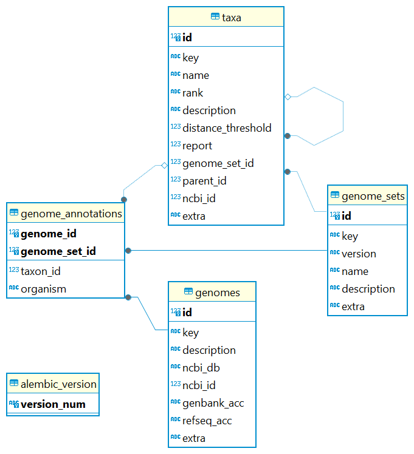

# GAMBIT Database Creation

GAMBIT (Genomic Approximation Method for Bacterial Identification and Tracking) incorporates k-mer based strategy for the identification of taxonomic information with a highly curated searchable database.

A GAMBIT databases consist of two files:

1. A **signatures file** containing the GAMBIT signatures (compressed representations) of all genomes represented in the database; 
2. A **metadata file** relating the represented genomes to their genome accessions, taxonomic identifications, and species thresholds.

The goal in creating a database for GAMBIT is two-fold:

- Genomes representing each species in the database must contain enough distinction from other species so that similarity thresholds can be extracted;
- The highest level of confidence is obtained that a genome in the database is actually from the species that matched its labelled identification.

<div class="grid cards" markdown>

-   :material-magnify-expand: **GAMBIT allows for rapid taxonomic identification of microbial pathogens.**

    ---

    The GAMBIT database is designed to facilitate the exploration and analysis of genomic data from a wide variety of prokaryotic or fungal isolates. It integrates and annotates genomic information based on information from curated sources. Several sources of complete and draft genomic sequences exist, with the most common being [RefSeq](https://www.ncbi.nlm.nih.gov/refseq/), [GenBank](https://www.ncbi.nlm.nih.gov/genbank/) and [GTDB](https://gtdb.ecogenomic.org/). Alternative sources, such as [BakRep](https://bakrep.computational.bio/), can also be used as long as taxonomic information is available.

-   :material-database-check: **Several pre-computed GAMBIT databases are available for prokaryotic and fungal genomes.**

    ---

    The full list of databases available can be consulted [here](./gambit.md#gambit-databases), with information on what curation steps were followed and what genomes are included.

</div>

---

## Database Creation Process

### Creating a GAMBIT database from a pre-curated list of genomes - GTDB and GAMBITdb

The creation and curation of a GAMBIT database is a laborious process which involves sourcing genomic information, setting minimum quality thresholds, and finally building a signature and a database file.

#### Identifying Data Source

As of [v2.0.0 of the GAMBIT Prokaryotic database](./gambit.md#gambit-gtdb-database-v200), [GTDB](https://gtdb.ecogenomic.org/) is the selected source of taxonomic information for genomes sourced from [RefSeq](https://www.ncbi.nlm.nih.gov/refseq/) and [GenBank](https://www.ncbi.nlm.nih.gov/genbank/). Automation is available through the [GAMBITdb](https://github.com/gambit-suite/gambitdb) which takes as input a GTDB release metadata spreadsheet including information on taxonomy and assembly quality metrics. GTDB’s release spreadsheets are available at [https://data.gtdb.ecogenomic.org/releases](https://data.gtdb.ecogenomic.org/releases/).

/// html | div[style='float: left; width: 50%; padding: 20px;']

#### Curation of Genomic Data

By default, genomes with [less than 0.1 diameter](./gambit.md#technical-details) between them are not included if compression is enabled, allowing the database to remain at a fairly low size (less than 3GB), instead being represented by a single centroid genome. This is because many genomes are identical or nearly identical to others in the public archives and there is no benefit to having multiple examples, for example, in an outbreak dozens of identical genomes could be sequenced and after the first, there is no new information for classification.

The inclusion criteria for genome assemblies for addition to the GAMBIT database are as follows:

- **Completeness** computed by [CheckM](https://github.com/Ecogenomics/CheckM/wiki) being equal or over **97%**;
- **Contamination**  computed by [CheckM](https://github.com/Ecogenomics/CheckM/wiki) being less than **3%**;
- Having less than **300 contigs**.

Species missing from previous iterations of the database were attempted to be added with looser quality criteria:

- **Completeness** computed by [CheckM](https://github.com/Ecogenomics/CheckM/wiki) being equal or over **90%;**
- **Contamination**  computed by [CheckM](https://github.com/Ecogenomics/CheckM/wiki) being less than **5%**;
- Having less than **600 contigs**.

Curation is included in the post-processing steps of [GAMBITdb](https://github.com/gambit-suite/gambitdb). This is primarily because taxonomy has evolved over more than a century in a pre-genomics world and has many edge cases. Examples include:

- The GTDB candidates for an existing genus were collapsed (e.g. genus_A, genus_B becomes genus). GTDB proposes new genus/species based on ANI however, these are not currently formally accepted by the community.
- The following species were updated:
    - _Shigella sp._
        - This genus is not present in GTDB  as it is collapsed under _Escherichia coli_; This is a controversial decision within the community, particularly as Shigella has specific clinical presentations.
        - All Shigella genomes in RefSeq were added to the database with no clustering using default quality criteria.
    - _Mycolicibacterium/Mycolicibacter/Mycolicibacillus/Mycobacteroides/Mycobacterium_ sp.
        - All genomes available were used.
    - _Tropheryma whipplei_
        - This species has a low completeness score of 75%;
        - The CheckM completeness score was lowered to 70% for genomes belonging to this species.  CheckM was subsequently updated to a new version (not used in this instance) and completeness for this species is rectified, so this fix will be deprecated in the next release.
///

/// html | div[style='float: right; width: 50%; padding: 20px;']

#### Using GAMBITdb

The [GAMBIT-suite](https://github.com/gambit-suite) organization provides multiple repositories for tools for [GAMBIT](https://github.com/jlumpe/gambit). It includes the [GAMBITdb](https://github.com/gambit-suite/gambitdb) repository which features several tools to generate a GAMBIT database from a GTDB’s release spreadsheet.

To run [GAMBITdb](https://github.com/gambit-suite/gambitdb), the following dependencies are required:

- [GAMBIT](https://github.com/jlumpe/gambit)
- [ncbi-genome-download](https://github.com/kblin/ncbi-genome-download)
- [GAMBITtools](https://github.com/gambit-suite/gambittools)

A Bash wrapper is available for creating a database from a GTDB spreadsheet (one for bacteria, one for archaea). This script will download the data, create a GAMBIT database and signatures files, and then check the recall against the downloaded files for QC purposes. It is the easiest way to create a database.

```bash
run_gambitdb_bacteria.sh </path/to/working_directory> </path/to/gtdb_metadata_spreadsheet.tsv> <num_cores>
```

A collection of scripts is called by the Bash wrapper to:

1. Parse a GTDB spreadsheet and output a list of accessions to download, a species taxon file and a genome metadata file;
2. Download the genomes from NCBI (GenBank and RefSeq)
3. Generate a GAMBIT database from a directory containing assemblies in FASTA format and a CSV file containing the assembly file and path, and the species taxon ID;

!!! tip "Automatic Database Curation"
    These steps allow you to obtain a working GAMBIT database without much manual intervention, given that all dependencies are installed correctly in your system. As of v2.0.0, the [curation steps have been automated](https://github.com/gambit-suite/gambitdb/blob/main/scripts/gambitdb-manual-curation) but require functionality deep access within the GAMBITdb software and are mostly for advanced usage. More detailed information is [available within the GAMBITdb repository](https://github.com/gambit-suite/gambitdb?tab=readme-ov-file#gambitdb).

Sometimes repairs are required as even with curation of the GTDB spreadsheet errors can make their way to the final database. A utility is available to perform maintenance and repair operations on a GAMBIT database:

```bash
gambitdb-repair-db </path/to/metadata_file>
```

Manual curation efforts have been automated and are also available:

```bash
gambitdb-manual-curation </path/to/metadata_file> </path/to/signatures_file> </path/to/gtdb_metadata_spreadsheet.tsv>
```

///

/// html | div[style='clear: both;']
///

## Manually creating and curating a GAMBIT database

The manual creation and curation of a GAMBIT database is a complex and sometimes difficult process and is not advised without guidance. Please feel free to reach out to [support@theiagen.com](mailto:support@theiagen.com) with any questions you might have.

### Sourcing Genomic Information

A GAMBIT database can be created from genomes retrieved from a wide variety of sources, not just [GTDB](https://gtdb.ecogenomic.org/). To do so, all the automated steps in the [GAMBITdb](https://github.com/gambit-suite/gambitdb) need to be followed individually. Some officially supported databases, such as the [GAMBIT Fungal Database v0.2.0](gambit.md#gambit-fungal-database-v020), were created following these steps.

#### Step 1: Download genomes to be included in the database

Genomes may be downloaded from public repositories like NCBI and GTDB. Genomes must be in **FASTA file format.** It is also necessary to create a file listing each genome with its species identity. The [RefSeq FTP site](https://ftp.ncbi.nlm.nih.gov/genomes/refseq/) is a useful resource for both tasks.

Example: <https://ftp.ncbi.nlm.nih.gov/genomes/refseq/fungi/assembly_summary.txt>

#### Step 2: Perform quality control on the sourced genomes (optional)

It is advised to perform some quality assessment and control on the downloaded genomes to reduce the possibility of including low-quality and/or erroneous sequences in the database. [QUAST](https://github.com/ablab/quast) is a popular software for obtaining useful reference-free metrics such as the number of contigs, number of basepairs, length of largest contig and N50. Tools like [BUSCO](https://busco.ezlab.org/) and [CheckM](https://github.com/Ecogenomics/CheckM) provide valuable information regarding the completeness and contamination of a genome

#### Step 3: Compress genomes into the GAMBIT signatures file and calculate pairwise distances between all genomes

Compressing genomes into a GAMBIT signatures file can be accomplished using [GAMBIT](https://github.com/jlumpe/gambit)’s `gambit signatures` command:

```bash
gambit signatures create -k 11 -p ATGAC -o signatures.gs fasta_dir/*.fna.gz
```

!!! tip "K-mer Length"
    The length of the k-mer, controlled by the `-k` parameter, and the k-mer prefix, controlled by the `-p` parameter, need to match between the **GAMBIT database** and the way **GAMBIT query** is run.  **We strongly advise that these parameters not to be changed!**

After the GAMBIT signatures file is created, a pairwise distance matrix for every genome in the signatures file can be created using the `gambit dist` command:

```jsx
gambit dist --qs signatures.gs --square -o pw_dists.csv
```

!!! caption narrow "GAMBIT Metadata Database Scheme"
    ##### Figure 1 {#figure1}
    

    **Figure 1:** Scheme for GAMBIT’s metadata database

#### Step 4: Calculate diameters for taxa and resolve overlaps

The defining feature of GAMBIT is the ability to determine if a query genome is genetically similar enough to the closest genome in the GAMBIT database to assign it to that species. For GAMBIT to work as intended, the database must be curated to ensure that no genomes are mislabeled and that species classifications are well-defined.

Most GAMBIT databases are curated by examining the pairwise GAMBIT distance matrix generated in step 3 and resolving any of the following issues:

1. **Distantly related subspecies**
    1. **Manifestation:** In the pairwise-distance matrix, there are two or more groups of genomes within the species that are closely related, but are highly distant from each other.
    2. **Solution: C**reate a subspecies taxon. 
2. **Outlier genomes that may be labelled with the incorrect species**
    1. **Manifestation:** The genome will be distant from other genomes within its species, but highly similar to genomes of another species.
    2. **Solution:** Remove this genome. Assigning a new taxa is also possible.
3. **Outlier genomes that are the result of poor assemblies**
    1. **Manifestation:** The genome will be distant from all other genomes in the distance matrix.
    2. **Solution:** Remove this genome.

Any remaining species overlaps following removal of outlier genomes and separation of subspecies is likely the result of species groupings reflecting historical practices that do not align well with genetic distinctions between species (i.e. _E. coli_ and _Shigella_).

#### Step 5: Download taxa

[Entrez](https://www.ncbi.nlm.nih.gov/search/), available through [Biopython](https://biopython.org/docs/1.75/api/Bio.Entrez.html), is a useful resource for downloading data directly from NCBI including Taxonomy, a database of organism names and classifications.

For each entry in the database, the most up-to-date taxonomy needs to be retrieved. In the GAMBIT database, the taxon IDs of the genomes need to be mapped to their species-level ancestors.

We provide a Python script to accomplish this. Please add the missing information marked with `<>` to make the utility function and make sure you have all the required dependencies installed in your system, including [Pandas](https://pandas.pydata.org/) and [Biopython](https://biopython.org/).

```python linenums="1"
#!/usr/bin/env python
# coding: utf-8

# Download ESummary data for taxonomy tree.

from pathlib import Path
import json
import pandas as pd
from Bio import Entrez
from tqdm import tqdm

# ## Setup

Entrez.email = '<your_email_here>' #TO BE REPLACED

DATESTR = '<YYMMDD>' #TO BE REPLACED
NBNAME = f'{DATESTR}-download-taxa'

infiles = dict(
    genomes='<genomes_CSV_file>',  #TO BE REPLACED
)

intermediate_data = Path('data-intermediate') / NBNAME
intermediate_data.mkdir(exist_ok=True)

outfiles = dict(
    taxa=intermediate_data / 'taxa',
)

outfiles['taxa'].mkdir(exist_ok=True)

# ## Load data

genomes = pd.read_csv(infiles['genomes'])

# ## Download taxonomy data

to_download = set(genomes['ncbi_taxid'])
taxa = dict()

while to_download:
    # Next to download
    taxid = next(iter(to_download))
    print(taxid)
    file = outfiles['taxa'] / f'{taxid}.json'
    
    if not file.exists():
        # Fetch data from NCBI
        result = Entrez.read(Entrez.efetch(db='taxonomy', id=taxid))
        (taxon,) = result

        # Save to local file
        with open(file, 'w') as f:
            json.dump(taxon, f)
    
    else:
        # Already downloaded, read from the existing file
        with open(file) as f:
            taxon = json.load(f)
            
    taxa[taxid] = taxon
    to_download.remove(taxid)
            
    # If not a species, find the species ancestor and add to the download list
    if taxon['Rank'] != 'species':
        for ancestor in taxon['LineageEx']:
            if ancestor['Rank'] == 'species':
                tid = int(ancestor['TaxId'])
                if tid not in taxa:
                    to_download.add(tid)
                break
        else:
            raise RuntimeError('No species ancestor found')
```

#### Step 6: Create the database

The next step is to create the SQLite database file for the GAMBIT database. [Figure 1](#figure1) depicts the database structure expected by GAMBIT. 

We provide a Python script to accomplish this. Please add the missing information marked with `<>` to make the utility function and make sure you have all the required dependencies installed in your system, including [GAMBIT](./gambit.md) and [SQLalchemy](https://www.sqlalchemy.org/).

```python linenums="1"
#!/usr/bin/env python
# coding: utf-8

# This creates the sqlite database file for the Candida DB.

from pathlib import Path
import json
from datetime import date
import pandas as pd
from sqlalchemy import create_engine
from sqlalchemy.orm import sessionmaker
from gambit.db import ReferenceGenomeSet, Genome, AnnotatedGenome, Taxon
from gambit.db.migrate import init_db
from entrez_tools.db.assembly import format_summary_meta

# ## Setup

DATESTR = '<YYMMDD>' #TO BE REPLACED
NBNAME = f'{DATESTR}-create-db'

infiles = dict(
    genomes_table=Path('<genomes_CSV_file>'), #TO BE REPLACED
    taxa_table=Path(f'data-intermediate/{DATESTR}_3-find-diameters/species-data.csv'),
    fasta_dir=Path('<path_to_directory_with_fastas>'), #TO BE REPLACED
    genome_esummary_dir=Path(f'data-intermediate/{DATESTR}_1-download-genomes/esummary'),
    taxon_esummary_dir=Path(f'data-intermediate/{DATESTR}_4-download-taxa/taxa'),
)

processed_data = Path('data-processed') / NBNAME
processed_data.mkdir(exist_ok=True, parents=True)

outfiles = dict(
    db=processed_data / f'{DATESTR}-<database_name>.db', #TO BE REPLACED
)

# ## Load data

genomes_df = pd.read_csv(infiles['genomes_table'])
taxa_df = pd.read_csv(infiles['taxa_table'])

genome_summaries = dict()

for uid in genomes_df['uid']:
    with open(infiles['genome_esummary_dir'] / f'{uid}.json') as f:
        genome_summaries[uid] = json.load(f)

taxon_summaries = dict()

for taxid in set(genomes_df['ncbi_taxid']):
    with open(infiles['taxon_esummary_dir'] / f'{taxid}.json') as f:
        taxon_summaries[uid] = json.load(f)

# ## Create database

if outfiles['db'].is_file():
    outfiles['db'].unlink()

engine = create_engine('sqlite:///' + str(outfiles['db']))

init_db(engine)

Session = sessionmaker(engine)
session = Session()

# ### Genome set

gset = ReferenceGenomeSet(
    key='<database_name>', # TO BE REPLACED, suggested <organization/name>
    version='x.y.z', # TO BE REPLACED
    name='<name>', # TO BE REPLACED
    description='<description>', # TO BE REPLACED
    extra=dict(
        author='<author>', # TO BE REPLACED
        date=date.today().isoformat(),
    ),
)

session.add(gset)
session.commit()

# ### Taxa

taxa = dict()

for row in taxa_df.itertuples():
    taxon = Taxon(
        genome_set=gset,
        # Arbitrary unique string ID
        # These are all regular NCBI taxa
        key=f'ncbi/{row.ncbi_taxid}',
        # Using names I got from you here, NCBI reassigned several to other genera
        name=row.name,
        rank='species',
        #description
        distance_threshold=row.diameter,
        #report
        #genome set id
        #parent_id
        ncbi_id=row.ncbi_taxid,
        # Arbitrary JSON-formatted metadata
        extra=dict(
            # The actual name used by NCBI
            ncbi_name=row.ncbi_name,
        ),
    )
    
    taxa[row.ncbi_taxid] = taxon
    session.add(taxon)
    
session.commit()

# ### Genomes

for row in genomes_df.itertuples():
    summary = genome_summaries[row.uid]
    assembly_stats = format_summary_meta(summary['meta'])
    taxon = taxa[row.ncbi_taxid]
    
    genome = Genome(
        #edited next line
        key='/data/fasta/'f'{row.genbank_acc}''.fna.gz',
        description=f'[{row.genbank_acc}] {summary["organism"]}',
        ncbi_db='assembly',
        ncbi_id=row.uid,
        genbank_acc=row.genbank_acc,
        # More JSON metadata
        extra=dict(
            length=assembly_stats['total_length'],
        )
    )
    session.add(genome)
    
    ag = AnnotatedGenome(
        genome=genome,
        genome_set=gset,
        taxon=taxon,
        organism=taxon.name,
    )
    session.add(ag)
    
session.commit()

```

#### Step 7: Finalise the signatures file

The Last step is to finalise the signatures file. This last Python utility adds metadata to the database signatures file. Please add the missing information marked with `<>` to make the utility function and make sure you have all the required dependencies installed in your system, including [GAMBIT](./gambit.md) and [SQLalchemy](https://www.sqlalchemy.org/).

```python linenums="1"
#!/usr/bin/env python
# coding: utf-8

# # Finalize signatures

from pathlib import Path
import json
from datetime import date
from gambit.sigs import SignaturesMeta, load_signatures, dump_signatures, AnnotatedSignatures

# ## Setup

DATESTR = '<YYMMDD>' #TO BE REPLACED
NBNAME = f'{DATESTR}-finalize-signatures'

infiles = dict(
    signatures=Path(f'data-intermediate/{DATESTR}-signatures-and-dists/signatures.h5'),
)

processed_data = Path('data-processed') / NBNAME
processed_data.mkdir(exist_ok=True, parents=True)

outfiles = dict(
    signatures=processed_data / f'{DATESTR}-<db_name>.h5', #TO BE REPLACED
)

# ## Assign metadata

meta = SignaturesMeta(
    id='<database_name>', # TO BE REPLACED, suggested <organization/name>
    version='x.y.z', # TO BE REPLACED
    name='<name>', # TO BE REPLACED
    description='<description>', # TO BE REPLACED
    id_attr='key',
)

with load_signatures(infiles['signatures']) as src:
    out_sigs = AnnotatedSignatures(src, src.ids, meta)
    dump_signatures(outfiles['signatures'], out_sigs)

```

## Help Available

Please feel free to reach out to <support@theiagen.com> with any questions you might have.