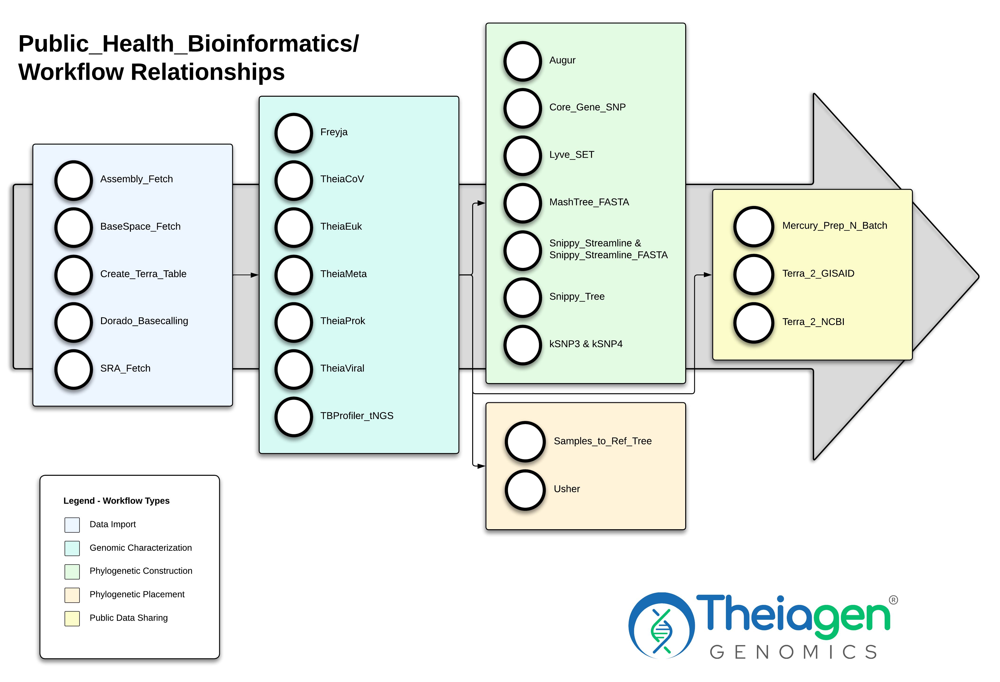
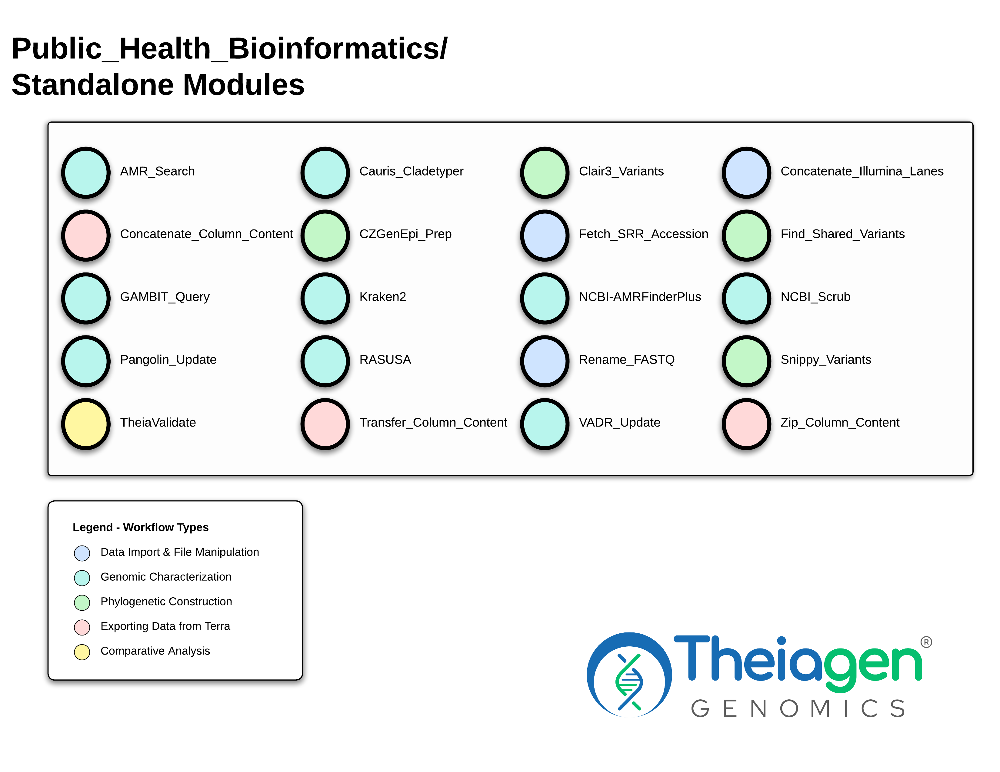

## Purpose & Workflows

The PHB repository contains workflows for the characterization, genomic epidemiology, and sharing of pathogen genomes of public health concern. Workflows are available for viruses, bacteria, and fungi.

All workflows in the PHB repository end with `_PHB` in order to differentiate them from earlier versions and from the original tools they incorporate.

/// html | div[style="text-align: center"]
[Explore our workflows](workflows_overview/workflows_type.md){ .md-button .md-button--primary }
///

/// html | div[class="grid cards" markdown]

-   
[Terra Users](getting_started/terra.md){ .md-button .md-button--secondary }

    ---

    Learn how to use our workflows on Terra!

-   
[v3.0.1 Release Notes](https://theiagen.notion.site/public-health-bioinformatics-v3-0-1-patch-release-notes){ .md-button .md-button--secondary }
    ---

    Learn about the latest changes to our workflows!

-   
[Command-line Users](getting_started/commandline.md){ .md-button .md-button--secondary }

    ---

    Learn how to use our workflows on the command-line!

///

!!! dna "Our Open Source Philosophy"
    PHB source code is publicly available on [GitHub](https://github.com/theiagen/public_health_bioinformatics) and available under [GNU Affero General Public License v3.0](https://github.com/theiagen/public_health_bioinformatics/blob/main/LICENSE)!

    All workflows can be imported directly to [Terra](https://terra.bio/) via the [**Dockstore PHB collection**](https://dockstore.org/organizations/Theiagen/collections/public-health-bioinformatics)! 
    
    You can also use our workflows on the command-line. Please see our guide on how to get started [**here**](getting_started/commandline.md)!

When undertaking genomic analysis using the command-line, via Terra, or other data visualization platforms, it is essential to consider the necessary and appropriate workflows and resources for your analysis. To help you make these choices, take a look at the relationship between the most commonly used Theiagen workflows.

!!! caption "Analysis Approaches for Genomic Data"

    === "General Workflow Relationships"
        {data-description="This diagram shows the available workflows in the PHB repository, represented by circles, that are available for analysis of genomic data. Workflows are grouped into boxes that represent the major types of analysis that they perform. The arrows between the boxes represent the relationships between the workflows, showing which workflows may be used consecutively, while the large arrow underlying everything indicates the general process of analysis."}

        This diagram shows the available workflows in the PHB repository, represented by circles, that are available for analysis of genomic data. Workflows are grouped into boxes that represent the major types of analysis that they perform. The arrows between the boxes represent the relationships between the workflows, showing which workflows may be used consecutively, while the large arrow underlying everything indicates the general process of analysis.

    === "Available Standalone Workflows"
        {data-description="This diagram shows the available standalone workflows in the PHB repository, represented by circles, that are available for analysis of genomic data. Workflows are grouped by colors that represent the major types of analysis that they perform. These workflows can be used independently of the major workflow groupings as either supplements or alternatives."}

        This diagram shows the available _standalone_ workflows in the PHB repository, represented by circles, that are available for analysis of genomic data. Workflows are grouped by colors that represent the major types of analysis that they perform. These workflows can be used independently of the major workflow groupings as either supplements or alternatives.

### PHB development is a cycle

We continuously work to improve our codebase and usability of our workflows by the public health community, so changes from version to version are expected. This documentation page reflects the state of the repository at the version stated in the header.

## Contributing to the PHB Repository

We warmly welcome contributions to this repository! Our code style guide may be found [here](contributing/code_contribution.md) for convenience of formatting and our documentation style guide may be found [here](contributing/doc_contribution.md).

If you would like to submit suggested code changes to our workflows, you may add or modify the WDL files and submit pull requests to the [PHB GitHub](https://github.com/theiagen/public_health_bioinformatics) repository.

You can expect a careful review of every PR and feedback as needed before merging, just like we do for PRs submitted by the Theiagen team. Our PR template can help prepare you for the review process. As always, reach out with any questions! We love recieving feedback and contributions from the community. When your PR is merged, we'll add your name to the contributors list below!

## Authorship & Responsibility

### Authorship

<!-- 
A Public Service Announcement regarding calculating the contribution math:

Andrew Hale added a .txt database file to docs/assets that artifically inflates his line 
count by 55,316 lmao. This was not code and shouldn't be considered as such. Please subtract 
55,316 from his line count when updating this list. okay thanks byee
-->

(Ordered by contribution [# of lines changed] as of 2025-06-25)

- **Sage Wright** ([@sage-wright](https://github.com/sage-wright)) - Conceptualization, Software, Validation, Supervision <!-- 144222 -->
- **Inês Mendes** ([@cimendes](https://github.com/cimendes)) - Software, Validation <!-- 41092-->
- **Curtis Kapsak** ([@kapsakcj](https://github.com/kapsakcj)) - Conceptualization, Software, Validation <!-- 36760 -->
- **Theron James** ([@MrTheronJ](https://github.com/MrTheronJ)) - Software, Validation <!-- 17621 -->
- **Michal Babinski** ([@Michal-Babins](https://github.com/Michal-Babins)) - Software, Validation <!-- 5775 -->
- **Zachary Konkel** ([@xonq](https://github.com/xonq)) - Software, Validation <!-- 5119 -->
- **Andrew Hale** ([@awh082834](https://github.com/awh082834)) - Software, Validation <!-- 60300 - 55316 = 4984 -->
- **Michelle Scribner** ([@michellescribner](https://github.com/michellescribner)) - Software, Validation <!-- 4307 -->
- **Kevin Libuit** ([@kevinlibuit](https://github.com/kevinlibuit)) - Conceptualization, Project Administration, Software, Validation, Supervision <!-- 3352 -->
- **Andrew Lang** ([@AndrewLangVt](https://github.com/AndrewLangVt)) - Software, Supervision <!-- 152 -->
- **Kelsey Kropp** ([@kelseykropp](https://github.com/kelseykropp)) - Validation <!-- 111 -->
- **Joel Sevinsky** ([@sevinsky](https://github.com/sevinsky)) - Conceptualization, Project Administration, Supervision <!-- 0 -->

### External Contributors

We would like to gratefully acknowledge the following individuals from the public health community for their contributions to the PHB repository:

- **Frank Ambrosio** ([@frankambrosio3](https://github.com/frankambrosio3))*
- **James Otieno** ([@jrotieno](https://github.com/jrotieno))*
- **Robert Petit** ([@rpetit3](https://github.com/rpetit3))*
- **Fraser Combe** ([@fraser-combe](https://github.com/fraser-combe))*
- **Andrew Page** ([@andrewjpage](https://github.com/andrewjpage))*
- **Emma Doughty** ([@emmadoughty](https://github.com/emmadoughty))*
- **Nate Matteson** ([@watronfire](https://github.com/watronfire))
- **Ash O'Farrel** ([@aofarrel](https://github.com/aofarrel))
- **Sam Baird** ([@sam-baird](https://github.com/sam-baird))
- **Holly Halstead** ([@HNHalstead](https://github.com/HNHalstead))
- **Emily Smith** ([@emily-smith1](https://github.com/emily-smith1))*

\* Former member of Theiagen

### On the Shoulder of Giants

The PHB repository would not be possible without its predecessors. We would like to acknowledge the following repositories, individuals, and contributors for their influence on the development of these workflows:

The PHB repository originated from collaborative work with Andrew Lang, PhD & his [Genomic Analysis WDL workflows](https://github.com/AndrewLangvt/genomic_analyses). The workflows and task development were influenced by The Broad's [Viral Pipes](https://github.com/broadinstitute/viral-pipelines) repository. The TheiaCoV workflows for viral genomic characterization were influenced by UPHL's [Cecret](https://github.com/UPHL-BioNGS/Cecret) & StaPH-B's Monroe (now deprecated) workflows. The TheiaProk workflows for bacterial genomic characterization were influenced by Robert Petit's [bactopia](https://github.com/bactopia/bactopia). Most importantly, the PHB user community drove the development of these workflows and we are grateful for their feedback and contributions.

If you would like to provide feedback, please raise a [GitHub issue](https://github.com/theiagen/public_health_bioinformatics/issues/new) or contact us at <support@theiagen.com>.

### Maintaining PHB Pipelines

Theiagen Genomics has committed to maintaining these workflows for the forseeable future. These workflows are written using a standard workflow language (WDL) and uses Docker images based on the [StaPH-B Docker Builds](https://github.com/StaPH-B/docker-builds). New versions that include bug fixes and additional features are released on a quarterly bases, with urgent bug fixes released as needed. Each version is accompanied by detailed release notes to lower the barrier of pipeline upkeep from the public health community at large.

### Point of Contact

If you have any questions or concerns, please raise a [GitHub issue](https://github.com/theiagen/public_health_bioinformatics/issues/new) or email Theiagen's general support at <support@theiagen.com>.

### Conflict of Interest

The authors declare no conflict of interest.

## Citation

Please cite this paper if publishing work using any workflows:

> Libuit, Kevin G., Emma L. Doughty, James R. Otieno, Frank Ambrosio, Curtis J. Kapsak, Emily A. Smith, Sage M. Wright, et al. 2023. "Accelerating Bioinformatics Implementation in Public Health." Microbial Genomics 9 (7). <https://doi.org/10.1099/mgen.0.001051>.

Alternatively, please cite this paper if using the TheiaEuk workflow:

> Ambrosio, Frank, Michelle Scribner, Sage Wright, James Otieno, Emma Doughty, Andrew Gorzalski, Danielle Siao, et al. 2023. "TheiaEuk: A Species-Agnostic Bioinformatics Workflow for Fungal Genomic Characterization." Frontiers in Public Health 11. <https://doi.org/10.3389/fpubh.2023.1198213>.

## About Theiagen

Theiagen develops bioinformatics solutions for public health labs, and then trains and supports scientists to use these. If you would like to work with Theiagen, please [get in contact](https://theiagen.com/team-up-with-theiagen/).
