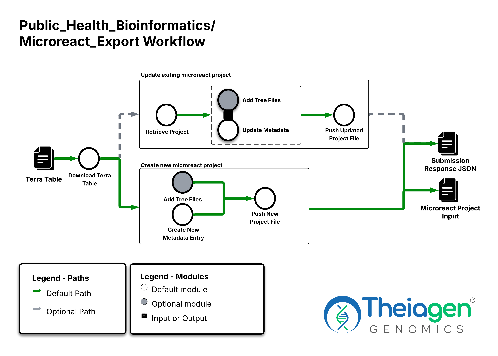

# Microreact_Export

## Quick Facts

{{ render_tsv_table("docs/assets/tables/all_workflows.tsv", sort_by="Name", filters={"Name": "[**Microreact_Export**](../workflows/data_export/microreact_export.md)"}, columns=["Workflow Type", "Applicable Kingdom", "Last Known Changes", "Command-line Compatibility","Workflow Level", "Dockstore"]) }}

## Microreact_Export_PHB

This workflow allows users to submit Terra data tables as metadata and phylogenetic trees resulting from other Terra run workflows directly to Microreact using their Access Token. A user can also update an existing Microreact project with a new metadata file or additional tree files. If an access token is unavailable users can manually upload the output project file to Microreact.   

!!! caption "Microreact_Export Diagram"
    

### Inputs

/// html | div[class="searchable-table"]

{{ render_tsv_table("docs/assets/tables/all_inputs.tsv", input_table=True, filters={"Workflow": 
"Microreact_Export"}, columns=["Terra Task Name", "Variable", "Type", "Description", "Default Value", "Terra Status"], sort_by=[("Terra Status", True), "Terra Task Name", "Variable"]) }}

///

### Workflow Tasks

{{ include_md("common_text/download_terra_table_task.md") }}

{{ include_md("common_text/microreact_export_task.md") }}

### Outputs

/// html | div[class="searchable-table"]

{{ render_tsv_table("docs/assets/tables/all_outputs.tsv", input_table=False, filters={"Workflow": "Microreact_Export"}, columns=["Variable", "Type", "Description"], sort_by=["Variable"]) }}

///

## References

> **Microreact**: Argimón S, Abudahab K, Goater R, Fedosejev A, Bhai J, Glasner C, Feil E, Holden M, Yeats C, Grundmann H, Spratt B, Aanensen D. 30/11/2016. M Gen 2(11): doi:10.1099/mgen.0.000093

