# BaseSpace_Fetch

## Quick Facts

| **Workflow Type** | **Applicable Kingdom** | **Last Known Changes** | **Command-line Compatibility** | **Workflow Level** |
|---|---|---|---|---|
| [Data Import](../../workflows_overview/workflows_type.md/#data-import) | [Any taxa](../../workflows_overview/workflows_kingdom.md/#any-taxa) | PHB v1.3.0 | Yes | Sample-level |

## BaseSpace_Fetch_PHB

The `BaseSpace_Fetch` workflow facilitates the transfer of Illumina sequencing data from BaseSpace (a cloud location) to a workspace on the [Terra.bio](http://Terra.bio) platform. Rather than downloading the files to a local drive and then re-uploading them to another location, we can perform a cloud-to-cloud transfer with the `BaseSpace_Fetch` workflow.

### Setting up BaseSpace_Fetch

Some initial set-up is required to use the workflow. To access one's BaseSpace account from within a workflow on Terra.bio, it is necessary to retrieve an access token and the API server address using the BaseSpace command-line tool. The access token is unique to a BaseSpace account. If it is necessary to transfer data from multiple BaseSpace accounts, multiple access tokens will need to be retrieved. Please see the ["Retrieving BaseSpace Access Credentials"](#retrieving-basespace-access-credentials) section below.

#### Retrieving BaseSpace Access Credentials

This process must be performed on a command-line before using the `BaseSpace_Fetch` workflow for the first time. This can be set up in Terra, however it will work in any command-line environment that has access to the internet to install & run the BaseSpace command-line tool: `bs`.

_If you already have a command-line environment available_, you can skip ahead to [Step 2](#install-bs-cli).

##### Step 1: Create a command-line environment  {#create-environment} 

??? toggle "Click for more information"

    1. Select the "Environment Configuration" cloud icon on the right side of the workspace dashboard tab

        !!! caption narrow "Click on the cloud icon to access the environment configuration"
            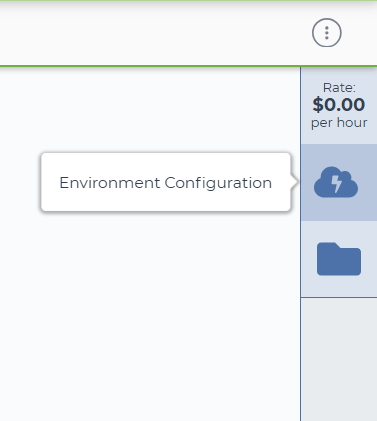

    2. Select the "Settings" button under Jupyter

        !!! caption narrow "Click on Settings underneath the Jupyter icon"
            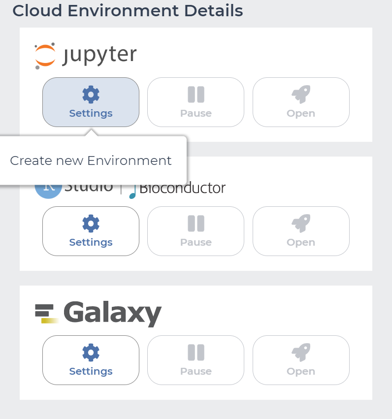

    3. Click "CREATE" at the bottom of the "Jupyter Cloud Environment" page. There is no need to alter the default environment configuration.

        !!! caption narrow "Click on Create at the bottom of the page"
            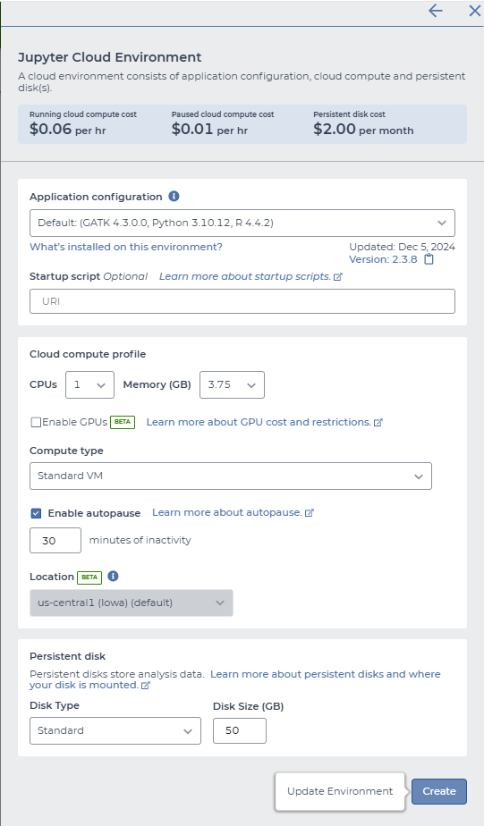

        !!! info "Environment customization"
            The default environment should be sufficient for retrieval of BaseSpace credentials, but if performing other tasks in the environment please modify the resource allocations appropriately. 

        You will be returned to the main page after clicking "Create". You will notice two new icons in your right-hand side bar as the environment is being created.

        !!! caption narrow "Environment creation in progress"
            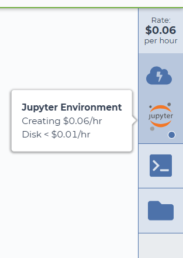

##### Step 2: Install the BaseSpace Command-Line Tool to Retrieve the Access Token and API Server Address  {#install-bs-cli} 

??? toggle "Click for more information"

    1. When the environment is created and active, you should see a green dot in the bottom right corner of the Jupyter icon. Click on the "Terminal" icon in the right side-bar of the Terra dashboard to open the terminal.

        !!! caption narrow "Open the terminal"
            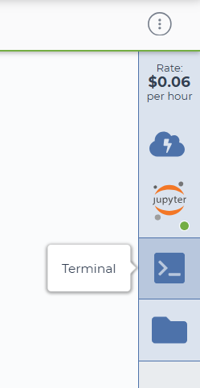

        The open terminal will appear in a new tab in your browser and will look similar to this:

        !!! caption narrow "The terminal window"
            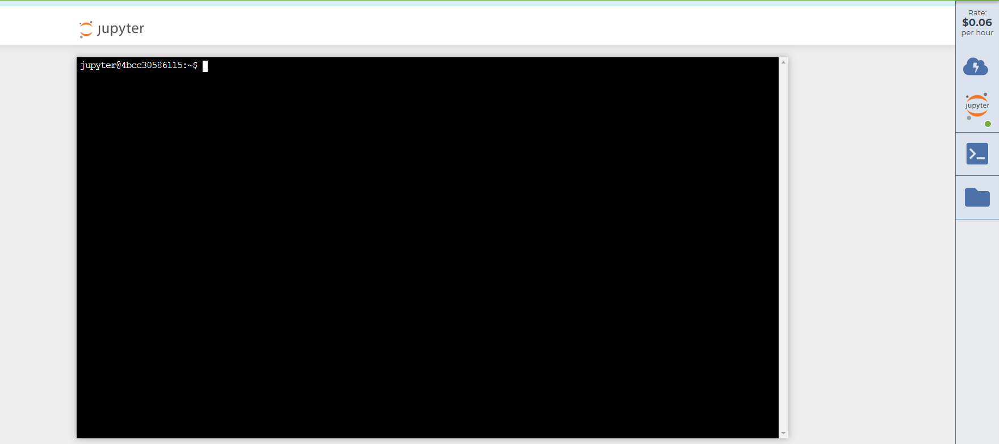

    2. Download and setup the BaseSpace (BS) command line interface (CLI) tool (as per [the Illumina documentation](https://developer.basespace.illumina.com/docs/content/documentation/cli/cli-overview)) by following the commands below. The lines beginning with `#` are comments, the following lines are the commands to be copy/pasted into the terminal

        ```bash  title="BaseSpace Fetch Authentication Instructions"
        # create bin directory
        mkdir ~/bin
        
        # download the basespace cli
        wget "https://launch.basespace.illumina.com/CLI/latest/amd64-linux/bs" -O $HOME/bin/bs
        
        # provide proper permissions to make the bs cli executable 
        chmod u+x $HOME/bin/bs
        
        # add the 'bs' command-line tool to the $PATH variable so that you can call the command-line tool from any directory
        export PATH="$PATH:$HOME/bin/"
        
        # authenticate with BaseSpace credentials
        bs auth
        
        # navigate to the link provided in stdout and accept the authentication request through BaseSpace
        
        # Print the api server and access token to stdout (replace the path below with the appropriate path returned by the find command above)
        cat ~/.basespace/default.cfg
        ```

    3. Copy and paste the contents of the `~/.basespace/default.cfg` (specifically, the **access_token** & **API server** details) of the `default.cfg` file into Terra as workspace data elements.
        1. Navigate to the Terra "DATA" tab, and select "Workspace Data" at the bottom of the left sidebar.
        2. Click on "Edit" and then "Add variable" to add the new workspace data elements as in the examples below.

        !!! caption narrow "Create workspace data elements"
            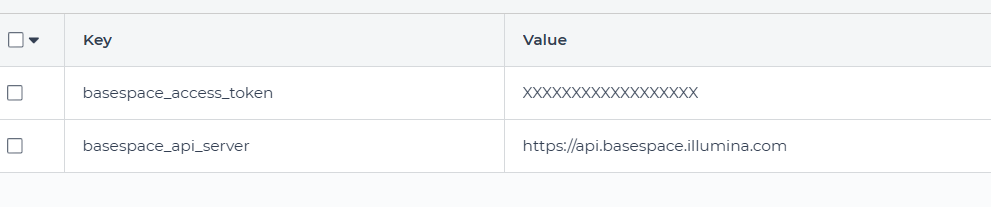
        
#### Preparing to retrieve a run with BaseSpace_Fetch

##### Step 1: Create a Metadata Sheet from the BaseSpace SampleSheet  {#prep-metadata} 

??? toggle "Click for more information"

    !!! tip "Best Practices for Sample Identifiers"
        - Avoid the use of underscores and whitespaces in the BaseSpace Project/Run name and/or the sample identifiers
        - Underscores in a sample name may lead to BaseSpace_Fetch failure
        - Avoid re-using Sample IDs. Make all sample IDs unique!

    1. Download the sample sheet from BaseSpace.
   
        On the BaseSpace portal, you can navigate to this via: Runs → {run} → Files → SampleSheet.csv

        !!! caption narrow "Example SampleSheet.csv"
            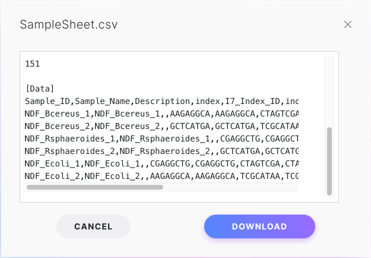

    2. In Excel or an alternative spreadsheet software, set up a metadata sheet for Terra, with a row for each sample. Please feel free to use our [BaseSpace_Fetch Template](https://storage.googleapis.com/theiagen-public-files/terra/training_resources/bs_fetch_template_20231103.tsv) to help ensure the file is formatted correctly.  
        1. In cell A1, enter the data table name with the "**entity:**TABLENAME**_id**" format
        2. Create a column called `basespace_sample_name` and populate this with the data found under the `Sample_Name` column in the BaseSpace sample sheet.

            !!! warning "Watch out"
                If the contents of the `Sample_Name` and `Sample_ID` columns in the BaseSpace sample sheet are different, make a `basespace_sample_id` column in your spreadsheet and populate this with the data found under the `Sample_ID` column in the BaseSpace sample sheet.

        3. Create a `basespace_collection_id` column, and populate it with the BaseSpace Project or Run identifier
        4. Populate column A of the spreadsheet with the sample names as seen in the sample sheet

            !!! caption narrow "Example Metadata Sheet"
                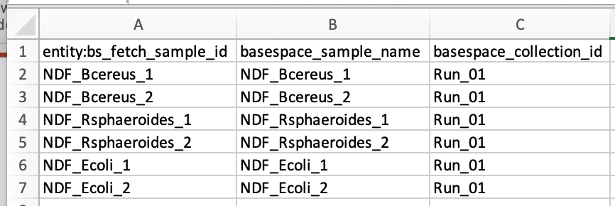

##### Step 2: Upload the metadata spreadsheet to the destination workspace in Terra.bio  {#upload-metadata} 

??? toggle "Click for more information"

    1. In Terra, navigate to the "DATA" tab, click "IMPORT DATA" then "Upload TSV"

        !!! caption narrow "Upload TSV"
            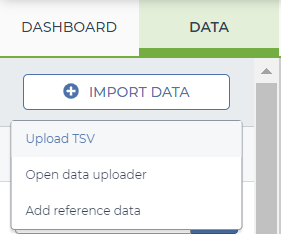

    2. Copy and paste the contents of the whole spreadsheet into the "TEXT IMPORT" tab and click "START IMPORT JOB"

        !!! caption narrow "Import Metadata"
             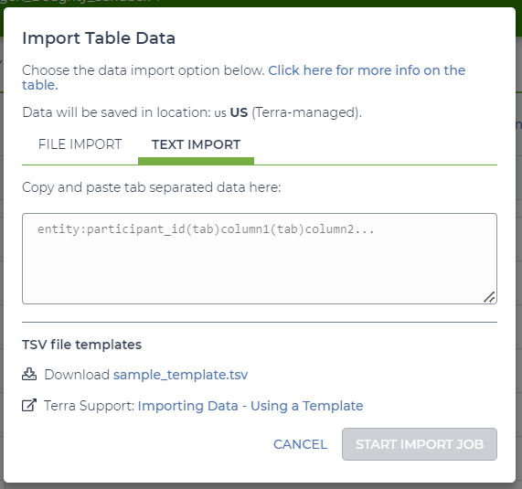
        
    You can now use the created table to run the BaseSpace_Fetch workflow.

### Inputs

!!! info "Call-Caching Disabled"
    If using BaseSpace_Fetch workflow version 1.3.0 or higher, the call-caching feature of Terra has been DISABLED to ensure that the workflow is run from the beginning and data is downloaded fresh. Call-caching will not be enabled, even if the user checks the box ✅ in the Terra workflow interface.

!!! warning "Sample_Name _and_ Sample_ID"
    If the Sample_Name and Sample_ID in the BaseSpace sample sheet are different, set the `basespace_sample_id` input attribute to "`this.basespace_sample_id"`.

/// html | div[class="searchable-table"]

{{ input_table("docs/assets/input_tables/all_inputs.tsv", input_table=True, filter_column="Workflow", filter_values="BaseSpace_Fetch", columns=["Terra Task Name", "Variable", "Type", "Description", "Default Value", "Terra Status"], sort_by=[("Terra Status", True), "Terra Task Name", "Variable"]) }}

///

### Outputs

The outputs of this workflow will be the fastq files imported from BaseSpace into the data table where the sample ID information had originally been uploaded.

/// html | div[class="searchable-table"]

{{ input_table("docs/assets/output_tables/basespace_fetch_out.tsv", input_table=False) }}

///
