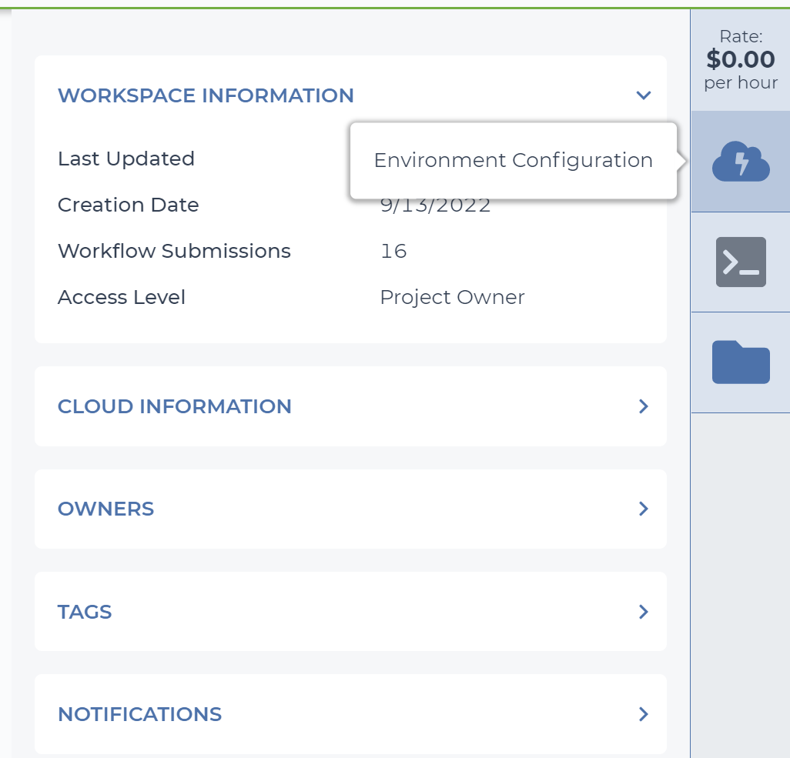
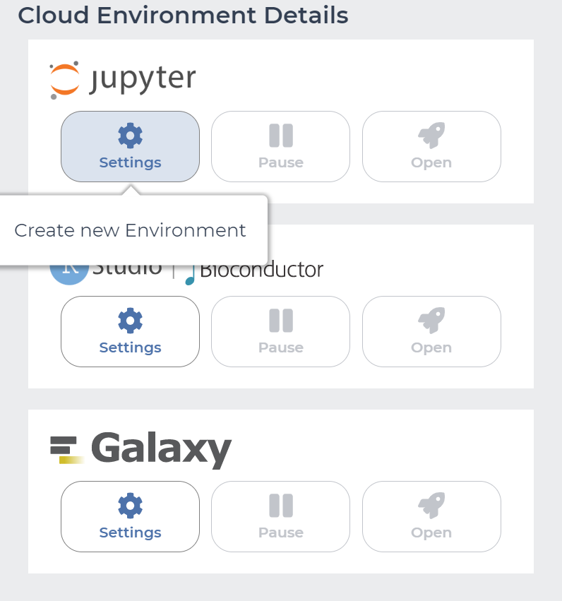
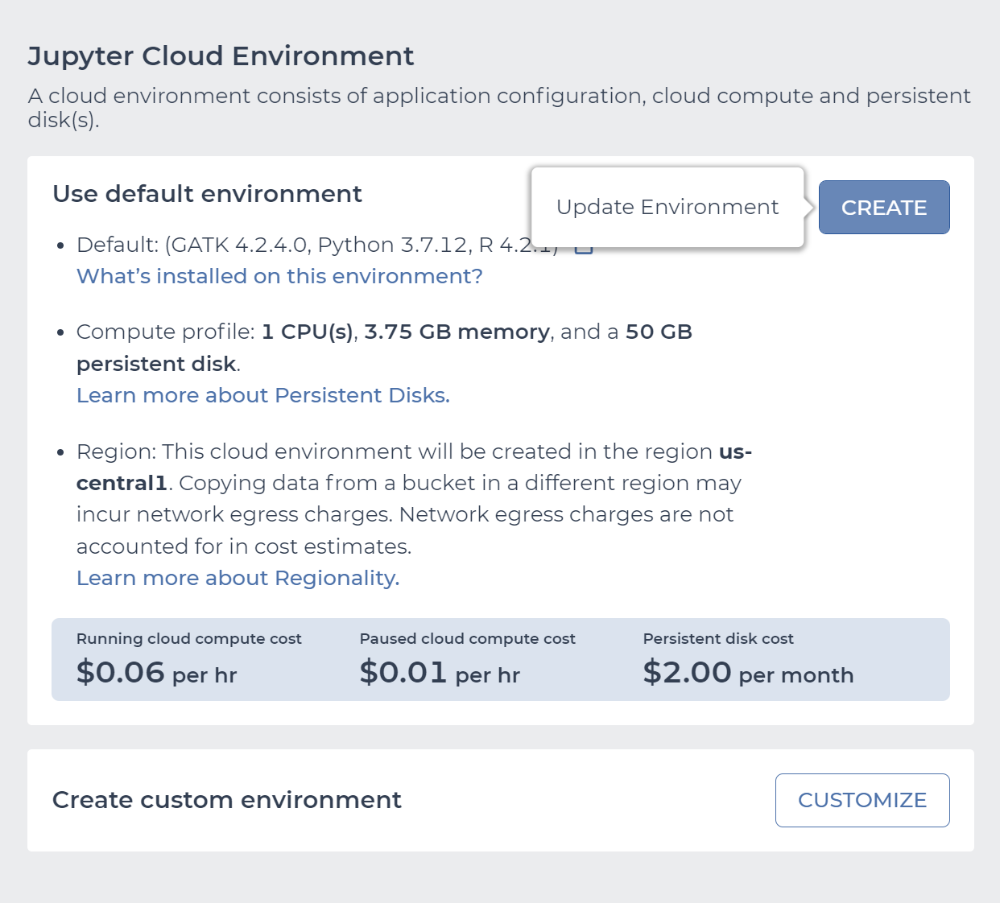
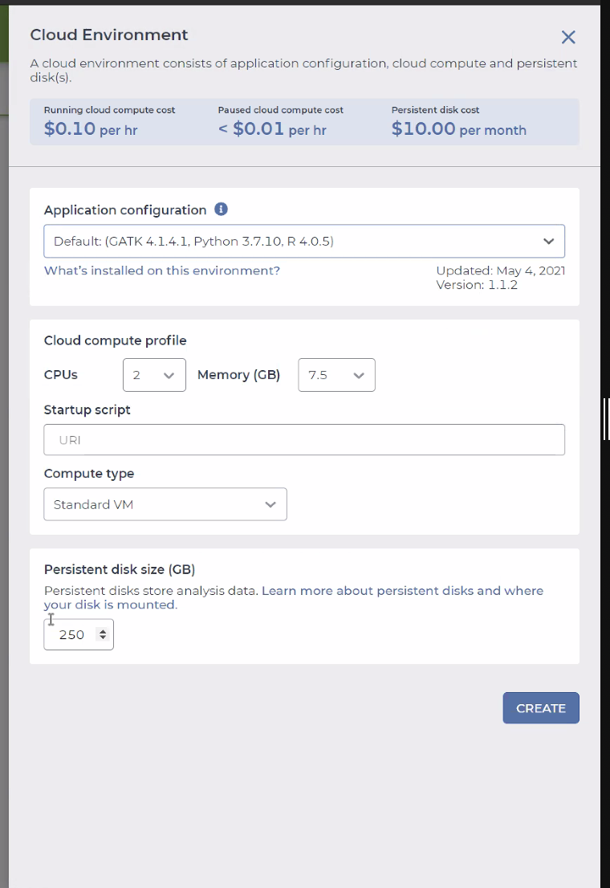
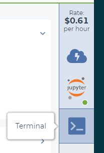
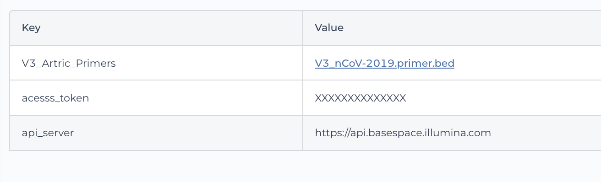
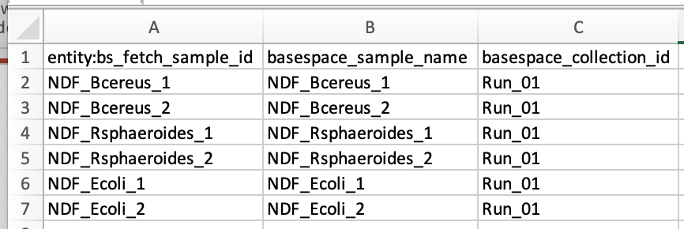
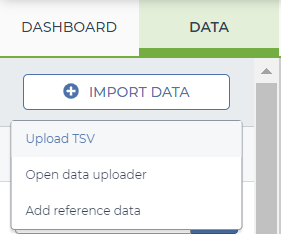
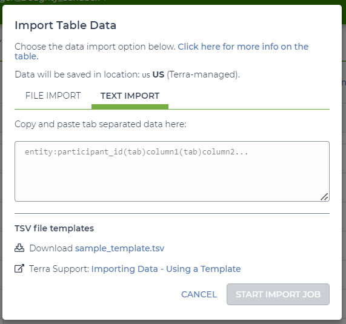
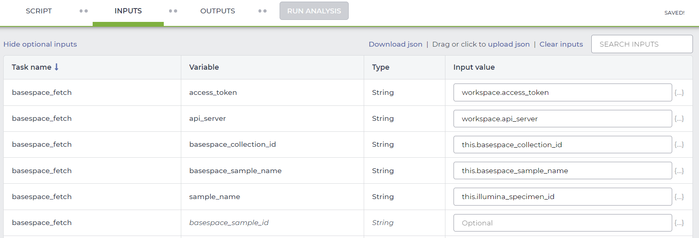

# BaseSpace_Fetch

## Quick Facts

| **Workflow Type** | **Applicable Kingdom** | **Last Known Changes** | **Command-line compatibliity** | **Workflow type** |
|---|---|---|---|---|
| [Data Import](../../workflows_overview/workflows-type.md/#data-import) | [Any taxa](../../workflows_overview/workflows-kingdom.md/#any-taxa) | PHB v1.3.0 | Yes | Sample-level |

## Setting up BaseSpace_Fetch

The `BaseSpace_Fetch` workflow facilitates the transfer of Illumina sequencing data from BaseSpace (a cloud location) to a workspace on the [Terra.bio](http://Terra.bio) platform. Rather than downloading the files to a local drive and then re-uploading them to another location, we can perform a cloud-to-cloud transfer with the `BaseSpace_Fetch` workflow.

Some initial set-up is required to use the workflow. To access one's BaseSpace account from within a workflow on Terra.bio, it is necessary to retrieve an access token and the API server address using the BaseSpace command line tool. The access token is unique to a BaseSpace account. If it is necessary to transfer data from multiple BaseSpace accounts, multiple access tokens will need to be retrieved. Please see the "Retrieving BaseSpace Access Credentials" section below.

In this document, we provide instructions for both the retrieval of the BaseSpace access token and running the BaseSpace_Fetch workflow.

### Retrieving BaseSpace Access Credentials

This process must be performed on a command line (ideally on a Linux or MacOS computer) before using the `BaseSpace_Fetch` workflow for the first time. This can be set up in Terra, however it will work in any command line environment that has access to the internet to install & run the BaseSpace command line tool: `bs`.

??? toggle "Click for more information"
    If you already have a command line environment available, you can skip ahead to Step 2.

    #### Step 1: Setup Jupyter Cloud Environment
    
    ??? toggle "Click for more information"

        1. Select the "Environment configuration" cloud icon on the right side of the workspace dashboard tab

            {width="50%"}

        2. Select the "Settings" button under Jupyter

            {width="50%"}

        3. Click "CREATE" in the "Use default environment section". There is no need to alter the default environment configuration.

            {width="50%"}


        4. Undertaking steps 1 and 2 again, you will see options to configure the environment.
            1. The default environment (default = GATK 4.1.4.1, Python 3.7..10, R 4.0.5) should be sufficient for retrieval of BaseSpace credentials, but if performing other tasks in the environment please modify the resource allocations appropriately. 
            2. You can use up to 4 CPUs which can help move things faster with multithreaded `gsutil`

            {width="50%"}

    #### Step 2: Install the BaseSpace Command Line Tool To Get The Access Token And API Server Address
    ??? toggle "Click for more information"

        1. Open the "Terminal" app in the right side-bar of the Terra dashboard

            {width="20%"}


        2. Download and setup BaseSpace (BS) CLI (as per Illumina documentation) by following the commands below. The lines beginning with `#` are comments, the following lines are the commands to be copy/pasted into the termina

            ```bash  title="BaseSpace Fetch Authentication Instructions"
            # create bin dir
            mkdir ~/bin
            
            # download bs cli
            wget "https://launch.basespace.illumina.com/CLI/latest/amd64-linux/bs" -O $HOME/bin/bs
            
            # provide proper permissions to bs cli executable 
            chmod u+x $HOME/bin/bs
            
            # add the 'bs' command line tool to the $PATH variable so that you can call the command line tool from any directory
            export PATH="$PATH:$HOME/bin/"
            
            # authenticate with BaseSpace credentials
            bs auth
            
            # navigate to the link provided in stdout and accept the authentication request through BaseSpace
            
            # Print the api server and access token to stdout (replace the path below with the appropriate path returned by the find command above)
            cat ~/.basespace/default.cfg
            ```

        3. Copy and paste the contents (**access_token** & **API server**) of the `default.cfg` file into Terra as workspace data elements.
            1. Navigate to the Terra "DATA" tab, and select "Workspace Data" at the bottom left of the page.
            2. You can use the ➕ icon to add the new workspace data elements as in the examples below.

            {width="50%"}

### Preparing to retrieve a run with BaseSpace_Fetch

??? toggle "Click for more information"

    !!! tip "Best Practices for Sample Identifiers"
        - Avoid the use of underscores and whitespaces in the BaseSpace Project/Run name and/or the sample identifiers
        - Underscores in a sample name will lead to BaseSpace_Fetch failure
        - Avoid re-using Sample IDs. Make all sample IDs unique!

    #### Prepare the metadata spreadsheet for the BaseSpace_Fetch workflow

    1. Download the sample sheet from BaseSpace.
        1. On the BaseSpace portal, you can navigate to this via: Runs → {run} → Files → SampleSheet.csv

        {width="50%"}


    2. In Excel, set up a metadata sheet for Terra, with a row for each sample. Please feel free to use our [BaseSpace_Fetch Template](https://storage.googleapis.com/theiagen-public-files/terra/training_resources/bs_fetch_template_20231103.tsv) to help ensure the file is formatted correctly.  
        1. In cell A1, enter the data table name with the "**entity:**NAME**_id**" format
        2. Create a column called `basespace_sample_name` and populate this with the data found under the `Sample_Name` column in the BaseSpace sample sheet.

            !!! warning "Watch out"
                If the contents of the `Sample_Name` and `Sample_ID` columns in the BaseSpace sample sheet are different, make a `basespace_sample_id` column in your spreadsheet and populate this with the data found under the `Sample_ID` column in the BaseSpace sample sheet.

        4. Create a `basespace_collection_id` column, and populate it with the BaseSpace Project or Run identifier
        5. Populate column A of the spreadsheet with the sample names

        {width="50%"}


    #### Upload the metadata spreadsheet to the destination workspace in Terra.bio

    1. In Terra, navigate to the "DATA" tab, click "IMPORT DATA" then "Upload TSV"

        {width="25%"}


    2. Copy and paste the contents of the whole spreadsheet into the "TEXT IMPORT" tab and click "START IMPORT JOB"

        {width="38%"}

## Using the BaseSpace_Fetch Workflow

### How to Run BaseSpace_Fetch on Terra

??? toggle "Click for more information"

    1. In the Terra "WORKFLOWS" tab, either:
        1. Select the `BaseSpace_Fetch` workflow OR
        2. Import the `BaseSpace_Fetch` workflow from [Dockstore via this link](https://dockstore.org/workflows/github.com/theiagen/public_health_bioinformatics/BaseSpace_Fetch_PHB:main?tab=versions).
    2. Set up the `BaseSpace_Fetch` workflow by selecting the:
        1. Version (latest numbered version) from the dropdown menu.
        2. Data table to use.
        3. Samples that you wan to import data for. 
    3. Set up the `BaseSpace_Fetch` "INPUTS" form as below. **Don't forget to fill out `this.basespace_sample_id` if your basespace sample IDs are different from the basespace sample names in the SampleSheet.csv file.**

        {width="50%"}

    4. In the "OUTPUTS" tab, select "use defaults", then click "SAVE".
    5. You can now run the workflow and import data for all the samples you have selected.

### **Inputs**

!!! info "Call Caching Disabled"
    If using BaseSpace_Fetch workflow version 1.3.0 or higher, the call-caching feature of Terra has been DISABLED to ensure that the workflow is run from the beginning and data is downloaded fresh. Call-caching will not be enabled, even if the user checks the box ✅ in the Terra workflow interface.

!!! warning "Sample_Name _and_ Sample_ID"
    If the Sample_Name and Sample_ID in the BaseSpace sample sheet are different, set the `basespace_sample_id` input attribute to "`this.basespace_sample_id"`.

This workflow runs on the sample level.

| **Terra Task Name** | **Variable** | **Type** | **Description** | **Default attribute** | **Terra Status** |
|---|---|---|---|---|---|
| basespace_fetch | **access_token** | String | The access token is used in place of a username and password to allow the workflow to access the user account in BaseSpace from which the data is to be transferred. It is an alphanumeric string that is 32 characters in length. Example: 9e08a96471df44579b72abf277e113b7 | | Required |
| basespace_fetch | **api_server** | String | The API server is the web address to which data transfer requests can be sent by the workflow. Use this API server if you are unsure: `"https://api.basespace.illumina.com"` (this is the default set by the command line tool) | | Required |
| basespace_fetch | **basespace_collection** | String | The collection ID is the BaseSpace Run or Project where the data to be transferred is stored. | | Required |
| basespace_fetch | **basespace_sample_name** | String | The BaseSpace sample name is the sample identifier used in BaseSpace. This identifier is set on the sample sheet at the onset of an Illumina sequencing run. | | Required |
| basespace_fetch | **sample_name** | String | The sample name is the sample identifier used in the Terra.bio data table corresponding to the metadata associated with the sample to be transferred from BaseSpace | | Required |
| basespace_fetch | **basespace_sample_id** | String | The BaseSpace sample ID is an optional additional identifier used in BaseSpace. If a sample has a BaseSpace sample ID it should be available on the sample sheet and must be included in the metadata sheet upload prior to running BaseSpace_Fetch. | | Optional |
| fetch_bs | **cpu** | Int | This input is the number of CPU's used in the data transfer. To facilitate the transfer of many files this runtime parameter may be increased. | 2 | Optional |
| fetch_bs | **disk_size** | Int | The disk size is the amount of storage in GigaBytes (GB) requested for the VM to run the data transfer task. | 100 | Optional |
| fetch_bs | **docker_image** | String | The Docker image used to run BaseSpace_Fetch task. | "us-docker.pkg.dev/general-theiagen/theiagen/basespace_cli:1.2.1" | Optional |
| fetch_bs | **memory** | Int | The memory is the amount of RAM/memory requested for running the data transfer task. | 8 | Optional |
| version_capture | **docker** | String | The Docker image used to run the version_capture task | "us-docker.pkg.dev/general-theiagen/theiagen/alpine-plus-bash:3.20.0" | Optional |
| version_capture | **timezone** | String | Set the time zone to get an accurate date of analysis (uses UTC by default) |  | Optional |

### **Outputs**

The outputs of this workflow will be the fastq files imported from BaseSpace into the data table where the sample ID information had originally been uploaded.

| **Variable** | **Type** | **Description** |
|---|---|---|
| basespace_fetch_analysis_date | String | Date of download |
| basespace_fetch_version | String | Version of the workflow |
| read1 | File | File with forward-facing reads |
| read2 | File | File with reverse-facing read |
