# BaseSpace_Fetch

## Quick Facts

{{ render_tsv_table("docs/assets/tables/all_workflows.tsv", sort_by="Name", filters={"Name": "[**BaseSpace_Fetch**](../workflows/data_import/basespace_fetch.md)"}, columns=["Workflow Type", "Applicable Kingdom", "Last Known Changes", "Command-line Compatibility","Workflow Level", "Dockstore"]) }}

## BaseSpace_Fetch_PHB

The `BaseSpace_Fetch` workflow facilitates the transfer of Illumina sequencing data from BaseSpace (a cloud location) to a workspace on the [Terra.bio](http://Terra.bio) platform. Rather than downloading the files to a local drive and then re-uploading them to another location, we can perform a cloud-to-cloud transfer with the `BaseSpace_Fetch` workflow.

**What you need before you start:**

- A BaseSpace account with access to the **Run** or **Project** holding your data.
- A BaseSpace access token.
- A Terra data table with one row per sample.

---

## Step 1 — Get your `access_token`  {#step-1-access-token} 

This workflow requires a BaseSpace access token to authenticate your BaseSpace account and download FASTQ files from your Runs/Projects. Each `access_token` is tied to a single BaseSpace account, so you'll need a separate token for every account you want the workflow to access. The simplest way to obtain this token is with the BaseSpace command-line tool (`bs`), described below.

_Already have a command-line environment available?_ You can skip ahead to [1.2 `bs` CLI installation](#install-bs-cli).

### 1.1 Create a command-line environment

??? toggle "Click for more information"

    1. Select the "Environment Configuration" cloud icon on the right side of the workspace dashboard tab

        !!! caption narrow "Click on the cloud icon to access the environment configuration"
            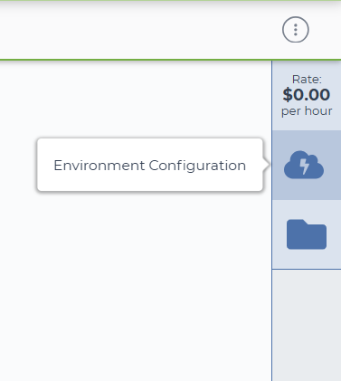

    2. Select the "Settings" button under Jupyter

        !!! caption narrow "Click on Settings underneath the Jupyter icon"
            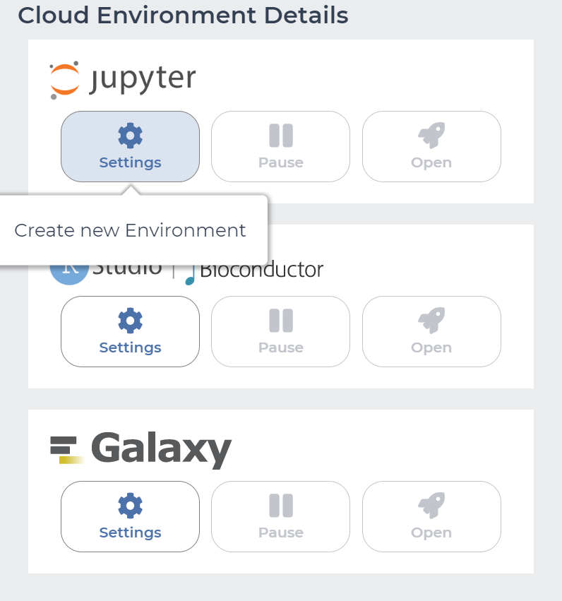

    3. Click "CREATE" at the bottom of the "Jupyter Cloud Environment" page. There is no need to alter the default environment configuration.

        !!! caption narrow "Click on Create at the bottom of the page"
            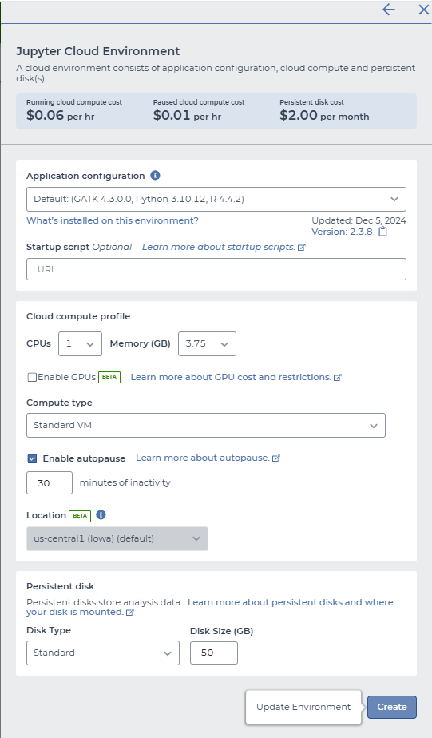

        !!! info "Environment customization"
            The default environment should be sufficient for retrieval of BaseSpace credentials, but if performing other tasks in the environment please modify the resource allocations appropriately.

        You will be returned to the main page after clicking "Create". You will notice two new icons in your right-hand side bar as the environment is being created.

        !!! caption narrow "Environment creation in progress"
            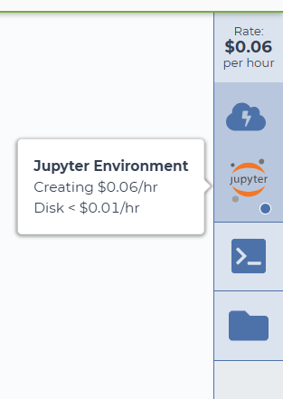

### 1.2 Install the BaseSpace command-line tool and retrieve the access token  {#install-bs-cli} 

??? toggle "Click for more information"

    1. When the environment is created and active, you should see a green dot in the bottom right corner of the Jupyter icon. Click on the "Terminal" icon in the right side-bar of the Terra dashboard to open the terminal.

        !!! caption narrow "Open the terminal"
            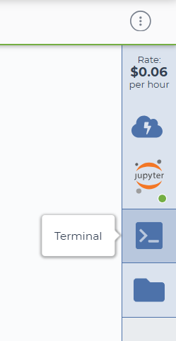

        The open terminal will appear in a new tab in your browser and will look similar to this:

        !!! caption narrow "The terminal window"
            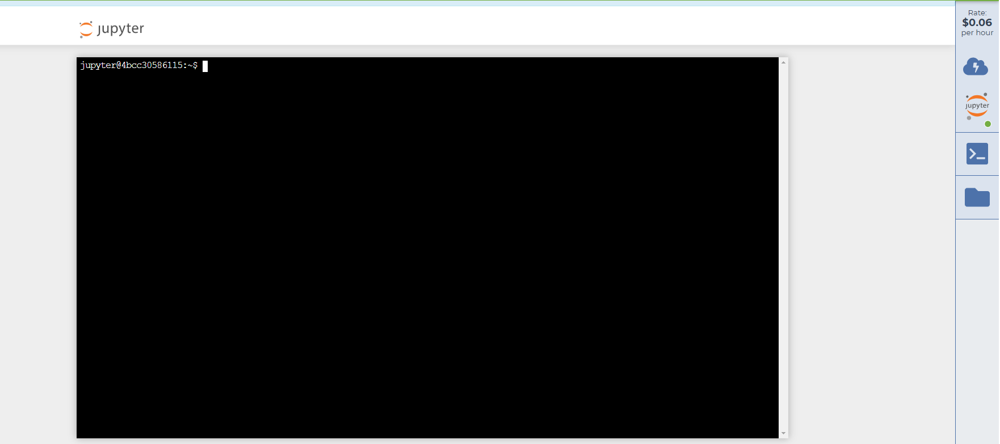

    2. Download and setup the BaseSpace (BS) command line interface (CLI) tool (as per [the Illumina documentation](https://developer.basespace.illumina.com/docs/content/documentation/cli/cli-overview)) by following the commands below. The lines beginning with `#` are comments, the following lines are the commands to be copy/pasted into the terminal

        ```bash  title="BaseSpace Fetch Authentication Instructions"
        # create bin directory
        mkdir ~/bin

        # download the basespace cli
        wget "https://launch.basespace.illumina.com/CLI/latest/amd64-linux/bs" -O $HOME/bin/bs

        # provide proper permissions to make the bs cli executable
        chmod u+x $HOME/bin/bs

        # add the 'bs' command-line tool to the $PATH variable so that you can call the command-line tool from any directory
        export PATH="$PATH:$HOME/bin/"

        # authenticate with BaseSpace credentials
        bs auth

        # navigate to the link provided in stdout and accept the authentication request through BaseSpace

        # Print the api server and access token to stdout
        cat ~/.basespace/default.cfg
        ```

### 1.3 Store the token as Terra workspace data  {#store-token} 

??? toggle "Click for more information"

    Copy the contents of `~/.basespace/default.cfg` (specifically the **accessToken** and **API server** details) into Terra as a workspace data elements. Storing this here means you can enter the token and API url once per workspace instead of repeating it on every row of every data table.

    1. Navigate to the Terra "DATA" tab, and select "Workspace Data" at the bottom of the left sidebar.
    2. Click on "Edit" and then "Add variable" to add the new workspace data elements as in the examples below.

    !!! caption narrow "Create workspace data elements"
        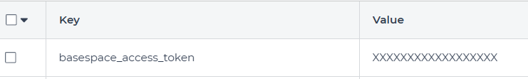

    When you launch the workflow, point the `access_token` input at this variable using `workspace.basespace_access_token`.

    !!! info "Pulling from more than one BaseSpace account in a single run"
        `access_token` is an ordinary workflow input, so it does not _have_ to come from workspace data. If different samples live under different BaseSpace accounts, add an `access_token` column to your data table and point the input at `this.access_token` instead.

---

## Step 2 — Find your `basespace_collection_id`  {#step-2-collection-id} 

In this guide, a "collection" refers to the BaseSpace **Run** or **Project** that contains your FASTQ files. The examples below show where to find the **Run** or **Project** name/numeric ID to enter as your `basespace_collection_id`. Either the collection name or its numeric ID can be used.

??? toggle "If your collection is a **Run**"
    !!! caption "BaseSpace Run - Collection IDs"
        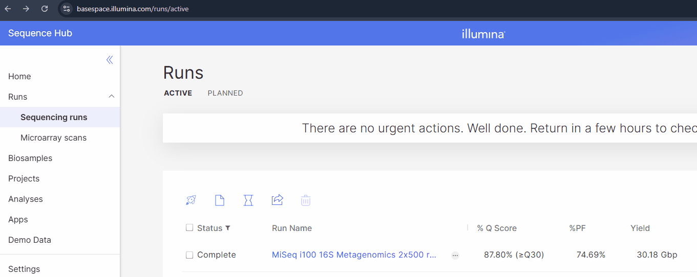

??? toggle "If your collection is a **Project**"
    !!! caption "BaseSpace Project - Collection IDs"
        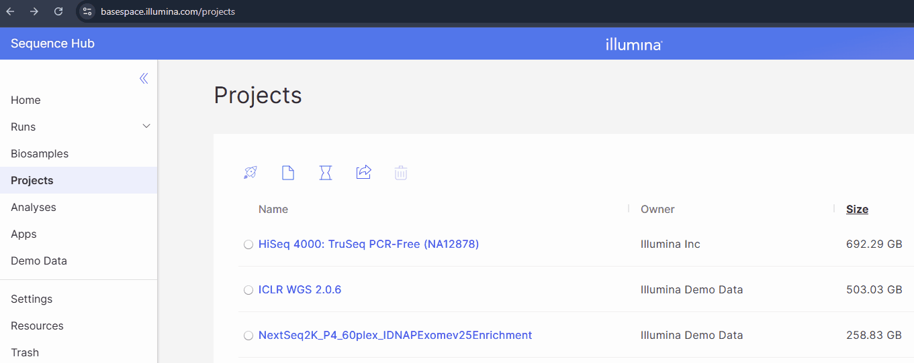

**Recommendation: use the numeric ID from the URL.** It is unambiguous, it never changes, and it avoids every problem below:

??? warning "Warnings for `basespace_collection_id`"
    - **Matching is exact and case-sensitive.** BaseSpace's own search box is forgiving about case and partial words; this workflow is not.
    - **Only Runs and Projects are supported.** A biosample, an app result, or an analysis cannot be used as a `basespace_collection_id`.
    - **If nothing matches `basespace_collection_id`**, you'll get the error:
      ```
      Could not resolve input collection ID `X`: no project or run exactly matches it by id or name.
      ```
    - **If more than one thing matches `basespace_collection_id`** - for example a Run and a Project sharing the same name, you'll get the error:
      ```
      Input collection ID `X` is ambiguous; it matches: [...]. Provide a more specific id or name.
      ```

---

## Step 3 — Find your `basespace_sample_name`  {#step-3-sample-name} 

`basespace_sample_name` is matched against the **_datasets_** inside your "collection". These **_datasets_** are shown under the **_FastQ Dataset_** column for a Run, or the **_Dataset Name_** column for a Project.

### 3.1 Finding **_datasets_** in BaseSpace  {#step-3.1-finding-datasets} 

??? toggle "If your collection is a **Run**"

    Open the **Run** tab and go to the **Biosamples** tab. The values in the **_FastQ Dataset_** column are the dataset names.

    !!! caption "BaseSpace Run - **_FastQ Dataset_**"
        

??? toggle "If your collection is a **Project**"

    Open the project and go to the **FASTQs** tab. The values in the **_Dataset Name_** column are the dataset names.

    !!! caption "BaseSpace Project - **_Dataset Name_**"
        

### 3.2 How your `basespace_sample_name` name is matched

The workflow searches for each `basespace_sample_name` in the following order, stopping after the first successful match:

1. **Exact dataset name.** If a dataset name **exactly** matches the value you provided, that dataset is used to retrieve the associated FASTQ files.
2. **Lane-suffixed datasets.** If no dataset name **exactly** matches the value you provided, and `group_by_lane` is `true` (the default), the workflow searches for datasets with that value followed by a lane suffix. FASTQ files from matching datasets are then merged into a single R1/R2 pair.

    !!! info "Note"
        A dataset is considered a lane-suffixed dataset if removing its lane suffix (for example, `_L001` or `-L001`) leaves a name that **exactly** matches the value you provided. See examples below.

!!! info "Note"
    All output FASTQ files are written as `{TABLENAME_id}_R1.fastq.gz` / `{TABLENAME_id}_R2.fastq.gz` using the first column of your Terra table, not from `basespace_sample_name`. See [Step 4](#step-4-data-table).

### 3.3 Worked examples

Each example below lists the datasets that exist in a collection, then shows what a given `basespace_sample_name` resolves to with `group_by_lane` on (the default) and off.

??? toggle "A sample split across lanes (most common)"

    ```
    Dataset Name:

    Sample-2026-001_L001
    Sample-2026-001_L002
    Sample-2026-001_L003
    Sample-2026-001_L004
    Sample-2026-0010_L001
    ```

    | `basespace_sample_name` | `group_by_lane = true` (default) | `group_by_lane = false` |
    | --- | --- | --- |
    | `Sample-2026` | ❌ Fails — `No exact dataset match` | ❌ Fails — `No exact dataset match` |
    | `sample-2026-001` | ❌ Fails — `No exact dataset match` | ❌ Fails — `No exact dataset match` |
    | `Sample-2026-001` | ✅ All four lanes merged into **one** R1/R2 pair | ❌ Fails — `Partial dataset match` |
    | `Sample-2026-001_L001` | ✅ Lane 1 only, on its own | ✅ Lane 1 only, on its own |

    !!! warning "Note"
        Writing the **lane-less** sample name is what triggers grouping. A name that already carries a lane suffix is an exact match, so it returns just that one lane whether or not `group_by_lane` is on.

    !!! warning "Note"
        `Sample-2026-0010_L001` is never swept in by `Sample-2026-001`. The lane suffix is removed and what remains (`Sample-2026-0010`) has to equal your string **exactly**.

??? toggle "An un-laned dataset sitting alongside lanes"

    ```
    Dataset Name:

    Sample-2026-002
    Sample-2026-002_L001
    Sample-2026-002_L002
    ```

    | `basespace_sample_name` | `group_by_lane = true` (default) | `group_by_lane = false` |
    | --- | --- | --- |
    | `Sample-2026-002` | ⚠️ Only the `Sample-2026-002` dataset (PASSES with warning) | ⚠️ Only the `Sample-2026-002` dataset (PASSES with warning) |
    | `Sample-2026-002_L001` | ✅ Lane 1 only, on its own | ✅ Lane 1 only, on its own |

    !!! warning "Note"
        An exact dataset name always wins, so `group_by_lane` changes nothing here. Although rare, this is the one case where you can quietly end up with a different result than you expected.

### 3.4 Starting from a SampleSheet.csv

If you have the Run's sample sheet, its `Sample_ID` column is a good starting point:

```
Runs → {run} → Files → SampleSheet.csv
```

Treat those values as a strong starting point rather than the authoritative answer. Per Illumina's [BaseSpace data model](https://knowledge.illumina.com/software/cloud-software/software-cloud-software-reference_material-list/000007009), `Sample_ID` becomes the **biosample** name and `Sample_Name` becomes the **library** name. A FASTQ dataset is a separate object produced downstream by demultiplexing, so while the `Sample_ID` often matches the resulting dataset name, it is not guaranteed to. In practice, if the FASTQ dataset name differs from the `Sample_ID`, it's usually because a lane suffix was added.

!!! warning "Note"
    Always verify the `Sample_ID` value against the dataset sources shown in [Step 3.1](#step-3.1-finding-datasets) before using it. The SampleSheet.csv column names do not necessarily correspond directly to this workflow's inputs.

---

## Step 4 — Build the Terra data table  {#step-4-data-table} 

In Excel or an alternative spreadsheet software, set up a data table for Terra, with a row for each sample. Please feel free to use our [BaseSpace_Fetch Template](https://storage.cloud.google.com/theiagen-public-resources-rp/reference_data/family_agnostic/bs_fetch_template_20231103.tsv) to help ensure the file is formatted correctly.

1. In the first column's **header**, enter the data table name with the format `entity:TABLENAME_id`.
2. Populate the first column with a unique identifier for each sample. This value can be the same as the corresponding `basespace_sample_name` or any other name you choose, as long as no two rows have the same value.

    !!! warning "This column determines your final FASTQ filenames"
        The FASTQ files downloaded from your BaseSpace **Run** or **Project** are renamed to `{TABLENAME_id}_R1.fastq.gz` / `{TABLENAME_id}_R2.fastq.gz` using the value in the first column, **not** `basespace_sample_name`.

3. Create a `basespace_sample_name` column and populate it with the samples found in [Step 3](#step-3-sample-name).
4. Create a `basespace_collection_id` column and populate it with the BaseSpace Project or Run identifier from [Step 2](#step-2-collection-id).

??? toggle "Example Terra data table"
    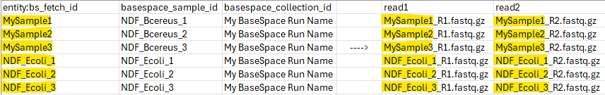

---

## Step 5 — Upload the data table to Terra  {#step-5-upload} 

??? toggle "Click for more information"

    1. In Terra, navigate to the "DATA" tab, click "IMPORT DATA" then "Upload TSV"

        !!! caption narrow "Upload TSV"
            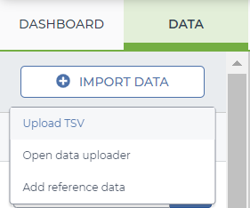

    2. Copy and paste the contents of the whole spreadsheet into the "TEXT IMPORT" tab and click "START IMPORT JOB"

        !!! caption narrow "Import Metadata"
             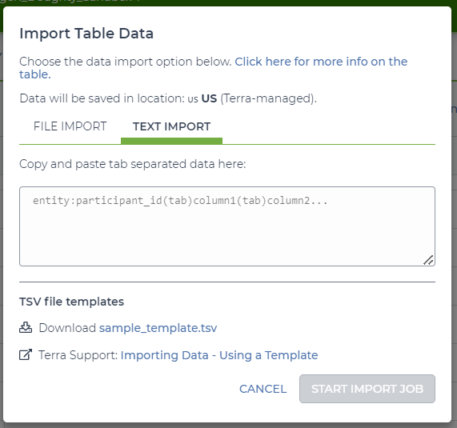

    You can now use the created table to run the BaseSpace_Fetch workflow.

---

## Inputs

!!! info "Call-Caching Disabled"
    If using BaseSpace_Fetch workflow version 1.3.0 or higher, the call-caching feature of Terra has been DISABLED to ensure that the workflow is run from the beginning and data is downloaded fresh. Call-caching will not be enabled, even if the user checks the box ✅ in the Terra workflow interface.

/// html | div[class="searchable-table"]

{{ render_tsv_table("docs/assets/tables/all_inputs.tsv", input_table=True, filters={"Workflow": "BaseSpace_Fetch"}, columns=["Terra Task Name", "Variable", "Type", "Description", "Default Value", "Terra Status"], sort_by=[("Terra Status", True), "Terra Task Name", "Variable"]) }}

///

## Outputs

The outputs of this workflow will be the fastq files imported from BaseSpace into the data table where the sample ID information had originally been uploaded.

/// html | div[class="searchable-table"]

{{ render_tsv_table("docs/assets/tables/all_outputs.tsv", input_table=False, filters={"Workflow": "BaseSpace_Fetch"}, columns=["Variable", "Type", "Description"], sort_by=["Variable"]) }}

///
