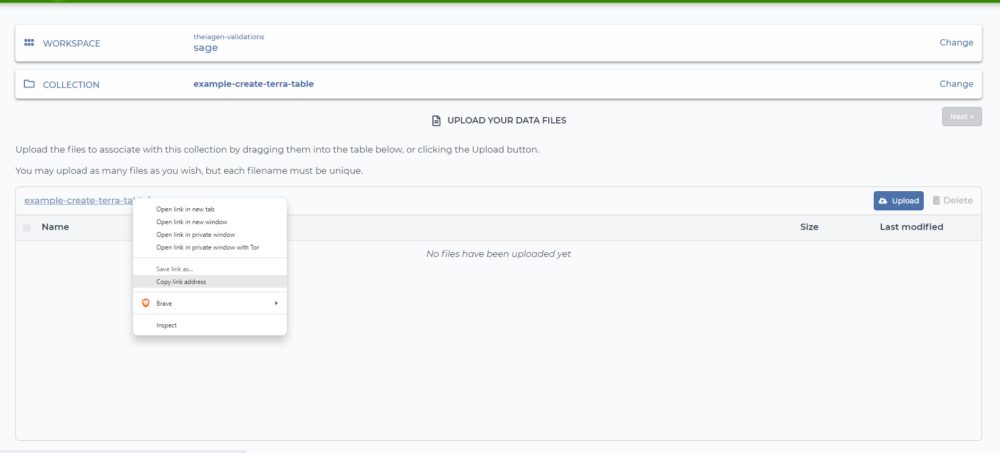
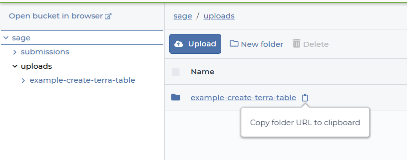

# Create_Terra_Table

## Quick Facts

| **Workflow Type** | **Applicable Kingdom** | **Last Known Changes** | **Command-line Compatibility** | **Workflow Level** |
|---|---|---|---|---|
| [Data Import](../../workflows_overview/workflows_type.md/#data-import) | [Any taxa](../../workflows_overview/workflows_kingdom.md/#any-taxa) | PHB v2.2.0 | Yes | Sample-level |

## Create_Terra_Table_PHB

The manual creation of Terra tables can be tedious and error-prone. This workflow will automatically create a Terra data table when provided with the location of the files.

We recommend running this workflow with **"Run workflow with inputs defined by file paths"** selected in Terra. This will allow you to upload your data files and provide the necessary information for the workflow to run without having to specify a data table. There are no outputs for this workflow, as the table is created in your workspace.

### Inputs

!!! warning "Default Behavior"
    Files with underscores and/or decimals in the sample name are not recognized; please use dashes instead.

    For example, `name.banana.hello_yes_please.fastq.gz` will become "name". This means that `se-test_21.fastq.gz` and `se-test_22.fastq.gz` will not be recognized as separate samples.

    **_This can be changed_** by providing information in the `file_ending` optional input parameter. See below for more information.

#### Finding the `data_location_path` {#data-location}

??? toggle "Using the Terra data uploader"
    Once you have named your new collection, you will see the collection name directly above where you can drag-and-drop your data files, or on the same line as the Upload button. Right-click the collection name and select "Copy link address." Paste the copied link into the data_location_path variable, remembering to enclose it in quotes.

    !!! info "Note"
        If you click "Next" after uploading your files, it will ask for a metadata TSV. You do not have to provide this, and can instead exit the window. Your data will still be uploaded.
    
    !!! caption narrow "Using the Terra data uiploader"
        

??? toggle "Using the Files section in Terra"
    You can browse workspace files by clicking on the folder icon in the right-hand sidebar of the Data tab in Terra.

    Navigate to the folder where your data is ("example-create-terra-table" in this example) and click on the clipboard next to the folder name to "Copy folder URL to clipboard."

    If you uploaded data with the Terra data uploader, your collection will be nested in the "uploads" folder.

    !!! caption narrow "Using the Files section"
        

#### How to determine the appropriate `file_ending` for your data {#file-ending}

The `file_ending` should be a substring of your file names that is held in common. To include multiple file endings, please separate them with commas, as shown in the "No elements in common" section. Click on the toggles below for examples:

??? example "_One or more_ elements in common"
    If you have the following files:

    - sample_01_R1.fastq.gz
    - sample_01_R2.fastq.gz
    - sample_02_R1.fastq.gz
    - sample_02_R2.fastq.gz

    The default behavior would result in a single entry in the table called "sample" which is incorrect. You can rectify this by providing an appropriate `file_ending` for your samples.

    In this group, the desired sample names are "sample_01" and "sample_02". For all the files following the desired names, the text contains `_R`. If we provide "_R" as our `file_ending`, then "sample_01" and "sample_02" will appear in our table with the appropriate read files.

??? example "_No_ elements in common"
    If you have the following files:

    - sample_01_1.fastq.gz
    - sample_01_2.fastq.gz
    - sample_02_1.fastq.gz
    - sample_02_2.fastq.gz

    The default behavior would result in a single entry in the table called "sample" which is incorrect. You can rectify this by providing an appropriate `file_ending` for your samples.

    In this group, the desired sample names are "sample_01" and "sample_02". However, in this example, there is no common text following the sample name. Providing `"_"` would result in the same behavior as default. We can provide _two_ different patterns in the `file_ending` variable: `"_1,_2"` to capture all possible options. By doing this, "sample_01" and "sample_02" will appear in our table with the appropriate read files.

| **Terra Task Name** | **Variable** | **Type** | **Description** | **Default Value** | **Terra Status** |
|---|---|---|---|---|---|
| create_terra_table | **assembly_data** | Boolean | Set to true if your data is in FASTA format; set to false if your data is FASTQ format | | Required |
| create_terra_table | **data_location_path** | String | The full path to your data's Google bucket folder location, including the gs://; can be easily copied by right-clicking and copying the link address in the header after navigating to the folder in the "Files" section of the "Data" tab on Terra (see [above](#data-location) for examples) | | Required |
| create_terra_table | **new_table_name** | String | The name of the new Terra table you want to create | | Required |
| create_terra_table | **paired_end** | Boolean | Set to true if your data is paired-end FASTQ files; set to false if not | | Required |
| create_terra_table | **terra_project** | String | The name of the Terra project where your data table will be created | | Required |
| create_terra_table | **terra_workspace** | String | The name of the Terra workspace where your data table will be created | | Required |
| create_terra_table | **file_ending** | String | Use to provide file ending(s) to determine what should be dropped from the filename to determine the name of the sample (see [above](#file-ending) for more information) | | Optional |
| make_table | **cpu** | Int | Number of CPUs to allocate to the task | 1 | Optional |
| make_table | **disk_size** | Int | Amount of storage (in GB) to allocate to the task | 25 | Optional |
| make_table | **docker** | String | The Docker container to use for the task | us-docker.pkg.dev/general-theiagen/theiagen/terra-tools:2023-06-21 | Optional |
| make_table | **memory** | Int | Amount of memory/RAM (in GB) to allocate to the task | 4 | Optional |

### Outputs

Your table will automatically appear in your workspace with the following fields:

- Sample name (under the `new_table_name`_id column), which will be the section of the file's name before any decimals or underscores (unless `file_ending` is provided)
    - By default:
        - `sample01.lane2_flowcell3.fastq.gz` will be represented by `sample01` in the table
        - `sample02_negativecontrol.fastq.gz` will be represented by `sample02` in the table
    - See [How to determine the appropriate `file_ending` for your data](#file-ending) above to learn how to change this default behavior
- Your data in the appropriate columns, dependent on the values of `assembly_data` and `paired_end`

    | table columns | `assembly_data` is true  | `paired_end` is true | `assembly_data` **AND** `paired_end` are false |
    | --- | --- | --- | --- |
    | read1 | ❌ | ✅ | ✅ |
    | read2 | ❌ | ✅ | ❌ |
    | assembly_fasta | ✅ | ❌ | ❌ |

- The date of upload under the `upload_date` column
- The name of the workflow under `table_created_by`, to indicate the table was made by the Create_Terra_Table_PHB workflow.
