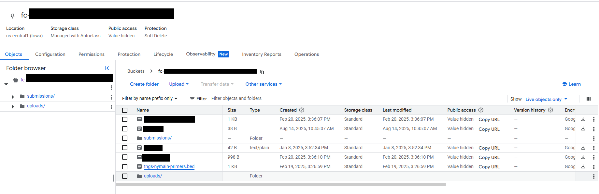
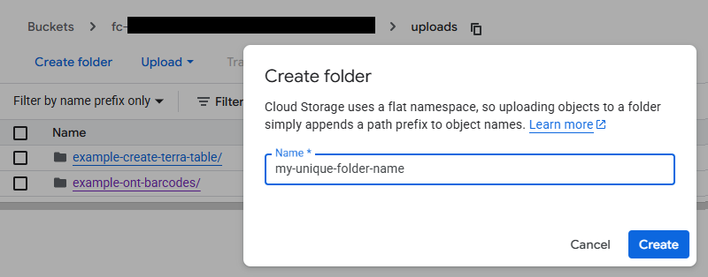
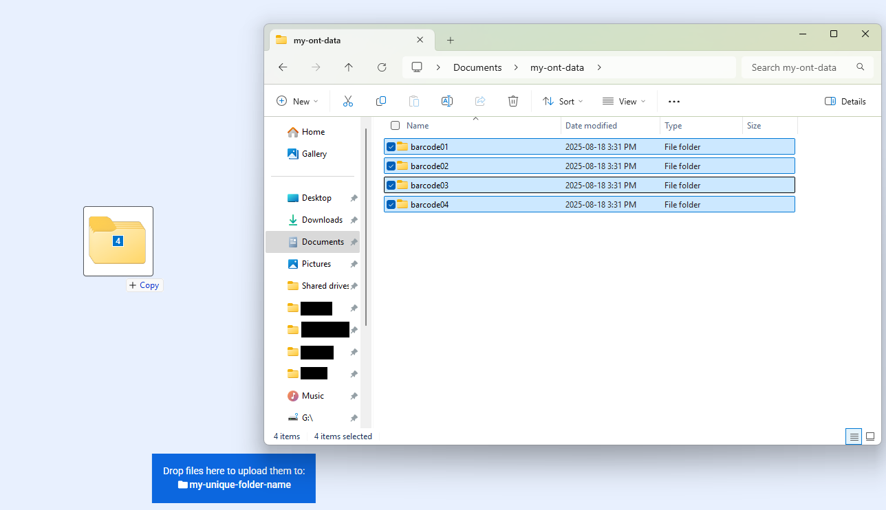
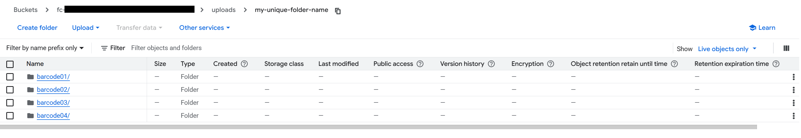

# ONT_Barcode_Concatenation

## Quick Facts

{{ render_tsv_table("docs/assets/tables/all_workflows.tsv", sort_by="Name", filters={"Name": "[**ONT_Barcode_Concatenation**](../workflows/data_import/ont_barcode_concatenation.md)"}, columns=["Workflow Type", "Applicable Kingdom", "Last Known Changes", "Command-line Compatibility","Workflow Level", "Dockstore"]) }}

## ONT_Barcode_Concatenation_PHB

Unconcatenated ONT data is the bane of all humanity. This workflow will automatically concatenate all reads in a given folder and upload those reads to a Terra data table.

We recommend running this workflow with **"Run workflow with inputs defined by file paths"** selected in Terra. This will allow you to upload your data files and provide the necessary information for the workflow without having to specify a data table. There are no outputs for this workflow, as the data is added to either a new or existing table in your workspace.

!!! warning "Barcodes Must Be In Nested Directories"

    This workflow anticipates that all reads associated with a barcode are located in their own subdirectories while the `input_bucket_path` points to the parent folder containing all the barcodes that are to be processed.

!!! dna "How does directory structure impact my output?"
    If you have the following directory structure:

    ```
    output_bucket_path/
    input_bucket_path/
    ├── barcode01/
    │   ├── ABC123_pass_barcode01_123abc_789xyz_0.fastq.gz
    │   ├── ...
    │   └── ABC123_pass_barcode01_123abc_789xyz_XXX.fastq.gz
    ├── barcode02/
    │   ├── ABC123_pass_barcode02_123abc_789xyz_0.fastq.gz
    │   ├── ...
    │   └── ABC123_pass_barcode02_123abc_789xyz_XXX.fastq.gz
    ├── barcodeXXX/
    │   └── ...
    ├── random_name/
    │   └── ...
    ├── ABC123_these_files_will_be_ignored_0.fastq.gz
    └── ABC123_these_files_will_be_ignored_1.fastq.gz
    ```

    The `input_bucket_path` in would point to `gs://input_bucket_path/`, and the workflow would automatically find and concatenate all reads within each `barcode*/` subdirectory. [Learn how to upload your files in this structure below](#data-upload). Please note: _If there are reads located in the parent directory (e.g., `ABC123_these_files_will_be_ignored_0.fastq.gz` and `ABC123_these_files_will_be_ignored_1.fastq.gz`), they will be ignored._

    After concatenation, the resulting reads will appear in the `gs://output_bucket_path` under the following names:
    
    ```
    output_bucket_path/
    ├── previously_concatenated_sample.all.fastq.gz
    ├── barcode01.all.fastq.gz
    ├── barcode02.all.fastq.gz
    ├── ...
    ├── barcodeXXX.all.fastq.gz
    └── random_name.all.fastq.gz
    ```

    **All** data in the `output_bucket_path` will appear in the specified Terra table under the `read1` column. The sample name is taken from the text before the `.all.fastq.gz` suffix, which is the folder name the data was found in. If a file has already been uploaded but is in the `output_bucket_path`, it will be reuploaded.

    | <terra_table_name\>_id | read1 | 
    | --- | --- |
    | previously_concatenated_sample | previously_concatenated_sample.all.fastq.gz |
    | barcode01 | barcode01.all.fastq.gz |
    | barcode02 | barcode02.all.fastq.gz |
    | ... | ... |
    | barcodeXXX | barcodeXXX.all.fastq.gz |
    | random_name | random_name.all.fastq.gz |
    
    If a `barcode_renaming_file` is used (see [relevant section](#barcode-renaming) below) that maps `random_name` to `my_special_sample`, the `random_name` sample will not appear in the table or in the `output_bucket_path`, and `my_special_sample` will appear instead.

    | <terra_table_name\>_id | read1 | 
    | --- | --- |
    | my_special_sample | my_special_sample.all.fastq.gz |

### Inputs

#### Uploading unconcatenated ONT reads to Terra and finding the `input_bucket_path`  {#data-upload} 

Using the Terra data uploader is **not recommended**.

???+ dna "The following method is recommended for data upload:"

    1. Navigate to your Terra workspace's Dashboard page and click on "Open bucket in browser" under the "Cloud Information" toggle on the right hand side.
      
        !!! caption narrow "Open bucket in browser"
            

    2. Click on the `uploads` folder.

        !!! caption narrow "Open the `uploads` folder"
            

    3. Click on "Create folder". Name the folder a unique name that can be used to identify your run or group of data. Click on "Create" once you have entered the new folder name.

        !!! caption narrow "Create a new folder"
            

    4. Navigate into the newly created folder by clicking on it. You can now drag and drop entire barcode directories into the browser with your new Google bucket. This process uploads the data directly into your Terra workspace.

        !!! caption narrow "Drag your barcode folders onto the browser"
            

        When your files are uploaded, you should see them appear.

        !!! caption narrow "Uploaded folders should look like this"
            

    5. Once your files are uploaded, you can identify the `input_bucket_path` by clicking on the two squares next to the file path at the top of the screen, shown below. When pasting this into the workflow inputs, you will need to add the `gs://` prefix.

        !!! caption narrow "Copy the file path"
            

#### Finding the `output_bucket_path`  {#file-paths} 

It is recommended to also create a new folder using the method described above for your `output_bucket_path`. No files should be uploaded to it.

!!! warning "CAUTION! Be careful when reusing `output_bucket_path`"
    The way this workflow currently works is that all files in the `output_bucket_path` are added to the specified Terra table. If the `output_bucket_path` is reused, all files will be re-added to Terra and the `upload_date` column will be **overwritten**.

#### Creating a `barcode_renaming_file`  {#barcode-renaming} 

By default, each concatenated file will take the name of the folder that contained the unconcatenated files. If you have specific sample names that correspond to each folder name, you can specify what you would like the concatenated files to be named as using a `barcode_renaming_file`.

This file takes the following _tab-delimited_ format. Do not include a header.

```
barcode01	sample01
barcode02	sample02
```

The first column is the **name of the folder** and the second column is the **desired sample name**.

Upload this file to your Terra bucket using the "Files" option on the Data tab, or the file icon on the right sidebar. Copy the file path into the `barcode_renaming_file` variable, and your files will be appropriate renamed.

/// html | div[class="searchable-table"]

{{ render_tsv_table("docs/assets/tables/all_inputs.tsv", input_table=True, filters={"Workflow": "ONT_Barcode_Concatenation"}, columns=["Terra Task Name", "Variable", "Type", "Description", "Default Value", "Terra Status"], sort_by=[("Terra Status", True), "Terra Task Name", "Variable"]) }}

///

### Outputs

Your concatenated ONT data will automatically appear in your workspace in the table of choice with information in the following four fields:

- Sample name (under the `terra_table_name`_id column), which will be either the name of the parent folder or the remapped name indicated by the `barcode_renaming_file` input.
- The concatenated ONT data in the `read1` column
- The name of the workflow (`ONT_Barcode_Concatenation_PHB`) under the `table_created_by` column, to indicate the samples were added by this workflow.
- The date of upload/when the workflow was run under the `upload_date` column
