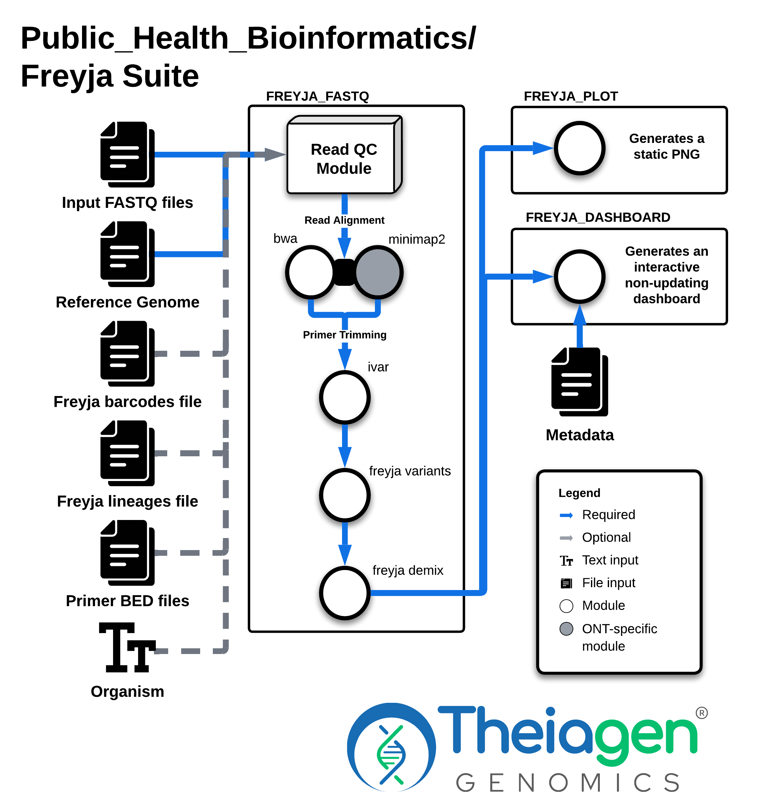

# Freyja Workflow Series

## Quick Facts

{{ render_tsv_table("docs/assets/tables/all_workflows.tsv", sort_by="Name", filters={"Name": "[**Freyja Workflow Series**](../workflows/genomic_characterization/freyja.md)"}, columns=["Workflow Type", "Applicable Kingdom", "Last Known Changes", "Command-line Compatibility","Workflow Level", "Dockstore"]) }}

## Freyja Overview

[Freyja](https://github.com/andersen-lab/Freyja) is a tool for analysing viral mixed sample genomic sequencing data. Developed by Joshua Levy from the [Andersen Lab](https://andersen-lab.com/), it performs two main steps:

1. **Variant Frequency Estimation:** Freyja calculates the frequencies of single nucleotide variants (SNVs) in the genomic sequencing data.
2. **Depth-Weighted Demixing:** It separates mixed populations of viral subtypes using a depth-weighted statistical approach, estimating the proportional abundance of each subtype in the sample based on the frequencies of subtype-defining variants.

Additional post-processing steps can produce visualizations of aggregated samples.

!!! dna "Wastewater and more"
    The typical use case of Freyja is to **analyze mixed SARS-CoV-2 samples** from a sequencing dataset, most often **wastewater**, but the tool is not limited to this context. With the appropriate reference genomes and barcode files, Freyja can be adapted for other pathogens, including MPXV, Influenza, RSV, and Measles.

    !!! warning "Default Values"
        The defaults included in the Freyja workflows reflect this use case but **can be adjusted for other pathogens**. See the [**Running Freyja on other pathogens**](freyja.md#running-freyja-on-other-pathogens) section for more information. Please be aware this is an ==_experimental feature_== and we cannot guarantee complete functionality at this time.

!!! caption "Figure 1: Workflow diagram for Freyja Suite of workflows"
    ##### Figure 1 { #figure1 }
    {width=100%}

    Depending on the type of data (Illumina or Oxford Nanopore), the Read QC and Filtering steps, as well as the Read Alignment steps use different software. The user can specify if the barcodes and lineages file should be updated with `freyja update` before running Freyja or if bootstrapping is to be performed with `freyja boot`.

Four workflows have been created that perform different parts of Freyja:

- [**Freyja_Update_PHB**](freyja.md#freyja_update)
- [**Freyja_FASTQ_PHB**](freyja.md#freyja_fastq)
- [**Freyja_Plot_PHB**](freyja.md#freyja_plot)
- [**Freyja_Dashboard_PHB**](freyja.md#freyja_dashboard)

The main workflow is [**Freyja_FASTQ_PHB**](freyja.md#freyja_fastq) ([Figure 1](freyja.md#figure1)). Depending on the type of input data (Illumina paired-end, Illumina single-end or ONT), it runs various QC modules before aligning the sample with either [BWA](https://github.com/lh3/bwa) (Illumina) or [minimap2](https://github.com/lh3/minimap2) (ONT) to the provided reference file, followed by iVar for primer trimming. After the preprocessing is completed, [Freyja](https://github.com/andersen-lab/Freyja) is run to generate relative lineage abundances (demix) from the sample. Optional bootstrapping may be performed.

!!! dna "Data Compatability"

    The **Freyja_FASTQ_PHB workflow** is compatible with the following input data types:

        - Ilumina Single-End
        - Illumina Paired-End
        - Oxford Nanopore

[**Freyja_Update_PHB**](freyja.md#freyja_update) will copy the **SARS-CoV-2** reference files that can then be used as input for the [Freyja_FASTQ_PHB](freyja.md#freyja_fastq) workflow.

Two options are available to visualize the Freyja results: [**Freyja_Plot_PHB**](freyja.md#freyja_plot) and [**Freyja_Dashboard_PHB**](freyja.md#freyja_dashboard). [Freyja_Plot_PHB](freyja.md#freyja_plot) aggregates multiple samples using output from [Freyja_FASTQ_PHB](freyja.md#freyja_fastq) to generate a plot that shows fractional abundance estimates for all samples. including the option to plot sample collection date information. Alternatively, [**Freyja_Dashboard_PHB**](freyja.md#freyja_dashboard) aggregates multiple samples using output from [Freyja_FASTQ_PHB](freyja.md#freyja_fastq) to generate an interactive visualization. This workflow requires an additional input field called viral load, which is the number of viral copies per liter.

### Freyja, Sequencing Platforms and Data Quality

The choice of sequencing platform and the quality of the data directly influence Freyja's performance. High-accuracy platforms like Illumina provide reliable SNV detection, enhancing the precision of lineage abundance estimates. In contrast, platforms with higher error rates, such as Nanopore, whilst it has improved greatly in the recent years, may introduce uncertainties in variant calling, affecting the deconvolution process. Sequencing depth requirements will increase as the quality of the sequencing data decreases. A rational target depth is 100X coverage for sequencing data with Q-scores in the range of 25-30.

Additionally, inadequate sequencing depth can hinder Freyja's ability to differentiate between lineages, leading to potential misestimations. Sequencing depth requirements will increase with the complexity of the sample composition and the diversity of lineages present. For samples containing multiple closely related lineages, higher sequencing depth is necessary to resolve subtle differences in genetic variation and accurately estimate lineage abundances. This is particularly important for pathogens with high mutation rates or a large number of cocirculating lineages, such as influenza, where distinguishing between lineages relies on detecting specific single nucleotide variants (SNVs) with high confidence.

## Freyja Workflows

### Freyja_Update_PHB  {#freyja_update} 

This workflow will copy the **SARS-CoV-2 reference files** (`curated_lineages.json` and `usher_barcodes.feather`) from [the source repository](https://github.com/andersen-lab/Freyja/tree/main/freyja/data) to a user-specific Google Cloud Storage (GCP) location (often a [Terra.bio](http://Terra.bio) workspace-associated bucket). These files can then be used as input for the [Freyja_FASTQ_PHB workflow](freyja.md#freyja_fastq).

!!! warning "Warning"

    This workflow is compatible only with **SARS-CoV-2 reference files**! To download reference files for other organisms please see the following repository: [Freyja Barcodes](https://github.com/gp201/Freyja-barcodes).

    More information is available in the [**Running Freyja on other pathogens**](freyja.md#running-freyja-on-other-pathogens) section.

#### Inputs

We recommend running this workflow with **"Run inputs defined by file paths"** selected since no information from a Terra data table is actually being used. We also recommend turning off call caching so new information is retrieved every time.

/// html | div[class="searchable-table"]

{{ render_tsv_table("docs/assets/tables/all_inputs.tsv", input_table=True, filters={"Workflow": "Freyja_Update"}, columns=["Terra Task Name", "Variable", "Type", "Description", "Default Value", "Terra Status"], sort_by=[("Terra Status", True), "Terra Task Name", "Variable"]) }}

///

#### Outputs

This workflow does not produce any outputs that appear in a Terra data table. The reference files will appear at the location specified with the `gcp_uri` input variable.

### Freyja_FASTQ_PHB  {#freyja_fastq} 

Freyja measures SNV frequency and sequencing depth at each position in the genome to return an estimate of the true lineage abundances in the sample. The method uses lineage-defining "barcodes" that, for SARS-CoV-2, are derived from the UShER global phylogenetic tree as a base set for demixing. **Freyja_FASTQ_PHB** returns as output a TSV file that includes the lineages present and their corresponding abundances, along with other values.

The Freyja_FASTQ_PHB workflow is compatible with the multiple input data types: Ilumina Single-End, Illumina Paired-End and Oxford Nanopore. Depending on the type of input data, different input values are used.

**Table 1:** Freyja_FASTQ_PHB input configuration for different types of input data.

| Table Columns | Illumina Paired-End | Illumina Single-End | Oxford Nanopore |
| --- | --- | --- | --- |
| **read1** | ✅ | ✅ | ✅ |
| **read2** | ✅ | ❌ | ❌ |
| **ont** | `false` | `false` | `true` |

#### Inputs

This workflow runs on the sample level.

=== "Illumina paired-end input data"
    /// html | div[class="searchable-table"]

    {{ render_tsv_table("docs/assets/tables/all_inputs.tsv", input_table=True, filters={"Workflow": ["Freyja_FASTQ", "Freyja_FASTQ (PE)"]}, columns=["Terra Task Name", "Variable", "Type", "Description", "Default Value", "Terra Status"], sort_by=[("Terra Status", True), "Terra Task Name", "Variable"], indent=4) }}

    ///

=== "Illumina single-end input data"
    /// html | div[class="searchable-table"]

    {{ render_tsv_table("docs/assets/tables/all_inputs.tsv", input_table=True, filters={"Workflow": ["Freyja_FASTQ", "Freyja_FASTQ (SE)"]}, columns=["Terra Task Name", "Variable", "Type", "Description", "Default Value", "Terra Status"], sort_by=[("Terra Status", True), "Terra Task Name", "Variable"], indent=4) }}
    
    ///

=== "ONT input data"
    /// html | div[class="searchable-table"]

    {{ render_tsv_table("docs/assets/tables/all_inputs.tsv", input_table=True, filters={"Workflow": ["Freyja_FASTQ", "Freyja_FASTQ (ONT)"]}, columns=["Terra Task Name", "Variable", "Type", "Description", "Default Value", "Terra Status"], sort_by=[("Terra Status", True), "Terra Task Name", "Variable"], indent=4) }}
    
    ///

#### Analysis Tasks

=== "Illumina paired-end input data"

{{ include_md("common_text/read_qc_trim_illumina.md", indent=4, condition="freyja") }}
{{ include_md("common_text/bwa_task.md", condition="freyja", indent=4) }}
{{ include_md("common_text/primer_trim_task.md", indent=4) }}

=== "Illumina single-end input data"

{{ include_md("common_text/read_qc_trim_illumina.md", indent=4, condition="freyja") }}
{{ include_md("common_text/bwa_task.md", condition="freyja", indent=4) }}
{{ include_md("common_text/primer_trim_task.md", indent=4) }}

=== "ONT input data"

{{ include_md("common_text/read_qc_trim_ont.md", indent=4, condition="freyja") }}
{{ include_md("common_text/minimap2_task.md", condition="only_map_ont", indent=4) }}

??? task "`freyja` Details"
    The Freyja task will call variants and capture sequencing depth information to identify the relative abundance of lineages present. Optionally, if `bootstrap` is set to true, bootstrapping will be performed. After the optional bootstrapping step, the variants are demixed.

    !!! techdetails "Freyja Technical Details"

        |  | Links |
        | --- | --- |
        | Task | [task_freyja_one_sample.wdl](https://github.com/theiagen/public_health_bioinformatics/blob/main/tasks/taxon_id/freyja/task_freyja.wdl) |
        | Software Source Code | <https://github.com/andersen-lab/Freyja> |
        | Software Documentation | <https://andersen-lab.github.io/Freyja/index.html#> |

#### Outputs

The main output file used in subsequent Freyja workflows is found under the `freyja_demixed` column. This TSV file takes on the following format:

|  | sample name |
| --- | --- |
| summarized | [('Delta', 0.65), ('Other', 0.25), ('Alpha', 0.1')] |
| lineages | ['B.1.617.2' 'B.1.2' 'AY.6' 'Q.3'] |
| abundances | "[0.5 0.25 0.15 0.1]" |
| resid | 3.14159 |
| coverage | 95.8 |

- The `summarized` array denotes a sum of all lineage abundances in a particular WHO designation (i.e. B.1.617.2 and AY.6 abundances are summed in the above example), otherwise they are grouped into "Other".
- The `lineage` array lists the identified lineages in descending order
- The `abundances` array contains the corresponding abundances estimates.
- The value of `resid` corresponds to the residual of the weighted least absolute deviation problem used to estimate lineage abundances.
- The `coverage` value provides the 10x coverage estimate (percent of sites with 10 or greater reads)

!!! tip "Click "Ignore empty outputs""
    When running the Freyja_FASTQ_PHB workflow, it is recommended to select the "Ignore empty outputs" option in the Terra UI. This will hide the output columns that will not be generated for your input data type.

=== "Illumina paired-end output data"
    /// html | div[class="searchable-table"]

    {{ render_tsv_table("docs/assets/tables/all_outputs.tsv", input_table=True, filters={"Workflow": ["Freyja_FASTQ", "Freyja_FASTQ (PE)"]}, columns=["Variable", "Type", "Description"], sort_by=["Variable"], indent=4) }}

    ///

=== "Illumina single-end output data"
    /// html | div[class="searchable-table"]

    {{ render_tsv_table("docs/assets/tables/all_outputs.tsv", input_table=True, filters={"Workflow": ["Freyja_FASTQ", "Freyja_FASTQ (SE)"]}, columns=["Variable", "Type", "Description"], sort_by=["Variable"], indent=4) }}

    ///

=== "ONT output data"
    /// html | div[class="searchable-table"]

    {{ render_tsv_table("docs/assets/tables/all_outputs.tsv", input_table=True, filters={"Workflow": ["Freyja_FASTQ", "Freyja_FASTQ (ONT)"]}, columns=["Variable", "Type", "Description"], sort_by=["Variable"], indent=4) }}

    ///

### Freyja_Plot_PHB  {#freyja_plot} 

This workflow visualizes aggregated freyja_demixed output files produced by [Freyja_FASTQ_PHB](freyja.md#freyja_fastq) in a single plot (pdf format) which provides fractional abundance estimates for all aggregated samples.

Options exist to provide lineage-specific breakdowns and/or sample collection time information.

#### Inputs

This workflow runs on the set level.

/// html | div[class="searchable-table"]

{{ render_tsv_table("docs/assets/tables/all_inputs.tsv", input_table=True, filters={"Workflow": "Freyja_Plot"}, columns=["Terra Task Name", "Variable", "Type", "Description", "Default Value", "Terra Status"], sort_by=[("Terra Status", True), "Terra Task Name", "Variable"]) }}

///

#### Analysis Tasks

??? task "`freyja_plot_task` Details"
    This task will aggregate multiple samples together, and then creates a plot. Several optional inputs dictate the plot appearance (see each variable's description for more information).

    !!! techdetails "Freyja Plot Technical Details"

        |  | Links |
        | --- | --- |
        | Task | [wf_freyja_plot.wdl](https://github.com/theiagen/public_health_bioinformatics/blob/main/tasks/taxon_id/freyja/task_freyja_plot.wdl) |
        | Software Source Code | <https://github.com/andersen-lab/Freyja> |
        | Software Documentation | <https://github.com/andersen-lab/Freyja> |

#### Outputs

/// html | div[class="searchable-table"]

{{ render_tsv_table("docs/assets/tables/all_outputs.tsv", input_table=False, filters={"Workflow": "Freyja_Plot"}, columns=["Variable", "Type", "Description"], sort_by=["Variable"]) }}

///

### Freyja_Dashboard_PHB  {#freyja_dashboard} 

This workflow creates a group of interactive visualizations based off of the aggregated freyja_demixed output files produced by [Freyja_FASTQ_PHB](freyja.md#freyja_fastq) called a "dashboard". Creating this dashboard requires knowing the viral load of your samples (viral copies/litre).

!!! warning

    This dashboard is not "live" — that is, you must rerun the workflow every time you want new data to be included in the visualizations.

#### Inputs

This workflow runs on the set level.

/// html | div[class="searchable-table"]

{{ render_tsv_table("docs/assets/tables/all_inputs.tsv", input_table=True, filters={"Workflow": "Freyja_Dashboard"}, columns=["Terra Task Name", "Variable", "Type", "Description", "Default Value", "Terra Status"], sort_by=[("Terra Status", True), "Terra Task Name", "Variable"]) }}

///

#### Analysis Tasks

??? task "`freyja_dashboard_task` Details"

    This task will aggregate multiple samples together, and then create an interactive HTML visualization. Several optional inputs dictate the dashboard appearance (see each variable's description for more information).

    !!! techdetails "Freyja Dashboard Technical Details"
    
        |  | Links |
        | --- | --- |
        | Task | [wf_freyja_dashboard.wdl](https://github.com/theiagen/public_health_bioinformatics/blob/main/tasks/taxon_id/freyja/task_freyja_dashboard.wdl) |
        | Software Source Code | <https://github.com/andersen-lab/Freyja> |
        | Software Documentation | <https://github.com/andersen-lab/Freyja> |

#### Outputs

/// html | div[class="searchable-table"]

{{ render_tsv_table("docs/assets/tables/all_outputs.tsv", input_table=False, filters={"Workflow": "Freyja_Dashboard"}, columns=["Variable", "Type", "Description"], sort_by=["Variable"]) }}

///

## Running Freyja on other pathogens

!!! warning "Experimental Feature"
    Please be aware this is an _experimental feature_ and we cannot guarantee complete functionality at this time.

The main requirement to run Freyja on other pathogens is **the existence of a barcode file for your pathogen of interest**. Currently, barcodes exist for the following organisms:

- SARS-CoV-2 (default)
- FLU-B-VIC
- H1N1
- H3N2
- H5Nx-cattle
- H5NX
- MEASLESN450
- MEASLESgenome
- MPX
- RSVa
- RSVb

!!! dna "Freyja barcodes for other pathogens"

    Data for various pathogens can be found in the following repository: [Freyja Barcodes](https://github.com/gp201/Freyja-barcodes)

    Folders are organized by pathogen, with each subfolder named after the date the barcode was generated, using the format YYYY-MM-DD, as well as a "latest" folder. Barcode files are named `barcode.csv`, and reference genome files are named `reference.fasta`.

There are two ways to run [**Freyja_FASTQ_PHB**](freyja.md#freyja_fastq) for non-SARS-CoV-2 organisms:

- Using the `freyja_pathogen` optional input (limited set of allowable organisms)
- Providing the appropriate barcode file through the `freyja_barcodes` optional input (any organism for which barcodes are supplied)

### Using the `freyja_pathogen` flag

When using the `freyja_pathogen` flag, the user must set the optional `update_db` flag to _true_, so that the latest version of the barcode file is automatically downloaded by Freyja. 

!!! caption "Figure 2:  Optional input for Freyja_FASTQ_PHB to provide the pathogen to be used by Freyja"
    ##### Figure 2 { #figure2 }
    

Allowed options:

- SARS-CoV-2 (default)
- MPXV
- H1N1pdm
- H5NX
- FLU-B-VIC
- MEASLESN450
- MEASLES
- RSVa
- RSVb

!!! warning

    The `freyja_pathogen` flag is not used if a barcodes file is provided. This means that this option is ignored if a barcode file is provided through `freyja_barcodes`.

### Providing the appropriate barcode file

The appropriate barcode file for your organism of interest and reference sequence need to be downloaded and uploaded to your [Terra.bio](http://Terra.bio) workspace. When running [**Freyja_FASTQ_PHB**](freyja.md#freyja_fastq), the appropriate reference and barcodes file need to be passed as inputs. The first is a required input and will show up at the top of the workflows inputs page on [Terra.bio](http://Terra.bio) ([Figure 3](freyja.md/#figure3)).

!!! caption "Figure 3:  Required input for Freyja_FASTQ_PHB to provide the reference genome to be used by Freyja"
    ##### Figure 3  {#figure3} 
    

The barcodes file can be passed directly to Freyja by the `freyja_barcodes` optional input ([Figure 4](freyja.md/#figure4)).

!!! caption "Figure 4: Optional input for Freyja_FASTQ_PHB to provide the barcodes file to be used by Freyja"
    ##### Figure 4  {#figure4} 
    

## References

If you use any of the Freyja workflows, please cite:

> Karthikeyan, S., Levy, J.I., De Hoff, P. *et al.* Wastewater sequencing reveals early cryptic SARS-CoV-2 variant transmission. *Nature* **609**, 101–108 (2022). <https://doi.org/10.1038/s41586-022-05049-6>
<!-- -->
> Freyja source code can be found at <https://github.com/andersen-lab/Freyja>
<!-- -->
> Freyja barcodes (non-SARS-CoV-2): <https://github.com/gp201/Freyja-barcodes>
