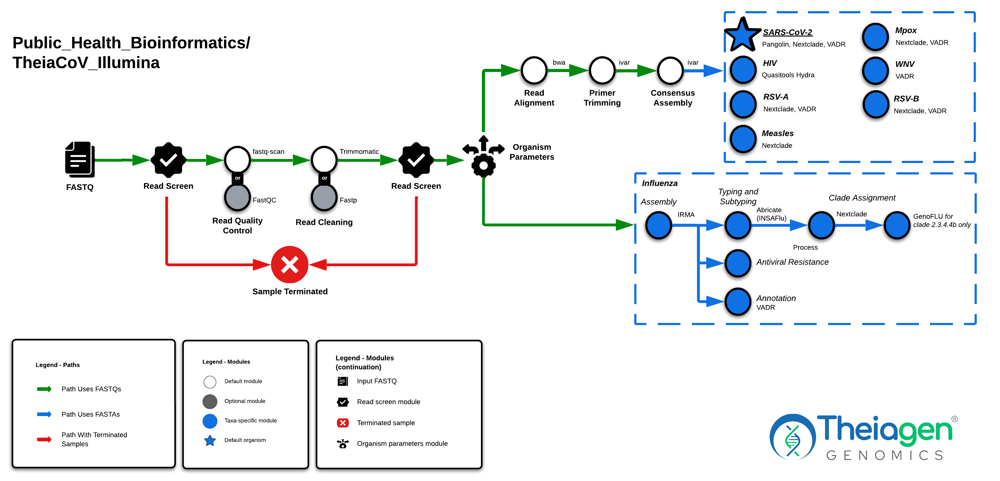

# TheiaCoV Workflow Series

## Quick Facts

{{ render_tsv_table("docs/assets/tables/all_workflows.tsv", sort_by="Name", filters={"Name": "[**TheiaCov Workflow Series**](../workflows/genomic_characterization/theiacov.md)"}, columns=["Workflow Type", "Applicable Kingdom", "Last Known Changes", "Command-line Compatibility","Workflow Level", "Dockstore"]) }}

## TheiaCoV Workflows

**The TheiaCoV workflows are for the assembly, quality assessment, and characterization of viral genomes.** There are currently five TheiaCoV workflows designed to accommodate different kinds of input data:

1. Illumina paired-end sequencing (**TheiaCoV_Illumina_PE**)
2. Illumina single-end sequencing (**TheiaCoV_Illumina_SE**)
3. ONT sequencing (**TheiaCoV_ONT**)
4. Genome assemblies (**TheiaCoV_FASTA**)
5. ClearLabs sequencing (**TheiaCoV_ClearLabs**)

Additionally, the **TheiaCoV_FASTA_Batch** workflow is available to process several hundred SARS-CoV-2 assemblies at the same time.

---

!!! dna inline end "Key Resources"

    [**Reference Materials for SARS-CoV-2**](https://theiagen.notion.site/Docker-Image-and-Reference-Materials-for-SARS-CoV-2-Genomic-Characterization-98328c61f5cb4f77975f512b55d09108?pvs=74)

    [**Reference Materials for Mpox**](https://theiagen.notion.site/Workspace-Reference-Materials-for-MPXV-Genomic-Characterization-a34f355c68c54c0a82e926d4de607bca)

    [**Reference Materials for non-default viruses (TheiaViral)**](../../workflows/genomic_characterization/theiaviral.md)

    ??? toggle "HIV Input JSONs"
        - [TheiaCoV_Illumina_PE_HIV_v1_2024-04-19.json](../../assets/files/input_jsons/TheiaCoV_Illumina_PE_HIV_v1_2024-04-19.json)
        - [TheiaCoV_Illumina_PE_HIV_v2_2024-04-19.json](../../assets/files/input_jsons/TheiaCoV_Illumina_PE_HIV_v2_2024-04-19.json)
        - [TheiaCoV_ONT_HIV_v1_2024-04-19.json](../../assets/files/input_jsons/TheiaCoV_ONT_HIV_v1_2024-04-19.json)
        - [TheiaCoV_ONT_HIV_v2_2024-04-19.json](../../assets/files/input_jsons/TheiaCoV_ONT_HIV_v2_2024-04-19.json)
        
    ??? toggle "WNV Input JSONs"
        - [TheiaCoV_Illumina_PE_WNV_2024-04-19.json](../../assets/files/input_jsons/TheiaCoV_Illumina_PE_WNV_2024-04-19.json)
        - [TheiaCoV_Illumina_SE_WNV_2024-04-19.json](../../assets/files/input_jsons/TheiaCoV_Illumina_SE_WNV_2024-04-19.json)
        - [TheiaCoV_FASTA_WNV_2024-04-19.json](../../assets/files/input_jsons/TheiaCoV_FASTA_WNV_2024-04-19.json)
        
    ??? toggle "Flu Input JSONs"
        - [TheiaCoV_Illumina_PE_flu_2024-04-19.json](../../assets/files/input_jsons/TheiaCoV_Illumina_PE_flu_2024-04-19.json)
        - [TheiaCoV_ONT_flu_2024-04-19.json](../../assets/files/input_jsons/TheiaCoV_ONT_flu_2024-04-19.json)
        - [TheiaCoV_FASTA_flu_2024-04-19.json](../../assets/files/input_jsons/TheiaCoV_FASTA_flu_2024-04-19.json)
        
    ??? toggle "RSV-A Input JSONs"
        - [TheiaCoV_Illumina_PE_RSV-A_2024-04-19.json](../../assets/files/input_jsons/TheiaCoV_Illumina_PE_RSV-A_2024-04-19.json)
        - [TheiaCoV_FASTA_RSV-A_2024-04-19.json](../../assets/files/input_jsons/TheiaCoV_FASTA_RSV-A_2024-04-19.json)

    ??? toggle "RSV-B Input JSONs" 
        - [TheiaCoV_Illumina_PE_RSV-B_2024-04-19.json](../../assets/files/input_jsons/TheiaCoV_Illumina_PE_RSV-B_2024-04-19.json)
        - [TheiaCoV_FASTA_RSV-B_2024-04-19.json](../../assets/files/input_jsons/TheiaCoV_FASTA_RSV-B_2024-04-19.json)

!!! caption "TheiaCoV Workflow Diagram"
    

### Supported Organisms

These workflows currently support the following organisms. The first option in the list (bolded) is what our workflows use as the _standardized_ organism name:

- **SARS-CoV-2** (**`"sars-cov-2"`**, `"SARS-CoV-2"`) - ==_default organism input_==
- **Monkeypox virus** (**`"MPXV"`**, `"mpox"`, `"monkeypox"`, `"Monkeypox virus"`, `"Mpox"`)
- **Human Immunodeficiency Virus** (**`"HIV"`**)
- **West Nile Virus** (**`"WNV"`**, `"wnv"`, `"West Nile virus"`)
- **Influenza** (**`"flu"`**, `"influenza"`, `"Flu"`, `"Influenza"`)
- **RSV-A** (**`"rsv_a"`**, `"rsv-a"`, `"RSV-A"`, `"RSV_A"`)
- **RSV-B** (**`"rsv_b"`**, `"rsv-b"`, `"RSV-B"`, `"RSV_B"`)
- **Measles** (**`"measles"`**, `"Measles"`, `"mev"`, `"MeV"`, `"Morbillivirus"`, `"morbillivirus"`)

The compatibility of each workflow with each pathogen is shown below:

|  | SARS-CoV-2 | Mpox | HIV | WNV | Influenza | RSV-A | RSV-B | Measles |
| --- | --- | --- | --- | --- | --- | --- | --- | --- |
| Illumina_PE | ✅ | ✅ | ✅ | ✅ | ✅ | ✅ | ✅ | ✅ |
| Illumina_SE | ✅ | ✅ | ❌ | ✅ | ❌ | ✅ | ✅ | ❌ |
| ONT | ✅ | ✅ | ✅ | ❌ | ✅ | ✅ | ✅ | ❌ |
| FASTA | ✅ | ✅ | ❌ | ✅ | ✅ | ✅ | ✅ | ✅ |
| ClearLabs | ✅ | ❌ | ❌ | ❌ | ❌ | ❌ | ❌ | ❌ |

We've provided the following information to help you set up the workflow for each organism in the form of input JSONs.

### Inputs

!!! dna "Input Data"

    === "TheiaCoV_Illumina_PE"

        The TheiaCoV_Illumina_PE workflow takes in Illumina paired-end read data. Read file names should end with `.fastq` or `.fq`, with the optional addition of `.gz`. When possible, Theiagen recommends zipping files with [gzip](https://www.gnu.org/software/gzip/) before Terra uploads to minimize data upload time.

        By default, the workflow anticipates **2 x 150bp** reads (i.e. the input reads were generated using a 300-cycle sequencing kit). Modifications to the optional parameter for `trim_minlen` may be required to accommodate shorter read data, such as the 2 x 75bp reads generated using a 150-cycle sequencing kit.

    === "TheiaCoV_Illumina_SE"

        TheiaCoV_Illumina_SE takes in Illumina single-end reads. Read file names should end with `.fastq` or `.fq`, with the optional addition of `.gz`. Theiagen highly recommends zipping files with [gzip](https://www.gnu.org/software/gzip/) before uploading to Terra to minimize data upload time & save on storage costs.

        By default, the workflow anticipates **1 x 35 bp** reads  (i.e. the input reads were generated using a 70-cycle sequencing kit). Modifications to the optional parameter for `trim_minlen` may be required to accommodate longer read data.

    === "TheiaCoV_ONT"

        The TheiaCoV_ONT workflow takes in base-called ONT read data. Read file names should end with `.fastq` or `.fq`, with the optional addition of `.gz`. When possible, Theiagen recommends zipping files with [gzip](https://www.gnu.org/software/gzip/) before uploading to Terra to minimize data upload time.

        **The ONT sequencing kit and base-calling approach can produce substantial variability in the amount and quality of read data. Genome assemblies produced by the TheiaCoV_ONT workflow must be quality assessed before reporting results.**

    === "TheiaCoV_FASTA"

        The TheiaCoV_FASTA workflow takes in assembly files in FASTA format.

        !!! warning "Note for TheiaCoV_FASTA users analyzing Influenza:"

            TheiaCoV_FASTA will use the output of VADR to classify and partition Influenza segments from the input assembly. See [`vadr_flu_segments`](#org-specific-tasks) task for more details.

    === "TheiaCoV_ClearLabs"

        The TheiaCoV_ClearLabs workflow takes in read data produced by the Clear Dx platform from ClearLabs. However, many users use the TheiaCoV_FASTA workflow instead of this one due to a few known issues when generating assemblies with this pipeline that are not present when using ClearLabs-generated FASTA files.

    === "TheiaCoV_FASTA_Batch"

        The TheiaCoV_FASTA_Batch workflow takes in a set of assembly files in FASTA format.

!!! caption ""
    === "TheiaCoV_Illumina_PE"
        /// html | div[class="searchable-table"]

        {{ render_tsv_table("docs/assets/tables/all_inputs.tsv", input_table=True, filters={"Workflow": "TheiaCoV_Illumina_PE"}, columns=["Terra Task Name", "Variable", "Type", "Description", "Default Value", "Terra Status", "Organism"], sort_by=[("Terra Status", True), "Terra Task Name", "Variable"], indent=8) }}
        ///

    === "TheiaCoV_Illumina_SE"
        /// html | div[class="searchable-table"]

        {{ render_tsv_table("docs/assets/tables/all_inputs.tsv", input_table=True, filters={"Workflow": "TheiaCoV_Illumina_SE"}, columns=["Terra Task Name", "Variable", "Type", "Description", "Default Value", "Terra Status", "Organism"], sort_by=[("Terra Status", True), "Terra Task Name", "Variable"], indent=8) }}
        ///

    === "TheiaCoV_ONT"
        /// html | div[class="searchable-table"]

        {{ render_tsv_table("docs/assets/tables/all_inputs.tsv", input_table=True, filters={"Workflow": "TheiaCoV_ONT"}, columns=["Terra Task Name", "Variable", "Type", "Description", "Default Value", "Terra Status", "Organism"], sort_by=[("Terra Status", True), "Terra Task Name", "Variable"], indent=8) }}
        ///

    === "TheiaCoV_FASTA"
        /// html | div[class="searchable-table"]

        {{ render_tsv_table("docs/assets/tables/all_inputs.tsv", input_table=True, filters={"Workflow": "TheiaCoV_FASTA"}, columns=["Terra Task Name", "Variable", "Type", "Description", "Default Value", "Terra Status", "Organism"], sort_by=[("Terra Status", True), "Terra Task Name", "Variable"], indent=8) }}
        ///

    === "TheiaCoV_ClearLabs"
        /// html | div[class="searchable-table"]

        {{ render_tsv_table("docs/assets/tables/all_inputs.tsv", input_table=True, filters={"Workflow": "TheiaCoV_ClearLabs"}, columns=["Terra Task Name", "Variable", "Type", "Description", "Default Value", "Terra Status", "Organism"], sort_by=[("Terra Status", True), "Terra Task Name", "Variable"], indent=8) }}
        ///

    === "TheiaCoV_FASTA_Batch"
        /// html | div[class="searchable-table"]

        {{ render_tsv_table("docs/assets/tables/all_inputs.tsv", input_table=True, filters={"Workflow": "TheiaCoV_FASTA_Batch"}, columns=["Terra Task Name", "Variable", "Type", "Description", "Default Value", "Terra Status"], sort_by=[("Terra Status", True), "Terra Task Name", "Variable"], indent=8) }}
        ///

### Organism-specific parameters and logic  {#org-specific} 

The `organism_parameters` sub-workflow is the first step in all TheiaCoV workflows. This step automatically sets the different parameters needed for each downstream tool to the appropriate value for the user-designated organism (by default, `"sars-cov-2"` is the default organism).

!!! dna ""
    The following tables include the relevant organism-specific parameters; **all of these default values can be overwritten by providing a value for the "Overwrite Variable Name" field**.

    === "SARS-CoV-2"
        

        | **Overwrite Variable Name** | **Organism** | **Default Value** |
        |---|---|---|
        | gene_locations_bed_file | sars-cov-2 | `"gs://theiagen-public-resources-rp/reference_data/viral/sars-cov-2/sc2_gene_locations.bed"` |
        | genome_length_input | sars-cov-2 | `29903` |
        | kraken_target_organism_input | sars-cov-2 | `"Severe acute respiratory syndrome coronavirus 2"` |
        | nextclade_dataset_name_input | sars-cov-2 | `"nextstrain/sars-cov-2/wuhan-hu-1/orfs"` |
        | pangolin_docker_image | sars-cov-2 | `"us-docker.pkg.dev/general-theiagen/staphb/pangolin:4.3.1-pdata-1.34 "`|
        | nextclade_dataset_tag_input | sars-cov-2 | `"2025-08-02--08-55-17Z"` |
        | reference_genome | sars-cov-2 | `"gs://theiagen-public-resources-rp/reference_data/viral/sars-cov-2/MN908947.fasta"` |
        | vadr_max_length | sars-cov-2 | `30000` |
        | vadr_mem | sars-cov-2 | `8` |
        | vadr_options | sars-cov-2 | `"--noseqnamemax --glsearch -s -r --nomisc --mkey sarscov2 --lowsim5seq 6 --lowsim3seq 6 --alt_fail lowscore,insertnn,deletinn --out_allfasta"` |

        

    === "Mpox"
        

        | **Overwrite Variable Name** | **Organism** | **Default Value** |
        |---|---|---|
        | gene_locations_bed_file | MPXV | `"gs://theiagen-public-resources-rp/reference_data/viral/mpox/mpox_gene_locations.bed"` |
        | genome_length_input | MPXV | `197200` |
        | kraken_target_organism_input | MPXV | `"Monkeypox virus"` |
        | nextclade_dataset_name_input | MPXV | `"nextstrain/mpox/lineage-b.1"` |
        | nextclade_dataset_tag_input | MPXV | `"2025-04-25--12-24-24Z"` |
        | primer_bed_file | MPXV | `"gs://theiagen-public-resources-rp/reference_data/viral/mpox/MPXV.primer.bed"` |
        | reference_genome | MPXV | `"gs://theiagen-public-resources-rp/reference_data/viral/mpox/MPXV.MT903345.reference.fasta"` |
        | reference_gff_file | MPXV | `"gs://theiagen-public-resources-rp/reference_data/viral/mpox/Mpox-MT903345.1.reference.gff3"` |
        | vadr_max_length | MPXV | `210000` |
        | vadr_mem | MPXV | `8` |
        | vadr_options | MPXV | `"--glsearch -s -r --nomisc --mkey mpxv --r_lowsimok --r_lowsimxd 100 --r_lowsimxl 2000 --alt_pass discontn,dupregin --out_allfasta --minimap2 --s_overhang 150"` |
        
        

    === "West Nile Virus"
        

        | **Overwrite Variable Name** | **Organism** | **Default Value** | **Notes** |
        |---|---|---|---|
        | genome_length_input | WNV | `11000` | |
        | kraken_target_organism_input | WNV | `"West Nile virus`" | |
        | nextclade_dataset_name_input | WNV | `"NA"` | TheiaCoV's Nextclade currently does not support WNV |
        | nextclade_dataset_tag_input | WNV | `"NA"` | TheiaCoV's Nextclade currently does not support WNV |
        | primer_bed_file | WNV | `"gs://theiagen-public-resources-rp/reference_data/viral/wnv/al/wnv/WNV-L1_primer.bed"` |  |
        | reference_genome | WNV | `"gs://theiagen-public-resources-rp/reference_data/viral/wnv/NC_009942.1_wnv_L1.fasta"` |  |
        | vadr_max_length | WNV | `11000` |  |
        | vadr_mem | WNV | `8` |  |
        | vadr_options | WNV | `"--mkey flavi --mdir /opt/vadr/vadr-models-flavi/ --nomisc --noprotid --out_allfasta"` |  |

        

    === "Influenza"
        

        | **Overwrite Variable Name** | **Organism** | **Flu Segment** | **Flu Subtype** | **Default Value** | **Notes** |
        |---|---|---|---|---|---|
        | flu_segment | flu | all | all | N/A | TheiaCoV will attempt to automatically assign a flu segment  |
        | flu_subtype | flu | all | all | N/A | TheiaCoV will attempt to automatically assign a flu subtype |
        | genome_length_input | flu | all | all | `13500` |  |
        | vadr_max_length | flu | all | all | `13500` |  |
        | vadr_mem | flu | all | all | `8` |  |
        | vadr_options | flu | all | all | `"--atgonly --xnocomp --nomisc --alt_fail extrant5,extrant3 --mkey flu"` |  |
        | nextclade_dataset_name_input | flu | ha | h1n1 | `"nextstrain/flu/h1n1pdm/ha/MW626062"` |  |
        | nextclade_dataset_tag_input | flu | ha | h1n1 | `"2025-08-07--09-22-32Z"` |  |
        | reference_genome | flu | ha | h1n1 | `"gs://theiagen-public-resources-rp/reference_data/viral/flu/reference_h1n1pdm_ha.fasta"` |  |
        | nextclade_dataset_name_input | flu | ha | h3n2 | `"nextstrain/flu/h3n2/ha/EPI1857216"` |  |
        | nextclade_dataset_tag_input | flu | ha | h3n2 | `"2025-08-07--09-22-32Z"` |  |
        | reference_genome | flu | ha | h3n2 | `"gs://theiagen-public-resources-rp/reference_data/viral/flu/reference_h3n2_ha.fasta"` |  |
        | nextclade_dataset_name_input | flu | ha | victoria | `"nextstrain/flu/vic/ha/KX058884"` |  |
        | nextclade_dataset_tag_input | flu | ha | victoria | `"2025-08-07--09-22-32Z"` |  |
        | reference_genome | flu | ha | victoria | `"gs://theiagen-public-resources-rp/reference_data/viral/flu/reference_vic_ha.fasta"` |  |
        | nextclade_dataset_name_input | flu | ha | yamagata | `"nextstrain/flu/yam/ha/JN993010"` |  |
        | nextclade_dataset_tag_input | flu | ha | yamagata | `"2024-01-30--16-34-55Z"` |  |
        | reference_genome | flu | ha | yamagata | `"gs://theiagen-public-resources-rp/reference_data/viral/flu/reference_yam_ha.fasta"` |  |
        | nextclade_dataset_name_input | flu | ha | h5n1 | `"community/moncla-lab/iav-h5/ha/all-clades"` |  |
        | nextclade_dataset_tag_input | flu | ha | h5n1 | `"2025-08-07--09-22-32Z"` |  |
        | reference_genome | flu | ha | h5n1 | `"gs://theiagen-public-resources-rp/reference_data/viral/flu/reference_h5n1_ha.fasta"` |  |
        | nextclade_dataset_name_input | flu | na | h1n1 | `"nextstrain/flu/h1n1pdm/na/MW626056"` |  |
        | nextclade_dataset_tag_input | flu | na | h1n1 | `"2025-08-07--09-22-32Z"` |  |
        | reference_genome | flu | na | h1n1 | `"gs://theiagen-public-resources-rp/reference_data/viral/flu/reference_h1n1pdm_na.fasta"` |  |
        | nextclade_dataset_name_input | flu | na | h3n2 | `"nextstrain/flu/h3n2/na/EPI1857215"` |  |
        | nextclade_dataset_tag_input | flu | na | h3n2 | `"2025-08-07--09-22-32Z"` |  |
        | reference_genome | flu | na | h3n2 | `"gs://theiagen-public-resources-rp/reference_data/viral/flu/reference_h3n2_na.fasta"` |  |
        | nextclade_dataset_name_input | flu | na | victoria | `"nextstrain/flu/vic/na/CY073894"` |  |
        | nextclade_dataset_tag_input | flu | na | victoria | `"2025-08-07--09-22-32Z"` |  |
        | reference_genome | flu | na | victoria | `"gs://theiagen-public-resources-rp/reference_data/viral/flu/reference_vic_na.fasta"` |  |
        | nextclade_dataset_name_input | flu | na | yamagata | `"NA"` |  |
        | nextclade_dataset_tag_input | flu | na | yamagata | `"NA"` |  |
        | reference_genome | flu | na | yamagata | `"gs://theiagen-public-resources-rp/reference_data/viral/flu/reference_yam_na.fasta"` |  |

        

        !!! tip "H5N1 Additional Defaults"
            If the sample is designated as H5N1 by either ABRicate or IRMA, an H5N1-specific Nextclade task will run with the following datasets depending on the GenoFLU genotype. 
            
            Alternatively, if a `nextclade_custom_input_dataset` variable is provided (available under the `flu_track` task name), the workflow will run that custom dataset on all H5N1 samples, regardless of the GenoFLU genotype.

            | **Overwrite Variable Name** | **GenoFLU Genotype** | **Default Value** | **Notes** |
            |---|---|---|---|
            | nextclade_custom_input_dataset | B3.13 | `"gs://theiagen-public-resources-rp/reference_data/viral/flu/nextclade_avian-flu_h5n1-cattle-outbreak_h5n1-b3.13_2025-06-24.json"` | Extracted from [nextclade/avian-flu/h5n1-cattle-outbreak](https://nextstrain.org/avian-flu/h5n1-cattle-outbreak/genome) on 2025-06-24 |
            | nextclade_custom_input_dataset | D1.1 | `"gs://theiagen-public-resources-rp/reference_data/viral/flu/nextclade_avian-flu_h5n1-d1.1_2025-06-24.json"` | Extracted from [nextclade/avian-flu/h5n1-d1.1](https://nextstrain.org/avian-flu/h5n1-d1.1/genome) on 2025-06-24 |

    === "RSV-A"
        

        | **Overwrite Variable Name** | **Organism** | **Default Value** |
        |---|---|---|
        | genome_length_input | rsv_a | `16000` |
        | kraken_target_organism | rsv_a | `"Human respiratory syncytial virus A"` |
        | nextclade_dataset_name_input | rsv_a | `nextstrain/rsv/a/EPI_ISL_412866` |
        | nextclade_dataset_tag_input | rsv_a | `"2024-11-27--02-51-00Z"` |
        | reference_genome | rsv_a | `gs://theiagen-public-resources-rp/reference_data/viral/rsv/reference_rsv_a.EPI_ISL_412866.fasta` |
        | vadr_max_length | rsv_a | `15500` |
        | vadr_mem | rsv_a | `32` |
        | vadr_options | rsv_a | `-r --mkey rsv --xnocomp` |

        

    === "RSV-B"
        

        | **Overwrite Variable Name** | **Organism** | **Default Value** |
        |---|---|---|
        | genome_length_input | rsv_b | `16000` |
        | kraken_target_organism | rsv_b | `"human respiratory syncytial virus"` |
        | nextclade_dataset_name_input | rsv_b | `nextstrain/rsv/b/EPI_ISL_1653999` |
        | nextclade_dataset_tag_input | rsv_b | `"2025-03-04--17-31-25Z"` |
        | reference_genome | rsv_b | `gs://theiagen-public-resources-rp/reference_data/viral/rsv/reference_rsv_b.EPI_ISL_1653999.fasta` |
        | vadr_max_length | rsv_b | `15500` |
        | vadr_mem | rsv_b | `32` |
        | vadr_options | rsv_b | `-r --mkey rsv --xnocomp` |

        

    === "HIV"
        

        | **Overwrite Variable Name** | **Organism** | **Default Value** | **Notes** |
        |---|---|---|---|
        | kraken_target_organism_input | HIV | `Human immunodeficiency virus 1` |  |
        | genome_length_input | HIV-v1 | `9181` | This version of HIV originates from Oregon |
        | primer_bed_file | HIV-v1 | `gs://theiagen-public-resources-rp/reference_data/viral/hiv/HIV-1_v1.0.primer.hyphen.bed` | This version of HIV originates from Oregon |
        | reference_genome | HIV-v1 | `gs://theiagen-public-resources-rp/reference_data/viral/hiv/NC_001802.1.fasta` | This version of HIV originates from Oregon |
        | reference_gff_file | HIV-v1 | `gs://theiagen-public-resources-rp/reference_data/viral/hiv/NC_001802.1.gff3` | This version of HIV originates from Oregon |
        | genome_length_input | HIV-v2 | `9840` | This version of HIV originates from Southern Africa |
        | primer_bed_file | HIV-v2 | `gs://theiagen-public-resources-rp/reference_data/viral/hiv/HIV-1_v2.0.primer.hyphen400.1.bed` | This version of HIV originates from Southern Africa |
        | reference_genome | HIV-v2 | `gs://theiagen-public-resources-rp/reference_data/viral/hiv/AY228557.1.headerchanged.fasta` | This version of HIV originates from Southern Africa |
        | reference_gff_file | HIV-v2 | `gs://theiagen-public-resources-rp/reference_data/viral/hiv/AY228557.1.gff3` | This version of HIV originates from Southern Africa |

        

    
    === "Measles"
        

        | **Overwrite Variable Name** | **Organism** | **Default Value** |
        |---|---|---|
        | kraken_target_organism_input | measles | `"Measles morbillivirus"` |
        | genome_length_input | measles | `16000` |
        | nextclade_dataset_name_input | measles | `"nextstrain/measles/genome/WHO-2012"` |
        | nextclade_dataset_tag_input | measles | `"2025-08-11--19-06-01Z"` |

        

                
### Workflow Tasks

All input reads are processed through "core tasks" in the TheiaCoV Illumina, ONT, and ClearLabs workflows. These undertake read trimming and assembly appropriate to the input data type. TheiaCoV workflows subsequently launch default genome characterization modules for quality assessment, and additional taxa-specific characterization steps. When setting up the workflow, users may choose to use "optional tasks" as additions or alternatives to tasks run in the workflow by default.

#### Core tasks

!!! tip ""
    These tasks are performed regardless of organism, and perform read trimming and various quality control steps.

{{ include_md("common_text/versioning_task.md") }}

!!! caption ""
    === "TheiaCoV_Illumina_PE"
{{ include_md("common_text/read_qc_trim_illumina.md", condition="theiacov", indent=8) }}

    === "TheiaCoV_Illumina_SE"
{{ include_md("common_text/read_qc_trim_illumina.md", condition="theiacov", indent=8) }}

    === "TheiaCoV_ONT"
{{ include_md("common_text/read_qc_trim_ont.md", condition="theiacov", indent=8) }}

{{ include_md("common_text/qc_check_task.md", condition="theiacov")}}

#### Assembly tasks

!!! tip ""
    Either one of these tasks is run depending on the organism and workflow type.

??? toggle "`ivar_consensus`: Alignment, Consensus, Variant Detection, and Assembly Statistics ==_for non-flu organisms in Illumina workflows_=="

    `ivar_consensus` is a sub-workflow within TheiaCoV that performs reference-based consensus assembly using the [iVar](https://andersen-lab.github.io/ivar/html/index.html) tool by Nathan Grubaugh from the Andersen lab.

    The following steps are performed as part of this sub-workflow:

    1. Cleaned reads are aligned to the appropriate reference genome (see also the [*organism-specific parameters and logic*](./theiacov.md#org-specific) section above) using [BWA](http://bio-bwa.sourceforge.net/) to generate a Binary Alignment Mapping (BAM) file.
    2. If `trim_primers` is set to true, primers will be removed using `ivar trim`.
        1.  General statistics about the remaining reads are calculated.
    3. The `ivar consensus` command is run to generate a consensus assembly.
    4. General statistics about the assembly are calculated..

    !!! techdetails "iVar Consensus Technical Details"    
        | Workflow | TheiaCoV_Illumina_PE & TheiaCoV_Illumina_SE |
        | --- | --- |
        | Sub-workflow | [wf_ivar_consensus.wdl](https://github.com/theiagen/public_health_bioinformatics/blob/main/workflows/utilities/wf_ivar_consensus.wdl) |
        | Tasks | [task_bwa.wdl](https://github.com/theiagen/public_health_bioinformatics/blob/main/tasks/alignment/task_bwa.wdl) [task_ivar_primer_trim.wdl](https://github.com/theiagen/public_health_bioinformatics/blob/main/tasks/quality_control/read_filtering/task_ivar_primer_trim.wdl) [task_assembly_metrics.wdl](https://github.com/theiagen/public_health_bioinformatics/blob/main/tasks/quality_control/basic_statistics/task_assembly_metrics.wdl) [task_ivar_variant_call.wdl](https://github.com/theiagen/public_health_bioinformatics/blob/main/tasks/gene_typing/variant_detection/task_ivar_variant_call.wdl) [task_ivar_consensus.wdl](https://github.com/theiagen/public_health_bioinformatics/blob/main/tasks/assembly/task_ivar_consensus.wdl) |
        | Software Source Code | [BWA on GitHub](https://github.com/lh3/bwa), [iVar on GitHub](https://andersen-lab.github.io/ivar/html/) |
        | Software Documentation | [BWA on SourceForge](https://bio-bwa.sourceforge.net/), [iVar on GitHub](https://andersen-lab.github.io/ivar/html/) |
        | Original Publication(s) | [Aligning sequence reads, clone sequences and assembly contigs with BWA-MEM](https://doi.org/10.48550/arXiv.1303.3997) [An amplicon-based sequencing framework for accurately measuring intrahost virus diversity using PrimalSeq and iVar](http://dx.doi.org/10.1186/s13059-018-1618-7) |

??? toggle "`artic_consensus`: Alignment, Primer Trimming, Variant Detection, and Consensus ==_for non-flu organisms in ONT & ClearLabs workflows_=="

    Briefly, input reads are aligned to the appropriate reference with [minimap2](https://github.com/lh3/minimap2) to generate a Binary Alignment Mapping ([BAM](https://en.wikipedia.org/wiki/Binary_Alignment_Map)) file. Primer sequences are then removed from the BAM file and a consensus assembly file is generated using the [Artic minion](https://artic.readthedocs.io/en/latest/commands/#basecaller) Medaka argument.

    !!! info ""
        Read-trimming is performed on raw read data generated on the ClearLabs instrument and thus not a required step in the TheiaCoV_ClearLabs workflow.

    General statistics about the assembly are generated with the `consensus_qc` task ([task_assembly_metrics.wdl](https://github.com/theiagen/public_health_bioinformatics/blob/main/tasks/quality_control/basic_statistics/task_assembly_metrics.wdl)).

    !!! techdetails "Artic Consensus Technical Details"
        |  | Links |
        | --- | --- |
        | Task | [task_artic_consensus.wdl](https://github.com/theiagen/public_health_bioinformatics/blob/main/tasks/assembly/task_artic_consensus.wdl) |
        | Software Source Code | [Artic on GitHub](https://github.com/artic-network/fieldbioinformatics) |
        | Software Documentation | [Artic pipeline](https://artic.readthedocs.io/en/latest/?badge=latest) |

{{ include_md("common_text/irma_task.md", condition="assembly")}}

#### Organism-specific characterization tasks  {#org-specific-tasks} 

!!! dna ""

    The following tasks are organism-specific. The following table summarizes the characterization tools that are run for the indicated organism.

    | | **SARS-CoV-2** | **Mpox** | **West Nile Virus** | **Influenza** | **RSV-A** | **RSV-B** | **HIV** | **Measles** |
    |---|---|---|---|---|---|---|---|---|
    | **Pangolin** | ✅ | ❌ | ❌ | ❌ | ❌ | ❌ | ❌ | ❌ |
    | **Nextclade** | ✅ | ✅ | ❌ | ✅ | ✅ | ✅ | ❌ | ✅ |
    | **VADR** | ✅ | ✅ | ✅ | ✅ | ✅ | ✅ | ❌ | ❌ |
    | **VADR Flu Segments** | ❌ | ❌ | ❌ | ✅ | ❌ | ❌ | ❌ | ❌ |
    | **Quasitools HyDRA** | ❌ | ❌ | ❌ | ❌ | ❌ | ❌ | ✅ | ❌ |
    | **IRMA** | ❌ | ❌ | ❌ | ✅ | ❌ | ❌ | ❌ | ❌ |
    | **Abricate** | ❌ | ❌ | ❌ | ✅ | ❌ | ❌ | ❌ | ❌ |
    | **% Gene Coverage** | ✅ | ✅ | ➕ | ➕ | ➕ | ➕ | ➕ | ➕ |
    | **Antiviral Detection** | ❌ | ❌ | ❌ | ✅ | ❌ | ❌ | ❌ | ❌ |
    | **GenoFLU** | ❌ | ❌ | ❌ | ✅ | ❌ | ❌ | ❌ | ❌ |

    ✅ This task runs automatically for these organisms 
    ➕ This task can run for these organisms if optional parameter(s) are provided; see task description for details. 
    ❌ This task will not run for these organisms

=== "SARS-CoV-2"

{{ include_md("common_text/pangolin_task.md", indent=4) }}

{{ include_md("common_text/nextclade_task.md", indent=4) }}

{{ include_md("common_text/vadr_task.md", indent=4) }}

{{ include_md("common_text/gene_coverage_task.md", indent=4) }}

=== "Mpox"

{{ include_md("common_text/nextclade_task.md", indent=4) }}

{{ include_md("common_text/vadr_task.md", indent=4) }}

{{ include_md("common_text/gene_coverage_task.md", indent=4) }}

=== "West Nile Virus"

{{ include_md("common_text/vadr_task.md", indent=4) }}

=== "Influenza"

{{ include_md("common_text/nextclade_task.md", indent=4) }}

{{ include_md("common_text/vadr_task.md", indent=4) }}

{{ include_md("common_text/vadr_flu_segments_task.md", indent=4) }}

{{ include_md("common_text/irma_task.md", indent=4, condition="task") }}

{{ include_md("common_text/abricate_flu_task.md", indent=4) }}

{{ include_md("common_text/flu_antiviral_substitutions_task.md", indent=4) }}

{{ include_md("common_text/genoflu_task.md", indent=4) }}

=== "RSV-A"

{{ include_md("common_text/nextclade_task.md", indent=4) }}

{{ include_md("common_text/vadr_task.md", indent=4) }}

=== "RSV-B"

{{ include_md("common_text/nextclade_task.md", indent=4) }}

{{ include_md("common_text/vadr_task.md", indent=4) }}

=== "HIV"

{{ include_md("common_text/quasitools_task.md", indent=4) }}

=== "Measles"

{{ include_md("common_text/nextclade_task.md", indent=4) }}

### Outputs

=== "TheiaCoV_Illumina_PE"
    /// html | div[class="searchable-table"]

    {{ render_tsv_table("docs/assets/tables/all_outputs.tsv", input_table=False, filters={"Workflow": "TheiaCoV_Illumina_PE"}, columns=["Variable", "Type", "Description"], sort_by=["Variable"], indent=4) }}

    ///

=== "TheiaCoV_Illumina_SE"
    /// html | div[class="searchable-table"]

    {{ render_tsv_table("docs/assets/tables/all_outputs.tsv", input_table=False, filters={"Workflow": "TheiaCoV_Illumina_SE"}, columns=["Variable", "Type", "Description"], sort_by=["Variable"], indent=4) }}

    ///

=== "TheiaCoV_ONT"
    /// html | div[class="searchable-table"]

    {{ render_tsv_table("docs/assets/tables/all_outputs.tsv", input_table=False, filters={"Workflow": "TheiaCoV_ONT"}, columns=["Variable", "Type", "Description"], sort_by=["Variable"], indent=4) }}

    ///

=== "TheiaCoV_FASTA"
    /// html | div[class="searchable-table"]

    {{ render_tsv_table("docs/assets/tables/all_outputs.tsv", input_table=False, filters={"Workflow": "TheiaCoV_FASTA"}, columns=["Variable", "Type", "Description"], sort_by=["Variable"], indent=4) }}

    ///

=== "TheiaCoV_ClearLabs"
    /// html | div[class="searchable-table"]

    {{ render_tsv_table("docs/assets/tables/all_outputs.tsv", input_table=False, filters={"Workflow": "TheiaCoV_ClearLabs"}, columns=["Variable", "Type", "Description"], sort_by=["Variable"], indent=4) }}

    ///

=== "TheiaCoV_FASTA_Batch"

    !!! warning "Overwrite Warning"
        **TheiaCoV_FASTA_Batch_PHB** workflow will **output results to the set-level data table in addition to overwriting the Pangolin & Nextclade output columns in the sample-level data table**. Users can view the set-level workflow output TSV file called `"Datatable"` to view exactly which columns were overwritten in the sample-level data table.
    /// html | div[class="searchable-table"]

    {{ render_tsv_table("docs/assets/tables/all_outputs.tsv", input_table=False, filters={"Workflow": "TheiaCoV_FASTA_Batch"}, columns=["Variable", "Type", "Description"], sort_by=["Variable"], indent=4) }}

    ///
