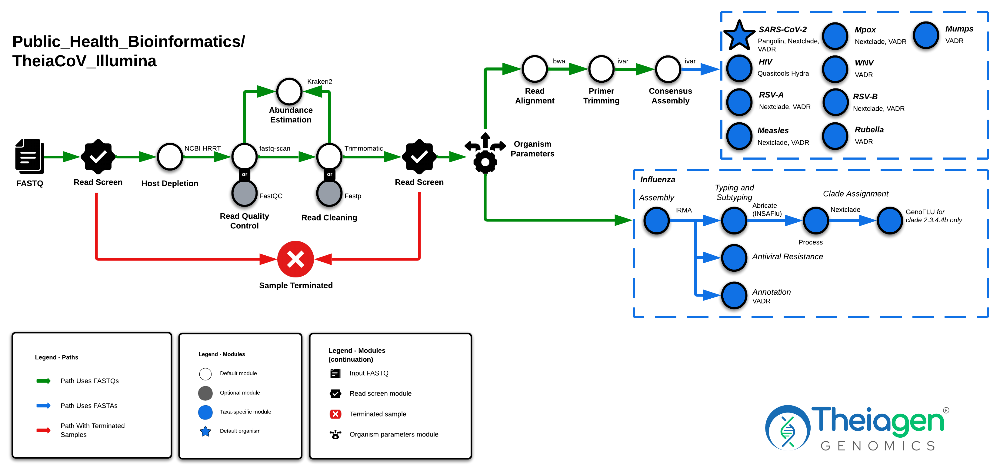

# TheiaCoV Workflow Series

## Quick Facts

| **Workflow Type** | **Applicable Kingdom** | **Last Known Changes** | **Command-line Compatibility** | **Workflow Level** |
|---|---|---|---|---|
| [Genomic Characterization](../../workflows_overview/workflows_type.md/#genomic-characterization) | [Viral](../../workflows_overview/workflows_kingdom.md/#viral) | PHB v3.0.0 | Yes, some optional features incompatible | Sample-level |

## TheiaCoV Workflows

**The TheiaCoV workflows are for the assembly, quality assessment, and characterization of viral genomes.** There are currently five TheiaCoV workflows designed to accommodate different kinds of input data:

1. Illumina paired-end sequencing (**TheiaCoV_Illumina_PE**)
2. Illumina single-end sequencing (**TheiaCoV_Illumina_SE**)
3. ONT sequencing (**TheiaCoV_ONT**)
4. Genome assemblies (**TheiaCoV_FASTA**)
5. ClearLabs sequencing (**TheiaCoV_ClearLabs**)

Additionally, the **TheiaCoV_FASTA_Batch** workflow is available to process several hundred SARS-CoV-2 assemblies at the same time.

---

!!! dna inline end "Key Resources"

    [**Reference Materials for SARS-CoV-2**](https://theiagen.notion.site/Docker-Image-and-Reference-Materials-for-SARS-CoV-2-Genomic-Characterization-98328c61f5cb4f77975f512b55d09108?pvs=74)

    [**Reference Materials for Mpox**](https://theiagen.notion.site/Workspace-Reference-Materials-for-MPXV-Genomic-Characterization-a34f355c68c54c0a82e926d4de607bca)

    [**Reference Materials for non-default viruses**](../../guides/custom_organisms.md)

    ??? toggle "HIV Input JSONs"
        - [TheiaCoV_Illumina_PE_HIV_v1_2024-04-19.json](../../assets/files/input_jsons/TheiaCoV_Illumina_PE_HIV_v1_2024-04-19.json)
        - [TheiaCoV_Illumina_PE_HIV_v2_2024-04-19.json](../../assets/files/input_jsons/TheiaCoV_Illumina_PE_HIV_v2_2024-04-19.json)
        - [TheiaCoV_ONT_HIV_v1_2024-04-19.json](../../assets/files/input_jsons/TheiaCoV_ONT_HIV_v1_2024-04-19.json)
        - [TheiaCoV_ONT_HIV_v2_2024-04-19.json](../../assets/files/input_jsons/TheiaCoV_ONT_HIV_v2_2024-04-19.json)
        
    ??? toggle "WNV Input JSONs"
        - [TheiaCoV_Illumina_PE_WNV_2024-04-19.json](../../assets/files/input_jsons/TheiaCoV_Illumina_PE_WNV_2024-04-19.json)
        - [TheiaCoV_Illumina_SE_WNV_2024-04-19.json](../../assets/files/input_jsons/TheiaCoV_Illumina_SE_WNV_2024-04-19.json)
        - [TheiaCoV_FASTA_WNV_2024-04-19.json](../../assets/files/input_jsons/TheiaCoV_FASTA_WNV_2024-04-19.json)
        
    ??? toggle "Flu Input JSONs"
        - [TheiaCoV_Illumina_PE_flu_2024-04-19.json](../../assets/files/input_jsons/TheiaCoV_Illumina_PE_flu_2024-04-19.json)
        - [TheiaCoV_ONT_flu_2024-04-19.json](../../assets/files/input_jsons/TheiaCoV_ONT_flu_2024-04-19.json)
        - [TheiaCoV_FASTA_flu_2024-04-19.json](../../assets/files/input_jsons/TheiaCoV_FASTA_flu_2024-04-19.json)
        
    ??? toggle "RSV-A Input JSONs"
        - [TheiaCoV_Illumina_PE_RSV-A_2024-04-19.json](../../assets/files/input_jsons/TheiaCoV_Illumina_PE_RSV-A_2024-04-19.json)
        - [TheiaCoV_FASTA_RSV-A_2024-04-19.json](../../assets/files/input_jsons/TheiaCoV_FASTA_RSV-A_2024-04-19.json)

    ??? toggle "RSV-B Input JSONs" 
        - [TheiaCoV_Illumina_PE_RSV-B_2024-04-19.json](../../assets/files/input_jsons/TheiaCoV_Illumina_PE_RSV-B_2024-04-19.json)
        - [TheiaCoV_FASTA_RSV-B_2024-04-19.json](../../assets/files/input_jsons/TheiaCoV_FASTA_RSV-B_2024-04-19.json)

!!! caption "TheiaCoV Workflow Diagram"
    

### Supported Organisms

These workflows currently support the following organisms. The first option in the list (bolded) is what our workflows use as the _standardized_ organism name:

- **SARS-CoV-2** (**`"sars-cov-2"`**, `"SARS-CoV-2"`) - ==_default organism input_==
- **Monkeypox virus** (**`"MPXV"`**, `"mpox"`, `"monkeypox"`, `"Monkeypox virus"`, `"Mpox"`)
- **Human Immunodeficiency Virus** (**`"HIV"`**)
- **West Nile Virus** (**`"WNV"`**, `"wnv"`, `"West Nile virus"`)
- **Influenza** (**`"flu"`**, `"influenza"`, `"Flu"`, `"Influenza"`)
- **RSV-A** (**`"rsv_a"`**, `"rsv-a"`, `"RSV-A"`, `"RSV_A"`)
- **RSV-B** (**`"rsv_b"`**, `"rsv-b"`, `"RSV-B"`, `"RSV_B"`)

The compatibility of each workflow with each pathogen is shown below:

|  | SARS-CoV-2 | Mpox | HIV | WNV | Influenza | RSV-A | RSV-B |
| --- | --- | --- | --- | --- | --- | --- | --- |
| Illumina_PE | ✅ | ✅ | ✅ | ✅ | ✅ | ✅ | ✅ |
| Illumina_SE | ✅ | ✅ | ❌ | ✅ | ❌ | ✅ | ✅ |
| ClearLabs | ✅ | ❌ | ❌ | ❌ | ❌ | ❌ | ❌ |
| ONT | ✅ | ✅ | ✅ | ❌ | ✅ | ✅ | ✅ |
| FASTA | ✅ | ✅ | ❌ | ✅ | ✅ | ✅ | ✅ |

We've provided the following information to help you set up the workflow for each organism in the form of input JSONs.

### Inputs

All TheiaCoV Workflows (not TheiaCoV_FASTA_Batch)

!!! dna ""
    ??? toggle "TheiaCoV_Illumina_PE Input Read Data"

        The TheiaCoV_Illumina_PE workflow takes in Illumina paired-end read data. Read file names should end with `.fastq` or `.fq`, with the optional addition of `.gz`. When possible, Theiagen recommends zipping files with [gzip](https://www.gnu.org/software/gzip/) before Terra uploads to minimize data upload time.

        By default, the workflow anticipates **2 x 150bp** reads (i.e. the input reads were generated using a 300-cycle sequencing kit). Modifications to the optional parameter for `trim_minlen` may be required to accommodate shorter read data, such as the 2 x 75bp reads generated using a 150-cycle sequencing kit.

    ??? toggle "TheiaCoV_Illumina_SE Input Read Data"

        TheiaCoV_Illumina_SE takes in Illumina single-end reads. Read file names should end with `.fastq` or `.fq`, with the optional addition of `.gz`. Theiagen highly recommends zipping files with [gzip](https://www.gnu.org/software/gzip/) before uploading to Terra to minimize data upload time & save on storage costs.

        By default, the workflow anticipates **1 x 35 bp** reads  (i.e. the input reads were generated using a 70-cycle sequencing kit). Modifications to the optional parameter for `trim_minlen` may be required to accommodate longer read data.

    ??? toggle "TheiaCoV_ONT Input Read Data"

        The TheiaCoV_ONT workflow takes in base-called ONT read data. Read file names should end with `.fastq` or `.fq`, with the optional addition of `.gz`. When possible, Theiagen recommends zipping files with [gzip](https://www.gnu.org/software/gzip/) before uploading to Terra to minimize data upload time.

        **The ONT sequencing kit and base-calling approach can produce substantial variability in the amount and quality of read data. Genome assemblies produced by the TheiaCoV_ONT workflow must be quality assessed before reporting results.**

    ??? toggle "TheiaCoV_FASTA Input Assembly Data"

        The TheiaCoV_FASTA workflow takes in assembly files in FASTA format.

    ??? toggle "TheiaCoV_ClearLabs Input Read Data"

        The TheiaCoV_ClearLabs workflow takes in read data produced by the Clear Dx platform from ClearLabs. However, many users use the TheiaCoV_FASTA workflow instead of this one due to a few known issues when generating assemblies with this pipeline that are not present when using ClearLabs-generated FASTA files.

| **Terra Task Name** | **Variable** | **Type** | **Description** | **Default Value** | **Terra Status** | **Workflow** | **Organism** |
|---|---|---|---|---|---|---|---|
| theiacov_clearlabs | **primer_bed** | File | The bed file containing the primers used when sequencing was performed | | Required | CL | sars-cov-2 |
| theiacov_clearlabs | **read1** | File | Read data produced by the Clear Dx platform from ClearLabs | | Required | CL | sars-cov-2 |
| theiacov_fasta | **assembly_fasta** | File | Input assembly FASTA file | | Required | FASTA | HIV, MPXV, WNV, flu, rsv_a, rsv_b, sars-cov-2 |
| theiacov_fasta | **input_assembly_method** | String | Method used to generate the assembly file | | Required | FASTA | HIV, MPXV, WNV, flu, rsv_a, rsv_b, sars-cov-2 |
| theiacov_illumina_pe | **read1** | File | Forward Illumina read in FASTQ file format (compression optional) | | Required | PE | HIV, MPXV, WNV, flu, rsv_a, rsv_b, sars-cov-2 |
| theiacov_illumina_pe | **read2** | File | Reverse Illumina read in FASTQ file format (compression optional) | | Required | PE | HIV, MPXV, WNV, flu, rsv_a, rsv_b, sars-cov-2 |
| theiacov_illumina_se | **read1** | File | Forward Illumina read in FASTQ file format (compression optional) | | Required | SE | MPXV, WNV, sars-cov-2 |
| theiacov_ont | **read1** | File | Demultiplexed ONT read in FASTQ file format (compression optional) | | Required | ONT | HIV, MPXV, WNV, flu, sars-cov-2 |
| workflow name | **samplename** | String | Name of the sample being analyzed | | Required | CL, FASTA, ONT, PE, SE | HIV, MPXV, WNV, flu, rsv_a, rsv_b, sars-cov-2 |
| workflow name | **seq_method** | String | The sequencing methodology used to generate the input read data | | Required | FASTA | HIV, MPXV, WNV, flu, rsv_a, rsv_b, sars-cov-2 |
| clean_check_reads | **cpu** | Int | Number of CPUs to allocate to the task | 2 | Optional | ONT, PE, SE | HIV, MPXV, WNV, flu, rsv_a, rsv_b, sars-cov-2 |
| clean_check_reads | **disk_size** | Int | Amount of storage (in GB) to allocate to the task | 100 | Optional | ONT, PE, SE | HIV, MPXV, WNV, flu, rsv_a, rsv_b, sars-cov-2 |
| clean_check_reads | **docker** | String | The Docker container to use for the task | us-docker.pkg.dev/general-theiagen/bactopia/gather_samples:2.0.2 | Optional | ONT, PE, SE | HIV, MPXV, WNV, flu, rsv_a, rsv_b, sars-cov-2 |
| clean_check_reads | **memory** | Int | Amount of memory/RAM (in GB) to allocate to the task | 2 | Optional | ONT, PE, SE | HIV, MPXV, WNV, flu, rsv_a, rsv_b, sars-cov-2 |
| consensus | **cpu** | Int | Number of CPUs to allocate to the task | 8 | Optional | CL, ONT | sars-cov-2 |
| consensus | **disk_size** | Int | Amount of storage (in GB) to allocate to the task | 100 | Optional | CL, ONT | sars-cov-2 |
| consensus | **docker** | String | The Docker container to use for the task | us-docker.pkg.dev/general-theiagen/staphb/artic-ncov2019-epi2me | Optional | ONT | HIV, MPXV, WNV, flu, rsv_a, rsv_b, sars-cov-2 |
| consensus | **medaka_model** | String | In order to obtain the best results, the appropriate model must be set to match the sequencer's basecaller model; this string takes the format of {pore}_{device}_{caller variant}_{caller_version}. See also <https://github.com/nanoporetech/medaka?tab=readme-ov-file#models>. | r941_min_high_g360 | Optional | CL, ONT | sars-cov-2 |
| consensus | **memory** | Int | Amount of memory/RAM (in GB) to allocate to the task | 16 | Optional | CL, ONT | sars-cov-2 |
| consensus_qc | **cpu** | Int | Number of CPUs to allocate to the task | 1 | Optional | CL, FASTA, ONT, PE, SE | HIV, MPXV, WNV, rsv_a, rsv_b, sars-cov-2 |
| consensus_qc | **disk_size** | Int | Amount of storage (in GB) to allocate to the task | 100 | Optional | CL, FASTA, ONT, PE, SE | HIV, MPXV, WNV, rsv_a, rsv_b, sars-cov-2 |
| consensus_qc | **docker** | String | The Docker container to use for the task | us-docker.pkg.dev/general-theiagen/theiagen/utility:1.1 | Optional | CL, FASTA, ONT, PE, SE | HIV, MPXV, WNV, rsv_a, rsv_b, sars-cov-2 |
| consensus_qc | **genome_length** | Int | Internal component, do not modify | | Do not modify, Optional | CL, SE | HIV, MPXV, WNV, rsv_a, rsv_b, sars-cov-2 |
| consensus_qc | **memory** | Int | Amount of memory/RAM (in GB) to allocate to the task | 2 | Optional | CL, FASTA, ONT, PE, SE | HIV, MPXV, WNV, rsv_a, rsv_b, sars-cov-2 |
| fastq_scan_clean_reads | **cpu** | Int | Number of CPUs to allocate to the task | 1 | Optional | CL | sars-cov-2 |
| fastq_scan_clean_reads | **disk_size** | Int | Amount of storage (in GB) to allocate to the task | 100 | Optional | CL | sars-cov-2 |
| fastq_scan_clean_reads | **docker** | String | The Docker container to use for the task | us-docker.pkg.dev/general-theiagen/theiagen/utility:1.1 | Optional | CL | sars-cov-2 |
| fastq_scan_clean_reads | **memory** | Int | Amount of memory/RAM (in GB) to allocate to the task | 2 | Optional | CL | sars-cov-2 |
| fastq_scan_clean_reads | **read1_name** | Int | Internal component, do not modify | | Do not modify, Optional | CL | sars-cov-2 |
| fastq_scan_raw_reads | **cpu** | Int | Number of CPUs to allocate to the task | 1 | Optional | CL | sars-cov-2 |
| fastq_scan_raw_reads | **disk_size** | Int | Amount of storage (in GB) to allocate to the task | 100 | Optional | CL | sars-cov-2 |
| fastq_scan_raw_reads | **docker** | String | The Docker container to use for the task | us-docker.pkg.dev/general-theiagen/theiagen/utility:1.1 | Optional | CL | sars-cov-2 |
| fastq_scan_raw_reads | **memory** | Int | Amount of memory/RAM (in GB) to allocate to the task | 2 | Optional | CL | sars-cov-2 |
| fastq_scan_raw_reads | **read1_name** | Int | Internal component, do not modify | | Do not modify, Optional | CL | sars-cov-2 |
| flu_track | **abricate_flu_cpu** | Int | Number of CPUs to allocate to the task | 2 | Optional | FASTA, ONT, PE | flu |
| flu_track | **abricate_flu_disk_size** | Int | Amount of storage (in GB) to allocate to the task | 100 | Optional | FASTA, ONT, PE | flu |
| flu_track | **abricate_flu_docker** | String | The Docker container to use for the task | us-docker.pkg.dev/general-theiagen/staphb/abricate:1.0.1-insaflu-220727 | Optional | FASTA, ONT, PE | flu |
| flu_track | **abricate_flu_memory** | Int | Amount of memory/RAM (in GB) to allocate to the task | 4 | Optional | FASTA, ONT, PE | flu |
| flu_track | **abricate_flu_min_percent_coverage** | Int | Minimum DNA % coverage | 60 | Optional | FASTA, ONT, PE | flu |
| flu_track | **abricate_flu_min_percent_identity** | Int | Minimum DNA % identity | 70 | Optional | FASTA, ONT, PE | flu |
| flu_track | **antiviral_aa_subs** | String | Additional list of antiviral resistance associated amino acid substitutions of interest to be searched against those called on the sample segments. They take the format of <protein>:<AA><Pos><AA>, e.g. NA:A26V | | Optional | ONT, PE | flu |
| flu_track | **assembly_metrics_cpu** | Int | Number of CPUs to allocate to the task | 2 | Optional | PE | flu |
| flu_track | **assembly_metrics_disk_size** | Int | Amount of storage (in GB) to allocate to the task | 100 | Optional | PE | flu |
| flu_track | **assembly_metrics_docker** | String | The Docker container to use for the task | us-docker.pkg.dev/general-theiagen/staphb/samtools:1.15 | Optional | PE | flu |
| flu_track | **assembly_metrics_memory** | Int | Amount of memory/RAM (in GB) to allocate to the task | 8 | Optional | PE | flu |
| flu_track | **flu_h1_ha_ref** | File | Internal component, do not modify | | Do not modify, Optional | ONT, PE | flu |
| flu_track | **flu_h1n1_m2_ref** | File | Internal component, do not modify | | Do not modify, Optional | ONT, PE | flu |
| flu_track | **flu_h3_ha_ref** | File | Internal component, do not modify | | Do not modify, Optional | ONT, PE | flu |
| flu_track | **flu_h3n2_m2_ref** | File | Internal component, do not modify | | Do not modify, Optional | ONT, PE | flu |
| flu_track | **flu_n1_na_ref** | File | Internal component, do not modify | | Do not modify, Optional | ONT, PE | flu |
| flu_track | **flu_n2_na_ref** | File | Internal component, do not modify | | Do not modify, Optional | ONT, PE | flu |
| flu_track | **flu_pa_ref** | File | Internal component, do not modify | | Do not modify, Optional | ONT, PE | flu |
| flu_track | **flu_pb1_ref** | File | Internal component, do not modify | | Do not modify, Optional | ONT, PE | flu |
| flu_track | **flu_pb2_ref** | File | Internal component, do not modify | | Do not modify, Optional | ONT, PE | flu |
| flu_track | **flu_subtype** | String | The influenza subtype being analyzed. Used for picking nextclade datasets. Options: "Yamagata", "Victoria", "H1N1", "H3N2", "H5N1". Only use to override the subtype call from IRMA and ABRicate. | | Optional | CL, ONT, PE, SE | flu |
| flu_track | **genoflu_cpu** | Int | Number of CPUs to allocate to the task | 1 | Optional | FASTA, ONT, PE | flu |
| flu_track | **genoflu_cross_reference** | File | An Excel file to cross-reference BLAST findings; probably useful if novel genotypes are not in the default file used by genoflu.py | | Optional | FASTA, ONT, PE | flu |
| flu_track | **genoflu_disk_size** | Int | Amount of storage (in GB) to allocate to the task | 25 | Optional | FASTA, ONT, PE | flu |
| flu_track | **genoflu_docker** | String | The Docker container to use for the task | us-docker.pkg.dev/general-theiagen/staphb/genoflu:1.06 | Optional | FASTA, ONT, PE | flu |
| flu_track | **genoflu_memory** | Int | Amount of memory/RAM (in GB) to allocate to the task | 2 | Optional | FASTA, ONT, PE | flu |
| flu_track | **genoflu_min_percent_identity** | Float | Percent identity threshold used for calling matches for each genome segment that make up the final GenoFlu genotype | 98.0 | Optional | FASTA, ONT, PE | flu |
| flu_track | **irma_cpu** | Int | Number of CPUs to allocate to the task | 4 | Optional | ONT, PE | flu |
| flu_track | **irma_disk_size** | Int | Amount of storage (in GB) to allocate to the task | 100 | Optional | ONT, PE | flu |
| flu_track | **irma_docker_image** | String | The Docker container to use for the task | us-docker.pkg.dev/general-theiagen/staphb/irma:1.2.0 | Optional | ONT, PE | flu |
| flu_track | **irma_keep_ref_deletions** | Boolean | True/False variable that determines if sites missed (i.e. 0 reads for a site in the reference genome) during read gathering should be deleted by ambiguation by inserting `N`'s or deleting the sequence entirely. False sets this IRMA paramater to `"DEL"` and true sets it to `"NNN"` | True | Optional | ONT, PE | flu |
| flu_track | **irma_memory** | Int | Amount of memory/RAM (in GB) to allocate to the task | 16 | Optional | ONT, PE | flu |
| flu_track | **irma_min_ambiguous_threshold** | Float | Minimum called Single Nucleotide Variant (SNV) frequency for mixed based calls in the output consensus assembly (AKA amended consensus).  | 0.20 | Optional | ONT, PE | flu |
| flu_track | **irma_min_avg_consensus_allele_quality** | Int | Minimum allele coverage depth to call plurality consensus, otherwise calls "N". Setting this value too high can negatively impact final amended consensus. | 10 | Optional | ONT, PE | flu |
| flu_track | **irma_min_read_length** | Int | Minimum read length to include reads in read gathering step in IRMA. This value should not be greater than the typical read length. | 75 | Optional | ONT, PE | flu |
| flu_track | **nextclade_cpu** | Int | Number of CPUs to allocate to the task | 2 | Optional | ONT, PE | flu |
| flu_track | **nextclade_disk_size** | Int | Amount of storage (in GB) to allocate to the task | 50 | Optional | ONT, PE | flu |
| flu_track | **nextclade_docker** | String | The Docker container to use for the task | us-docker.pkg.dev/general-theiagen/nextstrain/nextclade:3.10.2 | Optional | ONT, PE | flu |
| flu_track | **nextclade_memory** | Int | Amount of memory/RAM (in GB) to allocate to the task | 4 | Optional | ONT, PE | flu |
| flu_track | **nextclade_output_parser_cpu** | Int | Number of CPUs to allocate to the task | 2 | Optional | CL, FASTA, ONT, PE, SE | HIV, MPXV, WNV, flu, rsv_a, rsv_b, sars-cov-2 |
| flu_track | **nextclade_output_parser_disk_size** | Int | Amount of storage (in GB) to allocate to the task | 50 | Optional | CL, FASTA, ONT, PE, SE | HIV, MPXV, WNV, flu, rsv_a, rsv_b, sars-cov-2 |
| flu_track | **nextclade_output_parser_docker** | String | The Docker container to use for the task | us-docker.pkg.dev/general-theiagen/python/python:3.8.18-slim | Optional | CL, FASTA, ONT, PE, SE | HIV, MPXV, WNV, flu, rsv_a, rsv_b, sars-cov-2 |
| flu_track | **nextclade_output_parser_memory** | Int | Amount of memory/RAM (in GB) to allocate to the task | 4 | Optional | CL, FASTA, ONT, PE, SE | HIV, MPXV, WNV, flu, rsv_a, rsv_b, sars-cov-2 |
| flu_track | **read2** | File | Internal component. Do not use. | | Optional | ONT | flu |
| gene_coverage | **cpu** | Int | Number of CPUs to allocate to the task | 2 | Optional | CL, ONT, PE, SE | MPXV, sars-cov-2 |
| gene_coverage | **disk_size** | Int | Amount of storage (in GB) to allocate to the task | 100 | Optional | CL, ONT, PE, SE | MPXV, sars-cov-2 |
| gene_coverage | **docker** | String | The Docker container to use for the task | us-docker.pkg.dev/general-theiagen/staphb/samtools:1.15 | Optional | CL, ONT, PE, SE | MPXV, sars-cov-2 |
| gene_coverage | **memory** | Int | Amount of memory/RAM (in GB) to allocate to the task | 8 | Optional | CL, ONT, PE, SE | MPXV, sars-cov-2 |
| gene_coverage | **min_depth** | Int | The minimum depth to determine if a position was covered. | 10 | Optional | ONT, PE, SE | MPXV, sars-cov-2 |
| gene_coverage | **sc2_s_gene_start** | Int | start nucleotide position of the SARS-CoV-2 Spike gene | 21563 | Optional | CL, ONT, PE, SE | MPXV, sars-cov-2 |
| gene_coverage | **sc2_s_gene_stop** | Int | End/Last nucleotide position of the SARS-CoV-2 Spike gene | 25384 | Optional | CL, ONT, PE, SE | MPXV, sars-cov-2 |
| ivar_consensus | **ivar_bwa_cpu** | Int | Number of CPUs to allocate to the task | 6 | Optional | SE,PE | HIV, MPXV, WNV, rsv_a, rsv_b, sars-cov-2 |
| ivar_consensus | **ivar_bwa_disk_size** | Int | Amount of storage (in GB) to allocate to the task | 100 | Optional | SE,PE | HIV, MPXV, WNV, rsv_a, rsv_b, sars-cov-2 |
| ivar_consensus | **ivar_bwa_docker** | String | The Docker container to use for the task | us-docker.pkg.dev/general-theiagen/staphb/ivar:1.3.1-titan | Optional | SE,PE | HIV, MPXV, WNV, rsv_a, rsv_b, sars-cov-2 |
| ivar_consensus | **ivar_bwa_memory** | Int | Amount of memory/RAM (in GB) to allocate to the task | 16 | Optional | SE,PE | HIV, MPXV, WNV, rsv_a, rsv_b, sars-cov-2 |
| ivar_consensus | **ivar_consensus_cpu** | Int | Number of CPUs to allocate to the task | 2 | Optional | SE,PE | HIV, MPXV, WNV, rsv_a, rsv_b, sars-cov-2 |
| ivar_consensus | **ivar_consensus_disk_size** | Int | Amount of storage (in GB) to allocate to the task | 100 | Optional | SE,PE | HIV, MPXV, WNV, rsv_a, rsv_b, sars-cov-2 |
| ivar_consensus | **ivar_consensus_docker** | String | The Docker container to use for the task | us-docker.pkg.dev/general-theiagen/staphb/ivar:1.3.1-titan | Optional | SE,PE | HIV, MPXV, WNV, rsv_a, rsv_b, sars-cov-2 |
| ivar_consensus | **ivar_consensus_memory** | Int | Amount of memory/RAM (in GB) to allocate to the task | 8 | Optional | SE,PE | HIV, MPXV, WNV, rsv_a, rsv_b, sars-cov-2 |
| ivar_consensus | **ivar_trim_primers_cpu** | Int | Number of CPUs to allocate to the task | 2 | Optional | SE,PE | HIV, MPXV, WNV, rsv_a, rsv_b, sars-cov-2 |
| ivar_consensus | **ivar_trim_primers_disk_size** | Int | Amount of storage (in GB) to allocate to the task | 100 | Optional | SE,PE | HIV, MPXV, WNV, rsv_a, rsv_b, sars-cov-2 |
| ivar_consensus | **ivar_trim_primers_docker** | String | The Docker container to use for the task | us-docker.pkg.dev/general-theiagen/staphb/ivar:1.3.1-titan | Optional | SE,PE | HIV, MPXV, WNV, rsv_a, rsv_b, sars-cov-2 |
| ivar_consensus | **ivar_trim_primers_memory** | Int | Amount of memory/RAM (in GB) to allocate to the task | 8 | Optional | SE,PE | HIV, MPXV, WNV, rsv_a, rsv_b, sars-cov-2 |
| ivar_consensus | **ivar_variant_cpu** | Int | Number of CPUs to allocate to the task | 2 | Optional  | SE,PE | HIV, MPXV, WNV, rsv_a, rsv_b, sars-cov-2 |
| ivar_consensus | **ivar_variant_disk_size** | Int | Amount of storage (in GB) to allocate to the task | 100 | Optional | SE,PE | HIV, MPXV, WNV, rsv_a, rsv_b, sars-cov-2 |
| ivar_consensus | **ivar_variant_docker** | String | The Docker container to use for the task | us-docker.pkg.dev/general-theiagen/staphb/ivar:1.3.1-titan | | SE,PE | HIV, MPXV, WNV, rsv_a, rsv_b, sars-cov-2 |
| ivar_consensus | **ivar_variant_memory** | Int | Amount of memory/RAM (in GB) to allocate to the task | 8 | Optional  | SE,PE | HIV, MPXV, WNV, rsv_a, rsv_b, sars-cov-2 |
| ivar_consensus | **read2** | File | Internal component, do not modify | | Do not modify, Optional | SE | HIV, MPXV, WNV, rsv_a, rsv_b, sars-cov-2 |
| ivar_consensus | **skip_N** | Boolean | True/False variable that determines if regions with depth less than minimum depth should not be added to the consensus sequence | FALSE | Optional | PE, SE | HIV, MPXV, WNV, rsv_a, rsv_b, sars-cov-2 |
| ivar_consensus | **stats_n_coverage_cpu** | Int | Number of CPUs to allocate to the task | 2 | Optional | SE,PE | HIV, MPXV, WNV, rsv_a, rsv_b, sars-cov-2 |
| ivar_consensus | **stats_n_coverage_disk_size** | Int | Amount of storage (in GB) to allocate to the task | 100 | Optional | SE,PE | HIV, MPXV, WNV, rsv_a, rsv_b, sars-cov-2 |
| ivar_consensus | **stats_n_coverage_docker** | String | The Docker container to use for the task | us-docker.pkg.dev/general-theiagen/staphb/samtools:1.15 | | SE,PE | HIV, MPXV, WNV, rsv_a, rsv_b, sars-cov-2 |
| ivar_consensus | **stats_n_coverage_memory** | Int | Amount of memory/RAM (in GB) to allocate to the task | 8 | Optional | SE,PE | HIV, MPXV, WNV, rsv_a, rsv_b, sars-cov-2 |
| ivar_consensus | **stats_n_coverage_primtrim_cpu** | Int | Number of CPUs to allocate to the task | 2 | Optional | SE,PE | HIV, MPXV, WNV, rsv_a, rsv_b, sars-cov-2 |
| ivar_consensus | **stats_n_coverage_primtrim_disk_size** | Int | Amount of storage (in GB) to allocate to the task | 100 | Optional | SE,PE | HIV, MPXV, WNV, rsv_a, rsv_b, sars-cov-2 |
| ivar_consensus | **stats_n_coverage_primtrim_docker** | String | The Docker container to use for the task | us-docker.pkg.dev/general-theiagen/staphb/samtools:1.15 | Optional | SE,PE | HIV, MPXV, WNV, rsv_a, rsv_b, sars-cov-2 |
| ivar_consensus | **stats_n_coverage_primtrim_memory** | Int | Amount of memory/RAM (in GB) to allocate to the task | 8 | Optional | SE,PE | HIV, MPXV, WNV, rsv_a, rsv_b, sars-cov-2 |
| kraken2_dehosted | **cpu** | Int | Number of CPUs to allocate to the task | 4 | Optional | CL | sars-cov-2 |
| kraken2_dehosted | **disk_size** | Int | Amount of storage (in GB) to allocate to the task | 100 | Optional | CL | sars-cov-2 |
| kraken2_dehosted | **docker_image** | String | The Docker container to use for the task | us-docker.pkg.dev/general-theiagen/staphb/kraken2:2.1.2-no-db | Optional | CL | sars-cov-2 |
| kraken2_dehosted | **kraken2_db** | File | The database used to run Kraken2. Must contain viral and human sequences. | "gs://theiagen-large-public-files-rp/terra/databases/kraken2/kraken2_humanGRCh38_viralRefSeq_20240828.tar.gz" | Optional | CL | sars-cov-2 |
| kraken2_dehosted | **memory** | Int | Amount of memory/RAM (in GB) to allocate to the task | 8 | Optional | CL | sars-cov-2 |
| kraken2_dehosted | **read2** | File | Internal component, do not modify | | Do not modify, Optional | CL | sars-cov-2 |
| kraken2_raw | **cpu** | Int | Number of CPUs to allocate to the task | 4 | Optional | CL | sars-cov-2 |
| kraken2_raw | **disk_size** | Int | Amount of storage (in GB) to allocate to the task | 100 | Optional | CL | sars-cov-2 |
| kraken2_raw | **docker_image** | Int | Docker container used in this task | us-docker.pkg.dev/general-theiagen/staphb/kraken2:2.1.2-no-db | Optional | CL | sars-cov-2 |
| kraken2_raw | **kraken2_db** | File | The database used to run Kraken2. Must contain viral and human sequences. | "gs://theiagen-large-public-files-rp/terra/databases/kraken2/kraken2_humanGRCh38_viralRefSeq_20240828.tar.gz" | Optional | CL | sars-cov-2 |
| kraken2_raw | **memory** | String | Amount of memory/RAM (in GB) to allocate to the task | 8 | Optional | CL | sars-cov-2 |
| kraken2_raw | **read_processing** | String | The tool used for trimming of primers from reads. Options are trimmomatic and fastp | trimmomatic | Optional | | HIV, MPXV, WNV, flu, rsv_a, rsv_b, sars-cov-2 |
| kraken2_raw | **read2** | File | Internal component, do not modify | | Do not modify, Optional | CL | sars-cov-2 |
| nanoplot_clean | **cpu** | Int | Number of CPUs to allocate to the task | 4 | Optional | ONT | HIV, MPXV, WNV, flu, rsv_a, rsv_b, sars-cov-2 |
| nanoplot_clean | **disk_size** | Int | Amount of storage (in GB) to allocate to the task | 100 | Optional | ONT | HIV, MPXV, WNV, flu, rsv_a, rsv_b, sars-cov-2 |
| nanoplot_clean | **docker** | String | The Docker container to use for the task | us-docker.pkg.dev/general-theiagen/staphb/nanoplot:1.40.0 | Optional | ONT | HIV, MPXV, WNV, flu, rsv_a, rsv_b, sars-cov-2 |
| nanoplot_clean | **max_length** | Int | The maximum length of clean reads, for which reads longer than the length specified will be hidden. | 100000 | Optional | ONT | HIV, MPXV, WNV, flu, rsv_a, rsv_b, sars-cov-2 |
| nanoplot_clean | **memory** | Int | Amount of memory/RAM (in GB) to allocate to the task | 16 | Optional | ONT | HIV, MPXV, WNV, flu, rsv_a, rsv_b, sars-cov-2 |
| nanoplot_raw | **cpu** | Int | Number of CPUs to allocate to the task | 4 | Optional | ONT | HIV, MPXV, WNV, flu, rsv_a, rsv_b, sars-cov-2 |
| nanoplot_raw | **disk_size** | Int | Amount of storage (in GB) to allocate to the task | 100 | Optional | ONT | HIV, MPXV, WNV, flu, rsv_a, rsv_b, sars-cov-2 |
| nanoplot_raw | **docker** | String | The Docker container to use for the task | us-docker.pkg.dev/general-theiagen/staphb/nanoplot:1.40.0 | Optional | ONT | HIV, MPXV, WNV, flu, rsv_a, rsv_b, sars-cov-2 |
| nanoplot_raw | **max_length** | Int | The maximum length of clean reads, for which reads longer than the length specified will be hidden. | 100000 | Optional | ONT | HIV, MPXV, WNV, flu, rsv_a, rsv_b, sars-cov-2 |
| nanoplot_raw | **memory** | Int | Amount of memory/RAM (in GB) to allocate to the task | 16 | Optional | ONT | HIV, MPXV, WNV, flu, rsv_a, rsv_b, sars-cov-2 |
| ncbi_scrub_se | **cpu** | Int | Number of CPUs to allocate to the task | 4 | Optional | CL | sars-cov-2 |
| ncbi_scrub_se | **disk_size** | Int | Amount of storage (in GB) to allocate to the task | 100 | Optional | CL | sars-cov-2 |
| ncbi_scrub_se | **docker** | String | The Docker container to use for the task | us-docker.pkg.dev/general-theiagen/ncbi/sra-human-scrubber:2.2.1 | Optional | CL | sars-cov-2 |
| ncbi_scrub_se | **memory** | Int | Amount of memory/RAM (in GB) to allocate to the task | 8 | Optional | CL | sars-cov-2 |
| nextclade_output_parser | **cpu** | Int | Number of CPUs to allocate to the task | 2 | Optional | ONT, PE | HIV, MPXV, WNV, flu, rsv_a, rsv_b, sars-cov-2 |
| nextclade_output_parser | **disk_size** | Int | Amount of storage (in GB) to allocate to the task | 50 | Optional | ONT, PE | HIV, MPXV, WNV, flu, rsv_a, rsv_b, sars-cov-2 |
| nextclade_output_parser | **docker** | String | The Docker container to use for the task | us-docker.pkg.dev/general-theiagen/python/python:3.8.18-slim | Optional | ONT, PE | HIV, MPXV, WNV, flu, rsv_a, rsv_b, sars-cov-2 |
| nextclade_output_parser | **memory** | Int | Amount of memory/RAM (in GB) to allocate to the task | 2 | Optional | ONT, PE | HIV, MPXV, WNV, flu, rsv_a, rsv_b, sars-cov-2 |
| nextclade_v3 | **auspice_reference_tree_json** | File | An Auspice JSON phylogenetic reference tree which serves as a target for phylogenetic placement. | Inherited from nextclade dataset | Optional | CL, FASTA, ONT, PE, SE | HIV, MPXV, WNV, flu, rsv_a, rsv_b, sars-cov-2 |
| nextclade_v3 | **cpu** | Int | Number of CPUs to allocate to the task | 2 | Optional | CL, FASTA, ONT, PE, SE | HIV, MPXV, WNV, flu, rsv_a, rsv_b, sars-cov-2 |
| nextclade_v3 | **disk_size** | Int | Amount of storage (in GB) to allocate to the task | 50 | Optional | CL, FASTA, ONT, PE, SE | HIV, MPXV, WNV, flu, rsv_a, rsv_b, sars-cov-2 |
| nextclade_v3 | **docker** | String | The Docker container to use for the task | us-docker.pkg.dev/general-theiagen/nextstrain/nextclade:3.10.2 | Optional | CL, FASTA, ONT, PE, SE | HIV, MPXV, WNV, flu, rsv_a, rsv_b, sars-cov-2 |
| nextclade_v3 | **gene_annotations_gff** | File | A genome annotation to specify how to translate the nucleotide sequence to proteins (genome_annotation.gff3). specifying this enables codon-informed alignment and protein alignments. See here for more info: <https://docs.nextstrain.org/projects/nextclade/en/latest/user/input-files/03-genome-annotation.html> | Inherited from nextclade dataset | Optional | CL, FASTA, ONT, PE, SE | HIV, MPXV, WNV, flu, rsv_a, rsv_b, sars-cov-2 |
| nextclade_v3 | **input_ref** | File | A nucleotide sequence which serves as a reference for the pairwise alignment of all input sequences. This is also the sequence which defines the coordinate system of the genome annotation. See here for more info: <https://docs.nextstrain.org/projects/nextclade/en/latest/user/input-files/02-reference-sequence.html> | Inherited from nextclade dataset | Optional | CL, FASTA, ONT, PE, SE | HIV, MPXV, WNV, flu, rsv_a, rsv_b, sars-cov-2 |
| nextclade_v3 | **memory** | Int | Amount of memory/RAM (in GB) to allocate to the task | 4 | Optional | CL, FASTA, ONT, PE, SE | HIV, MPXV, WNV, flu, rsv_a, rsv_b, sars-cov-2 |
| nextclade_v3 | **nextclade_pathogen_json** | File | General dataset configuration file. See here for more info: <https://docs.nextstrain.org/projects/nextclade/en/latest/user/input-files/05-pathogen-config.html> | Inherited from nextclade dataset | Optional | CL, FASTA, ONT, PE, SE | HIV, MPXV, WNV, flu, rsv_a, rsv_b, sars-cov-2 |
| nextclade_v3 | **verbosity** | String | other options are: "off" , "error" , "info" , "debug" , and "trace" (highest level of verbosity) | warn | Optional | CL, FASTA, ONT, PE, SE | HIV, MPXV, WNV, flu, rsv_a, rsv_b, sars-cov-2 |
| organism_parameters | **auspice_config** | File | Auspice config file used in Augur_PHB workflow. Defaults set for various organisms & Flu segments. A minimal auspice config file is set in cases where organism is not specified and user does not provide an optional input config file. | | Optional | Augur, CL, FASTA, ONT, PE, SE | HIV, MPXV, WNV, flu, rsv_a, rsv_b, sars-cov-2 |
| organism_parameters | **flu_segment** | String | Influenza genome segment being analyzed. Options: "HA" or "NA". Automatically determined. This input is ignored if provided for TheiaCoV_Illumina_SE and TheiaCoV_ClearLabs | N/A | Optional | CL, ONT, PE, SE | flu |
| organism_parameters | **flu_subtype** | String | The influenza subtype being analyzed. Options: "Yamagata", "Victoria", "H1N1", "H3N2", "H5N1". Automatically determined. This input is ignored if provided for TheiaCoV_Illumina_SE and TheiaCoV_ClearLabs | N/A | Optional | CL, ONT, PE, SE | flu |
| organism_parameters | **gene_locations_bed_file** | File | Use to provide locations of interest where average coverage will be calculated | Default provided for SARS-CoV-2 ("gs://theiagen-public-files-rp/terra/sars-cov-2-files/sc2_gene_locations.bed") and mpox ("gs://theiagen-public-files/terra/mpxv-files/mpox_gene_locations.bed") | Optional | CL, FASTA | |
| organism_parameters | **genome_length_input** | Int | Use to specify the expected genome length; provided by default for all supported organisms | Default provided for SARS-CoV-2 (29903), mpox (197200), WNV (11000), flu (13000), RSV-A (16000), RSV-B (16000), HIV (primer versions 1 [9181] and 2 [9840]) | Optional | CL | |
| organism_parameters | **hiv_primer_version** | String | The version of HIV primers used. Options are "<https://github.com/theiagen/public_health_bioinformatics/blob/main/workflows/utilities/wf_organism_parameters.wdl#L156>" and "<https://github.com/theiagen/public_health_bioinformatics/blob/main/workflows/utilities/wf_organism_parameters.wdl#L164>". This input is ignored if provided for TheiaCoV_Illumina_SE and TheiaCoV_ClearLabs | v1 | Optional | CL, FASTA, ONT, PE, SE | HIV |
| organism_parameters | **kraken_target_organism_input** | String | The organism whose abundance the user wants to check in their reads. This should be a proper taxonomic name recognized by the Kraken database. | Default provided for mpox (Monkeypox virus), WNV (West Nile virus), and HIV (Human immunodeficiency virus 1) | Optional | FASTA, ONT, SE | HIV, MPXV, WNV, rsv_a, rsv_b, sars-cov-2 |
| organism_parameters | **pangolin_docker_image** | String | The Docker container to use for the task | us-docker.pkg.dev/general-theiagen/staphb/pangolin:4.3.1-pdata-1.29 | Optional | CL, FASTA | |
| organism_parameters | **primer_bed_file** | File | The bed file containing the primers used when sequencing was performed | REQUIRED FOR SARS-CoV-2, MPOX, WNV, RSV-A & RSV-B. Provided by default only for HIV primer versions 1 ("gs://theiagen-public-files/terra/hivgc-files/HIV-1_v1.0.primer.hyphen.bed" and 2 ("gs://theiagen-public-files/terra/hivgc-files/HIV-1_v2.0.primer.hyphen400.1.bed") | Optional, Sometimes required | CL, FASTA | |
| organism_parameters | **reference_gff_file** | File | Reference GFF file for the organism being analyzed | Default provided for mpox ("gs://theiagen-public-files/terra/mpxv-files/Mpox-MT903345.1.reference.gff3") and HIV (primer versions 1 ["gs://theiagen-public-files/terra/hivgc-files/NC_001802.1.gff3"] and 2 ["gs://theiagen-public-files/terra/hivgc-files/AY228557.1.gff3"]) | Optional | CL, FASTA, ONT | |
| organism_parameters | **vadr_max_length** | Int | Maximum length for the fasta-trim-terminal-ambigs.pl VADR script | Default provided for SARS-CoV-2 (30000), mpox (210000), WNV (11000), flu (0), RSV-A (15500) and RSV-B (15500). | Optional | CL | |
| organism_parameters | **vadr_memory** | Int | Amount of memory/RAM (in GB) to allocate to the task | 32 (RSV-A and RSV-B) and 8 (all other TheiaCoV organisms) | Optional | CL, ONT, PE, SE | MPXV, WNV, flu, rsv_a, rsv_b, sars-cov-2 |
| organism_parameters | **vadr_options** | String | Options for the v-annotate.pl VADR script | Default provided for SARS-CoV-2 ("--noseqnamemax --glsearch -s -r --nomisc --mkey sarscov2 --lowsim5seq 6 --lowsim3seq 6 --alt_fail lowscore,insertnn,deletinn --out_allfasta"), mpox ("--glsearch -s -r --nomisc --mkey mpxv --r_lowsimok --r_lowsimxd 100 --r_lowsimxl 2000 --alt_pass discontn,dupregin --out_allfasta --minimap2 --s_overhang 150"), WNV ("--mkey flavi --mdir /opt/vadr/vadr-models-flavi/ --nomisc --noprotid --out_allfasta"), flu (""), RSV-A ("-r --mkey rsv --xnocomp"), and RSV-B ("-r --mkey rsv --xnocomp") | Optional | CL | |
| organism_parameters | **vadr_skip_length** | Int | Minimum assembly length (unambiguous) to run VADR | 10000 | Optional | CL | MPXV, WNV, flu, rsv_a, rsv_b, sars-cov-2 |
| pangolin4 | **analysis_mode** | String | Pangolin inference engine for lineage designations (usher or pangolearn). Default is Usher. | | Optional | CL, FASTA, ONT, PE, SE | sars-cov-2 |
| pangolin4 | **cpu** | Int | Number of CPUs to allocate to the task | 4 | Optional | CL, FASTA, ONT, PE, SE | sars-cov-2 |
| pangolin4 | **disk_size** | Int | Amount of storage (in GB) to allocate to the task | 100 | Optional | CL, FASTA, ONT, PE, SE | sars-cov-2 |
| pangolin4 | **expanded_lineage** | Boolean | True/False that determines if a lineage should be expanded without aliases (e.g., BA.1 → B.1.1.529.1) | TRUE | Optional | CL, FASTA, ONT, PE, SE | sars-cov-2 |
| pangolin4 | **max_ambig** | Float | The maximum proportion of Ns allowed for pangolin to attempt an assignment | 0.5 | Optional | CL, FASTA, ONT, PE, SE | sars-cov-2 |
| pangolin4 | **memory** | Int | Amount of memory/RAM (in GB) to allocate to the task | 8 | Optional | CL, FASTA, ONT, PE, SE | sars-cov-2 |
| pangolin4 | **min_length** | Int | Minimum query length allowed for pangolin to attempt an assignment | 10000 | Optional | CL, FASTA, ONT, PE, SE | sars-cov-2 |
| pangolin4 | **pangolin_arguments** | String | Optional arguments for pangolin e.g. ''--skip-scorpio'' | | Optional | CL, FASTA, ONT, PE, SE | sars-cov-2 |
| pangolin4 | **skip_designation_cache** | Boolean | A True/False option that determines if the designation cache should be used | FALSE | Optional | CL, FASTA, ONT, PE, SE | sars-cov-2 |
| pangolin4 | **skip_scorpio** | Boolean | A True/False option that determines if scorpio should be skipped. | FALSE | Optional | CL, FASTA, ONT, PE, SE | sars-cov-2 |
| qc_check_task | **ani_highest_percent** | Float | Internal component, do not modify | | Do not modify, Optional | CL, FASTA, ONT, PE, SE | HIV, MPXV, WNV, flu, rsv_a, rsv_b, sars-cov-2 |
| qc_check_task | **ani_highest_percent_bases_aligned** | Float | Internal component, do not modify | | Do not modify, Optional | CL, FASTA, ONT, PE, SE | HIV, MPXV, WNV, flu, rsv_a, rsv_b, sars-cov-2 |
| qc_check_task | **assembly_length** | Int | Internal component, do not modify | | Do not modify, Optional | CL, FASTA, ONT, PE, SE | HIV, MPXV, WNV, flu, rsv_a, rsv_b, sars-cov-2 |
| qc_check_task | **assembly_mean_coverage** | Int | Internal component, do not modify | | Do not modify, Optional | FASTA | HIV, MPXV, WNV, flu, rsv_a, rsv_b, sars-cov-2 |
| qc_check_task | **busco_results** | String | Internal component, do not modify | | Do not modify, Optional | CL, FASTA, ONT, PE, SE | HIV, MPXV, WNV, flu, rsv_a, rsv_b, sars-cov-2 |
| qc_check_task | **combined_mean_q_clean** | Float | Internal component, do not modify | | Do not modify, Optional | CL, FASTA, ONT, PE, SE | HIV, MPXV, WNV, flu, rsv_a, rsv_b, sars-cov-2 |
| qc_check_task | **combined_mean_q_raw** | Float | Internal component, do not modify | | Do not modify, Optional | CL, FASTA, ONT, PE, SE | HIV, MPXV, WNV, flu, rsv_a, rsv_b, sars-cov-2 |
| qc_check_task | **combined_mean_readlength_clean** | Float | Internal component, do not modify | | Do not modify, Optional | CL, FASTA, ONT, PE, SE | HIV, MPXV, WNV, flu, rsv_a, rsv_b, sars-cov-2 |
| qc_check_task | **combined_mean_readlength_raw** | Float | Internal component, do not modify | | Do not modify, Optional | CL, FASTA, ONT, PE, SE | HIV, MPXV, WNV, flu, rsv_a, rsv_b, sars-cov-2 |
| qc_check_task | **cpu** | Int | Number of CPUs to allocate to the task | 4 | Optional | CL, FASTA, ONT, PE, SE | HIV, MPXV, WNV, flu, rsv_a, rsv_b, sars-cov-2 |
| qc_check_task | **disk_size** | Int | Amount of storage (in GB) to allocate to the task | 100 | Optional | CL, FASTA, ONT, PE, SE | HIV, MPXV, WNV, flu, rsv_a, rsv_b, sars-cov-2 |
| qc_check_task | **docker** | String | The Docker container to use for the task | us-docker.pkg.dev/general-theiagen/theiagen/terra-tools:2023-03-16 | Optional | CL, FASTA, ONT, PE, SE | HIV, MPXV, WNV, flu, rsv_a, rsv_b, sars-cov-2 |
| qc_check_task | **est_coverage_clean** | Float | Internal component, do not modify | | Do not modify, Optional | CL, FASTA, ONT, PE, SE | HIV, MPXV, WNV, flu, rsv_a, rsv_b, sars-cov-2 |
| qc_check_task | **est_coverage_raw** | Float | Internal component, do not modify | | Do not modify, Optional | CL, FASTA, ONT, PE, SE | HIV, MPXV, WNV, flu, rsv_a, rsv_b, sars-cov-2 |
| qc_check_task | **gambit_predicted_taxon** | String | Internal component, do not modify | | Do not modify, Optional | CL, FASTA, ONT, PE, SE | HIV, MPXV, WNV, flu, rsv_a, rsv_b, sars-cov-2 |
| qc_check_task | **kraken_human** | String | Internal component, do not modify | | Do not modify, Optional | FASTA, ONT, SE | |
| qc_check_task | **kraken_human_dehosted** | String | Internal component, do not modify | | Do not modify, Optional | FASTA, ONT, SE | |
| qc_check_task | **kraken_sc2** | String | Internal component, do not modify | | Do not modify, Optional | CL, FASTA, ONT, PE, SE | HIV, MPXV, WNV, flu, rsv_a, rsv_b, sars-cov-2 |
| qc_check_task | **kraken_sc2_dehosted** | String | Internal component, do not modify | | Do not modify, Optional | CL, FASTA, ONT, PE, SE | HIV, MPXV, WNV, flu, rsv_a, rsv_b, sars-cov-2 |
| qc_check_task | **kraken_target_organism** | Float | Internal component, do not modify | | Do not modify, Optional | CL, FASTA, ONT, PE, SE | HIV, MPXV, WNV, flu, rsv_a, rsv_b, sars-cov-2 |
| qc_check_task | **kraken_target_organism_dehosted** | Float | Internal component, do not modify | | Do not modify, Optional | CL, FASTA, ONT, PE, SE | HIV, MPXV, WNV, flu, rsv_a, rsv_b, sars-cov-2 |
| qc_check_task | **memory** | Int | Amount of memory/RAM (in GB) to allocate to the task | 8 | Optional | CL, FASTA, ONT, PE, SE | HIV, MPXV, WNV, flu, rsv_a, rsv_b, sars-cov-2 |
| qc_check_task | **midas_secondary_genus_abundance** | Float | Internal component, do not modify | | Do not modify, Optional | CL, FASTA, ONT, PE, SE | HIV, MPXV, WNV, flu, rsv_a, rsv_b, sars-cov-2 |
| qc_check_task | **midas_secondary_genus_coverage** | Float | Internal component, do not modify | | Do not modify, Optional | CL, FASTA, ONT, PE, SE | HIV, MPXV, WNV, flu, rsv_a, rsv_b, sars-cov-2 |
| qc_check_task | **minbaseq_trim** | Int | Internal component, do not modify | | Do not modify, Optional | FASTA | HIV, MPXV, WNV, flu, rsv_a, rsv_b, sars-cov-2 |
| qc_check_task | **n50_value** | Int | Internal component, do not modify | | Do not modify, Optional | CL, FASTA, ONT, PE, SE | HIV, MPXV, WNV, flu, rsv_a, rsv_b, sars-cov-2 |
| qc_check_task | **num_reads_clean2** | Int | Internal component, do not modify | | Do not modify, Optional | CL, FASTA, ONT, SE | |
| qc_check_task | **num_reads_raw2** | Int | Internal component, do not modify | | Do not modify, Optional | CL, FASTA, ONT, SE | |
| qc_check_task | **number_contigs** | Int | Internal component, do not modify | | Do not modify, Optional | CL, FASTA, ONT, PE, SE | HIV, MPXV, WNV, flu, rsv_a, rsv_b, sars-cov-2 |
| qc_check_task | **quast_gc_percent** | Float | Internal component, do not modify | | Do not modify, Optional | CL, FASTA, ONT, PE, SE | HIV, MPXV, WNV, flu, rsv_a, rsv_b, sars-cov-2 |
| qc_check_task | **r1_mean_q_clean** | Float | Internal component, do not modify | | Do not modify, Optional | CL, FASTA, ONT, PE, SE | HIV, MPXV, WNV, flu, rsv_a, rsv_b, sars-cov-2 |
| qc_check_task | **r1_mean_q_raw** | Float | Internal component, do not modify | | Do not modify, Optional | CL, FASTA, ONT, PE, SE | HIV, MPXV, WNV, flu, rsv_a, rsv_b, sars-cov-2 |
| qc_check_task | **r1_mean_readlength_clean** | Float | Internal component, do not modify | | Do not modify, Optional | CL, FASTA, ONT, PE, SE | HIV, MPXV, WNV, flu, rsv_a, rsv_b, sars-cov-2 |
| qc_check_task | **r1_mean_readlength_raw** | Float | Internal component, do not modify | | Do not modify, Optional | CL, FASTA, ONT, PE, SE | HIV, MPXV, WNV, flu, rsv_a, rsv_b, sars-cov-2 |
| qc_check_task | **r2_mean_q_clean** | Float | Internal component, do not modify | | Do not modify, Optional | CL, FASTA, ONT, PE, SE | HIV, MPXV, WNV, flu, rsv_a, rsv_b, sars-cov-2 |
| qc_check_task | **r2_mean_q_raw** | Float | Internal component, do not modify | | Do not modify, Optional | CL, FASTA, ONT, PE, SE | HIV, MPXV, WNV, flu, rsv_a, rsv_b, sars-cov-2 |
| qc_check_task | **r2_mean_readlength_clean** | Float | Internal component, do not modify | | Do not modify, Optional | CL, FASTA, ONT, PE, SE | HIV, MPXV, WNV, flu, rsv_a, rsv_b, sars-cov-2 |
| qc_check_task | **r2_mean_readlength_raw** | Float | Internal component, do not modify | | Do not modify, Optional | CL, FASTA, ONT, PE, SE | HIV, MPXV, WNV, flu, rsv_a, rsv_b, sars-cov-2 |
| qc_check_task | **sc2_s_gene_mean_coverage** | Float | Internal component, do not modify | | Do not modify, Optional | CL, FASTA, ONT, PE, SE | HIV, MPXV, WNV, flu, rsv_a, rsv_b, sars-cov-2 |
| qc_check_task | **sc2_s_gene_percent_coverage** | Float | Internal component, do not modify | | Do not modify, Optional | CL, FASTA, ONT, PE, SE | HIV, MPXV, WNV, flu, rsv_a, rsv_b, sars-cov-2 |
| quasitools_illumina_pe | **cpu** | Int | Number of CPUs to allocate to the task | 2 | Optional | PE | HIV |
| quasitools_illumina_pe | **disk_size** | Int | Amount of storage (in GB) to allocate to the task | 50 | Optional | PE | HIV |
| quasitools_illumina_pe | **docker** | String | The Docker container to use for the task | us-docker.pkg.dev/general-theiagen/biocontainers/quasitools:0.7.0--pyh864c0ab_1 | Optional | PE | HIV |
| quasitools_illumina_pe | **memory** | Int | Amount of memory/RAM (in GB) to allocate to the task | 4 | Optional | PE | HIV |
| quasitools_ont | **cpu** | Int | Number of CPUs to allocate to the task | 2 | Optional | ONT | HIV |
| quasitools_ont | **disk_size** | Int | Amount of storage (in GB) to allocate to the task | 50 | Optional | ONT | HIV |
| quasitools_ont | **docker** | String | The Docker container to use for the task | us-docker.pkg.dev/general-theiagen/biocontainers/quasitools:0.7.0--pyh864c0ab_1 | Optional | ONT | HIV |
| quasitools_ont | **memory** | Int | Amount of memory/RAM (in GB) to allocate to the task | 4 | Optional | ONT | HIV |
| quasitools_ont | **read2** | File | Internal component. Do not use. | | Do not modify, Optional | ONT | HIV |
| raw_check_reads | **cpu** | Int | Number of CPUs to allocate to the task | 2 | Optional | ONT, PE, SE | HIV, MPXV, WNV, flu, rsv_a, rsv_b, sars-cov-2 |
| raw_check_reads | **disk_size** | Int | Amount of storage (in GB) to allocate to the task | 100 | Optional | ONT, PE, SE | HIV, MPXV, WNV, flu, rsv_a, rsv_b, sars-cov-2 |
| raw_check_reads | **docker** | String | The Docker container to use for the task | us-docker.pkg.dev/general-theiagen/bactopia/gather_samples:2.0.2 | Optional | ONT, PE, SE | HIV, MPXV, WNV, flu, rsv_a, rsv_b, sars-cov-2 |
| raw_check_reads | **memory** | Int | Amount of memory/RAM (in GB) to allocate to the task | 2 | Optional | ONT, PE, SE | HIV, MPXV, WNV, flu, rsv_a, rsv_b, sars-cov-2 |
| read_QC_trim | **artic_guppyplex_cpu** | Int | Number of CPUs to allocate to the task | 8 | Optional | ONT | HIV, MPXV, WNV, flu, rsv_a, rsv_b, sars-cov-2 |
| read_QC_trim | **artic_guppyplex_disk_size** | Int | Amount of storage (in GB) to allocate to the task | 100 | Optional | ONT | HIV, MPXV, WNV, flu, rsv_a, rsv_b, sars-cov-2 |
| read_QC_trim | **artic_guppyplex_docker** | String | The Docker container to use for the task | us-docker.pkg.dev/general-theiagen/staphb/artic-ncov2019:1.3.0-medaka-1.4.3 | Optional | ONT | HIV, MPXV, WNV, flu, rsv_a, rsv_b, sars-cov-2 |
| read_QC_trim | **artic_guppyplex_memory** | Int | Amount of memory/RAM (in GB) to allocate to the task | 16 | Optional | ONT | HIV, MPXV, WNV, flu, rsv_a, rsv_b, sars-cov-2 |
| read_QC_trim | **bbduk_memory** | Int | Amount of memory/RAM (in GB) to allocate to the task | 8 | Optional | PE, SE | HIV, MPXV, WNV, flu, rsv_a, rsv_b, sars-cov-2 |
| read_QC_trim | **call_kraken** | Boolean | True/False variable that determines if the Kraken2 task should be called. | FALSE | Optional | PE, SE, ONT | HIV, MPXV, WNV, flu, rsv_a, rsv_b, sars-cov-2 |
| read_QC_trim | **call_midas** | Boolean | True/False variable that determines if the MIDAS task should be called. | TRUE | Optional | PE, SE | HIV, MPXV, WNV, flu, rsv_a, rsv_b, sars-cov-2 |
| read_QC_trim | **downsampling_coverage** | Float | The desired coverage to sub-sample the reads to with RASUSA | 150 | Optional | ONT | HIV, MPXV, WNV, flu, rsv_a, rsv_b, sars-cov-2 |
| read_QC_trim | **fastp_args** | String | Additional fastp task arguments | --detect_adapter_for_pe -g -5 20 -3 20 | Optional | PE, SE | HIV, MPXV, WNV, flu, rsv_a, rsv_b, sars-cov-2 |
| read_QC_trim | **kraken_cpu** | Int | Number of CPUs to allocate to the task | 4 | Optional | ONT, PE, SE | HIV, MPXV, WNV, flu, rsv_a, rsv_b, sars-cov-2 |
| read_QC_trim | **kraken_db** | File | The database used to run Kraken2. Must contain viral and human sequences. | "gs://theiagen-large-public-files-rp/terra/databases/kraken2/kraken2_humanGRCh38_viralRefSeq_20240828.tar.gz" | Optional | ONT, PE, SE, ONT | HIV, MPXV, WNV, flu, rsv_a, rsv_b, sars-cov-2 |
| read_QC_trim | **kraken_disk_size** | Int | Amount of storage (in GB) to allocate to the task | 100 | Optional | ONT, PE, SE | HIV, MPXV, WNV, flu, rsv_a, rsv_b, sars-cov-2 |
| read_QC_trim | **kraken_docker_image** | Int | The Docker container to use for the task | "us-docker.pkg.dev/general-theiagen/staphb/kraken2:2.1.2-no-db" | Optional | ONT | HIV, MPXV, WNV, flu, rsv_a, rsv_b, sars-cov-2 |
| read_QC_trim | **kraken_memory** | Int | Amount of memory/RAM (in GB) to allocate to the task | 8 | Optional | ONT, PE, SE | HIV, MPXV, WNV, flu, rsv_a, rsv_b, sars-cov-2 |
| read_QC_trim | **midas_db** | File | The database used by the MIDAS task | gs://theiagen-public-files-rp/terra/theiaprok-files/midas/midas_db_v1.2.tar.gz | Optional | PE, SE | HIV, MPXV, WNV, flu, rsv_a, rsv_b, sars-cov-2 |
| read_QC_trim | **nanoq_cpu** | Int | Number of CPUs to allocate to the task | 2 | Optional | ONT | HIV, MPXV, WNV, flu, rsv_a, rsv_b, sars-cov-2 |
| read_QC_trim | **nanoq_disk_size** | Int | Amount of storage (in GB) to allocate to the task | 100 | Optional | ONT | HIV, MPXV, WNV, flu, rsv_a, rsv_b, sars-cov-2 |
| read_QC_trim | **nanoq_docker** | String | The Docker container to use for the task | "us-docker.pkg.dev/general-theiagen/biocontainers/nanoq:0.9.0--hec16e2b_1" | Optional | ONT | HIV, MPXV, WNV, flu, rsv_a, rsv_b, sars-cov-2 |
| read_QC_trim | **nanoq_max_read_length** | Int | The maximum read length to keep after trimming | 100000 | Optional | ONT | HIV, MPXV, WNV, flu, rsv_a, rsv_b, sars-cov-2 |
| read_QC_trim | **nanoq_max_read_qual** | Int | The maximum read quality to keep after trimming | 40 | Optional | ONT | HIV, MPXV, WNV, flu, rsv_a, rsv_b, sars-cov-2 |
| read_QC_trim | **nanoq_memory** | Int | Amount of memory/RAM (in GB) to allocate to the task | 2 | Optional | ONT | HIV, MPXV, WNV, flu, rsv_a, rsv_b, sars-cov-2 |
| read_QC_trim | **nanoq_min_read_length** | Int | The minimum read length to keep after trimming | 500 | Optional | ONT | HIV, MPXV, WNV, flu, rsv_a, rsv_b, sars-cov-2 |
| read_QC_trim | **nanoq_min_read_qual** | Int | The minimum read quality to keep after trimming | 10 | Optional | ONT | HIV, MPXV, WNV, flu, rsv_a, rsv_b, sars-cov-2 |
| read_QC_trim | **ncbi_scrub_cpu** | Int | Number of CPUs to allocate to the task | 4 | Optional | ONT | HIV, MPXV, WNV, flu, rsv_a, rsv_b, sars-cov-2 |
| read_QC_trim | **ncbi_scrub_disk_size** | Int | Amount of storage (in GB) to allocate to the task | 100 | Optional | ONT | HIV, MPXV, WNV, flu, rsv_a, rsv_b, sars-cov-2 |
| read_QC_trim | **ncbi_scrub_docker** | String | The Docker container to use for the task | "us-docker.pkg.dev/general-theiagen/ncbi/sra-human-scrubber:2.2.1" | Optional | ONT | HIV, MPXV, WNV, flu, rsv_a, rsv_b, sars-cov-2 |
| read_QC_trim | **ncbi_scrub_memory** | Int | Amount of memory/RAM (in GB) to allocate to the task | 8 | Optional | ONT | HIV, MPXV, WNV, flu, rsv_a, rsv_b, sars-cov-2 |
| read_QC_trim | **rasusa_bases** | String | Internal component, do not modify | | Optional | ONT | |
| read_QC_trim | **rasusa_cpu** | Int | Internal component, do not modify | 4 | Optional | ONT | |
| read_QC_trim | **rasusa_disk_size** | Int | Internal component, do not modify | 100 | Optional | ONT | |
| read_QC_trim | **rasusa_docker** | String | Internal component, do not modify | "us-docker.pkg.dev/general-theiagen/staphb/rasusa:2.1.0" | Optional | ONT | |
| read_QC_trim | **rasusa_fraction_of_reads** | Float | Internal component, do not modify | | Optional | ONT | |
| read_QC_trim | **rasusa_memory** | Int | Internal component, do not modify | 8 | Optional | ONT | |
| read_QC_trim | **rasusa_number_of_reads** | Int | Internal component, do not modify | | Optional | ONT | |
| read_QC_trim | **rasusa_seed** | Int | Internal component, do not modify | | Optional | ONT | |
| read_QC_trim | **read_processing** | String | The name of the tool to perform basic read processing; options: "trimmomatic" or "fastp" | trimmomatic | Optional | PE, SE | |
| read_QC_trim | **read_qc** | String | The tool used for quality control (QC) of reads. Options are fastq_scan and fastqc | fastq_scan | Optional | PE, SE | HIV, MPXV, WNV, flu, rsv_a, rsv_b, sars-cov-2 |
| read_QC_trim | **target_organism** | String | Organism to search for in Kraken | | Optional | PE, SE | HIV, MPXV, WNV, flu, rsv_a, rsv_b, sars-cov-2 |
| read_QC_trim | **trimmomatic_args** | String | Additional arguments to pass to trimmomatic | -phred33 | Optional | PE, SE | HIV, MPXV, WNV, flu, rsv_a, rsv_b, sars-cov-2 |
| set_flu_ha_nextclade_values | **reference_gff_file** | File | Reference GFF file for flu HA | | Do not modify, Optional | ONT | flu |
| set_flu_na_nextclade_values | **reference_gff_file** | Int | Reference GFF file for flu NA | | Do not modify, Optional | ONT | flu |
| set_flu_na_nextclade_values | **vadr_mem** | Int | Memory, in GB, allocated to this task | 8 | Do not modify, Optional | ONT | flu |
| stats_n_coverage | **cpu** | Int | Number of CPUs to allocate to the task | 2 | Optional | CL, ONT | |
| stats_n_coverage | **disk_size** | Int | Amount of storage (in GB) to allocate to the task | 100 | Optional | CL, ONT | |
| stats_n_coverage | **docker** | String | The Docker container to use for the task | us-docker.pkg.dev/general-theiagen/staphb/samtools:1.15 | Optional | CL, ONT | |
| stats_n_coverage | **memory** | Int | Amount of memory/RAM (in GB) to allocate to the task | 8 | Optional | CL, ONT | |
| stats_n_coverage_primtrim | **cpu** | Int | Number of CPUs to allocate to the task | 2 | Optional | CL, ONT | |
| stats_n_coverage_primtrim | **disk_size** | Int | Amount of storage (in GB) to allocate to the task | 100 | Optional | CL, ONT | |
| stats_n_coverage_primtrim | **docker** | String | The Docker container to use for the task | us-docker.pkg.dev/general-theiagen/staphb/samtools:1.15 | Optional | CL, ONT | |
| stats_n_coverage_primtrim | **memory** | Int | Amount of memory/RAM (in GB) to allocate to the task | 8 | Optional | CL, ONT | |
| vadr | **cpu** | Int | Number of CPUs to allocate to the task | 4 | Optional | CL, FASTA, ONT, PE, SE | MPXV, WNV, flu, rsv_a, rsv_b, sars-cov-2 |
| vadr | **disk_size** | Int | Amount of storage (in GB) to allocate to the task | 100 | Optional | CL, FASTA, ONT, PE, SE | MPXV, WNV, flu, rsv_a, rsv_b, sars-cov-2 |
| vadr | **docker** | String | The Docker container to use for the task | us-docker.pkg.dev/general-theiagen/staphb/vadr:1.5.1 | Optional | CL, FASTA, ONT, PE, SE | MPXV, WNV, flu, rsv_a, rsv_b, sars-cov-2 |
| vadr | **max_length** | Int | Maximum length of contig allowed to run VADR | | Optional | CL | HIV, MPXV, WNV, flu, rsv_a, rsv_b, sars-cov-2 |
| vadr | **memory** | Int | Amount of memory/RAM (in GB) to allocate to the task | 32 (RSV-A and RSV-B) and 16 (all other TheiaCoV organisms) | Optional | CL | MPXV, WNV, flu, rsv_a, rsv_b, sars-cov-2 |
| vadr | **min_length** | Int | Minimum length subsequence to possibly replace Ns for the `fasta-trim-terminal-ambigs.pl` VADR script | 50 | Optional | CL, FASTA, ONT, PE, SE | MPXV, WNV, flu, rsv_a, rsv_b, sars-cov-2 |
| vadr | **skip_length** | Int | Minimum assembly length (unambiguous) to run VADR | 10000 | Optional | CL | MPXV, WNV, flu, rsv_a, rsv_b, sars-cov-2 |
| vadr | **vadr_opts** | String | Additional options to provide to VADR | | Optional | CL | HIV, MPXV, WNV, flu, rsv_a, rsv_b, sars-cov-2 |
| version_capture | **docker** | String | The Docker container to use for the task | "us-docker.pkg.dev/general-theiagen/theiagen/alpine-plus-bash:3.20.0" | Optional | ONT, PE, SE, FASTA, CL | HIV, MPXV, WNV, flu, rsv_a, rsv_b, sars-cov-2 |
| version_capture | **timezone** | String | Set the time zone to get an accurate date of analysis (uses UTC by default) | | Optional |  ONT, PE, SE, FASTA, CL | HIV, MPXV, WNV, flu, rsv_a, rsv_b, sars-cov-2 |
| workflow name | **adapters** | File | File that contains the adapters used | /bbmap/resources/adapters.fa | Optional | PE, SE | HIV, MPXV, WNV, flu, rsv_a, rsv_b, sars-cov-2 |
| workflow name | **consensus_min_freq** | Float | The minimum frequency for a variant to be called a SNP in consensus genome | 0.6 | Optional | PE, SE | HIV, MPXV, WNV, flu, rsv_a, rsv_b, sars-cov-2 |
| workflow name | **flu_segment** | String | Influenza genome segment being analyzed. Options: "HA" or "NA". | HA | Optional, Required | FASTA | |
| workflow name | **flu_subtype** | String | The influenza subtype being analyzed. Options: "Yamagata", "Victoria", "H1N1", "H3N2", "H5N1". Automatically determined. | | Optional | FASTA | |
| workflow name | **genome_length** | Int | Use to specify the expected genome length | | Optional | FASTA, ONT, PE, SE | HIV, MPXV, WNV, flu, rsv_a, rsv_b, sars-cov-2 |
| workflow name | **max_genome_length** | Int | Maximum genome length able to pass read screening | 2673870 | Optional | ONT, PE, SE | HIV, MPXV, WNV, flu, rsv_a, rsv_b, sars-cov-2 |
| workflow name | **max_length** | Int | Maximum length for a read based on the SARS-CoV-2 primer scheme | 700 | Optional | ONT | HIV, MPXV, WNV, flu, rsv_a, rsv_b, sars-cov-2 |
| workflow name | **medaka_docker** | String | The Docker container to use for the task | us-docker.pkg.dev/general-theiagen/staphb/artic-ncov2019:1.3.0-medaka-1.4.3 | Optional | CL | |
| workflow name | **min_basepairs** | Int | Minimum base pairs to pass read screening | 34000 | Optional | ONT, PE, SE | HIV, MPXV, WNV, flu, rsv_a, rsv_b, sars-cov-2 |
| workflow name | **min_coverage** | Int | Minimum coverage to pass read screening | 10 | Optional | ONT, PE, SE | HIV, MPXV, WNV, flu, rsv_a, rsv_b, sars-cov-2 |
| workflow name | **min_depth** | Int | Minimum depth of reads required to call variants and generate a consensus genome. This value is passed to the iVar software. | 100 | Optional | ONT, PE, SE | HIV, MPXV, WNV, flu, rsv_a, rsv_b, sars-cov-2 |
| workflow name | **min_genome_length** | Int | Minimum genome length to pass read screening | 1700 | Optional | ONT, PE, SE | HIV, MPXV, WNV, flu, rsv_a, rsv_b, sars-cov-2 |
| workflow name | **min_length** | Int | Minimum length of a read based on the SARS-CoV-2 primer scheme | 400 | Optional | ONT | HIV, MPXV, WNV, flu, rsv_a, rsv_b, sars-cov-2 |
| workflow name | **min_proportion** | Int | Minimum read proportion to pass read screening | 40 | Optional | PE | HIV, MPXV, WNV, flu, rsv_a, rsv_b, sars-cov-2 |
| workflow name | **min_reads** | Int | Minimum reads to pass read screening | 113 | Optional | PE, SE | HIV, MPXV, WNV, flu, rsv_a, rsv_b, sars-cov-2 |
| workflow name | **nextclade_dataset_name** | String | Nextclade organism dataset names. However, if organism input is set correctly, this input will be automatically assigned the corresponding dataset name. See [organism defaults](./theiacov.md#org-specific) for more information | Defaults are organism-specific. Please find default values for all organisms (and for Flu - their respective genome segments) here: <https://github.com/theiagen/public_health_bioinformatics/blob/main/workflows/utilities/wf_organism_parameters.wdl> | Optional | CL, FASTA, ONT, PE, SE | HIV, MPXV, WNV, flu, rsv_a, rsv_b, sars-cov-2 |
| workflow name | **nextclade_dataset_tag** | String | Nextclade dataset tag. Used for pulling up-to-date reference genomes and associated information specific to nextclade datasets (QC thresholds, organism-specific information like SARS-CoV-2 clade & lineage information, etc.) that is required for running the Nextclade tool. | Defaults are organism-specific. Please find default values for all organisms (and for Flu - their respective genome segments) here: <https://github.com/theiagen/public_health_bioinformatics/blob/main/workflows/utilities/wf_organism_parameters.wdl> | Optional | CL, FASTA, ONT, PE, SE | HIV, MPXV, WNV, flu, rsv_a, rsv_b, sars-cov-2 |
| workflow name | **normalise** | Int | Used to normalize the amount of reads to the indicated level before variant calling | 20000 for CL, 200 for ONT | Optional | CL, ONT | |
| workflow name | **organism** | String | The organism that is being analyzed. Options: "sars-cov-2", "MPXV", "WNV", "HIV", "flu", "rsv_a", "rsv_b". However, "flu" is not available for TheiaCoV_Illumina_SE | sars-cov-2 | Optional | CL, FASTA, ONT, PE, SE | HIV, MPXV, WNV, flu, rsv_a, rsv_b, sars-cov-2 |
| workflow name | **pangolin_docker_image** | String | The Docker container to use for the task | us-docker.pkg.dev/general-theiagen/staphb/pangolin:4.3.1-pdata-1.29 | Do not modify, Optional | ONT, PE, SE | HIV, MPXV, WNV, flu, rsv_a, rsv_b, sars-cov-2 |
| workflow name | **phix** | File | File that contains the phix used | /bbmap/resources/phix174_ill.ref.fa.gz | Optional | PE, SE | HIV, MPXV, WNV, flu, rsv_a, rsv_b, sars-cov-2 |
| workflow name | **primer_bed** | File | The bed file containing the primers used when sequencing was performed | | Optional | ONT, PE, SE | HIV, MPXV, WNV, rsv_a, rsv_b, sars-cov-2 |
| workflow name | **qc_check_table** | File | A TSV file with optional user input QC values to be compared against the default workflow value | | Optional | CL, FASTA, ONT, PE, SE | HIV, MPXV, WNV, flu, rsv_a, rsv_b, sars-cov-2 |
| workflow name | **reference_gene_locations_bed** | File | Use to provide locations of interest where average coverage will be calculated | | Optional | ONT, PE, SE | HIV, MPXV, WNV, flu, rsv_a, rsv_b, sars-cov-2 |
| workflow name | **reference_genome** | File | An optional reference genome used for consensus assembly and QC | | Optional | CL, FASTA, ONT, PE, SE | HIV, MPXV, WNV, flu, rsv_a, rsv_b, sars-cov-2 |
| workflow name | **reference_gff** | File | The general feature format (gff) of the reference genome. | | Optional | PE, SE | HIV, MPXV, WNV, flu, rsv_a, rsv_b, sars-cov-2 |
| workflow name | **seq_method** | String | The sequencing methodology used to generate the input read data | ILLUMINA | Optional | CL, ONT, PE, SE | HIV, MPXV, WNV, flu, rsv_a, rsv_b, sars-cov-2 |
| workflow name | **skip_mash** | Boolean | A True/False option that determines if mash should be skipped in the screen task. | FALSE | Optional | ONT, SE | HIV, MPXV, WNV, rsv_a, rsv_b, sars-cov-2 |
| workflow name | **skip_screen** | Boolean | A True/False option that determines if the screen task should be skipped. | FALSE | Optional | ONT, PE, SE | HIV, MPXV, WNV, flu, rsv_a, rsv_b, sars-cov-2 |
| workflow name | **target_organism** | String | The organism whose abundance the user wants to check in their reads. This should be a proper taxonomic name recognized by the Kraken database. | | Optional | CL, ONT, PE | HIV, MPXV, WNV, flu, rsv_a, rsv_b, sars-cov-2 |
| workflow name | **trim_min_length** | Int | The minimum length of each read after trimming | 75 | Optional | PE, SE | HIV, MPXV, WNV, flu, rsv_a, rsv_b, sars-cov-2 |
| workflow name | **trim_primers** | Boolean | A True/False option that determines if primers should be trimmed. | TRUE | Optional | PE, SE | HIV, MPXV, WNV, flu, rsv_a, rsv_b, sars-cov-2 |
| workflow name | **trim_quality_min_score** | Int | The minimum quality score to keep during trimming | 30 | Optional | PE, SE | HIV, MPXV, WNV, flu, rsv_a, rsv_b, sars-cov-2 |
| workflow name | **trim_window_size** | Int | Specifies window size for trimming (the number of bases to average the quality across) | 4 | Optional | PE, SE | HIV, MPXV, WNV, flu, rsv_a, rsv_b, sars-cov-2 |
| workflow name | **vadr_max_length** | Int | Maximum length of contig allowed to run VADR | | Optional | FASTA, ONT, PE, SE | HIV, MPXV, WNV, flu, rsv_a, rsv_b, sars-cov-2 |
| workflow name | **vadr_memory** | Int | Amount of memory/RAM (in GB) to allocate to the task | 32 (RSV-A and RSV-B) and 8 (all other TheiaCoV organisms) | Optional | FASTA, ONT, PE, SE | MPXV, WNV, flu, rsv_a, rsv_b, sars-cov-2 |
| workflow name | **vadr_options** | String | Additional options to provide to VADR | | Optional | ONT, PE, SE | HIV, MPXV, WNV, flu, rsv_a, rsv_b, sars-cov-2 |
| workflow name | **vadr_opts** | String | Additional options to provide to VADR | | Optional | FASTA | HIV, MPXV, WNV, flu, rsv_a, rsv_b, sars-cov-2 |
| workflow name | **vadr_skip_length** | Int | Minimum assembly length (unambiguous) to run VADR | 10000 | Optional | FASTA, ONT, PE, SE | MPXV, WNV, flu, rsv_a, rsv_b, sars-cov-2 |
| workflow name | **variant_min_freq** | Float | Minimum frequency for a variant to be reported in ivar outputs | 0.6 | Optional | PE, SE | HIV, MPXV, WNV, flu, rsv_a, rsv_b, sars-cov-2 |

??? toggle "TheiaCoV_FASTA_Batch_PHB Inputs"

    ##### TheiaCoV_FASTA_Batch Inputs {#theiacov-fasta-batch-inputs}
    !!! dna ""
        ??? toggle "Input Data"

            The TheiaCoV_FASTA_Batch workflow takes in a set of assembly files in FASTA format.

    | **Terra Task Name** | **Variable** | **Type** | **Description** | **Default Value** | **Terra Status** |
    |---|---|---|---|---|---|
    | theiacov_fasta_batch | **assembly_fastas** | Array[File] | Genome assembly files in fasta format. Example: this.sars-cov-2-samples.assembly_fasta |  | Required |
    | theiacov_fasta_batch | **bucket_name** | String | The GCP bucket for the workspace where the TheiaCoV_FASTA_Batch output files are saved. We recommend using a unique GSURI for the bucket associated with your Terra workspace. The root GSURI is accessible in the Dashboard page of your workspace in the "Cloud Information" section. Do not include the prefix gs:// in the string Example: ""fc-c526190d-4332-409b-8086-be7e1af9a0b6/theiacov_fasta_batch-2024-04-15-seq-run-1/ |  | Required |
    | theiacov_fasta_batch | **project_name** | String | The name of the Terra project where the data can be found. Example: "my-terra-project" |  | Required |
    | theiacov_fasta_batch | **samplenames** | Array[String] | The names of the samples to be analyzed. Example: this.sars-cov-2-samples.sars-cov-2-sample_id |  | Required |
    | theiacov_fasta_batch | **table_name** | String | The name of the Terra table where the data can be found. Example: "sars-cov-2-sample" |  | Required |
    | theiacov_fasta_batch | **workspace_name** | String | The name of the Terra workspace where the data can be found. Example "my-terra-workspace" |  | Required |
    | cat_files_fasta | **cpu** | Int | Number of CPUs to allocate to the task | 2 | Optional |
    | cat_files_fasta | **disk_size** | Int | Amount of storage (in GB) to allocate to the task | 100 | Optional |
    | cat_files_fasta | **docker_image** | String | The Docker container to use for the task | us-docker.pkg.dev/general-theiagen/theiagen/utility:1.1 | Optional |
    | cat_files_fasta | **memory** | Int | Amount of memory/RAM (in GB) to allocate to the task | 8 | Optional |
    | nextclade_v3 | **auspice_reference_tree_json** | File | The phylogenetic reference tree which serves as a target for phylogenetic placement | default is inherited from NextClade dataset | Optional |
    | nextclade_v3 | **cpu** | Int | Number of CPUs to allocate to the task | 2 | Optional |
    | nextclade_v3 | **disk_size** | Int | Amount of storage (in GB) to allocate to the task | 50 | Optional |
    | nextclade_v3 | **docker** | String | The Docker container to use for the task | us-docker.pkg.dev/general-theiagen/nextstrain/nextclade:3.10.2 | Optional |
    | nextclade_v3 | **gene_annotations_gff** | File | A genome annotation to specify how to translate the nucleotide sequence to proteins (genome_annotation.gff3). specifying this enables codon-informed alignment and protein alignments. See here for more info: https://docs.nextstrain.org/projects/nextclade/en/latest/user/input-files/03-genome-annotation.html | None | Optional |
    | nextclade_v3 | **input_ref** | File | A nucleotide sequence which serves as a reference for the pairwise alignment of all input sequences. This is also the sequence which defines the coordinate system of the genome annotation. See here for more info: https://docs.nextstrain.org/projects/nextclade/en/latest/user/input-files/02-reference-sequence.html | None | Optional |
    | nextclade_v3 | **memory** | Int | Amount of memory/RAM (in GB) to allocate to the task | 4 | Optional |
    | nextclade_v3 | **nextclade_pathogen_json** | File | General dataset configuration file. See here for more info: https://docs.nextstrain.org/projects/nextclade/en/latest/user/input-files/05-pathogen-config.html | None | Optional |
    | nextclade_v3 | **verbosity** | String | other options are: "off" , "error" , "info" , "debug" , and "trace"  (highest level of verbosity) | warn | Optional |
    | organism_parameters | **flu_segment** | String |  |  | Optional |
    | organism_parameters | **flu_subtype** | String |  |  | Optional |
    | organism_parameters | **gene_locations_bed_file** | File |  |  | Optional |
    | organism_parameters | **genome_length_input** | Int |  |  | Optional |
    | organism_parameters | **hiv_primer_version** | String |  |  | Optional |
    | organism_parameters | **kraken_target_organism_input** | String |  |  | Optional |
    | organism_parameters | **primer_bed_file** | File |  |  | Optional |
    | organism_parameters | **reference_genome** | File |  |  | Optional |
    | organism_parameters | **reference_gff_file** | File |  |  | Optional |
    | organism_parameters | **vadr_max_length** | Int |  |  | Optional |
    | organism_parameters | **vadr_mem** | Int |  |  | Optional |
    | organism_parameters | **vadr_options** | String |  |  | Optional |
    | pangolin4 | **analysis_mode** | String | Used to switch between usher and pangolearn analysis modes. Only use usher because pangolearn is no longer supported as of Pangolin v4.3 and higher versions. | None | Optional |
    | pangolin4 | **cpu** | Int | Number of CPUs to allocate to the task | 4 | Optional |
    | pangolin4 | **disk_size** | Int | Amount of storage (in GB) to allocate to the task | 100 | Optional |
    | pangolin4 | **expanded_lineage** | Boolean | True/False that determines if a lineage should be expanded without aliases (e.g., BA.1 → B.1.1.529.1) | TRUE | Optional |
    | pangolin4 | **max_ambig** | Float | The maximum proportion of Ns allowed for pangolin to attempt an assignment | 0.5 | Optional |
    | pangolin4 | **memory** | Int | Amount of memory/RAM (in GB) to allocate to the task | 8 | Optional |
    | pangolin4 | **skip_designation_cache** | Boolean | True/False that determines if the designation cache should be used | FALSE | Optional |
    | pangolin4 | **skip_scorpio** | Boolean | True/False that determines if scorpio should be skipped. | FALSE | Optional |
    | sm_theiacov_fasta_wrangling | **cpu** | Int | Number of CPUs to allocate to the task | 8 | Optional |
    | sm_theiacov_fasta_wrangling | **disk_size** | Int | Amount of storage (in GB) to allocate to the task | 100 | Optional |
    | sm_theiacov_fasta_wrangling | **docker** | String | The Docker container to use for the task | us-docker.pkg.dev/general-theiagen/theiagen/terra-tools:2023-08-28-v4 | Optional |
    | sm_theiacov_fasta_wrangling | **memory** | Int | Amount of memory/RAM (in GB) to allocate to the task | 4 | Optional |
    | theiacov_fasta_batch | **nextclade_dataset_name** | String | Nextclade organism dataset name. Options: "nextstrain/sars-cov-2/wuhan-hu-1/orfs" However, if organism input is set correctly, this input will be automatically assigned the corresponding dataset name. | sars-cov-2 | Optional |
    | theiacov_fasta_batch | **nextclade_dataset_tag** | String | Nextclade dataset tag. Used for pulling up-to-date reference genomes and associated information specific to nextclade datasets (QC thresholds, organism-specific information like SARS-CoV-2 clade & lineage information, etc.) that is required for running the Nextclade tool.  | 2024-06-13--23-42-47Z | Optional |
    | theiacov_fasta_batch | **organism** | String | The organism that is being analyzed. Options: "sars-cov-2" | sars-cov-2 | Optional |
    | theiacov_fasta_batch | **pangolin_docker** | String | The Docker container to use for the task | us-docker.pkg.dev/general-theiagen/staphb/pangolin:4.3.1-pdata-1.27 | Optional |
    | version_capture | **docker** | String | The Docker container to use for the task | "us-docker.pkg.dev/general-theiagen/theiagen/alpine-plus-bash:3.20.0" | Optional |
    | version_capture | **timezone** | String | Set the time zone to get an accurate date of analysis (uses UTC by default) |  | Optional |

### Organism-specific parameters and logic {#org-specific}

The `organism_parameters` sub-workflow is the first step in all TheiaCoV workflows. This step automatically sets the different parameters needed for each downstream tool to the appropriate value for the user-designated organism (by default, `"sars-cov-2"` is the default organism).

!!! dna ""
    The following tables include the relevant organism-specific parameters; **all of these default values can be overwritten by providing a value for the "Overwrite Variable Name" field**.

    ??? toggle "SARS-CoV-2 Defaults"
        

        | **Overwrite Variable Name** | **Organism** | **Default Value** |
        |---|---|---|
        | gene_locations_bed_file | sars-cov-2 | `"gs://theiagen-public-files-rp/terra/sars-cov-2-files/sc2_gene_locations.bed"` |
        | genome_length_input | sars-cov-2 | `29903` |
        | kraken_target_organism_input | sars-cov-2 | `"Severe acute respiratory syndrome coronavirus 2"` |
        | nextclade_dataset_name_input | sars-cov-2 | `"nextstrain/sars-cov-2/wuhan-hu-1/orfs"` |
        | pangolin_docker_image | sars-cov-2 | `"us-docker.pkg.dev/general-theiagen/staphb/pangolin:4.3.1-pdata-1.32 "`|
        | nextclade_dataset_tag_input | sars-cov-2 | `"2025-03-26--11-47-13Z"` |
        | reference_genome | sars-cov-2 | `"gs://theiagen-public-files-rp/terra/augur-sars-cov-2-references/MN908947.fasta"` |
        | vadr_max_length | sars-cov-2 | `30000` |
        | vadr_mem | sars-cov-2 | `8` |
        | vadr_options | sars-cov-2 | `"--noseqnamemax --glsearch -s -r --nomisc --mkey sarscov2 --lowsim5seq 6 --lowsim3seq 6 --alt_fail lowscore,insertnn,deletinn --out_allfasta"` |

        

    ??? toggle "Mpox Defaults"
        

        | **Overwrite Variable Name** | **Organism** | **Default Value** |
        |---|---|---|
        | gene_locations_bed_file | MPXV | `"gs://theiagen-public-files/terra/mpxv-files/mpox_gene_locations.bed"` |
        | genome_length_input | MPXV | `197200` |
        | kraken_target_organism_input | MPXV | `"Monkeypox virus"` |
        | nextclade_dataset_name_input | MPXV | `"nextstrain/mpox/lineage-b.1"` |
        | nextclade_dataset_tag_input | MPXV | `"2024-11-19--14-18-53Z"` |
        | primer_bed_file | MPXV | `"gs://theiagen-public-files/terra/mpxv-files/MPXV.primer.bed"` |
        | reference_genome | MPXV | `"gs://theiagen-public-files/terra/mpxv-files/MPXV.MT903345.reference.fasta"` |
        | reference_gff_file | MPXV | `"gs://theiagen-public-files/terra/mpxv-files/Mpox-MT903345.1.reference.gff3"` |
        | vadr_max_length | MPXV | `210000` |
        | vadr_mem | MPXV | `8` |
        | vadr_options | MPXV | `"--glsearch -s -r --nomisc --mkey mpxv --r_lowsimok --r_lowsimxd 100 --r_lowsimxl 2000 --alt_pass discontn,dupregin --out_allfasta --minimap2 --s_overhang 150"` |
        
        

    ??? toggle "WNV Defaults"
        

        | **Overwrite Variable Name** | **Organism** | **Default Value** | **Notes** |
        |---|---|---|---|
        | genome_length_input | WNV | `11000` | |
        | kraken_target_organism_input | WNV | `"West Nile virus`" | |
        | nextclade_dataset_name_input | WNV | `"NA"` | TheiaCoV's Nextclade currently does not support WNV |
        | nextclade_dataset_tag_input | WNV | `"NA"` | TheiaCoV's Nextclade currently does not support WNV |
        | primer_bed_file | WNV | `"gs://theiagen-public-files/terra/theiacov-files/WNV/WNV-L1_primer.bed"` |  |
        | reference_genome | WNV | `"gs://theiagen-public-files/terra/theiacov-files/WNV/NC_009942.1_wnv_L1.fasta"` |  |
        | vadr_max_length | WNV | `11000` |  |
        | vadr_mem | WNV | `8` |  |
        | vadr_options | WNV | `"--mkey flavi --mdir /opt/vadr/vadr-models-flavi/ --nomisc --noprotid --out_allfasta"` |  |

        

    ??? toggle "Flu Defaults"
        

        | **Overwrite Variable Name** | **Organism** | **Flu Segment** | **Flu Subtype** | **Default Value** | **Notes** |
        |---|---|---|---|---|---|
        | flu_segment | flu | all | all | N/A | TheiaCoV will attempt to automatically assign a flu segment  |
        | flu_subtype | flu | all | all | N/A | TheiaCoV will attempt to automatically assign a flu subtype |
        | genome_length_input | flu | all | all | `13500` |  |
        | vadr_max_length | flu | all | all | `13500` |  |
        | vadr_mem | flu | all | all | `8` |  |
        | vadr_options | flu | all | all | `"--atgonly --xnocomp --nomisc --alt_fail extrant5,extrant3 --mkey flu"` |  |
        | nextclade_dataset_name_input | flu | ha | h1n1 | `"nextstrain/flu/h1n1pdm/ha/MW626062"` |  |
        | nextclade_dataset_tag_input | flu | ha | h1n1 | `"2025-01-22--09-54-14Z"` |  |
        | reference_genome | flu | ha | h1n1 | `"gs://theiagen-public-files-rp/terra/flu-references/reference_h1n1pdm_ha.fasta"` |  |
        | nextclade_dataset_name_input | flu | ha | h3n2 | `"nextstrain/flu/h3n2/ha/EPI1857216"` |  |
        | nextclade_dataset_tag_input | flu | ha | h3n2 | `"2025-01-22--09-54-14Z"` |  |
        | reference_genome | flu | ha | h3n2 | `"gs://theiagen-public-files-rp/terra/flu-references/reference_h3n2_ha.fasta"` |  |
        | nextclade_dataset_name_input | flu | ha | victoria | `"nextstrain/flu/vic/ha/KX058884"` |  |
        | nextclade_dataset_tag_input | flu | ha | victoria | `"2025-01-22--09-54-14Z"` |  |
        | reference_genome | flu | ha | victoria | `"gs://theiagen-public-files-rp/terra/flu-references/reference_vic_ha.fasta"` |  |
        | nextclade_dataset_name_input | flu | ha | yamagata | `"nextstrain/flu/yam/ha/JN993010"` |  |
        | nextclade_dataset_tag_input | flu | ha | yamagata | `"2024-01-30--16-34-55Z"` |  |
        | reference_genome | flu | ha | yamagata | `"gs://theiagen-public-files-rp/terra/flu-references/reference_yam_ha.fasta"` |  |
        | nextclade_dataset_name_input | flu | ha | h5n1 | `"community/moncla-lab/iav-h5/ha/all-clades"` |  |
        | nextclade_dataset_tag_input | flu | ha | h5n1 | `"2025-01-30--18-05-53Z"` |  |
        | reference_genome | flu | ha | h5n1 | `"gs://theiagen-public-files-rp/terra/flu-references/reference_h5n1_ha.fasta"` |  |
        | nextclade_dataset_name_input | flu | na | h1n1 | `"nextstrain/flu/h1n1pdm/na/MW626056"` |  |
        | nextclade_dataset_tag_input | flu | na | h1n1 | `"2025-03-26--11-47-13"` |  |
        | reference_genome | flu | na | h1n1 | `"gs://theiagen-public-files-rp/terra/flu-references/reference_h1n1pdm_na.fasta"` |  |
        | nextclade_dataset_name_input | flu | na | h3n2 | `"nextstrain/flu/h3n2/na/EPI1857215"` |  |
        | nextclade_dataset_tag_input | flu | na | h3n2 | `"2025-01-22--09-54-14Z"` |  |
        | reference_genome | flu | na | h3n2 | `"gs://theiagen-public-files-rp/terra/flu-references/reference_h3n2_na.fasta"` |  |
        | nextclade_dataset_name_input | flu | na | victoria | `"nextstrain/flu/vic/na/CY073894"` |  |
        | nextclade_dataset_tag_input | flu | na | victoria | `"2025-03-26--11-47-13Z"` |  |
        | reference_genome | flu | na | victoria | `"gs://theiagen-public-files-rp/terra/flu-references/reference_vic_na.fasta"` |  |
        | nextclade_dataset_name_input | flu | na | yamagata | `"NA"` |  |
        | nextclade_dataset_tag_input | flu | na | yamagata | `"NA"` |  |
        | reference_genome | flu | na | yamagata | `"gs://theiagen-public-files-rp/terra/flu-references/reference_yam_na.fasta"` |  |

        

    ??? toggle "RSV-A Defaults"
        

        | **Overwrite Variable Name** | **Organism** | **Default Value** |
        |---|---|---|
        | genome_length_input | rsv_a | 16000 |
        | kraken_target_organism | rsv_a | "Human respiratory syncytial virus A" |
        | nextclade_dataset_name_input | rsv_a | nextstrain/rsv/a/EPI_ISL_412866 |
        | nextclade_dataset_tag_input | rsv_a | "2024-11-27--02-51-00Z" |
        | reference_genome | rsv_a | gs://theiagen-public-files-rp/terra/rsv_references/reference_rsv_a.fasta |
        | vadr_max_length | rsv_a | 15500 |
        | vadr_mem | rsv_a | 32 |
        | vadr_options | rsv_a | -r --mkey rsv --xnocomp |

        

    ??? toggle "RSV-B Defaults"
        

        | **Overwrite Variable Name** | **Organism** | **Default Value** |
        |---|---|---|
        | genome_length_input | rsv_b | 16000 |
        | kraken_target_organism | rsv_b |  "human respiratory syncytial virus" |
        | nextclade_dataset_name_input | rsv_b | nextstrain/rsv/b/EPI_ISL_1653999 |
        | nextclade_dataset_tag_input | rsv_b | "2025-03-04--17-31-25Z" |
        | reference_genome | rsv_b | gs://theiagen-public-files-rp/terra/rsv_references/reference_rsv_b.fasta |
        | vadr_max_length | rsv_b | 15500 |
        | vadr_mem | rsv_b | 32 |
        | vadr_options | rsv_b | -r --mkey rsv --xnocomp |

        

    ??? toggle "HIV Defaults"
        

        | **Overwrite Variable Name** | **Organism** | **Default Value** | **Notes** |
        |---|---|---|---|
        | kraken_target_organism_input | HIV | Human immunodeficiency virus 1 |  |
        | genome_length_input | HIV-v1 | 9181 | This version of HIV originates from Oregon |
        | primer_bed_file | HIV-v1 | gs://theiagen-public-files/terra/hivgc-files/HIV-1_v1.0.primer.hyphen.bed | This version of HIV originates from Oregon |
        | reference_genome | HIV-v1 | gs://theiagen-public-files/terra/hivgc-files/NC_001802.1.fasta | This version of HIV originates from Oregon |
        | reference_gff_file | HIV-v1 | gs://theiagen-public-files/terra/hivgc-files/NC_001802.1.gff3 | This version of HIV originates from Oregon |
        | genome_length_input | HIV-v2 | 9840 | This version of HIV originates from Southern Africa |
        | primer_bed_file | HIV-v2 | gs://theiagen-public-files/terra/hivgc-files/HIV-1_v2.0.primer.hyphen400.1.bed | This version of HIV originates from Southern Africa |
        | reference_genome | HIV-v2 | gs://theiagen-public-files/terra/hivgc-files/AY228557.1.headerchanged.fasta | This version of HIV originates from Southern Africa |
        | reference_gff_file | HIV-v2 | gs://theiagen-public-files/terra/hivgc-files/AY228557.1.gff3 | This version of HIV originates from Southern Africa |

        

### Workflow Tasks

All input reads are processed through "core tasks" in the TheiaCoV Illumina, ONT, and ClearLabs workflows. These undertake read trimming and assembly appropriate to the input data type. TheiaCoV workflows subsequently launch default genome characterization modules for quality assessment, and additional taxa-specific characterization steps. When setting up the workflow, users may choose to use "optional tasks" as additions or alternatives to tasks run in the workflow by default.

#### Core tasks

!!! tip ""
    These tasks are performed regardless of organism, and perform read trimming and various quality control steps.

??? task "`versioning`: Version capture for TheiaCoV"

    The `versioning` task captures the workflow version from the GitHub (code repository) version.
        
    !!! techdetails "Version Capture Technical details"
        
        |  | Links |
        | --- | --- |
        | Task | [task_versioning.wdl](https://github.com/theiagen/public_health_bioinformatics/blob/main/tasks/task_versioning.wdl) |

??? task "`screen`: Total Raw Read Quantification and Genome Size Estimation"

    The [`screen`](https://github.com/theiagen/public_health_bioinformatics/blob/main/tasks/quality_control/comparisons/task_screen.wdl) task ensures the quantity of sequence data is sufficient to undertake genomic analysis. It uses [`fastq-scan`](https://github.com/rpetit3/fastq-scan) and bash commands for quantification of reads and base pairs, and [mash](https://mash.readthedocs.io/en/latest/index.html) sketching to estimate the genome size and its coverage. At each step, the results are assessed relative to pass/fail criteria and thresholds that may be defined by optional user inputs. Samples are run through all threshold checks, regardless of failures, and the workflow will terminate after the `screen` task if any thresholds are not met:

    1. Total number of reads: A sample will fail the read screening task if its total number of reads is less than or equal to `min_reads`.
    2. The proportion of basepairs reads in the forward and reverse read files: A sample will fail the read screening if fewer than `min_proportion` basepairs are in either the reads1 or read2 files.
    3. Number of basepairs: A sample will fail the read screening if there are fewer than `min_basepairs` basepairs
    4. Estimated genome size:  A sample will fail the read screening if the estimated genome size is smaller than `min_genome_size` or bigger than `max_genome_size`.
    5. Estimated genome coverage: A sample will fail the read screening if the estimated genome coverage is less than the `min_coverage`.

    Read screening is undertaken on both the raw and cleaned reads. The task may be skipped by setting the `skip_screen` variable to true.

    Default values vary between the PE and SE workflow. The rationale for these default values can be found below.
    
    | Variable  | Rationale |
    | --- | --- |
    | `skip_screen` | Set to true to skip the read screen from running |
    | `min_reads` | Minimum number of base pairs for 10x coverage of the Hepatitis delta (of the *Deltavirus* genus) virus divided by 300 (longest Illumina read length) |
    | `min_basepairs` | Greater than 10x coverage of the Hepatitis delta (of the *Deltavirus* genus) virus |
    | `min_genome_size` | Based on the Hepatitis delta (of the *Deltavirus* genus) genome- the smallest viral genome as of 2024-04-11 (1,700 bp) |
    | `max_genome_size` | Based on the *Pandoravirus salinus* genome, the biggest viral genome, (2,673,870 bp) with 2 Mbp added |
    | `min_coverage` | A bare-minimum coverage for genome characterization. Higher coverage would be required for high-quality phylogenetics. |
    | `min_proportion` | Greater than 50% reads are in the read1 file; others are in the read2 file |

    !!! techdetails "Screen Technical Details"
        
        There is a single WDL task for read screening. The `screen` task is run twice, once for raw reads and once for clean reads.
        
        |  | Links |
        | --- | --- |
        | Task | [task_screen.wdl](https://github.com/theiagen/public_health_bioinformatics/blob/main/tasks/quality_control/comparisons/task_screen.wdl)  |

??? task "`read_QC_trim_pe` and `read_QC_trim_se`: Read Quality Trimming, Host and Adapter Removal, Quantification, and Identification ==_for Illumina workflows_=="

    `read_QC_trim` is a sub-workflow within TheiaCoV that removes low-quality reads, low-quality regions of reads, and sequencing adapters to improve data quality. It uses a number of tasks, described below. The differences between TheiaCoV PE and SE in the `read_QC_trim` sub-workflow lie in the default parameters, the use of two or one input read file(s), and the different output files.

    ??? toggle "Host removal"
    
        All reads of human origin **are removed**, including their mates, by using NCBI's [**human read removal tool (HRRT)**](https://github.com/ncbi/sra-human-scrubber). 

        HRRT is based on the [SRA Taxonomy Analysis Tool](https://doi.org/10.1186/s13059-021-02490-0) and employs a k-mer database constructed of k-mers from Eukaryota derived from all human RefSeq records with any k-mers found in non-Eukaryota RefSeq records subtracted from the database.

        !!! techdetails "NCBI-Scrub Technical Details"
            
            |  | Links |
            | --- | --- |
            | Task | [task_ncbi_scrub.wdl](https://github.com/theiagen/public_health_bioinformatics/blob/main/tasks/quality_control/read_filtering/task_ncbi_scrub.wdl) |
            | Software Source Code | [NCBI Scrub on GitHub](https://github.com/ncbi/sra-human-scrubber) |
            | Software Documentation | <https://github.com/ncbi/sra-human-scrubber/blob/master/README.md> |

    ??? toggle "Read quality trimming"

        Either `trimmomatic` or `fastp` can be used for read-quality trimming. Trimmomatic is used by default. Both tools trim low-quality regions of reads with a sliding window (with a window size of `trim_window_size`), cutting once the average quality within the window falls below `trim_quality_trim_score`. They will both discard the read if it is trimmed below `trim_minlen`. 

        If fastp is selected for analysis, fastp also implements the additional read-trimming steps indicated below:

        | **Parameter** | **Explanation** |
        | --- | --- |
        | -g | enables polyG tail trimming |
        | -5 20 | enables read end-trimming |
        | -3 20 | enables read end-trimming |
        | --detect_adapter_for_pe | enables adapter-trimming **only for paired-end reads** |

    ??? toggle "Adapter removal"

        The `BBDuk` task removes adapters from sequence reads. To do this:

        - [Repair](https://jgi.doe.gov/data-and-tools/software-tools/bbtools/bb-tools-user-guide/repair-guide/) from the [BBTools](https://jgi.doe.gov/data-and-tools/software-tools/bbtools/) package reorders reads in paired fastq files to ensure the forward and reverse reads of a pair are in the same position in the two fastq files.
        - [BBDuk](https://jgi.doe.gov/data-and-tools/software-tools/bbtools/bb-tools-user-guide/bbduk-guide/)  (*"Bestus Bioinformaticus" Decontamination Using Kmers*) is then used to trim the adapters and filter out all reads that have a 31-mer match to [PhiX](https://emea.illumina.com/products/by-type/sequencing-kits/cluster-gen-sequencing-reagents/phix-control-v3.html), which is commonly added to Illumina sequencing runs to monitor and/or improve overall run quality.
        
        ??? toggle "What are adapters and why do they need to be removed?"
            Adapters are manufactured oligonucleotide sequences attached to DNA fragments during the library preparation process. In Illumina sequencing, these adapter sequences are required for attaching reads to flow cells. You can read more about Illumina adapters [here](https://emea.support.illumina.com/bulletins/2020/06/illumina-adapter-portfolio.html). For genome analysis, it's important to remove these sequences since they're not actually from your sample. If you don't remove them, the downstream analysis may be affected.

    ??? toggle "Read Quantification"

        There are two methods for read quantification to choose from: [`fastq-scan`](https://github.com/rpetit3/fastq-scan) (default) or [`fastqc`](https://www.bioinformatics.babraham.ac.uk/projects/fastqc/). Both quantify the forward and reverse reads in FASTQ files. In TheiaProk_Illumina_PE, they also provide the total number of read pairs. This task is run once with raw reads as input and once with clean reads as input. If QC has been performed correctly, you should expect **fewer** clean reads than raw reads. `fastqc` also provides a graphical visualization of the read quality.

    ??? toggle "Read Identification"
    
        Kraken2 is a bioinformatics tool originally designed for metagenomic applications. It has additionally proven valuable for validating taxonomic assignments and checking contamination of single-species (e.g. bacterial isolate, eukaryotic isolate, viral isolate, etc.) whole genome sequence data.

        Kraken2 is run on the set of raw reads, provided as input, as well as the set of clean reads that are resulted from the `read_QC_trim` workflow

        !!! info "Database-dependent"
            TheiaCoV automatically uses a viral-specific Kraken2 database. This database was generated in-house from RefSeq's viral sequence collection and human genome GRCh38. It's available at `gs://theiagen-large-public-files-rp/terra/databases/kraken2/kraken2_humanGRCh38_viralRefSeq_20240828.tar.gz`

        !!! techdetails "Kraken2 Technical Details"    
            
            |  | Links |
            | --- | --- |
            | Task | [task_kraken2.wdl](https://github.com/theiagen/public_health_bioinformatics/blob/main/tasks/taxon_id/contamination/task_kraken2.wdl) |
            | Software Source Code | [Kraken2 on GitHub](https://github.com/DerrickWood/kraken2/) |
            | Software Documentation | <https://github.com/DerrickWood/kraken2/wiki> |
            | Original Publication(s) | [Improved metagenomic analysis with Kraken 2](https://genomebiology.biomedcentral.com/articles/10.1186/s13059-019-1891-0) |
       
    !!! techdetails "read_QC_trim Technical Details"
                
        |  | Links |
        | --- | --- |
        | Sub-workflow | [wf_read_QC_trim_pe.wdl](https://github.com/theiagen/public_health_bioinformatics/blob/main/workflows/utilities/wf_read_QC_trim_pe.wdl) [wf_read_QC_trim_se.wdl](https://github.com/theiagen/public_health_bioinformatics/blob/main/workflows/utilities/wf_read_QC_trim_se.wdl) |
        | Tasks | [task_fastp.wdl](https://github.com/theiagen/public_health_bioinformatics/blob/main/tasks/quality_control/read_filtering/task_fastp.wdl) [task_trimmomatic.wdl](https://github.com/theiagen/public_health_bioinformatics/blob/main/tasks/quality_control/read_filtering/task_trimmomatic.wdl) [task_bbduk.wdl](https://github.com/theiagen/public_health_bioinformatics/blob/main/tasks/quality_control/read_filtering/task_bbduk.wdl) [task_fastq_scan.wdl](https://github.com/theiagen/public_health_bioinformatics/blob/main/tasks/quality_control/basic_statistics/task_fastq_scan.wdl) [task_midas.wdl](https://github.com/theiagen/public_health_bioinformatics/blob/main/tasks/taxon_id/contamination/task_midas.wdl) [task_kraken2.wdl](https://github.com/theiagen/public_health_bioinformatics/blob/main/tasks/taxon_id/contamination/task_kraken2.wdl) |
        | Software Source Code | [fastp](https://github.com/OpenGene/fastp); [Trimmomatic](https://github.com/usadellab/Trimmomatic); [fastq-scan](https://github.com/rpetit3/fastq-scan); [MIDAS](https://github.com/snayfach/MIDAS); [Kraken2](https://github.com/DerrickWood/kraken2)|
        | Software Documentation | [fastp](https://github.com/OpenGene/fastp); [Trimmomatic](http://www.usadellab.org/cms/?page=trimmomatic); [BBDuk](https://jgi.doe.gov/data-and-tools/software-tools/bbtools/bb-tools-user-guide/bbduk-guide/); [fastq-scan](https://github.com/rpetit3/fastq-scan); [MIDAS](https://github.com/snayfach/MIDAS); [Kraken2](https://github.com/DerrickWood/kraken2/wiki) |
        | Original Publication(s) | *[Trimmomatic: a flexible trimmer for Illumina sequence data](https://www.ncbi.nlm.nih.gov/pmc/articles/PMC4103590/) *[fastp: an ultra-fast all-in-one FASTQ preprocessor](https://academic.oup.com/bioinformatics/article/34/17/i884/5093234?login=false) *[An integrated metagenomics pipeline for strain profiling reveals novel patterns of bacterial transmission and biogeography](https://pubmed.ncbi.nlm.nih.gov/27803195/) *[Improved metagenomic analysis with Kraken 2](https://genomebiology.biomedcentral.com/articles/10.1186/s13059-019-1891-0) |

??? task "`read_QC_trim_ONT`: Read Quality Trimming, Host Removal, and Identification ==_for ONT data_=="

    `read_QC_trim` is a sub-workflow within TheiaCoV that removes low-quality reads, low-quality regions of reads, and sequencing adapters to improve data quality. It uses a number of tasks, described below.

    ??? toggle "Host removal"
    
        All reads of human origin **are removed**, including their mates, by using NCBI's [**human read removal tool (HRRT)**](https://github.com/ncbi/sra-human-scrubber). 

        HRRT is based on the [SRA Taxonomy Analysis Tool](https://doi.org/10.1186/s13059-021-02490-0) and employs a k-mer database constructed of k-mers from Eukaryota derived from all human RefSeq records with any k-mers found in non-Eukaryota RefSeq records subtracted from the database.

        !!! techdetails "NCBI-Scrub Technical Details"
            
            |  | Links |
            | --- | --- |
            | Task | [task_ncbi_scrub.wdl](https://github.com/theiagen/public_health_bioinformatics/blob/main/tasks/quality_control/read_filtering/task_ncbi_scrub.wdl) |
            | Software Source Code | [NCBI Scrub on GitHub](https://github.com/ncbi/sra-human-scrubber) |
            | Software Documentation | <https://github.com/ncbi/sra-human-scrubber/blob/master/README.md> |

    ??? toggle "Read quality filtering"
        
        Read filtering is performed using `artic guppyplex` which performs a quality check by filtering the reads by length to remove chimeric reads.
        
    ??? toggle "Read Identification"
    
        Kraken2 is a bioinformatics tool originally designed for metagenomic applications. It has additionally proven valuable for validating taxonomic assignments and checking contamination of single-species (e.g. bacterial isolate, eukaryotic isolate, viral isolate, etc.) whole genome sequence data.

        Kraken2 is run on the set of raw reads, provided as input, as well as the set of clean reads that are resulted from the `read_QC_trim` workflow

        !!! info "Database-dependent"
            TheiaCoV automatically uses a viral-specific Kraken2 database. This database was generated in-house from RefSeq's viral sequence collection and human genome GRCh38. It's available at `gs://theiagen-large-public-files-rp/terra/databases/kraken2/kraken2_humanGRCh38_viralRefSeq_20240828.tar.gz`

        !!! techdetails "Kraken2 Technical Details"    
            
            |  | Links |
            | --- | --- |
            | Task | [task_kraken2.wdl](https://github.com/theiagen/public_health_bioinformatics/blob/main/tasks/taxon_id/contamination/task_kraken2.wdl) |
            | Software Source Code | [Kraken2 on GitHub](https://github.com/DerrickWood/kraken2/) |
            | Software Documentation | <https://github.com/DerrickWood/kraken2/wiki> |
            | Original Publication(s) | [Improved metagenomic analysis with Kraken 2](https://genomebiology.biomedcentral.com/articles/10.1186/s13059-019-1891-0) |
        
    !!! techdetails "read_QC_trim Technical Details"
        
        Each TheiaCoV workflow calls a sub-workflow listed below, which then calls the individual tasks:
        
        | Workflow | TheiaCoV_ONT |
        | --- | --- |
        | Sub-workflow | [wf_read_QC_trim_ont.wdl](https://github.com/theiagen/public_health_bioinformatics/blob/main/workflows/utilities/wf_read_QC_trim_ont.wdl) |
        | Tasks | [task_ncbi_scrub.wdl](https://github.com/theiagen/public_health_bioinformatics/blob/main/tasks/quality_control/read_filtering/task_ncbi_scrub.wdl#L68) (SE subtask) [task_artic_guppyplex.wdl](https://github.com/theiagen/public_health_bioinformatics/blob/main/tasks/quality_control/read_filtering/task_artic_guppyplex.wdl) [task_kraken2.wdl](https://github.com/theiagen/public_health_bioinformatics/blob/main/tasks/taxon_id/contamination/task_kraken2.wdl#L3)|
        | Software Source Code | [NCBI Scrub on GitHub](https://github.com/ncbi/sra-human-scrubber) [Artic on GitHub](https://github.com/artic-network/fieldbioinformatics) [Kraken2 on GitHub](https://github.com/DerrickWood/kraken2/) |
        | Software Documentation | [NCBI Scrub](<https://github.com/ncbi/sra-human-scrubber/blob/master/README.md>) [Artic pipeline](https://artic.readthedocs.io/en/latest/?badge=latest) [Kraken2](https://github.com/DerrickWood/kraken2/wiki) |
        | Original Publication(s) | [STAT: a fast, scalable, MinHash-based *k*-mer tool to assess Sequence Read Archive next-generation sequence submissions](https://genomebiology.biomedcentral.com/articles/10.1186/s13059-021-02490-0) [Improved metagenomic analysis with Kraken 2](https://genomebiology.biomedcentral.com/articles/10.1186/s13059-019-1891-0)  |

??? task "`qc_check`: Check QC Metrics Against User-Defined Thresholds (optional)"

    The `qc_check` task compares generated QC metrics against user-defined thresholds for each metric. This task will run if the user provides a `qc_check_table` TSV file. If all QC metrics meet the threshold, the `qc_check` output variable will read `QC_PASS`. Otherwise, the output will read `QC_NA` if the task could not proceed or `QC_ALERT` followed by a string indicating what metric failed.

    The `qc_check` task applies quality thresholds according to the specified organism, which should match the _standardized_ `organism` input in the TheiaCoV workflows.

    ??? toggle "Formatting the _qc_check_table.tsv_"

        - The first column of the qc_check_table lists the `organism` that the task will assess and the header of this column must be "**taxon**".
        - Each subsequent column indicates a QC metric and lists a threshold for each organism that will be checked. **The column names must exactly match expected values, so we highly recommend copy and pasting the header from the template file below as a starting place.**
    
    ??? toggle "Template _qc_check_table.tsv_ files"    
        
        - TheiaCoV_Illumina_PE: [TheiaCoV_Illumina_PE_qc_check_template.tsv](../../assets/files/TheiaCoV_Illumina_PE_qc_check_template.tsv)

        !!! warning "Example Purposes Only"
            The QC threshold values shown in the file above are for example purposes only and should not be presumed to be sufficient for every dataset.

    !!! techdetails "`qc_check` Technical Details"
    
        |  | Links |
        | --- | --- |
        | Task | [task_qc_check.wdl](https://github.com/theiagen/public_health_bioinformatics/blob/main/tasks/quality_control/comparisons/task_qc_check_phb.wdl) |

#### Assembly tasks

!!! tip ""
    Either one of these tasks is run depending on the organism and workflow type.

??? toggle "`ivar_consensus`: Alignment, Consensus, Variant Detection, and Assembly Statistics ==_for non-flu organisms in Illumina workflows_=="

    `ivar_consensus` is a sub-workflow within TheiaCoV that performs reference-based consensus assembly using the [iVar](https://andersen-lab.github.io/ivar/html/index.html) tool by Nathan Grubaugh from the Andersen lab.

    The following steps are performed as part of this sub-workflow:

    1. Cleaned reads are aligned to the appropriate reference genome (see also the [*organism-specific parameters and logic*](./theiacov.md#org-specific) section above) using [BWA](http://bio-bwa.sourceforge.net/) to generate a Binary Alignment Mapping (BAM) file.
    2. If `trim_primers` is set to true, primers will be removed using `ivar trim`.
        1.  General statistics about the remaining reads are calculated.
    3. The `ivar consensus` command is run to generate a consensus assembly.
    4. General statistics about the assembly are calculated..

    !!! techdetails "iVar Consensus Technical Details"    
        | Workflow | TheiaCoV_Illumina_PE & TheiaCoV_Illumina_SE |
        | --- | --- |
        | Sub-workflow | [wf_ivar_consensus.wdl](https://github.com/theiagen/public_health_bioinformatics/blob/main/workflows/utilities/wf_ivar_consensus.wdl) |
        | Tasks | [task_bwa.wdl](https://github.com/theiagen/public_health_bioinformatics/blob/main/tasks/alignment/task_bwa.wdl) [task_ivar_primer_trim.wdl](https://github.com/theiagen/public_health_bioinformatics/blob/main/tasks/quality_control/read_filtering/task_ivar_primer_trim.wdl) [task_assembly_metrics.wdl](https://github.com/theiagen/public_health_bioinformatics/blob/main/tasks/quality_control/basic_statistics/task_assembly_metrics.wdl) [task_ivar_variant_call.wdl](https://github.com/theiagen/public_health_bioinformatics/blob/main/tasks/gene_typing/variant_detection/task_ivar_variant_call.wdl) [task_ivar_consensus.wdl](https://github.com/theiagen/public_health_bioinformatics/blob/main/tasks/assembly/task_ivar_consensus.wdl) |
        | Software Source Code | [BWA on GitHub](https://github.com/lh3/bwa), [iVar on GitHub](https://andersen-lab.github.io/ivar/html/) |
        | Software Documentation | [BWA on SourceForge](https://bio-bwa.sourceforge.net/), [iVar on GitHub](https://andersen-lab.github.io/ivar/html/) |
        | Original Publication(s) | [Aligning sequence reads, clone sequences and assembly contigs with BWA-MEM](https://doi.org/10.48550/arXiv.1303.3997) [An amplicon-based sequencing framework for accurately measuring intrahost virus diversity using PrimalSeq and iVar](http://dx.doi.org/10.1186/s13059-018-1618-7) |

??? toggle "`artic_consensus`: Alignment, Primer Trimming, Variant Detection, and Consensus ==_for non-flu organisms in ONT & ClearLabs workflows_=="

    Briefly, input reads are aligned to the appropriate reference with [minimap2](https://github.com/lh3/minimap2) to generate a Binary Alignment Mapping ([BAM](https://en.wikipedia.org/wiki/Binary_Alignment_Map)) file. Primer sequences are then removed from the BAM file and a consensus assembly file is generated using the [Artic minion](https://artic.readthedocs.io/en/latest/commands/#basecaller) Medaka argument.

    !!! info ""
        Read-trimming is performed on raw read data generated on the ClearLabs instrument and thus not a required step in the TheiaCoV_ClearLabs workflow.

    General statistics about the assembly are generated with the `consensus_qc` task ([task_assembly_metrics.wdl](https://github.com/theiagen/public_health_bioinformatics/blob/main/tasks/quality_control/basic_statistics/task_assembly_metrics.wdl)).

    !!! techdetails "Artic Consensus Technical Details"
        |  | Links |
        | --- | --- |
        | Task | [task_artic_consensus.wdl](https://github.com/theiagen/public_health_bioinformatics/blob/main/tasks/assembly/task_artic_consensus.wdl) |
        | Software Source Code | [Artic on GitHub](https://github.com/artic-network/fieldbioinformatics) |
        | Software Documentation | [Artic pipeline](https://artic.readthedocs.io/en/latest/?badge=latest) |

??? toggle "`irma`: Assembly and Characterization ==_for flu in TheiaCoV_Illumina_PE & TheiaCoV_ONT_=="

    Cleaned reads are assembled using `irma` which stands for Iterative Refinement Meta-Assembler. IRMA first sorts reads to Flu genome segments using LABEL, then iteratively maps read to collection of reference sequences (in this case for Influenza virus) and iteratively edits the references to account for high population diversity and mutational rates that are characteristic of Influenza genomes. Assemblies produced by `irma` will be ordered from largest to smallest assembled flu segment. `irma` also performs typing and subtyping as part of the assembly process. Note: IRMA does not differentiate between Flu B Victoria and Yamagata lineages. For determining this information, please review the `abricate` task outputs which will provide this information.

    Due to the segmented nature of the Influenza genome and the various downstream bioinformatics tools that require the genome assembly, the IRMA task & TheiaCoV workflows output various genome assembly files. Briefly they are:

    - `assembly_fasta` - The full genome assembly in FASTA format, with 1 FASTA entry per genome segment. There should be 8 segments in total, but depending on the quality and depth of sequence data, some segments may not be assembled and nor present in this output file.
    - `irma_assembly_fasta_concatenated` - The full genome assembly in FASTA format, but with all segments concatenated into a single FASTA entry. This is not your typical FASTA file and is purposely created to be used with a custom Nextclade dataset for the H5N1 B3.13 genotype that is based on a concatenated reference genome.
    - `irma_<segment-abbreviation>_segment_fasta` - Individual FASTA files that only contain the sequence for 1 segment, for example the HA segment. There are 8 of these in total.

    General statistics about the assembly are generated with the `consensus_qc` task ([task_assembly_metrics.wdl](https://github.com/theiagen/public_health_bioinformatics/blob/main/tasks/quality_control/basic_statistics/task_assembly_metrics.wdl)).

    !!! techdetails "IRMA Technical Details" 
        |  | Links |
        | --- | --- |
        | Task | [task_irma.wdl](https://github.com/theiagen/public_health_bioinformatics/blob/main/tasks/assembly/task_irma.wdl) |
        | Software Documentation | [IRMA website](https://wonder.cdc.gov/amd/flu/irma/) |
        | Original Publication(s) | [Viral deep sequencing needs an adaptive approach: IRMA, the iterative refinement meta-assembler](https://bmcgenomics.biomedcentral.com/articles/10.1186/s12864-016-3030-6) |

#### Organism-specific characterization tasks {#org-specific-tasks}

!!! dna ""

    The following tasks only run for the appropriate organism designation. The following table illustrates which characterization tools are run for the indicated organism.

    |  | SARS-CoV-2 | MPXV | HIV | WNV | Influenza | RSV-A | RSV-B |
    | --- | --- | --- | --- | --- | --- | --- | --- |
    | Pangolin | ✅ | ❌ | ❌ | ❌ | ❌ | ❌ | ❌ |
    | Nextclade | ✅ | ✅ | ❌ | ❌ | ✅ | ✅ | ✅ |
    | VADR | ✅ | ✅ | ❌ | ✅ | ✅ | ✅ | ✅ |
    | Quasitools HyDRA | ❌ | ❌ | ✅ | ❌ | ❌ | ❌ | ❌ |
    | IRMA | ❌ | ❌ | ❌ | ❌ | ✅ | ❌ | ❌ |
    | Abricate | ❌ | ❌ | ❌ | ❌ | ✅ | ❌ | ❌ |
    | % Gene Coverage | ✅ | ✅ | ❌ | ❌ | ❌ | ❌ | ❌ |
    | Antiviral Detection | ❌ | ❌ | ❌ | ❌ | ✅ | ❌ | ❌ |
    | GenoFLU | ❌ | ❌ | ❌ | ❌ | ✅ | ❌ | ❌ |

??? task "`pangolin`"

    Pangolin designates SARS-CoV-2 lineage assignments.
    
    !!! techdetails "Pangolin Technical Details"
        
        |  | Links |
        | --- | --- |
        | Task | [task_pangolin.wdl](https://github.com/theiagen/public_health_bioinformatics/blob/main/tasks/species_typing/betacoronavirus/task_pangolin.wdl) |
        | Software Source Code | [Pangolin on GitHub](https://github.com/cov-lineages/pangolin) |
        | Software Documentation | [Pangolin website](https://cov-lineages.org/resources/pangolin.html) |
        | Original Publication(s) | [A dynamic nomenclature proposal for SARS-CoV-2 lineages to assist genomic epidemiology](https://doi.org/10.1038/s41564-020-0770-5) |

??? task "`nextclade`"

    ["Nextclade is an open-source project for viral genome alignment, mutation calling, clade assignment, quality checks and phylogenetic placement."](https://docs.nextstrain.org/projects/nextclade/en/stable/)
    
    !!! techdetails "Nextclade Technical Details"
        
        |  | Links |
        | --- | --- |
        | Task | [task_nextclade.wdl](https://github.com/theiagen/public_health_bioinformatics/blob/main/tasks/taxon_id/task_nextclade.wdl#L63) |
        | Software Source Code | <https://github.com/nextstrain/nextclade> |
        | Software Documentation | [Nextclade](https://docs.nextstrain.org/projects/nextclade/en/stable/) |
        | Original Publication(s) | [Nextclade: clade assignment, mutation calling and quality control for viral genomes.](https://doi.org/10.21105/joss.03773) |

??? task "`vadr`"

    VADR annotates and validates completed assembly files.

    !!! techdetails "VADR Technical Details"        
        
        |  | Links |
        | --- | --- |
        | Task | [task_vadr.wdl](https://github.com/theiagen/public_health_bioinformatics/blob/main/tasks/quality_control/advanced_metrics/task_vadr.wdl) |
        | Software Source Code | <https://github.com/ncbi/vadr> |
        | Software Documentation | <https://github.com/ncbi/vadr/wiki> |
        | Original Publication(s) | For SARS-CoV-2: *[Faster SARS-CoV-2 sequence validation and annotation for GenBank using VADR](https://doi.org/10.1093/nargab/lqad002)*  For non-SARS_CoV-2: [*VADR: validation and annotation of virus sequence submissions to GenBank*](https://doi.org/10.1186/s12859-020-3537-3) |

??? task "`quasitools`"

    `quasitools` performs genome characterization for HIV.
    
    !!! techdetails "Quasitools Technical Details"
        
        |  | Links |
        | --- | --- |
        | Task | [task_quasitools.wdl](https://github.com/theiagen/public_health_bioinformatics/blob/main/tasks/species_typing/lentivirus/task_quasitools.wdl) |
        | Software Source Code | <https://github.com/phac-nml/quasitools/> |
        | Software Documentation | [Quasitools HyDRA](https://phac-nml.github.io/quasitools/hydra/) |

??? task "`irma`"

    IRMA assigns types and subtype/lineages in addition to performing assembly of flu genomes. Please see the section above under "Assembly tasks" to find more information regarding this tool.
    
    !!! techdetails "IRMA Technical Details" 
        |  | Links |
        | --- | --- |
        | Task | [task_irma.wdl](https://github.com/theiagen/public_health_bioinformatics/blob/main/tasks/assembly/task_irma.wdl) |
        | Software Documentation | [IRMA website](https://wonder.cdc.gov/amd/flu/irma/) |
        | Original Publication(s) | [Viral deep sequencing needs an adaptive approach: IRMA, the iterative refinement meta-assembler](https://bmcgenomics.biomedcentral.com/articles/10.1186/s12864-016-3030-6) |

??? task "`abricate`"

    Abricate assigns types and subtype/lineages for flu samples
    
    !!! techdetails "Abricate Technical Details"
        |  | Links |
        | --- | --- |
        | Task | [task_abricate.wdl (abricate_flu subtask)](https://github.com/theiagen/public_health_bioinformatics/blob/2dff853defc6ea540a058873f6fe6a78cc2350c7/tasks/gene_typing/drug_resistance/task_abricate.wdl#L59) |
        | Software Source Code | [ABRicate on GitHub](https://github.com/tseemann/abricate) |
        | Software Documentation | [ABRicate on GitHub](https://github.com/tseemann/abricate) |

??? task "`gene_coverage`"

    This task calculates the percent of the gene covered above a minimum depth. By default, it runs for SARS-CoV-2 and MPXV, but if a bed file is provided with regions of interest, this task will be run for other organisms as well.

    !!! techdetails "Gene Coverage Technical Details"        
        |  | Links |
        | --- | --- |
        | Task | [task_gene_coverage.wdl](https://github.com/theiagen/public_health_bioinformatics/blob/main/tasks/quality_control/basic_statistics/task_gene_coverage.wdl) |

??? task "`flu_antiviral_substitutions`"

    This sub-workflow determines which, if any, antiviral mutations are present in the sample. 
    
    The assembled HA, NA, PA, PB1 and PB2 segments are compared against [a list of known amino-acid substitutions associated with resistance](https://github.com/theiagen/public_health_bioinformatics/blob/main/tasks/gene_typing/drug_resistance/task_flu_antiviral_subs.wdl) to the antivirals  A_315675, Amantadine, compound_367, Favipiravir, Fludase, L_742_001, Laninamivir, Oseltamivir (tamiflu), Peramivir, Pimodivir, Rimantadine, Xofluza, and Zanamivir. The list of known amino-acid substitutions associated with resistance can be expanded via optional user input `antiviral_aa_subs` in the format "`NA:V95A,HA:I97V`", i.e. `Protein:AAPositionAA`. 
    The list of amino-acid substitutions associated with antiviral resistance includes both substitutions reported to confer antiviral resistance in the scientific literature and those inferred to potentially cause antiviral resistance based on an analogous mutation reported to confer antiviral resistance in another flu subtype. A table with the explanation for each amino-acid substitution in the antiviral resistance task is available [here](../../assets/files/antiviral_resistance_flu_aa_substitutions_explanations.xlsx).

    !!! techdetails "Antiviral Substitutions Technical Details"        
        |  | Links |
        | --- | --- |
        | Workflow | [wf_influenza_antiviral_substitutions.wdl](https://github.com/theiagen/public_health_bioinformatics/blob/main/workflows/utilities/wf_influenza_antiviral_substitutions.wdl) |
        | Task | [task_flu_antiviral_subs.wdl](https://github.com/theiagen/public_health_bioinformatics/blob/main/tasks/gene_typing/drug_resistance/task_flu_antiviral_subs.wdl) |
        | Publication | [Next-Generation Sequencing: An Eye-Opener for the Surveillance of Antiviral Resistance in Influenza](https://doi.org/10.1016/j.tibtech.2019.09.009)

??? task "`genoflu`"

    This sub-workflow determines the whole-genome genotype of an H5N1 flu sample.
    
    !!! techdetails "GenoFLU Technical Details"
        
        |  | Links |
        | --- | --- |
        | Task | [task_genoflu.wdl](https://github.com/theiagen/public_health_bioinformatics/blob/main/tasks/species_typing/orthomyxoviridae/task_genoflu.wdl) |
        | Software Source Code | [GenoFLU on GitHub](https://github.com/USDA-VS/GenoFLU) |

### Outputs

All TheiaCoV Workflows (not TheiaCoV_FASTA_Batch)

| **Variable** | **Type** | **Description** | **Workflow** |
|---|---|---|---|
| abricate_flu_database | String | ABRicate database used for analysis | FASTA, ONT, PE |
| abricate_flu_results | File | File containing all results from ABRicate | FASTA, ONT, PE |
| abricate_flu_subtype | String | Flu subtype as determined by ABRicate | FASTA, ONT, PE |
| abricate_flu_type | String | Flu type as determined by ABRicate | FASTA, ONT, PE |
| abricate_flu_version | String | Version of ABRicate | FASTA, ONT, PE |
| aligned_bai | File | Index companion file to the bam file generated during the consensus assembly process | CL, ONT, PE, SE |
| aligned_bam | File | Primer-trimmed BAM file; generated during consensus assembly process | CL, ONT, PE, SE |
| artic_docker | String | Docker image utilized for read trimming and consensus genome assembly | CL, ONT |
| artic_version | String | Version of the Artic software utilized for read trimming and conesnsus genome assembly | CL, ONT |
| assembly_fasta | File | Consensus genome assembly; for lower quality flu samples, the output may state "Assembly could not be generated" when there is too little and/or too low quality data for IRMA to produce an assembly. Contigs will be ordered from largest to smallest when IRMA is used. | CL, ONT, PE, SE |
| assembly_length_unambiguous | Int | Number of unambiguous basecalls within the consensus assembly | CL, FASTA, ONT, PE, SE |
| assembly_mean_coverage | Float | Mean sequencing depth throughout the consensus assembly. Generated after performing primer trimming and calculated using the SAMtools coverage command | CL, ONT, PE, SE |
| assembly_method | String | Method employed to generate consensus assembly | CL, FASTA, ONT, PE, SE |
| auspice_json | File | Auspice-compatable JSON output generated from Nextclade analysis that includes the Nextclade default samples for clade-typing and the single sample placed on this tree | CL, FASTA, ONT, PE, SE |
| auspice_json_flu_ha | File | Auspice-compatable JSON output generated from Nextclade analysis on Influenza HA segment that includes the Nextclade default samples for clade-typing and the single sample placed on this tree | ONT, PE |
| auspice_json_flu_na | File | Auspice-compatable JSON output generated from Nextclade analysis on Influenza NA segment that includes the Nextclade default samples for clade-typing and the single sample placed on this tree | ONT, PE |
| auspice_json_flu_h5n1 | File | Auspice-compatable JSON output generated from Nextclade analysis on Influenza H5N1 whole genome that includes the samples included in the "avian-flu/h5n1-cattle-outbreak" nextstrain build that is focused on B3.13 genotype and the single sample placed on this tree | ONT, PE |
| bbduk_docker | String | Docker image used to run BBDuk | PE, SE |
| bwa_version | String | Version of BWA used to map read data to the reference genome | PE, SE |
| consensus_flagstat | File | Output from the SAMtools flagstat command to assess quality of the alignment file (BAM) | CL, ONT, PE, SE |
| consensus_n_variant_min_depth | Int | Minimum read depth to call variants for iVar consensus and iVar variants. Also represents the minimum consensus support threshold used by IRMA with Illumina Influenza data. | PE, SE |
| consensus_stats | File | Output from the SAMtools stats command to assess quality of the alignment file (BAM) | CL, ONT, PE, SE |
| est_coverage_clean | Float | Estimated coverage of the clean reads | ONT |
| est_coverage_raw | Float | Estimated coverage of the raw reads | ONT |
| est_percent_gene_coverage_tsv | File | Percent coverage for each gene in the organism being analyzed (depending on the organism input) | CL, ONT, PE, SE |
| fastp_html_report | File | HTML report for fastp | PE, SE |
| fastp_version | String | Fastp version used | PE, SE |
| fastq_scan_clean1_json | File | JSON file output from `fastq-scan` containing summary stats about clean forward read quality and length | PE, SE, CL |
| fastq_scan_clean2_json | File | JSON file output from `fastq-scan` containing summary stats about clean reverse read quality and length | PE |
| fastq_scan_num_reads_clean_pairs | String | Number of paired reads after filtering as determined by fastq_scan | PE |
| fastq_scan_num_reads_clean1 | Int | Number of forward reads after filtering as determined by fastq_scan | CL, PE, SE |
| fastq_scan_num_reads_clean2 | Int | Number of reverse reads after filtering as determined by fastq_scan | PE |
| fastq_scan_num_reads_raw_pairs | String | Number of paired reads identified in the input fastq files as determined by fastq_scan | PE |
| fastq_scan_num_reads_raw1 | Int | Number of forward reads identified in the input fastq files as determined by fastq_scan | CL, PE, SE |
| fastq_scan_num_reads_raw2 | Int | Number of reverse reads identified in the input fastq files as determined by fastq_scan | PE |
| fastq_scan_r1_mean_q_clean | Float | Forward read mean quality value after quality trimming and adapter removal |  |
| fastq_scan_r1_mean_q_raw | Float | Forward read mean quality value before quality trimming and adapter removal |  |
| fastq_scan_r1_mean_readlength_clean | Float | Forward read mean read length value after quality trimming and adapter removal |  |
| fastq_scan_r1_mean_readlength_raw | Float | Forward read mean read length value before quality trimming and adapter removal |  |
| fastq_scan_raw1_json | File | JSON file output from `fastq-scan` containing summary stats about raw forward read quality and length | PE, SE, CL |
| fastq_scan_raw2_json | File | JSON file output from `fastq-scan` containing summary stats about raw reverse read quality and length | PE |
| fastq_scan_version | String | Version of fastq_scan used for read QC analysis | CL, PE, SE |
| fastqc_clean1_html | File | Graphical visualization of clean forward read quality from fastqc to open in an internet browser | PE, SE |
| fastqc_clean2_html | File | Graphical visualization of clean reverse read quality  from fastqc to open in an internet browser | PE |
| fastqc_docker | String | Docker container used for fastqc | PE, SE |
| fastqc_num_reads_clean_pairs | String | Number of read pairs after cleaning by fastqc | PE |
| fastqc_num_reads_clean1 | Int | Number of forward reads after cleaning by fastqc | PE, SE |
| fastqc_num_reads_clean2 | Int | Number of reverse reads after cleaning by fastqc | PE |
| fastqc_num_reads_raw_pairs | Int | Number of raw read pairs as computed by fastqc | PE |
| fastqc_num_reads_raw1 | Int | Number of raw forward/facing reads as computed by fastqc | PE, SE |
| fastqc_num_reads_raw2 | Int | Number of raw reverse-facing reads as computed by fastqc | PE |
| fastqc_raw1_html | File | Graphical visualization of raw forward read quality from fastqc to open in an internet browser | PE, SE |
| fastqc_raw2_html | File | Graphical visualization of raw reverse read quality from fastqc to open in an internet browser | PE |
| fastqc_version | String | Version of fastqc software used | PE, SE |
| flu_A_315675_resistance | String | resistance mutations to A_315675 | ONT, PE |
| flu_amantadine_resistance | String | resistance mutations to amantadine | ONT, PE |
| flu_compound_367_resistance | String | resistance mutations to compound_367 | ONT, PE |
| flu_favipiravir_resistance | String | resistance mutations to favipiravir | ONT, PE |
| flu_fludase_resistance | String | resistance mutations to fludase | ONT, PE |
| flu_L_742_001_resistance | String | resistance mutations to L_742_001 | ONT, PE |
| flu_laninamivir_resistance | String | resistance mutations to laninamivir | ONT, PE |
| flu_oseltamivir_resistance | String | resistance mutations to oseltamivir (Tamiflu®) | ONT, PE |
| flu_peramivir_resistance | String | resistance mutations to peramivir (Rapivab®) | ONT, PE |
| flu_pimodivir_resistance | String | resistance mutations to pimodivir | ONT, PE |
| flu_rimantadine_resistance | String | resistance mutations to rimantadine | ONT, PE |
| flu_xofluza_resistance | String | resistance mutations to xofluza (Baloxavir marboxil) | ONT, PE |
| flu_zanamivir_resistance | String | resistance mutations to zanamivir (Relenza®) | ONT, PE |
| genoflu_all_segments | String | The genotypes for each individual flu segment | FASTA, ONT, PE |
| genoflu_genotype | String | The genotype of the whole genome, based off of the individual segments types | FASTA, ONT, PE |
| genoflu_output_tsv | File | The output file from GenoFLU | FASTA, ONT, PE |
| genoflu_version | String | The version of GenoFLU used | FASTA, ONT, PE |
| irma_assembly_fasta_concatenated | File | Assembly FASTA file of all Influenza genome segments concatenated into one sequence/FASTA entry | ONT, PE |
| irma_docker | String | Docker image used to run IRMA | ONT, PE |
| irma_ha_segment_fasta | File | HA (Haemagglutinin) assembly fasta file | ONT, PE |
| irma_min_consensus_support_threshold | Int | Minimum consensus support threshold used by IRMA with ONT data. For illumina data, see output called `consensus_n_variant_min_depth` for this value | ONT |
| irma_mp_segment_fasta | File | MP (Matrix Protein) assembly fasta file | ONT, PE |
| irma_na_segment_fasta | File | NA (Neuraminidase) assembly fasta file | ONT, PE |
| irma_np_segment_fasta | File | NP (Nucleoprotein) assembly fasta file | ONT, PE |
| irma_ns_segment_fasta | File | NS (Nonstructural) assembly fasta file | ONT, PE |
| irma_pa_segment_fasta | File | PA (Polymerase acidic) assembly fasta file | ONT, PE |
| irma_pb1_segment_fasta | File | PB1 (Polymerase basic 1) assembly fasta file | ONT, PE |
| irma_pb2_segment_fasta | File | PB2 (Polymerase basic 2) assembly fasta file | ONT, PE |
| irma_subtype | String | Flu subtype as determined by IRMA | ONT, PE |
| irma_subtype_notes | String | Helpful note to user about Flu B subtypes. Output will be blank for Flu A samples. For Flu B samples it will state: "IRMA does not differentiate Victoria and Yamagata Flu B lineages. See abricate_flu_subtype output column" | ONT, PE |
| irma_type | String | Flu type as determined by IRMA | ONT, PE |
| irma_version | String | Version of IRMA used | ONT, PE |
| ivar_tsv | File | Variant descriptor file generated by iVar variants | PE, SE |
| ivar_variant_proportion_intermediate | String | The proportion of variants of intermediate frequency | PE, SE |
| ivar_variant_version | String | Version of iVar for running the iVar variants command | PE, SE |
| ivar_vcf | File | iVar tsv output converted to VCF format | PE, SE |
| ivar_version_consensus | String | Version of iVar for running the iVar consensus command | PE, SE |
| ivar_version_primtrim | String | Version of iVar for running the iVar trim command | PE, SE |
| kraken_human | Float | Percent of human read data detected using the Kraken2 software | CL, ONT, PE, SE |
| kraken_human_dehosted | Float | Percent of human read data detected using the Kraken2 software after host removal | CL, ONT, PE |
| kraken_report | File | Full Kraken report | CL, ONT, PE, SE |
| kraken_report_dehosted | File | Full Kraken report after host removal | CL, ONT, PE |
| kraken_sc2 | String | Percent of SARS-CoV-2 read data detected using the Kraken2 software | CL, ONT, PE, SE |
| kraken_sc2_dehosted | String | Percent of SARS-CoV-2 read data detected using the Kraken2 software after host removal | CL, ONT, PE |
| kraken_target_organism | String | Percent of target organism read data detected using the Kraken2 software | CL, ONT, PE, SE |
| kraken_target_organism_dehosted | String | Percent of target organism read data detected using the Kraken2 software after host removal | CL, ONT, PE |
| kraken_target_organism_name | String | The name of the target organism; e.g., "Monkeypox" or "Human immunodeficiency virus" | CL, ONT, PE, SE |
| kraken_version | String | Version of Kraken software used | CL, ONT, PE, SE |
| meanbaseq_trim | Float | Mean quality of the nucleotide basecalls aligned to the reference genome after primer trimming | CL, ONT, PE, SE |
| meanmapq_trim | Float | Mean quality of the mapped reads to the reference genome after primer trimming | CL, ONT, PE, SE |
| medaka_reference | String | Reference sequence used in medaka task | CL, ONT |
| medaka_vcf | File | A VCF file containing the identified variants | ONT |
| nanoplot_docker | String | Docker image used to run Nanoplot | ONT |
| nanoplot_html_clean | File | An HTML report describing the clean reads | ONT |
| nanoplot_html_raw | File | An HTML report describing the raw reads | ONT |
| nanoplot_num_reads_clean1 | Float | Number of clean reads | ONT |
| nanoplot_num_reads_raw1 | Float | Number of raw reads | ONT |
| nanoplot_r1_est_coverage_clean | Float | Estimated coverage on the clean reads by nanoplot | ONT |
| nanoplot_r1_est_coverage_raw | Float | Estimated coverage on the raw reads by nanoplot | ONT |
| nanoplot_r1_mean_q_clean | Float | Mean quality score of clean forward reads | ONT |
| nanoplot_r1_mean_q_raw | Float | Mean quality score of raw forward reads | ONT |
| nanoplot_r1_mean_readlength_clean | Float | Mean read length of clean forward reads | ONT |
| nanoplot_r1_mean_readlength_raw | Float | Mean read length of raw forward reads | ONT |
| nanoplot_r1_median_q_clean | Float | Median quality score of clean forward reads | ONT |
| nanoplot_r1_median_q_raw | Float | Median quality score of raw forward reads | ONT |
| nanoplot_r1_median_readlength_clean | Float | Median read length of clean forward reads | ONT |
| nanoplot_r1_median_readlength_raw | Float | Median read length of raw forward reads | ONT |
| nanoplot_r1_n50_clean | Float | N50 of clean forward reads | ONT |
| nanoplot_r1_n50_raw | Float | N50 of raw forward reads | ONT |
| nanoplot_r1_stdev_readlength_clean | Float | Standard deviation read length of clean forward reads | ONT |
| nanoplot_r1_stdev_readlength_raw | Float | Standard deviation read length of raw forward reads | ONT |
| nanoplot_tsv_clean | File | A TSV report describing the clean reads | ONT |
| nanoplot_tsv_raw | File | A TSV report describing the raw reads | ONT |
| nanoplot_version | String | Version of nanoplot tool used | ONT |
| nextclade_aa_dels | String | Amino-acid deletions as detected by NextClade. Will be blank for Flu | CL, FASTA, ONT, PE, SE |
| nextclade_aa_dels_flu_h5n1 | String | Amino-acid deletions as detected by NextClade. Specific to flu; it includes deletions for H5N1 whole genome | ONT, PE |
| nextclade_aa_dels_flu_ha | String | Amino-acid deletions as detected by NextClade. Specific to flu; it includes deletions for HA segment | ONT, PE |
| nextclade_aa_dels_flu_na | String | Amino-acid deletions as detected by NextClade. Specific to Flu; it includes deletions for NA segment | ONT, PE |
| nextclade_aa_subs | String | Amino-acid substitutions as detected by Nextclade. Will be blank for Flu | CL, FASTA, ONT, PE, SE |
| nextclade_aa_subs_flu_h5n1 | String | Amino-acid substitutions as detected by Nextclade. Specific to Flu; it includes substitutions for H5N1 whole genome | ONT, PE |
| nextclade_aa_subs_flu_ha | String | Amino-acid substitutions as detected by Nextclade. Specific to Flu; it includes substitutions for HA segment | ONT, PE |
| nextclade_aa_subs_flu_na | String | Amino-acid substitutions as detected by Nextclade. Specific to Flu; it includes substitutions for NA segment | ONT, PE |
| nextclade_clade | String | Nextclade clade designation, will be blank for Flu. | CL, FASTA, ONT, PE, SE |
| nextclade_clade_flu_h5n1 | String | Nextclade clade designation, specific to Flu 5N1 whole genome. NOTE: Output will be blank or `NA` since this nextclade dataset does assign clades | ONT, PE |
| nextclade_clade_flu_ha | String | Nextclade clade designation, specific to Flu NA segment | ONT, PE |
| nextclade_clade_flu_na | String | Nextclade clade designation, specific to Flu HA segment | ONT, PE |
| nextclade_docker | String | Docker image used to run Nextclade | CL, FASTA, ONT, PE, SE |
| nextclade_ds_tag | String | Dataset tag used to run Nextclade. Will be blank for Flu | CL, FASTA, ONT, PE, SE |
| nextclade_ds_tag_flu_ha | String | Dataset tag used to run Nextclade, specific to Flu HA segment | ONT, PE |
| nextclade_ds_tag_flu_na | String | Dataset tag used to run Nextclade, specific to Flu NA segment | ONT, PE |
| nextclade_json | File | Nextclade output in JSON file format. Will be blank for Flu | CL, FASTA, ONT, PE, SE |
| nextclade_json_flu_h5n1 | File | Nextclade output in JSON file format, specific to Flu H5N1 whole genome | ONT, PE |
| nextclade_json_flu_ha | File | Nextclade output in JSON file format, specific to Flu HA segment | ONT, PE |
| nextclade_json_flu_na | File | Nextclade output in JSON file format, specific to Flu NA segment | ONT, PE |
| nextclade_lineage | String | Nextclade lineage designation | CL, FASTA, ONT, PE, SE |
| nextclade_qc | String | QC metric as determined by Nextclade. Will be blank for Flu | CL, FASTA, ONT, PE, SE |
| nextclade_qc_flu_h5n1 | String | QC metric as determined by Nextclade, specific to Flu H5N1 whole genome | ONT, PE |
| nextclade_qc_flu_ha | String | QC metric as determined by Nextclade, specific to Flu HA segment | ONT, PE |
| nextclade_qc_flu_na | String | QC metric as determined by Nextclade, specific to Flu NA segment | ONT, PE |
| nextclade_tsv | File | Nextclade output in TSV file format. Will be blank for Flu | CL, FASTA, ONT, PE, SE |
| nextclade_tsv_flu_h5n1 | File | Nextclade output in TSV file format, specific to Flu H5N1 whole genome | ONT, PE |
| nextclade_tsv_flu_ha | File | Nextclade output in TSV file format, specific to Flu HA segment | ONT, PE |
| nextclade_tsv_flu_na | File | Nextclade output in TSV file format, specific to Flu NA segment | ONT, PE |
| nextclade_version | String | The version of Nextclade software used | CL, FASTA, ONT, PE, SE |
| number_Degenerate | Int | Number of degenerate basecalls within the consensus assembly | CL, FASTA, ONT, PE, SE |
| number_N | Int | Number of fully ambiguous basecalls within the consensus assembly | CL, FASTA, ONT, PE, SE |
| number_Total | Int | Total number of nucleotides within the consensus assembly | CL, FASTA, ONT, PE, SE |
| pango_lineage | String | Pango lineage as determined by Pangolin | CL, FASTA, ONT, PE, SE |
| pango_lineage_expanded | String | Pango lineage without use of aliases; e.g., "BA.1" → "B.1.1.529.1" | CL, FASTA, ONT, PE, SE |
| pango_lineage_report | File | Full Pango lineage report generated by Pangolin | CL, FASTA, ONT, PE, SE |
| pangolin_assignment_version | String | The version of the pangolin software (e.g. PANGO or PUSHER) used for lineage assignment | CL, FASTA, ONT, PE, SE |
| pangolin_conflicts | String | Number of lineage conflicts as determined by Pangolin | CL, FASTA, ONT, PE, SE |
| pangolin_docker | String | Docker image used to run Pangolin | CL, FASTA, ONT, PE, SE |
| pangolin_notes | String | Lineage notes as determined by Pangolin | CL, FASTA, ONT, PE, SE |
| pangolin_versions | String | All Pangolin software and database versions | CL, FASTA, ONT, PE, SE |
| percent_reference_coverage | Float | Percent coverage of the reference genome after performing primer trimming; calculated as assembly_length_unambiguous / length of the reference genome (SC2: 29903) x 100 | CL, FASTA, ONT, PE, SE |
| percentage_mapped_reads | String | Percentage of reads that successfully aligned to the reference genome. This value is calculated by number of mapped reads / total number of reads x 100. | ONT, PE, SE |
| primer_bed_name | String | Name of the primer bed files used for primer trimming | CL, ONT, PE, SE |
| primer_trimmed_read_percent | Float | Percentage of read data with primers trimmed as determined by iVar trim | PE, SE |
| qc_check | String | The results of the QC Check task | CL, FASTA, ONT, PE, SE |
| qc_standard | File | The file used in the QC Check task containing the QC thresholds. | CL, FASTA, ONT, PE, SE |
| quasitools_coverage_file | File | The coverage report created by Quasitools HyDRA | ONT, PE |
| quasitools_date | String | Date of Quasitools analysis | ONT, PE |
| quasitools_dr_report | File | Drug resistance report created by Quasitools HyDRA | ONT, PE |
| quasitools_hydra_vcf | File | The VCF created by Quasitools HyDRA | ONT, PE |
| quasitools_mutations_report | File | The mutation report created by Quasitools HyDRA | ONT, PE |
| quasitools_version | String | Version of Quasitools used | ONT, PE |
| read_screen_raw | String | PASS or FAIL result from raw read screening; FAIL accompanied by the reason(s) for failure | ONT, PE, SE |
| read_screen_raw_tsv | File | Raw read screening report TSV depicting read counts, total read base pairs, and estimated genome length | ONT, PE, SE |
| read_screen_clean | String | PASS or FAIL result from clean read screening; FAIL accompanied by the reason(s) for failure | ONT, PE, SE |
| read_screen_clean_tsv | File | Clean read screening report TSV depicting read counts, total read base pairs, and estimated genome length | ONT, PE, SE |
| read1_aligned | File | Forward read file of only aligned reads | CL, ONT, PE, SE |
| read1_clean | File | Forward read file after quality trimming and adapter removal | PE, SE |
| read1_dehosted | File | Dehosted forward reads; suggested read file for SRA submission | CL, ONT, PE |
| read1_trimmed | File | Forward read file after quality trimming and adapter removal | ONT |
| read1_unaligned | File | Forward read file of unaligned reads | PE, SE |
| read2_aligned | File | Reverse read file of only aligned reads | PE |
| read2_clean | File | Reverse read file after quality trimming and adapter removal | PE |
| read2_dehosted | File | Dehosted reverse reads; suggested read file for SRA submission | PE |
| read2_unaligned | File | Reverse read file of unaligned reads | PE |
| samtools_version | String | The version of SAMtools used to sort and index the alignment file | ONT, PE, SE |
| samtools_version_consensus | String | The version of SAMtools used to create the pileup before running iVar consensus | PE, SE |
| samtools_version_primtrim | String | The version of SAMtools used to create the pileup before running iVar trim | PE, SE |
| samtools_version_stats | String | The version of SAMtools used to assess the quality of read mapping | CL, PE, SE |
| sc2_s_gene_mean_coverage | Float | Mean read depth for the S gene in SARS-CoV-2 | CL, ONT, PE, SE |
| sc2_s_gene_percent_coverage | Float | Percent coverage of the S gene in SARS-CoV-2 | CL, ONT, PE, SE |
| seq_platform | String | Description of the sequencing methodology used to generate the input read data | CL, FASTA, ONT, PE, SE |
| sorted_bam_unaligned | File | A BAM file that only contains reads that did not align to the reference | PE, SE |
| sorted_bam_unaligned_bai | File | Index companion file to a BAM file that only contains reads that did not align to the reference | PE, SE |
| theiacov_clearlabs_analysis_date | String | Date of analysis | CL |
| theiacov_clearlabs_version | String | Version of PHB used for running the workflow | CL |
| theiacov_fasta_analysis_date | String | Date of analysis | FASTA |
| theiacov_fasta_version | String | Version of PHB used for running the workflow | FASTA |
| theiacov_illumina_pe_analysis_date | String | Date of analysis | PE |
| theiacov_illumina_pe_version | String | Version of PHB used for running the workflow | PE |
| theiacov_illumina_se_analysis_date | String | Date of analysis | SE |
| theiacov_illumina_se_version | String | Version of PHB used for running the workflow | SE |
| theiacov_ont_analysis_date | String | Date of analysis | ONT |
| theiacov_ont_version | String | Version of PHB used for running the workflow | ONT |
| trimmomatic_docker | String | Docker container used with trimmomatic | PE, SE |
| trimmomatic_version | String | The version of Trimmomatic used | PE, SE |
| vadr_alerts_list | File | A file containing all of the fatal alerts as determined by VADR | CL, FASTA, ONT, PE, SE |
| vadr_all_outputs_tar_gz | File | A .tar.gz file (gzip-compressed tar archive file) containing all outputs from the VADR command v-annotate.pl. This file must be uncompressed & extracted to see the many files within. See <https://github.com/ncbi/vadr/blob/master/documentation/formats.md#format-of-v-annotatepl-output-files> for more complete description of all files present within the archive. Useful when deeply investigating a sample's genome & annotations. | CL, FASTA, ONT, PE, SE |
| vadr_classification_summary_file | File | Per-sequence tabular classification file. See <https://github.com/ncbi/vadr/blob/master/documentation/formats.md#explanation-of-sqc-suffixed-output-files> for more complete description. | CL, FASTA, ONT, PE, SE |
| vadr_docker | String | Docker image used to run VADR | CL, FASTA, ONT, PE, SE |
| vadr_fastas_zip_archive | File | Zip archive containing all fasta files created during VADR analysis | CL, FASTA, ONT, PE, SE |
| vadr_feature_tbl_fail | File | 5 column feature table output for failing sequences. See <https://github.com/ncbi/vadr/blob/master/documentation/formats.md#format-of-v-annotatepl-output-files> for more complete description. | CL, FASTA, ONT, PE, SE |
| vadr_feature_tbl_pass | File | 5 column feature table output for passing sequences. See <https://github.com/ncbi/vadr/blob/master/documentation/formats.md#format-of-v-annotatepl-output-files> for more complete description. | CL, FASTA, ONT, PE, SE |
| vadr_num_alerts | String | Number of fatal alerts as determined by VADR | CL, FASTA, ONT, PE, SE |
| variants_from_ref_vcf | File | Number of variants relative to the reference genome | CL |

??? toggle "TheiaCoV_FASTA_Batch_PHB Outputs"

    ##### TheiaCoV_FASTA_Batch Outputs {#theiacov-fasta-batch-outputs}

    !!! warning "Overwrite Warning"
        **TheiaCoV_FASTA_Batch_PHB** workflow will **output results to the set-level data table in addition to overwriting the Pangolin & Nextclade output columns in the sample-level data table**. Users can view the set-level workflow output TSV file called `"Datatable"` to view exactly which columns were overwritten in the sample-level data table.

    | **Variable** | **Type** | **Description** |
    |---|---|---|
    | datatable | File | Sample-level data table TSV file that was used to update the original sample-level data table in the last step of the TheiaCoV_FASTA_Batch workflow. |
    | nextclade_json | File | Output Nextclade JSON file that contains results for all samples included in the workflow |
    | nextclade_tsv | File | Output Nextclade TSV file that contains results for all samples included in the workflow |
    | pango_lineage_report | File | Output Pangolin CSV file that contains results for all samples included in the workflow |
    | theiacov_fasta_batch_analysis_date | String | Date that the workflow was run. |
    | theiacov_fasta_batch_version | String | Version of the workflow that was used. |
