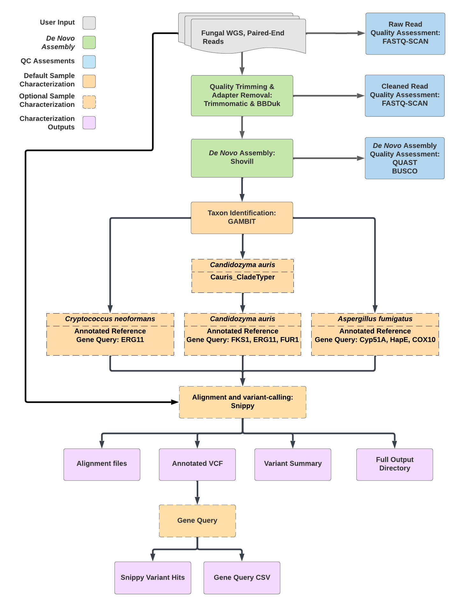

# TheiaEuk Workflow Series

## Quick Facts

| **Workflow Type** | **Applicable Kingdom** | **Last Known Changes** | **Command-line Compatibliity** | **Workflow Level** |
|---|---|---|---|---|
| [Genomic Characterization](../../workflows_overview/workflows_type.md/#genomic-characterization) | [Mycotics](../../workflows_overview/workflows_kingdom.md/#mycotics) | PHB v3.0.1 | Yes | Sample-level |

## TheiaEuk Workflows

**The TheiaEuk_Illumina_PE workflow is for the assembly, quality assessment, and characterization of fungal genomes.** It is designed to accept Illumina paired-end sequencing data as the primary input. **It is currently intended only for ==haploid== fungal genomes like _Candidozyma auris_.** Analyzing diploid genomes using TheiaEuk should be attempted only with expert attention to the resulting genome quality.

All input reads are processed through "core tasks" in each workflow. The core tasks include raw read quality assessment, read cleaning (quality trimming and adapter removal), de novo assembly, assembly quality assessment, and species taxon identification. For some taxa identified, taxa-specific sub-workflows will be automatically activated, undertaking additional taxa-specific characterization steps, including clade-typing and/or antifungal resistance detection.

!!! caption "TheiaEuk Workflow Diagram"
    {width=75%}

### Inputs

!!! info "Input read data"

    The TheiaEuk_Illumina_PE workflow takes in Illumina paired-end read data. Read file names should end with `.fastq` or `.fq`, with the optional addition of `.gz`. When possible, Theiagen recommends zipping files with [gzip](https://www.gnu.org/software/gzip/) prior to Terra upload to minimize data upload time.

    By default, the workflow anticipates 2 x 150bp reads (i.e. the input reads were generated using a 300-cycle sequencing kit). Modifications to the optional parameter for `trim_minlen` may be required to accommodate shorter read data, such as the 2 x 75bp reads generated using a 150-cycle sequencing kit.

/// html | div[class="searchable-table"]

{{ input_table("docs/assets/input_tables/all_inputs.tsv", input_table=True, filter_column="Workflow", filter_values="TheiaEuk_Illumina_PE", columns=["Terra Task Name", "Variable", "Type", "Description", "Default Value", "Terra Status"], sort_by=[("Terra Status", True), "Terra Task Name", "Variable"]) }}

///

### Workflow Tasks

All input reads are processed through "core tasks" in the TheiaEuk workflows. These undertake read trimming and assembly appropriate to the input data type, currently only Illumina paired-end data. TheiaEuk workflow subsequently launch default genome characterization modules for quality assessment, and additional taxa-specific characterization steps. When setting up the workflow, users may choose to use "optional tasks" or alternatives to tasks run in the workflow by default.

#### Core tasks

!!! tip ""
    These tasks are performed regardless of organism. They perform read trimming and various quality control steps.

??? task "`versioning`: Version capture for TheiaEuk"

    The `versioning` task captures the workflow version from the GitHub (code repository) version.
        
    !!! techdetails "Version Capture Technical details"
        
        |  | Links |
        | --- | --- |
        | Task | [task_versioning.wdl](https://github.com/theiagen/public_health_bioinformatics/blob/main/tasks/task_versioning.wdl) |

??? task "`screen`: Total Raw Read Quantification and Genome Size Estimation (optional, on by default)"

    The [`screen`](https://github.com/theiagen/public_health_bioinformatics/blob/main/tasks/quality_control/comparisons/task_screen.wdl) task ensures the quantity of sequence data is sufficient to undertake genomic analysis. It uses [`fastq-scan`](https://github.com/rpetit3/fastq-scan) and bash commands for quantification of reads and base pairs, and [mash](https://mash.readthedocs.io/en/latest/index.html) sketching to estimate the genome size and its coverage. At each step, the results are assessed relative to pass/fail criteria and thresholds that may be defined by optional user inputs. Samples are run through all threshold checks, regardless of failures, and the workflow will terminate after the `screen` task if any thresholds are not met:


    1. Total number of reads: A sample will fail the read screening task if its total number of reads is less than or equal to `min_reads`.
    2. The proportion of basepairs reads in the forward and reverse read files: A sample will fail the read screening if fewer than `min_proportion` basepairs are in either the reads1 or read2 files.
    3. Number of basepairs: A sample will fail the read screening if there are fewer than `min_basepairs` basepairs
    4. Estimated genome size:  A sample will fail the read screening if the estimated genome size is smaller than `min_genome_size` or bigger than `max_genome_size`.
    5. Estimated genome coverage: A sample will fail the read screening if the estimated genome coverage is less than the `min_coverage`.

    Read screening is undertaken on both the raw and cleaned reads. The task may be skipped by setting the `skip_screen` variable to true.

    Default values vary between the PE and SE workflow. The rationale for these default values can be found below.
    
    | Variable  | Rationale |
    | --- | --- |
    | `skip_screen` | Prevent the read screen from running. If you set this value to true, please provide a value for the theiaeuk_pe `genome_length` optional input, OR set the theiaeuk_pe `call_rasusa` optional input to false. Otherwise RASUSA will attempt to downsample to an expected genome size of 0 bp, and the workflow will fail. |
    | `min_reads` | Minimum number of base pairs for 20x coverage of _Hansenula polymorpha_  divided by 300 (longest Illumina read length) |
    | `min_basepairs` | Greater than 10x coverage of _Hansenula polymorpha_  |
    | `min_genome_size` | Based on the _Hansenula polymorpha_  genome - the smallest fungal genome as of 2015-04-02 (8.97 Mbp) |
    | `max_genome_size` | Based on the _Cenococcum geophilum_  genome, the biggest pathogenic fungal genome, (177.57 Mbp) |
    | `min_coverage` | A bare-minimum coverage for genome characterization. Higher coverage would be required for high-quality phylogenetics. |
    | `min_proportion` | Greater than 50% reads are in the read1 file; others are in the read2 file |

    !!! techdetails "Screen Technical Details"
        
        There is a single WDL task for read screening. The `screen` task is run twice, once for raw reads and once for clean reads.
        
        |  | Links |
        | --- | --- |
        | Task | [task_screen.wdl](https://github.com/theiagen/public_health_bioinformatics/blob/main/tasks/quality_control/comparisons/task_screen.wdl)  |

??? task "`Rasusa`: Read subsampling (optional, on by default)"

    The Rasusa task performs subsampling of the raw reads. By default, this task will subsample reads to a depth of 150X using the estimated genome length produced during the preceding raw read screen. The user can prevent the task from being launched by setting the `call_rasusa`variable to false. 

    The user can also provide an estimated genome length for the task to use for subsampling using the `genome_size` variable. In addition, the read depth can be modified using the `subsample_coverage` variable.
        
    !!! techdetails "Rasusa Technical Details"

        |  | Links |
        | --- | --- |
        | Task | [task_rasusa.wdl](https://github.com/theiagen/public_health_bioinformatics/blob/main/tasks/utilities/task_rasusa.wdl) |
        | Software Source Code | [Rasusa on GitHub](https://github.com/mbhall88/rasusa) |
        | Software Documentation | [Rasusa on GitHub](https://github.com/mbhall88/rasusa) |
        | Original Publication(s) | [Rasusa: Randomly subsample sequencing reads to a specified coverage](https://doi.org/10.21105/joss.03941) |

??? task "`read_QC_trim`: Read Quality Trimming, Adapter Removal, Quantification, and Identification"

    `read_QC_trim` is a sub-workflow within TheiaEuk that removes low-quality reads, low-quality regions of reads, and sequencing adapters to improve data quality. It uses a number of tasks, described below.

    **Read quality trimming**

    Either `trimmomatic` or `fastp` can be used for read-quality trimming. Trimmomatic is used by default. Both tools trim low-quality regions of reads with a sliding window (with a window size of `trim_window_size`), cutting once the average quality within the window falls below `trim_quality_trim_score`. They will both discard the read if it is trimmed below `trim_minlen`. 

    If fastp is selected for analysis, fastp also implements the additional read-trimming steps indicated below:

    | **Parameter** | **Explanation** |
    | --- | --- |
    | -g | enables polyG tail trimming |
    | -5 20 | enables read end-trimming |
    | -3 20 | enables read end-trimming |
    | --detect_adapter_for_pe | enables adapter-trimming **only for paired-end reads** |

    **Adapter removal**

    The `BBDuk` task removes adapters from sequence reads. To do this:

    - [Repair](https://jgi.doe.gov/data-and-tools/software-tools/bbtools/bb-tools-user-guide/repair-guide/) from the [BBTools](https://jgi.doe.gov/data-and-tools/software-tools/bbtools/) package reorders reads in paired fastq files to ensure the forward and reverse reads of a pair are in the same position in the two fastq files.
    - [BBDuk](https://jgi.doe.gov/data-and-tools/software-tools/bbtools/bb-tools-user-guide/bbduk-guide/)  (*"Bestus Bioinformaticus" Decontamination Using Kmers*) is then used to trim the adapters and filter out all reads that have a 31-mer match to [PhiX](https://emea.illumina.com/products/by-type/sequencing-kits/cluster-gen-sequencing-reagents/phix-control-v3.html), which is commonly added to Illumina sequencing runs to monitor and/or improve overall run quality.
    
    ??? toggle "What are adapters and why do they need to be removed?"
        Adapters are manufactured oligonucleotide sequences attached to DNA fragments during the library preparation process. In Illumina sequencing, these adapter sequences are required for attaching reads to flow cells. You can read more about Illumina adapters [here](https://emea.support.illumina.com/bulletins/2020/06/illumina-adapter-portfolio.html). For genome analysis, it's important to remove these sequences since they're not actually from your sample. If you don't remove them, the downstream analysis may be affected.
        
    **Read Quantification**

    There are two methods for read quantification to choose from: [`fastq-scan`](https://github.com/rpetit3/fastq-scan) (default) or [`fastqc`](https://www.bioinformatics.babraham.ac.uk/projects/fastqc/). Both quantify the forward and reverse reads in FASTQ files. In TheiaProk_Illumina_PE, they also provide the total number of read pairs. This task is run once with raw reads as input and once with clean reads as input. If QC has been performed correctly, you should expect **fewer** clean reads than raw reads. `fastqc` also provides a graphical visualization of the read quality.

    **Read Identification (optional)**

    The `MIDAS` task is for the identification of reads to detect contamination with non-target taxa. This task is optional and turned off by default. It can be used by setting the `call_midas` input variable to `true`.

    The MIDAS tool was originally designed for metagenomic sequencing data but has been co-opted for use with bacterial isolate WGS methods. It can be used to detect contamination present in raw sequencing data by estimating bacterial species abundance in bacterial isolate WGS data. If a secondary genus is detected above a relative frequency of 0.01 (1%), then the sample should fail QC and be investigated further for potential contamination.

    This task is similar to those used in commercial software, BioNumerics, for estimating secondary species abundance.

    ??? toggle "How are the MIDAS output columns determined?"
        
        Example MIDAS report in the ****`midas_report` column:
        
        | species_id | count_reads | coverage | relative_abundance |
        | --- | --- | --- | --- |
        | Salmonella_enterica_58156 | 3309 | 89.88006645 | 0.855888033 |
        | Salmonella_enterica_58266 | 501 | 11.60606061 | 0.110519371 |
        | Salmonella_enterica_53987 | 99 | 2.232896237 | 0.021262881 |
        | Citrobacter_youngae_61659 | 46 | 0.995216227 | 0.009477003 |
        | Escherichia_coli_58110 | 5 | 0.123668877 | 0.001177644 |
        
        MIDAS report column descriptions:
        
        - species_id: species identifier
        - count_reads: number of reads mapped to marker genes
        - coverage: estimated genome-coverage (i.e. read-depth) of species in metagenome
        - relative_abundance: estimated relative abundance of species in metagenome
        
        The value in the `midas_primary_genus` column is derived by ordering the rows in order of "relative_abundance" and identifying the genus of top species in the "species_id" column (Salmonella). The value in the `midas_secondary_genus` column is derived from the genus of the second-most prevalent genus in the "species_id" column (Citrobacter). The `midas_secondary_genus_abundance` column is the "relative_abundance" of the second-most prevalent genus (0.009477003). The `midas_secondary_genus_coverage` is the "coverage" of the second-most prevalent genus (0.995216227).
        
    !!! techdetails "read_QC_trim Technical Details"
                
        |  | Links |
        | --- | --- |
        | Sub-workflow | [wf_read_QC_trim_pe.wdl](https://github.com/theiagen/public_health_bioinformatics/blob/main/workflows/utilities/wf_read_QC_trim_pe.wdl) |
        | Tasks | [task_fastp.wdl](https://github.com/theiagen/public_health_bioinformatics/blob/main/tasks/quality_control/read_filtering/task_fastp.wdl)<br>[task_trimmomatic.wdl](https://github.com/theiagen/public_health_bioinformatics/blob/main/tasks/quality_control/read_filtering/task_trimmomatic.wdl)<br>[task_bbduk.wdl](https://github.com/theiagen/public_health_bioinformatics/blob/main/tasks/quality_control/read_filtering/task_bbduk.wdl)<br>[task_fastq_scan.wdl](https://github.com/theiagen/public_health_bioinformatics/blob/main/tasks/quality_control/basic_statistics/task_fastq_scan.wdl)<br>[task_midas.wdl](https://github.com/theiagen/public_health_bioinformatics/blob/main/tasks/taxon_id/contamination/task_midas.wdl)<br>[task_kraken2.wdl](https://github.com/theiagen/public_health_bioinformatics/blob/main/tasks/taxon_id/contamination/task_kraken2.wdl)|
        | Software Source Code | [fastp](https://github.com/OpenGene/fastp); [Trimmomatic](https://github.com/usadellab/Trimmomatic); [fastq-scan](https://github.com/rpetit3/fastq-scan); [MIDAS](https://github.com/snayfach/MIDAS); [Kraken2](https://github.com/DerrickWood/kraken2)|
        | Software Documentation | [fastp](https://github.com/OpenGene/fastp); [Trimmomatic](http://www.usadellab.org/cms/?page=trimmomatic); [BBDuk](https://jgi.doe.gov/data-and-tools/software-tools/bbtools/bb-tools-user-guide/bbduk-guide/); [fastq-scan](https://github.com/rpetit3/fastq-scan); [MIDAS](https://github.com/snayfach/MIDAS); [Kraken2](https://github.com/DerrickWood/kraken2/wiki) |
        | Original Publication(s) | [Trimmomatic: a flexible trimmer for Illumina sequence data](https://www.ncbi.nlm.nih.gov/pmc/articles/PMC4103590/)<br>[fastp: an ultra-fast all-in-one FASTQ preprocessor](https://academic.oup.com/bioinformatics/article/34/17/i884/5093234?login=false)<br>[An integrated metagenomics pipeline for strain profiling reveals novel patterns of bacterial transmission and biogeography](https://pubmed.ncbi.nlm.nih.gov/27803195/)<br>[Improved metagenomic analysis with Kraken 2](https://genomebiology.biomedcentral.com/articles/10.1186/s13059-019-1891-0) |

#### Assembly tasks

!!! tip ""
    These tasks assemble the reads into a _de novo_ assembly and assess the quality of the assembly.

??? task "`shovill`: _De novo_ Assembly"

    De Novo assembly will be undertaken only for samples that have sufficient read quantity and quality, as determined by the `screen` task assessment of clean reads. 

    In TheiaEuk, assembly is performed using the [Shovill](https://github.com/tseemann/shovill) pipeline. This undertakes the assembly with one of four assemblers ([SKESA](https://github.com/ncbi/SKESA) (default), [SPAdes](https://github.com/ablab/spades), [Velvet](https://github.com/dzerbino/velvet/), [Megahit](https://github.com/voutcn/megahit)), but also performs [a number of pre- and post-processing steps](https://github.com/tseemann/shovill#main-steps) to improve the resulting genome assembly. Shovill uses an estimated genome size (see [here](https://github.com/tseemann/shovill#--gsize)). If this is not provided by the user as an optional input, Shovill will estimate the genome size using [mash](https://mash.readthedocs.io/en/latest/index.html). Adaptor trimming can be undertaken with Shovill by setting the `trim` option to "true", but this is set to "false" by default as alternative adapter trimming performed by bbduk is undertaken in the TheiaEuk workflow.
    
    ??? toggle "What is _de novo_  assembly?"
        _De novo_  assembly is the process or product of attempting to reconstruct a genome from scratch (without prior knowledge of the genome) using sequence reads. Assembly of fungal genomes from short-reads will produce multiple contigs per chromosome rather than a single contiguous sequence for each chromosome.
        
    !!! techdetails "Shovill Technical Details"
        |  | Links |
        | --- | --- |
        | TheiaEuk WDL Task | [task_shovill.wdl](https://github.com/theiagen/public_health_bioinformatics/blob/main/tasks/assembly/task_shovill.wdl#L3) |
        | Software Source Code | [Shovill on GitHub](https://github.com/tseemann/shovill) |
        | Software Documentation | [Shovill on GitHub](https://github.com/tseemann/shovill) |

??? task "`QUAST`: Assembly Quality Assessment"

    [`QUAST`](https://github.com/ablab/quast) (**QU**ality **AS**sessment **T**ool) evaluates genome assemblies by computing several metrics that describe the assembly quality, including the total number of bases in the assembly, the length of the largest contig in the assembly, and the assembly percentage GC content.

    !!! techdetails "QUAST Technical Details"
        
        |  | Links |
        | --- | --- |
        | Task | [task_quast.wdl](https://github.com/theiagen/public_health_bioinformatics/blob/main/tasks/quality_control/basic_statistics/task_quast.wdl) |
        | Software Source Code | [QUAST on GitHub](https://github.com/ablab/quast) |
        | Software Documentation | https://quast.sourceforge.net/docs/manual.html |
        | Orginal publication | [QUAST: quality assessment tool for genome assemblies](https://www.ncbi.nlm.nih.gov/pmc/articles/PMC3624806/) |

??? task "`CG-Pipeline`: Assessment of Read Quality, and Estimation of Genome Coverage"

    The`cg_pipeline` task generates metrics about read quality and estimates the coverage of the genome using the "run_assembly_readMetrics.pl" script from [CG-Pipeline](https://github.com/lskatz/CG-Pipeline/). The genome coverage estimates are calculated using both using raw and cleaned reads, using either a user-provided `genome_size` or the estimated genome length generated by QUAST.

    !!! techdetails "CG-Pipeline Technical Details"
        The `cg_pipeline` task is run twice in TheiaEuk, once with raw reads, and once with clean reads.
        
        |  | Links |
        | --- | --- |
        | Task | [task_cg_pipeline.wdl](https://github.com/theiagen/public_health_bioinformatics/blob/main/tasks/quality_control/basic_statistics/task_cg_pipeline.wdl) |
        | Software Source Code | [CG-Pipeline on GitHub](https://github.com/lskatz/CG-Pipeline/) |
        | Software Documentation | [CG-Pipeline on GitHub](https://github.com/lskatz/CG-Pipeline/) |
        | Original Publication(s) | [A computational genomics pipeline for prokaryotic sequencing projects](https://academic.oup.com/bioinformatics/article/26/15/1819/188418) |

#### Organism-agnostic characterization

!!! tip ""
    These tasks are performed regardless of the organism and provide quality control and taxonomic assignment.

??? task "`GAMBIT`: **Taxon Assignment**"

    [`GAMBIT`](https://github.com/jlumpe/gambit) determines the taxon of the genome assembly using a k-mer based approach to match the assembly sequence to the closest complete genome in a database, thereby predicting its identity. Sometimes, GAMBIT can confidently designate the organism to the species level. Other times, it is more conservative and assigns it to a higher taxonomic rank.

    For additional details regarding the GAMBIT tool and a list of available GAMBIT databases for analysis, please consult the [GAMBIT](../../guides/gambit.md) tool documentation.

    !!! techdetails "GAMBIT Technical Details"

        |  | Links |
        | --- | --- |
        | Task | [task_gambit.wdl](https://github.com/theiagen/public_health_bioinformatics/blob/main/tasks/taxon_id/task_gambit.wdl) |
        | Software Source Code | [GAMBIT on GitHub](https://github.com/jlumpe/gambit) |
        | Software Documentation | [GAMBIT ReadTheDocs](https://gambit-genomics.readthedocs.io/en/latest/) |
        | Original Publication(s) | [GAMBIT (Genomic Approximation Method for Bacterial Identification and Tracking): A methodology to rapidly leverage whole genome sequencing of bacterial isolates for clinical identification](https://journals.plos.org/plosone/article?id=10.1371/journal.pone.0277575) |

??? task "`BUSCO`: Assembly Quality Assessment"

    BUSCO (**B**enchmarking **U**niversal **S**ingle-**C**opy **O**rthologue) attempts to quantify the completeness and contamination of an assembly to generate quality assessment metrics. It uses taxa-specific databases containing genes that are all expected to occur in the given taxa, each in a single copy. BUSCO examines the presence or absence of these genes, whether they are fragmented, and whether they are duplicated (suggestive that additional copies came from contaminants).

    **BUSCO notation** 
    
    Here is an example of BUSCO notation: `C:99.1%[S:98.9%,D:0.2%],F:0.0%,M:0.9%,n:440`. There are several abbreviations used in this output:
    
    - Complete (C) - genes are considered "complete" when their lengths are within two standard deviations of the BUSCO group mean length.
    - Single-copy (S) - genes that are complete and have only one copy.
    - Duplicated (D) - genes that are complete and have more than one copy.
    - Fragmented (F) - genes that are only partially recovered.
    - Missing (M) - genes that were not recovered at all.
    - Number of genes examined (n) - the number of genes examined.
    
    A high equity assembly will use the appropriate database for the taxa, have high complete (C) and single-copy (S) percentages, and low duplicated (D), fragmented (F) and missing (M) percentages. 
  
    !!! techdetails "BUSCO Technical Details"
        
        |  | Links |
        | --- | --- |
        | Task | [task_busco.wdl](https://github.com/theiagen/public_health_bioinformatics/blob/main/tasks/quality_control/advanced_metrics/task_busco.wdl) |
        | Software Source Code | [BUSCO on GitLab](https://gitlab.com/ezlab/busco) |
        | Software Documentation | https://busco.ezlab.org/ |
        | Orginal publication | [BUSCO: assessing genome assembly and annotation completeness with single-copy orthologs](https://academic.oup.com/bioinformatics/article/31/19/3210/211866) |

??? task "`qc_check`: Check QC Metrics Against User-Defined Thresholds (optional)"

    The `qc_check` task compares generated QC metrics against user-defined thresholds for each metric. This task will run if the user provides a `qc_check_table` .tsv file. If all QC metrics meet the threshold, the `qc_check` output variable will read `QC_PASS`. Otherwise, the output will read `QC_NA` if the task could not proceed or `QC_ALERT` followed by a string indicating what metric failed.

    The `qc_check` task applies quality thresholds according to the sample taxa. The sample taxa is taken from the `gambit_predicted_taxon` value inferred by the GAMBIT module OR can be manually provided by the user using the `expected_taxon` workflow input.

    ??? toggle "Formatting the _qc_check_table.tsv_"

        - The first column of the qc_check_table lists the taxa that the task will assess and the header of this column must be "taxon".
        - Any genus or species can be included as a row of the qc_check_table. However, these taxa must **uniquely** match the sample taxa, meaning that the file can include multiple species from the same genus (Vibrio_cholerae and Vibrio_vulnificus), but not both a genus row and species within that genus (Vibrio and Vibrio cholerae). **The taxa should be formatted with the first letter capitalized and underscores in lieu of spaces.**
        - Each subsequent column indicates a QC metric and lists a threshold for each taxa that will be checked. **The column names must exactly match expected values, so we highly recommend copy and pasting from the template files below.**

    ??? toggle "Template _qc_check_table.tsv_ files"

        TheiaEuk_Illumina_PE_PHB: [theiaeuk_qc_check_template.tsv](../../assets/files/TheiaEuk_qc_check_template.tsv)

        !!! warning "Example Purposes Only"
            QC threshold values shown are for example purposes only and should not be presumed to be sufficient for every dataset.
    
    !!! techdetails "QC_Check Technical Details"    
        
        |  | Links |
        | --- | --- |
        | Task | [task_qc_check_phb.wdl](https://github.com/theiagen/public_health_bioinformatics/blob/main/tasks/quality_control/comparisons/task_qc_check_phb.wdl) |

#### Organism-specific characterization

!!! tip ""
    The TheiaEuk workflow automatically activates taxa-specific tasks after identification of the relevant taxa using `GAMBIT`. Many of these taxa-specific tasks do not require any additional inputs from the user.

??? toggle "_Candidozyma auris_ (also known as _Candida auris_)"
    Two tools are deployed when _Candidozyma auris_/_Candida auris_ is  identified.

    ??? task "Cladetyping: clade determination"
        GAMBIT is used to determine the clade of the specimen by comparing the sequence to five clade-specific reference files. The output of the clade typing task will be used to specify the reference genome for the antifungal resistance detection tool.

        ??? toggle "Default reference genomes used for clade typing and antimicrobial resistance gene detection of _C. auris_"
            | Clade | Genome Accession | Assembly Name | Strain | NCBI Submitter | Included mutations in AMR genes (not comprehensive) |
            | --- | --- | --- | --- | --- | --- |
            | _Candidozyma auris_ Clade I | GCA_002759435.2 | Cand_auris_B8441_V2 | B8441 | Centers for Disease Control and Prevention |  |
            | _Candidozyma auris_ Clade II | GCA_003013715.2 | ASM301371v2 | B11220 | Centers for Disease Control and Prevention |  |
            | _Candidozyma auris_ Clade III | GCA_002775015.1 | Cand_auris_B11221_V1 | B11221 | Centers for Disease Control and Prevention | _ERG11_ V125A/F126L |
            | _Candidozyma auris_ Clade IV | GCA_003014415.1 | Cand_auris_B11243 | B11243 | Centers for Disease Control and Prevention | _ERG11_ Y132F |
            | _Candidozyma auris_ Clade V | GCA_016809505.1 | ASM1680950v1 | IFRC2087 | Centers for Disease Control and Prevention |  |

        !!! techdetails "Cladetyping Technical Details"
            |  | Links |
            | --- | --- |
            | Task | [task_cauris_cladetyping.wdl](https://github.com/theiagen/public_health_bioinformatics/blob/main/tasks/species_typing/candida/task_cauris_cladetyper.wdl) |
            | Software Source Code | [GAMBIT on GitHub](https://github.com/jlumpe/gambit) |
            | Software Documentation | [GAMBIT Overview](https://theiagen.notion.site/GAMBIT-7c1376b861d0486abfbc316480046bdc?pvs=4)
            | Original Publication(s) | [GAMBIT (Genomic Approximation Method for Bacterial Identification and Tracking): A methodology to rapidly leverage whole genome sequencing of bacterial isolates for clinical identification](https://doi.org/10.1371/journal.pone.0277575)<br> [TheiaEuk: a species-agnostic bioinformatics workflow for fungal genomic characterization](https://doi.org/10.3389/fpubh.2023.1198213) |

    ??? task "Snippy Variants: antifungal resistance detection"
        To detect mutations that may confer antifungal resistance, `Snippy` is used to find all variants relative to the clade-specific reference, then these variants are queried for product names associated with resistance.
    
        The genes in which there are known resistance-conferring mutations for this pathogen are:

        - FKS1
        - ERG11 (lanosterol 14-alpha demethylase)
        - FUR1 (uracil phosphoribosyltransferase)

        We query `Snippy` results to see if any mutations were identified in those genes. By default, we automatically check for the following loci (which can be overwritten by the user). You will find the mutations next to the locus tag in the `theiaeuk_snippy_variants_hits` column corresponding gene name (see below):

        | **TheiaEuk Search Term** | **Corresponding Gene Name** |
        |---|---|
        | B9J08_005340 | ERG6 |
        | B9J08_000401 | FLO8 |
        | B9J08_005343 | Hypothetical protein (PSK74852) |
        | B9J08_003102 | MEC3 |
        | B9J08_003737 | ERG3 |
        | lanosterol.14-alpha.demethylase | ERG11 |
        | uracil.phosphoribosyltransferase | FUR1 |
        | FKS1 | FKS1 |    

        For example, one sample may have the following output for the `theiaeuk_snippy_variants_hits` column:

        ```plaintext
        lanosterol.14-alpha.demethylase: lanosterol 14-alpha demethylase (missense_variant c.428A>G p.Lys143Arg; C:266 T:0),B9J08_000401: hypothetical protein (stop_gained c.424C>T p.Gln142*; A:70 G:0)
        ```

        Based on this, we can tell that ERG11 has a missense variant at position 143 (Lysine to Arginine) and B9J08_000401 (which is FLO8) has a stop-gained variant at position 142 (Glutamine to Stop).

        ??? toggle "Known resistance-conferring mutations for _Candidozyma auris_"
            Mutations in these genes that are known to confer resistance are shown below

            | **Organism** | **Found in** | **Gene name** | **Gene locus** | **AA mutation** | **Drug** | **Reference** |
            | --- | --- | --- | --- | --- | --- | --- |
            | **Candidozyma auris** | **Human** | **ERG11** |  | **Y132F** | **Fluconazole** | [Simultaneous Emergence of Multidrug-Resistant _Candida auris_ on 3 Continents Confirmed by Whole-Genome Sequencing and Epidemiological Analyses](https://academic.oup.com/cid/article/64/2/134/2706620/Simultaneous-Emergence-of-Multidrug-Resistant) |
            | **Candidozyma auris** | **Human** | **ERG11** |  | **K143R** | **Fluconazole** | [Simultaneous Emergence of Multidrug-Resistant _Candida auris_ on 3 Continents Confirmed by Whole-Genome Sequencing and Epidemiological Analyses](https://academic.oup.com/cid/article/64/2/134/2706620/Simultaneous-Emergence-of-Multidrug-Resistant) |
            | **Candidozyma auris** | **Human** | **ERG11** |  | **F126T** | **Fluconazole** | [Simultaneous Emergence of Multidrug-Resistant _Candida auris_ on 3 Continents Confirmed by Whole-Genome Sequencing and Epidemiological Analyses](https://academic.oup.com/cid/article/64/2/134/2706620/Simultaneous-Emergence-of-Multidrug-Resistant) |
            | **Candidozyma auris** | **Human** | **FKS1** |  | **S639P** | **Micafungin**  | [Activity of CD101, a long-acting echinocandin, against clinical isolates of Candida auris](https://www.sciencedirect.com/science/article/pii/S0732889317303498) |
            | **Candidozyma auris** | **Human** | **FKS1** |  | **S639P** | **Caspofungin** | [Activity of CD101, a long-acting echinocandin, against clinical isolates of Candida auris](https://www.sciencedirect.com/science/article/pii/S0732889317303498) |
            | **Candidozyma auris** | **Human** | **FKS1** |  | **S639P** | **Anidulafungin** | [Activity of CD101, a long-acting echinocandin, against clinical isolates of Candida auris](https://www.sciencedirect.com/science/article/pii/S0732889317303498) |
            | **Candidozyma auris** | **Human** | **FKS1** |  | **S639F** | **Micafungin** | [A multicentre study of antifungal susceptibility patterns among 350 _Candida auris_ isolates (2009–17) in India: role of the ERG11 and FKS1 genes in azole and echinocandin resistance](https://academic.oup.com/jac/advance-article/doi/10.1093/jac/dkx480/4794718) |
            | **Candidozyma auris** | **Human** | **FKS1** |  | **S639F** | **Caspofungin** | [A multicentre study of antifungal susceptibility patterns among 350 _Candida auris_ isolates (2009–17) in India: role of the ERG11 and FKS1 genes in azole and echinocandin resistance](https://academic.oup.com/jac/advance-article/doi/10.1093/jac/dkx480/4794718) |
            | **Candidozyma auris** | **Human** | **FKS1** |  | **S639F** | **Anidulafungin** | [A multicentre study of antifungal susceptibility patterns among 350 _Candida auris_ isolates (2009–17) in India: role of the ERG11 and FKS1 genes in azole and echinocandin resistance](https://academic.oup.com/jac/advance-article/doi/10.1093/jac/dkx480/4794718) |
            | **Candidozyma auris** | **Human** | **FUR1** | **CAMJ_004922** | **F211I** | **5-flucytosine** | [Genomic epidemiology of the UK outbreak of the emerging human fungal pathogen Candida auris](https://doi.org/10.1038/s41426-018-0045-x) |

        !!! techdetails "Snippy Variants Technical Details"
            |  | Links |
            | --- | --- |
            | Task | [task_snippy_variants.wdl](https://github.com/theiagen/public_health_bioinformatics/blob/main/tasks/gene_typing/variant_detection/task_snippy_variants.wdl)<br>[task_snippy_gene_query.wdl](https://github.com/theiagen/public_health_bioinformatics/blob/main/tasks/gene_typing/variant_detection/task_snippy_gene_query.wdl) |
            | Software Source Code | [Snippy on GitHub](https://github.com/tseemann/snippy) |
            | Software Documentation | [Snippy on GitHub](https://github.com/tseemann/snippy) |
            
??? toggle "_Candida albicans_"
    When this species is detected by the taxon ID tool, an antifungal resistance detection task is deployed.

    ??? task "Snippy Variants: antifungal resistance detection"
        To detect mutations that may confer antifungal resistance, `Snippy` is used to find all variants relative to the clade-specific reference, and these variants are queried for product names associated with resistance.

        The genes in which there are known resistance-conferring mutations for this pathogen are:

        - ERG11
        - GCS1 (FKS1)
        - FUR1
        - RTA2

        We query `Snippy` results to see if any mutations were identified in those genes. By default, we automatically check for the following loci (which can be overwritten by the user). You will find the mutations next to the locus tag in the `theiaeuk_snippy_variants_hits` column corresponding gene name (see below):

        | **TheiaEuk Search Term** | **Corresponding Gene Name** |
        |---|---|
        | ERG11 | ERG11 |
        | GCS1 | FKS1 |
        | FUR1 | FUR1 |
        | RTA2 | RTA2 |

        !!! techdetails "Snippy Variants Technical Details"
            |  | Links |
            | --- | --- |
            | Task | [task_snippy_variants.wdl](https://github.com/theiagen/public_health_bioinformatics/blob/main/tasks/gene_typing/variant_detection/task_snippy_variants.wdl)<br>[task_snippy_gene_query.wdl](https://github.com/theiagen/public_health_bioinformatics/blob/main/tasks/gene_typing/variant_detection/task_snippy_gene_query.wdl) |
            | Software Source Code | [Snippy on GitHub](https://github.com/tseemann/snippy) |
            | Software Documentation | [Snippy on GitHub](https://github.com/tseemann/snippy) |

??? toggle "_Aspergillus fumigatus_"
    When this species is detected by the taxon ID tool an antifungal resistance detection task is deployed.

    ??? task "Snippy Variants: antifungal resistance detection"
        To detect mutations that may confer antifungal resistance, `Snippy` is used to find all variants relative to the clade-specific reference, and these variants are queried for product names associated with resistance.

        The genes in which there are known resistance-conferring mutations for this pathogen are:

        - Cyp51A
        - HapE
        - COX10 (AFUA_4G08340)
 
        We query `Snippy` results to see if any mutations were identified in those genes. By default, we automatically check for the following loci (which can be overwritten by the user). You will find the mutations next to the locus tag in the `theiaeuk_snippy_variants_hits` column corresponding gene name (see below):

        | **TheiaEuk Search Term** | **Corresponding Gene Name** |
        |---|---|
        | Cyp51A | Cyp51A |
        | HapE | HapE |
        | AFUA_4G08340 | COX10 |

        !!! techdetails "Snippy Variants Technical Details"
            |  | Links |
            | --- | --- |
            | Task | [task_snippy_variants.wdl](https://github.com/theiagen/public_health_bioinformatics/blob/main/tasks/gene_typing/variant_detection/task_snippy_variants.wdl)<br>[task_snippy_gene_query.wdl](https://github.com/theiagen/public_health_bioinformatics/blob/main/tasks/gene_typing/variant_detection/task_snippy_gene_query.wdl) |
            | Software Source Code | [Snippy on GitHub](https://github.com/tseemann/snippy) |
            | Software Documentation | [Snippy on GitHub](https://github.com/tseemann/snippy) |

??? toggle "_Cryptococcus neoformans_"
    When this species is detected by the taxon ID tool an antifungal resistance detection task is deployed.

    ??? task "Snippy Variants: antifungal resistance detection"
        To detect mutations that may confer antifungal resistance, `Snippy` is used to find all variants relative to the clade-specific reference, and these variants are queried for product names associated with resistance.

        The genes in which there are known resistance-conferring mutations for this pathogen are:

        - ERG11 (CNA00300)
        
        We query `Snippy` results to see if any mutations were identified in those genes. By default, we automatically check for the following loci (which can be overwritten by the user). You will find the mutations next to the locus tag in the `theiaeuk_snippy_variants_hits` column corresponding gene name (see below):

        | **TheiaEuk Search Term** | **Corresponding Gene Name** |
        |---|---|
        | CNA00300 | ERG11 |
    
        !!! techdetails "Snippy Variants Technical Details"
            |  | Links |
            | --- | --- |
            | Task | [task_snippy_variants.wdl](https://github.com/theiagen/public_health_bioinformatics/blob/main/tasks/gene_typing/variant_detection/task_snippy_variants.wdl)<br>[task_snippy_gene_query.wdl](https://github.com/theiagen/public_health_bioinformatics/blob/main/tasks/gene_typing/variant_detection/task_snippy_gene_query.wdl) |
            | Software Source Code | [Snippy on GitHub](https://github.com/tseemann/snippy) |
            | Software Documentation | [Snippy on GitHub](https://github.com/tseemann/snippy) |

### Outputs

/// html | div[class="searchable-table"]

{{ input_table("docs/assets/tables/all_outputs.tsv", input_table=False, filter_column="Workflow", filter_values="TheiaEuk_Illumina_PE", columns=["Variable", "Type", "Description"], sort_by=["Variable"]) }}

///
