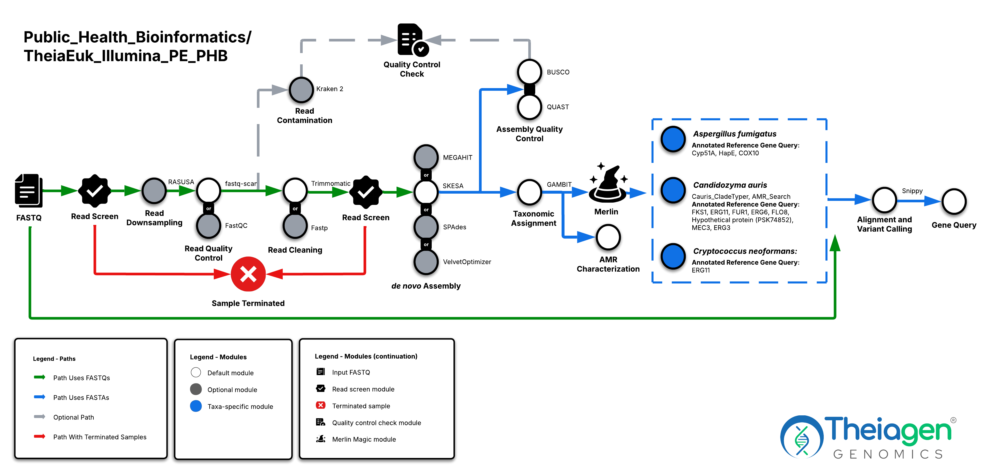
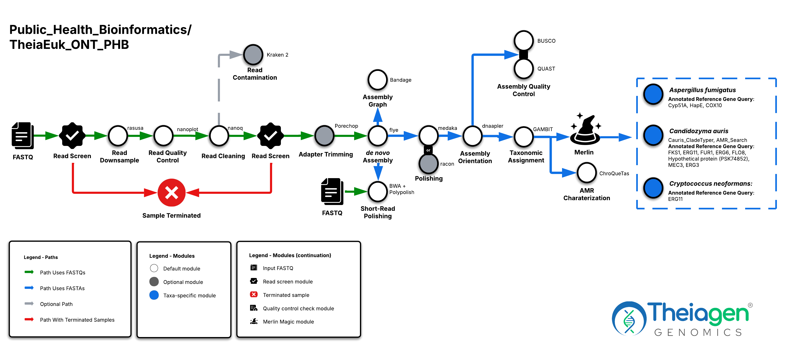

# TheiaEuk™ Workflow Series

## Quick Facts

{{ render_tsv_table("docs/assets/tables/all_workflows.tsv", sort_by="Name", filters={"Name": "[**TheiaEuk Workflow Series**](../workflows/genomic_characterization/theiaeuk.md)"}, columns=["Workflow Type", "Applicable Kingdom", "Last Known Changes", "Command-line Compatibility","Workflow Level", "Dockstore"]) }}

## TheiaEuk Workflows

**The TheiaEuk workflows are for the assembly, quality assessment, and characterization of fungal genomes.** It is designed to accept Illumina paired-end sequencing data or base-called ONT reads as the primary input. **It is currently intended only for ==haploid== fungal genomes like _Candidozyma auris_.** Analyzing diploid genomes using TheiaEuk should be attempted only with expert attention to the resulting genome quality.

All input reads are processed through "core tasks" in each workflow. The core tasks include raw read quality assessment, read cleaning (quality trimming and adapter removal), de novo assembly, assembly quality assessment, species taxon identification, and antimicrobial resistance (AMR) _in silico_ prediction. For some taxa identified, taxa-specific sub-workflows will be automatically activated, undertaking additional taxa-specific characterization steps, including clade-typing and/or antifungal resistance detection.

=== "TheiaEuk_Illumina_PE"

    !!! caption "TheiaEuk Illumina PE Workflow Overview"
        

=== "TheiaEuk_ONT"

    !!! caption "TheiaEuk ONT Workflow Overview"
        

!!! warning "Before running TheiaEuk"

    For some taxa, TheiaEuk performs reference-based variant calling on the cleaned read dataset and then summarizes coverage and variants across genes associated with antifungal resistance (see the [Organism-specific characterization](#organism-specific-characterization) section). TheiaEuk_Illumina_PE aligns reads with `BWA` and calls/filters variants with `GATK` (`gatk_variants` + `gatk_filter`), while TheiaEuk_ONT aligns with `minimap2` and calls variants with `Clair3`. Variant calling requires reads; assembly-only submissions are not variant-called.

### Inputs

!!! dna "Input Read Data"
    === "TheiaEuk_Illumina_PE"

        The TheiaEuk_Illumina_PE workflow takes in Illumina paired-end read data. Read file names should end with `.fastq` or `.fq`, with the optional addition of `.gz`. When possible, Theiagen recommends zipping files with [gzip](https://www.gnu.org/software/gzip/) before Terra uploads to minimize data upload time.

        By default, the workflow anticipates **2 x 150bp** reads (i.e. the input reads were generated using a 300-cycle sequencing kit). Modifications to the optional parameter for `trim_minlen` may be required to accommodate shorter read data, such as the 2 x 75bp reads generated using a 150-cycle sequencing kit.

    === "TheiaEuk_ONT"

        The TheiaEuk_ONT workflow takes in base-called ONT read data. Read file names should end with `.fastq` or `.fq`, with the optional addition of `.gz`. When possible, Theiagen recommends zipping files with [gzip](https://www.gnu.org/software/gzip/) before uploading to Terra to minimize data upload time.

        **The ONT sequencing kit and base-calling approach can produce substantial variability in the amount and quality of read data. Genome assemblies produced by the TheiaEuk_ONT workflow must be quality assessed before reporting results.**

!!! caption ""
    === "TheiaEuk_Illumina_PE"
        /// html | div[class="searchable-table"]

        {{ render_tsv_table("docs/assets/tables/all_inputs.tsv", input_table=True, filters={"Workflow": "TheiaEuk_Illumina_PE"}, columns=["Terra Task Name", "Variable", "Type", "Description", "Default Value", "Terra Status"], sort_by=[("Terra Status", True), "Terra Task Name", "Variable"], indent=8) }}
        ///

    === "TheiaEuk_ONT"
        /// html | div[class="searchable-table"]

        {{ render_tsv_table("docs/assets/tables/all_inputs.tsv", input_table=True, filters={"Workflow": "TheiaEuk_ONT"}, columns=["Terra Task Name", "Variable", "Type", "Description", "Default Value", "Terra Status"], sort_by=[("Terra Status", True), "Terra Task Name", "Variable"], indent=8) }}
        ///

### Workflow Tasks

All input reads are processed through "core tasks" in the TheiaEuk workflows. These undertake read trimming and assembly appropriate to the input data type. TheiaEuk workflow subsequently launch default genome characterization modules for quality assessment, and additional taxa-specific characterization steps. When setting up the workflow, users may choose to use "optional tasks" or alternatives to tasks run in the workflow by default.

#### Core tasks

!!! dna ""
    These tasks are performed regardless of organism. They include tasks that are performed regardless of and specific for the input data type. They perform read trimming and assembly appropriate to the input data type.

{{ include_md("common_text/versioning_task.md") }}

!!! caption ""
    === "TheiaEuk_Illumina_PE"
{{ include_md("common_text/read_screen_task.md", condition="theiaeuk", indent=8) }}
{{ include_md("common_text/read_qc_trim_illumina_wf.md", condition="theiaeuk", indent=8) }}
{{ include_md("common_text/qc_check_task.md", condition="theiaeuk", indent=8) }}

        !!! dna ""
            These tasks assemble the reads into a _de novo_ assembly and assess the quality of the assembly.

{{ include_md("common_text/digger_denovo_wf.md", indent=8) }}
{{ include_md("common_text/quast_task.md", indent=8) }}
{{ include_md("common_text/cg_pipeline_task.md", indent=8) }}

    === "TheiaEuk_ONT"
{{ include_md("common_text/read_screen_task.md", condition="theiaeukont", indent=8) }}
{{ include_md("common_text/read_qc_trim_ont_wf.md", condition="theiaprok", indent=8) }}

        !!! dna ""
            These tasks assemble the reads into a _de novo_ assembly and assess the quality of the assembly.
{{ include_md("common_text/flye_denovo_wf.md", condition="theiaeuk", indent=8) }}
{{ include_md("common_text/quast_task.md", indent=8) }}

#### Organism-agnostic characterization

!!! tip ""
    These tasks are performed regardless of the organism and provide quality control and taxonomic assignment.

{{ include_md("common_text/busco_task.md") }}
{{ include_md("common_text/gambit_task.md") }}

#### Organism-specific characterization

!!! tip ""
    The TheiaEuk workflow automatically activates taxa-specific tasks after identification of the relevant taxa using `GAMBIT`. Default taxa (_Candidozyma auris_, _Cryptococcus neoformans_, or _Aspergillus fumigatus_) do not require user input to run characterization modules, and other taxa can undergo reference-based variant calling and gene characterization by inputting a `reference_genome_fasta` and `reference_gff`.

??? toggle "Reference-based variant calling"
    After taxonomic identification, TheiaEuk performs reference-based variant calling whenever a `reference_genome_fasta` is provided or a default organism is selected (user input takes precedence). The resulting variants are summarized with respect to target if a `reference_gff` and `query_genes`/`query_genes_bed` are populated. 

    Two data-type-specific tracks are supported:

    - **Illumina (paired-end):** reads are aligned to the reference with `BWA`, variants are called with `gatk_variants`, and the genotyped GVCF is filtered with `gatk_filter`.
    - **ONT:** reads are aligned with `minimap2` and variants are called and filtered with `Clair3`.

    ??? dna "`reference_genome_fasta` input parameter"
        The reference FASTA used for read alignment and variant calling. A user-supplied `reference_genome_fasta` always takes precedence over the defaults below. When it is not provided, an organism-specific default reference is selected automatically:

        - _Candidozyma auris_ / _Candida auris_: the clade-specific reference selected by `cladetyper`.
        - _Aspergillus fumigatus_: a hosted reference (`GCF_000002655.1`, ASM265v1).
        - _Cryptococcus neoformans_: a hosted reference (`GCF_000091045.1`, ASM9104v1).

        For any other identified organism (e.g. _Candida albicans_), variant calling only runs if `reference_genome_fasta` is supplied by the user.

    ??? dna "`reference_gff` input parameter"
        The annotated reference (General Features Format, GFF) used by the `gene_coverage` and `variant_annotate` tasks to extract query genes list into genomic coordinates. A user-supplied `reference_gff` always takes precedence over the defaults below. When it is not provided, an organism-specific default is selected automatically:

        - _Candidozyma auris_ / _Candida auris_: the `cladetyper` clade annotation, used only when the assembly matches a clade that has an available annotation (e.g. Clade VI currently has no annotation).
        - _Aspergillus fumigatus_: a hosted reference (`GCF_000002655.1`, ASM265v1).
        - _Cryptococcus neoformans_: a hosted reference (`GCF_000091045.1`, ASM9104v1).

        !!! warning "Keep the FASTA and GFF matched"
            The GFF must reference the same assembly as the reference FASTA. If a custom `reference_genome_fasta` is provided, the accompanying annotation `reference_gff` must be as well (and vice versa); otherwise errors will be experienced, or the gene coordinates may silently not correspond to the aligned reference.

            If a `reference_genome_fasta` is supplied but not a `reference_gff`, or vice versa, then gene coverage calculations and gene-centric variant reporting will not run even if a default organism is identified because it is assumed that the default file is discrepant with user input. Therefore, to run `gene_coverage` and `variant_annotate`, both files need to be explicitly provided by the user, or explicitly omitted to use defaults.

    ??? dna "`query_genes` and `query_genes_bed` input parameter"
        `query_genes` is a comma-delimited list of query genes to extract from the `reference_gff` supplied by default/the user. These `query_genes` _must_ correspond to the associated "product" field of CDS entries within the `reference_gff`. By default, "FKS1" will match "1,3-beta-D-glucan synthase_complex_FKS1", though exact product matching can be enforced by setting `query_exact_match` to "true".

        The following query genes are used by default:

         - _Aspergillus fumigatus_: `Cyp51A`, `HapE`, `AFUA_4G08340` (COX10 in the default reference)
         - _Candidozyma auris_: `FKS1`, `lanosterol.14-alpha.demethylase`, `uracil.phosphoribosyltransferase`, `B9J08_005340`, `B9J08_000401`, `B9J08_003102`, `B9J08_003737`, `B9J08_005343`
         - _Cryptococcus neoformans_: `CNA00300` (ERG11 in the default reference)

        !!! warning "`query_exact_match` input parameter"
            `query_exact_match` is set to "false" by default, which enables gene shorthand names to be used when they correspond to entries within the `reference_gff`. However, this can lead to substring matching, where "ERG11" can match entries with the name "ERG112". To prevent this, completely enter the exact product name of desired genes by referencing the GFF.

    === "TheiaEuk_Illumina_PE"
{{ include_md("common_text/bwa_task.md", indent=8, condition="theiaeuk") }}
{{ include_md("common_text/gatk_variants_task.md", indent=8) }}
{{ include_md("common_text/gatk_filter_task.md", indent=8) }}

    === "TheiaEuk_ONT"
{{ include_md("common_text/minimap2_task.md", indent=8, condition="long_read_flags") }}
{{ include_md("common_text/clair3_task.md", indent=8) }}

{{ include_md("common_text/gene_coverage_task.md", indent=4, condition="theiaeuk") }}
{{ include_md("common_text/variant_annotate_task.md", indent=4) }}

??? toggle "_Candidozyma auris_ (also known as _Candida auris_)"
    When _Candidozyma auris_/_Candida auris_ is identified clade typing determines the clade the genome belongs to (which also selects the reference and annotation), reference-based variant calling is performed against the clade-specific reference, and AMR detection is conducted.

{{ include_md("common_text/cauris_cladetyper.md", indent=4) }}
{{ include_md("common_text/amr_search_task.md", indent=4, condition="theiaeuk") }}

??? toggle "_Aspergillus fumigatus_"
    When this species is detected by the taxon ID tool, reference-based variant calling is performed against the hosted _A. fumigatus_ reference (see the **Reference-based variant calling** section above).

??? toggle "_Cryptococcus neoformans_"
    When this species is detected by the taxon ID tool, reference-based variant calling is performed against the hosted _C. neoformans_ reference (see the **Reference-based variant calling** section above).

### Outputs

!!! caption ""
    === "TheiaEuk_Illumina_PE"
        /// html | div[class="searchable-table"]

        {{ render_tsv_table("docs/assets/tables/all_outputs.tsv", input_table=False, filters={"Workflow": "TheiaEuk_Illumina_PE"}, columns=["Terra Task Name", "Variable", "Type", "Description", "Default Value", "Terra Status"], sort_by=[("Terra Status", True), "Terra Task Name", "Variable"], indent=8) }}
        ///

    === "TheiaEuk_ONT"
        /// html | div[class="searchable-table"]

        {{ render_tsv_table("docs/assets/tables/all_outputs.tsv", input_table=False,  filters={"Workflow": "TheiaEuk_ONT"}, columns=["Terra Task Name", "Variable", "Type", "Description", "Default Value", "Terra Status"], sort_by=[("Terra Status", True), "Terra Task Name", "Variable"], indent=8) }}
        ///
