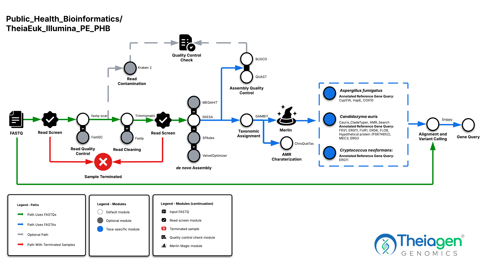

# TheiaEuk Workflow Series

## Quick Facts

{{ render_tsv_table("docs/assets/tables/all_workflows.tsv", sort_by="Name", filters={"Name": "[**TheiaEuk Workflow Series**](../workflows/genomic_characterization/theiaeuk.md)"}, columns=["Workflow Type", "Applicable Kingdom", "Last Known Changes", "Command-line Compatibility","Workflow Level", "Dockstore"]) }}

## TheiaEuk Workflows

**The TheiaEuk workflows are for the assembly, quality assessment, and characterization of fungal genomes.** It is designed to accept Illumina paired-end sequencing data or base-called ONT reads as the primary input. **It is currently intended only for ==haploid== fungal genomes like _Candidozyma auris_.** Analyzing diploid genomes using TheiaEuk should be attempted only with expert attention to the resulting genome quality.

All input reads are processed through "core tasks" in each workflow. The core tasks include raw read quality assessment, read cleaning (quality trimming and adapter removal), de novo assembly, assembly quality assessment, species taxon identification, and antimicrobial resistance (AMR) _in silico_ prediction. For some taxa identified, taxa-specific sub-workflows will be automatically activated, undertaking additional taxa-specific characterization steps, including clade-typing and/or antifungal resistance detection.

=== "TheiaEuk_Illumina_PE"

    !!! caption "TheiaEuk Illumina PE Workflow Diagram"
        

=== "TheiaEuk_ONT"

    !!! caption "TheiaEuk ONT Workflow Diagram"
        

!!! warning "Before running TheiaEuk"

    TheiaEuk_Illumina_PE relies on [Snippy](#organism-specific-characterization) to perform variant calling on the cleaned read dataset and then queries the resulting file for specific mutations that are known to confim antifugal resistance (see [Organism-specific characterization](#organism-specific-characterization) section). This behaviour has been replicated in TheiaEuk_ONT but the variant calling is performed directly on the resulting assemblies. Therefore, the read support reported is, at the moment, non-reliable. Future improvements will include improvements on this module. 

### Inputs

!!! dna "Input Read Data"
    === "TheiaEuk_Illumina_PE"

        The TheiaEuk_Illumina_PE workflow takes in Illumina paired-end read data. Read file names should end with `.fastq` or `.fq`, with the optional addition of `.gz`. When possible, Theiagen recommends zipping files with [gzip](https://www.gnu.org/software/gzip/) before Terra uploads to minimize data upload time.

        By default, the workflow anticipates **2 x 150bp** reads (i.e. the input reads were generated using a 300-cycle sequencing kit). Modifications to the optional parameter for `trim_minlen` may be required to accommodate shorter read data, such as the 2 x 75bp reads generated using a 150-cycle sequencing kit.

    === "TheiaEuk_ONT"

        The TheiaEuk_ONT workflow takes in base-called ONT read data. Read file names should end with `.fastq` or `.fq`, with the optional addition of `.gz`. When possible, Theiagen recommends zipping files with [gzip](https://www.gnu.org/software/gzip/) before uploading to Terra to minimize data upload time.

        **The ONT sequencing kit and base-calling approach can produce substantial variability in the amount and quality of read data. Genome assemblies produced by the TheiaEuk_ONT workflow must be quality assessed before reporting results.**

!!! caption ""
    === "TheiaEuk_Illumina_PE"
        /// html | div[class="searchable-table"]

        {{ render_tsv_table("docs/assets/tables/all_inputs.tsv", input_table=True, filters={"Workflow": "TheiaEuk_Illumina_PE"}, columns=["Terra Task Name", "Variable", "Type", "Description", "Default Value", "Terra Status"], sort_by=[("Terra Status", True), "Terra Task Name", "Variable"], indent=8) }}
        ///

    === "TheiaEuk_ONT"
        /// html | div[class="searchable-table"]

        {{ render_tsv_table("docs/assets/tables/all_inputs.tsv", input_table=True, filters={"Workflow": "TheiaEuk_ONT"}, columns=["Terra Task Name", "Variable", "Type", "Description", "Default Value", "Terra Status"], sort_by=[("Terra Status", True), "Terra Task Name", "Variable"], indent=8) }}
        ///

### Workflow Tasks

All input reads are processed through "core tasks" in the TheiaEuk workflows. These undertake read trimming and assembly appropriate to the input data type, currently only Illumina paired-end data. TheiaEuk workflow subsequently launch default genome characterization modules for quality assessment, and additional taxa-specific characterization steps. When setting up the workflow, users may choose to use "optional tasks" or alternatives to tasks run in the workflow by default.

#### Core tasks

!!! dna ""
    These tasks are performed regardless of organism. They include tasks that are performed regardless of and specific for the input data type. They perform read trimming and assembly appropriate to the input data type.

{{ include_md("common_text/versioning_task.md", condition="theiaprok") }}

!!! caption ""
    === "TheiaEuk_Illumina_PE"

{{ include_md("common_text/read_screen_task.md", condition="theiaeuk", indent=8) }}
{{ include_md("common_text/rasusa_task.md", indent=8, condition="theiaeukillumina") }}
{{ include_md("common_text/read_qc_trim_illumina_wf.md", condition="theiaeuk", indent=8) }}
{{ include_md("common_text/qc_check_task.md", condition="theiaeuk", indent=8) }}

        !!! dna ""
            These tasks assemble the reads into a _de novo_ assembly and assess the quality of the assembly.

{{ include_md("common_text/digger_denovo_wf.md", indent=8) }}
{{ include_md("common_text/quast_task.md", indent=8) }}
{{ include_md("common_text/cg_pipeline_task.md", indent=8) }}

    === "TheiaEuk_ONT"

{{ include_md("common_text/read_qc_trim_ont_wf.md", condition="theiaprok", indent=8) }}

        !!! dna ""
            These tasks assemble the reads into a _de novo_ assembly and assess the quality of the assembly.
{{ include_md("common_text/flye_denovo_wf.md", condition="theiaeuk", indent=8) }}

#### Organism-agnostic characterization

!!! tip ""
    These tasks are performed regardless of the organism and provide quality control and taxonomic assignment.

{{ include_md("common_text/gambit_task.md") }}
{{ include_md("common_text/busco_task.md") }}

#### Organism-specific characterization

!!! tip ""
    The TheiaEuk workflow automatically activates taxa-specific tasks after identification of the relevant taxa using `GAMBIT`. Many of these taxa-specific tasks do not require any additional inputs from the user.

??? toggle "General antimicrobial resistance screening"

    ChroQueTas performs antimicrobial resistance screening for 58 fungal pathogens.

{{ include_md("common_text/chroquetas_task.md", indent=4) }}

??? toggle "_Candidozyma auris_ (also known as _Candida auris_)"
    Three tools can be deployed when _Candidozyma auris_/_Candida auris_ is  identified.

{{ include_md("common_text/cauris_cladetyper.md", indent=4) }}
{{ include_md("common_text/amr_search_task.md", indent=4, condition="theiaeuk") }}
{{ include_md("common_text/snippy_variants_task.md", indent=4, condition="cauris") }}

??? toggle "_Candida albicans_"
    When this species is detected by the taxon ID tool, an antifungal resistance detection task is deployed.

{{ include_md("common_text/snippy_variants_task.md", indent=4, condition="calbicans") }}

??? toggle "_Aspergillus fumigatus_"
    When this species is detected by the taxon ID tool an antifungal resistance detection task is deployed.

{{ include_md("common_text/snippy_variants_task.md", indent=4, condition="afumigatus") }}

??? toggle "_Cryptococcus neoformans_"
    When this species is detected by the taxon ID tool an antifungal resistance detection task is deployed.

{{ include_md("common_text/snippy_variants_task.md", indent=4, condition="cneoformans") }}

### Outputs

!!! caption ""
    === "TheiaEuk_Illumina_PE"
        /// html | div[class="searchable-table"]

        {{ render_tsv_table("docs/assets/tables/all_outputs.tsv", input_table=True, filters={"Workflow": "TheiaEuk_Illumina_PE"}, columns=["Terra Task Name", "Variable", "Type", "Description", "Default Value", "Terra Status"], sort_by=[("Terra Status", True), "Terra Task Name", "Variable"], indent=8) }}
        ///

    === "TheiaEuk_ONT"
        /// html | div[class="searchable-table"]

        {{ render_tsv_table("docs/assets/tables/all_outputs.tsv", input_table=True,  filters={"Workflow": "TheiaEuk_ONT"}, columns=["Terra Task Name", "Variable", "Type", "Description", "Default Value", "Terra Status"], sort_by=[("Terra Status", True), "Terra Task Name", "Variable"], indent=8) }}
        ///
