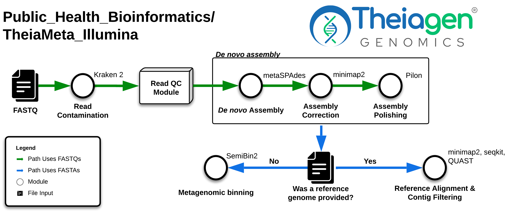

# TheiaMeta

## Quick Facts

{{ render_tsv_table("docs/assets/tables/all_workflows.tsv", sort_by="Name", filters={"Name": "[**TheiaMeta**](../workflows/genomic_characterization/theiameta.md)"}, columns=["Workflow Type", "Applicable Kingdom", "Last Known Changes", "Command-line Compatibility","Workflow Level"]) }}

## TheiaMeta Workflows

Genomic characterization of pathogens is an increasing priority for public health laboratories globally. The workflows in the TheiaMeta Genomic Characterization Series make the analysis of pathogens from metagenomic samples easy by taking raw next-generation sequencing (NGS) data and generating metagenome-assembled genomes (MAGs), either using a reference-genome or not.

TheiaMeta can use one of two distinct methods for generating and processing the final assembly:

- **If a reference genome is not provided**, the _de novo_  assembly will be the final assembly. Additionally, go through a binning process where the contigs are separated into distinct files ("bins") according to composition and coverage such that each bin hopefully contains a single taxon.
- **If a reference genome is provided by the user**, the _de novo_  metagenomic assembly is filtered by mapping the contigs to the reference and those constitute the final assembly. No binning is necessary as the mapping will filter contigs that are likely the same taxon as the reference.

!!! caption "TheiaMeta Workflow Diagram"

    

### Inputs

The TheiaMeta_Illumina_PE workflow processes Illumina paired-end (PE) reads generated for metagenomic characterization (typically by shotgun). By default, this workflow will assume that input reads were generated using a 300-cycle sequencing kit (i.e. 2 x 150 bp reads). Modifications to the optional parameter for `trim_minlen` may be required to accommodate shorter read data, such as 2 x 75bp reads generated using a 150-cycle sequencing kit.

/// html | div[class="searchable-table"]

{{ render_tsv_table("docs/assets/tables/all_inputs.tsv", input_table=True, filters={"Workflow": "TheiaMeta_Illumina_PE"}, columns=["Terra Task Name", "Variable", "Type", "Description", "Default Value", "Terra Status"], sort_by=[("Terra Status", True), "Terra Task Name", "Variable"]) }}

///

### Workflow Tasks

{{ include_md("common_text/versioning_task.md") }}

#### Read Cleaning and QC

{{ include_md("common_text/ncbi_scrub_task.md") }}
{{ include_md("common_text/read_qc_trim_illumina.md", condition="theiameta") }}
{{ include_md("common_text/kraken2_task.md", condition="theiameta") }}

#### Assembly

??? task "`metaspades`: _De Novo_ Metagenomic Assembly"

    While metagenomics has emerged as a technology of choice for analyzing bacterial populations, the assembly of metagenomic data remains challenging. A dedicated metagenomic assembly algorithm is necessary to circumvent the challenge of interpreting variation. metaSPAdes addresses various challenges of metagenomic assembly by capitalizing on computational ideas that proved to be useful in assemblies of single cells and highly polymorphic diploid genomes.

    `metaspades` is a _de novo_ assembler that first constructs a de Bruijn graph of all the reads using the SPAdes algorithm. Through various graph simplification procedures, paths in the assembly graph are reconstructed that correspond to long genomic fragments within the metagenome. For more details, please see the original publication.

    !!! warning "Common errors with SPAdes v4+"

        We found that MetaSPAdes v4+ can raise segmentation fault errors using our validation set of metagenomic samples, so MetaSPAdes v3+ is called by TheiaMeta. A newer version can be called by referencing a more recent container (e.g. "us-docker.pkg.dev/general-theiagen/staphb/spades:4.2.0") via the `metaspades_pe` `docker` input.

    !!! techdetails "MetaSPAdes Technical Details"
        
        |  | Links |
        | --- | --- |
        | Task | [task_metaspades.wdl](https://github.com/theiagen/public_health_bioinformatics/blob/main/tasks/assembly/task_metaspades.wdl) |
        | Software Source Code | [SPAdes on GitHub](https://github.com/ablab/spades) |        
        | Software Documentation | [SPAdes Manual](https://ablab.github.io/spades/index.html) |
        | Original Publication(s) | [metaSPAdes: a new versatile metagenomic assembler](http://www.genome.org/cgi/doi/10.1101/gr.213959.116) |

??? task "`minimap2`: Assembly Correction"
{{ include_md("common_text/minimap2_task.md", condition="sr_mode")}}

??? task "`samtools`: SAM File Conversion "
    This task converts the output SAM file from minimap2 and converts it to a BAM file. It then sorts the BAM based on the read names, and then generates an index file.

    !!! techdetails "samtools Technical Details"
        | | Links |
        |---|---|
        | Task | [task_samtools.wdl](https://github.com/theiagen/public_health_bioinformatics/blob/main/tasks/utilities/data_handling/task_parse_mapping.wdl) |
        | Software Source Code | [samtools on GitHub](https://github.com/samtools/samtools) |
        | Software Documentation | [samtools](https://www.htslib.org/doc/samtools.html) |
        | Original Publication(s) | [The Sequence Alignment/Map format and SAMtools](https://doi.org/10.1093/bioinformatics/btp352) [Twelve Years of SAMtools and BCFtools](https://doi.org/10.1093/gigascience/giab008) |

??? task "`pilon`: Assembly Polishing"
    `pilon` is a tool that uses read alignment to correct errors in an assembly. It is used to polish the assembly produced by metaSPAdes. The input to Pilon is the sorted BAM file produced by `samtools`, and the original draft assembly produced by `metaspades`.

    !!! techdetails "pilon Technical Details"
        | | Links |
        |---|---|
        | Task | [task_pilon.wdl](https://github.com/theiagen/public_health_bioinformatics/blob/main/tasks/quality_control/read_filtering/task_pilon.wdl) |
        | Software Source Code | [Pilon on GitHub](https://github.com/broadinstitute/pilon) |
        | Software Documentation | [Pilon Wiki](https://github.com/broadinstitute/pilon/wiki) |
        | Original Publication(s) | [Pilon: An Integrated Tool for Comprehensive Microbial Variant Detection and Genome Assembly Improvement](https://doi.org/10.1371/journal.pone.0112963) |

#### Reference Alignment & Contig Filtering

!!! hint ""
    These tasks only run if a reference is provided through the `reference` optional input.

??? task "`minimap2`: Assembly Alignment and Contig Filtering"
{{ include_md("common_text/minimap2_task.md", condition="asm20_mode")}}

??? task "Parsing the PAF file into a FASTA file"

    Following the `minimap2` alignment, the output PAF file is parsed into a FASTA file using `seqkit` and then coverage is calculated using `awk`.

    !!! techdetails "`parse_mapping` Technical Details"
        | | Links |
        |---|---|
        | Task | [task_parse_mapping.wdl#retrieve_aligned_contig_paf](https://github.com/theiagen/public_health_bioinformatics/blob/69223caab616070ab92cf1abedc78c9f92e95f6b/tasks/utilities/data_handling/task_parse_mapping.wdl#L3) [task_parse_mapping.wdl#calculate_coverage_paf](https://github.com/theiagen/public_health_bioinformatics/blob/69223caab616070ab92cf1abedc78c9f92e95f6b/tasks/utilities/data_handling/task_parse_mapping.wdl#L48) |
        | Software Source Code | [seqkit on GitHub](https://github.com/shenwei356/seqkit)
        | Software Documentation | [seqkit](https://bioinf.shenwei.me/seqkit/) |
        | Original Publication(s) | [SeqKit: A Cross-Platform and Ultrafast Toolkit for FASTA/Q File Manipulation](https://doi.org/10.1371/journal.pone.0163962) [SeqKit2: A Swiss army knife for sequence and alignment processing](https://doi.org/10.1002/imt2.191) |

#### Assembly QC

!!! hint ""
    This task is run on either:

    - the reference-aligned contigs (if a reference was provided), or 
    - the Pilon-polished assembly_fasta (if no reference was provided).

??? task  "`quast`: Assembly Quality Assessment"

    QUAST stands for QUality ASsessment Tool. It evaluates genome/metagenome assemblies by computing various metrics without a reference being necessary. It includes useful metrics such as number of contigs, length of the largest contig and N50. 
    
    !!! techdetails "QUAST Technical Details"
        
        |  | Links |
        | --- | --- |
        | Task | [task_quast.wdl](https://github.com/theiagen/public_health_bioinformatics/blob/main/tasks/quality_control/basic_statistics/task_quast.wdl) |
        | Software Source Code | [QUAST on GitHub](https://github.com/ablab/quast) |
        | Software Documentation | <https://quast.sourceforge.net/> |
        | Original Publication(s) | [QUAST: quality assessment tool for genome assemblies](https://academic.oup.com/bioinformatics/article/29/8/1072/228832) |

#### Binning

!!! hint ""
    These tasks only run if a reference is _not_ provided.

{{ include_md("common_text/bwa_task.md", condition="theiameta") }}

??? task "`semibin2`: Metagenomic binning"

    After the alignment, the resulting BAM file and index and the Pilon-polished assembly_fasta will be binned with `semibin2`, a command-line tool for metagenomic binning with deep learning. Specifically, it uses a semi-supervised siamese neural network that uses knowledge from reference genomes while maintaining reference-exclusive bins. By default, the `global` environemnt model is used, though a variety of options that may be better suited for your sample are available, and are listed in the relevant inputs section.

    !!! techdetails "SemiBin2 Technical Details"
        
        |  | Links |
        | --- | --- |
        | Task | [task_semibin2.wdl](https://github.com/theiagen/public_health_bioinformatics/blob/main/tasks/assembly/task_semibin.wdl) |
        | Software Source Code | [SemiBin2 on GitHub](https://github.com/BigDataBiology/SemiBin) |
        | Software Documenttation | [SemiBin2 ReadTheDocs](https://semibin.readthedocs.io/en/stable/usage/) |
        | Original Publication(s) | [A deep siamese neural network improves metagenome-assembled genomes in microbiome datasets across different environments](https://doi.org/10.1038/s41467-022-29843-y) |

#### Additional Outputs

!!! hint ""
    These tasks only run if `output_additional_files` is set to `true` (default is `false`).

??? task "`minimap2`: Read Alignment to the Assembly"
{{ include_md("common_text/minimap2_task.md", condition="sr_mode")}}

??? task "`samtools`: SAM File Conversion (Round 2)"
    This task converts the output SAM file from minimap2 and converts it to a BAM file. It then sorts the BAM based on the read names, and then generates an index file.

    !!! techdetails "samtools Technical Details"
        | | Links |
        |---|---|
        | Task | [task_samtools.wdl](https://github.com/theiagen/public_health_bioinformatics/blob/main/tasks/utilities/data_handling/task_parse_mapping.wdl) |
        | Software Source Code | [samtools on GitHub](https://github.com/samtools/samtools) |
        | Software Documentation | [samtools](https://www.htslib.org/doc/samtools.html) |
        | Original Publication(s) | [The Sequence Alignment/Map format and SAMtools](https://doi.org/10.1093/bioinformatics/btp352) [Twelve Years of SAMtools and BCFtools](https://doi.org/10.1093/gigascience/giab008) |

??? task "Parsing the BAM file"
    Several tasks follow that perform the following functions:

    1. Calculates the average depth of coverage of the assembly using `bedtools`.
    2. Retrieves from the BAM file any unaligned reads using `samtools`.
    3. Retrieves from the BAM file any aligned reads using `samtools`.
    4. Calculates the percentage of reads that were assembled using `samtools`.

    !!! techdetails "`parse_mapping` Technical Details"
        | | Links |
        |---|---|
        | Task | [task_parse_mapping.wdl#calculate_coverage](https://github.com/theiagen/public_health_bioinformatics/blob/69223caab616070ab92cf1abedc78c9f92e95f6b/tasks/utilities/data_handling/task_parse_mapping.wdl#L159) [task_parse_mapping.wdl#retrieve_pe_reads_bam](https://github.com/theiagen/public_health_bioinformatics/blob/69223caab616070ab92cf1abedc78c9f92e95f6b/tasks/utilities/data_handling/task_parse_mapping.wdl#L125) [task_parse_mapping.wdl#assembled_reads_percent](https://github.com/theiagen/public_health_bioinformatics/blob/69223caab616070ab92cf1abedc78c9f92e95f6b/tasks/utilities/data_handling/task_parse_mapping.wdl#L206) |
        | Software Source Code | [bedtools on GitHub](https://github.com/arq5x/bedtools2) [samtools on GitHub](https://github.com/samtools/samtools) |
        | Software Documentation | [bedtools ReadTheDocs](https://bedtools.readthedocs.io/en/latest/) [samtools](https://www.htslib.org/doc/samtools.html) |
        | Original Publication(s) | [BEDTools: a flexible suite of utilities for comparing genomic features](https://doi.org/10.1093/bioinformatics/btq033) [The Sequence Alignment/Map format and SAMtools](https://doi.org/10.1093/bioinformatics/btp352) [Twelve Years of SAMtools and BCFtools](https://doi.org/10.1093/gigascience/giab008) |

### Outputs

/// html | div[class="searchable-table"]

{{ render_tsv_table("docs/assets/tables/all_outputs.tsv", input_table=False, filters={"Workflow": "TheiaMeta_Illumina_PE"}, columns=["Variable", "Type", "Description"], sort_by=["Variable"]) }}

///

[^1]: Direct quote from the abstract of _Yang C, Chowdhury D, Zhang Z, Cheung WK, Lu A, Bian Z, Zhang L. A review of computational tools for generating metagenome-assembled genomes from metagenomic sequencing data. Comput Struct Biotechnol J. 2021;19:6301-14. doi: 10.1016/j.csbj.2021.11.028._ This is a paper from 2021 that reviews some of the tools used in this workflow, though not all.

## References

> **Human read removal tool (HRRT)**: <https://github.com/ncbi/sra-human-scrubber>
<!-- -->
>**Trimmomatic:** Anthony M. Bolger and others, Trimmomatic: a flexible trimmer for Illumina sequence data, _Bioinformatics_, Volume 30, Issue 15, August 2014, Pages 2114–2120, <https://doi.org/10.1093/bioinformatics/btu170>
<!-- -->
>**Fastq-Scan:** <https://github.com/rpetit3/fastq-scan>
<!-- -->
>**metaSPAdes:** Sergey Nurk and others, metaSPAdes: a new versatile metagenomic assembler, _Genome Res._ 2017 May; 27(5): 824–834., <https://doi.org/10.1101%2Fgr.213959.116>
<!-- -->
>**Pilon:** Bruce J. Walker and others. Pilon: An Integrated Tool for Comprehensive Microbial Variant Detection and Genome Assembly Improvement. _Plos One._ November 19, 2014. <https://doi.org/10.1371/journal.pone.0112963>
<!-- -->
>**Minimap2:** Heng Li, Minimap2: pairwise alignment for nucleotide sequences, _Bioinformatics_, Volume 34, Issue 18, September 2018, Pages 3094–3100, <https://doi.org/10.1093/bioinformatics/bty191>
<!-- -->
>**QUAST:** Alexey Gurevich and others, QUAST: quality assessment tool for genome assemblies, _Bioinformatics_, Volume 29, Issue 8, April 2013, Pages 1072–1075, <https://doi.org/10.1093/bioinformatics/btt086>
<!-- -->
>**Samtools:** Li, Heng, Bob Handsaker, Alec Wysoker, Tim Fennell, Jue Ruan, Nils Homer, Gabor Marth, Goncalo Abecasis, Richard Durbin, and 1000 Genome Project Data Processing Subgroup. 2009. The Sequence Alignment/Map format and SAMtools. Bioinformatics 25(16): 2078-2079. <https://doi.org/10.1093/bioinformatics/btp352>
<!-- -->
>**BEDtools:** Quinlan AR and Hall IM, 2010. BEDTools: a flexible suite of utilities for comparing genomic features. Bioinformatics. 26, 6, pp. 841–842. <https://doi.org/10.1093/bioinformatics/btq033>
<!-- -->
>**Bcftools:** Petr Danecek, James K Bonfield, Jennifer Liddle, John Marshall, Valeriu Ohan, Martin O Pollard, Andrew Whitwham, Thomas Keane, Shane A McCarthy, Robert M Davies, Heng Li. Twelve years of SAMtools and BCFtools. GigaScience, Volume 10, Issue 2, February 2021, giab008, <https://doi.org/10.1093/gigascience/giab008>
<!-- -->
>**Semibin2:** Shaojun Pan, Xing-Ming Zhao, Luis Pedro Coelho, SemiBin2: self-supervised contrastive learning leads to better MAGs for short- and long-read sequencing, _Bioinformatics_, Volume 39, Issue Supplement_1, June 2023, Pages i21–i29, <https://doi.org/10.1093/bioinformatics/btad209>
