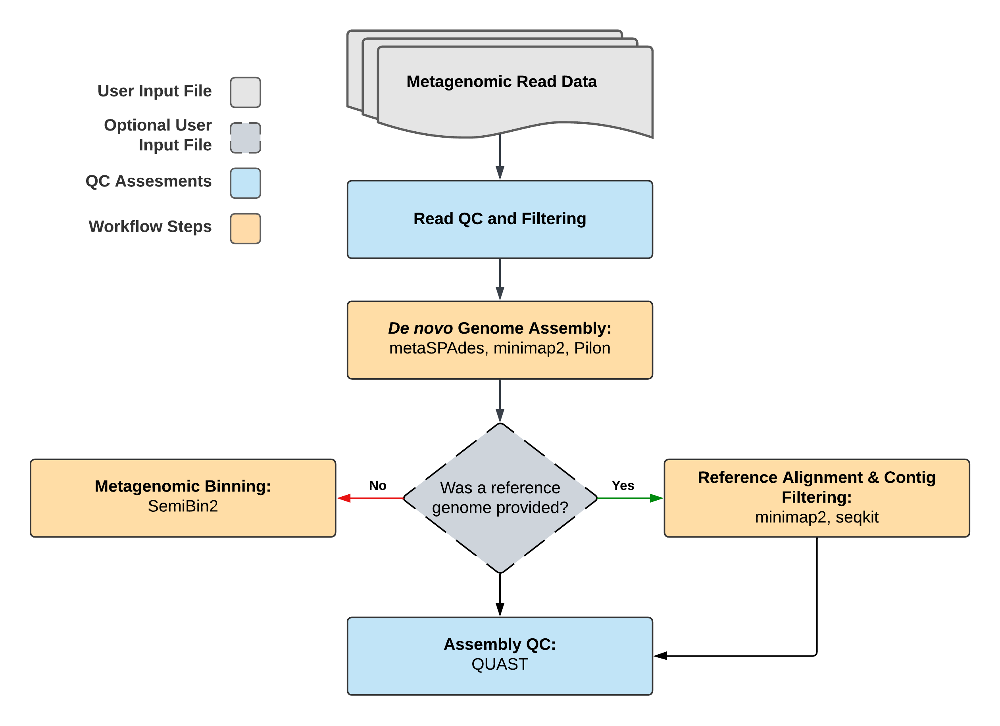

# TheiaMeta

## Quick Facts

| **Workflow Type** | **Applicable Kingdom** | **Last Known Changes** | **Command-line Compatibility** | **Workflow Level** |
|---|---|---|---|---|
| [Genomic Characterization](../../workflows_overview/workflows_type.md/#genomic-characterization) | [Any Taxa](../../workflows_overview/workflows_kingdom.md/#any-taxa) | PHB v2.2.0 | Yes | Sample-level |

## TheiaMeta Workflows

Genomic characterization of pathogens is an increasing priority for public health laboratories globally. The workflows in the TheiaMeta Genomic Characterization Series make the analysis of pathogens from metagenomic samples easy by taking raw next-generation sequencing (NGS) data and generating metagenome-assembled genomes (MAGs), either using a reference-genome or not.

TheiaMeta can use one of two distinct methods for generating and processing the final assembly:

- **If a reference genome is not provided**, the _de novo_  assembly will be the final assembly. Additionally, go through a binning process where the contigs are separated into distinct files ("bins") according to composition and coverage such that each bin hopefully contains a single taxon.
- **If a reference genome is provided by the user**, the _de novo_  metagenomic assembly is filtered by mapping the contigs to the reference and those constitute the final assembly. No binning is necessary as the mapping will filter contigs that are likely the same taxon as the reference.

!!! caption "TheiaMeta Workflow Diagram"

    

### Inputs

The TheiaMeta_Illumina_PE workflow processes Illumina paired-end (PE) reads generated for metagenomic characterization (typically by shotgun). By default, this workflow will assume that input reads were generated using a 300-cycle sequencing kit (i.e. 2 x 150 bp reads). Modifications to the optional parameter for `trim_minlen` may be required to accommodate shorter read data, such as 2 x 75bp reads generated using a 150-cycle sequencing kit.

| **Terra Task Name** | **Variable** | **Type** | **Description** | **Default Value** | **Terra Status** |
|---|---|---|---|---|---|
| theiameta_illumina_pe | **read1** | File | Forward Illumina read in FASTQ file format |  | Required |
| theiameta_illumina_pe | **read2** | File | Reverse Illumina read in FASTQ file format |  | Required |
| theiameta_illumina_pe | **samplename** | String | Name of the sample being analyzed |  | Required |
| assembled_reads_percent | **cpu** | Int | Number of CPUs to allocate to the task | 2 | Optional |
| assembled_reads_percent | **disk_size** | Int | Amount of storage (in GB) to allocate to the task | 100 | Optional |
| assembled_reads_percent | **docker** | String | The Docker container to use for the task | us-docker.pkg.dev/general-theiagen/staphb/samtools:1.17 | Optional |
| assembled_reads_percent | **memory** | Int | Amount of memory/RAM (in GB) to allocate to the task | 8 | Optional |
| bwa | **cpu** | Int | Number of CPUs to allocate to the task | 6 | Optional |
| bwa | **disk_size** | Int | Amount of storage (in GB) to allocate to the task | 100 | Optional |
| bwa | **docker** | String | The Docker container to use for the task | us-docker.pkg.dev/general-theiagen/staphb/ivar:1.3.1-titan | Optional |
| bwa | **memory** | Int | Amount of memory/RAM (in GB) to allocate to the task | 16 | Optional |
| calculate_coverage | **cpu** | Int | Number of CPUs to allocate to the task | 2 | Optional |
| calculate_coverage | **disk_size** | Int | Amount of storage (in GB) to allocate to the task | 100 | Optional |
| calculate_coverage | **docker** | String | The Docker container to use for the task | us-docker.pkg.dev/general-theiagen/staphb/bedtools:2.31.0 | Optional |
| calculate_coverage | **memory** | Int | Amount of memory/RAM (in GB) to allocate to the task | 8 | Optional |
| calculate_coverage_paf | **cpu** | Int | Number of CPUs to allocate to the task | 2 | Optional |
| calculate_coverage_paf | **disk_size** | Int | Amount of storage (in GB) to allocate to the task | 100 | Optional |
| calculate_coverage_paf | **docker** | String | The Docker container to use for the task | us-docker.pkg.dev/general-theiagen/quay/ubuntu:latest | Optional |
| calculate_coverage_paf | **memory** | Int | Amount of memory/RAM (in GB) to allocate to the task | 8 | Optional |
| compare_assemblies | **disk_size** | Int | Amount of storage (in GB) to allocate to the task | 100 | Optional |
| kraken2_clean | **cpu** | Int | Number of CPUs to allocate to the task | 4 | Optional |
| kraken2_clean | **disk_size** | Int | GB of storage to request for VM used to run the kraken2 task. Increase this when using large (>30GB kraken2 databases such as the "k2_standard" database) | 100 | Optional |
| kraken2_clean | **docker** | String | The Docker container to use for the task | us-docker.pkg.dev/general-theiagen/staphb/kraken2:2.1.2-no-db | Optional |
| kraken2_clean | **memory** | Int | Amount of memory/RAM (in GB) to allocate to the task | 16 | Optional |
| kraken2_raw | **cpu** | Int | Number of CPUs to allocate to the task | 4 | Optional |
| kraken2_raw | **disk_dize** | Int | GB of storage to request for VM used to run the kraken2 task. Increase this when using large (>30GB kraken2 databases such as the "k2_standard" database) | 100 | Optional |
| kraken2_raw | **docker** | String | The Docker container to use for the task | us-docker.pkg.dev/general-theiagen/staphb/kraken2:2.1.2-no-db | Optional |
| kraken2_raw | **memory** | Int | Amount of memory/RAM (in GB) to allocate to the task | 16 | Optional |
| krona_clean | **cpu** | Int | Number of CPUs to allocate to the task | 4 | Optional |
| krona_clean | **disk_size** | Int | Amount of storage (in GB) to allocate to the task | 100 | Optional |
| krona_clean | **docker** | String | The Docker container to use for the task | us-docker.pkg.dev/general-theiagen/biocontainers/krona:2.7.1--pl526_5 | Optional |
| krona_clean | **memory** | Int | Amount of memory/RAM (in GB) to allocate to the task | 8 | Optional |
| krona_raw | **cpu** | Int | Number of CPUs to allocate to the task | 4 | Optional |
| krona_raw | **disk_size** | Int | Amount of storage (in GB) to allocate to the task | 100 | Optional |
| krona_raw | **docker** | String | The Docker container to use for the task | us-docker.pkg.dev/general-theiagen/biocontainers/krona:2.7.1--pl526_5 | Optional |
| krona_raw | **memory** | Int | Amount of memory/RAM (in GB) to allocate to the task | 8 | Optional |
| metaspades | **kmers** | String | Kmer list to use with metaspades. If not provided metaspades automatically sets this value |  | Optional |
| metaspades | **metaspades_opts** | String | Additional arguments to pass to metaspades task |  | Optional |
| minimap2_assembly | **cpu** | Int | Number of CPUs to allocate to the task | 2 | Optional |
| minimap2_assembly | **disk_size** | Int | Amount of storage (in GB) to allocate to the task | 100 | Optional |
| minimap2_assembly | **docker** | String | The Docker container to use for the task | us-docker.pkg.dev/general-theiagen/staphb/minimap2:2.22 | Optional |
| minimap2_assembly | **memory** | Int | Amount of memory/RAM (in GB) to allocate to the task | 8 | Optional |
| minimap2_assembly | **query2** | File | Internal component. Do not modify. |  | Optional |
| minimap2_reads | **cpu** | Int | Number of CPUs to allocate to the task | 2 | Optional |
| minimap2_reads | **disk_size** | Int | Amount of storage (in GB) to allocate to the task | 100 | Optional |
| minimap2_reads | **docker** | String | The Docker container to use for the task | us-docker.pkg.dev/general-theiagen/staphb/minimap2:2.22 | Optional |
| minimap2_reads | **memory** | Int | Amount of memory/RAM (in GB) to allocate to the task | 8 | Optional |
| quast | **cpu** | Int | Number of CPUs to allocate to the task | 2 | Optional |
| quast | **disk_size** | Int | Amount of storage (in GB) to allocate to the task | 100 | Optional |
| quast | **docker** | String | The Docker container to use for the task | us-docker.pkg.dev/general-theiagen/staphb/quast:5.0.2 | Optional |
| quast | **memory** | Int | Amount of memory/RAM (in GB) to allocate to the task | 2 | Optional |
| read_QC_trim | **adapters** | File | Adapter file to be trimmed by trimmomatic |  | Optional |
| read_QC_trim | **bbduck_mem** | Int | Memory to use with bbduck | 8 | Optional |
| read_QC_trim | **call_midas** | Boolean | Optional to run Midas on input data | FALSE | Optional |
| read_QC_trim | **fastp_args** | String | Fastp-specific options that you might choose, see <https://github.com/OpenGene/fastp> |  | Optional |
| read_QC_trim | **midas_db** | File | A Midas database in .tar.gz format | gs://theiagen-public-files-rp/terra/theiaprok-files/midas/midas_db_v1.2.tar.gz | Optional |
| read_QC_trim | **phix** | File |  |  | Optional |
| read_QC_trim | **read_processing** | String |  |  | Optional |
| read_QC_trim | **read_qc** | String | Allows the user to decide between fastq_scan (default) and fastqc for the evaluation of read quality. | fastq_scan | Optional |
| read_QC_trim | **target_organism** | String | Internal component. Do not modify. |  | Optional |
| read_QC_trim | **trim_min_length** | Int |  |  | Optional |
| read_QC_trim | **trim_window_size** | Int |  |  | Optional |
| read_QC_trim | **trimmomatic_args** | String |  |  | Optional |
| retrieve_aligned_contig_paf | **cpu** | Int | Number of CPUs to allocate to the task | 2 | Optional |
| retrieve_aligned_contig_paf | **disk_size** | Int | Amount of storage (in GB) to allocate to the task | 100 | Optional |
| retrieve_aligned_contig_paf | **docker** | String | The Docker container to use for the task | us-docker.pkg.dev/general-theiagen/staphb/seqkit:2.3.1 | Optional |
| retrieve_aligned_contig_paf | **memory** | Int | Amount of memory/RAM (in GB) to allocate to the task | 8 | Optional |
| retrieve_aligned_pe_reads_sam | **cpu** | Int | Number of CPUs to allocate to the task | 2 | Optional |
| retrieve_aligned_pe_reads_sam | **disk_size** | Int | Amount of storage (in GB) to allocate to the task | 100 | Optional |
| retrieve_aligned_pe_reads_sam | **docker** | String | The Docker container to use for the task | us-docker.pkg.dev/general-theiagen/staphb/samtools:1.17 | Optional |
| retrieve_aligned_pe_reads_sam | **memory** | Int | Amount of memory/RAM (in GB) to allocate to the task | 8 | Optional |
| retrieve_unaligned_pe_reads_sam | **cpu** | Int | Number of CPUs to allocate to the task | 2 | Optional |
| retrieve_unaligned_pe_reads_sam | **disk_size** | Int | Amount of storage (in GB) to allocate to the task | 100 | Optional |
| retrieve_unaligned_pe_reads_sam | **docker** | String | The Docker container to use for the task | us-docker.pkg.dev/general-theiagen/staphb/samtools:1.17 | Optional |
| retrieve_unaligned_pe_reads_sam | **memory** | Int | Amount of memory/RAM (in GB) to allocate to the task | 8 | Optional |
| sam_to_sorted_bam | **cpu** | Int | Number of CPUs to allocate to the task | 2 | Optional |
| sam_to_sorted_bam | **disk_size** | Int | Amount of storage (in GB) to allocate to the task | 100 | Optional |
| sam_to_sorted_bam | **docker** | String | The Docker container to use for the task | us-docker.pkg.dev/general-theiagen/staphb/samtools:1.17 | Optional |
| sam_to_sorted_bam | **memory** | Int | Amount of memory/RAM (in GB) to allocate to the task | 8 | Optional |
| semibin | **cpu** | Int | Number of CPUs to allocate to the task | 6 | Optional |
| semibin | **disk_size** | Int | Amount of storage (in GB) to allocate to the task | 100 | Optional |
| semibin | **docker** | String | The Docker container to use for the task | us-docker.pkg.dev/general-theiagen/biocontainers/semibin:2.0.2--pyhdfd78af_0 | Optional |
| semibin | **environment** | String | Environment model to use. Options: • human_gut • dog_gut • ocean • soil • cat_gut • human_oral • mouse_gut • pig_gut • built_environment • wastewater • chicken_caecum - global | global | Optional |
| semibin | **memory** | Int | Amount of memory/RAM (in GB) to allocate to the task | 8 | Optional |
| semibin | **min_length** | Int | Minimum contig length for binning | 1000 | Optional |
| semibin | **ratio** | Float | If the ratio of the number of base pairs of contigs between 1000-2500 bp smaller than this value, the minimal length will be set as 1000bp, otherwise 2500bp. | 0.05 | Optional |
| sort_bam_assembly_correction | **cpu** | Int | Number of CPUs to allocate to the task | 2 | Optional |
| sort_bam_assembly_correction | **disk_size** | Int | Amount of storage (in GB) to allocate to the task | 100 | Optional |
| sort_bam_assembly_correction | **docker** | String | The Docker container to use for the task | us-docker.pkg.dev/general-theiagen/staphb/samtools:1.17 | Optional |
| sort_bam_assembly_correction | **memory** | Int | Amount of memory/RAM (in GB) to allocate to the task | 8 | Optional |
| theiameta_illumina_pe | **kraken2_db** | File | A Kraken2 database in .tar.gz format | gs://theiagen-public-files-rp/terra/theiaprok-files/k2_standard_08gb_20230605.tar.gz | Optional |
| theiameta_illumina_pe | **output_additional_files** | Boolean | Output additional files such as aligned and unaligned reads to reference | FALSE | Optional |
| theiameta_illumina_pe | **reference** | File | Reference file for consensus calling, in FASTA format |  | Optional |
| version_capture | **docker** | String | The Docker container to use for the task | "us-docker.pkg.dev/general-theiagen/theiagen/alpine-plus-bash:3.20.0" | Optional |
| version_capture | **timezone** | String | Set the time zone to get an accurate date of analysis (uses UTC by default) |  | Optional |

### Workflow Tasks

??? task "`versioning`: Version Capture for TheiaMeta"

    The `versioning` task captures the workflow version from the GitHub (code repository) version.
        
    !!! techdetails "Version Capture Technical details"
        
        |  | Links |
        | --- | --- |
        | Task | [task_versioning.wdl](https://github.com/theiagen/public_health_bioinformatics/blob/main/tasks/task_versioning.wdl) |

#### Read Cleaning and QC

??? task "`HRRT`: Human Host Sequence Removal"

    All reads of human origin **are removed**, including their mates, by using NCBI's [**human read removal tool (HRRT)**](https://github.com/ncbi/sra-human-scrubber). 

    HRRT is based on the [SRA Taxonomy Analysis Tool](https://doi.org/10.1186/s13059-021-02490-0) and employs a k-mer database constructed of k-mers from Eukaryota derived from all human RefSeq records with any k-mers found in non-Eukaryota RefSeq records subtracted from the database.

    !!! techdetails "NCBI-Scrub Technical Details"
        
        |  | Links |
        | --- | --- |
        | Task | [task_ncbi_scrub.wdl](https://github.com/theiagen/public_health_bioinformatics/blob/main/tasks/quality_control/task_ncbi_scrub.wdl) |
        | Software Source Code | [NCBI Scrub on GitHub](https://github.com/ncbi/sra-human-scrubber) |
        | Software Documentation | <https://github.com/ncbi/sra-human-scrubber/blob/master/README.md> |

??? task "`read_QC_trim`: Read Quality Trimming, Adapter Removal, Quantification, and Identification"

    `read_QC_trim` is a sub-workflow within TheiaMeta that removes low-quality reads, low-quality regions of reads, and sequencing adapters to improve data quality. It uses a number of tasks, described below.

    **Read quality trimming**

    Either `trimmomatic` or `fastp` can be used for read-quality trimming. Trimmomatic is used by default. Both tools trim low-quality regions of reads with a sliding window (with a window size of `trim_window_size`), cutting once the average quality within the window falls below `trim_quality_trim_score`. They will both discard the read if it is trimmed below `trim_minlen`. 

    If fastp is selected for analysis, fastp also implements the additional read-trimming steps indicated below:

    | **Parameter** | **Explanation** |
    | --- | --- |
    | -g | enables polyG tail trimming |
    | -5 20 | enables read end-trimming |
    | -3 20 | enables read end-trimming |
    | --detect_adapter_for_pe | enables adapter-trimming **only for paired-end reads** |

    **Adapter removal**

    The `BBDuk` task removes adapters from sequence reads. To do this:

    - [Repair](https://jgi.doe.gov/data-and-tools/software-tools/bbtools/bb-tools-user-guide/repair-guide/) from the [BBTools](https://jgi.doe.gov/data-and-tools/software-tools/bbtools/) package reorders reads in paired fastq files to ensure the forward and reverse reads of a pair are in the same position in the two fastq files.
    - [BBDuk](https://jgi.doe.gov/data-and-tools/software-tools/bbtools/bb-tools-user-guide/bbduk-guide/)  (*"Bestus Bioinformaticus" Decontamination Using Kmers*) is then used to trim the adapters and filter out all reads that have a 31-mer match to [PhiX](https://emea.illumina.com/products/by-type/sequencing-kits/cluster-gen-sequencing-reagents/phix-control-v3.html), which is commonly added to Illumina sequencing runs to monitor and/or improve overall run quality.
    
    ??? toggle "What are adapters and why do they need to be removed?"
        Adapters are manufactured oligonucleotide sequences attached to DNA fragments during the library preparation process. In Illumina sequencing, these adapter sequences are required for attaching reads to flow cells. You can read more about Illumina adapters [here](https://emea.support.illumina.com/bulletins/2020/06/illumina-adapter-portfolio.html). For genome analysis, it's important to remove these sequences since they're not actually from your sample. If you don't remove them, the downstream analysis may be affected.
        
    **Read Quantification**

    There are two methods for read quantification to choose from: [`fastq-scan`](https://github.com/rpetit3/fastq-scan) (default) or [`fastqc`](https://www.bioinformatics.babraham.ac.uk/projects/fastqc/). Both quantify the forward and reverse reads in FASTQ files. In TheiaProk_Illumina_PE, they also provide the total number of read pairs. This task is run once with raw reads as input and once with clean reads as input. If QC has been performed correctly, you should expect **fewer** clean reads than raw reads. `fastqc` also provides a graphical visualization of the read quality.

    **Read Identification (optional)**

    The `MIDAS` task is for the identification of reads to detect contamination with non-target taxa. This task is optional and turned off by default. It can be used by setting the `call_midas` input variable to `true`.

    The MIDAS reference database, located at **`gs://theiagen-large-public-files-rp/terra/theiaprok-files/midas/midas_db_v1.2.tar.gz`**, is provided as the default. It is possible to provide a custom database. More information is available [here](https://github.com/snayfach/MIDAS/blob/master/docs/ref_db.md).

    ??? toggle "How are the MIDAS output columns determined?"
        
        Example MIDAS report in the ****`midas_report` column:
        
        | species_id | count_reads | coverage | relative_abundance |
        | --- | --- | --- | --- |
        | Salmonella_enterica_58156 | 3309 | 89.88006645 | 0.855888033 |
        | Salmonella_enterica_58266 | 501 | 11.60606061 | 0.110519371 |
        | Salmonella_enterica_53987 | 99 | 2.232896237 | 0.021262881 |
        | Citrobacter_youngae_61659 | 46 | 0.995216227 | 0.009477003 |
        | Escherichia_coli_58110 | 5 | 0.123668877 | 0.001177644 |
        
        MIDAS report column descriptions:
        
        - species_id: species identifier
        - count_reads: number of reads mapped to marker genes
        - coverage: estimated genome-coverage (i.e. read-depth) of species in metagenome
        - relative_abundance: estimated relative abundance of species in metagenome
        
    !!! techdetails "read_QC_trim Technical Details"
                
        |  | Links |
        | --- | --- |
        | Sub-workflow | [wf_read_QC_trim.wdl](https://github.com/theiagen/public_health_bioinformatics/blob/main/workflows/utilities/wf_read_QC_trim.wdl) |
        | Tasks | [task_fastp.wdl](https://github.com/theiagen/public_health_bioinformatics/blob/main/tasks/quality_control/read_filtering/task_fastp.wdl) [task_trimmomatic.wdl](https://github.com/theiagen/public_health_bioinformatics/blob/main/tasks/quality_control/read_filtering/task_trimmomatic.wdl) [task_bbduk.wdl](https://github.com/theiagen/public_health_bioinformatics/blob/main/tasks/quality_control/read_filtering/task_bbduk.wdl) [task_fastq_scan.wdl](https://github.com/theiagen/public_health_bioinformatics/blob/main/tasks/quality_control/basic_statistics/task_fastq_scan.wdl) [task_midas.wdl](https://github.com/theiagen/public_health_bioinformatics/blob/main/tasks/taxon_id/contamination/task_midas.wdl) [task_kraken2.wdl](https://github.com/theiagen/public_health_bioinformatics/blob/main/tasks/taxon_id/contamination/task_kraken2.wdl)|
        | Software Source Code | [fastp](https://github.com/OpenGene/fastp); [Trimmomatic](https://github.com/usadellab/Trimmomatic); [fastq-scan](https://github.com/rpetit3/fastq-scan); [MIDAS](https://github.com/snayfach/MIDAS); [Kraken2](https://github.com/DerrickWood/kraken2)|
        | Software Documentation | [fastp](https://github.com/OpenGene/fastp); [Trimmomatic](http://www.usadellab.org/cms/?page=trimmomatic); [BBDuk](https://jgi.doe.gov/data-and-tools/software-tools/bbtools/bb-tools-user-guide/bbduk-guide/); [fastq-scan](https://github.com/rpetit3/fastq-scan); [MIDAS](https://github.com/snayfach/MIDAS); [Kraken2](https://github.com/DerrickWood/kraken2/wiki) |
        | Original Publication(s) | [Trimmomatic: a flexible trimmer for Illumina sequence data](https://www.ncbi.nlm.nih.gov/pmc/articles/PMC4103590/) [fastp: an ultra-fast all-in-one FASTQ preprocessor](https://academic.oup.com/bioinformatics/article/34/17/i884/5093234?login=false) [An integrated metagenomics pipeline for strain profiling reveals novel patterns of bacterial transmission and biogeography](https://pubmed.ncbi.nlm.nih.gov/27803195/) [Improved metagenomic analysis with Kraken 2](https://genomebiology.biomedcentral.com/articles/10.1186/s13059-019-1891-0) |

??? task "`kraken`: Taxonomic Classification"

    Kraken2 is a bioinformatics tool originally designed for metagenomic applications. It has additionally proven valuable for validating taxonomic assignments and checking contamination of single-species (e.g. bacterial isolate, eukaryotic isolate, viral isolate, etc.) whole genome sequence data.

    Kraken2 is run on the set of raw reads, provided as input, as well as the set of clean reads that are resulted from the `read_QC_trim` workflow

    !!! info "Database-dependent"
        The Kraken2 software is database-dependent and **taxonomic assignments are highly sensitive to the database used**. An appropriate database should contain the expected organism(s) (e.g. _Escherichia coli_) and other taxa that may be present in the reads (e.g. _Citrobacter freundii_, a common contaminant).

    !!! techdetails "Kraken2 Technical Details"    
        
        |  | Links |
        | --- | --- |
        | Task | [task_kraken2.wdl](https://github.com/theiagen/public_health_bioinformatics/blob/main/tasks/taxon_id/task_kraken2.wdl) |
        | Software Source Code | [Kraken2 on GitHub](https://github.com/DerrickWood/kraken2/) |
        | Software Documentation | <https://github.com/DerrickWood/kraken2/wiki> |
        | Original Publication(s) | [Improved metagenomic analysis with Kraken 2](https://genomebiology.biomedcentral.com/articles/10.1186/s13059-019-1891-0) |

#### Assembly

??? task "`metaspades`: _De Novo_ Metagenomic Assembly"

    While metagenomics has emerged as a technology of choice for analyzing bacterial populations, the assembly of metagenomic data remains challenging. A dedicated metagenomic assembly algorithm is necessary to circumvent the challenge of interpreting variation. metaSPAdes addresses various challenges of metagenomic assembly by capitalizing on computational ideas that proved to be useful in assemblies of single cells and highly polymorphic diploid genomes. 

    !!! techdetails "MetaSPAdes Technical Details"
        
        |  | Links |
        | --- | --- |
        | Task | [task_metaspades.wdl](https://github.com/theiagen/public_health_bioinformatics/blob/main/tasks/assembly/task_metaspades.wdl) |
        | Software Source Code | [SPAdes on GitHub](https://github.com/ablab/spades) |
        | Software Documentation | <https://github.com/ablab/spades/blob/spades_3.15.5/README.md> |
        | Original Publication(s) | [metaSPAdes: a new versatile metagenomic assembler](https://www.ncbi.nlm.nih.gov/pmc/articles/PMC5411777/) |

??? task "`minimap2`: Assembly Alignment and Contig Filtering (if a reference is provided)"

    If a reference genome is provided through the **`reference`** optional input, the assembly produced with `metaspades` will be mapped to the reference genome with `minimap2`. The contigs which align to the reference are retrieved and returned in the **`assembly_fasta`** output.

#### Assembly QC

??? task  "`quast`: Assembly Quality Assessment"

    QUAST stands for QUality ASsessment Tool. It evaluates genome/metagenome assemblies by computing various metrics without a reference being necessary. It includes useful metrics such as number of contigs, length of the largest contig and N50. 

    !!! techdetails "QUAST Technical Details"
        
        |  | Links |
        | --- | --- |
        | Task | [task_quast.wdl](https://github.com/theiagen/public_health_bioinformatics/blob/main/tasks/quality_control/task_quast.wdl) |
        | Software Source Code | [QUAST on GitHub](https://github.com/ablab/quast) |
        | Software Documentation | <https://quast.sourceforge.net/> |
        | Original Publication(s) | [QUAST: quality assessment tool for genome assemblies](https://academic.oup.com/bioinformatics/article/29/8/1072/228832) |

#### Binning

??? task "`semibin2`: Metagenomic binning (if a reference is NOT provided)"

    If no reference genome is provided through the **`reference`** optional input, the assembly produced with `metaspades` will be binned with `semibin2`, a a command tool for metagenomic binning with deep learning. 

### Outputs

| **Variable** | **Type** | **Description** |
|---|---|---|
| assembly_fasta | File | Final assembly (MAG) |
| assembly_length | Int | Length of final assembly in basepairs |
| assembly_mean_coverage | Float | Mean depth of coverage of the final assembly |
| average_read_length | Float | Average read length of the clean reads |
| bbduk_docker | String | Docker image for bbduk |
| bedtools_docker | String | Docker image for bedtools |
| bedtools_version | String | Version of bedtools |
| contig number | Int | Number of contigs in final assembly |
| fastp_html_report | File | Report file for fastp in HTML format |
| fastp_version | String | Version of fastp used |
| fastq_scan_docker | String | Docker image of fastq_scan |
| fastq_scan_num_reads_clean_pairs | String | Number of read pairs after cleaning as calculated by fastq_scan |
| fastq_scan_num_reads_clean1 | Int | Number of forward reads after cleaning as calculated by fastq_scan |
| fastq_scan_num_reads_clean2 | Int | Number of reverse reads after cleaning as calculated by fastq_scan |
| fastq_scan_num_reads_raw_pairs | String | Number of input read pairs as calculated by fastq_scan |
| fastq_scan_num_reads_raw1 | Int | Number of input forward reads as calculated by fastq_scan |
| fastq_scan_num_reads_raw2 | Int | Number of input reserve reads as calculated by fastq_scan |
| fastq_scan_version | String | fastq_scan version |
| fastqc_clean1_html | File | Graphical visualization of clean forward read quality from fastqc to open in an internet browser |
| fastqc_clean2_html | File | Graphical visualization of clean reverse read quality from fastqc to open in an internet browser |
| fastqc_docker | String | Docker container used for fastqc |
| fastqc_num_reads_clean_pairs | String | Number of read pairs after cleaning by fastqc |
| fastqc_num_reads_clean1 | Int | Number of forward reads after cleaning by fastqc |
| fastqc_num_reads_clean2 | Int | Number of reverse reads after cleaning by fastqc |
| fastqc_num_reads_raw_pairs | String | Number of input read pairs by fastqc |
| fastqc_num_reads_raw1 | Int | Number of input forward reads by fastqc |
| fastqc_num_reads_raw2 | Int | Number of input reverse reads by fastqc |
| fastqc_raw1_html | File | Graphical visualization of raw forward read quality from fastqc to open in an internet browser |
| fastqc_raw2_html | File | Graphical visualization of raw reverse read qualityfrom fastqc to open in an internet browser |
| fastqc_version | String | Version of fastqc software used |
| kraken2_docker | String | Docker image of kraken2 |
| kraken2_percent_human_clean | Float | Percentage of human-classified reads in the sample's clean reads |
| kraken2_percent_human_raw | Float | Percentage of human-classified reads in the sample's raw reads |
| kraken2_report_clean | File | Full Kraken report for the sample's clean reads |
| kraken2_report_raw | File | Full Kraken report for the sample's raw reads |
| kraken2_version | String | Version of kraken |
| krona_docker | String | Docker image of Krona |
| krona_html_clean | File | The KronaPlot after reads are cleaned |
| krona_html_raw | File | The KronaPlot before reads are cleaned |
| krona_version | String | Version of Krona |
| largest_contig | Int | Largest contig size |
| metaspades_docker | String | Docker image of metaspades |
| metaspades_version | String | Version of metaspades |
| midas_primary_genus | String | Primary genus detected by MIDAS |
| midas_report | File | MIDAS report file tsv file|
| minimap2_docker | String | Docker image of minimap2 |
| minimap2_version | String | Version of minimap2 |
| ncbi_scrub_docker | String | Docker image for NCBI's HRRT |
| percent_coverage | Float | Percentage coverage of the reference genome provided |
| percentage_mapped_reads | Float | Percentage of mapped reads to the assembly |
| pilon_docker | String | Docker image for pilon |
| pilon_version | String | Version of pilon |
| quast_docker | String | Docker image of QUAST |
| quast_version | String | Version of QUAST |
| read1_clean | File | Clean forward reads file |
| read1_dehosted | File | Dehosted forward reads file |
| read1_mapped | File | Mapped forward reads to the assembly |
| read1_unmapped | File | Unmapped forwards reads to the assembly |
| read2_clean | File | Clean reverse reads file |
| read2_dehosted | File | Dehosted reverse reads file |
| read2_mapped | File | Mapped reverse reads to the assembly |
| read2_unmapped | File | Unmapped reverse reads to the assembly |
| samtools_docker | String | Docker image of samtools |
| samtools_version | String | Version of samtools |
| semibin_bins | Array[File] | Array of binned metagenomic assembled genome files |
| semibin_docker | String | Docker image of semibin |
| semibin_version | String | Semibin version used |
| theiameta_illumina_pe_analysis_date | String | Date of analysis |
| theiameta_illumina_pe_version | String | Version of workflow |
| trimmomatic_docker | String | Docker image of trimmomatic |
| trimmomatic_version | String | Version of trimmomatic used |

## References

> **Human read removal tool (HRRT)**: <https://github.com/ncbi/sra-human-scrubber>
<!-- -->
>**Trimmomatic:** Anthony M. Bolger and others, Trimmomatic: a flexible trimmer for Illumina sequence data, *Bioinformatics*, Volume 30, Issue 15, August 2014, Pages 2114–2120, <https://doi.org/10.1093/bioinformatics/btu170>
<!-- -->
>**Fastq-Scan:** <https://github.com/rpetit3/fastq-scan>
<!-- -->
>**metaSPAdes:** Sergey Nurk and others, metaSPAdes: a new versatile metagenomic assembler, *Genome Res.* 2017 May; 27(5): 824–834., <https://doi.org/10.1101%2Fgr.213959.116>
<!-- -->
>**Pilon:** Bruce J. Walker and others. Pilon: An Integrated Tool for Comprehensive Microbial Variant Detection and Genome Assembly Improvement. *Plos One.* November 19, 2014. <https://doi.org/10.1371/journal.pone.0112963>
<!-- -->
>**Minimap2:** Heng Li, Minimap2: pairwise alignment for nucleotide sequences, *Bioinformatics*, Volume 34, Issue 18, September 2018, Pages 3094–3100, <https://doi.org/10.1093/bioinformatics/bty191>
<!-- -->
>**QUAST:** Alexey Gurevich and others, QUAST: quality assessment tool for genome assemblies, *Bioinformatics*, Volume 29, Issue 8, April 2013, Pages 1072–1075, <https://doi.org/10.1093/bioinformatics/btt086>
<!-- -->
>**Samtools:** Li, Heng, Bob Handsaker, Alec Wysoker, Tim Fennell, Jue Ruan, Nils Homer, Gabor Marth, Goncalo Abecasis, Richard Durbin, and 1000 Genome Project Data Processing Subgroup. 2009. The Sequence Alignment/Map format and SAMtools. Bioinformatics 25(16): 2078-2079.
<!-- -->
>**Bcftools:** Petr Danecek, James K Bonfield, Jennifer Liddle, John Marshall, Valeriu Ohan, Martin O Pollard, Andrew Whitwham, Thomas Keane, Shane A McCarthy, Robert M Davies, Heng Li. Twelve years of SAMtools and BCFtools. GigaScience, Volume 10, Issue 2, February 2021, giab008, <https://doi.org/10.1093/gigascience/giab008>
<!-- -->
>**Semibin2:** Shaojun Pan, Xing-Ming Zhao, Luis Pedro Coelho, SemiBin2: self-supervised contrastive learning leads to better MAGs for short- and long-read sequencing, *Bioinformatics*, Volume 39, Issue Supplement_1, June 2023, Pages i21–i29, <https://doi.org/10.1093/bioinformatics/btad209>
