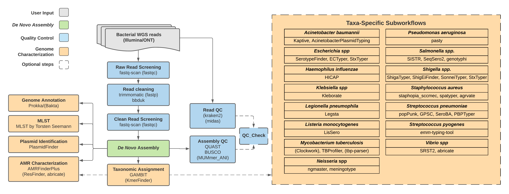

# TheiaProk Workflow Series

## Quick Facts

| **Workflow Type** | **Applicable Kingdom** | **Last Known Changes** | **Command-line Compatibility** | **Workflow Level** |
|---|---|---|---|---|
| [Genomic Characterization](../../workflows_overview/workflows_type.md/#genomic-characterization) | [Bacteria](../../workflows_overview/workflows_kingdom.md/#bacteria) | PHB v3.0.1 | Yes, some optional features incompatible | Sample-level |

## TheiaProk Workflows

**The TheiaProk workflows are for the assembly, quality assessment, and characterization of bacterial genomes.** There are currently four TheiaProk workflows designed to accommodate different kinds of input data:

1. Illumina paired-end sequencing **(TheiaProk_Illumina_PE**)
2. Illumina single-end sequencing (**TheiaProk_Illumina_SE)**
3. ONT sequencing (**TheiaProk_ONT**)
4. Genome assemblies (**TheiaProk_FASTA**)

!!! caption "TheiaProk Workflow Diagram"
    

All input reads are processed through "[core tasks](#core-tasks)" in the TheiaProk Illumina and ONT workflows. These undertake read trimming and assembly appropriate to the input data type. TheiaProk workflows subsequently launch default genome characterization modules for quality assessment, species identification, antimicrobial resistance gene detection, sequence typing, and more. **For some taxa identified, "taxa-specific sub-workflows" will be automatically activated, undertaking additional taxa-specific characterization steps.** When setting up each workflow, users may choose to use "optional tasks" as additions or alternatives to tasks run in the workflow by default.

### Inputs

!!! dna ""
    ??? toggle "TheiaProk_Illumina_PE Input Read Data"

        The TheiaProk_Illumina_PE workflow takes in Illumina paired-end read data. Read file names should end with `.fastq` or `.fq`, with the optional addition of `.gz`. When possible, Theiagen recommends zipping files with [gzip](https://www.gnu.org/software/gzip/) before Terra uploads to minimize data upload time.

        By default, the workflow anticipates **2 x 150bp** reads (i.e. the input reads were generated using a 300-cycle sequencing kit). Modifications to the optional parameter for `trim_minlen` may be required to accommodate shorter read data, such as the 2 x 75bp reads generated using a 150-cycle sequencing kit.

    ??? toggle "TheiaProk_Illumina_SE Input Read Data"

        TheiaProk_Illumina_SE takes in Illumina single-end reads. Read file names should end with `.fastq` or `.fq`, with the optional addition of `.gz`. Theiagen highly recommends zipping files with [gzip](https://www.gnu.org/software/gzip/) before uploading to Terra to minimize data upload time & save on storage costs.

        By default, the workflow anticipates **1 x 35 bp** reads  (i.e. the input reads were generated using a 70-cycle sequencing kit). Modifications to the optional parameter for `trim_minlen` may be required to accommodate longer read data.

    ??? toggle "TheiaProk_ONT Input Read Data"

        The TheiaProk_ONT workflow takes in base-called ONT read data. Read file names should end with `.fastq` or `.fq`, with the optional addition of `.gz`. When possible, Theiagen recommends zipping files with [gzip](https://www.gnu.org/software/gzip/) before uploading to Terra to minimize data upload time.

        **The ONT sequencing kit and base-calling approach can produce substantial variability in the amount and quality of read data. Genome assemblies produced by the TheiaProk_ONT workflow must be quality assessed before reporting results.**

    ??? toggle "TheiaProk_FASTA Input Assembly Data"

        The TheiaProk_FASTA workflow takes in assembly files in FASTA format.

!!! tip "Skip Characterization"
    Ever wanted to skip characterization? Now you can! Set the optional input `perform_characterization` to **`false`** to only generate an assembly and run assembly QC.

!!! caption ""
    === "TheiaProk_Illumina_PE"
        /// html | div[class="searchable-table"]

        {{ render_tsv_table("docs/assets/tables/all_inputs.tsv", input_table=True, filter_column="Workflow", filter_values="TheiaProk_Illumina_PE", columns=["Terra Task Name", "Variable", "Type", "Description", "Default Value", "Terra Status"], sort_by=[("Terra Status", True), "Terra Task Name", "Variable"], indent=8) }}
        ///

    === "TheiaProk_Illumina_SE"
        /// html | div[class="searchable-table"]

        {{ render_tsv_table("docs/assets/tables/all_inputs.tsv", input_table=True, filter_column="Workflow", filter_values="TheiaProk_Illumina_SE", columns=["Terra Task Name", "Variable", "Type", "Description", "Default Value", "Terra Status"], sort_by=[("Terra Status", True), "Terra Task Name", "Variable"], indent=8) }}
        ///

    === "TheiaProk_ONT"
        /// html | div[class="searchable-table"]

        {{ render_tsv_table("docs/assets/tables/all_inputs.tsv", input_table=True, filter_column="Workflow", filter_values="TheiaProk_ONT", columns=["Terra Task Name", "Variable", "Type", "Description", "Default Value", "Terra Status"], sort_by=[("Terra Status", True), "Terra Task Name", "Variable"], indent=8) }}
        ///

    === "TheiaProk_FASTA"
        /// html | div[class="searchable-table"]

        {{ render_tsv_table("docs/assets/tables/all_inputs.tsv", input_table=True, filter_column="Workflow", filter_values="TheiaProk_FASTA", columns=["Terra Task Name", "Variable", "Type", "Description", "Default Value", "Terra Status"], sort_by=[("Terra Status", True), "Terra Task Name", "Variable"], indent=8) }}
        ///

### Core Tasks

!!! dna ""
    These tasks are performed regardless of organism. They include tasks that are performed regardless of and specific for the input data type. They perform read trimming and assembly appropriate to the input data type.

{{ include_md("common_text/versioning_task.md", condition="theiaprok") }}

!!! caption ""
    === "TheiaProk_Illumina_PE"

{{ include_md("common_text/concatenate_illumina_lanes_task.md", indent=8) }}
{{ include_md("common_text/read_screen_task.md", condition="theiaprok", indent=8) }}

        !!! dna ""
            These tasks assemble the reads into a _de novo_ assembly and assess the quality of the assembly.

{{ include_md("common_text/read_qc_trim_illumina.md", condition="theiaprok", indent=8) }}
{{ include_md("common_text/cg_pipeline_task.md", indent=8) }}
{{ include_md("common_text/shovill_task.md", indent=8) }}

    === "TheiaProk_Illumina_SE"

{{ include_md("common_text/concatenate_illumina_lanes_task.md", indent=8) }}
{{ include_md("common_text/read_screen_task.md", condition="theiaprok", indent=8) }}

        !!! dna ""
            These tasks assemble the reads into a _de novo_ assembly and assess the quality of the assembly.

{{ include_md("common_text/read_qc_trim_illumina.md", condition="theiaprok", indent=8) }}
{{ include_md("common_text/cg_pipeline_task.md", indent=8) }}
{{ include_md("common_text/shovill_task.md", indent=8) }}

    === "TheiaProk_ONT"

{{ include_md("common_text/read_screen_task.md", condition="theiaprok", indent=8) }}

        !!! dna ""
            These tasks assemble the reads into a _de novo_ assembly and assess the quality of the assembly.

{{ include_md("common_text/read_qc_trim_ont.md", condition="theiaprok", indent=8) }}
{{ include_md("common_text/flye_denovo_task.md", indent=8) }}

    === "TheiaProk_FASTA"
        !!! dna ""
            Since this workflow requires FASTA files as input, no assembly or read trimming is performed, and the workflow proceeds directly to the "post-assembly tasks" section below.

#### Post-Assembly Tasks

!!! dna ""
    The following tasks are performed for all taxa, regardless of the input data type. They include quality control, assembly characterization, and taxonomic identification.

{{ include_md("common_text/quast_task.md") }}
{{ include_md("common_text/busco_task.md") }}

??? task "`MUMmer_ANI`: Average Nucleotide Identity (optional)"

    Average Nucleotide Identity (ANI) is a useful approach for taxonomic identification. The higher the percentage ANI of a query sequence to a given reference genome, the more likely the sequence is the same taxa as the reference. 

    ANI is calculated in TheiaProk using [a perl script written by Lee Katz](https://github.com/lskatz/ani-m) (ani-m.pl). This uses [MUMmer](http://mummer.sourceforge.net/) to rapidly align entire query assemblies to one or more reference genomes. By default, TheiaProk uses a set of 43 reference genomes in [RGDv2](https://github.com/StaPH-B/docker-builds/blob/master/build-files/fastani/1.34-RGDV2/RGDv2-metadata.tsv), a database containing genomes of enteric pathogens commonly sequenced by CDC EDLB & PulseNet participating laboratories. The user may also provide their own reference genome. After genome alignment with MUMmer, ani-m.pl calculates the average nucleotide identity and percent bases aligned between 2 genomes (query and reference genomes)

    The default database of reference genomes used is called "Reference Genome Database version 2" AKA "RGDv2". This database is composed of 43 enteric bacteria representing 32 species and is intended for identification of enteric pathogens and common contaminants. It contains six Campylobacter spp., three Escherichia/Shigella spp., one *Grimontia hollisae*, six *Listeria spp.*, one *Photobacterium damselae*, two *Salmonella spp.*, and thirteen *Vibrio spp.* 

    2 Thresholds are utilized to prevent false positive hits. The `ani_top_species_match` will only report a genus & species match if both thresholds are surpassed. Both of these thresholds are set to match those used in BioNumerics for PulseNet organisms.

    1. `ani_threshold` default value of 80.0
    2. `percent_bases_aligned_threshold` default value of 70.0

    For more information on RGDv2 database of reference genomes, please see [the publication here.](https://www.frontiersin.org/articles/10.3389/fmicb.2023.1225207/full)

    !!! techdetails "MUMmer_ANI Technical Details"
        
        |  | Links |
        | --- | --- |
        | Task | [task_mummer_ani.wdl](https://github.com/theiagen/public_health_bioinformatics/blob/main/tasks/quality_control/advanced_metrics/task_mummer_ani.wdl) |
        | Software Source Code | [ani-m](https://github.com/lskatz/ani-m), [MUMmer](https://github.com/mummer4/mummer) |
        | Software Documentation | [ani-m](https://github.com/lskatz/ani-m), [MUMmer](https://mummer.sourceforge.net/) |
        | Original Publication(s) | [MUMmer4: A fast and versatile genome alignment system](https://journals.plos.org/ploscompbiol/article?id=10.1371/journal.pcbi.1005944) |
        | Publication about RGDv2 database | https://www.frontiersin.org/articles/10.3389/fmicb.2023.1225207/full |

{{ include_md("common_text/gambit_task.md") }}

??? task "`KmerFinder`: Taxon Assignment (optional)"

    The `KmerFinder` method predicts prokaryotic species based on the number of overlapping (co-occurring) *k*-mers, i.e., 16-mers, between the query genome and genomes in a reference database.

    !!! techdetails "KmerFinder Technical Details"        
        
        |  | Links |
        | --- | --- |
        | Task | [task_kmerfinder.wdl](https://github.com/theiagen/public_health_bioinformatics/blob/main/tasks/taxon_id/contamination/task_kmerfinder.wdl) |
        | Software Source Code | https://bitbucket.org/genomicepidemiology/kmerfinder |
        | Software Documentation | https://cge.food.dtu.dk/services/KmerFinder/instructions.php |
        | Original Publication(s) | [**Benchmarking of Methods for Genomic Taxonomy**](https://journals.asm.org/doi/full/10.1128/jcm.02981-13?rfr_dat=cr_pub++0pubmed&url_ver=Z39.88-2003&rfr_id=ori%3Arid%3Acrossref.org) |

??? task "`AMRFinderPlus`: AMR Genotyping (default)"

    NCBI's [AMRFinderPlus](https://github.com/ncbi/amr/wiki) is the default antimicrobial resistance (AMR) detection tool used in TheiaProk. ResFinder may be used alternatively and if so, AMRFinderPlus is not run. 

    AMRFinderPlus identifies acquired antimicrobial resistance (AMR) genes, virulence genes, and stress genes.  Such AMR genes confer resistance to antibiotics, metals, biocides, heat, or acid. For some taxa (see [here](https://github.com/ncbi/amr/wiki/Running-AMRFinderPlus#--organism-option)), AMRFinderPlus will provide taxa-specific results including filtering out genes that are almost ubiquitous in the taxa (intrinsic genes) and identifying resistance-associated point mutations.  In TheiaProk, the taxon used by AMRFinderPlus is specified based on the `gambit_predicted_taxon` or a user-provided `expected_taxon`.

    You can check if a gene or point mutation is in the AMRFinderPlus database [here](https://www.ncbi.nlm.nih.gov/pathogens/refgene/#), find the sequences of reference genes [here](https://www.ncbi.nlm.nih.gov/bioproject/PRJNA313047), and search the query Hidden Markov Models (HMMs) used by AMRFinderPlus to identify AMR genes and some stress and virulence proteins ([here](https://www.ncbi.nlm.nih.gov/pathogens/hmm/)). The AMRFinderPlus database is updated frequently. You can ensure you are using the most up-to-date version by specifying the docker image as a workflow input. You might like to save this docker image as a workspace data element to make this easier.

    !!! techdetails "AMRFinderPlus Technical Details"
        
        |  | Links |
        | --- | --- |
        | Task | [task_amrfinderplus.wdl](https://github.com/theiagen/public_health_bioinformatics/blob/main/tasks/gene_typing/drug_resistance/task_amrfinderplus.wdl) |
        | Software Source Code | [amr on GitHub](https://github.com/ncbi/amr) |
        | Software Documentation | https://github.com/ncbi/amr/wiki |
        | Original Publication(s) | [AMRFinderPlus and the Reference Gene Catalog facilitate examination of the genomic links among antimicrobial resistance, stress response, and virulence](https://www.ncbi.nlm.nih.gov/pmc/articles/PMC8208984/) |

??? task "`ResFinder`: AMR Genotyping & Shigella XDR phenotype prediction (alternative)"

    The `ResFinder` task is an alternative to using AMRFinderPlus for detection and identification of AMR genes and resistance-associated mutations.

    This task runs the Centre for Genomic Epidemiology (CGE) ResFinder tool to identify acquired antimicrobial resistance. It can also run the CGE PointFinder tool if the `call_pointfinder` variable is set with to `true`. The databases underlying the task are different to those used by AMRFinderPlus.

    The default thresholds for calling AMR genes are 90% identity and 50% coverage of the reference genes (expressed as a fraction in workflow inputs: 0.9 & 0.5). These are the same thresholds utilized in BioNumerics for calling AMR genes.

    Organisms currently support by PointFinder for mutational-based predicted resistance:

    - Campylobacter coli & C. jejuni
    - Enterococcus faecalis
    - Enterococcus faecium
    - Escherichia coli & Shigella spp.
    - Helicobacter pylori
    - Neisseria gonorrhoeae
    - Klebsiella
    - Mycobacterium tuberculosis
    - Salmonella spp.
    - Staphylococcus aureus

    **XDR Shigella prediction**

    The `ResFinder` Task also has the ability to predict whether or not a sample meets the CDC's definition for extensively drug-resistant (XDR) Shigella. 

    > *CDC defines XDR Shigella bacteria as strains that are resistant to all commonly recommended empiric and alternative antibiotics — azithromycin, ciprofloxacin, ceftriaxone, trimethoprim-sulfamethoxazole (TMP-SMX), and ampicillin. [Link to CDC HAN](https://emergency.cdc.gov/han/2023/han00486.asp) where this definition is found.*
    
    A sample is required to meet **all 7 criteria** in order to be predicted as `XDR Shigella` 

    1. The GAMBIT task in the workflow must identify the sample as `Shigella` OR the user must input the word `Shigella` somewhere within the input String variable called `expected_taxon`. This requirement serves as the identification of a sample to be of the Shigella genus.
    2. Resfinder or PointFinder predicted resistance to **Ampicillin**
    3. Resfinder or PointFinder predicted resistance to **Azithromycin**
    4. Resfinder or PointFinder predicted resistance to **Ciprofloxacin**
    5. Resfinder or PointFinder predicted resistance to **Ceftriazone**
    6. Resfinder or PointFinder predicted resistance to **Trimethoprim**
    7. Resfinder or PointFinder predicted resistance to **Sulfamethoxazole**

    There are 3 potential outputs for the **`resfinder_predicted_xdr_shigella`** output string**:**

    - **`Not Shigella based on gambit_predicted_taxon or user input`**
    - **`Not XDR Shigella`** for samples identified as Shigella by GAMBIT or user input BUT does ResFinder did not predict resistance to **all 6 drugs in XDR definition**
    - **`XDR Shigella`** meaning the sample was identified as Shigella and ResFinder/PointFinder did predict resistance to ceftriazone, azithromycin, ciprofloxacin, trimethoprim, sulfamethoxazole, and ampicillin.
    
    !!! techdetails "ResFinder Technical Details"
        
        |  | Links |
        | --- | --- |
        | Task | [task_resfinder.wdl](https://github.com/theiagen/public_health_bioinformatics/blob/main/tasks/gene_typing/drug_resistance/task_resfinder.wdl) |
        | Software Source Code | https://bitbucket.org/genomicepidemiology/resfinder/src/master/ |
        | Software Documentation | https://bitbucket.org/genomicepidemiology/resfinder/src/master/ |
        | ResFinder database | https://bitbucket.org/genomicepidemiology/resfinder_db/src/master/ |
        | PointFinder database | https://bitbucket.org/genomicepidemiology/pointfinder_db/src/master/ |
        | Web-server | https://cge.food.dtu.dk/services/ResFinder/ |
        | Original Publication(s) | [ResFinder 4.0 for predictions of phenotypes from genotypes](https://academic.oup.com/jac/article/75/12/3491/5890997) |

{{ include_md("common_text/ts_mlst_task.md") }}

??? task "`Prokka`: Assembly Annotation (default)"

    Assembly annotation is available via `Prokka` as default, or alternatively via `Bakta`. When Prokka annotation is used, Bakta is not.

    [`Prokka`](https://github.com/tseemann/prokka) is a prokaryotic genome annotation tool used to identify and describe features of interest within the genome sequence. Prokka annotates there genome by querying databases described [here](https://github.com/tseemann/prokka#databases).

    !!! techdetails "Prokka Technical Details"
        |  | Links |
        | --- | --- |
        | Task | [task_prokka.wdl](https://github.com/theiagen/public_health_bioinformatics/blob/main/tasks/gene_typing/annotation/task_prokka.wdl) |
        | Software Source Code | [prokka](https://github.com/tseemann/prokka) |
        | Software Documentation | [prokka](https://github.com/tseemann/prokka) |
        | Original Publication(s) | [Prokka: rapid prokaryotic genome annotation](https://academic.oup.com/bioinformatics/article/30/14/2068/2390517?login=false) |

??? task "`Bakta`: Assembly Annotation (alternative)"

    Assembly annotation is available via `Bakta` as an alternative to `Prokka`. When `Bakta` annotation is used, `Prokka` is not.

    `Bakta` is intended for annotation of Bacteria and plasmids only, and is best described [here](https://github.com/oschwengers/bakta#description)!

    In addition to the standard annotation outputs, `Bakta` also provides a plot summarizing the annotation results, which can be useful for visualizing genome features.

    **Bakta Database Options**

    `Bakta` supports three database configurations:

    **Light** Database: Optimized for faster performance and lower resource usage, with a focused set of core reference data for most bacterial genome annotations. Recommended for quick annotations or limited computational resources. Specify "light" for the `bakta_db` input.

    **Full** Database (default): Comprehensive with extensive reference annotations, suitable for detailed and accurate annotations. Specify "full" for the `bakta_db` input.

    **Custom** Database: Allows users to provide a Bakta-compatible database stored in Google Cloud Storage Must be a .tar.gz archive containing a properly formatted Bakta database with a valid version.json Follow the [Bakta database documentation](https://github.com/oschwengers/bakta#database) for detailed formatting requirements. Example: `"bakta_db": "gs://my-bucket/custom_bakta_db.tar.gz"`

    !!! techdetails "Bakta Technical Details"
        
        |  | Links |
        | --- | --- |
        | Task | [task_bakta.wdl](https://github.com/theiagen/public_health_bioinformatics/blob/main/tasks/gene_typing/annotation/task_bakta.wdl) |
        | Software Source Code | [bakta](https://github.com/oschwengers/bakta) |
        | Software Documentation | <https://github.com/oschwengers/bakta> |
        | Original Publication(s) | [Bakta: rapid and standardized annotation of bacterial genomes via alignment-free sequence identification](https://www.microbiologyresearch.org/content/journal/mgen/10.1099/mgen.0.000685) |

??? task "`PlasmidFinder`: Plasmid Identification"

    [`PlasmidFinder`](https://github.com/genomicepidemiology/plasmidfinder) detects plasmids in totally- or partially-sequenced genomes, and identifies the closest plasmid type in the database for typing purposes.

    ??? toggle "What are plasmids?"
        
        Plasmids are double-stranded circular or linear DNA molecules that are capable of replication independently of the chromosome and may be transferred between different species and clones. Many plasmids contain resistance or virulence genes, though some do not clearly confer an advantage to their host bacterium.
        
    !!! techdetails "PlasmidFinder Technical Details"
        
        |  | Links |
        | --- | --- |
        | Task | [task_plasmidfinder.wdl](https://github.com/theiagen/public_health_bioinformatics/blob/main/tasks/gene_typing/plasmid_detection/task_plasmidfinder.wdl) |
        | Software Source Code | https://bitbucket.org/genomicepidemiology/plasmidfinder/src/master/ |
        | Software Documentation | https://bitbucket.org/genomicepidemiology/plasmidfinder/src/master/ |
        | Original Publication(s) | [In Silico Detection and Typing of Plasmids using PlasmidFinder and Plasmid Multilocus Sequence Typing](https://www.ncbi.nlm.nih.gov/pmc/articles/PMC4068535/) |

{{ include_md("common_text/qc_check_task.md", condition="theiaprok")}}

??? task "`Taxon Tables`: Copy outputs to new data tables based on taxonomic assignment (optional)"

    The `taxon_tables` module, if enabled, will copy sample data to a different data table based on the taxonomic assignment. For example, if an *E. coli* sample is analyzed, the module will copy the sample data to a new table for *E. coli* samples or add the sample data to an existing table.

    !!! tip ""
        To implement the `taxon_tables` module, provide a file indicating data table names to copy samples of each taxa to in the `taxon_tables` input variable. No other input variables are needed.
        
        **Formatting the `taxon_tables` file**
        
        The `taxon_tables`  file must be uploaded a Google storage bucket that is accessible by Terra and should be in the format below. Briefly, the bacterial genera or species should be listed in the leftmost column with the name of the data table to copy samples of that taxon to in the rightmost column.
        
        | taxon | taxon_table |
        | --- | --- |
        | Listeria_monocytogenes | lmonocytogenes_specimen |
        | Salmonella | salmonella_specimen |
        | Escherichia | ecoli_specimen |
        | Shigella | shigella_specimen |
        | Streptococcus | strep_pneumo_specimen |
        | Legionella | legionella_specimen |
        | Klebsiella | klebsiella_specimen |
        | Mycobacterium | mycobacterium_specimen |
        | Acinetobacter | acinetobacter_specimen |
        | Pseudomonas | pseudomonas_specimen |
        | Staphylococcus | staphyloccus_specimen |
        | Neisseria | neisseria_specimen |
        
    !!! tip ""        
        There are no output columns for the taxon table task. The only output of the task is that additional data tables will appear for in the Terra workspace for samples matching a taxa in the `taxon_tables` file.

??? task "`Abricate`: Mass screening of contigs for antimicrobial and virulence genes (optional)"

    The `abricate` module, if enabled, will run abricate with the database defined in `abricate_db` to perform mass screening of contigs for antimicrobial resistance or virulence genes. It comes bundled with multiple databases: NCBI, CARD, ARG-ANNOT, Resfinder, MEGARES, EcOH, PlasmidFinder, Ecoli_VF and VFDB. It only detects acquired resistance genes, **NOT** point mutations

### Taxa-Specific Tasks

!!! dna ""
    The TheiaProk workflows automatically activate taxa-specific sub-workflows after the identification of relevant taxa using `GAMBIT`. Alternatively, the user can provide the expected taxa in the `expected_taxon` workflow input to override the taxonomic assignment made by GAMBIT. Modules are launched for all TheiaProk workflows unless otherwise indicated.

    Please note that some modules require specific input data that may render it incompatible with every workflow. For example, ShigaTyper (a _Shigella_/EIEC serotyping tool) is not available for TheiaProk_FASTA as it requires read data as input. We have made a note next to each module to indicate which workflows are compatible with the module if there are restrictions.

??? toggle "_Acinetobacter baumannii_"
    ##### _Acinetobacter baumannii_  {#acinetobacter-baumannii} 

    A number of approaches are available in TheiaProk for *A. baumannii* characterization.

    ??? task "`Kaptive`: Capsule and lipooligosaccharide outer core typing"
        
        The cell-surface capsular polysaccharide (CPS) of *Acinetobacter baumannii* can be used as an epidemiological marker. CPS varies in its composition and structure and is a key determinant in virulence and a target for non-antibiotic therapeutics. Specificity for non-antibiotic therapeutics (e.g. phage therapy) bear particular significance given the extent of antibiotic resistance found in this [ESKAPE](https://journals.asm.org/doi/10.1128/CMR.00181-19) pathogen. 
        
        Biosynthesis and export of CPS is encoded by genes clustering at the K locus (KL). Additional genes associated with CPS biosynthesis and export are sometimes found in other chromosomal locations. The full combination of these genes is summarized as a "[K type](https://www.biorxiv.org/content/10.1101/2022.05.19.492579v1)", described as a "predicted serotype associated with the best match locus". You can read more about this [here](https://github.com/katholt/Kaptive/wiki/Databases-distributed-with-Kaptive#acinetobacter-baunannii-k-and-oc-locus-databases).
        
        Previously, s[erotyping of *A. baumannii*](https://journals.asm.org/doi/10.1128/jcm.27.12.2713-2716.1989) focused on a major immunogenic polysaccharide which was considered the O antigen for the species. This serotyping approach appears to no longer be used and the serotyping [scheme has not been updated in over 20 years](https://www.karger.com/Article/Abstract/7300). Nonetheless, the O-antigen polysaccharide is attached to lipooligosaccharide, and the outer core (OC) of this lipooligosaccharide varies. Biosynthesis of the outer core lipooligosaccharide is encoded by a cluster of genes at the outer core (OC) locus.
        
        Variation in the KL and OCL can be characterized with the **Kaptive** tool and its associated [databases](https://github.com/katholt/Kaptive/wiki/Databases-distributed-with-Kaptive#acinetobacter-baunannii-k-and-oc-locus-databases) of numbered *A. baumannii* [K](https://github.com/katholt/Kaptive/blob/master/extras/Acinetobacter_baumannii_KL_reference_information.pdf) and [OC](https://github.com/katholt/Kaptive/blob/master/extras/Acinetobacter_baumannii_OCL_reference_information.pdf) locus variants. Kaptive takes in a genome assembly file (fasta), and assigns the K and OC locus to their numbered variants, provides K type and a description of genes in the K or OC loci and elsewhere in the chromosome, alongside metrics for quality of locus match. A description of [how Kaptive works](https://github.com/katholt/Kaptive/wiki/How-does-Kaptive-work%3F), [explanations of the full output reports](https://github.com/katholt/Kaptive/wiki/How-to-run#summary-table) which are provided in the Terra data table by TheiaProk and [resources for interpreting outputs](https://github.com/katholt/Kaptive/wiki/Interpreting-the-results) are available on the [Kaptive Wiki page](https://github.com/katholt/Kaptive/wiki/How-to-run#summary-table).
        
        !!! techdetails "Kaptive Technical Details"
            
            |  | Links |
            | --- | --- |
            | Task | [task_kaptive.wdl](https://github.com/theiagen/public_health_bioinformatics/blob/main/tasks/species_typing/acinetobacter/task_kaptive.wdl) |
            | Software Source Code | [Kaptive on GitHub](https://github.com/katholt/Kaptive/wiki) |
            | Software Documentation | https://github.com/katholt/Kaptive/wiki |
            | Orginal publications | [Identification of Acinetobacter baumannii loci for capsular polysaccharide (KL) and lipooligosaccharide outer core (OCL) synthesis in genome assemblies using curated reference databases compatible with Kaptive](https://www.microbiologyresearch.org/content/journal/mgen/10.1099/mgen.0.000339) [An update to the database for Acinetobacter baumannii capsular polysaccharide locus typing extends the extensive and diverse repertoire of genes found at and outside the K locus](https://www.microbiologyresearch.org/content/journal/mgen/10.1099/mgen.0.000878) |
        
    ??? task "`AcinetobacterPlasmidTyping`: Acinetobacter plasmid detection"
        
        *Acinetobacter* plasmids are not included in the PlasmidFinder (see the relevant toggle in [this block](https://theiagen.github.io/public_health_bioinformatics/latest/workflows/genomic_characterization/theiaprok/#post-assembly-tasks-performed-for-all-taxa)) database. Instead, the [AcinetobacterPlasmidTyping](https://github.com/MehradHamidian/AcinetobacterPlasmidTyping) database contains variants of the plasmid *rep* gene for *A. baumannii* plasmid identification. When matched with >/= 95 % identity, this represents a typing scheme for *Acinetobacter baumannii* plasmids. In TheiaProk, we use the tool [abricate](https://github.com/tseemann/abricate) to query our assemblies against this database.
            
        The bioinformatics software for querying sample assemblies against the AcinetobacterPlasmidTyping database is [Abricate](https://github.com/tseemann/abricate). The WDL task simply runs abricate, and the Acinetobacter Plasmid database and default setting of 95% minimum identity are set in the [merlin magic sub-workflow](https://github.com/theiagen/public_health_bioinformatics/blob/main/workflows/utilities/wf_merlin_magic.wdl).

        !!! techdetails "AcinetobacterPlasmidTyping Technical Details"

            |  | Links |
            | --- | --- |
            | Task | [task_abricate.wdl](https://github.com/theiagen/public_health_bioinformatics/blob/main/tasks/gene_typing/drug_resistance/task_abricate.wdl) |
            | Database and documentation | [https://github.com/MehradHamidian/AcinetobacterPlasmidTyping](https://github.com/MehradHamidian/AcinetobacterPlasmidTyping/tree/v1.0.0) |
            | Software Source Code and documentation | [abricate on GitHub](https://github.com/tseemann/abricate) |
            | Original Publication(s) | [Detection and Typing of Plasmids in *Acinetobacter baumannii* Using *rep* Genes Encoding Replication Initiation Proteins](https://journals.asm.org/doi/10.1128/spectrum.02478-22?url_ver=Z39.88-2003&rfr_id=ori:rid:crossref.org&rfr_dat=cr_pub%20%200pubmed) |
    
    ??? task "Acinetobacter MLST"
        
        Two MLST schemes are available for *Acinetobacter*. The Pasteur scheme is run by default, given [significant problems with the Oxford scheme have been described](https://www.ncbi.nlm.nih.gov/pmc/articles/PMC6510311/). Should users with to alternatively or additionally use the Oxford MLST scheme, see the section above on MLST. The Oxford scheme is activated in TheiaProk with the MLST `scheme` input as "abaumannii".
        
    ??? task "*bla*OXA-51-like gene detection"
        
        The *bla*OXA-51-like genes, also known as _oxaAB_, are considered intrinsic to _Acinetobacter baumannii_ but are not found in other *Acinetobacter* species. **Identification of a *bla*OXA-51-like gene is therefore considered to confirm the species' identity as _A. baumannii_.** 
        
        NCBI's AMRFinderPlus, which is implemented as a core module in TheiaProk, detects the *bla*OXA-51-like genes. This may be used to confirm the species, in addition to the GAMBIT taxon identification. The *bla*OXA-51-like genes act as carbapenemases when an IS*Aba1* is found 7 bp upstream of the gene. Detection of this IS is not currently undertaken in TheiaProk.

??? toggle "_Escherichia_ or _Shigella_ spp."
    ##### _Escherichia_ or _Shigella_ spp.  {#escherichia-or-shigella} 

    The *Escherichia* and *Shigella* genera are [difficult to differentiate as they do not comply with genomic definitions of genera and species](https://www.sciencedirect.com/science/article/abs/pii/S1286457902016374). Consequently, when either _Escherichia_ or _Shigella_ are identified by GAMBIT, all tools intended for these taxa are used. 

    `SerotypeFinder` and `ECTyper` are intended for analysis of *E. coli*. Both tools are used as there are occasional discrepancies between the serotypes predicted. This primarily arises due to differences in the databases used by each tool.

    ??? task "`SerotypeFinder`: Serotyping"
        
        [SerotypeFinder](https://bitbucket.org/genomicepidemiology/serotypefinder/src/master/), from the Centre for Genomic Epidemiology (CGE), identifies the serotype of total or partially-sequenced isolates of *E. coli*.
        
        !!! techdetails "SerotypeFinder Technical Details"
            
            |  | Links |
            | --- | --- |
            | Task | [task_serotypefinder.wdl](https://github.com/theiagen/public_health_bioinformatics/blob/main/tasks/species_typing/escherichia_shigella/task_serotypefinder.wdl) |
            | Software Source Code | https://bitbucket.org/genomicepidemiology/serotypefinder/src/master/ |
            | Software Documentation | https://bitbucket.org/genomicepidemiology/serotypefinder/src/master/ |
            | Original Publication(s) | [Rapid and Easy In Silico Serotyping of Escherichia coli Isolates by Use of Whole-Genome Sequencing Data](https://journals.asm.org/doi/10.1128/JCM.00008-15) |
        
    ??? task "`ECTyper`: Serotyping"
        
        [ECTyper](https://github.com/phac-nml/ecoli_serotyping) is a serotyping module for *E. coli*. In TheiaProk, we are using assembly files as input.
        
        !!! techdetails "ECTyper Technical Details"
            
            |  | Links |
            | --- | --- |
            | Task | [task_ectyper.wdl](https://github.com/theiagen/public_health_bioinformatics/blob/main/tasks/species_typing/escherichia_shigella/task_ectyper.wdl) |
            | Software Source Code | [ECTyper on GitHub](https://github.com/phac-nml/ecoli_serotyping) |
            | Software Documentation | [ECTyper on GitHub](https://github.com/phac-nml/ecoli_serotyping) |
            | Orginal publication | [ECTyper: in silico Escherichia coli serotype and species prediction from raw and assembled whole-genome sequence data](https://www.ncbi.nlm.nih.gov/pmc/articles/PMC8767331/) |

    `VirulenceFinder` identifies virulence genes in total or partial sequenced isolates of bacteria. Currently, only *E. coli* is supported in TheiaProk workflows. 

    ??? task "`VirulenceFinder`: Virulence gene identification"
        
        VirulenceFinder in TheiaProk is only run on assembly files due to issues regarding discordant results when using read files on the web application versus the command-line.
        
        !!! techdetails "VirulenceFinder Technical Details"
            
            |  | Links |
            | --- | --- |
            | Task | [task_virulencefinder.wdl](https://github.com/theiagen/public_health_bioinformatics/blob/main/tasks/species_typing/escherichia_shigella/task_virulencefinder.wdl) |
            | Software Source Code | [**VirulenceFinder**](https://bitbucket.org/genomicepidemiology/virulencefinder/src/master/) |
            | Software Documentation | [**VirulenceFinder**](https://bitbucket.org/genomicepidemiology/virulencefinder/src/master/) |
            | Original Publication(s) | [Real-time whole-genome sequencing for routine typing, surveillance, and outbreak detection of verotoxigenic Escherichia co](https://pubmed.ncbi.nlm.nih.gov/24574290/) |

    `ShigaTyper` and `ShigEiFinder` are intended for differentiation and serotype prediction for any *Shigella* species and Enteroinvasive *Escherichia coli* (EIEC). You can read about differences between these [here](https://www.ncbi.nlm.nih.gov/pmc/articles/PMC517479/) and [here](https://www.microbiologyresearch.org/content/journal/micro/10.1099/00221287-144-9-2667). ShigEiFinder can be run using either the assembly (default) or reads. These tasks will report if the samples are neither *Shigella* nor EIEC.

    ??? task "`ShigaTyper`: *Shigella*/EIEC differentiation and serotyping ==_for Illumina and ONT only_=="
        
        ShigaTyper predicts *Shigella* spp. serotypes from Illumina or ONT read data. If the genome is not *Shigella* or EIEC, the results from this tool will state this. In the notes it provides, it also reports on the presence of *ipaB* which is suggestive of the presence of the "virulent invasion plasmid".
        
        !!! techdetails "ShigaTyper Technical Details"
            
            |  | Links |
            | --- | --- |
            | Task | [task_shigatyper.wdl](https://github.com/theiagen/public_health_bioinformatics/blob/main/tasks/species_typing/escherichia_shigella/task_shigatyper.wdl) |
            | Software Source Code | [ShigaTyper on GitHub](https://github.com/CFSAN-Biostatistics/shigatyper) |
            | Software Documentation | https://github.com/CFSAN-Biostatistics/shigatyper |
            | Origin publication | [In Silico Serotyping Based on Whole-Genome Sequencing Improves the Accuracy of Shigella Identification](https://doi.org/10.1128/AEM.00165-19) |
        
    ??? task "`ShigEiFinder`: *Shigella*/EIEC differentiation and serotyping ==_using the assembly file as input_=="
        
        ShigEiFinder differentiates *Shigella* and enteroinvasive *E. coli* (EIEC) using cluster-specific genes, identifies some serotypes based on the presence of O-antigen and H-antigen genes, and predicts the number of virulence plasmids. The `shigeifinder` task operates on assembly files.
        
        !!! techdetails "ShigEiFinder Technical Details"
            
            |  | Links |
            | --- | --- |
            | Task | [task_shigeifinder.wdl](https://github.com/theiagen/public_health_bioinformatics/blob/main/tasks/species_typing/escherichia_shigella/task_shigeifinder.wdl) |
            | Software Source Code | [ShigEiFinder on GitHub](https://github.com/LanLab/ShigEiFinder) |
            | Software Documentation | [ShigEiFinder on GitHub](https://github.com/LanLab/ShigEiFinder) |
            | Origin publication | [Cluster-specific gene markers enhance Shigella and enteroinvasive Escherichia coli in silico serotyping](https://pubmed.ncbi.nlm.nih.gov/34889728/) |
    
    ??? task "`ShigEiFinder_reads`: *Shigella*/EIEC differentiation and serotyping using Illumina read files as input (optional) ==_ for Illumina data only_=="

        ShigEiFinder differentiates *Shigella* and enteroinvasive *E. coli* (EIEC) using cluster-specific genes, identifies some serotypes based on the presence of O-antigen and H-antigen genes, and predicts the number of virulence plasmids. The `shigeifinder_reads` task performs on read files.
        
        !!! techdetails "ShigEiFinder_reads Technical Details"
            |  | Links |
            | --- | --- |
            | Task | [task_shigeifinder.wdl](https://github.com/theiagen/public_health_bioinformatics/blob/main/tasks/species_typing/escherichia_shigella/task_shigeifinder.wdl#L81) |
            | Software Source Code | [ShigEiFinder on GitHub](https://github.com/LanLab/ShigEiFinder) |
            | Software Documentation | [ShigEiFinder on GitHub](https://github.com/LanLab/ShigEiFinder) |
            | Origin publication | [Cluster-specific gene markers enhance Shigella and enteroinvasive Escherichia coli in silico serotyping](https://pubmed.ncbi.nlm.nih.gov/34889728/) |

    `SonneiTyper` is run only when GAMBIT predicts the *S. sonnei* species. This is the most common *Shigella* species in the United States.

    ??? task "`SonneiTyper`**: *Shigella sonnei* identification, genotyping, and resistance mutation identification ==_for Illumina and ONT data only_=="
        
        SonneiTyper identifies *Shigella sonnei,* and uses **single-nucleotide variants for genotyping and prediction of quinolone resistance in *gyrA* (S83L, D87G, D87Y) and *parC* (S80I). Outputs are provided in [this](https://github.com/katholt/sonneityping#example-output) format.
        
        SonneiTyper is a wrapper script around another tool, Mykrobe, that analyses the *S. sonnei* genomes.

        !!! techdetails "SonneiTyper Technical Details"

            |  | Links |
            | --- | --- |
            | Task | [task_sonneityping.wdl](https://github.com/theiagen/public_health_bioinformatics/blob/main/tasks/species_typing/escherichia_shigella/task_sonneityping.wdl) |
            | Software Source Code | [Mykrobe](https://github.com/Mykrobe-tools/mykrobe), [sonneityping](https://github.com/katholt/sonneityping) |
            | Software Documentation | https://github.com/Mykrobe-tools/mykrobe/wiki, [sonneityping](https://github.com/katholt/sonneityping) |
            | Original Publication(s) | [Global population structure and genotyping framework for genomic surveillance of the major dysentery pathogen, *Shigella sonnei*](https://www.nature.com/articles/s41467-021-22700-4) |

    **Shigella XDR prediction.** Please see the documentation section above for ResFinder for details regarding this taxa-specific analysis. 

    ??? task "`StxTyper`: Identification and typing of Shiga toxin (Stx) genes ==_using the assembly file as input_=="
        
        StxTyper screens bacterial genome assemblies for shiga toxin genes and subtypes them into known subtypes and also looks for novel subtypes in cases where the detected sequences diverge from the reference sequences.
        
        Shiga toxin is the main virulence factor of Shiga-toxin-producing E. coli (STEC), though these genes are also found in Shigella species as well as some other genera more rarely, such as Klebsiella. [Please see this review paper that describes shiga toxins in great detail.](https://doi.org/10.3390/microorganisms12040687)

        !!! tip "Running StxTyper via the TheiaProk workflows"
            The TheiaProk workflow will automatically run `stxtyper` on all E. coli and Shigella spp. samples, but ==*the user can opt-in to running the tool on any sample by setting the optional input variable `call_stxtyper` to `true` when configuring the workflow.*==
        
        Generally, `stxtyper` looks for _stxA_ and _stxB_ subunits that compose a complete operon. The A subunit is longer (in amino acid length) than the B subunit. Stxtyper attempts to detect these, compare them to a database of known sequences, and type them based on amino acid composition.  There typing algorithm and rules defining how to type these genes & operons will be described more completely in a publication that will be available in the future.
        
        The `stxtyper_report` output TSV is provided in [this output format.](https://github.com/ncbi/stxtyper/tree/v1.0.24?tab=readme-ov-file#output)

        This tool has been incorporated into v4.0.3 of AMRFinderPlus and runs behind-the-scenes when the user (or in this case, the TheiaProk workflow) provides the `amrfinder --organism Escherichia --plus` options.

        !!! techdetails "StxTyper Technical Details"

            |  | Links |
            | --- | --- |
            | Task | [task_stxtyper.wdl](https://github.com/theiagen/public_health_bioinformatics/blob/main/tasks/species_typing/escherichia_shigella/task_stxtyper.wdl) |
            | Software Source Code | [ncbi/stxtyper GitHub repository](https://github.com/ncbi/stxtyper) |
            | Software Documentation | [ncbi/stxtyper GitHub repository](https://github.com/ncbi/stxtyper) |
            | Original Publication(s) | No publication currently available, as this is a new tool. One will be available in the future. |

??? toggle "_Haemophilus influenzae_"
    ##### _Haemophilus influenzae_  {#haemophilus-influenzae} 
    ??? task "`hicap`: Sequence typing"
        Identification of _cap_ locus serotype in _Haemophilus influenzae_ assemblies with [hicap](https://github.com/scwatts/hicap).

        The _cap_ locus of _H. influenzae_ is categorised into 6 different groups based on serology (a-f). There are three functionally distinct regions of the _cap_ locus, designated `region I`, `region II`, and `region III`. Genes within `region I` (`bexABCD`) and `region III` (`hcsAB`) are associated with transport and post-translation modification. The `region II` genes encode serotype-specific proteins, with each serotype (a-f) having a distinct set of genes. _cap_ loci are often subject to structural changes (e.g. duplication, deletion) making the process of *in silico* typing and characterisation of loci difficult.
        
        `hicap` automates the identification of the _cap_ locus, describes the structural layout, and performs *in silico* serotyping.
        
        !!! techdetails "hicap Technical Details"
            
            |  | Links |
            | --- | --- |
            | Task | [task_hicap.wdl](https://github.com/theiagen/public_health_bioinformatics/blob/main/tasks/species_typing/haemophilus/task_hicap.wdl) |
            | Software Source Code | [hicap on GitHub](https://github.com/scwatts/hicap) |
            | Software Documentation | [hicap on GitHub](https://github.com/scwatts/hicap) |
            | Original Publication(s) | [hicap: In Silico Serotyping of the Haemophilus influenzae Capsule Locus](https://doi.org/10.7717/peerj.5261) |

??? toggle "_Klebsiella_ spp."
    ##### _Klebsiella_ spp.  {#klebsiella} 
    ??? task "`Kleborate`: Species identification, MLST, serotyping, AMR and virulence characterization"

        [Kleborate](https://github.com/katholt/Kleborate) is a tool to identify the *Klebsiella* species, MLST sequence type, serotype, virulence factors (ICE_Kp_ and plasmid associated), and AMR genes and mutations. Serotyping is based on the capsular (K antigen) and lipopolysaccharide (LPS) (O antigen) genes. The resistance genes identified by Kleborate are described [here](https://github.com/katholt/Kleborate/wiki/Antimicrobial-resistance).
        
        !!! techdetails "Kleborate Technical Details"
            
            |  | Links |
            | --- | --- |
            | Task | [task_kleborate.wdl](https://github.com/theiagen/public_health_bioinformatics/blob/main/tasks/species_typing/klebsiella/task_kleborate.wdl) |
            | Software Source Code | [kleborate on GitHub](https://github.com/katholt/Kleborate) |
            | Software Documentation | https://github.com/katholt/Kleborate/wiki |
            | Orginal publication | [A genomic surveillance framework and genotyping tool for Klebsiella pneumoniae and its related species complex](https://www.nature.com/articles/s41467-021-24448-3) [Identification of Klebsiella capsule synthesis loci from whole genome data](https://www.microbiologyresearch.org/content/journal/mgen/10.1099/mgen.0.000102) |

??? toggle "_Legionella pneumophila_"
    ##### _Legionella pneumophila_  {#legionella-pneumophila} 
    ??? task "`Legsta`: Sequence-based typing"

        [Legsta](https://github.com/tseemann/legsta) performs a sequence-based typing of *Legionella pneumophila*, with the intention of being used for outbreak investigations.
        
        !!! techdetails "Legsta Technical Details"            
            
            |  | Links |
            | --- | --- |
            | Task | [task_legsta.wdl](https://github.com/theiagen/public_health_bioinformatics/blob/main/tasks/species_typing/legionella/task_legsta.wdl) |
            | Software Source Code | [Legsta](https://github.com/tseemann/legsta) |
            | Software Documentation | [Legsta](https://github.com/tseemann/legsta) |

??? toggle "_Listeria monocytogenes_"
    ##### _Listeria monocytogenes_  {#listeria-monocytogenes} 
    ??? task "`LisSero`: Serogroup prediction"

        [LisSero](https://github.com/MDU-PHL/LisSero) performs serogroup prediction (1/2a, 1/2b, 1/2c, or 4b) for _Listeria monocytogenes_ based on the presence or absence of five genes, _lmo1118_, _lmo0737_, ORF2110, ORF2819, and _prs_. These do not predict somatic (O) or flagellar (H) biosynthesis.
        
        !!! techdetails "LisSero Technical Details"
            
            |  | Links |
            | --- | --- |
            | Task | [task_lissero.wdl](https://github.com/theiagen/public_health_bioinformatics/blob/main/tasks/species_typing/listeria/task_lissero.wdl) |
            | Software Source Code | [LisSero](https://github.com/MDU-PHL/LisSero) |
            | Software Documentation | [LisSero](https://github.com/MDU-PHL/LisSero) |

??? toggle "_Mycobacterium tuberculosis_"
    ##### _Mycobacterium tuberculosis_  {#mycobacterium-tuberculosis} 
    ??? task "`TBProfiler`: Lineage and drug susceptibility prediction ==_for Illumina and ONT only_=="

        [TBProfiler](https://github.com/jodyphelan/TBProfiler) identifies *Mycobacterium tuberculosis* complex species, lineages, sub-lineages and drug resistance-associated mutations.
        
        !!! techdetails "TBProfiler Technical Details"
            
            |  | Links |
            | --- | --- |
            | Task | [task_tbprofiler.wdl](https://github.com/theiagen/public_health_bioinformatics/blob/main/tasks/species_typing/mycobacterium/task_tbprofiler.wdl) |
            | Software Source Code | [TBProfiler on GitHub](https://github.com/jodyphelan/TBProfiler) |
            | Software Documentation | https://jodyphelan.gitbook.io/tb-profiler/ |
            | Original Publication(s) | [Integrating informatics tools and portable sequencing technology for rapid detection of resistance to anti-tuberculous drugs](https://genomemedicine.biomedcentral.com/articles/10.1186/s13073-019-0650-x) |
    
    ??? task "`tbp-parser`: Interpretation and Parsing of TBProfiler JSON outputs; ==_requires TBProfiler and `tbprofiler_additonal_outputs = true`_=="
    
        [tbp-parser](https://github.com/theiagen/tbp-parser/) adds useful drug resistance interpretation by applying expert rules and organizing the outputs from TBProfiler. Please note that this tool has **not** been tested on ONT data and although it is available, result accuracy should be considered carefully. To understand this module and its functions, [please examine the README found with the source code here](https://github.com/theiagen/tbp-parser/).
        
        !!! techdetails "tbp-parser Technical Details"
            
            |  | Links |
            | --- | --- |
            | Task | [task_tbp_parser.wdl](https://github.com/theiagen/public_health_bioinformatics/blob/main/tasks/species_typing/mycobacterium/task_tbp_parser.wdl) |
            | Software Source Code | [tbp-parser](https://github.com/theiagen/tbp-parser/) |
            | Software Documentation | [tbp-parser](https://theiagen.github.io/tbp-parser)  |

    ??? task "`Clockwork`: Decontamination of input read files ==_for Illumina PE only_=="
    
        [Clockwork](https://github.com/iqbal-lab-org/clockwork/wiki) decontaminates paired-end data by removing all reads that do not match the H37Rv genome or are unmapped.
        
        !!! techdetails "Clockwork Technical Details"

            |  | Links |
            | --- | --- |
            | Task | [task_clockwork.wdl](https://github.com/theiagen/public_health_bioinformatics/blob/main/tasks/species_typing/mycobacterium/task_clockwork.wdl) |
            | Software Source Code | [clockwork](https://github.com/iqbal-lab-org/clockwork) |
            | Software Documentation | <https://github.com/iqbal-lab-org/clockwork/wiki> |

??? toggle "_Neisseria_ spp."
    ##### _Neisseria_ spp.  {#neisseria} 

    ??? task "`amr_search`: _Neisseria gonorrhoeae_ antimicrobial resistance profiling"

        This task performs *in silico* antimicrobial resistance (AMR) profiling for *Neisseria gonorrhoeae* using **AMRsearch**, the primary tool used by [Pathogenwatch](https://pathogen.watch/) to genotype and infer antimicrobial resistance (AMR) phenotypes from assembled microbial genomes.

        **AMRsearch** screens against Pathogenwatch's library of curated genotypes and inferred phenotypes, developed in collaboration with community experts. Resistance phenotypes are determined based on both **resistance genes** and **mutations**, and the system accounts for interactions between multiple SNPs, genes, and suppressors. Predictions follow **S/I/R classification** (*Sensitive, Intermediate, Resistant*).

        The AMR search is conducted when *Neisseria gonorrhoeae* is identified as the taxon in *TheiaProk* workflows. The default database for *N. gonorrhoeae* is **485**.

        **Outputs:**

        - **JSON Output:** Contains the complete AMR profile, including detailed **resistance state**, detected **resistance genes/mutations**, and supporting **BLAST results**.

        - **CSV & PNG Tables:* Results are formatted into a **CSV file** and **PNG summary table** for easier visualization.

        !!! techdetails "amr_search Technical Details"    

            |  | Links |
            | --- | --- |
            | Task | [task_amr_search.wdl](https://github.com/theiagen/public_health_bioinformatics/blob/main/tasks/gene_typing/drug_resistance/task_amr_search.wdl) |
            | Software Source Code | [AMRsearch](https://github.com/pathogenwatch-oss/amr-search) |
            | Software Documentation | [Pathogenwatch](https://cgps.gitbook.io/pathogenwatch) |
            | Original Publication(s) | [PAARSNP: *rapid genotypic resistance prediction for *Neisseria gonorrhoeae*](https://www.ncbi.nlm.nih.gov/pmc/articles/PMC7545138/) |

    ??? task "`ngmaster`: _Neisseria gonorrhoeae_ sequence typing"

        NG-MAST is currently the most widely used method for epidemiological surveillance of *Neisseria gonorrhoea.* This tool is targeted at clinical and research microbiology laboratories that have performed WGS of *N. gonorrhoeae* isolates and wish to understand the molecular context of their data in comparison to previously published epidemiological studies. As WGS becomes more routinely performed, *NGMASTER*
         has been developed to completely replace PCR-based NG-MAST, reducing time and labour costs. 
        
        The NG-STAR offers a standardized method of classifying seven well-characterized genes associated antimicrobial resistance in *N. gonorrhoeae* (*penA, mtrR, porB, ponA, gyrA, parC* and 23S rRNA) to three classes of antibiotics (cephalosporins, macrolides and fluoroquinolones).
        
        ngmaster combines two tools: NG-MAST (*in silico* multi-antigen sequencing typing) and NG-STAR (sequencing typing for antimicrobial resistance).
        
        !!! techdetails "ngmaster Technical Details"    
            
            |  | Links |
            | --- | --- |
            | Task | [task_ngmaster.wdl](https://github.com/theiagen/public_health_bioinformatics/blob/main/tasks/species_typing/neisseria/task_ngmaster.wdl) |
            | Software Source Code | [ngmaster](https://github.com/MDU-PHL/ngmaster) |
            | Software Documentation | [ngmaster](https://github.com/MDU-PHL/ngmaster) |
            | Original Publication(s) | [NGMASTER: *in silico* multi-antigen sequence typing for *Neisseria gonorrhoeae*](https://www.microbiologyresearch.org/content/journal/mgen/10.1099/mgen.0.000076) |
        
    ??? task "`meningotype`: _Neisseria meningitidis_ serotyping"
        
        This tool performs serotyping, MLST, finetyping (of *porA*, *fetA*, and *porB*), and Bexsero Antigen Sequencing Typing (BAST). 
        
        !!! techdetails "meningotype Technical Details"
            
            |  | Links |
            | --- | --- |
            | Task | [task_meningotype.wdl](https://github.com/theiagen/public_health_bioinformatics/blob/main/tasks/species_typing/neisseria/task_meningotype.wdl) |
            | Software Source Code | [meningotype](https://github.com/MDU-PHL/meningotype) |
            | Software Documentation | [meningotype](https://github.com/MDU-PHL/meningotype) |

??? toggle "_Pseudomonas aeruginosa_"
    ##### _Pseudomonas aeruginosa_  {#pseudomonas-aeruginosa} 

    ??? task "`pasty`: Serotyping"
        
        `pasty` is a tool for *in silico* serogrouping of *Pseudomonas aeruginosa* isolates. pasty was developed by Robert Petit, based on the [PAst](https://github.com/Sandramses/PAst) tool from the Centre for Genomic Epidemiology.
        
        !!! techdetails "pasty Technical Details"
            
            |  | Links |
            | --- | --- |
            | Task | [task_pasty.wdl](https://github.com/theiagen/public_health_bioinformatics/blob/main/tasks/species_typing/pseudomonas/task_pasty.wdl) |
            | Software Source Code | [pasty](https://github.com/rpetit3/pasty) |
            | Software Documentation | [pasty](https://github.com/rpetit3/pasty) |
            | Original Publication(s) | [Application of Whole-Genome Sequencing Data for O-Specific Antigen Analysis and In Silico Serotyping of Pseudomonas aeruginosa Isolates.](https://journals.asm.org/doi/10.1128/JCM.00349-16) |

??? toggle "_Salmonella_ spp."
    ##### _Salmonella_ spp.  {#salmonella} 

    Both SISTR and SeqSero2 are used for serotyping all *Salmonella* spp. Occasionally, the predicted serotypes may differ between SISTR and SeqSero2. When this occurs, differences are typically small and analogous, and are likely as a result of differing source databases. More information about Salmonella serovar nomenclature can be found [here](https://www.happykhan.com/posts/binfie-guide-serovar/). For *Salmonella* Typhi, genotyphi is additionally run for further typing.

    ??? task "`SISTR`: Salmonella serovar prediction"
        
        [SISTR](https://github.com/phac-nml/sistr_cmd) performs *Salmonella spp.* serotype prediction using antigen gene and cgMLST gene alleles. In TheiaProk. SISTR is run on genome assemblies, and uses the default database setting (smaller "centroid" alleles or representative alleles instead of the full set of cgMLST alleles). It also runs a QC mode to determine the level of confidence in the serovar prediction (see [here](https://github.com/phac-nml/sistr_cmd#qc-by-sistr_cmd---qc)).
        
        !!! techdetails "SISTR Technical Details"
            
            |  | Links |
            | --- | --- |
            | Task | [task_sistr.wdl](https://github.com/theiagen/public_health_bioinformatics/blob/main/tasks/species_typing/salmonella/task_sistr.wdl) |
            | Software Source Code | [SISTR](https://github.com/phac-nml/sistr_cmd) |
            | Software Documentation | [SISTR](https://github.com/phac-nml/sistr_cmd) |
            | Original Publication(s) | [The Salmonella In Silico Typing Resource (SISTR): an open web-accessible tool for rapidly typing and subtyping draft Salmonella genome assemblies.](http://journals.plos.org/plosone/article?id=10.1371/journal.pone.0147101) |

    ??? task "`SeqSero2`: Serotyping"
        
        [SeqSero2](https://github.com/denglab/SeqSero2) is a tool for *Salmonella* serotype prediction. In the TheiaProk Illumina and ONT workflows, SeqSero2 takes in raw sequencing reads and performs targeted assembly of serotype determinant alleles, which can be used to predict serotypes including contamination between serotypes. Optionally, SeqSero2 can take the genome assembly as input.
        
        !!! techdetails "SeqSero2 Technical Details"
            |  | Links |
            | --- | --- |
            | Task | [task_seqsero2.wdl](https://github.com/theiagen/public_health_bioinformatics/blob/main/tasks/species_typing/salmonella/task_seqsero2.wdl) |
            | Software Source Code | [SeqSero2](https://github.com/denglab/SeqSero2) |
            | Software Documentation | [SeqSero2](https://github.com/denglab/SeqSero2) |
            | Original Publication(s) | [Salmonella serotype determination utilizing high-throughput genome sequencing data.](https://journals.asm.org/doi/10.1128/JCM.00323-15) [SeqSero2: rapid and improved Salmonella serotype determination using whole genome sequencing data.](https://journals.asm.org/doi/10.1128/AEM.01746-19) |
    
    ??? task "`genotyphi`: _Salmonella_ Typhi lineage, clade, subclade and plasmid typing, AMR prediction ==_for Illumina and ONT only_=="
        
        [`genotyphi`](https://github.com/katholt/genotyphi) is activated upon identification of the "Typhi" serotype by SISTR or SeqSero2. `genotyphi` divides the *Salmonella enterica* serovar Typhi population into detailed lineages, clades, and subclades. It also detects mutations in the quinolone-resistance determining regions, acquired antimicrobial resistance genes, plasmid replicons, and subtypes of the IncHI1 plasmid which is associated with multidrug resistance. 
        
        TheiaProk uses the [Mykrobe implementation](https://github.com/katholt/genotyphi/blob/main/README.md#mykrobe-implementation) of genotyphi that takes raw sequencing reads as input. 
        
        !!! techdetails "genotyphi Technical Details"
            
            |  | Links |
            | --- | --- |
            | Task | [task_genotyphi.wdl](https://github.com/theiagen/public_health_bioinformatics/blob/main/tasks/species_typing/salmonella/task_genotyphi.wdl) |
            | Software Source Code | [genotyphi](https://github.com/katholt/genotyphi) |
            | Software Documentation | https://github.com/katholt/genotyphi/blob/main/README.md#mykrobe-implementation |
            | Orginal publication(s) | [An extended genotyping framework for Salmonella enterica serovar Typhi, the cause of human typhoid](https://www.nature.com/articles/ncomms12827/) [Five Years of GenoTyphi: Updates to the Global Salmonella Typhi Genotyping Framework](https://academic.oup.com/jid/article/224/Supplement_7/S775/6358992?login=false) |

??? toggle "_Staphyloccocus aureus_"
    ##### _Staphyloccocus aureus_  {#staphyloccocus-aureus} 

    ??? task "`spatyper`: Sequence typing"
        
        Given a fasta file or multiple fasta files, this script identifies the repeats and the order and generates a *spa* type. The repeat sequences and repeat orders found on http://spaserver2.ridom.de/ are used to identify the spa type of each enriched sequence. Ridom *spa* type and the genomics repeat sequence are then reported back to the user.
        
        !!! techdetails "spatyper Technical Details"

            |  | Links |
            | --- | --- |
            | Task | [task_spatyper.wdl](https://github.com/theiagen/public_health_bioinformatics/blob/main/tasks/species_typing/staphylococcus/task_spatyper.wdl) |
            | Software Source Code | [spatyper](https://github.com/HCGB-IGTP/spaTyper) |
            | Software Documentation | [spatyper](https://github.com/HCGB-IGTP/spaTyper) |
            
    ??? task "`staphopia-sccmec`: Sequence typing"
        
        This tool assigns a SCCmec type by BLAST the SCCmec primers against an assembly. `staphopia-sccmec`reports `True` for exact primer matches and `False` for at least 1 base pair difference. The [Hamming Distance](https://en.wikipedia.org/wiki/Hamming_distance) is also reported.
        
        !!! techdetails "staphopia-sccmec Technical Details"           
            
            |  | Links |
            | --- | --- |
            | Task | [task_staphopiasccmec.wdl](https://github.com/theiagen/public_health_bioinformatics/blob/main/tasks/species_typing/staphylococcus/task_staphopiasccmec.wdl) |
            | Software Source Code | [staphopia-sccmec](https://github.com/staphopia/staphopia-sccmec) |
            | Software Documentation | [staphopia-sccmec](https://github.com/staphopia/staphopia-sccmec) |
            | Original Publication(s) | [*Staphylococcus aureus* viewed from the perspective of 40,000+ genomes](https://doi.org/10.7717/peerj.5261) |

    ??? task "`agrvate`: Sequence typing"
        
        This tool identifies the *agr* locus type and reports possible variants in the *agr* operon. AgrVATE accepts a *S. aureus* genome assembly as input and performs a kmer search using an Agr-group specific kmer database to assign the Agr-group. The *agr* operon is then extracted using *in-silico* PCR and variants are called using an Agr-group specific reference operon.
        
        !!! techdetails "agrvate Technical Details"
            
            |  | Links |
            | --- | --- |
            | Task | [task_agrvate.wdl](https://github.com/theiagen/public_health_bioinformatics/blob/main/tasks/species_typing/staphylococcus/task_agrvate.wdl) |
            | Software Source Code | [agrVATE](https://github.com/VishnuRaghuram94/AgrVATE) |
            | Software Documentation | [agrVATE](https://github.com/VishnuRaghuram94/AgrVATE) |
            | Original Publication(s) | [Species-Wide Phylogenomics of the *Staphylococcus aureus Agr* Operon Revealed Convergent Evolution of Frameshift Mutations](https://doi.org/10.1128/spectrum.01334-21) |

??? toggle "_Streptococcus pneumoniae_"
    ##### _Streptococcus pneumoniae_  {#streptococcus-pneumoniae} 

    ??? task "`PopPUNK`: Global Pneumococcal Sequence Cluster typing"
        
        Global Pneumococcal Sequence Clusters (GPSC) define and name pneumococcal strains. GPSC designation is undertaken using the PopPUNK software and GPSC database as described in the file below, obtained from [here](https://www.pneumogen.net/gps/#/training#command-line).

        :file: [GPSC_README_PopPUNK2.txt](../../assets/files/GPSC_README_PopPUNK2.txt)
        
        !!! tip "Interpreting GPSC results"
            - In the `*_external_clusters.csv` novel clusters are assigned NA. For isolates that are assigned a novel cluster and pass QC, you can email [globalpneumoseq@gmail.com](mailto:globalpneumoseq@gmail.com) to have these novel clusters added to the database.
            - Unsampled diversity in the pneumococcal population may represent missing variation that links two GPS clusters. When this is discovered, GPSCs are merged and the merge history is indicated. For example, if GPSC23 and GPSC362 merged, the GPSC would be reported as GPSC23, with a merge history of GPSC23;362.
        
        !!! techdetails "PopPUNK Technical Details"
            
            |  | Links |
            | --- | --- |
            | Task | [task_poppunk_streppneumo.wdl](https://github.com/theiagen/public_health_bioinformatics/blob/main/tasks/species_typing/streptococcus/task_poppunk_streppneumo.wdl) |
            | GPSC database | <https://www.pneumogen.net/gps/#/training#command-line> |
            | Software Source Code | [PopPunk](https://github.com/bacpop/PopPUNK) |
            | Software Documentation | <https://poppunk.readthedocs.io/en/latest/> |
            | Original Publication(s) | [Fast and flexible bacterial genomic epidemiology with PopPUNK](https://genome.cshlp.org/content/29/2/304) |
        
    ??? task "`SeroBA`: Serotyping ==_for Illumina_PE only_=="
        
        Streptococcus pneumoniae serotyping is performed with SeroBA.
        
        !!! techdetails "SeroBA Technical Details"
            
            |  | Links |
            | --- | --- |
            | Task | [task_seroba.wdl](https://github.com/theiagen/public_health_bioinformatics/blob/main/tasks/species_typing/streptococcus/task_seroba.wdl) |
            | Software Source Code | [SeroBA](https://github.com/sanger-pathogens/seroba) |
            | Software Documentation | https://sanger-pathogens.github.io/seroba/ |
            | Original Publication(s) | [SeroBA: rapid high-throughput serotyping of Streptococcus pneumoniae from whole genome sequence data](https://www.microbiologyresearch.org/content/journal/mgen/10.1099/mgen.0.000186) |
    
    ??? task "`pbptyper`: Penicillin-binding protein genotyping"
       
        The Penicillin-binding proteins (PBP) are responsible for the minimum inhibitory concentration phenotype for beta-lactam antibiotic. In *Streptococcus pneumoniae*, these PBP genes can be identified and typed with PBPTyper. 
        
        !!! techdetails "pbptyper Technical Details"
            
            |  | Links |
            | --- | --- |
            | Task | [task_pbptyper.wdl](https://github.com/theiagen/public_health_bioinformatics/blob/main/tasks/species_typing/streptococcus/task_pbptyper.wdl) |
            | Software Source Code | [pbptyper](https://github.com/rpetit3/pbptyper) |
            | Software Documentation | [pbptyper](https://github.com/rpetit3/pbptyper) |
            | Original Publication(s) | [Penicillin-binding protein transpeptidase signatures for tracking and predicting β-lactam resistance levels in Streptococcus pneumoniae](https://journals.asm.org/doi/full/10.1128/mBio.00756-16) |

??? toggle "_Streptococcus pyogenes_"
    ##### _Streptococcus pyogenes_  {#streptococcus-pyogenes} 
    ??? task "`emm-typing-tool`: Sequence typing ==_for Illumina_PE only_=="

        emm-typing of *Streptococcus pyogenes* raw reads. Assign emm type and subtype by querying the CDC M-type specific database. 
        
        !!! techdetails "emm-typing-tool Technical Details"            
            |  | Links |
            | --- | --- |
            | Task | [task_emmtypingtool.wdl](https://github.com/theiagen/public_health_bioinformatics/blob/main/tasks/species_typing/streptococcus/task_emmtypingtool.wdl) |
            | Software Source Code | [emm-typing-tool](https://github.com/ukhsa-collaboration/emm-typing-tool) |
            | Software Documentation | [emm-typing-tool](https://github.com/ukhsa-collaboration/emm-typing-tool) |

??? toggle "_Vibrio_ spp."
    ##### _Vibrio_ spp.  {#vibrio} 
    ??? task "`SRST2`: Vibrio characterization ==_for Illumina only_=="

        The `SRST2 Vibrio characterization` task detects sequences for *Vibrio* spp. characterization using Illumina sequence reads and a database of target sequence that are traditionally used in PCR methods. The sequences included in the database are as follows:
        
        | Sequence name | Sequence role | Purpose in database |
        | --- | --- | --- |
        | *toxR* | Transcriptional activator | Species marker where presence identifies *V. cholerae*  |
        | *ompW* | Outer Membrane Protein | Species marker where presence identifies *V. cholerae*  |
        | *ctxA* | Cholera toxin | Indicates cholera toxin production |
        | *tcpA*_classical | Toxin co-pilus A allele associated with the Classical biotype | Used to infer identity as Classical biotype |
        | tcpA_ElTor | Toxin co-pilus A allele associated with the El Tor biotype | Used to infer identity as El Tor biotype |
        | *wbeN* | O antigen encoding region | Used to infer identity as O1 serogroup |
        | *wbfR* | O antigen encoding region | Used to infer identity as O139 serogroup |

        !!! techdetails "SRST2 Technical Details"

            |  | Links |
            | --- | --- |
            | Task | [task_srst2_vibrio.wdl](https://github.com/theiagen/public_health_bioinformatics/blob/main/tasks/species_typing/vibrio/task_srst2_vibrio.wdl) |
            | Software Source Code | [srst2](https://github.com/katholt/srst2) |
            | Software Documentation | [srst2](https://github.com/katholt/srst2) |
            | Database Description | [Docker container](https://github.com/StaPH-B/docker-builds/tree/master/build-files/srst2/0.2.0-vibrio-230224) |
    
    ??? task "`Abricate`: Vibrio characterization"
        
        The `Abricate` Vibrio characterization task detects sequences for *Vibrio* spp. characterization using genome assemblies and the abricate "vibrio" database. The sequences included in the database are as follows:
        
        | Sequence name | Sequence role | Purpose in database |
        | --- | --- | --- |
        | *toxR* | Transcriptional activator | Species marker where presence identifies *V. cholerae*  |
        | *ompW* | Outer Membrane Protein | Species marker where presence identifies *V. cholerae*  |
        | *ctxA* | Cholera toxin | Indicates cholera toxin production |
        | *tcpA*_classical | Toxin co-pilus A allele associated with the Classical biotype | Used to infer identity as Classical biotype |
        | tcpA_ElTor | Toxin co-pilus A allele associated with the El Tor biotype | Used to infer identity as El Tor biotype |
        | *wbeN* | O antigen encoding region | Used to infer identity as O1 serogroup |
        | *wbfR* | O antigen encoding region | Used to infer identity as O139 serogroup |
        
        !!! techdetails "Abricate Technical Details"
            |  | Links |
            | --- | --- |
            | Task | [task_abricate_vibrio.wdl](https://github.com/theiagen/public_health_bioinformatics/blob/main/tasks/species_typing/vibrio/task_srst2_vibrio.wdl) |
            | Software Source Code | [abricate](https://github.com/tseemann/abricate) |
            | Software Documentation | [abricate](https://github.com/tseemann/abricate) |
            | Database Description | [Docker container](https://github.com/StaPH-B/docker-builds/tree/master/build-files/abricate/1.0.1-vibrio-cholera) |
    
    ??? task "`Vibecheck`: Vibrio cholerae classificaiton"
        
        The `Vibecheck` task classifies _V. cholerae_ sequences into canonical lineages (T1-T17) using variant frequency demixing. 
        
        !!! techdetails "Vibecheck Technical Details"
            |  | Links |
            | --- | --- |
            | Task | [task_vibecheck_vibrio.wdl](https://github.com/theiagen/public_health_bioinformatics/blob/main/tasks/species_typing/vibrio/task_vibecheck_vibrio.wdl) |
            | Software Source Code | [Vibecheck](https://github.com/CholGen/Vibecheck) |
            | Software Documentation | [Vibecheck](https://github.com/CholGen/Vibecheck) |
            | Database Description | [Docker container](https://hub.docker.com/r/watronfire/vibecheck) |

### Outputs

=== "TheiaProk_Illumina_PE"
    /// html | div[class="searchable-table"]

    {{ render_tsv_table("docs/assets/tables/all_outputs.tsv", input_table=False, filter_column="Workflow", filter_values="TheiaProk_Illumina_PE", columns=["Variable", "Type", "Description"], sort_by=["Variable"], indent=4) }}

    ///

=== "TheiaProk_Illumina_SE"
    /// html | div[class="searchable-table"]

    {{ render_tsv_table("docs/assets/tables/all_outputs.tsv", input_table=False, filter_column="Workflow", filter_values="TheiaProk_Illumina_SE", columns=["Variable", "Type", "Description"], sort_by=["Variable"], indent=4) }}
    
    ///

=== "TheiaProk_ONT"
    /// html | div[class="searchable-table"]

    {{ render_tsv_table("docs/assets/tables/all_outputs.tsv", input_table=False, filter_column="Workflow", filter_values="TheiaProk_FASTA", columns=["Variable", "Type", "Description"], sort_by=["Variable"], indent=4) }}
    
    ///

=== "TheiaProk_FASTA"
    /// html | div[class="searchable-table"]

    {{ render_tsv_table("docs/assets/tables/all_outputs.tsv", input_table=False, filter_column="Workflow", filter_values="TheiaProk_FASTA", columns=["Variable", "Type", "Description"], sort_by=["Variable"], indent=4) }}

    ///