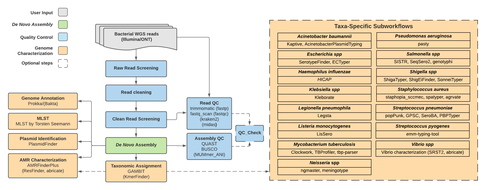

# TheiaProk Workflow Series

## Quick Facts

| **Workflow Type** | **Applicable Kingdom** | **Last Known Changes** | **Command-line compatibliity** | **Workflow type** |
|---|---|---|---|---|
| [Genomic Characterization](../../workflows_overview/workflows-type.md/#genomic-characterization) | [Bacteria](../../workflows_overview/workflows-kingdom.md/#bacteria) | PHB v2.2.0 | Yes, some optional features incompatible | Sample-level |

## TheiaProk Workflows

**The TheiaProk workflows are for the assembly, quality assessment, and characterization of bacterial genomes.** There are currently four TheiaProk workflows designed to accommodate different kinds of input data:

1. Illumina paired-end sequencing **(TheiaProk_Illumina_PE**)
2. Illumina single-end sequencing (**TheiaProk_Illumina_SE)**
3. ONT sequencing (**TheiaProk_ONT**)
4. Genome assemblies (**TheiaProk_FASTA**)

!!! caption "TheiaProk Workflow Diagram"
    

All input reads are processed through "[core tasks](#core-tasks-performed-for-all-taxa)" in the TheiaProk Illumina and ONT workflows. These undertake read trimming and assembly appropriate to the input data type. TheiaProk workflows subsequently launch default genome characterization modules for quality assessment, species identification, antimicrobial resistance gene detection, sequence typing, and more. **For some taxa identified, "taxa-specific sub-workflows" will be automatically activated, undertaking additional taxa-specific characterization steps.** When setting up each workflow, users may choose to use "optional tasks" as additions or alternatives to tasks run in the workflow by default.

### Inputs

[All Inputs for TheiaProk](https://www.notion.so/6774171637c7479499e7f0e7dcdac97d?pvs=21)

!!! dna ""
    ??? toggle "TheiaProk_Illumina_PE Input Read Data"

        The TheiaProk_Illumina_PE workflow takes in Illumina paired-end read data. Read file names should end with `.fastq` or `.fq`, with the optional addition of `.gz`. When possible, Theiagen recommends zipping files with [gzip](https://www.gnu.org/software/gzip/) before Terra uploads to minimize data upload time.

        By default, the workflow anticipates **2 x 150bp** reads (i.e. the input reads were generated using a 300-cycle sequencing kit). Modifications to the optional parameter for `trim_minlen` may be required to accommodate shorter read data, such as the 2 x 75bp reads generated using a 150-cycle sequencing kit.

    ??? toggle "TheiaProk_Illumina_SE Input Read Data"

        TheiaProk_Illumina_SE takes in Illumina single-end reads. Read file names should end with `.fastq` or `.fq`, with the optional addition of `.gz`. Theiagen highly recommends zipping files with [gzip](https://www.gnu.org/software/gzip/) before uploading to Terra to minimize data upload time & save on storage costs.

        By default, the workflow anticipates **1 x 35 bp** reads  (i.e. the input reads were generated using a 70-cycle sequencing kit). Modifications to the optional parameter for `trim_minlen` may be required to accommodate longer read data.

    ??? toggle "TheiaProk_ONT Input Read Data"

        The TheiaProk_ONT workflow takes in base-called ONT read data. Read file names should end with `.fastq` or `.fq`, with the optional addition of `.gz`. When possible, Theiagen recommends zipping files with [gzip](https://www.gnu.org/software/gzip/) before uploading to Terra to minimize data upload time.

        **The ONT sequencing kit and base-calling approach can produce substantial variability in the amount and quality of read data. Genome assemblies produced by the TheiaProk_ONT workflow must be quality assessed before reporting results.**

    ??? toggle "TheiaProk_FASTA Input Assembly Data"

        The TheiaProk_FASTA workflow takes in assembly files in FASTA format.

!!! tip "Skip Characterization"
    Ever wanted to skip characterization? Now you can! Set the optional input `perform_characterization` to **`false`** to only generate an assembly and run assembly QC.

### Core Tasks (performed for all taxa)

??? task "`versioning`: Version Capture for TheiaProk"

    The `versioning` task captures the workflow version from the GitHub (code repository) version.
        
    !!! techdetails "Version Capture Technical details"
        
        |  | Links |
        | --- | --- |
        | Task | [task_versioning.wdl](https://github.com/theiagen/public_health_bacterial_genomics/blob/main/tasks/task_versioning.wdl) |

??? toggle "`screen`: Total Raw Read Quantification and Genome Size Estimation"

    The [`screen`](https://github.com/theiagen/public_health_bacterial_genomics/blob/main/tasks/quality_control/task_screen.wdl) task ensures the quantity of sequence data is sufficient to undertake genomic analysis. It uses bash commands for quantification of reads and base pairs, and [mash](https://mash.readthedocs.io/en/latest/index.html) sketching to estimate the genome size and its coverage. At each step, the results are assessed relative to pass/fail criteria and thresholds that may be defined by optional user inputs. Samples that do not meet these criteria will not be processed further by the workflow:

    1. Total number of reads: A sample will fail the read screening task if its total number of reads is less than or equal to `min_reads`.
    2. The proportion of basepairs reads in the forward and reverse read files: A sample will fail the read screening if fewer than `min_proportion` basepairs are in either the reads1 or read2 files.
    3. Number of basepairs: A sample will fail the read screening if there are fewer than `min_basepairs` basepairs
    4. Estimated genome size:  A sample will fail the read screening if the estimated genome size is smaller than `min_genome_size` or bigger than `max_genome_size`.
    5. Estimated genome coverage: A sample will fail the read screening if the estimated genome coverage is less than the `min_coverage`.

    Read screening is undertaken on both the raw and cleaned reads. The task may be skipped by setting the `skip_screen` variable to true.

    Default values vary between the PE and SE workflow. The rationale for these default values can be found below. If two default values are shown, the first is for Illumina workflows and the second is for ONT.

    | Variable  | Default Value | Rationale |
    | --- | --- | --- |
    | `skip_screen` | false | Set to false to avoid waste of compute resources processing insufficient data |
    | `min_reads` | 7472 or 5000 | Calculated from the minimum number of base pairs required for 20x coverage of Nasuia deltocephalinicola genome, the smallest known bacterial genome as of 2019-08-07 (112,091 bp), divided by 300 (the longest Illumina read length) or 5000 (estimate of ONT read length) |
    | `min_basepairs` | 2241820 | Should be greater than 20x coverage of Nasuia deltocephalinicola, the smallest known bacterial genome (112,091 bp) |
    | `min_genome_length` | 100000 | Based on the Nasuia deltocephalinicola genome - the smallest known bacterial genome (112,091 bp) |
    | `max_genome_length` | 18040666 | Based on the Minicystis rosea genome, the biggest known bacterial genome (16,040,666 bp), plus an additional 2 Mbp to cater for potential extra genomic material |
    | `min_coverage` | 10 or 5 | A bare-minimum average per base coverage across the genome required for genome characterization. Note, a higher per base coverage coverage would be required for high-quality phylogenetics. |
    | `min_proportion` | 40 | Neither read1 nor read2 files should have less than 40% of the total number of reads. For paired-end data only |
    
    !!! techdetails "Screen Technical Details"    
        There is a single WDL task for read screening that contains two separate sub-tasks, one used for PE data and the other for SE data. The `screen` task is run twice, once for raw reads and once for clean reads.
        
        |  | TheiaProk_Illumina_PE | TheiaProk_Illumina_SE and TheiaProk_ONT |
        | --- | --- | --- |
        | Task | [task_screen.wdl](https://github.com/theiagen/public_health_bacterial_genomics/blob/main/tasks/quality_control/task_screen.wdl#L3) (PE sub-task) | [task_screen.wdl](https://github.com/theiagen/public_health_bacterial_genomics/blob/main/tasks/quality_control/task_screen.wdl#L147) (SE sub-task) |

#### Illumina Data Core Tasks

??? task "`read_QC_trim`: Read Quality Trimming, Adapter Removal, Quantification, and Identification"

    `read_QC_trim` is a sub-workflow within TheiaMeta that removes low-quality reads, low-quality regions of reads, and sequencing adapters to improve data quality. It uses a number of tasks, described below.

    **Read quality trimming**

    Either `trimmomatic` or `fastp` can be used for read-quality trimming. Trimmomatic is used by default. Both tools trim low-quality regions of reads with a sliding window (with a window size of `trim_window_size`), cutting once the average quality within the window falls below `trim_quality_trim_score`. They will both discard the read if it is trimmed below `trim_minlen`. 

    If fastp is selected for analysis, fastp also implements the additional read-trimming steps indicated below:

    | **Parameter** | **Explanation** |
    | --- | --- |
    | -g | enables polyG tail trimming |
    | -5 20 | enables read end-trimming |
    | -3 20 | enables read end-trimming |
    | --detect_adapter_for_pe | enables adapter-trimming **only for paired-end reads** |

    **Adapter removal**

    The `BBDuk` task removes adapters from sequence reads. To do this:

    - [Repair](https://jgi.doe.gov/data-and-tools/software-tools/bbtools/bb-tools-user-guide/repair-guide/) from the [BBTools](https://jgi.doe.gov/data-and-tools/software-tools/bbtools/) package reorders reads in paired fastq files to ensure the forward and reverse reads of a pair are in the same position in the two fastq files.
    - [BBDuk](https://jgi.doe.gov/data-and-tools/software-tools/bbtools/bb-tools-user-guide/bbduk-guide/)  (*"Bestus Bioinformaticus" Decontamination Using Kmers*) is then used to trim the adapters and filter out all reads that have a 31-mer match to [PhiX](https://emea.illumina.com/products/by-type/sequencing-kits/cluster-gen-sequencing-reagents/phix-control-v3.html), which is commonly added to Illumina sequencing runs to monitor and/or improve overall run quality.
    
    ??? toggle "What are adapters and why do they need to be removed?"
        Adapters are manufactured oligonucleotide sequences attached to DNA fragments during the library preparation process. In Illumina sequencing, these adapter sequences are required for attaching reads to flow cells. You can read more about Illumina adapters [here](https://emea.support.illumina.com/bulletins/2020/06/illumina-adapter-portfolio.html). For genome analysis, it’s important to remove these sequences since they’re not actually from your sample. If you don’t remove them, the downstream analysis may be affected.
        
    **Read Quantification**

    There are two methods for read quantification to choose from: [`fastq-scan`](https://github.com/rpetit3/fastq-scan) (default) or [`fastqc`](https://www.bioinformatics.babraham.ac.uk/projects/fastqc/). Both quantify the forward and reverse reads in FASTQ files. In TheiaProk_Illumina_PE, they also provide the total number of read pairs. This task is run once with raw reads as input and once with clean reads as input. If QC has been performed correctly, you should expect **fewer** clean reads than raw reads. `fastqc` also provides a graphical visualization of the read quality.

    **Read Identification (optional)**

    The `MIDAS` task is for the identification of reads to detect contamination with non-target taxa. This task is optional and turned off by default. It can be used by setting the `call_midas` input variable to `true`.

    The MIDAS tool was originally designed for metagenomic sequencing data but has been co-opted for use with bacterial isolate WGS methods. It can be used to detect contamination present in raw sequencing data by estimating bacterial species abundance in bacterial isolate WGS data. If a secondary genus is detected above a relative frequency of 0.01 (1%), then the sample should fail QC and be investigated further for potential contamination.

    This task is similar to those used in commercial software, BioNumerics, for estimating secondary species abundance.

    ??? toggle "How are the MIDAS output columns determined?"
        
        Example MIDAS report in the ****`midas_report` column:
        
        | species_id | count_reads | coverage | relative_abundance |
        | --- | --- | --- | --- |
        | Salmonella_enterica_58156 | 3309 | 89.88006645 | 0.855888033 |
        | Salmonella_enterica_58266 | 501 | 11.60606061 | 0.110519371 |
        | Salmonella_enterica_53987 | 99 | 2.232896237 | 0.021262881 |
        | Citrobacter_youngae_61659 | 46 | 0.995216227 | 0.009477003 |
        | Escherichia_coli_58110 | 5 | 0.123668877 | 0.001177644 |
        
        MIDAS report column descriptions:
        
        - species_id: species identifier
        - count_reads: number of reads mapped to marker genes
        - coverage: estimated genome-coverage (i.e. read-depth) of species in metagenome
        - relative_abundance: estimated relative abundance of species in metagenome
        
        The value in the `midas_primary_genus` column is derived by ordering the rows in order of "relative_abundance" and identifying the genus of top species in the "species_id" column (Salmonella). The value in the `midas_secondary_genus` column is derived from the genus of the second-most prevalent genus in the "species_id" column (Citrobacter). The `midas_secondary_genus_abundance` column is the "relative_abundance" of the second-most prevalent genus (0.009477003). The `midas_secondary_genus_coverage` is the "coverage" of the second-most prevalent genus (0.995216227).
        
    Alternatively to `MIDAS`, the `Kraken2` task can also be turned on through setting the `call_kraken` input variable as `true` for the identification of reads to detect contamination with non-target taxa.

    Kraken2 is a bioinformatics tool originally designed for metagenomic applications. It has additionally proven valuable for validating taxonomic assignments and checking contamination of single-species (e.g. bacterial isolate) whole genome sequence data. A database must be provided if this optional module is activated, through the kraken_db optional input. A list of suggested databases can be found on [Kraken2 standalone documentation](../standalone/kraken2.md).

    !!! techdetails "read_QC_trim Technical Details"
                
        | | Links |
        | --- | --- |
        | Sub-workflow | [wf_read_QC_trim.wdl](https://github.com/theiagen/public_health_bacterial_genomics/blob/main/workflows/wf_read_QC_trim.wdl) |
        | Tasks | [task_fastp.wdl](https://github.com/theiagen/public_health_bacterial_genomics/blob/main/tasks/quality_control/task_fastp.wdl) [task_trimmomatic.wdl](https://github.com/theiagen/public_health_bacterial_genomics/blob/main/tasks/quality_control/task_trimmomatic.wdl#L3) (PE subtask) [task_bbduk.wdl](https://github.com/theiagen/public_health_bacterial_genomics/blob/main/tasks/quality_control/task_bbduk.wdl) [task_fastq_scan.wdl](https://github.com/theiagen/public_health_bacterial_genomics/blob/main/tasks/quality_control/task_fastq_scan.wdl#L3) (PE subtask) [task_midas.wdl](https://github.com/theiagen/public_health_bacterial_genomics/blob/main/tasks/taxon_id/task_midas.wdl) [task_kraken2.wdl](https://github.com/theiagen/public_health_bacterial_genomics/blob/main/tasks/taxon_id/task_kraken2.wdl) |
        | Software source code | [fastp](https://github.com/OpenGene/fastp); [Trimmomatic](https://github.com/usadellab/Trimmomatic); [fastq-scan](https://github.com/rpetit3/fastq-scan); [MIDAS](https://github.com/snayfach/MIDAS); [Kraken2](https://github.com/DerrickWood/kraken2)|
        | Software documentation | [fastp](https://github.com/OpenGene/fastp); [Trimmomatic](http://www.usadellab.org/cms/?page=trimmomatic); [BBDuk](https://jgi.doe.gov/data-and-tools/software-tools/bbtools/bb-tools-user-guide/bbduk-guide/); [fastq-scan](https://github.com/rpetit3/fastq-scan); [MIDAS](https://github.com/snayfach/MIDAS); [Kraken2](https://github.com/DerrickWood/kraken2/wiki) |
        | Original publications | *[Trimmomatic: a flexible trimmer for Illumina sequence data](https://www.ncbi.nlm.nih.gov/pmc/articles/PMC4103590/) *[fastp: an ultra-fast all-in-one FASTQ preprocessor](https://academic.oup.com/bioinformatics/article/34/17/i884/5093234?login=false) *[An integrated metagenomics pipeline for strain profiling reveals novel patterns of bacterial transmission and biogeography](https://pubmed.ncbi.nlm.nih.gov/27803195/) *[Improved metagenomic analysis with Kraken 2](https://genomebiology.biomedcentral.com/articles/10.1186/s13059-019-1891-0) |

??? task "`CG-Pipeline`: Assessment of Read Quality, and Estimation of Genome Coverage"

    The`cg_pipeline` task generates metrics about read quality and estimates the coverage of the genome using the "run_assembly_readMetrics.pl" script from [CG-Pipeline](https://github.com/lskatz/CG-Pipeline/). The genome coverage estimates are calculated using both using raw and cleaned reads, using either a user-provided `genome_size` or the estimated genome length generated by QUAST.

    !!! techdetails "CG-Pipeline Technical Details"
        The `cg_pipeline` task is run twice in TheiaProk, once with raw reads, and once with clean reads.
        
        |  | Links |
        | --- | --- |
        | Task | [task_cg_pipeline.wdl](https://github.com/theiagen/public_health_bioinformatics/blob/main/tasks/quality_control/task_cg_pipeline.wdl) |
        | Software source code | [CG-Pipeline on GitHub](https://github.com/lskatz/CG-Pipeline/) |
        | Software documentation | [CG-Pipeline on GitHub](https://github.com/lskatz/CG-Pipeline/) |
        | Original publication | [A computational genomics pipeline for prokaryotic sequencing projects](https://academic.oup.com/bioinformatics/article/26/15/1819/188418) |
??? task "`shovill`: _De novo_ Assembly"

    De Novo assembly will be undertaken only for samples that have sufficient read quantity and quality, as determined by the `screen` task assessment of clean reads. 

    In TheiaEuk, assembly is performed using the [Shovill](https://github.com/tseemann/shovill) pipeline. This undertakes the assembly with one of four assemblers ([SKESA](https://github.com/ncbi/SKESA) (default), [SPAdes](https://github.com/ablab/spades), [Velvet](https://github.com/dzerbino/velvet/), [Megahit](https://github.com/voutcn/megahit)), but also performs [a number of pre- and post-processing steps](https://github.com/tseemann/shovill#main-steps) to improve the resulting genome assembly. Shovill uses an estimated genome size (see [here](https://github.com/tseemann/shovill#--gsize)). If this is not provided by the user as an optional input, Shovill will estimate the genome size using [mash](https://mash.readthedocs.io/en/latest/index.html). Adaptor trimming can be undertaken with Shovill by setting the `trim` option to "true", but this is set to "false" by default as [alternative adapter trimming](https://www.notion.so/TheiaProk-Workflow-Series-89b9c08406094ec78d08a578fe861626?pvs=21) is undertaken in the TheiaEuk workflow.

    ??? toggle "What is _de novo_  assembly?"
        _De novo_  assembly is the process or product of attempting to reconstruct a genome from scratch (without prior knowledge of the genome) using sequence reads. Assembly of fungal genomes from short-reads will produce multiple contigs per chromosome rather than a single contiguous sequence for each chromosome.
        
    !!! techdetails "Shovill Technical Details"
        |  | Links |
        | --- | --- |
        | TheiaProk WDL Task | [task_shovill.wdl](https://github.com/theiagen/public_health_bacterial_genomics/blob/main/tasks/assembly/task_shovill.wdl#L3) |
        | Software code repository and documentation | [Shovill on GitHub](https://github.com/tseemann/shovill) |

#### ONT Data Core Tasks

??? toggle "`read_QC_trim_ont`: Read Quality Trimming, Quantification, and Identification"

    `read_QC_trim_ont` is a sub-workflow within TheiaProk_ONT that filters low-quality reads and trims low-quality regions of reads. It uses several tasks, described below.

    **Estimated genome length**:

    By default, an estimated genome length is set to 5 Mb, which is around 0.7 Mb higher than the average bacterial genome length, according to the information collated [here](https://github.com/CDCgov/phoenix/blob/717d19c19338373fc0f89eba30757fe5cfb3e18a/assets/databases/NCBI_Assembly_stats_20240124.txt). This estimate can be overwritten by the user, and is used by `RASUSA` and `dragonflye`.

    **Plotting and quantifying long-read sequencing data:** `nanoplot`

    Nanoplot is used for the determination of mean quality scores, read lengths, and number of reads. This task is run once with raw reads as input and once with clean reads as input. If QC has been performed correctly, you should expect **fewer** clean reads than raw reads.

    **Read subsampling:** Samples are automatically randomly subsampled to 150X coverage using `RASUSA`.

    **Plasmid prediction:** `tiptoft`  is used to predict plasmid sequences directly from uncorrected long-read data. Plasmids are identified using replicon sequences used for typing from [PlasmidFinder](https://cge.food.dtu.dk/services/PlasmidFinder/).

    **Read filtering:** Reads are filtered by length and quality using ****`nanoq`. By default, sequences with less than 500 basepairs and quality score lower than 10 are filtered out to improve assembly accuracy.

    !!! techdetails "read_QC_trim_ont Technical Details"
        
        TheiaProk_ONT calls a sub-workflow listed below, which then calls the individual tasks:
        
        | Workflow | **TheiaProk_ONT** |
        | --- | --- |
        | Sub-workflow | [wf_read_QC_trim_ont.wdl](https://github.com/theiagen/public_health_bioinformatics/blob/main/workflows/utilities/wf_read_QC_trim_ont.wdl) |
        | Tasks | [task_nanoplot.wdl](https://github.com/theiagen/public_health_bioinformatics/blob/main/tasks/quality_control/task_nanoplot.wdl) [task_fastq_scan.wdl](https://github.com/theiagen/public_health_bacterial_genomics/blob/b481ce48f3d527ab8f31e4ad8171769212cc091a/tasks/quality_control/task_fastq_scan.wdl#L3) [task_rasusa.wdl](https://github.com/theiagen/public_health_bioinformatics/blob/main/tasks/utilities/task_rasusa.wdl) [task_nanoq.wdl](https://github.com/theiagen/public_health_bioinformatics/blob/main/tasks/quality_control/task_nanoq.wdl) [task_tiptoft.wdl](https://github.com/theiagen/public_health_bioinformatics/blob/main/tasks/gene_typing/task_tiptoft.wdl) |
        | Software source code | [fastq-scan](https://github.com/rpetit3/fastq-scan), [NanoPlot](https://github.com/wdecoster/NanoPlot), [RASUSA](https://github.com/mbhall88/rasusa), [tiptoft](https://github.com/andrewjpage/tiptoft), [nanoq](https://github.com/esteinig/nanoq) |
        | Original publications | [NanoPlot paper](https://academic.oup.com/bioinformatics/article/39/5/btad311/7160911) [RASUSA paper](https://doi.org/10.21105/joss.03941) [Nanoq Paper](https://doi.org/10.21105/joss.02991) [Tiptoft paper](https://doi.org/10.21105/joss.01021) |

??? task "`dragonflye`: _De novo_ Assembly"
    !!! techdetails "dragonflye Technical Details"
        |  | Links |
        | --- | --- |
        | Task | [task_dragonflye.wdl](https://github.com/theiagen/public_health_bacterial_genomics/blob/main/tasks/assembly/task_dragonflye.wdl) |
    | Software source code and documentation | [dragonflye on GitHub](https://github.com/rpetit3/dragonflye) |

#### Post-Assembly Tasks (performed for all taxa)

??? task  "`quast`: Assembly Quality Assessment"

    QUAST stands for QUality ASsessment Tool. It evaluates genome/metagenome assemblies by computing various metrics without a reference being necessary. It includes useful metrics such as number of contigs, length of the largest contig and N50. 

    !!! techdetails "QUAST Technical Details"
        
        |  | Links |
        | --- | --- |
        | Task | [task_quast.wdl](https://github.com/theiagen/public_health_bioinformatics/blob/main/tasks/quality_control/task_quast.wdl) |
        | Software source code | [QUAST on GitHub](https://github.com/ablab/quast) |
        | Software documentation | <https://cab.spbu.ru/software/quast/> |
        | Original publication | [QUAST: quality assessment tool for genome assemblies](https://academic.oup.com/bioinformatics/article/29/8/1072/228832) |

??? task "`BUSCO`: Assembly Quality Assessment"

    BUSCO(**B**enchmarking **U**niversal **S**ingle-**C**opy **O**rthologue) attempts to quantify the completeness and contamination of an assembly to generate quality assessment metrics. It uses taxa-specific databases containing genes that are all expected to occur in the given taxa, each in a single copy. BUSCO examines the presence or absence of these genes, whether they are fragmented, and whether they are duplicated (suggestive that additional copies came from contaminants).

    **BUSCO notation** 
    
    Here is an example of BUSCO notation: `C:99.1%[S:98.9%,D:0.2%],F:0.0%,M:0.9%,n:440`. There are several abbreviations used in this output:
    
    - Complete (C) - genes are considered "complete" when their lengths are within two standard deviations of the BUSCO group mean length.
    - Single-copy (S) - genes that are complete and have only one copy.
    - Duplicated (D) - genes that are complete and have more than one copy.
    - Fragmented (F) - genes that are only partially recovered.
    - Missing (M) - genes that were not recovered at all.
    - Number of genes examined (n) - the number of genes examined.
    
    A high equity assembly will use the appropriate database for the taxa, have high complete (C) and single-copy (S) percentages, and low duplicated (D), fragmented (F) and missing (M) percentages. 
  
    !!! techdetails "BUSCO Technical Details"
        
        |  | Links |
        | --- | --- |
        | Task | [task_busco.wdl](https://github.com/theiagen/public_health_bioinformatics/blob/main/tasks/quality_control/advanced_metrics/task_busco.wdl) |
        | Software source code | [BUSCO on GitLab](https://gitlab.com/ezlab/busco) |
        | Software documentation | https://busco.ezlab.org/ |
        | Orginal publication | [BUSCO: assessing genome assembly and annotation completeness with single-copy orthologs](https://academic.oup.com/bioinformatics/article/31/19/3210/211866) |

??? task "`MUMmer_ANI`: Average Nucleotide Identity (optional)"

    Average Nucleotide Identity (ANI) is a useful approach for taxonomic identification. The higher the percentage ANI of a query sequence to a given reference genome, the more likely the sequence is the same taxa as the reference. 

    ANI is calculated in TheiaProk using [a perl script written by Lee Katz](https://github.com/lskatz/ani-m) ([ani-m.pl](http://ani-m.pl)). This uses [MUMmer](http://mummer.sourceforge.net/) to rapidly align entire query assemblies to one or more reference genomes. By default, TheiaProk uses a set of 43 reference genomes in [RGDv2](https://github.com/StaPH-B/docker-builds/blob/master/fastani/1.34-RGDV2/RGDv2-metadata.tsv), a database containing genomes of enteric pathogens commonly sequenced by CDC EDLB & PulseNet participating laboratories. The user may also provide their own reference genome. After genome alignment with MUMmer, ani-m.pl calculates the average nucleotide identity and percent bases aligned between 2 genomes (query and reference genomes)

    The default database of reference genomes used is called "Reference Genome Database version 2" AKA "RGDv2". This database is composed of 43 enteric bacteria representing 32 species and is intended for identification of enteric pathogens and common contaminants. It contains six Campylobacter spp., three Escherichia/Shigella spp., one *Grimontia hollisae*, six *Listeria spp.*, one *Photobacterium damselae*, two *Salmonella spp.*, and thirteen *Vibrio spp.* 

    2 Thresholds are utilized to prevent false positive hits. The `ani_top_species_match` will only report a genus & species match if both thresholds are surpassed. Both of these thresholds are set to match those used in BioNumerics for PulseNet organisms.

    1. `ani_threshold` default value of 80.0
    2. `percent_bases_aligned_threshold` default value of 70.0

    For more information on RGDv2 database of reference genomes, please see [the publication here.](https://www.frontiersin.org/articles/10.3389/fmicb.2023.1225207/full)

    !!! techdetails "MUMmer_ANI Technical Details"
        
        |  | Links |
        | --- | --- |
        | Task | [task_mummer_ani.wdl](https://github.com/theiagen/public_health_bacterial_genomics/blob/main/tasks/quality_control/task_mummer_ani.wdl) |
        | Software source code | [ani-m](https://github.com/lskatz/ani-m), [MUMmer](https://github.com/mummer4/mummer) |
        | Software documentation | [ani-m](https://github.com/lskatz/ani-m), [MUMmer](https://mummer.sourceforge.net/) |
        | Original publication | [MUMmer4: A fast and versatile genome alignment system](https://journals.plos.org/ploscompbiol/article?id=10.1371/journal.pcbi.1005944) |
        | Publication about RGDv2 database | https://www.frontiersin.org/articles/10.3389/fmicb.2023.1225207/full |

??? task "`GAMBIT`: **Taxon Assignment**"

    [`GAMBIT`](https://github.com/jlumpe/gambit) determines the taxon of the genome assembly using a k-mer based approach to match the assembly sequence to the closest complete genome in a database, thereby predicting its identity. Sometimes, GAMBIT can confidently designate the organism to the species level. Other times, it is more conservative and assigns it to a higher taxonomic rank.

    For additional details regarding the GAMBIT tool and a list of available GAMBIT databases for analysis, please consult the [GAMBIT](https://www.notion.so/GAMBIT-7c1376b861d0486abfbc316480046bdc?pvs=21) tool documentation.

    !!! techdetails "GAMBIT Technical Details"

        |  | Links |
        | --- | --- |
        | Task | [task_gambit.wdl](https://github.com/theiagen/public_health_bacterial_genomics/blob/main/tasks/taxon_id/task_gambit.wdl) |
        | Software source code | [GAMBIT on GitHub](https://github.com/jlumpe/gambit) |
        | Software documentation | [GAMBIT ReadTheDocs](https://gambit-genomics.readthedocs.io/en/latest/) |
        | Original publication | [GAMBIT (Genomic Approximation Method for Bacterial Identification and Tracking): A methodology to rapidly leverage whole genome sequencing of bacterial isolates for clinical identification](https://journals.plos.org/plosone/article?id=10.1371/journal.pone.0277575) |

??? task "`KmerFinder`: Taxon Assignment (optional)"

    The `KmerFinder` method predicts prokaryotic species based on the number of overlapping (co-occurring) *k*-mers, i.e., 16-mers, between the query genome and genomes in a reference database.

    !!! techdetails "KmerFinder Technical Details"        
        
        |  | Links |
        | --- | --- |
        | Task | [task_kmerfinder.wdl](https://github.com/theiagen/public_health_bioinformatics/blob/main/tasks/taxon_id/task_kmerfinder.wdl) |
        | Software source code | https://bitbucket.org/genomicepidemiology/kmerfinder |
        | Software documentation | https://cge.food.dtu.dk/services/KmerFinder/instructions.php |
        | Original paper | [**Benchmarking of Methods for Genomic Taxonomy**](https://journals.asm.org/doi/full/10.1128/jcm.02981-13?rfr_dat=cr_pub++0pubmed&url_ver=Z39.88-2003&rfr_id=ori%3Arid%3Acrossref.org) |

??? task "`AMRFinderPlus`: AMR Genotyping (default)"

    NCBI’s [AMRFinderPlus](https://github.com/ncbi/amr/wiki) is the default antimicrobial resistance (AMR) detection tool used in TheiaProk. [ResFinder](https://www.notion.so/TheiaProk-Workflow-Series-68c34aca2a0240ef94fef0acd33651b9?pvs=21) may be used alternatively and if so, AMRFinderPlus is not run. 

    AMRFinderPlus identifies acquired antimicrobial resistance (AMR) genes, virulence genes, and stress genes.  Such AMR genes confer resistance to antibiotics, metals, biocides, heat, or acid. For some taxa (see [here](https://github.com/ncbi/amr/wiki/Running-AMRFinderPlus#--organism-option)), AMRFinderPlus will provide taxa-specific results including filtering out genes that are almost ubiquitous in the taxa (intrinsic genes) and identifying resistance-associated point mutations.  In TheiaProk, the taxon used by AMRFinderPlus is specified based on the `gambit_predicted_taxon` or a user-provided `expected_taxon`.

    You can check if a gene or point mutation is in the AMRFinderPlus database [here](https://www.ncbi.nlm.nih.gov/pathogens/refgene/#), find the sequences of reference genes [here](https://www.ncbi.nlm.nih.gov/bioproject/PRJNA313047), and search the query Hidden Markov Models (HMMs) used by AMRFinderPlus to identify AMR genes and some stress and virulence proteins ([here](https://www.ncbi.nlm.nih.gov/pathogens/hmm/)). The AMRFinderPlus database is updated frequently. You can ensure you are using the most up-to-date version by specifying the docker image as a workflow input. You might like to save this docker image as a workspace data element to make this easier.

    !!! techdetails "AMRFinderPlus Technical Details"
        
        |  | Links |
        | --- | --- |
        | Task | [task_amrfinderplus.wdl](https://github.com/theiagen/public_health_bacterial_genomics/blob/main/tasks/gene_typing/task_amrfinderplus.wdl) |
        | Software source code | [amr on GitHub](https://github.com/ncbi/amr) |
        | Software documentation | https://github.com/ncbi/amr/wiki |
        | Original publication | [AMRFinderPlus and the Reference Gene Catalog facilitate examination of the genomic links among antimicrobial resistance, stress response, and virulence](https://www.ncbi.nlm.nih.gov/pmc/articles/PMC8208984/) |

??? task "`ResFinder`: AMR Genotyping & Shigella XDR phenotype prediction (alternative)"

    The `ResFinder` task is an alternative to using AMRFinderPlus for detection and identification of AMR genes and resistance-associated mutations.

    This task runs the Centre for Genomic Epidemiology (CGE) ResFinder tool to identify acquired antimicrobial resistance. It can also run the CGE PointFinder tool if the `call_pointfinder` variable is set with to `true`. The databases underlying the task are different to those used by AMRFinderPlus.

    The default thresholds for calling AMR genes are 90% identity and 50% coverage of the reference genes (expressed as a fraction in workflow inputs: 0.9 & 0.5). These are the same thresholds utilized in BioNumerics for calling AMR genes.

    Organisms currently support by PointFinder for mutational-based predicted resistance:

    - Campylobacter coli & C. jejuni
    - Enterococcus faecalis
    - Enterococcus faecium
    - Escherichia coli & Shigella spp.
    - Helicobacter pylori
    - Neisseria gonorrhoeae
    - Klebsiella
    - Mycobacterium tuberculosis
    - Salmonella spp.
    - Staphylococcus aureus

    **XDR Shigella prediction**

    The `ResFinder` Task also has the ability to predict whether or not a sample meets the CDC’s definition for extensively drug-resistant (XDR) Shigella. 

    > *CDC defines XDR Shigella bacteria as strains that are resistant to all commonly recommended empiric and alternative antibiotics — azithromycin, ciprofloxacin, ceftriaxone, trimethoprim-sulfamethoxazole (TMP-SMX), and ampicillin. [Link to CDC HAN](https://emergency.cdc.gov/han/2023/han00486.asp) where this definition is found.*
    
    A sample is required to meet **all 7 criteria** in order to be predicted as `XDR Shigella` 

    1. The GAMBIT task in the workflow must identify the sample as `Shigella` OR the user must input the word `Shigella` somewhere within the input String variable called `expected_taxon`. This requirement serves as the identification of a sample to be of the Shigella genus.
    2. Resfinder or PointFinder predicted resistance to **Ampicillin**
    3. Resfinder or PointFinder predicted resistance to **Azithromycin**
    4. Resfinder or PointFinder predicted resistance to **Ciprofloxacin**
    5. Resfinder or PointFinder predicted resistance to **Ceftriazone**
    6. Resfinder or PointFinder predicted resistance to **Trimethoprim**
    7. Resfinder or PointFinder predicted resistance to **Sulfamethoxazole**

    There are 3 potential outputs for the **`resfinder_predicted_xdr_shigella`** output string**:**

    - **`Not Shigella based on gambit_predicted_taxon or user input`**
    - **`Not XDR Shigella`** for samples identified as Shigella by GAMBIT or user input BUT does ResFinder did not predict resistance to **all 6 drugs in XDR definition**
    - **`XDR Shigella`** meaning the sample was identified as Shigella and ResFinder/PointFinder did predict resistance to ceftriazone, azithromycin, ciprofloxacin, trimethoprim, sulfamethoxazole, and ampicillin.
    
    !!! techdetails "ResFinder Technical Details"
        
        |  | Links |
        | --- | --- |
        | Task | [task_resfinder.wdl](https://github.com/theiagen/public_health_bacterial_genomics/blob/eld-docs-dev/tasks/gene_typing/task_resfinder.wdl) |
        | Software source code | https://bitbucket.org/genomicepidemiology/resfinder/src/master/ |
        | Software documentation | https://bitbucket.org/genomicepidemiology/resfinder/src/master/ |
        | ResFinder database | https://bitbucket.org/genomicepidemiology/resfinder_db/src/master/ |
        | PointFinder database | https://bitbucket.org/genomicepidemiology/pointfinder_db/src/master/ |
        | Web-server | https://cge.food.dtu.dk/services/ResFinder/ |
        | Original publication | [ResFinder 4.0 for predictions of phenotypes from genotypes](https://academic.oup.com/jac/article/75/12/3491/5890997) |

??? task "`TS_MLST`: MLST Profiling"

    [Multilocus sequence typing (MLST)](https://www.pnas.org/doi/10.1073/pnas.95.6.3140?url_ver=Z39.88-2003&rfr_id=ori%3Arid%3Acrossref.org&rfr_dat=cr_pub++0pubmed) is a typing method reflecting population structure. It was developed as a portable, unambiguous method for global epidemiology using PCR, but can be applied to whole-genome sequences *in silico*. MLST is commonly used for pathogen surveillance, ruling out transmission, and grouping related genomes for comparative analysis.

    MLST schemes are taxa-specific. Each scheme uses fragments of typically 7 housekeeping genes ("loci") and has a database associating an arbitrary number with each distinct allele of each locus. Each unique combination of alleles ("allelic profile") is assigned a numbered sequence type (ST). Significant diversification of genomes is captured by changes to the MLST loci via mutational events creating new alleles and STs, or recombinational events replacing the allele and changing the ST. Relationships between STs are based on the number of alleles they share. Clonal complexes share a scheme-specific number of alleles (usually for five of the seven loci).

    !!! tip "MLST Limitations"
        Some taxa have multiple MLST schemes, and some MLST schemes are insufficiently robust.

    TheiaProk uses [the MLST tool developed by Torsten Seeman](https://github.com/tseemann/mlst) to assess MLST using traditional [PubMLST](https://pubmlst.org/) typing schemes. 

    ??? toggle "Interpretation of MLST results"
        
        Each MLST results file returns the ST and allele results for one sample. If the alleles and ST are correctly assigned, only a single integer value will be present for each. If an ST cannot be assigned, multiple integers or additional characters will be shown, representing the issues with assignment as described [here](https://github.com/tseemann/mlst/tree/v2.22.0#missing-data).
        
    ??? toggle "Identifying novel alleles and STs"
        
        The MLST schemes used in TheiaProk are curated on the PubMLST website.If you identify novel alleles or allelic profiles in your data using TheiaProk’s MLST task, you can get these assigned via PubMLST:
        
        1. Check that the novel allele or ST has not already been assigned a type on PubMLST. 
            1. Download the assembly file from Terra for your sample with the novel allele or ST
            2. Go to the [PubMLST webpage for the organism of interest](https://pubmlst.org/organisms) 
            3. Navigate to the organism "Typing" page 
            4. Under "Query a sequence" choose "Single sequence" (e.g. [this](https://pubmlst.org/bigsdb?db=pubmlst_hinfluenzae_seqdef&page=sequenceQuery) is the page for *H. influenzae*), select the MLST scheme under "Please select locus/scheme", upload the assembly fasta file, and click submit.
            5. Results will be returned lower on the page.
        2. If the allele or ST has not been typed previously on the PubMLST website (step 1), new allele or ST numbers can be assigned using instructions [here](https://pubmlst.org/submit-data).
        
    ??? toggle "Taxa with multiple MLST schemes"
        
        As default, the MLST tool automatically detects the genome’s taxa to select the MLST scheme. 
        
        Some taxa have multiple MLST schemes, e.g. the *Escherichia* and Leptospira genera,  *Acinetobacter baumannii, Clostridium difficile* and *Streptococcus thermophilus.* Only one scheme will be used by default.
        
        Users may specify the scheme as an optional workflow input using the `scheme` variable of the "ts_mlst" task. Available schemes are listed [here](https://www.notion.so/TheiaProk-Workflow-Series-89b9c08406094ec78d08a578fe861626?pvs=21) and the scheme name should be provided in quotation marks ("….").
        
        If results from multiple MLST schemes are required for the same sample, TheiaProk can be run multiple times specifying non-default schemes. After the first run, output attributes for the workflow (i.e. output column names) must be amended to prevent results from being overwritten. Despite re-running the whole workflow, unmodified tasks will return cached outputs, preventing redundant computation.
        
    !!! techdetails "TS_MLST Technical Details"        
        |  | Links |
        | --- | --- |
        | Task | [task_ts_mlst.wdl](https://github.com/theiagen/public_health_bacterial_genomics/blob/main/tasks/species_typing/task_ts_mlst.wdl) |
        | Software source code | [mlst](https://github.com/tseemann/mlst) |
        | Software documentation | [mlst](https://github.com/tseemann/mlst) |

??? task "`Prokka`: Assembly Annotation (default)"

    Assembly annotation is available via `Prokka` as default, or alternatively via `Bakta`. When Prokka annotation is used, Bakta is not.

    [`Prokka`](https://github.com/tseemann/prokka) is a prokaryotic genome annotation tool used to identify and describe features of interest within the genome sequence. Prokka annotates there genome by querying databases described [here](https://github.com/tseemann/prokka#databases).

    !!! techdetails "Prokka Technical Details"
        |  | Links |
        | --- | --- |
        | Task | [task_prokka.wdl](https://github.com/theiagen/public_health_bacterial_genomics/blob/eld-docs-dev/tasks/gene_typing/task_prokka.wdl) |
        | Software source code | [prokka](https://github.com/tseemann/prokka) |
        | Software documentation | [prokka](https://github.com/tseemann/prokka) |
        | Original publication | [Prokka: rapid prokaryotic genome annotation](https://academic.oup.com/bioinformatics/article/30/14/2068/2390517?login=false) |

??? task "`Bakta`: Assembly Annotation (alternative)"

    Assembly annotation is available via Bakta as an alternative to Prokka. When Bakta annotation is used, Prokka is not.

    Bakta is intended for annotation of Bacteria and plasmids only, and is best described [here](https://github.com/oschwengers/bakta#description)!

    !!! techdetails "Bakta Technical Details"
        
        |  | Links |
        | --- | --- |
        | Task | [task_bakta.wdl](https://github.com/theiagen/public_health_bacterial_genomics/blob/main/tasks/gene_typing/task_bakta.wdl) |
        | Software source code | [bakta](https://github.com/oschwengers/bakta) |
        | Software documentation | <https://github.com/oschwengers/bakta> |
        | Original publication | [Bakta: rapid and standardized annotation of bacterial genomes via alignment-free sequence identification](https://www.microbiologyresearch.org/content/journal/mgen/10.1099/mgen.0.000685) |

??? task "`PlasmidFinder`: Plasmid Identification"

    [`PlasmidFinder`](https://github.com/kcri-tz/plasmidfinder) detects plasmids in totally- or partially-sequenced genomes, and identifies the closest plasmid type in the database for typing purposes.

    - **What are plasmids?**
        
        Plasmids are double-stranded circular or linear DNA molecules that are capable of replication independently of the chromosome and may be transferred between different species and clones. Many plasmids contain resistance or virulence genes, though some do not clearly confer an advantage to their host bacterium.
        
    - **Optional inputs**
        
        [All Inputs for TheiaProk](https://www.notion.so/79e45f2708c84638bf467a934c1e3a29?pvs=21)
        
    - **Outputs**
        
        [TheiaProk Outputs List](https://www.notion.so/9fa7684bdf874f1c8612273878c2472b?pvs=21)
        
    - **Technical details**
        
        
        |  | Links |
        | --- | --- |
        | Task | [task_plasmidfinder.wdl](https://github.com/theiagen/public_health_bacterial_genomics/blob/eld-docs-dev/tasks/gene_typing/task_plasmidfinder.wdl) |
        | Software source code | https://bitbucket.org/genomicepidemiology/plasmidfinder/src/master/ |
        | Software documentation | https://bitbucket.org/genomicepidemiology/plasmidfinder/src/master/ |
        | Original publication | [In Silico Detection and Typing of Plasmids using PlasmidFinder and Plasmid Multilocus Sequence Typing](https://www.ncbi.nlm.nih.gov/pmc/articles/PMC4068535/) |

??? task "`QC_check`: Check QC Metrics Against User-Defined Thresholds (optional)"

    The `qc_check` task compares generated QC metrics against user-defined thresholds for each metric. This task will run if the user provides a `qc_check_table` .tsv file. If all QC metrics meet the threshold, the `qc_check` output variable will read `QC_PASS`. Otherwise, the output will read `QC_NA` if the task could not proceed or `QC_ALERT` followed by a string indicating what metric failed.

    The `qc_check` task applies quality thresholds according to the sample taxa. The sample taxa is taken from the `gambit_predicted_taxon` value inferred by the GAMBIT module OR can be manually provided by the user using the `expected_taxon` workflow input.

    ### Formatting the **qc_check_table.tsv**

    | taxon | est_coverage_raw | est_coverage_clean | assembly_length_min | assembly_length_max |
    | --- | --- | --- | --- | --- |
    | Listeria_monocytogenes | 20 |  | 2800000 | 3200000 |
    | Escherichia_coli | 40 |  | 4900000 | 6000000 |
    | Shigella | 40 |  | 4200000 | 4900000 |
    | Salmonella | 30 |  | 4400000 | 5700000 |
    | Campylobacter | 20 |  | 1400000 | 2200000 |
    | Vibrio_cholerae | 40 |  | 3800000 | 4300000 |
    | Vibrio_parahaemolyticus | 40 |  | 4900000 | 5500000 |
    | Vibrio_vulnificus | 40 |  | 4700000 | 5300000 |
    - The first column of the qc_check_table lists the taxa that the task will assess and the header of this column must be "taxon".
    - Any genus or species can be included as a row of the qc_check_table. However, these taxa must **uniquely** match the sample taxa, meaning that the file can include multiple species from the same genus (Vibrio_cholerae and Vibrio_vulnificus), but not both a genus row and species within that genus (Vibrio and Vibrio cholerae). **The taxa should be formatted with the first letter capitalized and underscores in lieu of spaces.**
    - Each subsequent column indicates a QC metric and lists a threshold for each taxa that will be checked. **The column names must exactly match expected values, so we highly recommend copy and pasting from the template files below.**

    ### Template qc_check_table.tsv files

    TheiaProk_Illumina_PE_PHB: https://storage.googleapis.com/theiagen-public-files/terra/theiaprok-files/qc_check_table_theiaprok_illumina_pe_template.tsv

    TheiaProk_FASTA: https://storage.googleapis.com/theiagen-public-files/terra/theiaprok-files/qc_check_table_theiaprok_fasta_template.tsv

    **QC threshold values shown are for example purposes only and should not be presumed to be sufficient for every dataset.**

    - **Optional inputs**
        
        [Untitled Database](https://www.notion.so/77edd363654c4d79824c5d2fac159c3b?pvs=21)
        
    - **Outputs**
        
        [Untitled Database](https://www.notion.so/3650054b521647528c995dcbbb4cd207?pvs=21)
        
    - **Technical details**
        
        
        |  | Links |
        | --- | --- |
        | Task | [task_qc_check.wdl](https://github.com/theiagen/public_health_bacterial_genomics/blob/main/tasks/quality_control/task_qc_check.wdl) |

??? task "`Taxon Tables`: Copy outputs to new data tables based on taxonomic assignment (optional)"

    The `taxon_tables` module, if enabled, will copy sample data to a different data table based on the taxonomic assignment. For example, if an *E. coli* sample is analyzed, the module will copy the sample data to a new table for *E. coli* samples or add the sample data to an existing table.

    - **Optional inputs**
        
        To implement the `taxon_tables` module, provide a file indicating data table names to copy samples of each taxa to in the `taxon_tables` input variable. No other input variables are needed.
        
        **Formatting the `taxon_tables` file**
        
        The `taxon_tables`  file must be uploaded a Google storage bucket that is accessible by Terra and should be in the format below. Briefly, the bacterial genera or species should be listed in the leftmost column with the name of the data table to copy samples of that taxon to in the rightmost column.
        
        | taxon | taxon_table |
        | --- | --- |
        | Listeria_monocytogenes | lmonocytogenes_specimen |
        | Salmonella | salmonella_specimen |
        | Escherichia | ecoli_specimen |
        | Shigella | shigella_specimen |
        | Streptococcus | strep_pneumo_specimen |
        | Legionella | legionella_specimen |
        | Klebsiella | klebsiella_specimen |
        | Mycobacterium | mycobacterium_specimen |
        | Acinetobacter | acinetobacter_specimen |
        | Pseudomonas | pseudomonas_specimen |
        | Staphylococcus | staphyloccus_specimen |
        | Neisseria | neisseria_specimen |
        
        **Template taxon_tables file:**
        
        gs://theiagen-public-files/terra/theiaprok-files/phbg_validation_taxon_tables_20230327.tsv
        
        [Untitled Database](https://www.notion.so/5da63ed8fe064417b75cd0b472ab8ac0?pvs=21)
        
    - **Outputs**
        
        There are no output columns for the taxon table task. The only output of the task is that additional data tables will appear for in the Terra workspace for samples matching a taxa in the `taxon_tables` file.

??? task "`Abricate`: Mass screening of contigs for antimicrobial and virulence genes (optional)"

    The `abricate` module, if enabled, will run abricate with the database defined in `abricate_db` to perform mass screening of contigs for antimicrobial resistance or virulence genes. It comes bundled with multiple databases: NCBI, CARD, ARG-ANNOT, Resfinder, MEGARES, EcOH, PlasmidFinder, Ecoli_VF and VFDB. It only detects acquired resistance genes, **NOT** point mutations

    - **Optional inputs**
        
        [Untitled Database](https://www.notion.so/4da03ff4a6db44339a5e0f14abb0a70a?pvs=21)
        
    - **Outputs**
        
        [Untitled Database](https://www.notion.so/ed33be53418f45319a4b5fb3d713cd92?pvs=21)
        

# Taxa-specific tasks

The TheiaProk workflows automatically activate taxa-specific sub-workflows after the identification of relevant taxa using `GAMBIT`. Alternatively, the user can provide the expected taxa in the `expected_taxon` workflow input to override the taxonomic assignment made by GAMBIT. Modules are launched for all TheiaProk workflows unless otherwise indicated. 

---

## ***Acinetobacter baumannii***

A number of approaches are available in TheiaProk for *A. baumannii* characterization.

- `Kaptive`: **Capsule and lipooligosaccharide outer core typing**
    
    The cell-surface capsular polysaccharide (CPS) of *Acinetobacter baumannii* can be used as an epidemiological marker. CPS varies in its composition and structure and is a key determinant in virulence and a target for non-antibiotic therapeutics. Specificity for non-antibiotic therapeutics (e.g. phage therapy) bear particular significance given the extent of antibiotic resistance found in this [ESKAPE](https://journals.asm.org/doi/10.1128/CMR.00181-19) pathogen. 
    
    Biosynthesis and export of CPS is encoded by genes clustering at the K locus (KL). Additional genes associated with CPS biosynthesis and export are sometimes found in other chromosomal locations. The full combination of these genes is summarized as a "[K type](https://www.biorxiv.org/content/10.1101/2022.05.19.492579v1)", described as a "predicted serotype associated with the best match locus". You can read more about this [here](https://github.com/katholt/Kaptive/wiki/Databases-distributed-with-Kaptive#acinetobacter-baunannii-k-and-oc-locus-databases).
    
    Previously, s[erotyping of *A. baumannii*](https://journals.asm.org/doi/10.1128/jcm.27.12.2713-2716.1989) focused on a major immunogenic polysaccharide which was considered the O antigen for the species. This serotyping approach appears to no longer be used and the serotyping [scheme has not been updated in over 20 years](https://www.karger.com/Article/Abstract/7300). Nonetheless, the O-antigen polysaccharide is attached to lipooligosaccharide, and the outer core (OC) of this lipooligosaccharide varies. Biosynthesis of the outer core lipooligosaccharide is encoded by a cluster of genes at the outer core (OC) locus.
    
    Variation in the KL and OCL can be characterized with the **Kaptive** tool and its associated [databases](https://github.com/katholt/Kaptive/wiki/Databases-distributed-with-Kaptive#acinetobacter-baunannii-k-and-oc-locus-databases) of numbered *A. baumannii* [K](https://github.com/katholt/Kaptive/blob/master/extras/Acinetobacter_baumannii_KL_reference_information.pdf) and [OC](https://github.com/katholt/Kaptive/blob/master/extras/Acinetobacter_baumannii_OCL_reference_information.pdf) locus variants. Kaptive takes in a genome assembly file (fasta), and assigns the K and OC locus to their numbered variants, provides K type and a description of genes in the K or OC loci and elsewhere in the chromosome, alongside metrics for quality of locus match. A description of [how Kaptive works](https://github.com/katholt/Kaptive/wiki/How-does-Kaptive-work%3F), [explanations of the full output reports](https://github.com/katholt/Kaptive/wiki/How-to-run#summary-table) which are provided in the Terra data table by TheiaProk and [resources for interpreting outputs](https://github.com/katholt/Kaptive/wiki/Interpreting-the-results) are available on the [Kaptive Wiki page](https://github.com/katholt/Kaptive/wiki/How-to-run#summary-table).
    
    - **Outputs**
        
        [TheiaProk Outputs List](https://www.notion.so/e55505fa523a4225ae0d7e314ff08b98?pvs=21)
        
    - **Technical details**
        
        
        |  | Links |
        | --- | --- |
        | Task | [task_kaptive.wdl](https://github.com/theiagen/public_health_bacterial_genomics/blob/main/tasks/species_typing/task_kaptive.wdl) |
        | Software source code | ‣ |
        | Software documentation | https://github.com/katholt/Kaptive/wiki |
        | Orginal publication | * [Identification of Acinetobacter baumannii loci for capsular polysaccharide (KL) and lipooligosaccharide outer core (OCL) synthesis in genome assemblies using curated reference databases compatible with Kaptive](https://www.microbiologyresearch.org/content/journal/mgen/10.1099/mgen.0.000339)    * [An update to the database for Acinetobacter baumannii capsular polysaccharide locus typing extends the extensive and diverse repertoire of genes found at and outside the K locus](https://www.microbiologyresearch.org/content/journal/mgen/10.1099/mgen.0.000878) |
- `AcinetobacterPlasmidTyping`**: Acinetobacter plasmid detection**
    
    *Acinetobacter* plasmids are not included in the [PlasmidFinder](https://www.notion.so/TheiaProk-Workflow-Series-68c34aca2a0240ef94fef0acd33651b9?pvs=21) database. Instead, the  ‣ database contains variants of the plasmid *rep* gene for *A. baumannii* plasmid identification. When matched with >/= 95 % identity, this represents a typing scheme for *Acinetobacter baumannii* plasmids. In TheiaProk, we use the ‣ tool to query our assemblies against this database.
    
    - **Outputs**
        
        [TheiaProk Outputs List](https://www.notion.so/08bbe1a62d0e40c1bcddf8d3d6008201?pvs=21)
        
    - **Technical details**
        
        The bioinformatics software for querying sample assemblies against the AcinetobacterPlasmidTyping database is [Abricate](https://github.com/tseemann/abricate). The WDL task simply runs abricate, and the Acinetobacter Plasmid database and default setting of 95% minimum identity are set in the [merlin magic sub-workflow](https://github.com/theiagen/public_health_bacterial_genomics/blob/main/workflows/wf_merlin_magic.wdl#L44).
        
        |  | Links |
        | --- | --- |
        | Task | [task_abricate.wdl](https://github.com/theiagen/public_health_bacterial_genomics/blob/main/tasks/gene_typing/task_abricate.wdl) |
        | Database and documentation | [https://github.com/MehradHamidian/AcinetobacterPlasmidTyping](https://github.com/MehradHamidian/AcinetobacterPlasmidTyping/tree/v1.0.0) |
        | Software source code and documentation | ‣ |
        | Original publication | [Detection and Typing of Plasmids in *Acinetobacter baumannii* Using *rep* Genes Encoding Replication Initiation Proteins](https://journals.asm.org/doi/10.1128/spectrum.02478-22?url_ver=Z39.88-2003&rfr_id=ori:rid:crossref.org&rfr_dat=cr_pub%20%200pubmed) |
- **Acinetobacter MLST**
    
    Two MLST schemes are available for *Acinetobacter*. The Pasteur scheme is run by default, given [significant problems with the Oxford scheme have been described](https://www.ncbi.nlm.nih.gov/pmc/articles/PMC6510311/). Should users with to alternatively or additionally use the Oxford MLST scheme, [instructions are provided to do this](https://www.notion.so/TheiaProk-Workflow-Series-68c34aca2a0240ef94fef0acd33651b9?pvs=21). The Oxford scheme is activated in TheiaProk with the MLST `scheme` input as "abaumannii".
    
- ***bla*OXA-51-like gene **detection**
    
    The *bla*OXA-51-like genes, also known as *oxaAB*, are considered intrinsic to *Acinetobacter baumannii* ****but are not found in other *Acinetobacter* species. **Identification of a *bla*OXA-51-like gene is therefore considered to confirm the species’ identity as *A. baumannii*. 
    
    NCBI’s AMRFinderPlus, which is implemented as a core module in TheiaProk, detects the *bla*OXA-51-like genes. This may be used to confirm the species, in addition to the GAMBIT taxon identification. The *bla*OXA-51-like genes act as carbapenemases when an IS*Aba1* is found 7 bp upstream of the gene. Detection of this IS is not currently undertaken in TheiaProk.
    

## ***Escherichia* or *Shigella* spp**

The *Escherichia* and *Shigella* genera are [difficult to differentiate as they do not comply with genomic definitions of genera and species](https://www.sciencedirect.com/science/article/abs/pii/S1286457902016374). Consequently, when either *Escherichia or Shigella* are identified by GAMBIT, all tools intended for these taxa are used. 

`SerotypeFinder` and `ECTyper` are intended for analysis of *E. coli*. Both tools are used as there are occasional discrepancies between the serotypes predicted. This primarily arises due to differences in the databases used by each tool.

- **`SerotypeFinder`: Serotyping**
    
    [SerotypeFinder](https://bitbucket.org/genomicepidemiology/serotypefinder/src/master/), from the Centre for Genomic Epidemiology (CGE), identifies the serotype of total or partially-sequenced isolates of *E. coli*.
    
    - **Optional inputs**
        
        [All Inputs for TheiaProk](https://www.notion.so/cb5c13419131466f8f30bb82274c470a?pvs=21)
        
    - **Outputs**
        
        [TheiaProk Outputs List](https://www.notion.so/9cf151d27ad8444eb3d673fdb5750c64?pvs=21)
        
    - **Technical details**
        
        
        |  | Links |
        | --- | --- |
        | Task | [task_serotypefinder.wdl](https://github.com/theiagen/public_health_bacterial_genomics/blob/main/tasks/species_typing/task_serotypefinder.wdl) |
        | Software source code | https://bitbucket.org/genomicepidemiology/serotypefinder/src/master/ |
        | Software documentation | https://bitbucket.org/genomicepidemiology/serotypefinder/src/master/ |
        | Original publication | [Rapid and Easy In Silico Serotyping of Escherichia coli Isolates by Use of Whole-Genome Sequencing Data](https://journals.asm.org/doi/10.1128/JCM.00008-15) |
    
- **`ECTyper`: Serotyping**
    
    [ECTyper](https://github.com/phac-nml/ecoli_serotyping) is a serotyping module for *E. coli*. In TheiaProk, we are using assembly files as input.
    
    - **Outputs**
        
        [TheiaProk Outputs List](https://www.notion.so/d389e9b9fa464fac986e814a22b89180?pvs=21)
        
    - **Technical details**
        
        
        |  | Links |
        | --- | --- |
        | Task | [task_ectyper.wdl](https://github.com/theiagen/public_health_bacterial_genomics/blob/main/tasks/species_typing/task_ectyper.wdl) |
        | Software source code | ‣ |
        | Software documentation | ‣ |
        | Orginal publication | [ECTyper: in silico Escherichia coli serotype and species prediction from raw and assembled whole-genome sequence data](https://www.ncbi.nlm.nih.gov/pmc/articles/PMC8767331/) |

`VirulenceFinder` identifies virulence genes in total or partial sequenced isolates of bacteria. Currently, only *E. coli* is supported in TheiaProk workflows. 

- **`VirulenceFinder`: Virulence gene identification**
    
    VirulenceFinder in TheiaProk is only run on assembly files due to issues regarding discordant results when using read files on the web application versus the command line.
    
    - **Optional inputs**
        
        [Untitled Database](https://www.notion.so/f0711499fa39420e9dc349df815cf820?pvs=21)
        
    - **Outputs**
        
        [Untitled Database](https://www.notion.so/38fdbcb9abb044b69183531e55d82fa8?pvs=21)
        
    - **Technical details**
        
        
        |  | Links |
        | --- | --- |
        | Task | [task_virulencefinder.wdl](https://github.com/theiagen/public_health_bioinformatics/blob/main/tasks/species_typing/task_virulencefinder.wdl) |
        | Software source code | [**VirulenceFinder**](https://bitbucket.org/genomicepidemiology/virulencefinder/src/master/) |
        | Software documentation | [**VirulenceFinder**](https://bitbucket.org/genomicepidemiology/virulencefinder/src/master/) |
        | Original publication | [Real-time whole-genome sequencing for routine typing, surveillance, and outbreak detection of verotoxigenic Escherichia co](https://pubmed.ncbi.nlm.nih.gov/24574290/) |

`ShigaTyper` and `ShigEiFinder` are intended for differentiation and serotype prediction for any *Shigella* species and Enteroinvasive *Escherichia coli* (EIEC). You can read about differences between these [here](https://www.ncbi.nlm.nih.gov/pmc/articles/PMC517479/) and [here](https://www.microbiologyresearch.org/content/journal/micro/10.1099/00221287-144-9-2667). ShigEiFinder can be run using either the assembly (default) or reads. These tasks will report if the samples are neither *Shigella* nor EIEC.

- **`ShigaTyper`: *Shigella*/EIEC differentiation and serotyping **Illumina and ONT only***
    
    ShigaTyper predicts *Shigella* spp serotypes from Illumina or ONT read data. If the genome is not *Shigella* or EIEC, the results from this tool will state this. In the notes it provides, it also reports on the presence of *ipaB* which is suggestive of the presence of the "virulent invasion plasmid".
    
    - **Outputs**
        
        [TheiaProk Outputs List](https://www.notion.so/8411a923c4f9491ba9cedee5475062fc?pvs=21)
        
    - **Technical details**
        
        
        |  | Links |
        | --- | --- |
        | Task | [task_shigatyper.wdl](https://github.com/theiagen/public_health_bacterial_genomics/blob/main/tasks/species_typing/task_shigatyper.wdl) |
        | Software source code | ‣ |
        | Software documentation | https://github.com/CFSAN-Biostatistics/shigatyper |
        | Origin publication | [In Silico Serotyping Based on Whole-Genome Sequencing Improves the Accuracy of Shigella Identification](https://doi.org/10.1128/AEM.00165-19) |
    
- **`ShigEiFinder`: *Shigella*/EIEC differentiation and serotyping using the assembly file as input**
    
    ShigEiFinder differentiates *Shigella* and enteroinvasive *E. coli* (EIEC) using cluster-specific genes, identifies some serotypes based on the presence of O-antigen and H-antigen genes, and predicts the number of virulence plasmids. The `shigeifinder` task operates on assembly files.
    
    - **Outputs**
        
        [TheiaProk Outputs List](https://www.notion.so/a2dccbf22f524656bdd4d08fd7bcdc4b?pvs=21)
        
    - **Technical details**
        
        
        |  | Links |
        | --- | --- |
        | Task | [task_shigeifinder.wdl](https://github.com/theiagen/public_health_bacterial_genomics/blob/42659de535202cc37ab509b38987406ad0360dd4/tasks/species_typing/task_shigeifinder.wdl#L3) |
        | Software source code | ‣ |
        | Software documentation | ‣ |
        | Origin publication | [Cluster-specific gene markers enhance Shigella and enteroinvasive Escherichia coli in silico serotyping](https://pubmed.ncbi.nlm.nih.gov/34889728/) |
- **`ShigEiFinder_reads`: *Shigella*/EIEC differentiation and serotyping using Illumina read files as input (optional) **Illumina only***
    
    ShigEiFinder differentiates *Shigella* and enteroinvasive *E. coli* (EIEC) using cluster-specific genes, identifies some serotypes based on the presence of O-antigen and H-antigen genes, and predicts the number of virulence plasmids. The `shigeifinder_reads` task performs on read files.
    
    - **Optional inputs**
        
        [Untitled Database](https://www.notion.so/0a75ab4d73b84263b6582374ab3693ff?pvs=21)
        
    - **Outputs**
        
        [Untitled Database](https://www.notion.so/3b2b099e03394404a88bfc7208d8b08a?pvs=21)
        
    - **Technical details**
        
        
        |  | Links |
        | --- | --- |
        | Task | [task_shigeifinder.wdl](https://github.com/theiagen/public_health_bacterial_genomics/blob/42659de535202cc37ab509b38987406ad0360dd4/tasks/species_typing/task_shigeifinder.wdl#L81) |
        | Software source code | ‣ |
        | Software documentation | ‣ |
        | Origin publication | [Cluster-specific gene markers enhance Shigella and enteroinvasive Escherichia coli in silico serotyping](https://pubmed.ncbi.nlm.nih.gov/34889728/) |

`SonneiTyper` is run only when GAMBIT predicts the *S. sonnei* species. This is the most common *Shigella* species in the United States.

- `SonneiTyper`**: *Shigella sonnei* identification, genotyping, and resistance mutation identification **Illumina and ONT only***
    
    SonneiTyper identifies *Shigella sonnei,* and uses **single-nucleotide variants for genotyping and prediction of quinolone resistance in *gyrA* (S83L, D87G, D87Y) and *parC* (S80I). Outputs are provided in [this](https://github.com/katholt/sonneityping#example-output) format.
    
    - **Outputs**
        
        [TheiaProk Outputs List](https://www.notion.so/3645bd64a4a24c0b9a8b69c07490749c?pvs=21)
        
    - **Technical details**
        
        SonneiTyper is a wrapper script around another tool, Mykrobe, that analyses the *S. sonnei* genomes.
        
        |  | Links |
        | --- | --- |
        | Task | [task_sonneityping.wdl](https://github.com/theiagen/public_health_bacterial_genomics/blob/main/tasks/species_typing/task_sonneityping.wdl) |
        | Software source code | ‣ ‣ |
        | Software documentation | https://github.com/Mykrobe-tools/mykrobe/wiki ‣ |
        | Original publication | [Global population structure and genotyping framework for genomic surveillance of the major dysentery pathogen, *Shigella sonnei*](https://www.nature.com/articles/s41467-021-22700-4) |

**Shigella XDR prediction.** Please see the documentation section above for ResFinder for details regarding this taxa-specific analysis: [XDR Shigella prediction](https://www.notion.so/XDR-Shigella-prediction-d54d4fc933d841619555b6396e0e1acf?pvs=21) 

## *Haemophilus influenzae*

- `hicap`**: Sequence typing**
    
    Identification of *cap* locus serotype in *Haemophilus influenzae* assemblies with [hicap](https://github.com/scwatts/hicap). 
    
    The *cap* locus of *H. influenzae* is categorised into 6 different groups based on serology (a-f). There are three functionally distinct regions of the *cap* locus, designated `region I`, `region II`, and `region III`. Genes within `region I` (`bexABCD`) and `region III` (`hcsAB`) are associated with transport and post-translation modification. The `region II` genes encode serotype-specific proteins, with each serotype (a-f) having a distinct set of genes. *cap* loci are often subject to structural changes (e.g. duplication, deletion) making the process of *in silico* typing and characterisation of loci difficult.
    
    `hicap` automates the identification of the *cap* locus, describes the structural layout, and performs *in silico* serotyping.
    
    - **Output**
        
        [TheiaProk Outputs List](https://www.notion.so/f961b61812134e62a175ec5b84e7774b?pvs=21)
        
    - **Technical Details**
        
        
        |  | Links |
        | --- | --- |
        | Task | [task_hicap.wdl](https://github.com/theiagen/public_health_bioinformatics/blob/main/tasks/species_typing/task_hicap.wdl) |
        | Software source code | ‣ |
        | Software documentation | ‣ |
        | Original publication | [hicap: In Silico Serotyping of the Haemophilus influenzae Capsule Locus](https://doi.org/10.7717/peerj.5261) |

## ***Klebsiella* spp**

- `Kleborate`**: Species identification, MLST, serotyping, AMR and virulence characterization**
    
    [Kleborate](https://github.com/katholt/Kleborate) is a tool to identify the *Klebsiella* species, MLST sequence type, serotype, virulence factors (ICE*Kp* and plasmid associated), and AMR genes and mutations. Serotyping is based on the capsular **(K antigen) and lipopolysaccharide (LPS) (O antigen) genes. The resistance genes identified by Kleborate  are described [here](https://github.com/katholt/Kleborate/wiki/Antimicrobial-resistance).
    
    - **Outputs**
        
        [TheiaProk Outputs List](https://www.notion.so/0277cf8c0cf3458881efa34c44c1d279?pvs=21)
        
    - **Technical details**
        
        
        |  | Links |
        | --- | --- |
        | Task | [task_kleborate.wdl](https://github.com/theiagen/public_health_bacterial_genomics/blob/main/tasks/species_typing/task_kleborate.wdl) |
        | Software source code | ‣ |
        | Software documentation | https://github.com/katholt/Kleborate/wiki |
        | Orginal publication | *[A genomic surveillance framework and genotyping tool for Klebsiella pneumoniae and its related species complex](https://www.nature.com/articles/s41467-021-24448-3)                        *[Identification of Klebsiella capsule synthesis loci from whole genome data](https://www.microbiologyresearch.org/content/journal/mgen/10.1099/mgen.0.000102) |

## ***Legionella pneumophila***

- `Legsta`**: Sequence-based typing**
    
    [Legsta](https://github.com/tseemann/legsta) performs a sequence-based typing of *Legionella pneumophila*, with the intention of being used for outbreak investigations.
    
    - **Outputs**
        
        [TheiaProk Outputs List](https://www.notion.so/7743a248b41043fe8d07b5c3d9b928a2?pvs=21)
        
    - **Technical details**
        
        
        |  | Links |
        | --- | --- |
        | Task | [task_legsta.wdl](https://github.com/theiagen/public_health_bacterial_genomics/blob/main/tasks/species_typing/task_legsta.wdl) |
        | Software source code | ‣ |
        | Software documentation | ‣ |

## ***Listeria monocytogenes***

- `LisSero`**: Serogroup prediction**
    
    [LisSero](https://github.com/MDU-PHL/LisSero) performs serogroup prediction (1/2a, 1/2b, 1/2c, or 4b) for *Listeria monocytogenes* based on the presence or absence of five genes, *lmo1118*, *lmo0737*, ORF2110, ORF2819, and *prs*. These do not predict somatic (O) or flagellar (H) biosynthesis.
    
    - **Outputs**
        
        [TheiaProk Outputs List](https://www.notion.so/fd293c049a12430fabd707b0a21667b3?pvs=21)
        
    - **Technical details**
        
        
        |  | Links |
        | --- | --- |
        | Task | [task_lissero.wd](https://github.com/theiagen/public_health_bacterial_genomics/blob/main/tasks/species_typing/task_lissero.wdl) |
        | Software source code | ‣ |
        | Software documentation |  |

## ***Mycobacterium tuberculosis***

- `TBProfiler`**: Lineage and drug susceptibility prediction **Illumina and ONT only***
    
    [TBProfiler](https://github.com/jodyphelan/TBProfiler) identifies *Mycobacterium tuberculosis* complex species, lineages, sub-lineages and drug resistance-associated mutations.
    
    - **Outputs**
        
        [TheiaProk Outputs List](https://www.notion.so/f505e14b64694f4db719496269955b94?pvs=21)
        
    - **Technical details**
        
        
        |  | Links |
        | --- | --- |
        | Task | [task_tbprofiler.wdl](https://github.com/theiagen/public_health_bioinformatics/blob/main/tasks/species_typing/mycobacterium/task_tbprofiler.wdl) |
        | Software source code | ‣ |
        | Software documentation | https://jodyphelan.gitbook.io/tb-profiler/ |
        | Original publication | [Integrating informatics tools and portable sequencing technology for rapid detection of resistance to anti-tuberculous drugs](https://genomemedicine.biomedcentral.com/articles/10.1186/s13073-019-0650-x) |
- `tbp-parser`**: Interpretation and Parsing of TBProfiler JSON outputs **Requires TBProfiler and`tbprofiler_additonal_outputs = true`***
    
    [tbp-parser](https://github.com/theiagen/tbp-parser/) adds useful drug resistance interpretation by applying expert rules and organizing the outputs from TBProfiler. Please note that this tool has **not** been tested on ONT data and although it is available, result accuracy should be considered carefully. To understand this module and its functions, [please examine the README found with the source code here](https://github.com/theiagen/tbp-parser/).
    
    - **Outputs**
        
        [Untitled Database](https://www.notion.so/f425cf9f8bea47ad87f68c157c4a042a?pvs=21)
        
    - **Technical details**
        
        
        |  | **Links** |
        | --- | --- |
        | **Task** | [task_tbp_parser.wdl](https://github.com/theiagen/public_health_bioinformatics/blob/main/tasks/species_typing/mycobacterium/task_tbp_parser.wdl) |
        | **Software source code** | ‣ |
        | **Software documentation** | https://github.com/theiagen/tbp-parser/ and ‣  |
- `Clockwork`**: Decontamination of input read files **Illumina PE only***
    
    [Clockwork](https://github.com/iqbal-lab-org/clockwork/wiki) decontaminates paired-end data by removing all reads that do not match the H37Rv genome or are unmapped.
    
    - **Outputs**
        
        [Untitled Database](https://www.notion.so/ef5fddfade5f48618ae1a1b2baea1800?pvs=21)
        
    - **Technical details**
        
        
        |  | Links |
        | --- | --- |
        | Task | [task_clockwork.wdl](https://github.com/theiagen/public_health_bioinformatics/blob/main/tasks/species_typing/mycobacterium/task_clockwork.wdl) |
        | Software source code | ‣ |
        | Software documentation | https://github.com/iqbal-lab-org/clockwork/wiki |

## *Neisseria* spp

- `ngmaster`:  ***Neisseria gonorrhoeae s*equence typing**
    
    NG-MAST is currently the most widely used method for epidemiological surveillance of *Neisseria gonorrhoea.* This tool is targeted at clinical and research microbiology laboratories that have performed WGS of *N. gonorrhoeae* isolates and wish to understand the molecular context of their data in comparison to previously published epidemiological studies. As WGS becomes more routinely performed, *NGMASTER*
     has been developed to completely replace PCR-based NG-MAST, reducing time and labour costs. 
    
    The NG-STAR offers a standardized method of classifying seven well-characterized genes associated antimicrobial resistance in *N. gonorrhoeae* (*penA, mtrR, porB, ponA, gyrA, parC* and 23S rRNA) to three classes of antibiotics (cephalosporins, macrolides and fluoroquinolones).
    
    ngmaster combines two tools: NG-MAST (*in silico* multi-antigen sequencing typing) and NG-STAR (sequencing typing for antimicrobial resistance).
    
    - **Outputs**
        
        [TheiaProk Outputs List](https://www.notion.so/164a6bdb753041b781b250abc4c5b83c?pvs=21)
        
    - **Technical Details**
        
        
        |  | Links |
        | --- | --- |
        | Task | [task_ngmaster.wdl](https://github.com/theiagen/public_health_bacterial_genomics/blob/main/tasks/species_typing/task_ngmaster.wdl) |
        | Software source code | ‣ |
        | Software documentation | ‣ |
        | Original publication | [NGMASTER: *in silico* multi-antigen sequence typing for *Neisseria gonorrhoeae*](https://www.microbiologyresearch.org/content/journal/mgen/10.1099/mgen.0.000076) |
- `meningotype`**: *Neisseria meningitidis s*erotyping**
    
    This tool performs serotyping, MLST, finetyping (of *porA*, *fetA*, and *porB*), and Bexsero Antigen Sequencing Typing (BAST). 
    
    - **Outputs**
        
        [TheiaProk Outputs List](https://www.notion.so/84628a4469cd4334adccf1dd5b47792f?pvs=21)
        
    - **Technical Details**
        
        
        |  | Links |
        | --- | --- |
        | Task | [task_meningotype.wdl](https://github.com/theiagen/public_health_bacterial_genomics/blob/main/tasks/species_typing/task_meningotype.wdl) |
        | Software source code | ‣ |
        | Software documentation | ‣ |

## *Pseudomonas aeruginosa*

- `pasty`**: Serotyping**
    
    `pasty` is a tool for *in silico* serogrouping of *Pseudomonas aeruginosa* isolates. pasty was developed by Robert Petit, based on the [PAst](https://github.com/Sandramses/PAst) tool from the Centre for Genomic Epidemiology.
    
    - **Optional inputs**
        
        [All Inputs for TheiaProk](https://www.notion.so/f15429bcb7d940cf9c8c3284f8fd8451?pvs=21)
        
    - **Outputs**
        
        [TheiaProk Outputs List](https://www.notion.so/d9d358534aaa44f199e81ce63925aa9b?pvs=21)
        
    - **Technical details**
        
        
        |  | Links |
        | --- | --- |
        | Task | [task_pasty.wdl](https://github.com/theiagen/public_health_bacterial_genomics/blob/main/tasks/species_typing/task_pasty.wdl) |
        | Software source code | ‣ |
        | Software documentation | ‣ |
        | Original publication | [Application of Whole-Genome Sequencing Data for O-Specific Antigen Analysis and In Silico Serotyping of Pseudomonas aeruginosa Isolates.](https://journals.asm.org/doi/10.1128/JCM.00349-16) |

## ***Salmonella* spp**

Both SISTR and SeqSero2 are used for serotyping all *Salmonella* spp. Occasionally, the predicted serotypes may differ between SISTR and SeqSero2. When this occurs, differences are typically small and analogous, and are likely as a result of differing source databases. More information about Salmonella serovar nomenclature can be found [here](https://www.happykhan.com/posts/binfie-guide-serovar/). For *Salmonella* Typhi, genotyphi is additionally run for further typing.

- `SISTR`**: Salmonella serovar prediction**
    
    [SISTR](https://github.com/phac-nml/sistr_cmd) performs *Salmonella spp* serotype prediction using antigen gene and cgMLST gene alleles. In TheiaProk. SISTR is run on genome assemblies, and uses the default database setting (smaller "centroid" alleles or representative alleles instead of the full set of cgMLST alleles). It also runs a QC mode to determine the level of confidence in the serovar prediction (see [here](https://github.com/phac-nml/sistr_cmd#qc-by-sistr_cmd---qc)).
    
    - **Outputs**
        
        [TheiaProk Outputs List](https://www.notion.so/41db832cd53b440faac43bc388c2739a?pvs=21)
        
    - **Technical details**
        
        
        |  | Links |
        | --- | --- |
        | Task | [task_sistr.wdl](https://github.com/theiagen/public_health_bacterial_genomics/blob/main/tasks/species_typing/task_sistr.wdl) |
        | Software source code | ‣ |
        | Software documentation | ‣ |
        | Original publication | [The Salmonella In Silico Typing Resource (SISTR): an open web-accessible tool for rapidly typing and subtyping draft Salmonella genome assemblies.](http://journals.plos.org/plosone/article?id=10.1371/journal.pone.0147101) |
- `SeqSero2`: **Serotyping**
    
    [SeqSero2](https://github.com/denglab/SeqSero2) is a tool for *Salmonella* serotype prediction. In the TheiaProk Illumina and ONT workflows, SeqSero2 takes in raw sequencing reads and performs targeted assembly of serotype determinant alleles, which can be used to predict serotypes including contamination between serotypes. Optionally, SeqSero2 can take the genome assembly as input.
    
    - **Outputs**
        
        [TheiaProk Outputs List](https://www.notion.so/edcb0dd07e02402b9288b30c283e0749?pvs=21)
        
    - **Technical details**
        
        
        |  | Links |
        | --- | --- |
        | Task | [task_seqsero2.wdl](https://github.com/theiagen/public_health_bacterial_genomics/blob/main/tasks/species_typing/task_seqsero2.wdl) |
        | Software source code | ‣ |
        | Software documentation | ‣ |
        | Origin publication | * [Salmonella serotype determination utilizing high-throughput genome sequencing data.](https://journals.asm.org/doi/10.1128/JCM.00323-15)                                                  * [SeqSero2: rapid and improved Salmonella serotype determination using whole genome sequencing data.](https://journals.asm.org/doi/10.1128/AEM.01746-19) |
- `genotyphi`**: *Salmonella* Typhi **lineage, clade, subclade and plasmid typing, AMR prediction **Illumina and ONT only***
    
    [`genotyphi`](https://github.com/katholt/genotyphi) is activated upon identification of the "Typhi" serotype by SISTR or SeqSero2. `genotyphi` divides the *Salmonella enterica* serovar Typhi population into detailed lineages, clades, and subclades. It also detects mutations in the quinolone-resistance determining regions, acquired antimicrobial resistance genes, plasmid replicons, and subtypes of the IncHI1 plasmid which is associated with multidrug resistance. 
    
    TheiaProk uses the [Mykrobe implementation](https://github.com/katholt/genotyphi/blob/main/README.md#mykrobe-implementation) of genotyphi that takes raw sequencing reads as input. 
    
    - **Outputs**
        
        [TheiaProk Outputs List](https://www.notion.so/9f99416cdd34464b8a8a78dee8425646?pvs=21)
        
    - **Technical details**
        
        
        |  | Links |
        | --- | --- |
        | Task | [task_genotyphi.wdl](https://github.com/theiagen/public_health_bacterial_genomics/blob/main/tasks/species_typing/task_genotyphi.wdl) |
        | Software source code | ‣ |
        | Software documentation | https://github.com/katholt/genotyphi/blob/main/README.md#mykrobe-implementation |
        | Orginal publication | [An extended genotyping framework for Salmonella enterica serovar Typhi, the cause of human typhoid](https://www.nature.com/articles/ncomms12827/)                                        [Five Years of GenoTyphi: Updates to the Global Salmonella Typhi Genotyping Framework](https://academic.oup.com/jid/article/224/Supplement_7/S775/6358992?login=false) |

## *Staphyloccocus aureus*

- `spatyper`**: Sequence typing**
    
    Given a fasta file or multiple fasta files, this script identifies the repeats and the order and generates a *spa* type. The repeat sequences and repeat orders found on http://spaserver2.ridom.de/ are used to identify the spa type of each enriched sequence. Ridom *spa* type and the genomics repeat sequence are then reported back to the user.
    
    - **Output**
        
        [TheiaProk Outputs List](https://www.notion.so/0ffaa69c769a44aca92e29df618767fb?pvs=21)
        
    - **Technical Details**
        
        
        |  | Links |
        | --- | --- |
        | Task | [task_spatyper.wdl](https://github.com/theiagen/public_health_bacterial_genomics/blob/main/tasks/species_typing/task_spatyper.wdl) |
        | Software source code | ‣ |
        | Software documentation | ‣ |
- `staphopia-sccmec`**: Sequence typing**
    
    This tool assigns a SCCmec type by BLAST the SCCmec primers against an assembly. `staphopia-sccmec`reports `True` for exact primer matches and `False` for at least 1 base pair difference. The [Hamming Distance](https://en.wikipedia.org/wiki/Hamming_distance) is also reported.
    
    - **Outputs**
        
        [TheiaProk Outputs List](https://www.notion.so/40ebb2fe218346818beb0e01d1503bba?pvs=21)
        
    - **Technical Details**
        
        
        |  | Links |
        | --- | --- |
        | Task | [task_staphopiasccmec.wdl](https://github.com/theiagen/public_health_bacterial_genomics/blob/main/tasks/species_typing/task_staphopiasccmec.wdl) |
        | Software source code | ‣ |
        | Software documentation | ‣ |
        | Original publication | [*Staphylococcus aureus* viewed from the perspective of 40,000+ genomes](https://doi.org/10.7717/peerj.5261) |
- `agrvate`**: Sequence typing**
    
    This tool identifies the *agr* locus type and reports possible variants in the *agr* operon. AgrVATE accepts a *S. aureus* genome assembly as input and performs a kmer search using an Agr-group specific kmer database to assign the Agr-group. The *agr* operon is then extracted using *in-silico* PCR and variants are called using an Agr-group specific reference operon.
    
    - **Outputs**
        
        [TheiaProk Outputs List](https://www.notion.so/6ebdbe77e8514733868eb9282353273e?pvs=21)
        
    - **Technical Details**
        
        
        |  | Links |
        | --- | --- |
        | Task | [task_agrvate.wdl](https://github.com/theiagen/public_health_bacterial_genomics/blob/main/tasks/species_typing/task_agrvate.wdl) |
        | Software source code | ‣ |
        | Software documentation | ‣ |
        | Original publication | [Species-Wide Phylogenomics of the *Staphylococcus aureus Agr* Operon Revealed Convergent Evolution of Frameshift Mutations](https://doi.org/10.1128/spectrum.01334-21) |

## *Streptococcus pneumoniae*

Snippy_Variants also recommended

- `PopPUNK`**: Global Pneumococcal Sequence Cluster typing**
    
    Global Pneumococcal Sequence Clusters (GPSC) define and name pneumococcal strains. GPSC designation is undertaken using the PopPUNK software and GPSC database as described in the file below, obtained from [here](https://www.pneumogen.net/gps/training_command_line.html).
    
    [GPSC_README_PopPUNK2.txt](https://s3-us-west-2.amazonaws.com/secure.notion-static.com/a070bd9e-3793-4c95-ad8f-51abafc73e5a/GPSC_README_PopPUNK2.txt)
    
    - **Optional inputs**
        
        [All Inputs for TheiaProk](https://www.notion.so/5c3d1de41553499881ad737fc89a68f3?pvs=21)
        
    - **Outputs**
        - **Interpreting GPSC results**
            - In the `*_external_clusters.csv` no*vel clusters are assigned NA. For isolates that are assigned a novel cluster and pass QC, you can email [globalpneumoseq@gmail.com](mailto:globalpneumoseq@gmail.com) to have these novel clusters added to the database.
            - Unsampled diversity in the pneumococcal population may represent missing variation that links two GPS clusters. When this is discovered, GPSCs are merged and the merge history is indicated. For example, if GPSC23 and GPSC362 merged, the GPSC would be reported as GPSC23, with a merge history of GPSC23;362.
        
        [TheiaProk Outputs List](https://www.notion.so/a0089977b28c468c862c337d7edccdc1?pvs=21)
        
    - **Technical details**
        
        
        |  | Links |
        | --- | --- |
        | Task | [task_poppunk_streppneumo.wdl](https://github.com/theiagen/public_health_bacterial_genomics/blob/main/tasks/species_typing/task_poppunk_streppneumo.wdl) |
        | GPSC database | https://www.pneumogen.net/gps/training_command_line.html |
        | Software source code | ‣ |
        | Software documentation | https://poppunk.readthedocs.io/en/latest/ |
        | Original publication | [Fast and flexible bacterial genomic epidemiology with PopPUNK](https://genome.cshlp.org/content/29/2/304) |
    
- `SeroBA`**: Serotyping **Illumina_PE only***
    
    Streptococcus pneumoniae serotyping is performed with SeroBA.
    
    - **Outputs**
        
        [TheiaProk Outputs List](https://www.notion.so/04762f93a26d4773929feecd0aee83b4?pvs=21)
        
    - **Technical details**
        
        
        |  | Links |
        | --- | --- |
        | Task | [task_seroba.wdl](https://github.com/theiagen/public_health_bacterial_genomics/blob/main/tasks/species_typing/task_seroba.wdl) |
        | Software source code | ‣ |
        | Software documentation | https://sanger-pathogens.github.io/seroba/ |
        | Original publication | [SeroBA: rapid high-throughput serotyping of Streptococcus pneumoniae from whole genome sequence data](https://www.microbiologyresearch.org/content/journal/mgen/10.1099/mgen.0.000186) |
- `pbptyper`**: Penicillin-binding protein genotyping**
    
    The Penicillin-binding proteins (PBP) are responsible for the minimum inhibitory concentration phenotype for beta-lactam antibiotic. In *Streptococcus pneumoniae*, these PBP genes can be identified and typed with PBPTyper. 
    
    - **Outputs**
        
        [TheiaProk Outputs List](https://www.notion.so/2f867fb25ac3456b9e077d236571e001?pvs=21)
        
    - **Technical details**
        
        
        |  | Links |
        | --- | --- |
        | Task | [task_pbptyper.wdl](https://github.com/theiagen/public_health_bacterial_genomics/blob/main/tasks/species_typing/task_pbptyper.wdl) |
        | Software source code | ‣ |
        | Software documentation | ‣ |
        | Original publication | [Penicillin-binding protein transpeptidase signatures for tracking and predicting β-lactam resistance levels in Streptococcus pneumoniae](https://journals.asm.org/doi/full/10.1128/mBio.00756-16) |

## *Streptococcus pyogenes*

- `emm-typing-tool`: **Sequence typing **Illumina_PE only***
    
    emm-typing of *Streptococcus pyogenes* raw reads. Assign emm type and subtype by querying the CDC M-type specific database. 
    
    - **Outputs**
        
        [TheiaProk Outputs List](https://www.notion.so/de6d622ff4da44019327e39721931872?pvs=21)
        
    - **Technical details**
        
        
        |  | Links |
        | --- | --- |
        | Task | [task_emmtypingtool.wdl](https://github.com/theiagen/public_health_bioinformatics/blob/main/tasks/species_typing/task_emmtypingtool.wdl) |
        | Software source code | ‣ |
        | Software documentation | ‣ |
        | Original publication |  |

## *Vibrio* spp

- `SRST2 Vibrio characterization`  ****Illumina only***
    
    The `SRST2 Vibrio characterization` task detects sequences for *Vibrio* spp characterization using Illumina sequence reads and a database of target sequence that are traditionally used in PCR methods. The sequences included in the database are as follows:
    
    | Sequence name | Sequence role | Purpose in database |
    | --- | --- | --- |
    | *toxR* | Transcriptional activator | Species marker where presence identifies *V. cholerae*  |
    | *ompW* | Outer Membrane Protein | Species marker where presence identifies *V. cholerae*  |
    | *ctxA* | Cholera toxin | Indicates cholera toxin production |
    | *tcpA*_classical | Toxin co-pilus A allele associated with the Classical biotype | Used to infer identity as Classical biotype |
    | tcpA_ElTor | Toxin co-pilus A allele associated with the El Tor biotype | Used to infer identity as El Tor biotype |
    | *wbeN* | O antigen encoding region | Used to infer identity as O1 serogroup |
    | *wbfR* | O antigen encoding region | Used to infer identity as O139 serogroup |
    - **Outputs**
        
        [TheiaProk Outputs List](https://www.notion.so/654fc6d34f524298b8b1b2ccf405b07d?pvs=21)
        
    - **Technical Details**
        
        
        |  | Links |
        | --- | --- |
        | Task | [task_srst2_vibrio.wdl](https://github.com/theiagen/public_health_bacterial_genomics/blob/main/tasks/species_typing/task_srst2_vibrio.wdl) |
        | Software source code | ‣ |
        | Software documentation | ‣ |
        | Database description | [Docker container](https://github.com/StaPH-B/docker-builds/tree/master/srst2/0.2.0-vibrio-230224) |
- `Abricate Vibrio characterization`
    
    The `Abricate Vibrio characterization` task detects sequences for *Vibrio* spp characterization using genome assemblies and the abricate "vibrio" database. The sequences included in the database are as follows:
    
    | Sequence name | Sequence role | Purpose in database |
    | --- | --- | --- |
    | *toxR* | Transcriptional activator | Species marker where presence identifies *V. cholerae*  |
    | *ompW* | Outer Membrane Protein | Species marker where presence identifies *V. cholerae*  |
    | *ctxA* | Cholera toxin | Indicates cholera toxin production |
    | *tcpA*_classical | Toxin co-pilus A allele associated with the Classical biotype | Used to infer identity as Classical biotype |
    | tcpA_ElTor | Toxin co-pilus A allele associated with the El Tor biotype | Used to infer identity as El Tor biotype |
    | *wbeN* | O antigen encoding region | Used to infer identity as O1 serogroup |
    | *wbfR* | O antigen encoding region | Used to infer identity as O139 serogroup |
    - **Outputs**
        
        [Untitled Database](https://www.notion.so/8723fec4be2344d48ffa87b68d26fbbc?pvs=21)
        
    - **Technical Details**
        
        
        |  | Links |
        | --- | --- |
        | Task | [task_abricate_vibrio.wdl](https://github.com/theiagen/public_health_bacterial_genomics/blob/main/tasks/species_typing/task_srst2_vibrio.wdl) |
        | Software source code | ‣ |
        | Software documentation | ‣ |
        | Database description | [Docker container](https://github.com/StaPH-B/docker-builds/tree/master/abricate/1.0.1-vibrio-cholera) |

# Outputs

[TheiaProk Outputs List](https://www.notion.so/496cadc67d3042c78347d84fab4bbbb2?pvs=21)