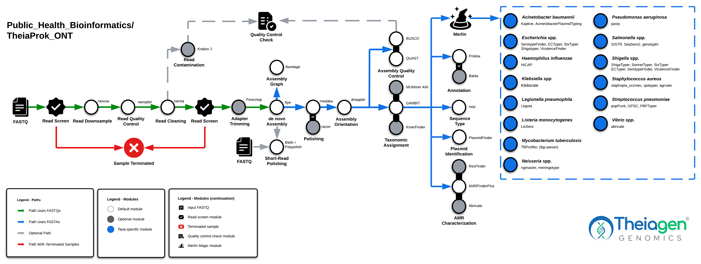

# TheiaProk Workflow Series

## Quick Facts

{{ render_tsv_table("docs/assets/tables/all_workflows.tsv", sort_by="Name", filters={"Name": "[**TheiaProk Workflow Series**](../workflows/genomic_characterization/theiaprok.md)"}, columns=["Workflow Type", "Applicable Kingdom", "Last Known Changes", "Command-line Compatibility","Workflow Level", "Dockstore"]) }}

## TheiaProk Workflows

**The TheiaProk workflows are for the assembly, quality assessment, and characterization of bacterial genomes.** There are currently four TheiaProk workflows designed to accommodate different kinds of input data:

1. Illumina paired-end sequencing **(TheiaProk_Illumina_PE**)
2. Illumina single-end sequencing (**TheiaProk_Illumina_SE)**
3. ONT sequencing (**TheiaProk_ONT**)
4. Genome assemblies (**TheiaProk_FASTA**)

=== "TheiaProk_Illumina_PE"

    !!! caption "TheiaProk Illumina PE Workflow Diagram"
        

=== "TheiaProk_ONT"

    !!! caption "TheiaProk ONT Workflow Diagram"
        

All input reads are processed through "[core tasks](#core-tasks)" in the TheiaProk Illumina and ONT workflows. These undertake read trimming and assembly appropriate to the input data type. TheiaProk workflows subsequently launch default genome characterization modules for quality assessment, species identification, antimicrobial resistance gene detection, sequence typing, and more. **For some taxa identified, "[taxa-specific sub-workflows](#taxa-specific-tasks)" will be automatically activated, undertaking additional taxa-specific characterization steps**. When setting up each workflow, users may choose to use "optional tasks" as additions or alternatives to tasks run in the workflow by default.

### Inputs

!!! dna "Input Data"
    === "TheiaProk_Illumina_PE"

        The TheiaProk_Illumina_PE workflow takes in Illumina paired-end read data. Read file names should end with `.fastq` or `.fq`, with the optional addition of `.gz`. When possible, Theiagen recommends zipping files with [gzip](https://www.gnu.org/software/gzip/) before Terra uploads to minimize data upload time.

        By default, the workflow anticipates **2 x 150bp** reads (i.e. the input reads were generated using a 300-cycle sequencing kit). Modifications to the optional parameter for `trim_minlen` may be required to accommodate shorter read data, such as the 2 x 75bp reads generated using a 150-cycle sequencing kit.

    === "TheiaProk_Illumina_SE"

        TheiaProk_Illumina_SE takes in Illumina single-end reads. Read file names should end with `.fastq` or `.fq`, with the optional addition of `.gz`. Theiagen highly recommends zipping files with [gzip](https://www.gnu.org/software/gzip/) before uploading to Terra to minimize data upload time & save on storage costs.

        By default, the workflow anticipates **1 x 35 bp** reads  (i.e. the input reads were generated using a 70-cycle sequencing kit). Modifications to the optional parameter for `trim_minlen` may be required to accommodate longer read data.

    === "TheiaProk_ONT"

        The TheiaProk_ONT workflow takes in base-called ONT read data. Read file names should end with `.fastq` or `.fq`, with the optional addition of `.gz`. When possible, Theiagen recommends zipping files with [gzip](https://www.gnu.org/software/gzip/) before uploading to Terra to minimize data upload time.

        **The ONT sequencing kit and base-calling approach can produce substantial variability in the amount and quality of read data. Genome assemblies produced by the TheiaProk_ONT workflow must be quality assessed before reporting results.**

    === "TheiaProk_FASTA"

        The TheiaProk_FASTA workflow takes in assembly files in FASTA format.

!!! tip "Skip Characterization"
    Ever wanted to skip characterization? Now you can! Set the optional input `perform_characterization` to **`false`** to only generate an assembly and run assembly QC.

!!! caption ""
    === "TheiaProk_Illumina_PE"
        /// html | div[class="searchable-table"]

        {{ render_tsv_table("docs/assets/tables/all_inputs.tsv", input_table=True, filters={"Workflow": "TheiaProk_Illumina_PE"}, columns=["Terra Task Name", "Variable", "Type", "Description", "Default Value", "Terra Status"], sort_by=[("Terra Status", True), "Terra Task Name", "Variable"], indent=8) }}
        ///

    === "TheiaProk_Illumina_SE"
        /// html | div[class="searchable-table"]

        {{ render_tsv_table("docs/assets/tables/all_inputs.tsv", input_table=True, filters={"Workflow": "TheiaProk_Illumina_SE"}, columns=["Terra Task Name", "Variable", "Type", "Description", "Default Value", "Terra Status"], sort_by=[("Terra Status", True), "Terra Task Name", "Variable"], indent=8) }}
        ///

    === "TheiaProk_ONT"
        /// html | div[class="searchable-table"]

        {{ render_tsv_table("docs/assets/tables/all_inputs.tsv", input_table=True, filters={"Workflow": "TheiaProk_ONT"}, columns=["Terra Task Name", "Variable", "Type", "Description", "Default Value", "Terra Status"], sort_by=[("Terra Status", True), "Terra Task Name", "Variable"], indent=8) }}
        ///

    === "TheiaProk_FASTA"
        /// html | div[class="searchable-table"]

        {{ render_tsv_table("docs/assets/tables/all_inputs.tsv", input_table=True, filters={"Workflow": "TheiaProk_FASTA"}, columns=["Terra Task Name", "Variable", "Type", "Description", "Default Value", "Terra Status"], sort_by=[("Terra Status", True), "Terra Task Name", "Variable"], indent=8) }}
        ///

### Core Tasks

!!! dna ""
    These tasks are performed regardless of organism. They include tasks that are performed regardless of and specific for the input data type. They perform read trimming and assembly appropriate to the input data type.

{{ include_md("common_text/versioning_task.md", condition="theiaprok") }}

#### Assembly Tasks

!!! caption ""
    === "TheiaProk_Illumina_PE"

{{ include_md("common_text/concatenate_illumina_lanes_task.md", indent=8) }}
{{ include_md("common_text/read_screen_task.md", condition="theiaprok", indent=8) }}

        !!! dna ""
            These tasks assemble the reads into a _de novo_ assembly and assess the quality of the assembly.

{{ include_md("common_text/read_qc_trim_illumina.md", condition="theiaprok", indent=8) }}
{{ include_md("common_text/cg_pipeline_task.md", indent=8) }}
{{ include_md("common_text/digger_denovo_task.md", indent=8) }}

    === "TheiaProk_Illumina_SE"

{{ include_md("common_text/concatenate_illumina_lanes_task.md", indent=8) }}
{{ include_md("common_text/read_screen_task.md", condition="theiaprok", indent=8) }}

        !!! dna ""
            These tasks assemble the reads into a _de novo_ assembly and assess the quality of the assembly.

{{ include_md("common_text/read_qc_trim_illumina.md", condition="theiaprok", indent=8) }}
{{ include_md("common_text/cg_pipeline_task.md", indent=8) }}
{{ include_md("common_text/digger_denovo_task.md", indent=8) }}

    === "TheiaProk_ONT"

{{ include_md("common_text/read_screen_task.md", condition="theiaprok", indent=8) }}

        !!! dna ""
            These tasks assemble the reads into a _de novo_ assembly and assess the quality of the assembly.

{{ include_md("common_text/read_qc_trim_ont.md", condition="theiaprok", indent=8) }}
{{ include_md("common_text/flye_denovo_task.md", condition="theiaprok", indent=8) }}

    === "TheiaProk_FASTA"
        !!! dna ""
            Since this workflow requires FASTA files as input, no assembly or read trimming is performed, and the workflow proceeds directly to the "post-assembly tasks" section below.

#### Post-Assembly Tasks

!!! dna ""
    The following tasks are performed for all taxa, regardless of the input data type. They include quality control, assembly characterization, and taxonomic identification.

##### Quality Control

{{ include_md("common_text/quast_task.md") }}

{{ include_md("common_text/busco_task.md") }}

{{ include_md("common_text/qc_check_task.md", condition="theiaprok")}}

{{ include_md("common_text/arln_stats_task.md") }}

##### Taxonomic Assignment

{{ include_md("common_text/gambit_task.md") }}

{{ include_md("common_text/kmerfinder_task.md") }}

{{ include_md("common_text/mummer_ani_task.md") }}

##### AMR Characterization

{{ include_md("common_text/amrfinderplus_task.md") }}

{{ include_md("common_text/resfinder_task.md") }}

{{ include_md("common_text/gamma_task.md") }}

{{ include_md("common_text/abricate_bacterial_task.md") }}

{{ include_md("common_text/amr_search_task.md", condition="theiaprok") }}

##### Sequence Type

{{ include_md("common_text/ts_mlst_task.md") }}

##### Assembly Annotation

!!! tip ""
    By default, `genome_annotation` is set to `"prokka"`. To use `bakta` instead, set `genome_annotation` to `"bakta"`. These tools are mutually exclusive.

{{ include_md("common_text/prokka_task.md") }}

{{ include_md("common_text/bakta_task.md") }}

##### Plasmid Identification

{{ include_md("common_text/plasmidfinder_task.md") }}

### Taxa-Specific Tasks

!!! dna ""
    The TheiaProk workflows automatically activate taxa-specific sub-workflows after the identification of relevant taxa using `GAMBIT`. Alternatively, the user can provide the expected taxa in the `expected_taxon` workflow input to override the taxonomic assignment made by GAMBIT. Modules are launched for all TheiaProk workflows unless otherwise indicated.

    Please note that some modules require specific input data that may render it incompatible with every workflow. For example, ShigaTyper (a _Shigella_/EIEC serotyping tool) is not available for TheiaProk_FASTA as it requires read data as input. We have made a note next to each module to indicate which workflows are compatible with the module if there are restrictions.

{{ include_md("common_text/taxon_table_task.md") }}

??? toggle "_Acinetobacter baumannii_"
    ##### _Acinetobacter baumannii_  {#acinetobacter-baumannii} 

{{ include_md("common_text/kaptive_task.md", indent=4) }}

{{ include_md("common_text/abricate_abaum_task.md", indent=4) }}

??? toggle "_Escherichia_ or _Shigella_ spp."
    ##### _Escherichia_ or _Shigella_ spp.  {#escherichia-or-shigella} 

    The *Escherichia* and *Shigella* genera are [difficult to differentiate as they do not comply with genomic definitions of genera and species](https://www.sciencedirect.com/science/article/abs/pii/S1286457902016374). Consequently, when either _Escherichia_ or _Shigella_ are identified by GAMBIT, all tools intended for these taxa are used. 

    !!! tip ""
        `SerotypeFinder` and `ECTyper` are intended for analysis of *E. coli*. Both tools are used as there are occasional discrepancies between the serotypes predicted. This primarily arises due to differences in the databases used by each tool.

{{ include_md("common_text/serotypefinder_task.md", indent=4)}}

{{ include_md("common_text/ectyper_task.md", indent=4)}}

    !!! tip ""
        `VirulenceFinder` identifies virulence genes in total or partial sequenced isolates of bacteria. Currently, only *E. coli* is supported in TheiaProk workflows. 

{{ include_md("common_text/virulencefinder_task.md", indent=4) }}

    !!! tip ""
        `ShigaTyper` and `ShigEiFinder` are intended for differentiation and serotype prediction for any *Shigella* species and Enteroinvasive *Escherichia coli* (EIEC). You can read about differences between these [here](https://www.ncbi.nlm.nih.gov/pmc/articles/PMC517479/) and [here](https://www.microbiologyresearch.org/content/journal/micro/10.1099/00221287-144-9-2667). ShigEiFinder can be run using either the assembly (default) or reads. These tasks will report if the samples are neither *Shigella* nor EIEC.

{{ include_md("common_text/shigatyper_task.md", indent=4) }}

{{ include_md("common_text/shigeifinder_task.md", indent=4, condition="assembly") }}

{{ include_md("common_text/shigeifinder_task.md", indent=4, condition="reads") }}

    !!! tip ""
        `SonneiTyper` is run only when GAMBIT predicts the *S. sonnei* species. This is the most common *Shigella* species in the United States.

{{ include_md("common_text/sonneityper_task.md", indent=4)}}

    !!! tip ""
        **Shigella XDR prediction.** Please see [the documentation section above for ResFinder](#amr-characterization) for details regarding this taxa-specific analysis. 

{{ include_md("common_text/stxtyper_task.md", indent=4) }}

??? toggle "_Haemophilus influenzae_"
    ##### _Haemophilus influenzae_  {#haemophilus-influenzae} 

{{ include_md("common_text/hicap_task.md", indent=4) }}

??? toggle "_Klebsiella_ spp."
    ##### _Klebsiella_ spp.  {#klebsiella} 

{{ include_md("common_text/kleborate_task.md", indent=4) }}

??? toggle "_Legionella pneumophila_"
    ##### _Legionella pneumophila_  {#legionella-pneumophila} 

{{ include_md("common_text/legsta_task.md", indent=4) }}

??? toggle "_Listeria monocytogenes_"
    ##### _Listeria monocytogenes_  {#listeria-monocytogenes} 

{{ include_md("common_text/lissero_task.md", indent=4) }}

??? toggle "_Mycobacterium tuberculosis_"
    ##### _Mycobacterium tuberculosis_  {#mycobacterium-tuberculosis} 

{{ include_md("common_text/clockwork_task.md", indent=4) }}

{{ include_md("common_text/tbprofiler_task.md", indent=4) }}

{{ include_md("common_text/tbp_parser_task.md", indent=4) }}

??? toggle "_Neisseria_ spp."
    ##### _Neisseria_ spp.  {#neisseria} 

{{ include_md("common_text/ngmaster_task.md", indent=4) }}

{{ include_md("common_text/meningotype_task.md", indent=4) }}

??? toggle "_Pseudomonas aeruginosa_"
    ##### _Pseudomonas aeruginosa_  {#pseudomonas-aeruginosa} 

{{ include_md("common_text/pasty_task.md", indent=4) }}

??? toggle "_Salmonella_ spp."
    ##### _Salmonella_ spp.  {#salmonella} 

    !!! tip ""
        Both SISTR and SeqSero2 are used for serotyping all *Salmonella* spp. Occasionally, the predicted serotypes may differ between SISTR and SeqSero2. When this occurs, differences are typically small and analogous, and are likely as a result of differing source databases. More information about Salmonella serovar nomenclature can be found [here](https://www.happykhan.com/posts/binfie-guide-serovar/).

{{ include_md("common_text/sistr_task.md", indent=4) }}

{{ include_md("common_text/seqsero2_task.md", indent=4) }}

{{ include_md("common_text/genotyphi_task.md", indent=4) }}

??? toggle "_Staphyloccocus aureus_"
    ##### _Staphyloccocus aureus_  {#staphyloccocus-aureus} 

    ??? task "`spatyper`: Sequence typing"
        
        Given a fasta file or multiple fasta files, this script identifies the repeats and the order and generates a *spa* type. The repeat sequences and repeat orders found on http://spaserver2.ridom.de/ are used to identify the spa type of each enriched sequence. Ridom *spa* type and the genomics repeat sequence are then reported back to the user.
        
        !!! techdetails "spatyper Technical Details"

            |  | Links |
            | --- | --- |
            | Task | [task_spatyper.wdl](https://github.com/theiagen/public_health_bioinformatics/blob/main/tasks/species_typing/staphylococcus/task_spatyper.wdl) |
            | Software Source Code | [spatyper](https://github.com/HCGB-IGTP/spaTyper) |
            | Software Documentation | [spatyper](https://github.com/HCGB-IGTP/spaTyper) |
            
    ??? task "`staphopia-sccmec`: Sequence typing"
        
        This tool assigns a SCCmec type by BLAST the SCCmec primers against an assembly. `staphopia-sccmec`reports `True` for exact primer matches and `False` for at least 1 base pair difference. The [Hamming Distance](https://en.wikipedia.org/wiki/Hamming_distance) is also reported.
        
        !!! techdetails "staphopia-sccmec Technical Details"           
            
            |  | Links |
            | --- | --- |
            | Task | [task_staphopiasccmec.wdl](https://github.com/theiagen/public_health_bioinformatics/blob/main/tasks/species_typing/staphylococcus/task_staphopiasccmec.wdl) |
            | Software Source Code | [staphopia-sccmec](https://github.com/staphopia/staphopia-sccmec) |
            | Software Documentation | [staphopia-sccmec](https://github.com/staphopia/staphopia-sccmec) |
            | Original Publication(s) | [*Staphylococcus aureus* viewed from the perspective of 40,000+ genomes](https://doi.org/10.7717/peerj.5261) |

    ??? task "`agrvate`: Sequence typing"
        
        This tool identifies the *agr* locus type and reports possible variants in the *agr* operon. AgrVATE accepts a *S. aureus* genome assembly as input and performs a kmer search using an Agr-group specific kmer database to assign the Agr-group. The *agr* operon is then extracted using *in-silico* PCR and variants are called using an Agr-group specific reference operon.
        
        !!! techdetails "agrvate Technical Details"
            
            |  | Links |
            | --- | --- |
            | Task | [task_agrvate.wdl](https://github.com/theiagen/public_health_bioinformatics/blob/main/tasks/species_typing/staphylococcus/task_agrvate.wdl) |
            | Software Source Code | [agrVATE](https://github.com/VishnuRaghuram94/AgrVATE) |
            | Software Documentation | [agrVATE](https://github.com/VishnuRaghuram94/AgrVATE) |
            | Original Publication(s) | [Species-Wide Phylogenomics of the *Staphylococcus aureus Agr* Operon Revealed Convergent Evolution of Frameshift Mutations](https://doi.org/10.1128/spectrum.01334-21) |

??? toggle "_Streptococcus pneumoniae_"
    ##### _Streptococcus pneumoniae_  {#streptococcus-pneumoniae} 

    ??? task "`PopPUNK`: Global Pneumococcal Sequence Cluster typing"
        
        Global Pneumococcal Sequence Clusters (GPSC) define and name pneumococcal strains. GPSC designation is undertaken using the PopPUNK software and GPSC database as described in the file below, obtained from [here](https://www.pneumogen.net/gps/#/training#command-line).

        :file: [GPSC_README_PopPUNK2.txt](../../assets/files/GPSC_README_PopPUNK2.txt)
        
        !!! tip "Interpreting GPSC results"
            - In the `*_external_clusters.csv` novel clusters are assigned NA. For isolates that are assigned a novel cluster and pass QC, you can email [globalpneumoseq@gmail.com](mailto:globalpneumoseq@gmail.com) to have these novel clusters added to the database.
            - Unsampled diversity in the pneumococcal population may represent missing variation that links two GPS clusters. When this is discovered, GPSCs are merged and the merge history is indicated. For example, if GPSC23 and GPSC362 merged, the GPSC would be reported as GPSC23, with a merge history of GPSC23;362.
        
        !!! techdetails "PopPUNK Technical Details"
            
            |  | Links |
            | --- | --- |
            | Task | [task_poppunk_streppneumo.wdl](https://github.com/theiagen/public_health_bioinformatics/blob/main/tasks/species_typing/streptococcus/task_poppunk_streppneumo.wdl) |
            | GPSC database | <https://www.pneumogen.net/gps/#/training#command-line> |
            | Software Source Code | [PopPunk](https://github.com/bacpop/PopPUNK) |
            | Software Documentation | <https://poppunk.readthedocs.io/en/latest/> |
            | Original Publication(s) | [Fast and flexible bacterial genomic epidemiology with PopPUNK](https://genome.cshlp.org/content/29/2/304) |
        
    ??? task "`SeroBA`: Serotyping ==_for Illumina_PE only_=="
        
        Streptococcus pneumoniae serotyping is performed with SeroBA.
        
        !!! techdetails "SeroBA Technical Details"
            
            |  | Links |
            | --- | --- |
            | Task | [task_seroba.wdl](https://github.com/theiagen/public_health_bioinformatics/blob/main/tasks/species_typing/streptococcus/task_seroba.wdl) |
            | Software Source Code | [SeroBA](https://github.com/sanger-pathogens/seroba) |
            | Software Documentation | https://sanger-pathogens.github.io/seroba/ |
            | Original Publication(s) | [SeroBA: rapid high-throughput serotyping of Streptococcus pneumoniae from whole genome sequence data](https://www.microbiologyresearch.org/content/journal/mgen/10.1099/mgen.0.000186) |
    
    ??? task "`pbptyper`: Penicillin-binding protein genotyping"
       
        The Penicillin-binding proteins (PBP) are responsible for the minimum inhibitory concentration phenotype for beta-lactam antibiotic. In *Streptococcus pneumoniae*, these PBP genes can be identified and typed with PBPTyper. 
        
        !!! techdetails "pbptyper Technical Details"
            
            |  | Links |
            | --- | --- |
            | Task | [task_pbptyper.wdl](https://github.com/theiagen/public_health_bioinformatics/blob/main/tasks/species_typing/streptococcus/task_pbptyper.wdl) |
            | Software Source Code | [pbptyper](https://github.com/rpetit3/pbptyper) |
            | Software Documentation | [pbptyper](https://github.com/rpetit3/pbptyper) |
            | Original Publication(s) | [Penicillin-binding protein transpeptidase signatures for tracking and predicting β-lactam resistance levels in Streptococcus pneumoniae](https://journals.asm.org/doi/full/10.1128/mBio.00756-16) |

??? toggle "_Streptococcus pyogenes_"
    ##### _Streptococcus pyogenes_  {#streptococcus-pyogenes} 
    ??? task "`emm-typing-tool`: Sequence typing ==_for Illumina_PE only_=="

        emm-typing of *Streptococcus pyogenes* raw reads. Assign emm type and subtype by querying the CDC M-type specific database. 
        
        !!! techdetails "emm-typing-tool Technical Details"            
            |  | Links |
            | --- | --- |
            | Task | [task_emmtypingtool.wdl](https://github.com/theiagen/public_health_bioinformatics/blob/main/tasks/species_typing/streptococcus/task_emmtypingtool.wdl) |
            | Software Source Code | [emm-typing-tool](https://github.com/ukhsa-collaboration/emm-typing-tool) |
            | Software Documentation | [emm-typing-tool](https://github.com/ukhsa-collaboration/emm-typing-tool) |

??? toggle "_Vibrio_ spp."
    ##### _Vibrio_ spp.  {#vibrio} 
    ??? task "`SRST2`: Vibrio characterization ==_for Illumina only_=="

        The `SRST2 Vibrio characterization` task detects sequences for *Vibrio* spp. characterization using Illumina sequence reads and a database of target sequence that are traditionally used in PCR methods. The sequences included in the database are as follows:
        
        | Sequence name | Sequence role | Purpose in database |
        | --- | --- | --- |
        | *toxR* | Transcriptional activator | Species marker where presence identifies *V. cholerae*  |
        | *ompW* | Outer Membrane Protein | Species marker where presence identifies *V. cholerae*  |
        | *ctxA* | Cholera toxin | Indicates cholera toxin production |
        | *tcpA*_classical | Toxin co-pilus A allele associated with the Classical biotype | Used to infer identity as Classical biotype |
        | tcpA_ElTor | Toxin co-pilus A allele associated with the El Tor biotype | Used to infer identity as El Tor biotype |
        | *wbeN* | O antigen encoding region | Used to infer identity as O1 serogroup |
        | *wbfR* | O antigen encoding region | Used to infer identity as O139 serogroup |

        !!! techdetails "SRST2 Technical Details"

            |  | Links |
            | --- | --- |
            | Task | [task_srst2_vibrio.wdl](https://github.com/theiagen/public_health_bioinformatics/blob/main/tasks/species_typing/vibrio/task_srst2_vibrio.wdl) |
            | Software Source Code | [srst2](https://github.com/katholt/srst2) |
            | Software Documentation | [srst2](https://github.com/katholt/srst2) |
            | Database Description | [Docker container](https://github.com/StaPH-B/docker-builds/tree/master/build-files/srst2/0.2.0-vibrio-230224) |
    
{{ include_md("common_text/vibecheck_task.md", indent=4) }}

    ??? task "`Abricate`: Vibrio characterization"

        The `Abricate` Vibrio characterization task detects sequences for *Vibrio* spp. characterization using genome assemblies and the abricate "vibrio" database. The sequences included in the database are as follows:
        
        | Sequence name | Sequence role | Purpose in database |
        | --- | --- | --- |
        | *toxR* | Transcriptional activator | Species marker where presence identifies *V. cholerae*  |
        | *ompW* | Outer Membrane Protein | Species marker where presence identifies *V. cholerae*  |
        | *ctxA* | Cholera toxin | Indicates cholera toxin production |
        | *tcpA*_classical | Toxin co-pilus A allele associated with the Classical biotype | Used to infer identity as Classical biotype |
        | tcpA_ElTor | Toxin co-pilus A allele associated with the El Tor biotype | Used to infer identity as El Tor biotype |
        | *wbeN* | O antigen encoding region | Used to infer identity as O1 serogroup |
        | *wbfR* | O antigen encoding region | Used to infer identity as O139 serogroup |
        
        !!! techdetails "Abricate Technical Details"
            |  | Links |
            | --- | --- |
            | Task | [task_abricate_vibrio.wdl](https://github.com/theiagen/public_health_bioinformatics/blob/main/tasks/species_typing/vibrio/task_srst2_vibrio.wdl) |
            | Software Source Code | [abricate](https://github.com/tseemann/abricate) |
            | Software Documentation | [abricate](https://github.com/tseemann/abricate) |
            | Database Description | [Docker container](https://github.com/StaPH-B/docker-builds/tree/master/build-files/abricate/1.0.1-vibrio-cholera) |
    
### Outputs

=== "TheiaProk_Illumina_PE"
    /// html | div[class="searchable-table"]

    {{ render_tsv_table("docs/assets/tables/all_outputs.tsv", input_table=False, filters={"Workflow": "TheiaProk_Illumina_PE"}, columns=["Variable", "Type", "Description"], sort_by=["Variable"], indent=4) }}

    ///

=== "TheiaProk_Illumina_SE"
    /// html | div[class="searchable-table"]

    {{ render_tsv_table("docs/assets/tables/all_outputs.tsv", input_table=False, filters={"Workflow": "TheiaProk_Illumina_SE"}, columns=["Variable", "Type", "Description"], sort_by=["Variable"], indent=4) }}
    
    ///

=== "TheiaProk_ONT"
    /// html | div[class="searchable-table"]

    {{ render_tsv_table("docs/assets/tables/all_outputs.tsv", input_table=False, filters={"Workflow": "TheiaProk_FASTA"}, columns=["Variable", "Type", "Description"], sort_by=["Variable"], indent=4) }}
    
    ///

=== "TheiaProk_FASTA"
    /// html | div[class="searchable-table"]

    {{ render_tsv_table("docs/assets/tables/all_outputs.tsv", input_table=False, filters={"Workflow": "TheiaProk_FASTA"}, columns=["Variable", "Type", "Description"], sort_by=["Variable"], indent=4) }}

    ///
