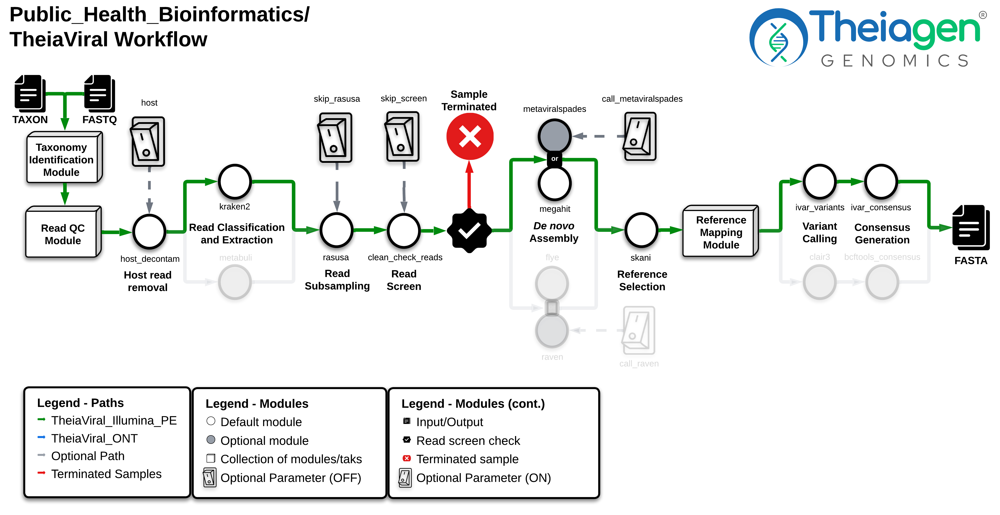
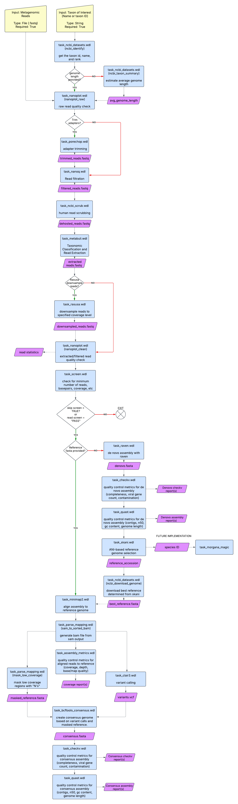

# TheiaViral Workflow Series

## Quick Facts

{{ render_tsv_table("docs/assets/tables/all_workflows.tsv", sort_by="Name", filters={"Name": "[**TheiaViral**](../workflows/genomic_characterization/theiaviral.md)"}, columns=["Workflow Type", "Applicable Kingdom", "Last Known Changes", "Command-line Compatibility","Workflow Level", "Dockstore"]) }}

## TheiaViral Workflows

**TheiaViral** workflows assemble, quality assess, and characterize viral genomes from diverse data sources, including metagenomic samples. TheiaViral workflows can generate consensus assemblies of recalcitrant viruses, including diverse or recombinant lineages, such as rabies virus and norovirus, through a three-step approach: 1) generating an intermediate *de novo* assembly from taxonomy-filtered reads, 2) selecting the best reference from a database of ~200,000 viral genomes using average nucleotide identity, and 3) producing a final consensus assembly through reference-based read mapping and variant calling. Reference genomes can be directly provided to TheiaViral to bypass *de novo* assembly, which enables compatibility with tiled amplicon sequencing data. Targeted viral characterization is functional for lineages [listed below](#taxa-specific-tasks).

???+ question "What are the main differences between the TheiaViral and TheiaCov workflows?"

    

    -   :material-database: **TheiaCov Workflows**

        ---

        * For amplicon-derived viral sequencing methods
        * Supports a limited number of [pathogens](../../workflows/genomic_characterization/theiacov.md/#supported-organisms)
        * Uses manually curated, static reference genomes

    -   :material-database: **TheiaViral Workflows**

        ---

        * Designed for a variety of sequencing methods
        * Supports relatively diverse and recombinant pathogens
        * Dynamically identifies the most similar reference genome for consensus assembly via an intermediate *de novo* assembly

    

???+ question "Segmented viruses"

    Segmented viruses are accounted for in TheiaViral. The reference genome database excludes segmented viral nucleotide accessions, while including RefSeq assembly accessions that include all viral segments. Consensus assembly modules are constructed to handle multi-segment references.

### Workflow Diagram

=== "TheiaViral_Illumina_PE"

    !!! caption "TheiaViral_Illumina_PE Workflow Diagram"

        

=== "TheiaViral_ONT"

    !!! caption "TheiaViral_ONT Workflow Diagram"

        

## TheiaViral Workflows for Different Input Types

-   
 **TheiaViral_Illumina_PE** 

    ---

    !!! dna "Illumina_PE Input Read Data"

        The TheiaViral_Illumina_PE workflow inputs Illumina paired-end read data. Read file extensions should be `.fastq` or `.fq`, and can optionally include the `.gz` compression extension. Theiagen recommends compressing files with [gzip](https://www.gnu.org/software/gzip/) before Terra uploads to minimize data upload time and storage costs.

        Modifications to the optional parameter for `trim_minlen` may be required to appropriately trim reads shorter than 2 x 150 bp (i.e. generated using a 300-cycle sequencing kit), such as the 2 x 75bp reads generated using a 150-cycle sequencing kit.

-   
 **TheiaViral_ONT** 

    ---

    !!! dna_blue "ONT Input Read Data"

        The TheiaViral_ONT workflow inputs base-called Oxford Nanopore Technology (ONT) read data. Read file extensions should be `.fastq` or `.fq`, and can optionally include the `.gz` compression extension. Theiagen recommends compressing files with [gzip](https://www.gnu.org/software/gzip/) before Terra uploads to minimize data upload time and storage costs.

        It is recommended to trim adapter sequencings via `dorado` basecalling prior to running TheiaViral_ONT, though `porechop` can optionally be called to trim adapters within the workflow.

        **The ONT sequencing kit and base-calling approach can produce substantial variability in the amount and quality of read data. Genome assemblies produced by the TheiaViral_ONT workflow must be quality assessed before reporting results. We recommend using the [Dorado_Basecalling_PHB](../standalone/dorado_basecalling.md) workflow if applicable.**

### Inputs

???+ dna_blue "`taxon` _required_ input parameter"
    `taxon` is the standardized taxonomic name (e.g. "Lyssavirus rabies") or NCBI taxon ID (e.g. "11292") of the desired virus to analyze. Inputs must be represented in the [NCBI taxonomy database](https://www.ncbi.nlm.nih.gov/Taxonomy/Browser/wwwtax.cgi) and do not have to be species-level (see `read_extraction_rank` below).

/// html | div[style='float: left; width: 50%; padding-right: 10px;']

??? dna "`host` optional input parameter"
    The `host` input triggers the Host Decontaminate workflow, which removes reads that map to a reference host genome. This input needs to be an [NCBI Taxonomy-compatible](https://www.ncbi.nlm.nih.gov/taxonomy) taxon or an NCBI assembly accession. If using a taxon, the first retrieved genome corresponding to that taxon is retrieved. If using an accession, it must be coupled with the Host Decontaminate task `is_accession` (ONT) or Read QC Trim PE `host_is_accession` (Illumina) boolean populated as "true".

??? dna "`extract_unclassified` optional input parameter"
    By default, the `extract_unclassified` parameter is set to "true", which indicates that reads that are not classified by Kraken2 (Illumina) or Metabuli (ONT) will be included with reads classified as the input `taxon`. These classification software most often do not comprehensively classify reads using the default RefSeq databases, so extracting unclassified reads is desirable when host and contaminant reads have been sufficiently decontaminated. Host decontamination occurs in TheiaViral using NCBI `sra-human-scrubber`, read classification to the human genome, and/or via mapping reads to the inputted `host`. Contaminant viral reads are mostly excluded because they will be often be classified against the default RefSeq classification databases. Consider setting `extract_unclassified` to false if *de novo* assembly or Skani reference selection is failing.
///

/// html | div[style='float: right; width: 50%; padding-left: 10px;']

??? dna "`min_allele_freq`, `min_depth`, and `min_map_quality` optional input parameters"
    These parameters have a direct effect on the variants that will ultimately be reported in the consensus assembly. `min_allele_freq` determines the minimum proportion of an allelic variant to be reported in the consensus assembly. `min_depth` and `min_map_quality` affect how "N" is reported in the consensus, i.e. depth below `min_depth` is reported as "N" and reads with mapping quality below `min_map_quality` are not included in depth calculations.

??? dna "`read_extraction_rank` optional input parameter"
    By default, the `read_extraction_rank` parameter is set to "family", which indicates that reads will be extracted if they are classified as the taxonomic family of the input `taxon`, including all descendant taxa of the family. Read classification may not resolve to the rank of the input `taxon`, so these reads may be classified at higher ranks. For example, some *Lyssavirus rabies* (species) reads may only be resolved to *Lyssavirus* (genus), so they would not be extracted if the `read_extraction_rank` is set to "species". Setting the `read_extraction_rank` above the inputted `taxon`'s rank can therefore dramatically increase the number of reads recovered, at the potential cost of including other viruses. This likely is not a problem for scarcely represented lineages, e.g. a sample that is expected to include *Lyssavirus rabies* is unlikely to contain other viruses of the corresponding family, Rhabdoviridae, within the same sample. However, setting a `read_extraction_rank` far beyond the input `taxon` rank can be problematic when multiple representatives of the same viral family are included in similar abundance within the same sample. To further refine the desired `read_extraction_rank`, please review the corresponding classification reports of the respective classification software (kraken2 for Illumina and Metabuli for ONT)
///

/// html | div[style='clear: both;']
///

=== "TheiaViral_Illumina_PE"
    /// html | div[class="searchable-table"]

    {{ render_tsv_table("docs/assets/tables/all_inputs.tsv", input_table=True, filters={"Workflow": "TheiaViral_Illumina_PE"}, columns=["Terra Task Name", "Variable", "Type", "Description", "Default Value", "Terra Status"], sort_by=[("Terra Status", True), "Terra Task Name", "Variable"], indent=8) }}

    ///

=== "TheiaViral_ONT"
    /// html | div[class="searchable-table"]

    {{ render_tsv_table("docs/assets/tables/all_inputs.tsv", input_table=True, filters={"Workflow": "TheiaViral_ONT"}, columns=["Terra Task Name", "Variable", "Type", "Description", "Default Value", "Terra Status"], sort_by=[("Terra Status", True), "Terra Task Name", "Variable"], indent=8) }}

    ///

### Workflow Tasks

=== "TheiaViral_Illumina_PE"

    ??? toggle "Versioning"

{{ include_md("common_text/versioning_task.md", indent=8) }}

    ??? toggle "Taxonomic Identification"

{{ include_md("common_text/ncbi_identify_task.md", indent=8) }}

    ??? toggle "Read Quality Control, Trimming, Filtering, Identification and Extraction"

{{ include_md("common_text/read_qc_trim_illumina.md", condition="theiaviral", indent=8, replacements={": Read Quality Trimming, Adapter Removal, Quantification, and Identification" : ""}) }}

{{ include_md("common_text/rasusa_task.md", condition="theiaviral", indent=8, replacements={'??? task "`Rasusa`: Read subsampling (optional, on by default)"' : '??? task "`rasusa`"'}) }}

{{ include_md("common_text/read_screen_task.md", condition="theiaviral", indent=8, replacements={'??? task "`screen`: Total Raw Read Quantification and Genome Size Estimation"' : '??? task "`clean_check_reads`"'}) }}

    ??? toggle "*De novo* Assembly and Reference Selection"
        ???+ warning "These tasks are only performed if no reference genome is provided"
            In this workflow, *de novo* assembly is primarily used to facilitate the selection of a closely related reference genome, though high quality *de novo* assemblies can be used for downstream analysis. If the user provides an input `reference_fasta`, the following assembly generation, assembly evaluation, and reference selections tasks will be **skipped**:
           
            - `spades`
            - `megahit`
            - `checkv_denovo`
            - `quast_denovo`
            - `skani`
            - `ncbi_datasets`

{{ include_md("common_text/spades_task.md", condition="theiaviral", indent=8) }}

{{ include_md("common_text/megahit_task.md", condition="theiaviral", indent=8) }}

{{ include_md("common_text/skani_task.md", condition="theiaviral", indent=8) }}

{{ include_md("common_text/ncbi_datasets_task.md", condition="theiaviral", indent=8, replacements={'??? task "NCBI Datasets"' : '??? task "`ncbi_datasets`"'}) }}

    ??? toggle "Reference Mapping"

{{ include_md("common_text/bwa_task.md", condition="theiaviral", indent=8) }}

{{ include_md("common_text/assembly_metrics_task.md", condition="theiaviral", indent=8, replacements={'`assembly_metrics`' : '`read_mapping_stats`'}) }}

    ??? toggle "Variant Calling and Consensus Generation"

{{ include_md("common_text/ivar_variants_task.md", condition="theiaviral", indent=8) }}

{{ include_md("common_text/ivar_consensus_task.md", condition="theiaviral", indent=8) }}

    ??? toggle "Assembly Evaluation and Consensus Quality Control"

{{ include_md("common_text/quast_task.md", condition="theiaviral", indent=8, replacements={'??? task "`quast`: Assembly Quality Assessment"' : '??? task "`quast_denovo`"'}) }}

{{ include_md("common_text/checkv_task.md", condition="theiaviral", indent=8, replacements={'??? task "`checkv`"' : '??? task "`checkv_denovo` & `checkv_consensus`"'}) }}

{{ include_md("common_text/consensus_qc_task.md", condition="theiaviral", indent=8) }}

=== "TheiaViral_ONT"

    ??? toggle "Versioning"

{{ include_md("common_text/versioning_task.md", condition="theiaviral", indent=8) }}

    ??? toggle "Taxonomic Identification"

{{ include_md("common_text/ncbi_identify_task.md", indent=8) }}

    ??? toggle "Read Quality Control, Trimming, and Filtering"

{{ include_md("common_text/nanoplot_task.md", condition="theiaviral", indent=8, replacements={'??? task "`nanoplot`"' : '??? task "`nanoplot_raw` & `nanoplot_clean`"'}) }}

{{ include_md("common_text/porechop_task.md", condition="theiaviral", indent=8) }}

{{ include_md("common_text/nanoq_task.md", condition="theiaviral", indent=8) }}

{{ include_md("common_text/ncbi_scrub_task.md", condition="theiaviral", indent=8, replacements={'??? task "`HRRT`: Human Host Sequence Removal"' : '??? task "`ncbi_scrub_se`"'}) }}

{{ include_md("common_text/host_decontaminate.md", condition="theiaviral", indent=8, replacements={'??? task "`host_decontaminate`: Host read decontamination"' : '??? task "`host_decontaminate`"'}) }}

{{ include_md("common_text/rasusa_task.md", condition="theiaviral", indent=8, replacements={'??? task "`Rasusa`: Read subsampling (optional, on by default)"' : '??? task "`rasusa`"'}) }}

{{ include_md("common_text/read_screen_task.md", condition="theiaviral", indent=8, replacements={'??? task "`screen`: Total Raw Read Quantification and Genome Size Estimation"' : '??? task "`clean_check_reads`"'}) }}

    ??? toggle "Read Classification and Extraction"

{{ include_md("common_text/metabuli_task.md", condition="theiaviral", indent=8) }}

    ??? toggle "*De novo* Assembly and Reference Selection"

        ???+ warning "These tasks are only performed if no reference genome is provided"
            In this workflow, *de novo* assembly is used solely to facilitate the selection of a closely related reference genome. If the user provides an input `reference_fasta`, the following assembly generation, assembly evaluation, and reference selections tasks will be **skipped**:

            - `raven`
            - `flye`
            - `checkv_denovo`
            - `quast_denovo`
            - `skani`
            - `ncbi_datasets`

{{ include_md("common_text/raven_task.md", condition="theiaviral", indent=8) }}

{{ include_md("common_text/flye_task.md", condition="theiaviral", indent=8, replacements={'`flye_read_type`' : '`read_type`'}) }}

{{ include_md("common_text/skani_task.md", condition="theiaviral", indent=8) }}

{{ include_md("common_text/ncbi_datasets_task.md", condition="theiaviral", indent=8, replacements={'??? task "NCBI Datasets"' : '??? task "`ncbi_datasets`"'}) }}

    ??? toggle "Reference Mapping"

{{ include_md("common_text/minimap2_task.md", condition="long_read_flags", indent=8, replacements={'??? task "`minimap2`: Read Alignment Details"' : '??? task "`minimap2`"'}) }}

{{ include_md("common_text/parse_mapping_task.md", condition="sam_to_sorted_bam", indent=8) }}

{{ include_md("common_text/assembly_metrics_task.md", condition="theiaviral", indent=8, replacements={'`assembly_metrics`' : '`read_mapping_stats`'}) }}

{{ include_md("common_text/fasta_utilities_task.md", condition="theiaviral", indent=8) }}

    ??? toggle "Variant Calling and Consensus Generation"

{{ include_md("common_text/clair3_task.md", condition="theiaviral", indent=8) }}

{{ include_md("common_text/parse_mapping_task.md", condition="theiaviral_mask_low_coverage", indent=8) }}

{{ include_md("common_text/bcftools_consensus_task.md", condition="theiaviral", indent=8) }}

    ??? toggle "Assembly Evaluation and Consensus Quality Control"

{{ include_md("common_text/quast_task.md", condition="theiaviral", indent=8, replacements={'??? task "`quast`: Assembly Quality Assessment"' : '??? task "`quast_denovo`"'}) }}

{{ include_md("common_text/checkv_task.md", condition="theiaviral", indent=8, replacements={'??? task "`checkv`"' : '??? task "`checkv_denovo` & `checkv_consensus`"'}) }}

{{ include_md("common_text/consensus_qc_task.md", condition="theiaviral", indent=8) }}

#### Taxa-Specific Tasks

The TheiaViral workflows activate taxa-specific sub-workflows after the identification of relevant taxa. These characterization modules are activated by populating `taxon` with an *exact* match to a taxon listed in parentheses below (case-insensitive):

- **SARS-CoV-2** (`"2697049"`, `"3418604"`, `"sars-cov-2"`)
- **Monkeypox virus** (`"10244"`, `"mpxv"`, `"mpox"`, `"monkeypox virus"`)
- **Human Immunodeficiency Virus 1** (`"11676"`, `"hiv1"`)
- **Human Immunodeficiency Virus 2** (`"11709"`, `"hiv2"`)
- **West Nile Virus** (`"11082"`, `"wnv"`, `"west nile virus"`)
- **Influenza** (`"11320"`, `"11309"`, `"11520"`, `"flu"`, `"influenza"`)
- **RSV-A** (`"208893"`, `"hrsv-a"`)
- **RSV-B** (`"208895"`, `"hrsv-b"`)
- **Measles** (`"11234"`, `"measles"`)
- **Rabies** (`"11286"`, `"11292"`, `"rabies"`, `"lyssavirus rabies"`, `"lyssavirus"`)
- **Mumps** (`"2560602"`, `"mumps virus"`, `"Mumps orthorubulavirus"`)
- **Rubella** (`"11041"`, `"rubella virus"`, `"Rubella virus"`)

### Outputs

=== "TheiaViral_Illumina_PE"
    /// html | div[class="searchable-table"]

    {{ render_tsv_table("docs/assets/tables/all_outputs.tsv", input_table=False, filters={"Workflow": "TheiaViral_Illumina_PE"}, columns=["Variable", "Type", "Description"], sort_by=["Variable"], indent=8) }}

    ///

=== "TheiaViral_ONT"
    /// html | div[class="searchable-table"]

    {{ render_tsv_table("docs/assets/tables/all_outputs.tsv", input_table=False, filters={"Workflow": "TheiaViral_ONT"}, columns=["Variable", "Type", "Description"], sort_by=["Variable"], indent=8) }}

    ///

??? question "What are the differences between the *de novo* and consensus assemblies?"

    *De novo* genomes are generated from scratch without a reference to guide read assembly, while consensus genomes are generated by mapping reads to a reference and replacing reference positions with identified variants (structural and nucleotide). *De novo* assemblies are thus not biased by requiring reads map to the reference, though they may be more fragmented. Consensus assembly can generate more robust assemblies from lower coverage samples if the reference genome is sufficient quality and sufficiently closely related to the inputted sequence, though consensus assembly may not perform well in instances of significant structural variation. TheiaViral uses *de novo* assemblies as an intermediate to acquire the best reference genome for consensus assembly.     
    
    **We generally recommend TheiaViral users focus on the consensus assembly as the desired assembly output**. While we chose the best *de novo* assemblers for TheiaViral based on internal benchmarking, the consensus assembly will often be higher quality than the *de novo* assembly. However, the *de novo* assembly can approach or exceed consensus quality if the read inputs largely comprise one virus, have high depth of coverage, and/or are derived from a virus with high potential for recombination. TheiaViral does conduct assembly contiguity and viral completeness quality control for *de novo* assemblies, so *de novo* assembly that meets quality control standards can certainly be used for downstream analysis.

??? question "How is *de novo* assembly quality evaluated?"

    *De novo* assembly quality evaluation focuses on the completeness and contiguity of the genome. While a ground truth genome does not truly exist for quality comparison, reference genome selection can help contextualize quality if the reference is sufficiently similar to the *de novo* assembly. TheiaViral uses QUAST to acquire basic contiguity statistics and CheckV to assess viral genome completeness and contamination. Additionally, the reference selection software, Skani, can provide a quantitative comparison between the *de novo* assembly and the best reference genome.

    **Completeness and contamination**
      

    - `checkv_denovo_summary`: The summary file reports CheckV results on a contig-by-contig basis. Ideally completeness is 100% for a single contig, or 100% for all segments. If there are multiple extraneous contigs in the assembly, one is ideally 100%. The same principles apply to contamination, though it ideally is 0%.
    - `checkv_denovo_total_genes`: The total genes is ideally the same number of genes as expected from the inputted viral taxon. Sometimes CheckV can fail to recover all the genes from a complete genome, so other statistics should be weighted more heavily in quality evaluation.
    - `checkv_denovo_weighted_completeness`: The weighted completeness is ideally 100%.
    - `checkv_denovo_weighted_contamination`: The weighted contamination is ideally 0%.

    **Length and contiguity**
     

    - `quast_denovo_genome_length`: The *de novo* genome length is ideally the same as the expected genome length of the focal virus.
    - `quast_denovo_largest_contig`: The largest contig is ideally the size of the genome, or the size of the largest expected segment. If there are multiple contigs, and the largest contig is the ideal size, then the smaller contigs may be discarded based on the CheckV completeness for the largest contig (see CheckV outputs).
    - `quast_denovo_n50_value`: The N50 is an evaluation of contiguity and is ideally as close as possible to the genome size. For segmented viruses, the N50 should be as close as possible to the size of the segment molecule that would cover at least 50% of the total genome size when segment lengths are added after sorting largest to smallest.
    - `quast_denovo_number_contigs`: The number of contigs is ideally 1 or the total number of segments expected.

    **Reference genome similarity**
     

    - `skani_top_ani`: The percent average nucleotide identity (ANI) for the top Skani hit is ideally 100% if the sequenced virus is highly similar to a reference genome. However, if the virus is divergent, ANI is not a good indication of assembly quality.
    - `skani_top_query_coverage`: The percent query coverage for the top Skani hit is ideally 100% if the sequenced virus has not undergone significant recombination/structural variation. 
    - `skani_top_score`: The score for the top Skani hit is the ANI x Query (*de novo* assembly) coverage and is ideally 100% if the sequenced virus is not substantially divergent from the reference dataset.

??? question "How is consensus assembly quality evaluated?"

    Consensus assemblies are derived from a reference genome, so quality assessment focuses on coverage and variant quality. Bases with insufficient coverage are denoted as "N". Additionally, the size and contiguity of a TheiaViral consensus assembly is expected to approximate the reference genome, so any discrepancy here is likely due to inferred structural variation.

    **Completeness and contamination**
     
    
    - `checkv_consensus_weighted_completeness`: The weighted completeness is ideally 100%.

    **Consensus variant calls**
     

    - `consensus_qc_number_Degenerate`: The number of degenerate bases is ideally 0. While degenerate bases indicate ambiguity in the sequence, non-N degenerate bases indicate that some information about the base was obtained.
    - `consensus_qc_number_N`: The number of "N" bases is ideally 0.

    **Coverage**
     

    - `consensus_qc_percent_reference_coverage`: The percent reference coverage is ideally 100%.
    - `read_mapping_cov_hist`: The read mapping coverage histogram ideally depicts normally distributed coverage, which may indicate uniform coverage across the reference genome. However, uniform coverage is unlikely with repetitive regions that approach/exceed read length.
    - `read_mapping_coverage`: The average read mapping coverage is ideally as high as possible.
    - `read_mapping_meanbaseq`: The average mean mapping base quality is ideally as high as possible.
    - `read_mapping_meanmapq`: The average mean mapping alignment quality is ideally as high as possible.
    - `read_mapping_percentage_mapped_reads`: The percent of mapped reads is ideally 100% of the reads classified as the lineage of interest. Some unclassified reads may also map, which may indicate they were erroneously unclassified. Alternatively, these reads could have been erroneously mapped.

??? question "Why did the workflow complete without generating a consensus?" 

    TheiaViral is designed to "soft fail" when specific steps do not succeed due to input data quality. This means the workflow will be reported as successful, with an output that delineates the step that failed. If the workflow fails, please look for the following outputs in this order (sorted by timing of failure, latest first):

    - `skani_status`: If this output is populated with something other than "PASS" and `skani_top_accession` is populated with "N/A", this indicates that Skani did not identify a sufficiently similar reference genome. The Skani database comprises a broad array of NCBI viral genomes, so a failure here likely indicates poor read quality because viral contigs are not found in the *de novo* assembly or are too small. It may be useful to BLAST whatever contigs do exist in the *de novo* to determine if there is contamination that can be removed via the `host` input parameter. Additionally, review CheckV *de novo* outputs to assess if viral contigs were retrieved. Finally, consider keeping `extract_unclassified` to "true", using a higher `read_extraction_rank` if it will not introduce contaminant viruses, and invoking a `host` input to remove host reads if host contigs are present.
    - `megahit_status` / `flye_status`: If this output is populated with something other than "PASS", it indicates the fallback assembler did not successfully complete. The fallback assemblers are permissive, so failure here likely indicates poor read quality. Review read QC to check read quality, particularly following read classification. If read classification is dispensing with a significant number of reads, consider `extract_unclassified`, `read_extraction_rank`, and `host` input adjustment. Otherwise, sequencing quality may be poor.
    - `metaviralspades_status` / `raven_denovo_status`: If this output is populated with something other than "PASS", it indicates the default assembler did not successfully complete or extract viral contigs (MetaviralSPAdes). On their own, these statuses do not correspond directly to workflow failure because fallback *de novo* assemblers are implemented for both TheiaViral workflows.
    - `read_screen_clean`: If this output is populated with something other than "PASS", it indicates the reads did not pass the imposed thresholds. Either the reads are poor quality or the thresholds are too stringent, in which case the thresholds can be relaxed or `skip_screen` can be set to "true".
    - `dehost_wf_download_status`: If this output is populated with something other than "PASS", it indicates a host genome could not be retrieved for decontamination. See the `host` input explanation for more information and review the `download_accession`/`download_taxonomy` task output logs for advanced error parsing.

??? warning "Known errors associated with read quality"
    
    - ONT workflows may fail at Metabuli if no reads are classified as the `taxon`. Check the Metabuli `classification.tsv` or `krona` report for the read extraction taxon ID to determine if any reads were classified. This error will report `out of memory (OOM)`, but increasing memory will not resolve it.
    - Illumina workflows may fail at CheckV (*de novo*) with `Error: 80 hmmsearch tasks failed. Program should be rerun` if no viral contigs were identified in the *de novo* assembly.

### Acknowlegments

We would like to thank Danny Park at the Broad institute and Jared Johnson at the Washington State Department of Public Health for correspondence during the development of TheiaViral. TheiaViral was built referencing [viral-assemble](https://github.com/broadinstitute/viral-assemble/), [VAPER](https://github.com/DOH-JDJ0303/vaper), and [Artic](https://github.com/artic-network/fieldbioinformatics).