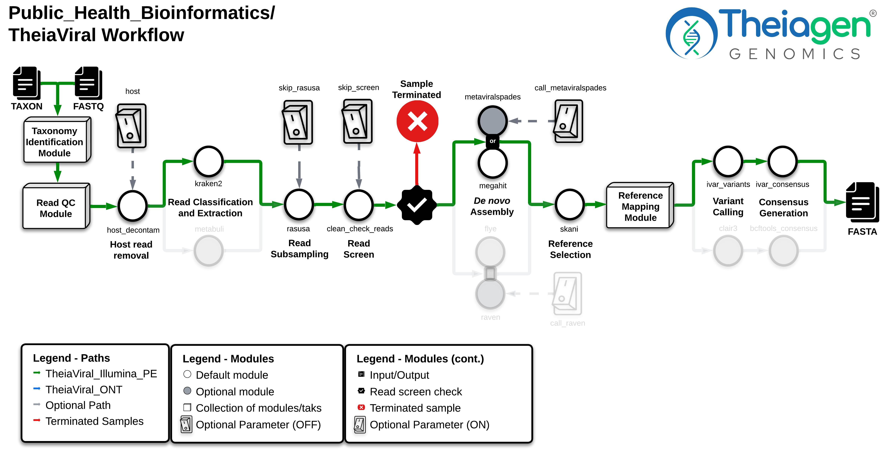

# TheiaViral Workflow Series

## Quick Facts

| **Workflow Type** | **Applicable Kingdom** | **Last Known Changes** | **Command-line Compatibility** | **Workflow Level** |
|---|---|---|---|---|
| [Genomic Characterization](../../workflows_overview/workflows_type.md/#genomic-characterization) | [Viral](../../workflows_overview/workflows_kingdom.md/#viral) | PHB vX.X.X | Yes | Sample-level |

## TheiaViral Workflows

The **TheiaViral** workflows are designed for the assembly, quality assessment, and characterization of **non-amplicon-based** viral genomes. The TheiaViral workflows are particularly well-suited for handling diverse or recombinant pathogens, such as rabies virus and norovirus, which often pose challenges for traditional reference-based assembly methods. This is because existing references often fail to adequately capture the genetic diversity present within a given sample. To address this, TheiaViral incorporates an unbiased reference selection step based on Average Nucleotide Identity (ANI). This step compares a de novo assembly of the sample against a comprehensive database of over 270,000 viral genomes, enabling selection of the most closely related reference. Currently, TheiaViral workflows perform variant calling and generate a consensus sequence, but additional downstream analyses are not yet implemented.

??? question "What are the main differences between the TheiaViral and TheiaCov workflows?"

    

    -   :material-database: **TheiaViral Workflows**

        ---

        * For non-amplicon-based viral genomes.
        * Supports relatively diverse and recombinant pathogens.
        * Utilizes an ANI-based reference selection from a *de novo* assembled genome.

    -   :material-database: **TheiaCov Workflows**

        ---

        * For tiled PCR - amplicon-based viral genomes.
        * Supports a limited number of [pathogens](../../workflows/genomic_characterization/theiacov.md/#supported-organisms).
        * Utilizes a preselected manually curated reference genome.

    

## TheiaViral Workflows for Different Input Types

-   
 **TheiaViral_Illumina_PE** 

    ---

    !!! dna "Illumina_PE Input Read Data"

        The TheiaViral_Illumina_PE workflow takes in Illumina paired-end read data. Read file names should end with `.fastq` or `.fq`, with the optional addition of `.gz`. When possible, Theiagen recommends zipping files with [gzip](https://www.gnu.org/software/gzip/) before Terra uploads to minimize data upload time.

        By default, the workflow anticipates 2 x 150bp reads (i.e. the input reads were generated using a 300-cycle sequencing kit). Modifications to the optional parameter for `trim_minlen` may be required to accommodate shorter read data, such as the 2 x 75bp reads generated using a 150-cycle sequencing kit.

-   
 **TheiaViral_ONT** 

    ---

    !!! dna_blue "ONT Input Read Data"

        The TheiaViral_ONT workflow takes in base-called ONT read data. Read file names should end with `.fastq` or `.fq`, with the optional addition of `.gz`. When possible, Theiagen recommends zipping files with [gzip](https://www.gnu.org/software/gzip/) before uploading to Terra to minimize data upload time.

        **The ONT sequencing kit and base-calling approach can produce substantial variability in the amount and quality of read data. Genome assemblies produced by the TheiaViral_ONT workflow must be quality assessed before reporting results.**

### Inputs

=== "Illumina_PE"

    

    | **Terra Task Name** | **Variable** | **Type** | **Description** | **Default Value** | **Terra Status** | **Workflow** |
    |---|---|---|---|---|---|---|
    | theiaviral_illumina_pe | **read1** | File | llumina forward read file in FASTQ file format (compression optional) | | Required | PE |
    | theiaviral_illumina_pe | **read2** | File | Illumina reverse read file in FASTQ file format (compression optional) | | Required | PE |
    | theiaviral_illumina_pe | **samplename** | String | Name of the sample being analyzed | | Required | PE |
    | theiaviral_illumina_pe | **taxon** | String | Taxon ID or organism name of interest | | Required | PE |
    | bwa | **cpu** | Int | Number of CPUs to allocate to the task | 6 | Optional | PE |
    | bwa | **disk_size** | Int | Amount of storage (in GB) to allocate to the task | 100 | Optional | PE |
    | bwa | **docker** | String | The Docker container to use for the task | us-docker.pkg.dev/general-theiagen/staphb/ivar:1.3.1-titan | Optional | PE |
    | bwa | **memory** | Int | Amount of memory/RAM (in GB) to allocate to the task | 16 | Optional | PE |
    | checkv_consensus | **checkv_db** | File | CheckV database file | "gs://theiagen-large-public-files-rp/terra/databases/checkv/checkv-db-v1.5.tar.gz" | Optional | PE, ONT |
    | checkv_consensus | **cpu** | Int | Number of CPUs allocated for the task | 2 | Optional | PE, ONT |
    | checkv_consensus | **disk_size** | Int | Disk size allocated for the task (in GB) | 100 | Optional | PE, ONT |
    | checkv_consensus | **docker** | String | Docker image used for the task | "us-docker.pkg.dev/general-theiagen/staphb/checkv:1.0.3" | Optional | PE, ONT |
    | checkv_consensus | **memory** | Int | Memory allocated for the task (in GB) | 8 | Optional | PE, ONT |
    | checkv_denovo | **checkv_db** | File | CheckV database file | "gs://theiagen-large-public-files-rp/terra/databases/checkv/checkv-db-v1.5.tar.gz" | Optional | PE, ONT |
    | checkv_denovo | **cpu** | Int | Number of CPUs allocated for the task | 2 | Optional | PE, ONT |
    | checkv_denovo | **disk_size** | Int | Disk size allocated for the task (in GB) | 100 | Optional | PE, ONT |
    | checkv_denovo | **docker** | String | Docker image used for the task | "us-docker.pkg.dev/general-theiagen/staphb/checkv:1.0.3" | Optional | PE, ONT |
    | checkv_denovo | **memory** | Int | Memory allocated for the task (in GB) | 8 | Optional | PE, ONT |
    | clean_check_reads | **cpu** | Int | Number of CPUs allocated for the task | 1 | Optional | PE, ONT |
    | clean_check_reads | **disk_size** | Int | Disk size allocated for the task (in GB) | 100 | Optional | PE, ONT |
    | clean_check_reads | **docker** | String | Docker image used for the task | "us-docker.pkg.dev/general-theiagen/bactopia/gather_samples:2.0.2" | Optional | PE, ONT |
    | clean_check_reads | **max_genome_length** | Int | Maximum genome length able to pass read screening | 2673870 | Optional | PE, ONT |
    | clean_check_reads | **memory** | Int | Memory allocated for the task (in GB) | 2 | Optional | PE, ONT |
    | clean_check_reads | **min_basepairs** | Int | Minimum base pairs to pass read screening | 15000 | Optional | PE, ONT |
    | clean_check_reads | **min_coverage** | Int | Minimum coverage to pass read screening | 10 | Optional | PE, ONT |
    | clean_check_reads | **min_genome_length** | Int | Minimum genome length to pass read screening | 1500 | Optional | PE, ONT |
    | clean_check_reads | **min_reads** | Int | Minimum reads to pass read screening | 50 | Optional | PE, ONT |
    | clean_check_reads | **min_proportion** | Int | Minimum read proportion to pass read screening | 40 | Optional | PE |
    | consensus | **char_unknown** | String | Character used to represent unknown bases in the consensus sequence | "N" | Optional | PE |
    | consensus | **count_orphans** | Boolean | True/False that determines if anomalous read pairs are NOT skipped in variant calling. Anomalous read pairs are those marked in the FLAG field as paired in sequencing but without the properly-paired flag set. | TRUE | Optional | PE |
    | consensus | **cpu** | Int | Number of CPUs allocated for the task | 2 | Optional | PE |
    | consensus | **disable_baq** | Boolean | True/False that determines if base alignment quality (BAQ) computation should be disabled during samtools mpileup before consensus generation | TRUE | Optional | PE |
    | consensus | **disk_size** | Int | Disk size allocated for the task (in GB) | 100 | Optional | PE |
    | consensus | **docker** | String | Docker image used for the task | "us-docker.pkg.dev/general-theiagen/staphb/ivar:1.3.1-titan" | Optional | PE |
    | consensus | **max_depth** | Int | For a given position, read at maximum INT number of reads per input file during samtools mpileup before consensus generation | 600000 | Optional | PE |
    | consensus | **memory** | Int | Memory allocated for the task (in GB) | 8 | Optional | PE |
    | consensus | **min_bq** | Int | Minimum base quality required for a base to be considered during samtools mpileup before consensus generation | 0 | Optional | PE |
    | consensus | **skip_N** | Boolean | True/False that determines if "N" bases should be skipped in the consensus sequence | FALSE | Optional | PE |
    | consensus_qc | **cpu** | Int | Number of CPUs allocated for the task | 1 | Optional | PE, ONT |
    | consensus_qc | **disk_size** | Int | Disk size allocated for the task (in GB) | 100 | Optional | PE, ONT |
    | consensus_qc | **docker** | String | Docker image used for the task | "us-docker.pkg.dev/general-theiagen/theiagen/utility:1.1" | Optional | PE, ONT |
    | consensus_qc | **memory** | Int | Memory allocated for the task (in GB) | 2 | Optional | PE, ONT |
    | ivar_variants | **cpu** | Int | Number of CPUs allocated for the task | 2 | Optional | PE |
    | ivar_variants | **disk_size** | Int | Disk size allocated for the task (in GB) | 100 | Optional | PE |
    | ivar_variants | **docker** | String | Docker image used for the task | "us-docker.pkg.dev/general-theiagen/staphb/ivar:1.3.1-titan" | Optional | PE |
    | ivar_variants | **memory** | Int | Memory allocated for the task (in GB) | 8 | Optional | PE |
    | ivar_variants | **reference_gff** | File | A GFF file in the GFF3 format can be supplied to specify coordinates of open reading frames (ORFs) so iVar can identify codons and translate variants into amino acids | | Optional | PE |
    | megahit | **cpu** | Int | Number of CPUs allocated for the task | 4 | Optional | PE |
    | megahit | **disk_size** | Int | Disk size allocated for the task (in GB) | 100 | Optional | PE |
    | megahit | **docker** | String | Docker image used for the task | "us-docker.pkg.dev/general-theiagen/theiagen/megahit:1.2.9" | Optional | PE |
    | megahit | **kmers** | String | Comma-separated list of kmer sizes to use for assembly. All must be odd, in the range 15-255, increment <= 28 | "21,29,39,59,79,99,119,141" | Optional | PE |
    | megahit | **megahit_opts** | String | Additional parameters for Megahit assembler | | Optional | PE |
    | megahit | **memory** | Int | Memory allocated for the task (in GB) | 16 | Optional | PE |
    | ncbi_datasets | **cpu** | Int | Number of CPUs allocated for the task | 1 | Optional | PE, ONT |
    | ncbi_datasets | **disk_size** | Int | Disk size allocated for the task (in GB) | 50 | Optional | PE, ONT |
    | ncbi_datasets | **docker** | String | Docker image used for the task | "us-docker.pkg.dev/general-theiagen/staphb/ncbi-datasets:16.38.1" | Optional | PE, ONT |
    | ncbi_datasets | **include_gbff** | Boolean | True/False to include gbff files in the output | FALSE | Optional | PE, ONT |
    | ncbi_datasets | **include_gff3** | Boolean | True/False to include gff3 files in the output | FALSE | Optional | PE, ONT |
    | ncbi_datasets | **memory** | Int | Memory allocated for the task (in GB) | 4 | Optional | PE, ONT |
    | ncbi_identify | **cpu** | Int | Number of CPUs allocated for the task | 1 | Optional | PE, ONT |
    | ncbi_identify | **disk_size** | Int | Disk size allocated for the task (in GB) | 50 | Optional | PE, ONT |
    | ncbi_identify | **docker** | String | Docker image used for the task | "us-docker.pkg.dev/general-theiagen/staphb/ncbi-datasets:16.38.1" | Optional | PE, ONT |
    | ncbi_identify | **memory** | Int | Memory allocated for the task (in GB) | 4 | Optional | PE, ONT |
    | ncbi_taxon_summary | **cpu** | Int | Number of CPUs allocated for the task | 1 | Optional | PE, ONT |
    | ncbi_taxon_summary | **disk_size** | Int | Disk size allocated for the task (in GB) | 50 | Optional | PE, ONT |
    | ncbi_taxon_summary | **docker** | String | Docker image used for the task | "us-docker.pkg.dev/general-theiagen/staphb/ncbi-datasets:16.38.1" | Optional | PE, ONT |
    | ncbi_taxon_summary | **memory** | Int | Memory allocated for the task (in GB) | 4 | Optional | PE, ONT |
    | quast_denovo | **cpu** | Int | Number of CPUs allocated for the task | 2 | Optional | PE, ONT |
    | quast_denovo | **disk_size** | Int | Disk size allocated for the task (in GB) | 100 | Optional | PE, ONT |
    | quast_denovo | **docker** | String | Docker image used for the task | "us-docker.pkg.dev/general-theiagen/staphb/quast:5.0.2" | Optional | PE, ONT |
    | quast_denovo | **memory** | Int | Memory allocated for the task (in GB) | 2 | Optional | PE, ONT |
    | quast_denovo | **min_contig_length** | Int | Lower threshold for a contig length in bp. Shorter contigs won’t be taken into account | 500 | Optional | PE, ONT |
    | rasusa | **bases** | String | Explicitly set the number of bases required e.g., 4.3kb, 7Tb, 9000, 4.1MB. If this option is given, --coverage and --genome-size are ignored | | Optional | PE, ONT |
    | rasusa | **coverage** | Float | The desired coverage to sub-sample the reads to. If --bases is not provided, this option and --genome-size are required | 250 | Optional | PE, ONT |
    | rasusa | **cpu** | Int | Number of CPUs allocated for the task | 4 | Optional | PE, ONT |
    | rasusa | **disk_size** | Int | Disk size allocated for the task (in GB) | 100 | Optional | PE, ONT |
    | rasusa | **docker** | String | Docker image used for the task | "us-docker.pkg.dev/general-theiagen/staphb/rasusa:2.1.0" | Optional | PE, ONT |
    | rasusa | **frac** | Float | Subsample to a fraction of the reads - e.g., 0.5 samples half the reads | | Optional | PE, ONT |
    | rasusa | **memory** | Int | Memory allocated for the task (in GB) | 8 | Optional | PE, ONT |
    | rasusa | **num** | Int | Subsample to a specific number of reads | | Optional | PE, ONT |
    | rasusa | **seed** | Int | Random seed for reproducibility | | Optional | PE, ONT |
    | read_mapping_stats | **cpu** | Int | Number of CPUs allocated for the task | 2 | Optional | PE, ONT |
    | read_mapping_stats | **disk_size** | Int | Disk size allocated for the task (in GB) | 100 | Optional | PE, ONT |
    | read_mapping_stats | **docker** | String | Docker image used for the task | "us-docker.pkg.dev/general-theiagen/staphb/samtools:1.15" | Optional | PE, ONT |
    | read_mapping_stats | **memory** | Int | Memory allocated for the task (in GB) | 8 | Optional | PE, ONT |
    | read_QC_trim | **adapters** | File | A file containing the sequence of the adapters used during library preparation, used in the BBDuk task |  | Optional | PE |
    | read_QC_trim | **bbduk_memory** | Int | Memory allocated for the BBDuk task (in GB) | 8 | Optional | PE |
    | read_QC_trim | **call_kraken** | Boolean | Internal component, do not modify | | Do not modify, Optional | PE |
    | read_QC_trim | **call_midas** | Boolean | Internal component, do not modify | | Do not modify, Optional | PE |
    | read_QC_trim | **fastp_args** | String | Additional parameters for fastp | | Optional | PE |
    | read_QC_trim | **kraken_cpu** | Int | Number of CPUs allocated for the Kraken2 task | 4 | Optional | PE |
    | read_QC_trim | **kraken_disk_size** | Int | Disk size allocated for the Kraken2 task (in GB) | 100 | Optional | PE |
    | read_QC_trim | **kraken_memory** | Int | Memory allocated for the Kraken2 task (in GB) | 32 | Optional | PE |
    | read_QC_trim | **midas_db** | File | Internal component, do not modify | | Do not modify, Optional | PE |
    | read_QC_trim | **phix** | File | A file containing the phix used during Illumina sequencing; used in the BBDuk task |  | Optional | PE |
    | read_QC_trim | **read_processing** | String | Read trimming software to use, either "trimmomatic" or "fastp" | "trimmomatic" | Optional | PE |
    | read_QC_trim | **read_qc** | String | Allows the user to decide between "fastq_scan" (default) and "fastqc" for the evaluation of read quality. | "fastq_scan" | Optional | PE |
    | read_QC_trim | **target_organism** | String | Internal component, do not modify | | Do not modify, Optional | PE |
    | read_QC_trim | **trim_min_length** | Int | Specifies minimum length of each read after trimming to be kept | 75 | Optional | PE |
    | read_QC_trim | **trim_quality_min_score** | Int | Specifies the minimum average quality of bases in a sliding window to be kept | 30 | Optional | PE |
    | read_QC_trim | **trim_window_size** | Int | Specifies window size for trimming (the number of bases to average the quality across) | 4 | Optional | PE |
    | read_QC_trim | **trimmomatic_args** | String | Additional arguments to pass to trimmomatic. "-phred33" specifies the Phred Q score encoding which is almost always phred33 with modern sequence data. | -phred33 | Optional | PE |
    | skani | **cpu** | Int | Number of CPUs allocated for the task | 2 | Optional | PE, ONT |
    | skani | **disk_size** | Int | Disk size allocated for the task (in GB) | 100 | Optional | PE, ONT |
    | skani | **docker** | String | Docker image used for the task | "us-docker.pkg.dev/general-theiagen/staphb/skani:0.2.2" | Optional | PE, ONT |
    | skani | **memory** | Int | Memory allocated for the task (in GB) | 4 | Optional | PE, ONT |
    | skani | **skani_db** | File | Skani database file | "gs://theiagen-large-public-files-rp/terra/databases/skani/skani_db_20250325.tar" | Optional | PE, ONT |
    | spades | **cpu** | Int | Number of CPUs allocated for the task | 4 | Optional | PE |
    | spades | **disk_size** | Int | Disk size allocated for the task (in GB) | 100 | Optional | PE |
    | spades | **docker** | String | Docker image used for the task | "us-docker.pkg.dev/general-theiagen/staphb/spades:4.1.0" | Optional | PE |
    | spades | **kmers** | String | list of k-mer sizes (must be odd and less than 128) | "auto" | Optional | PE |
    | spades | **memory** | Int | Memory allocated for the task (in GB) | 16 | Optional | PE |
    | spades | **phred_offset** | Int | PHRED quality offset in the input reads (33 or 64) | 33 | Optional | PE |
    | spades | **spades_opts** | String | Additional parameters for Spades assembler | | Optional | PE |
    | theiaviral_illumina_pe | **extract_unclassified** | Boolean | True/False that determines if unclassified reads should be extracted and combined with the taxon specific extracted reads | FALSE | Optional | PE |
    | theiaviral_illumina_pe | **genome_length** | Int | Expected genome length of taxon of interest | | Optional | PE |
    | theiaviral_illumina_pe | **kraken_db** | File | Kraken2 database file | "gs://theiagen-public-resources-rp/reference_data/databases/kraken2/kraken2_humanGRCh38_viralRefSeq_20240828.tar.gz" | Optional | PE |
    | theiaviral_illumina_pe | **min_allele_freq** | Float | Minimum allele frequency required for a variant to populate the consensus sequence | 0.6 | Optional | PE |
    | theiaviral_illumina_pe | **min_depth** | Int | Minimum read depth required for a variant to populate the consensus sequence | 10 | Optional | PE |
    | theiaviral_illumina_pe | **min_map_quality** | Int | Minimum mapping quality required for read alignments | 20 | Optional | PE |
    | theiaviral_illumina_pe | **read_extraction_rank** | String | Taxonomic rank to use for read extraction - limits taxons to only those within the specified ranks. | "family" | Optional | PE |
    | theiaviral_illumina_pe | **reference_fasta** | File | Reference genome in FASTA format | | Optional | PE |
    | theiaviral_illumina_pe | **skip_metaviralspades** | Boolean | True/False to skip assembly with Metaviralspades and instead use Megahit | FALSE | Optional | PE |
    | theiaviral_illumina_pe | **skip_rasusa** | Boolean | True/False to skip read subsampling with Rasusa | FALSE | Optional | PE |
    | theiaviral_illumina_pe | **skip_screen** | Boolean | True/False to skip read screening check prior to analysis | FALSE | Optional | PE |
    | version_capture | **timezone** | String | Set the time zone to get an accurate date of analysis (uses UTC by default) | | Optional | PE, ONT |

    

=== "ONT"

    

    | **Terra Task Name** | **Variable** | **Type** | **Description** | **Default Value** | **Terra Status** | **Workflow** |
    |---|---|---|---|---|---|---|
    | theiaviral_ont | **read1** | File | Base-called ONT read file in FASTQ file format (compression optional) | | Required | ONT |
    | theiaviral_ont | **samplename** | String | Name of the sample being analyzed | | Required | ONT |
    | theiaviral_ont | **taxon** | String | Taxon ID or organism name of interest | | Required | ONT |
    | bcftools_consensus | **cpu** | Int | Number of CPUs allocated for the task | 2 | Optional | ONT |
    | bcftools_consensus | **disk_size** | Int | Disk size allocated for the task (in GB) | 100 | Optional | ONT |
    | bcftools_consensus | **docker** | String | Docker image used for the task | "us-docker.pkg.dev/general-theiagen/staphb/bcftools:1.20" | Optional | ONT |
    | bcftools_consensus | **memory** | Int | Memory allocated for the task (in GB) | 4 | Optional | ONT |
    | checkv_consensus | **checkv_db** | File | CheckV database file | "gs://theiagen-large-public-files-rp/terra/databases/checkv/checkv-db-v1.5.tar.gz" | Optional | PE, ONT |
    | checkv_consensus | **cpu** | Int | Number of CPUs allocated for the task | 2 | Optional | PE, ONT |
    | checkv_consensus | **disk_size** | Int | Disk size allocated for the task (in GB) | 100 | Optional | PE, ONT |
    | checkv_consensus | **docker** | String | Docker image used for the task | "us-docker.pkg.dev/general-theiagen/staphb/checkv:1.0.3" | Optional | PE, ONT |
    | checkv_consensus | **memory** | Int | Memory allocated for the task (in GB) | 8 | Optional | PE, ONT |
    | checkv_denovo | **checkv_db** | File | CheckV database file | "gs://theiagen-large-public-files-rp/terra/databases/checkv/checkv-db-v1.5.tar.gz" | Optional | PE, ONT |
    | checkv_denovo | **cpu** | Int | Number of CPUs allocated for the task | 2 | Optional | PE, ONT |
    | checkv_denovo | **disk_size** | Int | Disk size allocated for the task (in GB) | 100 | Optional | PE, ONT |
    | checkv_denovo | **docker** | String | Docker image used for the task | "us-docker.pkg.dev/general-theiagen/staphb/checkv:1.0.3" | Optional | PE, ONT |
    | checkv_denovo | **memory** | Int | Memory allocated for the task (in GB) | 8 | Optional | PE, ONT |
    | clair3 | **clair3_model** | String | Model to be used by Clair3 | "r941_prom_hac_g360+g422" | Optional | ONT |
    | clair3 | **cpu** | Int | Number of CPUs allocated for the task | 4 | Optional | ONT |
    | clair3 | **disable_phasing** | Boolean | True/False that determines if variants should be called without whatshap phasing in full alignment calling | TRUE | Optional | ONT |
    | clair3 | **disk_size** | Int | Disk size allocated for the task (in GB) | 100 | Optional | ONT |
    | clair3 | **docker** | String | Docker image used for the task | "us-docker.pkg.dev/general-theiagen/theiagen/clair3-extra-models:1.0.10" | Optional | ONT |
    | clair3 | **enable_gvcf** | Boolean | True/False that determines if an additional GVCF output should generated | FALSE | Optional | ONT |
    | clair3 | **enable_haploid_precise** | Boolean | True/False that determines haploid calling mode where only 1/1 is considered as a variant | TRUE | Optional | ONT |
    | clair3 | **include_all_contigs** | Boolean | True/False that determines if all contigs should be included in the output | TRUE | Optional | ONT |
    | clair3 | **indel_min_af** | Float | Minimum Indel AF required for a candidate variant | 0.08 | Optional | ONT |
    | clair3 | **memory** | Int | Memory allocated for the task (in GB) | 8 | Optional | ONT |
    | clair3 | **snp_min_af** | Float | Minimum SNP AF required for a candidate variant | 0.08 | Optional | ONT |
    | clair3 | **variant_quality** | Int | If set, variants with >$qual will be marked PASS, or LowQual otherwise | 2 | Optional | ONT |
    | clean_check_reads | **cpu** | Int | Number of CPUs allocated for the task | 1 | Optional | PE, ONT |
    | clean_check_reads | **disk_size** | Int | Disk size allocated for the task (in GB) | 100 | Optional | PE, ONT |
    | clean_check_reads | **docker** | String | Docker image used for the task | "us-docker.pkg.dev/general-theiagen/bactopia/gather_samples:2.0.2" | Optional | PE, ONT |
    | clean_check_reads | **max_genome_length** | Int | Maximum genome length able to pass read screening | 2673870 | Optional | PE, ONT |
    | clean_check_reads | **memory** | Int | Memory allocated for the task (in GB) | 2 | Optional | PE, ONT |
    | clean_check_reads | **min_basepairs** | Int | Minimum base pairs to pass read screening | 15000 | Optional | PE, ONT |
    | clean_check_reads | **min_coverage** | Int | Minimum coverage to pass read screening | 10 | Optional | PE, ONT |
    | clean_check_reads | **min_genome_length** | Int | Minimum genome length to pass read screening | 1500 | Optional | PE, ONT |
    | clean_check_reads | **min_reads** | Int | Minimum reads to pass read screening | 50 | Optional | PE, ONT |
    | clean_check_reads | **skip_mash** | Boolean | True/False that determines if mash should be skipped in the screen task. | TRUE | Optional | ONT |
    | consensus_qc | **cpu** | Int | Number of CPUs allocated for the task | 1 | Optional | PE, ONT |
    | consensus_qc | **disk_size** | Int | Disk size allocated for the task (in GB) | 100 | Optional | PE, ONT |
    | consensus_qc | **docker** | String | Docker image used for the task | "us-docker.pkg.dev/general-theiagen/theiagen/utility:1.1" | Optional | PE, ONT |
    | consensus_qc | **memory** | Int | Memory allocated for the task (in GB) | 2 | Optional | PE, ONT |
    | fasta_utilities | **cpu** | Int | Number of CPUs allocated for the task | 1 | Optional | ONT |
    | fasta_utilities | **disk_size** | Int | Disk size allocated for the task (in GB) | 10 | Optional | ONT |
    | fasta_utilities | **docker** | String | Docker image used for the task | "us-docker.pkg.dev/general-theiagen/biocontainers/seqkit:2.4.0--h9ee0642_0" | Optional | ONT |
    | fasta_utilities | **memory** | Int | Memory allocated for the task (in GB) | 2 | Optional | ONT |
    | flye | **additional_parameters** | String | Additional parameters for Flye assembler | | Optional | ONT |
    | flye | **asm_coverage** | Int | Reduced coverage for initial disjointig assembly | | Optional | ONT |
    | flye | **cpu** | Int | Number of CPUs allocated for the task | 4 | Optional | ONT |
    | flye | **disk_size** | Int | Disk size allocated for the task (in GB) | 100 | Optional | ONT |
    | flye | **docker** | String | Docker image used for the task | "us-docker.pkg.dev/general-theiagen/staphb/flye:2.9.4" | Optional | ONT |
    | flye | **flye_polishing_iterations** | Int | Number of polishing iterations | 1 | Optional | ONT |
    | flye | **genome_length** | Int | Expected genome length for assembly - requires `asm_coverage` | | Optional | ONT |
    | flye | **keep_haplotypes** | Boolean | True/False to prevent collapsing alternative haplotypes | FALSE | Optional | ONT |
    | flye | **memory** | Int | Memory allocated for the task (in GB) | 32 | Optional | ONT |
    | flye | **minimum_overlap** | Int | Minimum overlap between reads | | Optional | ONT |
    | flye | **no_alt_contigs** | Boolean | True/False to disable alternative contig generation | FALSE | Optional | ONT |
    | flye | **read_error_rate** | Float | Expected error rate in reads | | Optional | ONT |
    | flye | **read_type** | String | Type of read data for Flye | "--nano-hq" | Optional | ONT |
    | flye | **scaffold** | Boolean | True/False to enable scaffolding using graph | FALSE | Optional | ONT |
    | mask_low_coverage | **cpu** | Int | Number of CPUs allocated for the task | 2 | Optional | ONT |
    | mask_low_coverage | **disk_size** | Int | Disk size allocated for the task (in GB) | 100 | Optional | ONT |
    | mask_low_coverage | **docker** | String | Docker image used for the task | "us-docker.pkg.dev/general-theiagen/staphb/bedtools:2.31.0" | Optional | ONT |
    | mask_low_coverage | **memory** | Int | Memory allocated for the task (in GB) | 8 | Optional | ONT |
    | metabuli | **cpu** | Int | Number of CPUs allocated for the task | 4 | Optional | ONT |
    | metabuli | **disk_size** | Int | Disk size allocated for the task (in GB) | 100 | Optional | ONT |
    | metabuli | **docker** | String | Docker image used for the task | "us-docker.pkg.dev/general-theiagen/theiagen/metabuli:1.1.0" | Optional | ONT |
    | metabuli | **extract_unclassified** | Boolean | True/False that determines if unclassified reads should be extracted and combined with the taxon specific extracted reads | FALSE | Optional | ONT |
    | metabuli | **memory** | Int | Memory allocated for the task (in GB) | 8 | Optional | ONT |
    | metabuli | **metabuli_db** | File | Metabuli database file | "gs://theiagen-large-public-files-rp/terra/databases/metabuli/refseq_virus-v223.tar.gz" | Optional | ONT |
    | metabuli | **min_cov** | Float | Minimum query coverage threshold (0.0 - 1.0) | 0.0 | Optional | ONT |
    | metabuli | **min_score** | Float | Minimum sequenece similarity score (0.0 - 1.0) | 0.0 | Optional | ONT |
    | metabuli | **min_sp_score** | Float | Minimum score for species- or lower-level classification | 0.0 | Optional | ONT |
    | metabuli | **taxonomy_path** | File | Path to taxonomy file | "gs://theiagen-large-public-files-rp/terra/databases/metabuli/new_taxdump.tar.gz" | Optional | ONT |
    | minimap2 | **cpu** | Int | Number of CPUs allocated for the task | 2 | Optional | ONT |
    | minimap2 | **disk_size** | Int | Disk size allocated for the task (in GB) | 100 | Optional | ONT |
    | minimap2 | **docker** | String | Docker image used for the task | "us-docker.pkg.dev/general-theiagen/staphb/minimap2:2.22" | Optional | ONT |
    | minimap2 | **memory** | Int | Memory allocated for the task (in GB) | 8 | Optional | ONT |
    | minimap2 | **query2** | File | Internal component. Do not modify | | Optional | ONT |
    | nanoplot_clean | **cpu** | Int | Number of CPUs allocated for the task | 4 | Optional | ONT |
    | nanoplot_clean | **disk_size** | Int | Disk size allocated for the task (in GB) | 100 | Optional | ONT |
    | nanoplot_clean | **docker** | String | Docker image used for the task | "us-docker.pkg.dev/general-theiagen/staphb/nanoplot:1.40.0" | Optional | ONT |
    | nanoplot_clean | **max_length** | Int | Maximum read length for plotting | 100000 | Optional | ONT |
    | nanoplot_clean | **memory** | Int | Memory allocated for the task (in GB) | 16 | Optional | ONT |
    | nanoplot_raw | **cpu** | Int | Number of CPUs allocated for the task | 4 | Optional | ONT |
    | nanoplot_raw | **disk_size** | Int | Disk size allocated for the task (in GB) | 100 | Optional | ONT |
    | nanoplot_raw | **docker** | String | Docker image used for the task | "us-docker.pkg.dev/general-theiagen/staphb/nanoplot:1.40.0" | Optional | ONT |
    | nanoplot_raw | **max_length** | Int | Maximum read length for plotting | 100000 | Optional | ONT |
    | nanoplot_raw | **memory** | Int | Memory allocated for the task (in GB) | 16 | Optional | ONT |
    | nanoq | **cpu** | Int | Number of CPUs allocated for the task | 2 | Optional | ONT |
    | nanoq | **disk_size** | Int | Disk size allocated for the task (in GB) | 100 | Optional | ONT |
    | nanoq | **docker** | String | Docker image used for the task | "us-docker.pkg.dev/general-theiagen/biocontainers/nanoq:0.9.0--hec16e2b_1" | Optional | ONT |
    | nanoq | **max_read_length** | Int | Maximum read length to keep | 100000 | Optional | ONT |
    | nanoq | **max_read_qual** | Int | Maximum read quality to keep | 10 | Optional | ONT |
    | nanoq | **memory** | Int | Memory allocated for the task (in GB) | 2 | Optional | ONT |
    | nanoq | **min_read_length** | Int | Minimum read length to keep | 500 | Optional | ONT |
    | nanoq | **min_read_qual** | Int | Minimum read quality to keep | 10 | Optional | ONT |
    | ncbi_datasets | **cpu** | Int | Number of CPUs allocated for the task | 1 | Optional | PE, ONT |
    | ncbi_datasets | **disk_size** | Int | Disk size allocated for the task (in GB) | 50 | Optional | PE, ONT |
    | ncbi_datasets | **docker** | String | Docker image used for the task | "us-docker.pkg.dev/general-theiagen/staphb/ncbi-datasets:16.38.1" | Optional | PE, ONT |
    | ncbi_datasets | **include_gbff** | Boolean | True/False to include gbff files in the output | FALSE | Optional | PE, ONT |
    | ncbi_datasets | **include_gff3** | Boolean | True/False to include gff3 files in the output | FALSE | Optional | PE, ONT |
    | ncbi_datasets | **memory** | Int | Memory allocated for the task (in GB) | 4 | Optional | PE, ONT |
    | ncbi_identify | **cpu** | Int | Number of CPUs allocated for the task | 1 | Optional | PE, ONT |
    | ncbi_identify | **disk_size** | Int | Disk size allocated for the task (in GB) | 50 | Optional | PE, ONT |
    | ncbi_identify | **docker** | String | Docker image used for the task | "us-docker.pkg.dev/general-theiagen/staphb/ncbi-datasets:16.38.1" | Optional | PE, ONT |
    | ncbi_identify | **memory** | Int | Memory allocated for the task (in GB) | 4 | Optional | PE, ONT |
    | ncbi_scrub_se | **cpu** | Int | Number of CPUs allocated for the task | 4 | Optional | ONT |
    | ncbi_scrub_se | **disk_size** | Int | Disk size allocated for the task (in GB) | 100 | Optional | ONT |
    | ncbi_scrub_se | **docker** | String | Docker image used for the task | "us-docker.pkg.dev/general-theiagen/ncbi/sra-human-scrubber:2.2.1" | Optional | ONT |
    | ncbi_scrub_se | **memory** | Int | Memory allocated for the task (in GB) | 8 | Optional | ONT |
    | ncbi_taxon_summary | **cpu** | Int | Number of CPUs allocated for the task | 1 | Optional | PE, ONT |
    | ncbi_taxon_summary | **disk_size** | Int | Disk size allocated for the task (in GB) | 50 | Optional | PE, ONT |
    | ncbi_taxon_summary | **docker** | String | Docker image used for the task | "us-docker.pkg.dev/general-theiagen/staphb/ncbi-datasets:16.38.1" | Optional | PE, ONT |
    | ncbi_taxon_summary | **memory** | Int | Memory allocated for the task (in GB) | 4 | Optional | PE, ONT |
    | parse_mapping | **cpu** | Int | Number of CPUs allocated for the task | 2 | Optional | ONT |
    | parse_mapping | **disk_size** | Int | Disk size allocated for the task (in GB) | 100 | Optional | ONT |
    | parse_mapping | **docker** | String | Docker image used for the task | "us-docker.pkg.dev/general-theiagen/staphb/samtools:1.17" | Optional | ONT |
    | parse_mapping | **memory** | Int | Memory allocated for the task (in GB) | 8 | Optional | ONT |
    | porechop | **cpu** | Int | Number of CPUs allocated for the task | 4 | Optional | ONT |
    | porechop | **disk_size** | Int | Disk size allocated for the task (in GB) | 100 | Optional | ONT |
    | porechop | **docker** | String | Docker image used for the task | "us-docker.pkg.dev/general-theiagen/staphb/porechop:0.2.4" | Optional | ONT |
    | porechop | **memory** | Int | Memory allocated for the task (in GB) | 16 | Optional | ONT |
    | porechop | **trimopts** | String | Additional trimming options for Porechop | | Optional | ONT |
    | quast_denovo | **cpu** | Int | Number of CPUs allocated for the task | 2 | Optional | PE, ONT |
    | quast_denovo | **disk_size** | Int | Disk size allocated for the task (in GB) | 100 | Optional | PE, ONT |
    | quast_denovo | **docker** | String | Docker image used for the task | "us-docker.pkg.dev/general-theiagen/staphb/quast:5.0.2" | Optional | PE, ONT |
    | quast_denovo | **memory** | Int | Memory allocated for the task (in GB) | 2 | Optional | PE, ONT |
    | quast_denovo | **min_contig_length** | Int | Lower threshold for a contig length in bp. Shorter contigs won’t be taken into account | 500 | Optional | PE, ONT |
    | rasusa | **bases** | String | Explicitly set the number of bases required e.g., 4.3kb, 7Tb, 9000, 4.1MB. If this option is given, --coverage and --genome-size are ignored | | Optional | PE, ONT |
    | rasusa | **coverage** | Float | The desired coverage to sub-sample the reads to. If --bases is not provided, this option and --genome-size are required | 250 | Optional | PE, ONT |
    | rasusa | **cpu** | Int | Number of CPUs allocated for the task | 4 | Optional | PE, ONT |
    | rasusa | **disk_size** | Int | Disk size allocated for the task (in GB) | 100 | Optional | PE, ONT |
    | rasusa | **docker** | String | Docker image used for the task | "us-docker.pkg.dev/general-theiagen/staphb/rasusa:2.1.0" | Optional | PE, ONT |
    | rasusa | **frac** | Float | Subsample to a fraction of the reads - e.g., 0.5 samples half the reads | | Optional | PE, ONT |
    | rasusa | **memory** | Int | Memory allocated for the task (in GB) | 8 | Optional | PE, ONT |
    | rasusa | **num** | Int | Subsample to a specific number of reads | | Optional | PE, ONT |
    | rasusa | **read2** | File | Internal component, do not modify | | Do not modify, Optional | ONT |
    | rasusa | **seed** | Int | Random seed for reproducibility | | Optional | PE, ONT |
    | raven | **cpu** | Int | Number of CPUs allocated for the task | 4 | Optional | ONT |
    | raven | **disk_size** | Int | Disk size allocated for the task (in GB) | 100 | Optional | ONT |
    | raven | **docker** | String | Docker image used for the task | "us-docker.pkg.dev/general-theiagen/theiagen/raven:1.8.3" | Optional | ONT |
    | raven | **memory** | Int | Memory allocated for the task (in GB) | 16 | Optional | ONT |
    | raven | **raven_identity** | Float | Threshold for overlap between two reads in order to construct an edge between them | 0.0 | Optional | ONT |
    | raven | **raven_opts** | Int | Additional parameters for Raven assembler | | Optional | ONT |
    | raven | **raven_polishing_iterations** | Int | Number of polishing iterations | 2 | Optional | ONT |
    | read_mapping_stats | **cpu** | Int | Number of CPUs allocated for the task | 2 | Optional | PE, ONT |
    | read_mapping_stats | **disk_size** | Int | Disk size allocated for the task (in GB) | 100 | Optional | PE, ONT |
    | read_mapping_stats | **docker** | String | Docker image used for the task | "us-docker.pkg.dev/general-theiagen/staphb/samtools:1.15" | Optional | PE, ONT |
    | read_mapping_stats | **memory** | Int | Memory allocated for the task (in GB) | 8 | Optional | PE, ONT |
    | skani | **cpu** | Int | Number of CPUs allocated for the task | 2 | Optional | PE, ONT |
    | skani | **disk_size** | Int | Disk size allocated for the task (in GB) | 100 | Optional | PE, ONT |
    | skani | **docker** | String | Docker image used for the task | "us-docker.pkg.dev/general-theiagen/staphb/skani:0.2.2" | Optional | PE, ONT |
    | skani | **memory** | Int | Memory allocated for the task (in GB) | 4 | Optional | PE, ONT |
    | skani | **skani_db** | File | Skani database file | "gs://theiagen-large-public-files-rp/terra/databases/skani/skani_db_20250325.tar" | Optional | PE, ONT |
    | theiaviral_ont | **call_porechop** | Boolean | True/False to trim adapters with porechop | FALSE | Optional | ONT |
    | theiaviral_ont | **genome_length** | Int | Expected genome length of taxon of interest | | Optional | ONT |
    | theiaviral_ont | **min_allele_freq** | Float | Minimum allele frequency required for a variant to populate the consensus sequence | 0.6 | Optional | ONT |
    | theiaviral_ont | **min_depth** | Int | Minimum read depth required for a variant to populate the consensus sequence | 10 | Optional | ONT |
    | theiaviral_ont | **min_map_quality** | Int | Minimum mapping quality required for read alignments | 20 | Optional | ONT |
    | theiaviral_ont | **read_extraction_rank** | String | Taxonomic rank to use for read extraction - limits taxons to only those within the specified ranks. | "family" | Optional | ONT |
    | theiaviral_ont | **reference_fasta** | File | Reference genome in FASTA format | | Optional | ONT |
    | theiaviral_ont | **skip_rasusa** | Boolean | True/False to skip read subsampling with Rasusa | FALSE | Optional | ONT |
    | theiaviral_ont | **skip_raven** | Boolean | True/False to skip assembly with Raven and instead use Flye | FALSE | Optional | ONT |
    | theiaviral_ont | **skip_screen** | Boolean | True/False to skip read screening check prior to analysis | FALSE | Optional | ONT |
    | version_capture | **docker** | String | Docker image used for the task | "us-docker.pkg.dev/general-theiagen/theiagen/alpine-plus-bash:3.20.0" | Optional | ONT |
    | version_capture | **timezone** | String | Set the time zone to get an accurate date of analysis (uses UTC by default) | | Optional | PE, ONT |

    

### Core Tasks

=== "Illumina_PE"

    ??? toggle "Versioning"

        

        -   ??? task "`versioning`"

                The `versioning` task captures the workflow version from the GitHub (code repository) version.

                ??? techdetails "Version Capture Technical details"
                    |  | Links |
                    | --- | --- |
                    | Task | [task_versioning.wdl](https://github.com/theiagen/public_health_bioinformatics/blob/main/tasks/task_versioning.wdl) |

        

    ??? toggle "Taxonomic Identification"

        

        -   ??? task "`ncbi_identify`"

                The `ncbi_identify` task utilizes the [`NCBI Datasets`](https://www.ncbi.nlm.nih.gov/datasets/docs/v2/reference-docs/data-packages/taxonomy/) package to search the NCBI Viral Genome Database to acquire metadata based on a user's taxonomic input. This task will always return a taxon ID, name, and rank, and it facilitates multiple downstream functions, including **read classification and targeted read extraction**.

                ??? dna "`taxon`"
                    This parameter accepts either a NCBI taxon ID (e.g. `11292`) or an organism name (e.g. `Lyssavirus rabies`).

                ??? dna "`rank` a.k.a `read_extraction_rank`"
                    Valid options include: `"species"`, `"genus"`, `"family"`, `"order"`, `"class"`, `"phylum"`, `"kingdom"`, or `"domain"`. By default it is set to `"family"`. This parameter filters metadata to report information only at the taxonomic `rank` specified by the user, regardless of the taxonomic level implied by the original input `taxon`.

                ???+ warning "Important"
                    - The `rank` parameter must specify a taxonomic level that is equal to or broader than the input organism's taxonomic level.

                    **Examples:**

                    - If your input `taxon` is `"Lyssavirus rabies"` (species level) with `rank` set to `"family"`, the task will return the family-level information: taxon ID for *Rhabdoviridae*, name "Rhabdoviridae", and rank "family".
                    - If your input `taxon` is `"Lyssavirus"` (genus level) with `rank` set to `"species"`, the task will fail because it cannot determine species-level information from a genus-level input.

                ??? techdetails "NCBI Datasets Technical Details"
                    |  | Links |
                    | --- | --- |
                    | Task | [task_identify_taxon_id.wdl](https://github.com/theiagen/public_health_bioinformatics/blob/main/tasks/taxon_id/task_identify_taxon_id.wdl) |
                    | Software Source Code | [NCBI Datasets on GitHub](https://github.com/ncbi/datasets) |
                    | Software Documentation | [NCBI Datasets Documentation on NCBI](https://www.ncbi.nlm.nih.gov/datasets/docs/v2/) |
                    | Original Publication(s) | [Exploring and retrieving sequence and metadata for species across the tree of life with NCBI Datasets](https://doi.org/10.1038/s41597-024-03571-y) |

        

        

        -   ??? task "`ncbi_taxon_summary`"

                The `ncbi_taxon_summary` task utilizes the [`NCBI Datasets`](https://www.ncbi.nlm.nih.gov/datasets/docs/v2/reference-docs/data-packages/virus-genome/) package to search the NCBI Viral Genome Database to acquire metadata based on a user's taxonomic input. This task generates a comprehensive summary file of all successful hits to the input `taxon`, which includes each taxon's accession number, completeness status, genome length, source, and other relevant metadata. Based on this summary, the task also calculates the average expected genome size for the input `taxon`.

                ??? dna "`taxon`"
                    This parameter accepts either a NCBI taxon ID (e.g. `11292`) or an organism name (e.g. `Lyssavirus rabies`).

                ???+ warning "Important"
                    - The implied taxonomic level of the input `taxon` directly affects the number of taxa reported in the summary file and the average genome size calculation.

                    **Examples:**

                    - If your input `taxon` is `"Lyssavirus rabies"` or taxon ID `11292` (species level), the task will retrieve genomes only for that specific species, and return the genome length for that species.
                    - If your input `taxon` is `"Rhabdoviridae"` or taxon ID `11270` (family level), the task will retrieve genomes for all species within that family and calculate an average genome length across all those species.

                    This flexibility allows users to run the workflow without requiring precise knowledge of their organism's genome length. The average genome length calculation is only used to estimate coverage levels for downsampling and minor read QC steps. The average genome length is used only to estimate coverage levels for downsampling and to guide minor read quality control steps. It does not significantly affect the quality of the consensus genome or the choice of reference sequences.

                ??? techdetails "NCBI Datasets Technical Details"
                    |  | Links |
                    | --- | --- |
                    | Task | [task_ncbi_datasets.wdl](https://github.com/theiagen/public_health_bioinformatics/blob/main/tasks/utilities/data_import/task_ncbi_datasets.wdl) |
                    | Software Source Code | [NCBI Datasets on GitHub](https://github.com/ncbi/datasets) |
                    | Software Documentation | [NCBI Datasets Documentation on NCBI](https://www.ncbi.nlm.nih.gov/datasets/docs/v2/) |
                    | Original Publication(s) | [Exploring and retrieving sequence and metadata for species across the tree of life with NCBI Datasets](https://doi.org/10.1038/s41597-024-03571-y) |

        

    ??? toggle "Read Quality Control, Trimming, Filtering, Classification and Extraction"

        

        -   ??? task "`read_QC_trim`"

                `read_QC_trim` is a sub-workflow within TheiaMeta that removes low-quality reads, low-quality regions of reads, and sequencing adapters to improve data quality. This sub-workflow also performs read taxonomic classification and extraction. It uses a number of tasks, described below.

                

                -   ??? quote "Read Quantification"

                        There are two tasks for read quantification, the `task_fastq_scan.wdl` task which wraps the [`fastq-scan`](https://github.com/rpetit3/fastq-scan) tool (default) and the `task_fastqc.wdl` task which wraps the [`fastqc`](https://www.bioinformatics.babraham.ac.uk/projects/fastqc/) tool. Both quantify the forward and reverse reads in FASTQ files. In TheiaViral_Illumina_PE, they also provide the total number of read pairs. This task is run once with raw reads as input and once with clean reads as input. If QC has been performed correctly, you should expect **fewer** clean reads than raw reads. FastQC also provides a graphical visualization of the read quality.

                        ??? dna "`read_qc`"
                            This input parameter accepts either `"fastq_scan"` or `"fastqc"` as an input to determine which tool should be used for read quantification. This is set to `"fastq-scan"` by default.

                        ??? techdetails "fastq-scan and FastQC Technical Details"
                            |  | Links |
                            | --- | --- |
                            | Task | [task_fastq_scan.wdl](https://github.com/theiagen/public_health_bioinformatics/blob/main/tasks/quality_control/basic_statistics/task_fastq_scan.wdl) [task_fastqc.wdl](https://github.com/theiagen/public_health_bioinformatics/blob/main/tasks/quality_control/basic_statistics/task_fastqc.wdl") |
                            | Software Source Code | [fastq-scan on Github](https://github.com/rpetit3/fastq-scan) [fastqc on Github](https://github.com/s-andrews/FastQC) |
                            | Software Documentation | [fastq-scan](https://github.com/rpetit3/fastq-scan/blob/master/README.md) [fastqc](https://www.bioinformatics.babraham.ac.uk/projects/fastqc/) |

                

                

                -   ??? quote "Host Removal"

                        In the `task_ncbi_scrub.wdl` task, all reads of human origin **are removed**, including their mates, by using NCBI's [**human read removal tool (HRRT)**](https://github.com/ncbi/sra-human-scrubber). HRRT is based on the [SRA Taxonomy Analysis Tool](https://doi.org/10.1186/s13059-021-02490-0) and employs a k-mer database constructed of k-mers from Eukaryota derived from all human RefSeq records with any k-mers found in non-Eukaryota RefSeq records subtracted from the database.

                        ??? techdetails "NCBI-Scrub Technical Details"
                            |  | Links |
                            | --- | --- |
                            | Task | [task_ncbi_scrub.wdl](https://github.com/theiagen/public_health_bioinformatics/blob/main/tasks/quality_control/read_filtering/task_ncbi_scrub.wdl) |
                            | Software Source Code | [NCBI Scrub on GitHub](https://github.com/ncbi/sra-human-scrubber) |
                            | Software Documentation | <https://github.com/ncbi/sra-human-scrubber/blob/master/README.md> |

                

                

                -   ??? quote "Read Trimming"

                        Either the `task_trimmomatic.wdl` task or `task_fastp.wdl` task can be used for read-quality trimming. The `task_trimmomatic.wdl` task is the default option. Both tools trim low-quality regions of reads with a sliding window (with a window size of `trim_window_size`), cutting once the average quality within the window falls below `trim_quality_trim_score`. They will both discard the read if it is trimmed below `trim_minlen`.

                        ??? dna "`read_processing`"
                            This input parameter accepts either `"trimmomatic"` or `"fastp"` as an input to determine which tool should be used for read quality trimming. This is set to `"trimmomatic"` by default.

                            If `"fastp"` is selected, the `task_fastp.wdl` task employs additional read-trimming parameters by default indicated below:

                            ??? quote "Default parameters for `task_fastp.wdl`"
                                | **Parameter** | **Explanation** |
                                | --- | --- |
                                | -g | enables polyG tail trimming |
                                | -5 20 | enables read end-trimming |
                                | -3 20 | enables read end-trimming |
                                | --detect_adapter_for_pe | enables adapter-trimming **only for paired-end reads** |

                            Additional arguments can be passed to `task_fastp.wdl` using the `fastp_args` parameter.

                        ??? dna "`trim_window_size`"
                            This input parameter accepts an integer value to set the sliding window size for trimming. The default value is `4`.

                        ??? dna "`trim_quality_min_score`"
                            This input parameter accepts an integer value to set the minimum quality score for trimming. The default value is `30`.

                        ??? dna "`trim_min_length`"
                            This input parameter accepts an integer value to set the minimum length of reads after trimming. The default value is `75`.

                        ??? techdetails "Trimmomatic and fastp Technical Details"
                            |  | Links |
                            | --- | --- |
                            | Task | [task_trimmomatic.wdl](https://github.com/theiagen/public_health_bioinformatics/blob/main/tasks/quality_control/read_filtering/task_trimmomatic.wdl) [task_fastp.wdl](https://github.com/theiagen/public_health_bioinformatics/blob/main/tasks/quality_control/read_filtering/task_fastp.wdl) |
                            | Software Source Code | [Trimmomatic](https://github.com/usadellab/Trimmomatic) [fastp on Github](https://github.com/OpenGene/fastp) |
                            | Software Documentation | [Trimmomatic](http://www.usadellab.org/cms/?page=trimmomatic) [fastp](https://github.com/OpenGene/fastp)

                

                

                -   ??? quote "Adapter Removal"

                        The `task_bbduk.wdl` task removes adapters from sequence reads. To do this:

                        - [Repair](https://jgi.doe.gov/data-and-tools/software-tools/bbtools/bb-tools-user-guide/repair-guide/) from the [BBTools](https://jgi.doe.gov/data-and-tools/software-tools/bbtools/) package reorders reads in paired fastq files to ensure the forward and reverse reads of a pair are in the same position in the two fastq files.
                        - [BBDuk](https://jgi.doe.gov/data-and-tools/software-tools/bbtools/bb-tools-user-guide/bbduk-guide/)  (*"Bestus Bioinformaticus" Decontamination Using Kmers*) is then used to trim the adapters and filter out all reads that have a 31-mer match to [PhiX](https://emea.illumina.com/products/by-type/sequencing-kits/cluster-gen-sequencing-reagents/phix-control-v3.html), which is commonly added to Illumina sequencing runs to monitor and/or improve overall run quality.

                        ??? dna "`adapters`"
                            This optional input parameter accepts a file path to a custom adapter file in FASTA format. If this parameter is not provided, the default adapter file will be used from the BBTools package.

                        ??? dna "`phix`"
                            This optional input parameter accepts a file path to a custom PhiX file in FASTA format. If this parameter is not provided, the default PhiX file will be used from the BBTools package.

                        ??? question "What are adapters and why do they need to be removed?"
                            Adapters are manufactured oligonucleotide sequences attached to DNA fragments during the library preparation process. In Illumina sequencing, these adapter sequences are required for attaching reads to flow cells. You can read more about Illumina adapters [here](https://emea.support.illumina.com/bulletins/2020/06/illumina-adapter-portfolio.html). For genome analysis, it's important to remove these sequences since they're not actually from your sample. If you don't remove them, the downstream analysis may be affected.

                        ??? techdetails "BBDuk Technical Details"
                            |  | Links |
                            | --- | --- |
                            | Task | [task_bbduk.wdl](https://github.com/theiagen/public_health_bioinformatics/blob/main/tasks/quality_control/read_filtering/task_bbduk.wdl) |
                            | Software Source Code | [BBTools](https://jgi.doe.gov/data-and-tools/software-tools/bbtools/) |
                            | Software Documentation | [BBDuk](https://jgi.doe.gov/data-and-tools/software-tools/bbtools/bb-tools-user-guide/bbduk-guide/)

                

                

                -   ??? quote "Read Classification"

                        The `task_kraken2.wdl` task is a wrapper for the Kraken2 tool, which is used to classify reads based on their taxonomic origin. It uses exact k-mer matches to assign taxonomic labels to reads, allowing for the identification of potential contaminants in the data.

                        The task runs on cleaned reads passed from the read_QC_trim subworkflow and outputs a Kraken2 report detailing taxonomic classifications. It also separates classified reads from unclassified ones.

                        ???+ warning "Important"
                            TheiaViral_Illumina_PE automatically uses a viral-specific Kraken2 database. This database was generated in-house from RefSeq's viral sequence collection and human genome GRCh38. It's available at `"gs://theiagen-large-public-files-rp/terra/databases/kraken2/kraken2_humanGRCh38_viralRefSeq_20240828.tar.gz"`.

                        ??? techdetails "Kraken2 Technical Details"
                            |  | Links |
                            | --- | --- |
                            | Task | [task_kraken2.wdl](https://github.com/theiagen/public_health_bioinformatics/blob/main/tasks/taxon_id/contamination/task_kraken2.wdl) |
                            | Software Source Code | [Kraken2 on GitHub](https://github.com/DerrickWood/kraken2/) |
                            | Software Documentation | <https://github.com/DerrickWood/kraken2/wiki> |
                            | Original Publication(s) | [Improved metagenomic analysis with Kraken 2](https://genomebiology.biomedcentral.com/articles/10.1186/s13059-019-1891-0) |

                

                

                -   ??? quote "Read Extraction"

                        The `task_krakentools.wdl` task extracts reads from the Kraken2 output file. It uses the KrakenTools package to extract reads classified at any user-specified taxon ID.

                        ??? dna "`extract_unclassified`"
                            This parameter determines whether unclassified reads should also be extracted and combined with the `taxon`-specific extracted reads. By default, this is set to `false`, meaning that only reads classified to the specified input `taxon` will be extracted. This is accomplished using the [`task_cat_lanes.wdl`](https://github.com/theiagen/public_health_bioinformatics/blob/main/tasks/utilities/file_handling/task_cat_lanes.wdl) task to concatenate the classified and unclassified reads into a single output file.

                        ???+ warning "Important"
                            - This task will extract reads classified to the input `taxon` and **all of its descendant taxa**. The `rank` input parameter controls the extraction of reads classified at the specified `rank` and all suboridante taxonomic levels. See task `ncbi_identify` under the **Taxonomic Identification** section for more details on the `rank` input parameter.

                        ??? techdetails "KrakenTools Technical Details"
                            |  | Links |
                            | --- | --- |
                            | Task | [task_krakentools.wdl](https://github.com/theiagen/public_health_bioinformatics/blob/main/tasks/taxon_id/task_krakentools.wdl) |
                            | Software Source Code | [KrakenTools on GitHub](https://github.com/jenniferlu717/KrakenTools) |
                            | Software Documentation | [KrakenTools](https://github.com/jenniferlu717/KrakenTools/blob/master/README.md) |
                            | Original Publication(s) | [Metagenome analysis using the Kraken software suite](https://doi.org/10.1126/scitranslmed.aap9489) |

                

        

        

        -   ??? task "`rasusa`"

                The `rasusa` task performs subsampling on the input raw reads. By default, it subsamples reads to a target depth of 250X, using the estimated genome length either generated by the `ncbi_taxon_summary` task or provided directly by the user. Although enabled by default, this task is optional; users can disable it by setting the `skip_rasusa` variable to `true`. The target subsampling depth can also be adjusted by modifying the `coverage` variable.

                ??? dna "`coverage`"
                    This parameter specifies the target coverage for subsampling. The default value is `250`, but users can adjust it as needed.

                ??? techdetails "Rasusa Technical Details"
                    |  | Links |
                    | --- | --- |
                    | Task | [task_rasusa.wdl](https://github.com/theiagen/public_health_bioinformatics/blob/main/tasks/utilities/task_rasusa.wdl) |
                    | Software Source Code | [Rasusa on GitHub](https://github.com/mbhall88/rasusa) |
                    | Software Documentation | [Rasusa on GitHub](https://github.com/mbhall88/rasusa) |
                    | Original Publication(s) | [Rasusa: Randomly subsample sequencing reads to a specified coverage](https://doi.org/10.21105/joss.03941) |

        

        

        -   ??? task "`clean_check_reads`"

                The `clean_check_reads` task ensures the quantity of sequence data is sufficient to undertake genomic analysis. It uses [`fastq-scan`](https://github.com/rpetit3/fastq-scan) and bash commands for quantification of reads and base pairs, and [mash](https://mash.readthedocs.io/en/latest/index.html) sketching to estimate the genome size and its coverage. At each step, the results are assessed relative to pass/fail criteria and thresholds that may be defined by optional user inputs. Samples are run through all threshold checks, regardless of failures, and the workflow will terminate after the `screen` task if any thresholds are not met:

                Read screening is performed only on the cleaned reads. The task may be skipped by setting the `skip_screen` variable to `true`. Default values vary between the ONT and PE workflow. The rationale for these default values can be found below:

                ??? quote "Default Thresholds and Rationales"
                    | Variable  | Description | Default Value | Rationale |
                    | --- | --- | --- | --- |
                    | `min_reads` | A sample will fail the read screening task if its total number of reads is less than or equal to `min_reads` | 50 | Minimum number of base pairs for 10x coverage of the Hepatitis delta (of the *Deltavirus* genus) virus divided by 300 (longest Illumina read length) |
                    | `min_basepairs` | A sample will fail the read screening if there are fewer than `min_basepairs` basepairs | 15000 | Greater than 10x coverage of the Hepatitis delta (of the *Deltavirus* genus) virus |
                    | `min_genome_size` | A sample will fail the read screening if the estimated genome size is smaller than `min_genome_size` | 1500 |  Based on the Hepatitis delta (of the *Deltavirus* genus) genome- the smallest viral genome as of 2024-04-11 (1,700 bp) |
                    | `max_genome_size` | A sample will fail the read screening if the estimated genome size is smaller than `max_genome_size` |2673870 | Based on the *Pandoravirus salinus* genome, the biggest viral genome, (2,673,870 bp) with 2 Mbp added |
                    | `min_coverage` | A sample will fail the read screening if the estimated genome coverage is less than the `min_coverage` | 10 | A bare-minimum coverage for genome characterization. Higher coverage would be required for high-quality phylogenetics. |
                    | `min_proportion` | A sample will fail the read screening if fewer than `min_proportion` basepairs are in either the reads1 or read2 files | 40 | Greater than 50% reads are in the read1 file; others are in the read2 file. (PE workflow only) |

                ??? techdetails "`clean_check_reads` Technical Details"
                    |  | Links |
                    | --- | --- |
                    | Task | [task_screen.wdl](https://github.com/theiagen/public_health_bioinformatics/blob/main/tasks/quality_control/comparisons/task_screen.wdl) |

        

    ??? toggle "De novo Assembly and Reference Selection"

        

        -   ??? task "`spades`"

                The `spades` task is a wrapper for the SPAdes assembler, which is used for de novo assembly of the cleaned reads. It is run with the `--metaviral` option, which is recommended for viral genomes. MetaviralSPAdes pipeline consists of three independent steps, `ViralAssembly` for finding putative viral subgraphs in a metagenomic assembly graph and generating contigs in these graphs, `ViralVerify` for checking whether the resulting contigs have viral origin and `ViralComplete` for checking whether these contigs represent complete viral genomes. For more details, please see the original publication.

                ??? dna "`skip_metaviralspades`"
                    This parameter controls whether or not the `spades` task is skipped by the workflow. By default, `skip_metaviralspades` is set to `false` because MetaviralSPAdes is used as the primary assembler. MetaviralSPAdes is generally recommended for most users, but it might not perform optimally on all datasets. If users encounter issues with MetaviralSPAdes, they can set the `skip_metaviralspades` variable to `true` to bypass the `speades` task and instead de novo assemble using Megahit (see task `megahit` for details). Additionally, if the `spades` task ever fails during execution, the workflow will automatically fall back to using Megahit for de novo assembly.

                ???+ warning "Important"
                    In this workflow, de novo assembly is used solely to facilitate the selection of a closely related reference genome. If the user provides an input `reference_fasta`, all subsequent assembly and reference selections tasks will be skipped, including:

                    - `spades`
                    - `megahit`
                    - `checkv_denovo`
                    - `quast_denovo`
                    - `skani`
                    - `ncbi_datasets`

                ??? techdetails "MetaviralSPAdes Technical Details"
                    |  | Links |
                    | --- | --- |
                    | Task | [task_spades.wdl](https://github.com/theiagen/public_health_bioinformatics/blob/main/tasks/assembly/task_spades.wdl) |
                    | Software Source Code | [SPAdes on GitHub](https://github.com/ablab/spades) |
                    | Software Documentation | [SPAdes Manual](https://ablab.github.io/spades/index.html) |
                    | Original Publication(s) | [MetaviralSPAdes: assembly of viruses from metagenomic data](https://doi.org/10.1093/bioinformatics/btaa490) |

          

          

          -   ??? task "`megahit`"

                The `megahit` task is a wrapper for the MEGAHIT assembler, which is used for de novo assembly of the cleaned reads. MEGAHIT is a fast and memory-efficient de novo assembler that can handle large datasets. This task is optional and is turned off by default. It can be enabled by setting the `skip_metaviralspades` parameter to `true`. The `megahit` task is used as a fallback option if the `spades` task fails during execution (see task `spades` for more details).

                ???+ warning "Important"
                    In this workflow, de novo assembly is used solely to facilitate the selection of a closely related reference genome. If the user provides an input `reference_fasta`, all subsequent assembly and reference selections tasks will be skipped, including:

                    - `megahit`
                    - `checkv_denovo`
                    - `quast_denovo`
                    - `skani`
                    - `ncbi_datasets`

                ??? techdetails "MEGAHIT Technical Details"
                    |  | Links |
                    | --- | --- |
                    | Task | [task_megahit.wdl](https://github.com/theiagen/public_health_bioinformatics/blob/main/tasks/assembly/task_megahit.wdl) |
                    | Software Source Code | [MEGAHIT on GitHub](https://github.com/voutcn/megahit) |
                    | Software Documentation | [MEGAHIT](https://github.com/voutcn/megahit/blob/master/README.md) |
                    | Original Publication(s) | [MEGAHIT: an ultra-fast single-node solution for large and complex metagenomics assembly via succinct de Bruijn graph](https://doi.org/10.1093/bioinformatics/btv033) |

          

          

        -   ??? task "`skani`"

                The `skani` task is used to identify and select the most closely related reference genome to the input assembly generated from the `spades` or `megahit` tasks. This reference genome is selected from a comprehensive database of over 270,000 viral genomes. Skani uses an approximate mapping method without base-level alignment to get ANI. It is magnitudes faster than BLAST-based methods and almost as accurate.

                ??? techdetails "Skani Technical Details"
                    |  | Links |
                    | --- | --- |
                    | Task | [task_skani.wdl](https://github.com/theiagen/public_health_bioinformatics/blob/main/tasks/taxon_id/task_skani.wdl) |
                    | Software Source Code | [Skani on GitHub](https://github.com/bluenote-1577/skani) |
                    | Software Documentation | [Skani Documentation](https://github.com/bluenote-1577/skani/blob/main/README.md) |
                    | Original Publication(s) | [Skani Paper](https://doi.org/10.1038/s41592-023-02018-3) |

        

        

        -   ??? task "`ncbi_datasets`"

                The [`NCBI Datasets`](https://www.ncbi.nlm.nih.gov/datasets/) task downloads specified assemblies from NCBI using either the [virus](https://www.ncbi.nlm.nih.gov/datasets/docs/v2/reference-docs/data-packages/virus-genome/) or [genome](https://www.ncbi.nlm.nih.gov/datasets/docs/v2/reference-docs/data-packages/genome/) (for all other genome types) package as appropriate. The task uses the accession ID output from the `skani` task to download the the most closely related reference genome to the input assembly. The downloaded reference is then used for downstream analysis, including variant calling and consensus generation.

                ??? techdetails "NCBI Datasets Technical Details"
                    |  | Links |
                    | --- | --- |
                    | Task | [task_ncbi_datasets.wdl](https://github.com/theiagen/public_health_bioinformatics/blob/main/tasks/utilities/data_import/task_ncbi_datasets.wdl) |
                    | Software Source Code | [NCBI Datasets on GitHub](https://github.com/ncbi/datasets) |
                    | Software Documentation | [NCBI Datasets Documentation on NCBI](https://www.ncbi.nlm.nih.gov/datasets/docs/v2/) |
                    | Original Publication(s) | [Exploring and retrieving sequence and metadata for species across the tree of life with NCBI Datasets](https://doi.org/10.1038/s41597-024-03571-y) |

        

    ??? toggle "Reference Mapping"

        

        -   ??? task "`bwa`"

                The `bwa` task is a wrapper for the BWA alignment tool. It utilizes the BWA-MEM algorithm to map cleaned reads to the reference genome, either selected by the `skani` task or provided by the user input `reference_fasta`. This creates a BAM file which is then sorted using the command `samtools sort`.

                ??? techdetails "BWA Technical Details"
                    |  | Links |
                    | --- | --- |
                    | Task | [task_bwa.wdl](https://github.com/theiagen/public_health_bioinformatics/blob/main/tasks/alignment/task_bwa.wdl) |
                    | Software Source Code | https://github.com/lh3/bwa |
                    | Software Documentation | https://bio-bwa.sourceforge.net/ |
                    | Original Publication(s) | [Fast and accurate short read alignment with Burrows-Wheeler transform](https://doi.org/10.1093/bioinformatics/btp324) |

        

        

        -   ??? task "`read_mapping_stats`"

                The `read_mapping_stats` task generates mapping statistics from the BAM file generated by the `bwa` task. It uses samtools to generate a summary of the mapping statistics, which includes coverage, depth, average base quality, average mapping quality, and other relevant metrics.

                ??? techdetails "`read_mapping_stats` Technical Details"
                    |  | Links |
                    | --- | --- |
                    | Task | [task_read_mapping_stats.wdl](https://github.com/theiagen/public_health_bioinformatics/blob/main/tasks/quality_control/basic_statistics/task_assembly_metrics.wdl) |
                    | Software Source Code | [samtools on GitHub](https://github.com/samtools/samtools) |
                    | Software Documentation | [samtools](https://www.htslib.org/doc/samtools.html) |
                    | Original Publication(s) | [The Sequence Alignment/Map format and SAMtools](https://doi.org/10.1093/bioinformatics/btp352) [Twelve Years of SAMtools and BCFtools](https://doi.org/10.1093/gigascience/giab008) |

        

    ??? toggle "Variant Calling and Consensus Generation"

        

        -   ??? task "`ivar_variants`"

                The `ivar_variants` task wraps the [iVar](https://andersen-lab.github.io/ivar/html/index.html) tool to call variants from the sorted BAM file produced by the `bwa` task. It uses the `ivar variants` command to identify and report variants based on the aligned reads. The `ivar_variants` task will filter all variant calls based on user-defined parameters, including `min_map_quality`, `min_depth`, and `min_allele_freq`. This task will return a VCF file containing the variant calls, along with the total number of variants, and the proportion of intermediate variant calls.

                ??? dna "`min_depth`"
                    This parameter accepts an integer value to set the minimum read depth for variant calling and subsequent consensus sequence generation. The default value is `10`.

                ??? dna "`min_map_quality`"
                    This parameter accepts an integer value to set the minimum mapping quality for variant calling and subsequent consensus sequence generation. The default value is `20`.

                ??? dna "`min_allele_freq`"
                    This parameter accepts a float value to set the minimum allele frequency for variant calling and subsequent consensus sequence generation. The default value is `0.6`.

                ??? techdetails "iVar Technical Details"
                    |  | Links |
                    | --- | --- |
                    | Task | [task_ivar_variant_call.wdl](https://github.com/theiagen/public_health_bioinformatics/blob/main/tasks/gene_typing/variant_detection/task_ivar_variant_call.wdl) |
                    | Software Source Code | [Ivar on GitHub](https://andersen-lab.github.io/ivar/html/) |
                    | Software Documentation | [Ivar Documentation](https://andersen-lab.github.io/ivar/html/manualpage.html) |
                    | Original Publication(s) | [An amplicon-based sequencing framework for accurately measuring intrahost virus diversity using PrimalSeq and iVar](http://dx.doi.org/10.1186/s13059-018-1618-7) |

        

        

        -   ??? task "`consensus`"

                The `consensus` task wraps the [iVar](https://andersen-lab.github.io/ivar/html/index.html) tool to generate a reference-based consensus assembly from the sorted BAM file produced by the `bwa` task. It uses the `ivar consensus` command to call variants and generate a consensus sequence based on those mapped reads. The `consensus` task will filter all variant calls based on user-defined parameters, including `min_map_quality`, `min_depth`, and `min_allele_freq`. This task will return a consensus sequence in FASTA format and the samtools mpileup output.

                ??? dna "`min_depth`"
                    This parameter accepts an integer value to set the minimum read depth for variant calling and subsequent consensus sequence generation. The default value is `10`.

                ??? dna "`min_map_quality`"
                    This parameter accepts an integer value to set the minimum mapping quality for variant calling and subsequent consensus sequence generation. The default value is `20`.

                ??? dna "`min_allele_freq`"
                    This parameter accepts a float value to set the minimum allele frequency for variant calling and subsequent consensus sequence generation. The default value is `0.6`.

                ??? techdetails "iVar Technical Details"
                    |  | Links |
                    | --- | --- |
                    | Task | [task_ivar_consensus.wdl](https://github.com/theiagen/public_health_bioinformatics/blob/main/tasks/assembly/task_ivar_consensus.wdl) |
                    | Software Source Code | [Ivar on GitHub](https://andersen-lab.github.io/ivar/html/) |
                    | Software Documentation | [Ivar Documentation](https://andersen-lab.github.io/ivar/html/manualpage.html) |
                    | Original Publication(s) | [An amplicon-based sequencing framework for accurately measuring intrahost virus diversity using PrimalSeq and iVar](http://dx.doi.org/10.1186/s13059-018-1618-7) |

        

    ??? toggle "Assembly Evaluation and Consensus Quality Control"

        

        -   ??? task "`quast_denovo`"

                QUAST stands for QUality ASsessment Tool. It evaluates genome/metagenome assemblies by computing various metrics without a reference being necessary. It includes useful metrics such as number of contigs, length of the largest contig and N50. The `quast_denovo` task evaluates the assembly generated by the `spades` or `megahit` tasks.

                ??? techdetails "QUAST Technical Details"
                    |  | Links |
                    | --- | --- |
                    | Task | [task_quast.wdl](https://github.com/theiagen/public_health_bioinformatics/blob/main/tasks/quality_control/basic_statistics/task_quast.wdl) |
                    | Software Source Code | [QUAST on GitHub](https://github.com/ablab/quast) |
                    | Software Documentation | <https://quast.sourceforge.net/> |
                    | Original Publication(s) | [QUAST: quality assessment tool for genome assemblies](https://academic.oup.com/bioinformatics/article/29/8/1072/228832) |

        

        

        -   ??? task "`checkv_denovo` & `checkv_consensus`"

                CheckV is a fully automated command-line pipeline for assessing the quality of single-contig viral genomes, including identification of host contamination for integrated proviruses, estimating completeness for genome fragments, and identification of closed genomes. The `checkv_denovo` task evaluates the assembly generated by the `spades` or `megahit` tasks, while the `checkv_consensus` task evaluates the consensus genome generated by the `consensus` task.

                ??? techdetails "CheckV Technical Details"
                    |  | Links |
                    | --- | --- |
                    | Task | [task_checkv.wdl](https://github.com/theiagen/public_health_bioinformatics/blob/main/tasks/quality_control/advanced_metrics/task_checkv.wdl) |
                    | Software Source Code | [CheckV on Bitbucket](https://bitbucket.org/berkeleylab/checkv/src/master/) |
                    | Software Documentation | [CheckV Documentation](https://bitbucket.org/berkeleylab/checkv/src/master/README.md) |
                    | Original Publication(s) | [CheckV assesses the quality and completeness of metagenome-assembled viral genomes](https://doi.org/10.1038/s41587-020-00774-7) |

        

        

        -   ??? task "`consensus_qc`"

                The consensus_qc task generates a summary of genomic statistics from the consensus genome produced by the `bcftools_consensus` task. This includes the total number of bases, "N" bases, degenerate bases, and an estimate of the percent coverage to the reference genome.

                ??? techdetails "`consensus_qc` Technical Details"
                    |  | Links |
                    | --- | --- |
                    | Task | [task_consensus_qc.wdl](https://github.com/theiagen/public_health_bioinformatics/blob/main/tasks/quality_control/basic_statistics/task_consensus_qc.wdl) |
                    | Software Source Docker Image | [Theiagen Docker Builds: utility:1.1](https://github.com/theiagen/theiagen_docker_builds/blob/main/utility/1.1/Dockerfile) |

        

=== "ONT"

    ??? toggle "Versioning"

        

        -   ??? task "`versioning`"

                The `versioning` task captures the workflow version from the GitHub (code repository) version.

                ??? techdetails "Version Capture Technical details"
                    |  | Links |
                    | --- | --- |
                    | Task | [task_versioning.wdl](https://github.com/theiagen/public_health_bioinformatics/blob/main/tasks/task_versioning.wdl) |

        

    ??? toggle "Taxonomic Identification"

        

        -   ??? task "`ncbi_identify`"

                The `ncbi_identify` task utilizes the [`NCBI Datasets`](https://www.ncbi.nlm.nih.gov/datasets/docs/v2/reference-docs/data-packages/taxonomy/) package to search the NCBI Viral Genome Database to acquire metadata based on a user's taxonomic input. This task will always return a taxon ID, name, and rank, and it facilitates multiple downstream functions, including **read classification and targeted read extraction**.

                ??? dna_blue "`taxon`"
                    This parameter accepts either a NCBI taxon ID (e.g. `11292`) or an organism name (e.g. `Lyssavirus rabies`).

                ??? dna_blue "`rank` a.k.a `read_extraction_rank`"
                    Valid options include: `"species"`, `"genus"`, `"family"`, `"order"`, `"class"`, `"phylum"`, `"kingdom"`, or `"domain"`. By default it is set to `"family"`. This parameter filters metadata to report information only at the taxonomic `rank` specified by the user, regardless of the taxonomic level implied by the original input `taxon`.

                ???+ warning "Important"
                    - The `rank` parameter must specify a taxonomic level that is equal to or broader than the input organism's taxonomic level.

                    **Examples:**

                    - If your input `taxon` is `"Lyssavirus rabies"` (species level) with `rank` set to `"family"`, the task will return the family-level information: taxon ID for *Rhabdoviridae*, name "Rhabdoviridae", and rank "family".
                    - If your input `taxon` is `"Lyssavirus"` (genus level) with `rank` set to `"species"`, the task will fail because it cannot determine species-level information from a genus-level input.

                ??? techdetails "NCBI Datasets Technical Details"
                    |  | Links |
                    | --- | --- |
                    | Task | [task_identify_taxon_id.wdl](https://github.com/theiagen/public_health_bioinformatics/blob/main/tasks/taxon_id/task_identify_taxon_id.wdl) |
                    | Software Source Code | [NCBI Datasets on GitHub](https://github.com/ncbi/datasets) |
                    | Software Documentation | [NCBI Datasets Documentation on NCBI](https://www.ncbi.nlm.nih.gov/datasets/docs/v2/) |
                    | Original Publication(s) | [Exploring and retrieving sequence and metadata for species across the tree of life with NCBI Datasets](https://doi.org/10.1038/s41597-024-03571-y) |

        

        

        -   ??? task "`ncbi_taxon_summary`"

                The `ncbi_taxon_summary` task utilizes the [`NCBI Datasets`](https://www.ncbi.nlm.nih.gov/datasets/docs/v2/reference-docs/data-packages/virus-genome/) package to search the NCBI Viral Genome Database to acquire metadata based on a user's taxonomic input. This task generates a comprehensive summary file of all successful hits to the input `taxon`, which includes each taxon's accession number, completeness status, genome length, source, and other relevant metadata. Based on this summary, the task also calculates the average expected genome size for the input `taxon`.

                ??? dna_blue "`taxon`"
                    This parameter accepts either a NCBI taxon ID (e.g. `11292`) or an organism name (e.g. `Lyssavirus rabies`).

                ???+ warning "Important"

                    - The implied taxonomic level of the input `taxon` directly affects the number of taxa reported in the summary file and the average genome size calculation.

                    **Examples:**

                    - If your input `taxon` is `"Lyssavirus rabies"` or taxon ID `11292` (species level), the task will retrieve genomes only for that specific species, and return the genome length for that species.
                    - If your input `taxon` is `"Rhabdoviridae"` or taxon ID `11270` (family level), the task will retrieve genomes for all species within that family and calculate an average genome length across all those species.

                    This flexibility allows users to run the workflow without requiring precise knowledge of their organism's genome length. The average genome length calculation is only used to estimate coverage levels for downsampling and minor read QC steps. The average genome length is used only to estimate coverage levels for downsampling and to guide minor read quality control steps. It does not significantly affect the quality of the consensus genome or the choice of reference sequences.

                ??? techdetails "NCBI Datasets Technical Details"
                    |  | Links |
                    | --- | --- |
                    | Task | [task_ncbi_datasets.wdl](https://github.com/theiagen/public_health_bioinformatics/blob/main/tasks/utilities/data_import/task_ncbi_datasets.wdl) |
                    | Software Source Code | [NCBI Datasets on GitHub](https://github.com/ncbi/datasets) |
                    | Software Documentation | [NCBI Datasets Documentation on NCBI](https://www.ncbi.nlm.nih.gov/datasets/docs/v2/) |
                    | Original Publication(s) | [Exploring and retrieving sequence and metadata for species across the tree of life with NCBI Datasets](https://doi.org/10.1038/s41597-024-03571-y) |

        

    ??? toggle "Read Quality Control, Trimming, and Filtering"

        

        -   ??? task "`nanoplot_raw` & `nanoplot_clean`"

                Nanoplot is used for the determination of mean quality scores, read lengths, and number of reads. This task is run once with raw reads as input and once with clean reads as input. If QC has been performed correctly, you should expect **fewer** clean reads than raw reads.

                ??? techdetails "Nanoplot Technical Details"
                    |  | Links |
                    | --- | --- |
                    | Task | [task_nanoplot.wdl](https://github.com/theiagen/public_health_bioinformatics/blob/main/tasks/quality_control/basic_statistics/task_nanoplot.wdl) |
                    | Software Source Code | [NanoPlot](https://github.com/wdecoster/NanoPlot) |
                    | Software Documentation | [NanoPlot Documentation](https://github.com/wdecoster/NanoPlot/blob/master/README.md)
                    | Original Publication(s) | [NanoPlot paper](https://academic.oup.com/bioinformatics/article/39/5/btad311/7160911)

        

        

        -   ??? task "`porechop`"

                Porechop is a tool for finding and removing adapters from ONT data. Adapters on the ends of reads are trimmed, and when a read has an adapter in the middle, the read is split into two. The `porechop` task is optional and is turned off by default. It can be enabled by setting the `call_porechop` parameter to `true`.

                ??? techdetails "Porechop Technical Details"
                    |  | Links |
                    | --- | --- |
                    | WDL Task | [task_porechop.wdl](https://github.com/theiagen/public_health_bioinformatics/blob/main/tasks/quality_control/read_filtering/task_porechop.wdl) |
                    | Software Source Code | [Porechop on GitHub](https://github.com/rrwick/Porechop) |
                    | Software Documentation | [https://github.com/rrwick/Porechop#porechop](https://github.com/rrwick/Porechop#porechop) |

        

        

        -   ??? task "`nanoq`"

                Reads are filtered by length and quality using `nanoq`. By default, sequences with less than 500 basepairs and quality score lower than 10 are filtered out to improve assembly accuracy.

                ??? techdetails "Nanoq Technical Details"
                    |  | Links |
                    | --- | --- |
                    | Task | [task_nanoq.wdl](https://github.com/theiagen/public_health_bioinformatics/blob/main/tasks/quality_control/read_filtering/task_nanoq.wdl) |
                    | Software Source Code | [Nanoq](https://github.com/esteinig/nanoq) |
                    | Software Documentation | [Nanoq Documentation](https://github.com/esteinig/nanoq/blob/master/README.md)
                    | Original Publication(s) | [Nanoq Paper](https://doi.org/10.21105/joss.02991)

        

        

        -   ??? task "`ncbi_scrub_se`"

                In the `ncbi_scrub_se` task, all reads of human origin **are removed**, including their mates, by using NCBI's [**human read removal tool (HRRT)**](https://github.com/ncbi/sra-human-scrubber). HRRT is based on the [SRA Taxonomy Analysis Tool](https://doi.org/10.1186/s13059-021-02490-0) and employs a k-mer database constructed of k-mers from Eukaryota derived from all human RefSeq records with any k-mers found in non-Eukaryota RefSeq records subtracted from the database.

                ??? techdetails "NCBI-Scrub Technical Details"
                    |  | Links |
                    | --- | --- |
                    | Task | [task_ncbi_scrub.wdl](https://github.com/theiagen/public_health_bioinformatics/blob/main/tasks/quality_control/read_filtering/task_ncbi_scrub.wdl) |
                    | Software Source Code | [NCBI Scrub on GitHub](https://github.com/ncbi/sra-human-scrubber) |
                    | Software Documentation | <https://github.com/ncbi/sra-human-scrubber/blob/master/README.md> |

        

        

        -   ??? task "`rasusa`"

                The `rasusa` task performs subsampling on the input raw reads. By default, it subsamples reads to a target depth of 250X, using the estimated genome length either generated by the `ncbi_taxon_summary` task or provided directly by the user. Although enabled by default, this task is optional; users can disable it by setting the `skip_rasusa` variable to `true`. The target subsampling depth can also be adjusted by modifying the `coverage` variable.

                ??? dna_blue "`coverage`"
                    This parameter specifies the target coverage for subsampling. The default value is `250`, but users can adjust it as needed.

                ??? techdetails "Rasusa Technical Details"
                    |  | Links |
                    | --- | --- |
                    | Task | [task_rasusa.wdl](https://github.com/theiagen/public_health_bioinformatics/blob/main/tasks/utilities/task_rasusa.wdl) |
                    | Software Source Code | [Rasusa on GitHub](https://github.com/mbhall88/rasusa) |
                    | Software Documentation | [Rasusa on GitHub](https://github.com/mbhall88/rasusa) |
                    | Original Publication(s) | [Rasusa: Randomly subsample sequencing reads to a specified coverage](https://doi.org/10.21105/joss.03941) |

        

        

        -   ??? task "`clean_check_reads`"

                The `clean_check_reads` task ensures the quantity of sequence data is sufficient to undertake genomic analysis. It uses [`fastq-scan`](https://github.com/rpetit3/fastq-scan) and bash commands for quantification of reads and base pairs, and [mash](https://mash.readthedocs.io/en/latest/index.html) sketching to estimate the genome size and its coverage. At each step, the results are assessed relative to pass/fail criteria and thresholds that may be defined by optional user inputs. Samples are run through all threshold checks, regardless of failures, and the workflow will terminate after the `screen` task if any thresholds are not met:

                Read screening is performed only on the cleaned reads. The task may be skipped by setting the `skip_screen` variable to `true`. Default values vary between the ONT and PE workflow. The rationale for these default values can be found below:

                ??? quote "Default Thresholds and Rationales"
                    | Variable  | Description | Default Value | Rationale |
                    | --- | --- | --- | --- |
                    | `min_reads` | A sample will fail the read screening task if its total number of reads is less than or equal to `min_reads` | 50 | Minimum number of base pairs for 10x coverage of the Hepatitis delta (of the *Deltavirus* genus) virus divided by 300 (longest Illumina read length) |
                    | `min_basepairs` | A sample will fail the read screening if there are fewer than `min_basepairs` basepairs | 15000 | Greater than 10x coverage of the Hepatitis delta (of the *Deltavirus* genus) virus |
                    | `min_genome_size` | A sample will fail the read screening if the estimated genome size is smaller than `min_genome_size` | 1500 |  Based on the Hepatitis delta (of the *Deltavirus* genus) genome- the smallest viral genome as of 2024-04-11 (1,700 bp) |
                    | `max_genome_size` | A sample will fail the read screening if the estimated genome size is smaller than `max_genome_size` |2673870 | Based on the *Pandoravirus salinus* genome, the biggest viral genome, (2,673,870 bp) with 2 Mbp added |
                    | `min_coverage` | A sample will fail the read screening if the estimated genome coverage is less than the `min_coverage` | 10 | A bare-minimum coverage for genome characterization. Higher coverage would be required for high-quality phylogenetics. |

                ??? techdetails "`clean_check_reads` Technical Details"
                    |  | Links |
                    | --- | --- |
                    | Task | [task_screen.wdl](https://github.com/theiagen/public_health_bioinformatics/blob/main/tasks/quality_control/comparisons/task_screen.wdl) |

        

    ??? toggle "Read Classification and Extraction"

        

        -   ??? task "`metabuli`"

                The `metabuli` task is used to classify and extract reads against a reference database. Metabuli uses a novel k-mer structure, called metamer, to analyze both amino acid (AA) and DNA sequences. It leverages AA conservation for sensitive homology detection and DNA mutations for specific differentiation between closely related taxa.

                ??? dna_blue "`extract_unclassified`"
                    This parameter determines whether unclassified reads should also be extracted and combined with the `taxon`-specific extracted reads. By default, this is set to `false`, meaning that only reads classified to the specified input `taxon` will be extracted.

                ???+ warning "Important"
                    - This task will extract reads classified to the input `taxon` and **all of its descendant taxa**. The `rank` input parameter controls the extraction of reads classified at the specified `rank` and all suboridante taxonomic levels. See task `ncbi_identify` under the **Taxonomic Identification** section for more details on the `rank` input parameter.

                ??? techdetails "Metabuli Technical Details"
                    |  | Links |
                    | --- | --- |
                    | Task | [task_metabuli.wdl](https://github.com/theiagen/public_health_bioinformatics/blob/main/tasks/taxon_id/contamination/task_metabuli.wdl) |
                    | Software Source Code | [Metabuli on GitHub](https://github.com/steineggerlab/Metabuli) |
                    | Software Documentation | [Metabuli Documentation](https://github.com/steineggerlab/Metabuli/blob/master/README.md) |
                    | Original Publication(s) | [Metabuli Paper](https://doi.org/10.1038/s41592-024-02273-y) |

        

    ??? toggle "De novo Assembly and Reference Selection"

        

        -   ??? task "`raven`"

                The `raven` task is used to create a de novo assembly from cleaned reads. Raven is an overlap-layout-consensus based assembler that accelerates the overlap step, constructs an assembly graph from reads pre-processed with pile-o-grams, applies a novel and robust graph simplification method based on graph drawings, and polishes unambiguous graph paths using Racon. Based on comprehensive benchmarking against Flye and results reported by [Cook et al. (2024)](https://pmc.ncbi.nlm.nih.gov/articles/PMC11092197/), Raven is faster, produces more contiguous assemblies, and yields more complete genomes according to CheckV metrics (see task `checkv` for technical details).

                ??? dna_blue "`skip_raven`"
                    This parameter controls whether or not the `raven` task is skipped by the workflow. By default, `skip_raven` is set to `false` because Raven is used as the primary assembler. Raven is generally recommended for most users, but it might not perform optimally on all datasets. If users encounter issues with Raven, they can set the `skip_raven` variable to `true` to bypass the `raven` task and instead de novo assemble using Flye (see task `flye` for details). Additionally, if the raven task ever fails during execution, the workflow will automatically fall back to using Flye for de novo assembly.

                ???+ warning "Important"
                    In this workflow, de novo assembly is used solely to facilitate the selection of a closely related reference genome. If the user provides an input `reference_fasta`, all subsequent assembly and reference selections tasks will be skipped, including:

                    - `raven`
                    - `flye`
                    - `checkv_denovo`
                    - `quast_denovo`
                    - `skani`
                    - `ncbi_datasets`

                ??? techdetails "Raven Technical Details"
                    |  | Links |
                    | --- | --- |
                    | Task | [task_raven.wdl](https://github.com/theiagen/public_health_bioinformatics/blob/main/tasks/assembly/task_raven.wdl) |
                    | Software Source Code | [Raven on GitHub](https://github.com/lbcb-sci/raven)
                    | Software Documentation | [Raven Documentation](https://github.com/lbcb-sci/raven/blob/master/README.md)
                    | Original Publication(s) | [Raven Paper](https://doi.org/10.1038/s43588-021-00073-4) |

        

        

        -   ??? task "`flye`"

                The `flye` task is used to create a de novo assembly from cleaned reads. This task is optional and is turned off by default. It can be enabled by setting the `skip_raven` parameter to `true`. The `flye` task is used as a fallback option if the `raven` task fails during execution (see task `raven` for more details).

                ???+ warning "Important"
                    In this workflow, de novo assembly is used solely to facilitate the selection of a closely related reference genome. If the user provides an input `reference_fasta`, all subsequent assembly and reference selections tasks will be skipped, including:

                    - `flye`
                    - `checkv_denovo`
                    - `quast_denovo`
                    - `skani`
                    - `ncbi_datasets`

                ??? techdetails "Flye Technical Details"
                    |  | Links |
                    | --- | --- |
                    | Task | [task_flye.wdl](https://github.com/theiagen/public_health_bioinformatics/blob/main/tasks/assembly/task_flye.wdl) |
                    | Software Source Code | [Flye on GitHub](https://github.com/fenderglass/Flye) |
                    | Software Documentation | [Flye Documentation](https://github.com/fenderglass/Flye/blob/flye/docs/USAGE.md)
                    | Original Publication(s) | [Assembly of long, error-prone reads using repeat graphs](https://www.nature.com/articles/s41587-019-0072-8) |

        

        

        -   ??? task "`skani`"

                The `skani` task is used to identify and select the most closely related reference genome to the input assembly generated from the `raven` or `flye` tasks. This reference genome is selected from a comprehensive database of over 270,000 viral genomes. Skani uses an approximate mapping method without base-level alignment to get ANI. It is magnitudes faster than BLAST-based methods and almost as accurate.

                ??? techdetails "Skani Technical Details"
                    |  | Links |
                    | --- | --- |
                    | Task | [task_skani.wdl](https://github.com/theiagen/public_health_bioinformatics/blob/main/tasks/taxon_id/task_skani.wdl) |
                    | Software Source Code | [Skani on GitHub](https://github.com/bluenote-1577/skani) |
                    | Software Documentation | [Skani Documentation](https://github.com/bluenote-1577/skani/blob/main/README.md) |
                    | Original Publication(s) | [Skani Paper](https://doi.org/10.1038/s41592-023-02018-3) |

        

        

        -   ??? task "`ncbi_datasets`"

                The [`NCBI Datasets`](https://www.ncbi.nlm.nih.gov/datasets/) task downloads specified assemblies from NCBI using either the [virus](https://www.ncbi.nlm.nih.gov/datasets/docs/v2/reference-docs/data-packages/virus-genome/) or [genome](https://www.ncbi.nlm.nih.gov/datasets/docs/v2/reference-docs/data-packages/genome/) (for all other genome types) package as appropriate. The task uses the accession ID output from the `skani` task to download the the most closely related reference genome to the input assembly. The downloaded reference is then used for downstream analysis, including variant calling and consensus generation.

                ??? techdetails "NCBI Datasets Technical Details"
                    |  | Links |
                    | --- | --- |
                    | Task | [task_ncbi_datasets.wdl](https://github.com/theiagen/public_health_bioinformatics/blob/main/tasks/utilities/data_import/task_ncbi_datasets.wdl) |
                    | Software Source Code | [NCBI Datasets on GitHub](https://github.com/ncbi/datasets) |
                    | Software Documentation | [NCBI Datasets Documentation on NCBI](https://www.ncbi.nlm.nih.gov/datasets/docs/v2/) |
                    | Original Publication(s) | [Exploring and retrieving sequence and metadata for species across the tree of life with NCBI Datasets](https://doi.org/10.1038/s41597-024-03571-y) |

        

    ??? toggle "Reference Mapping"

        

        -   ??? task "`minimap2`"

                The `minimap2` task aligns the cleaned/subsampled reads to the reference genome, either selected by the `skani` task or provided by the user input `reference_fasta`. It is a versatile pairwise aligner for nucleotide sequences, commonly used to map long reads to a reference genome and generates alignments for downstream variant calling. The `minimap2` task is run with the `-x map-ont` option, which is optimized for ONT data.

                ??? techdetails "Minimap2 Technical Details"
                    |  | Links |
                    | --- | --- |
                    | Task | [task_minimap2.wdl](https://github.com/theiagen/public_health_bioinformatics/blob/main/tasks/alignment/task_minimap2.wdl) |
                    | Software Source Code | [minimap2 on GitHub](https://github.com/lh3/minimap2) |
                    | Software Documentation | [minimap2](https://lh3.github.io/minimap2) |
                    | Original Publication(s) | [Minimap2: pairwise alignment for nucleotide sequences](https://academic.oup.com/bioinformatics/article/34/18/3094/4994778) |

        

        

        -   ??? task "`parse_mapping`"

                This task converts the output SAM file from the `minimap2` task and converts it to a BAM file. It then sorts the BAM file by coordinate, and creates a BAM index file. This processed BAM is required for the `clair3` variant calling task.

                ??? dna_blue "`min_map_quality`"
                    This parameter accepts an integer value to set the minimum mapping quality for variant calling and subsequent consensus sequence generation. The default value is `20`.

                ??? techdetails "`parse_mapping` Technical Details"
                    | | Links |
                    |---|---|
                    | Task | [task_samtools.wdl](https://github.com/theiagen/public_health_bioinformatics/blob/main/tasks/utilities/data_handling/task_parse_mapping.wdl) |
                    | Software Source Code | [samtools on GitHub](https://github.com/samtools/samtools) |
                    | Software Documentation | [samtools](https://www.htslib.org/doc/samtools.html) |
                    | Original Publication(s) | [The Sequence Alignment/Map format and SAMtools](https://doi.org/10.1093/bioinformatics/btp352) [Twelve Years of SAMtools and BCFtools](https://doi.org/10.1093/gigascience/giab008) |

        

        

        -   ??? task "`read_mapping_stats`"

                The `read_mapping_stats` task generates mapping statistics from the BAM file generated by the `parse_mapping` task. It uses samtools to generate a summary of the mapping statistics, which includes coverage, depth, average base quality, average mapping quality, and other relevant metrics.

                ??? techdetails "`read_mapping_stats` Technical Details"
                    |  | Links |
                    | --- | --- |
                    | Task | [task_read_mapping_stats.wdl](https://github.com/theiagen/public_health_bioinformatics/blob/main/tasks/quality_control/basic_statistics/task_assembly_metrics.wdl) |
                    | Software Source Code | [samtools on GitHub](https://github.com/samtools/samtools) |
                    | Software Documentation | [samtools](https://www.htslib.org/doc/samtools.html) |
                    | Original Publication(s) | [The Sequence Alignment/Map format and SAMtools](https://doi.org/10.1093/bioinformatics/btp352) [Twelve Years of SAMtools and BCFtools](https://doi.org/10.1093/gigascience/giab008) |

        

        

        -   ??? task "`fasta_utilities`"

                The `fasta_utilities` task utilizes samtools to index the `reference_fasta` file, either selected by the `skani` task or provided by the user input `reference_fasta`. This indexed reference genome is used for downstream variant calling and consensus generation tasks.

                ??? techdetails "`fasta_utilities` Technical Details"
                    |  | Links |
                    | --- | --- |
                    | Task | [task_fasta_utilities.wdl](https://github.com/theiagen/public_health_bioinformatics/blob/main/tasks/utilities/data_handling/task_fasta_utilities.wdl) |
                    | Software Source Code | [samtools on GitHub](https://github.com/samtools/samtools) |
                    | Software Documentation | [samtools](https://www.htslib.org/doc/samtools.html) |
                    | Original Publication(s) | [The Sequence Alignment/Map format and SAMtools](https://doi.org/10.1093/bioinformatics/btp352) [Twelve Years of SAMtools and BCFtools](https://doi.org/10.1093/gigascience/giab008) |

        

    ??? toggle "Variant Calling and Consensus Generation"

        

        -   ??? task "`clair3`"

                `Clair3` performs deep learning-based variant detection using a multi-stage approach. The process begins with pileup-based calling for initial variant identification, followed by full-alignment analysis for comprehensive variant detection. Results are merged into a final high-confidence call set.

                The variant calling pipeline employs specialized neural networks trained on ONT data to accurately identify:
                - Single nucleotide variants (SNVs)
                - Small insertions and deletions (indels)
                - Structural variants

                ??? dna_blue "`clair3_model`"
                    This parameter specifies the clair3 model to use for variant calling. The default is set to `"r941_prom_hac_g360+g422"`, but users may select from other available models that `clair3` was trained on, which may yield better results depending on the basecaller and data type. The following models are available:

                    - `"ont"`
                    - `"ont_guppy2"`
                    - `"ont_guppy5"`
                    - `"r941_prom_sup_g5014"`
                    - `"r941_prom_hac_g360+g422"`
                    - `"r941_prom_hac_g238"
                    - `"r1041_e82_400bps_sup_v500"`
                    - `"r1041_e82_400bps_hac_v500"`
                    - `"r1041_e82_400bps_sup_v410"`
                    - `"r1041_e82_400bps_hac_v410"`

                ???+ warning "Important"
                    In this workflow, `clair3` is run with nearly all default parameters. Note that the VCF file produced by the `clair3` task is **unfiltered** and does not represent the final set of variants that will be included in the final consensus genome. A filtered vcf file is generated by the `bcftools_consensus` task. The filtering parameters are as follows:

                    - The `min_map_quality` parameter is applied before calling variants.
                    - The `min_depth` and `min_allele_freq` parameters are applied after variant calling during consensus genome construction.

                ??? techdetails "Clair3 Technical Details"
                    |  | Links |
                    | --- | --- |
                    | Task | [task_clair3.wdl](https://github.com/theiagen/public_health_bioinformatics/blob/main/tasks/variant_calling/task_clair3.wdl) |
                    | Software Source Code | [Clair3 on GitHub](https://github.com/HKU-BAL/Clair3) |
                    | Software Documentation | [Clair3 Documentation](https://github.com/HKU-BAL/Clair3?tab=readme-ov-file#usage) |
                    | Original Publication(s) | [Symphonizing pileup and full-alignment for deep learning-based long-read variant calling](https://doi.org/10.1101/2021.12.29.474431) |

        

        

        -   ??? task "`mask_low_coverage`"

                The `mask_low_coverage` task is used to mask low coverage regions in the `reference_fasta` file to improve the accuracy of the final consensus genome. Coverage thresholds are defined by the `min_depth` parameter, which specifies the minimum read depth required for a base to be retained. Bases falling below this threshold are replaced with "N"s to clearly mark low confidence regions. The masked reference is then combined with variants from the `clair3` task to produce the final consensus genome.

                ??? dna "`min_depth`"
                    This parameter accepts an integer value to set the minimum read depth for variant calling and subsequent consensus sequence generation. The default value is `10`.

                ??? techdetails "`mask_low_coverage` Technical Details"
                    |  | Links |
                    | --- | --- |
                    | Task | [task_mask_low_coverage.wdl](https://github.com/theiagen/public_health_bioinformatics/blob/main/tasks/utilities/data_handling/task_parse_mapping.wdl) |
                    | Software Source Code | [bedtools on GitHub](https://github.com/arq5x/bedtools2) |
                    | Software Documentation | [bedtools ReadTheDocs](https://bedtools.readthedocs.io/en/latest/) |
                    | Original Publication(s) | [BEDTools: a flexible suite of utilities for comparing genomic features](https://doi.org/10.1093/bioinformatics/btq033) |

        

        

        -   ??? task "`bcftools_consensus`"

                The `bcftools_consensus` task generates a consensus genome by applying variants from the `clair3` task to a masked reference genome. It uses bcftools to filter variants based on the `min_depth` and `min_allele_freq` input parameter, left align and normalize indels, index the VCF file, and generate a consensus genome in FASTA format. Reference bases are substituted with filtered variants where applicable, preserved in regions without variant calls, and replaced with "N"s in areas masked by the `mask_low_coverage` task.

                ??? dna "`min_depth`"
                    This parameter accepts an integer value to set the minimum read depth for variant calling and subsequent consensus sequence generation. The default value is `10`.

                ??? dna "`min_allele_freq`"
                    This parameter accepts a float value to set the minimum allele frequency for variant calling and subsequent consensus sequence generation. The default value is `0.6`.

                ??? techdetails "`bcftools_consensus` Technical Details"
                    |  | Links |
                    | --- | --- |
                    | Task | [task_bcftools_consensus.wdl](https://github.com/theiagen/public_health_bioinformatics/blob/main/tasks/assembly/task_bcftools_consensus.wdl) |
                    | Software Source Code | [bcftools on GitHub](https://github.com/samtools/bcftools) |
                    | Software Documentation | [bcftools Manual Page](https://samtools.github.io/bcftools/bcftools.html) |
                    | Original Publication(s) | [Twelve Years of SAMtools and BCFtools](https://doi.org/10.1093/gigascience/giab008) |

        

    ??? toggle "Assembly Evaluation and Consensus Quality Control"

        

        -   ??? task "`quast_denovo`"

                QUAST stands for QUality ASsessment Tool. It evaluates genome/metagenome assemblies by computing various metrics without a reference being necessary. It includes useful metrics such as number of contigs, length of the largest contig and N50. The `quast_denovo` task evaluates the assembly generated by the `raven` or `flye` tasks.

                ??? techdetails "QUAST Technical Details"
                    |  | Links |
                    | --- | --- |
                    | Task | [task_quast.wdl](https://github.com/theiagen/public_health_bioinformatics/blob/main/tasks/quality_control/basic_statistics/task_quast.wdl) |
                    | Software Source Code | [QUAST on GitHub](https://github.com/ablab/quast) |
                    | Software Documentation | <https://quast.sourceforge.net/> |
                    | Original Publication(s) | [QUAST: quality assessment tool for genome assemblies](https://academic.oup.com/bioinformatics/article/29/8/1072/228832) |

        

        

        -   ??? task "`checkv_denovo` & `checkv_consensus`"

                CheckV is a fully automated command-line pipeline for assessing the quality of single-contig viral genomes, including identification of host contamination for integrated proviruses, estimating completeness for genome fragments, and identification of closed genomes. The `checkv_denovo` task evaluates the assembly generated by the `raven` or `flye` tasks, while the `checkv_consensus` task evaluates the consensus genome generated by the `bcftools_consensus` task.

                ??? techdetails "CheckV Technical Details"
                    |  | Links |
                    | --- | --- |
                    | Task | [task_checkv.wdl](https://github.com/theiagen/public_health_bioinformatics/blob/main/tasks/quality_control/advanced_metrics/task_checkv.wdl) |
                    | Software Source Code | [CheckV on Bitbucket](https://bitbucket.org/berkeleylab/checkv/src/master/) |
                    | Software Documentation | [CheckV Documentation](https://bitbucket.org/berkeleylab/checkv/src/master/README.md) |
                    | Original Publication(s) | [CheckV assesses the quality and completeness of metagenome-assembled viral genomes](https://doi.org/10.1038/s41587-020-00774-7) |

        

        

        -   ??? task "`consensus_qc`"

                The consensus_qc task generates a summary of genomic statistics from the consensus genome produced by the `bcftools_consensus` task. This includes the total number of bases, "N" bases, degenerate bases, and an estimate of the percent coverage to the reference genome.

                ??? techdetails "`consensus_qc` Technical Details"
                    |  | Links |
                    | --- | --- |
                    | Task | [task_consensus_qc.wdl](https://github.com/theiagen/public_health_bioinformatics/blob/main/tasks/quality_control/basic_statistics/task_consensus_qc.wdl) |
                    | Software Source Docker Image | [Theiagen Docker Builds: utility:1.1](https://github.com/theiagen/theiagen_docker_builds/blob/main/utility/1.1/Dockerfile) |

        

### Outputs

=== "Illumina_PE"

    

    | **Variable** | **Type** | **Description** | **Workflow** |
    |---|---|---|---|
    | assembly_consensus_fasta | File | Final consensus assembly in FASTA format | PE |
    | assembly_denovo_fasta | File | De novo assembly in FASTA format | PE |
    | bbduk_docker | String | Docker image used for BBDuk | PE |
    | bbduk_read1_clean | File | Clean forward reads after BBDuk processing | PE |
    | bbduk_read2_clean | File | Clean reverse reads after BBDuk processing | PE |
    | bwa_aligned_bai | File | BAM index file for reads aligned to reference | PE |
    | bwa_read1_aligned | File | Forward reads aligned to reference | PE |
    | bwa_read1_unaligned | File | Forward reads not aligned to reference | PE |
    | bwa_read2_aligned | File | Reverse reads aligned to reference | PE |
    | bwa_read2_unaligned | File | Reverse reads not aligned to reference | PE |
    | bwa_samtools_version | String | Version of samtools used by BWA | PE |
    | bwa_sorted_bam | File | Sorted BAM file of reads aligned to reference | PE |
    | bwa_version | String | Version of BWA used | PE |
    | checkv_consensus_contamination | Float | Contamination estimate for consensus assembly from CheckV | PE |
    | checkv_consensus_summary | File | Summary report from CheckV for consensus assembly | PE |
    | checkv_consensus_total_genes | Int | Number of genes detected in consensus assembly by CheckV | PE |
    | checkv_consensus_version | String | Version of CheckV used for consensus assembly | PE |
    | checkv_consensus_weighted_completeness | Float | Weighted completeness score for consensus assembly from CheckV | PE |
    | checkv_consensus_weighted_contamination | Float | Weighted contamination score for consensus assembly from CheckV | PE |
    | checkv_denovo_contamination | Float | Contamination estimate for de novo assembly from CheckV | PE |
    | checkv_denovo_summary | File | Summary report from CheckV for de novo assembly | PE |
    | checkv_denovo_total_genes | Int | Number of genes detected in de novo assembly by CheckV | PE |
    | checkv_denovo_version | String | Version of CheckV used for de novo assembly | PE |
    | checkv_denovo_weighted_completeness | Float | Weighted completeness score for de novo assembly from CheckV | PE |
    | checkv_denovo_weighted_contamination | Float | Weighted contamination score for de novo assembly from CheckV | PE |
    | consensus_n_variant_min_depth | Int | Minimum read depth for variant calling in consensus generation | PE |
    | consensus_qc_assembly_length_unambiguous | Int | Length of consensus assembly excluding ambiguous bases | PE |
    | consensus_qc_number_Degenerate | Int | Number of degenerate bases in consensus assembly | PE |
    | consensus_qc_number_N | Int | Number of N bases in consensus assembly | PE |
    | consensus_qc_number_Total | Int | Total number of bases in consensus assembly | PE |
    | consensus_qc_percent_reference_coverage | Float | Percent of reference genome covered in consensus assembly | PE |
    | fastp_html_report | File | HTML report from fastp processing | PE |
    | fastp_version | String | Version of fastp used | PE |
    | fastq_scan_clean1_json | File | JSON file with statistics for clean forward reads | PE |
    | fastq_scan_clean2_json | File | JSON file with statistics for clean reverse reads | PE |
    | fastq_scan_clean_pairs | Int | Number of read pairs after cleaning | PE |
    | fastq_scan_docker | String | Docker image used for fastq_scan | PE |
    | fastq_scan_num_reads_clean1 | Int | Number of forward reads after cleaning | PE |
    | fastq_scan_num_reads_clean2 | Int | Number of reverse reads after cleaning | PE |
    | fastq_scan_num_reads_raw1 | Int | Number of raw forward reads | PE |
    | fastq_scan_num_reads_raw2 | Int | Number of raw reverse reads | PE |
    | fastq_scan_raw1_json | File | JSON file with statistics for raw forward reads | PE |
    | fastq_scan_raw2_json | File | JSON file with statistics for raw reverse reads | PE |
    | fastq_scan_raw_pairs | Int | Number of raw read pairs | PE |
    | fastq_scan_version | String | Version of fastq_scan used | PE |
    | ivar_tsv | File | TSV file with variant calls from iVar | PE |
    | ivar_variant_proportion_intermediate | Float | Proportion of intermediate variant calls from iVar | PE |
    | ivar_variant_version | String | Version of iVar used for variant calling | PE |
    | ivar_vcf | File | Variant calls in VCF format from iVar | PE |
    | ivar_version_consensus | String | Version of iVar used for consensus generation | PE |
    | kraken2_extracted_read1 | File | Forward reads extracted by taxonomic classification | PE |
    | kraken2_extracted_read2 | File | Reverse reads extracted by taxonomic classification | PE |
    | kraken_database | File | Database used for Kraken classification | PE |
    | kraken_docker | String | Docker image used for Kraken | PE |
    | kraken_report | File | Taxonomic classification report from Kraken | PE |
    | kraken_version | String | Version of Kraken used | PE |
    | megahit_docker | String | Docker image used for MEGAHIT | PE |
    | megahit_version | String | Version of MEGAHIT used | PE |
    | metaviralspades_docker | String | Docker image used for MetaviralSPAdes | PE |
    | metaviralspades_status | String | Status of MetaviralSPAdes assembly | PE |
    | metaviralspades_version | String | Version of MetaviralSPAdes used | PE |
    | ncbi_datasets_docker | String | Docker image used for NCBI datasets | PE |
    | ncbi_datasets_version | String | Version of NCBI datasets used | PE |
    | ncbi_identify_read_extraction_rank | String | Taxonomic rank used for read extraction | PE |
    | ncbi_identify_taxon_id | String | NCBI taxonomy ID of identified organism | PE |
    | ncbi_identify_taxon_name | String | Name of identified taxon | PE |
    | ncbi_scrub_docker | String | Docker image used for NCBI scrub | PE |
    | ncbi_scrub_human_spots_removed | Int | Number of human spots removed by NCBI scrub | PE |
    | ncbi_taxon_summary_avg_genome_length | Int | Average genome length from NCBI taxon summary | PE |
    | ncbi_taxon_summary_tsv | File | TSV file with taxon summary from NCBI | PE |
    | quast_denovo_docker | String | Docker image used for QUAST | PE |
    | quast_denovo_gc_percent | Float | GC percentage of de novo assembly from QUAST | PE |
    | quast_denovo_genome_length | Int | Genome length of de novo assembly from QUAST | PE |
    | quast_denovo_largest_contig | Int | Size of largest contig in de novo assembly from QUAST | PE |
    | quast_denovo_n50_value | Int | N50 value of de novo assembly from QUAST | PE |
    | quast_denovo_number_contigs | Int | Number of contigs in de novo assembly from QUAST | PE |
    | quast_denovo_pipeline_date | String | Date of QUAST analysis | PE |
    | quast_denovo_report | File | QUAST report for de novo assembly | PE |
    | quast_denovo_uncalled_bases | Int | Number of uncalled bases in de novo assembly from QUAST | PE |
    | quast_denovo_version | String | Version of QUAST used | PE |
    | read1_dehosted | File | Forward reads after host removal | PE |
    | read2_dehosted | File | Reverse reads after host removal | PE |
    | read_mapping_coverage | Float | Average coverage from read mapping | PE |
    | read_mapping_cov_hist | File | Coverage histogram from read mapping | PE |
    | read_mapping_cov_stats | File | Coverage statistics from read mapping | PE |
    | read_mapping_date | String | Date of read mapping analysis | PE |
    | read_mapping_depth | Float | Average depth from read mapping | PE |
    | read_mapping_flagstat | File | Flagstat file from read mapping | PE |
    | read_mapping_meanbaseq | Float | Mean base quality from read mapping | PE |
    | read_mapping_meanmapq | Float | Mean mapping quality from read mapping | PE |
    | read_mapping_percentage_mapped_reads | Float | Percentage of mapped reads | PE |
    | read_mapping_report | File | Report file from read mapping | PE |
    | read_mapping_samtools_version | String | Version of samtools used in read mapping | PE |
    | read_mapping_statistics | File | Statistics file from read mapping | PE |
    | skani_database | File | Database used for Skani | PE |
    | skani_docker | String | Docker image used for Skani | PE |
    | skani_report | File | Report from Skani | PE |
    | skani_top_accession | String | Top accession ID from Skani | PE |
    | skani_top_ani | Float | Top ANI score from Skani | PE |
    | skani_top_ani_fasta | File | FASTA file of top ANI match from Skani | PE |
    | skani_top_ref_coverage | Float | Reference coverage of top match from Skani | PE |
    | skani_top_score | Float | Top score from Skani | PE |
    | skani_version | String | Version of Skani used | PE |
    | sorted_bam_unaligned | File | Sorted BAM file of unaligned reads | PE |
    | sorted_bam_unaligned_bai | File | BAM index file for unaligned reads | PE |
    | theiaviral_illumina_pe_date | String | Date of TheiaViral Illumina PE workflow run | PE |
    | theiaviral_illumina_pe_version | String | Version of TheiaViral Illumina PE workflow | PE |
    | trimmomatic_docker | String | Docker image used for Trimmomatic | PE |
    | trimmomatic_version | String | Version of Trimmomatic used | PE |

    

=== "ONT"

    

    | **Variable** | **Type** | **Description** | **Workflow** |
    |---|---|---|---|
    | assembly_consensus_fasta | File | Final consensus assembly in FASTA format | ONT |
    | assembly_denovo_fasta | File | De novo assembly in FASTA format | ONT |
    | assembly_to_ref_bai | File | BAM index file for reads aligned to reference | ONT |
    | assembly_to_ref_bam | File | BAM file of reads aligned to reference | ONT |
    | bcftools_docker | String | Docker image used for bcftools | ONT |
    | bcftools_filtered_vcf | File | Filtered variant calls in VCF format from bcftools | ONT |
    | bcftools_version | String | Version of bcftools used | ONT |
    | checkv_consensus_contamination | Float | Contamination estimate for consensus assembly from CheckV | ONT |
    | checkv_consensus_summary | File | Summary report from CheckV for consensus assembly | ONT |
    | checkv_consensus_total_genes | Int | Number of genes detected in consensus assembly by CheckV | ONT |
    | checkv_consensus_version | String | Version of CheckV used for consensus assembly | ONT |
    | checkv_consensus_weighted_completeness | Float | Weighted completeness score for consensus assembly from CheckV | ONT |
    | checkv_consensus_weighted_contamination | Float | Weighted contamination score for consensus assembly from CheckV | ONT |
    | checkv_denovo_contamination | Float | Contamination estimate for de novo assembly from CheckV | ONT |
    | checkv_denovo_summary | File | Summary report from CheckV for de novo assembly | ONT |
    | checkv_denovo_total_genes | Int | Number of genes detected in de novo assembly by CheckV | ONT |
    | checkv_denovo_version | String | Version of CheckV used for de novo assembly | ONT |
    | checkv_denovo_weighted_completeness | Float | Weighted completeness score for de novo assembly from CheckV | ONT |
    | checkv_denovo_weighted_contamination | Float | Weighted contamination score for de novo assembly from CheckV | ONT |
    | clair3_docker | String | Docker image used for Clair3 | ONT |
    | clair3_gvcf | File | Genomic VCF file from Clair3 | ONT |
    | clair3_model | String | Model used for Clair3 variant calling | ONT |
    | clair3_vcf | File | Variant calls in VCF format from Clair3 | ONT |
    | clair3_version | String | Version of Clair3 used | ONT |
    | consensus_qc_assembly_length_unambiguous | Int | Length of consensus assembly excluding ambiguous bases | ONT |
    | consensus_qc_number_Degenerate | Int | Number of degenerate bases in consensus assembly | ONT |
    | consensus_qc_number_N | Int | Number of N bases in consensus assembly | ONT |
    | consensus_qc_number_Total | Int | Total number of bases in consensus assembly | ONT |
    | consensus_qc_percent_reference_coverage | Float | Percent of reference genome covered in consensus assembly | ONT |
    | fasta_utilities_fai | File | FASTA index file | ONT |
    | fasta_utilities_samtools_docker | String | Docker image used for samtools in fasta utilities | ONT |
    | fasta_utilities_samtools_version | String | Version of samtools used in fasta utilities | ONT |
    | flye_denovo_docker | String | Docker image used for Flye | ONT |
    | flye_denovo_info | File | Information file from Flye assembly | ONT |
    | flye_denovo_version | String | Version of Flye used | ONT |
    | mask_low_coverage_all_coverage_bed | File | BED file showing all coverage regions | ONT |
    | mask_low_coverage_bed | File | BED file showing masked low coverage regions | ONT |
    | mask_low_coverage_bedtools_docker | String | Docker image used for bedtools in masking | ONT |
    | mask_low_coverage_bedtools_version | String | Version of bedtools used in masking | ONT |
    | mask_low_coverage_reference_fasta | File | Reference FASTA with low coverage regions masked | ONT |
    | metabuli_classified | File | Classified reads from Metabuli | ONT |
    | metabuli_database | File | Database used for Metabuli | ONT |
    | metabuli_docker | String | Docker image used for Metabuli | ONT |
    | metabuli_krona_report | File | Krona visualization report from Metabuli | ONT |
    | metabuli_read1_extract | File | Extracted reads from Metabuli | ONT |
    | metabuli_report | File | Classification report from Metabuli | ONT |
    | metabuli_version | String | Version of Metabuli used | ONT |
    | minimap2_docker | String | Docker image used for Minimap2 | ONT |
    | minimap2_out | File | Output file from Minimap2 alignment | ONT |
    | minimap2_version | String | Version of Minimap2 used | ONT |
    | nanoplot_html_clean | File | HTML report from NanoPlot on clean reads | ONT |
    | nanoplot_html_raw | File | HTML report from NanoPlot on raw reads | ONT |
    | nanoplot_num_reads_clean1 | Int | Number of clean reads from NanoPlot | ONT |
    | nanoplot_num_reads_raw1 | Int | Number of raw reads from NanoPlot | ONT |
    | nanoplot_r1_mean_q_clean | Float | Mean read quality of clean reads | ONT |
    | nanoplot_r1_mean_q_raw | Float | Mean read quality of raw reads | ONT |
    | nanoplot_r1_mean_readlength_clean | Float | Mean read length of clean reads | ONT |
    | nanoplot_r1_mean_readlength_raw | Float | Mean read length of raw reads | ONT |
    | nanoplot_r1_median_q_clean | Float | Median read quality of clean reads | ONT |
    | nanoplot_r1_median_q_raw | Float | Median read quality of raw reads | ONT |
    | nanoplot_r1_median_readlength_clean | Float | Median read length of clean reads | ONT |
    | nanoplot_r1_median_readlength_raw | Float | Median read length of raw reads | ONT |
    | nanoplot_r1_n50_clean | Float | N50 read length of clean reads | ONT |
    | nanoplot_r1_n50_raw | Float | N50 read length of raw reads | ONT |
    | nanoplot_r1_stdev_readlength_clean | Float | Standard deviation of clean read lengths | ONT |
    | nanoplot_r1_stdev_readlength_raw | Float | Standard deviation of raw read lengths | ONT |
    | nanoplot_tsv_clean | File | TSV report from NanoPlot on clean reads | ONT |
    | nanoplot_tsv_raw | File | TSV report from NanoPlot on raw reads | ONT |
    | nanoq_filtered_read1 | File | Filtered reads from NanoQ | ONT |
    | nanoq_version | String | Version of NanoQ used | ONT |
    | ncbi_datasets_docker | String | Docker image used for NCBI datasets | ONT |
    | ncbi_datasets_version | String | Version of NCBI datasets used | ONT |
    | ncbi_identify_docker | String | Docker image used for NCBI identify | ONT |
    | ncbi_identify_read_extraction_rank | String | Taxonomic rank used for read extraction | ONT |
    | ncbi_identify_taxon_id | String | NCBI taxonomy ID of identified organism | ONT |
    | ncbi_identify_taxon_name | String | Name of identified taxon | ONT |
    | ncbi_identify_version | String | Version of NCBI identify tool used | ONT |
    | ncbi_scrub_docker | String | Docker image used for NCBI scrub | ONT |
    | ncbi_scrub_human_spots_removed | Int | Number of human spots removed by NCBI scrub | ONT |
    | ncbi_scrub_read1_dehosted | File | Dehosted reads after NCBI scrub | ONT |
    | ncbi_taxon_summary_avg_genome_length | Int | Average genome length from NCBI taxon summary | ONT |
    | ncbi_taxon_summary_docker | String | Docker image used for NCBI taxon summary | ONT |
    | ncbi_taxon_summary_tsv | File | TSV file with taxon summary from NCBI | ONT |
    | ncbi_taxon_summary_version | String | Version of NCBI taxon summary tool used | ONT |
    | parse_mapping_samtools_docker | String | Docker image used for samtools in parse mapping | ONT |
    | parse_mapping_samtools_version | String | Version of samtools used in parse mapping | ONT |
    | porechop_trimmed_read1 | File | Trimmed reads from Porechop | ONT |
    | porechop_version | String | Version of Porechop used | ONT |
    | quast_denovo_docker | String | Docker image used for QUAST | ONT |
    | quast_denovo_gc_percent | Float | GC percentage of de novo assembly from QUAST | ONT |
    | quast_denovo_genome_length | Int | Genome length of de novo assembly from QUAST | ONT |
    | quast_denovo_largest_contig | Int | Size of largest contig in de novo assembly from QUAST | ONT |
    | quast_denovo_n50_value | Int | N50 value of de novo assembly from QUAST | ONT |
    | quast_denovo_number_contigs | Int | Number of contigs in de novo assembly from QUAST | ONT |
    | quast_denovo_pipeline_date | String | Date of QUAST analysis | ONT |
    | quast_denovo_report | File | QUAST report for de novo assembly | ONT |
    | quast_denovo_uncalled_bases | Int | Number of uncalled bases in de novo assembly from QUAST | ONT |
    | quast_denovo_version | String | Version of QUAST used | ONT |
    | rasusa_read1_subsampled | File | Subsampled read file from Rasusa | ONT |
    | rasusa_read2_subsampled | File | Subsampled read file from Rasusa (paired file) | ONT |
    | rasusa_version | String | Version of Rasusa used | ONT |
    | raven_denovo_docker | String | Docker image used for Raven | ONT |
    | raven_denovo_version | String | Version of Raven used | ONT |
    | read_mapping_cov_hist | File | Coverage histogram from read mapping | ONT |
    | read_mapping_cov_stats | File | Coverage statistics from read mapping | ONT |
    | read_mapping_coverage | Float | Average coverage from read mapping | ONT |
    | read_mapping_date | String | Date of read mapping analysis | ONT |
    | read_mapping_depth | Float | Average depth from read mapping | ONT |
    | read_mapping_flagstat | File | Flagstat file from read mapping | ONT |
    | read_mapping_meanbaseq | Float | Mean base quality from read mapping | ONT |
    | read_mapping_meanmapq | Float | Mean mapping quality from read mapping | ONT |
    | read_mapping_percentage_mapped_reads | Float | Percentage of mapped reads | ONT |
    | read_mapping_report | File | Report file from read mapping | ONT |
    | read_mapping_samtools_version | String | Version of samtools used in read mapping | ONT |
    | read_mapping_statistics | File | Statistics file from read mapping | ONT |
    | read_screen_clean | String | Status of read screening (pass/fail) | ONT |
    | read_screen_clean_tsv | File | TSV file with read screening results | ONT |
    | skani_database | File | Database used for Skani | ONT |
    | skani_docker | String | Docker image used for Skani | ONT |
    | skani_report | File | Report from Skani | ONT |
    | skani_top_accession | String | Top accession ID from Skani | ONT |
    | skani_top_ani | Float | Top ANI score from Skani | ONT |
    | skani_top_ani_fasta | File | FASTA file of top ANI match from Skani | ONT |
    | skani_top_ref_coverage | Float | Reference coverage of top match from Skani | ONT |
    | skani_top_score | Float | Top score from Skani | ONT |
    | skani_version | String | Version of Skani used | ONT |
    | theiaviral_ont_date | String | Date of TheiaViral ONT workflow run | ONT |
    | theiaviral_ont_version | String | Version of TheiaViral ONT workflow | ONT |

    

### Workflow Diagram

=== "Illumina_PE"

    !!! caption "TheiaViral_Illumina_PE Workflow Diagram"

        

=== "ONT"

    !!! caption "TheiaViral_ONT Workflow Diagram"

        