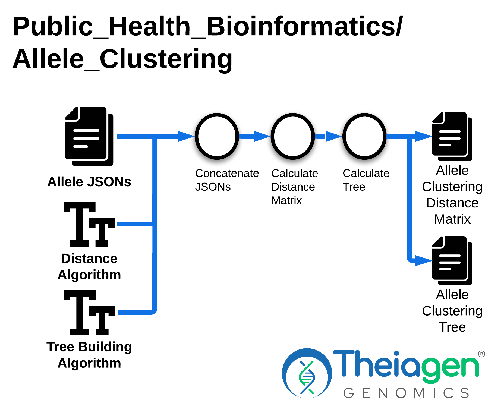

# Allele Clustering

## Quick Facts

{{ render_tsv_table("docs/assets/tables/all_workflows.tsv", sort_by="Name", filters={"Name": "[**Allele_Clustering**](../workflows/phylogenetic_construction/allele_clustering.md)"}, columns=["Workflow Type", "Applicable Kingdom", "Last Known Changes", "Command-line Compatibility","Workflow Level", "Dockstore"]) }}

## Allele_Clustering_PHB

The Allele_Clustering_PHB workflow provides tools for generating **distance matrices** and inferring **distance-based trees** from core- or whole-genome allele profiles produced by the [TheiaProk workflows](../workflows/genomic_characterization/theiaprok.md).

This workflow supports:

- Calculation of **absolute or normalized allele differences** between samples in a set;
- **Tree inference** using UPGMA, single-linkage, complete-linkage, neighbor-joining, and minimum-spanning tree algorithms;
- Generation of trees directly from **TheiaProk's Allele Calling hashes**, which represent hierarchical groupings based on the provided core- or whole-genome MLST results.

!!! caption "Allele Clustering Workflow Overview"
    

    {: onload="this.width/=2;this.onload=null;" }
    

### Inputs

!!! dna "`tree_building_algorithm` options"
    The options for the `tree_building_algorithm` input are as follows:

    - **"upgma"** - Iteratively merges the two closest clusters, updating inter-cluster distances with the size-weighted average of the merged cluster's distances, producing a clock-like tree. It is fast and simple but assumes a constant evolutionary rate, so it can distort topology when that assumption is violated.
    - **"single_linkage"** - Merges the two clusters whose _closest_ cross-cluster sample pair distance is the smallest across all cluster pairs, using the _minimum_ of the two merged clusters' distances. This can cause "chaining," where a sample slightly closer to one cluster than another pulls entire groups together, producing long, straggly trees
    - **"absolute_linkage"** - Merges the two clusters whose _farthest_ cross-cluster sample pair distance is the smallest across all other cluster pairs, using the _maximum_ of the two merged clusters' distances. It tends to produce compact, evenly sized clusters, but can over-split groups that are internally diverse.
    - "**neighbor_joining"** - A distance-based method that corrects raw distances by the average divergence of each sample before selecting the pair to join, producing an unrooted tree with branch lengths. It handles rate variation well, but it requires all pairwise distances up front and can produce negative branch lengths in noisy data.
    - **"minimum_spanning"** - An implementation intended to reproduce the behavior of the BioNumerics algorithm, this method builds a minimum spanning network by greedily connecting each unjoined sample to its nearest already-connected neighbor with a single edge. It produces a network rather than a bifurcating tree, making it ideal for visualizing microevolutionary relationships, but the resulting graph is not a phylogenetic tree and cannot be interpreted as one.

!!! dna "`distance_algorithm` options"
    Distance metrics are calculated by specifying one of the following options:

    - **"absolute_allele_differences"** - Counts the raw number of loci where two samples have different alleles, ignoring any loci where either sample has a missing value. This is the simplest and most interpretable metric, but it is sensitive to the number of loci typed; samples with more loci called will naturally accumulate more differences.
    - **"normalized_allele_differences"** - Divides the count of differing alleles (including missing data) by the number of loci where _both_ samples have a call, expressing distance as a percentage (0-100). This corrects for variable typing completeness across samples, making comparisons fairer, but the percentage scale can obscure the absolute magnitude of differences.

/// html | div[class="searchable-table"]

{{ render_tsv_table("docs/assets/tables/all_inputs.tsv", input_table=True, filters={"Workflow": "Allele_Clustering"}, columns=["Terra Task Name", "Variable", "Type", "Description", "Default Value", "Terra Status"], sort_by=[("Terra Status", True), "Terra Task Name", "Variable"]) }}

///

### Workflow Tasks

{{ include_md("common_text/versioning_task.md") }}
{{ include_md("common_text/allele_clustering_task.md") }}

### Outputs

/// html | div[class="searchable-table"]

{{ render_tsv_table("docs/assets/tables/all_outputs.tsv", input_table=False, filters={"Workflow": "Allele_Clustering"}, columns=["Variable", "Type", "Description"], sort_by=["Variable"]) }}

///

## References

> [pulsenet2.0-trees](https://github.com/ncezid-biome/pulsenet2.0-trees/tree/main)
