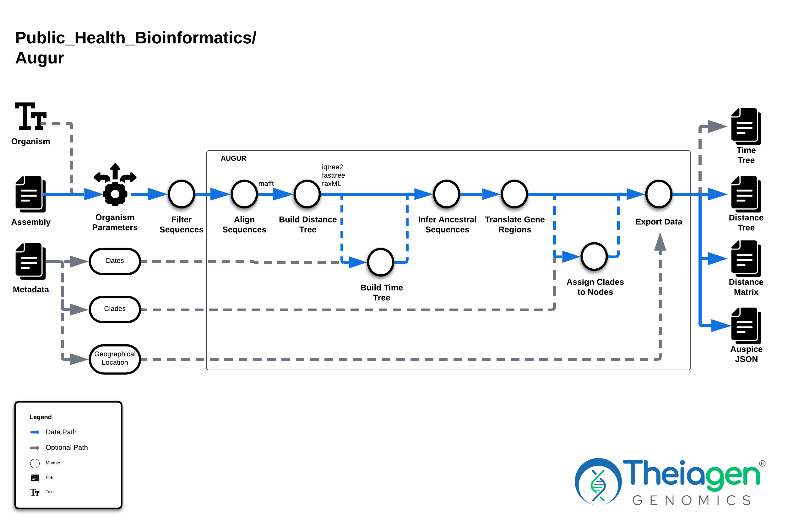
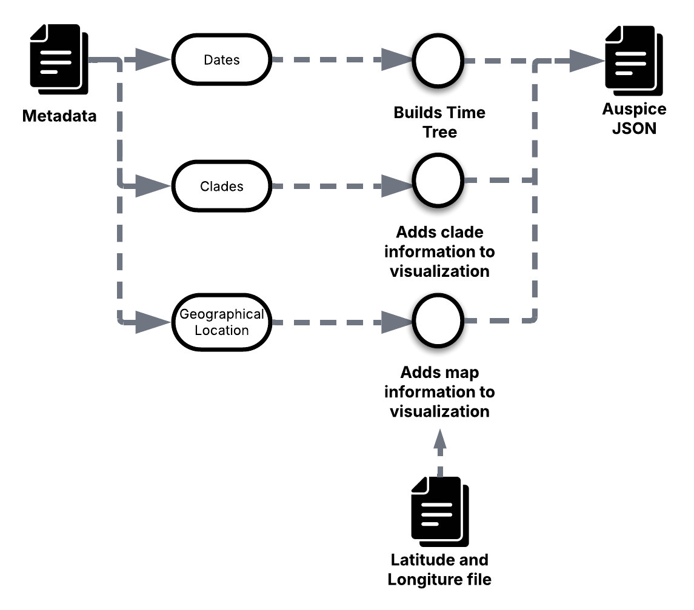

# Augur

## Quick Facts

{{ render_tsv_table("docs/assets/tables/all_workflows.tsv", sort_by="Name", filters={"Name": "[**Augur**](../workflows/phylogenetic_construction/augur.md)"}, columns=["Workflow Type", "Applicable Kingdom", "Last Known Changes", "Command-line Compatibility","Workflow Level", "Dockstore"]) }}

## Augur Workflows

!!! caption "Augur Workflow Diagram"
    

!!! dna inline end "**Helpful resources for epidemiological interpretation**"

    - [introduction to Nextstrain](https://www.cdc.gov/advanced-molecular-detection/php/training/module-3-1.html) (which includes Auspice)
    - guide to Nextstrain [interactive trees](https://www.cdc.gov/advanced-molecular-detection/php/training/module-3-4.html)
    - an [introduction to UShER](https://www.cdc.gov/advanced-molecular-detection/php/training/module-3-3.html)
    - a video about [how to read trees](https://www.cdc.gov/advanced-molecular-detection/php/training/module-1-3.html) if this is new to you
    - documentation on [how to identify SARS-CoV-2 recombinants](https://github.com/pha4ge/pipeline-resources/blob/main/docs/sc2-recombinants.md)

Genomic Epidemiology is an important approach to understand and mitigate disease transmission. A critical step in viral genomic epidemiology is generating phylogenetic trees to explore the genetic relationship between viruses on a local, regional, national, or global scale. To this end, the Augur workflows enable **viral phylogenetic analysis** by generating phylogenetic trees from genome assemblies and incorporating metadata into a intuitive visual platform via [Auspice](https://auspice.us).

Two workflows are offered: **Augur_Prep_PHB** and **Augur_PHB**. The first prepares individual samples' metadata to be visualized alognside the phylogenetic tree produced by **Augur_PHB**, wlthough this workflow can be run without metadata to produce just the phylogenetic tree visualization. If metadata is to be incorporated, these workflows must be run sequentially. The final outputs from **Augur_PHB** can be visualized in [Auspice](https://auspice.us), which is the recommended platform, and, alternatively, [UShER](https://genome.ucsc.edu/cgi-bin/hgPhyloPlace).

### Augur_Prep_PHB

The **Augur_Prep_PHB** workflow was written to prepare individual sample assemblies and their metadata for running the Augur_PHB analysis. The optional metadata inputs include collection date information (in `YYYY-MM-DD` format), clade information (like `nextclade clade` and/or `pango lineage`), and geographical information. 

This workflow runs on the sample level, and takes assembly FASTA files and associated metadata formatted in a data table. FASTA files may be generated with one of the TheiaCoV/TheiaViral Characterization workflows and should adhere to quality control guidelines, (e.g. [QC guidelines produced by PHA4GE](https://github.com/pha4ge/pipeline-resources/blob/main/docs/qc-solutions.md)). 

!!! dna "**How to prepare metadata**"

    We advise for metadata to be prepared carefully in a TSV file that can then be uploaded to the same [Terra](https://terra.bio) datatable that contains the sample information. An exaple of a formatted TSV file can be found in [this example](https://docs.google.com/spreadsheets/d/1PF1u3R-ZGm53UiVsTlIcpg9Qk2dUJgtx/edit#gid=253517867). A few important considerations are:

    - Please always include the **date information** in `YYYY-MM-DD` format, otherwise it won't be compatible with Augur. You can specify unknown dates or month by replacing the respected values by `XX` (e.g.: `2013-01-XX` or `2011-XX-XX`) and completely unknown dates can be shown with `20XX-XX-XX` (which does not restrict the sequence to being in the 21st century - they could be earlier). Alternatively, reduced precision format can also be used (e.g.: `2018`, `2018-03`.)
        - Because Excel will automatically change the date formatting, we recommend not opening or preparing your meta data file in Excel. If the metadata is already in Excel, or you decide to prepare it in Excel, we recommend using another program to correct the dates afterwards (and don’t open it in Excel again!).
    - Different levels of **geographical information** can be passed to Augur. A pre-prepared latitude and logitude file is provided by default by Theiagen, wich can be found [here](https://github.com/nextstrain/augur/blob/master/augur/data/lat_longs.tsv). Just ensure that your spelling matches what is in the file exactly or, alternatively, provide your own. We support the following levels:
        - `region` - Lowest-level resolution, used often for continents (e.g.: `europe`, `asia`, `north america`)
        - `country` - Denotes the country where the sample originated (e.g.: `Argentina`, `Japan`, `USA`)
        - `divisions` - Denotes divisions, or states, or sometimes cities, within the country (e.g.: `California`, `Colorado`, `Cork`)
        - `location` - Highest-level resolution, often used for custom latitude and longitude for futher detail on divisions, like cities within states. Just ensure that this level is provided in either the default latitude and longitude file on your custom one. 
    - Optional **clade** information, such the one assigned by *Nextclade*.
    - Optional **Pangolin lineage** information for SARS-CoV-2 samples.

#### Augur_Prep Inputs

/// html | div[class="searchable-table"]

{{ render_tsv_table("docs/assets/tables/all_inputs.tsv", input_table=True, filters={"Workflow": "Augur_Prep"}, columns=["Terra Task Name", "Variable", "Type", "Description", "Default Value", "Terra Status"], sort_by=[("Terra Status", True), "Terra Task Name", "Variable"]) }}

///

#### Augur_Prep Outputs

/// html | div[class="searchable-table"]

{{ render_tsv_table("docs/assets/tables/all_outputs.tsv", input_table=False, filters={"Workflow": "Augur_Prep"}, columns=["Variable", "Type", "Description"], sort_by=["Variable"]) }}

///

### Augur_PHB

[Augur](https://docs.nextstrain.org/projects/augur/en/stable/) is a bioinformatics toolkit to track evolution from sequence data, ingesting sequences and metadata such as dates and sampling locations, filtering the data, aligning the sequences, infering a tree, and export the results in a format that can be visualized by [Auspice](https://auspice.us/). This is the tool behind [Nextrain's builds](https://nextstrain.org/) available for a large collection of viral organisms.

The **Augur_PHB** is a [Terra](https://app.terra.bio/) and command-line compatible workflow that takes as input a **set of assembly/consensus files** (FASTA format), an **optional viral organism designation**, and an **optional sample metadata files** (TSV format) that have been formatted via the Augur_Prep_PHB workflow. Augur_PHB runs [Augur](https://docs.nextstrain.org/projects/augur/en/stable/) to generate a phylogenetic tree following the construction of a SNP distance matrix and alignment. Provided metadata will be used to refine the final tree and incorporated into the [Auspice](https://auspice.us/)-formatted tree visual. 

!!! info "Before getting started"
    **Phylogenetic inference requires careful planning, quality control of sequences, and metadata curation.** You may have to generate phylogenies multiple times by running the Augur_PHB workflow, assessing results, and amending inputs, to generate a final tree with sufficient diversity and high-quality data of interest. The existing [guide on phylogenetics](../../guides/phylogenetics.md) is a wonderful resource to give you the necessary information on the considerations you'll need to have to perform this type of analysis.

#### Augur Inputs

Particular inputs/metadata will automatically bypass or trigger modules, such as populating `alignment_fasta`, which bypasses alignment; a time-calibrated phylogeny will be generated if "collection_date" is included in the metadata; clade-defining mutations can be automatically extracted if the "clade_membership" metadata field is populated in conjunction with setting the `extract_clade_mutations` input to `true`.

Input FASTAs should meet QC metrics. Sets of FASTAs with highly discordant quality metrics may result in the inaccurate inference of genetic relatedness. There **must** be some sequence diversity among the set of input assemblies. If insufficient diversity is present, it may be necessary to add a more divergent sequences to the set.

/// html | div[class="searchable-table"]

{{ render_tsv_table("docs/assets/tables/all_inputs.tsv", input_table=True, filters={"Workflow": "Augur"}, columns=["Terra Task Name", "Variable", "Type", "Description", "Default Value", "Terra Status"], sort_by=[("Terra Status", True), "Terra Task Name", "Variable"]) }}

///

!!! dna "Optional Inputs"
    There are **many** optional user inputs. For SARS-CoV-2, Flu, rsv-a, rsv-b, and mpxv, default values that mimic the Nextstrain builds have been preselected. To use these defaults, you must write either `"sars-cov-2"`,`"flu"`, `"rsv-a"`, `"rsv-b"`, or `"mpxv"` for the `organism` variable.

    For Flu - it is **required** to set `flu_segment` to either `"HA"` or `"NA"` & `flu_subtype` to either `"H1N1"` or `"H3N2"` or `"Victoria"` or `"Yamagata"` or `"H5N1"` (`"H5N1"` will only work with `"HA"`) depending on your set of samples.

???+ toggle "A Note on Optional Inputs"

{{ include_md("common_text/organism_parameters_wf.md", condition="virus", indent=4) }}

    For more information regarding these optional inputs, please view [Nextrain's detailed documentation on Augur](https://docs.nextstrain.org/projects/augur/en/stable/usage/usage.html)

    !!! info "What's required or not?"
        For organisms _other_ than SARS-CoV-2 or Flu, the required variables have both the "required" and "optional" tags.

### Workflow Tasks

The Augur_PHB workflow uses the inputs to generate a phylogenetic tree in Auspice JSON and Newick formats. 
    
In Augur_PHB, the tasks below are called. For the Augur subcommands, please view the [Nextstrain Augur documentation](https://docs.nextstrain.org/projects/augur/en/stable/usage/usage.html) for more details and explanations.

{{ include_md("common_text/versioning_task.md") }}

{{ include_md("common_text/organism_parameters_wf.md") }}

{{ include_md("common_text/augur_align_task.md") }}

{{ include_md("common_text/filter_contigs_task.md") }}

{{ include_md("common_text/snp_dists_task.md") }}

{{ include_md("common_text/augur_tree_task.md") }}

{{ include_md("common_text/reorder_matrix_task.md") }}

{{ include_md("common_text/augur_refine_task.md") }}

{{ include_md("common_text/augur_ancestral_task.md") }}

{{ include_md("common_text/augur_translate_task.md") }}

{{ include_md("common_text/augur_mutation_context_task.md") }}

{{ include_md("common_text/augur_traits_task.md") }}

{{ include_md("common_text/extract_clade_mutations_task.md") }}

{{ include_md("common_text/augur_clades_task.md") }}

{{ include_md("common_text/augur_export_task.md") }}

#### Augur Outputs

!!! dna "Diversity dependent"
    Note that the node & branch coloring by clade or lineage assignment might be dependent on the diversity of your input dataset. This is because the clade assignment is done using the ancestrally reconstructed amino acid or nucleotide changes at the tree nodes rather than a direct sequence-to-reference mutation comparison. You may notice this happening when you get clade/lineage assignments from NextClade when running TheiaCoV workflows, but no clade/lineage assignment on the Augur Auspice tree.

    To get around this issue, you can upload the Augur output file `merged-metadata.tsv` to Auspice that includes the correct clade/lineage assignments to allow for coloring by Clade.

!!! dna "Flu clade assignments"
    Note that for flu, the clade assignment is usually mostly done for the more recent seasonal influenza viruses. Older strains may get an "unassigned" designation for clades. Therefore, it is important to counter check with the NextClade results from TheiaCoV if the lack of clade assignment is due to analyzing older sequences or sequence related.

!!! caption "Augur Output Metadata Conditional"
    
     
    The metadata and type of tree in the output JSON for Auspice will depend on the metadata that is present in input metadata file. If no metadata file is provided, the output JSON will only contain a distance tree. If date information is present, the distance tree will be replaced by a tree refined by time (time tree). If clade and/or pango lineage (for SARS-CoV-2) information is provided, the tree will be possible to be colored by this. If geographical information is present, a map will load in Auspice with the information provided, as long that is present in the default of provided latute and longitude file. 

The `auspice_input_json` is intended to be uploaded to [Auspice](https://auspice.us/) to view the phylogenetic tree. This provides a visualization of the genetic relationships between your set of samples. The `metadata_merged` output can also be uploaded to add context to the phylogenetic visualization. The `combined_assemblies` output can be uploaded to [UShER](https://genome.ucsc.edu/cgi-bin/hgPhyloPlace) to view the samples on a global tree of representative sequences from the public repositories.

The Nextstrain team hosts documentation surrounding the Augur workflow → Auspice visualization here, which details the various components of the Auspice interface: [How data is exported by Augur for visualisation in Auspice](https://docs.nextstrain.org/en/latest/learn/augur-to-auspice.html).

/// html | div[class="searchable-table"]

{{ render_tsv_table("docs/assets/tables/all_outputs.tsv", input_table=False, filters={"Workflow": "Augur"}, columns=["Variable", "Type", "Description"], sort_by=["Variable"]) }}

///

#### Mpox-specific Auspice Output JSON

If you are building a tree for Mpox samples and set the optional input parameter `organism` to `"mpox"` , an additional step will be carried out in the Augur_PHB workflow. This additional step will calculate the mutation fraction of G→A or C→T changes. These mutations have been shown to be a characteristic of APOBEC3-type editing, which indicate adaptation of the virus to circulation among humans as was observed with the 2022 clade IIb outbreak, and more recently (2024) with the clade Ib outbreak in South Kivu, Democratic Republic of the Congo.

When visualizing the output `auspice_input_json` file, there will be 2 new choices in the drop-down menu for "Color By":

- G→A or C→T fraction
- NGA/TCN context of G→A or C→T mutations.

An example Mpox tree with these "Color By" options can be viewed here: <https://nextstrain.org/mpox/clade-IIb?c=GA_CT_fraction>

### References

When publishing work using the Augur_PHB workflow, please reference the following:

> Nextstrain: Hadfield J, Megill C, Bell SM, Huddleston J, Potter B, Callender C, Sagulenko P, Bedford T, Neher RA. Nextstrain: real-time tracking of pathogen evolution. Bioinformatics. 2018 Dec 1;34(23):4121-3.

When publishing work using inferences from UShER, please reference:

> UShER: Turakhia Y, Thornlow B, Hinrichs AS, De Maio N, Gozashti L, Lanfear R, Haussler D, Corbett-Detig R. Ultrafast Sample placement on Existing tRees (UShER) enables real-time phylogenetics for the SARS-CoV-2 pandemic. Nature Genetics. 2021 Jun;53(6):809-16.
