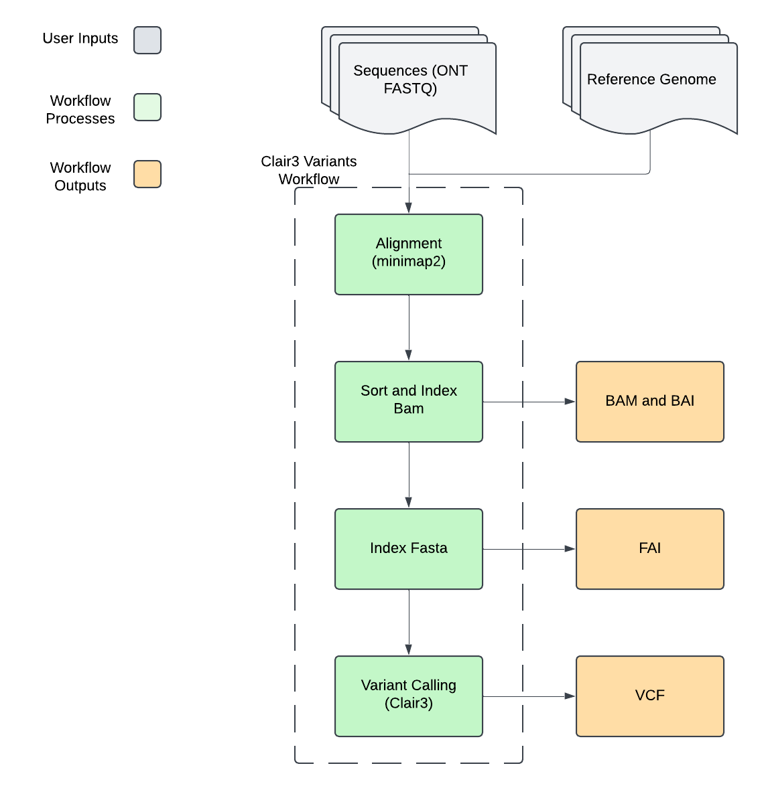

# Clair3 Variants

## Quick Facts

| **Workflow Type** | **Applicable Kingdom** | **Last Known Changes** | **Command-line Compatibility** | **Workflow Level** |
|---|---|---|---|---|
| [Phylogenetic Construction](../../workflows_overview/workflows_type.md/#phylogenetic-construction) | [Any taxa](../../workflows_overview/workflows_kingdom.md/#any-taxa) | PHB v3.0.0 | Yes | Sample-level |

## Clair3_Variants_ONT

The `Clair3_Variants` workflow processes Oxford Nanopore Technologies (ONT) sequencing data to identify genetic variations compared to a reference genome. It combines minimap2's long-read alignment capabilities with Clair3's deep learning-based variant calling, designed specifically for ONT data characteristics. The workflow first aligns raw reads to a reference genome using ONT-optimized parameters, processes these alignments into sorted and indexed BAM files, and then employs Clair3's specialized models to detect variants including single nucleotide polymorphisms (SNPs) and insertions/deletions (indels). If enabled, the workflow can also identify longer indels and generate genome-wide variant calls in gVCF format for downstream analysis.

!!! caption "Clair3_Variants Workflow Diagram"
    

!!! tip "Example Use Cases"
   - **Variant Discovery**: Identify genetic variations in ONT sequencing data compared to a reference genome
   - **SNP and Indel Detection**: Accurately detect both small variants and longer indels
   - **Population Studies**: Generate standardized variant calls suitable for population-level analyses

### Supported Clair3 Models  {#supported-clair3-models} 

| Model | Chemistry | Source |
|-------|-----------|---------|
| `r941_prom_sup_g5014` | R9.4.1 | Clair3 1.0.10 Release |
| `r941_prom_hac_g360+g422` | R9.4.1 | Clair3 1.0.10 Release |
| `r941_prom_hac_g238` | R9.4.1 | Clair3 1.0.10 Release |
| `r1041_e82_400bps_sup_v500` | R10.4.1 | [nanoporetech/rerio](https://github.com/nanoporetech/rerio?tab=readme-ov-file#clair3-models) |
| `r1041_e82_400bps_hac_v500` | R10.4.1 | [nanoporetech/rerio](https://github.com/nanoporetech/rerio?tab=readme-ov-file#clair3-models) |
| `r1041_e82_400bps_sup_v410` | R10.4.1 | [nanoporetech/rerio](https://github.com/nanoporetech/rerio?tab=readme-ov-file#clair3-models) |
| `r1041_e82_400bps_hac_v410` | R10.4.1 | [nanoporetech/rerio](https://github.com/nanoporetech/rerio?tab=readme-ov-file#clair3-models) |
| `ont` | Various | Legacy (Recommended for Guppy3 and Guppy4) |
| `ont_guppy2` | Various | Legacy (For Guppy2 data) |
| `ont_guppy5` | Various | Legacy (For Guppy5 data) |

!!! hint ""
    The latest models for ONT are downloaded from the [nanoporetech/rerio github](https://github.com/nanoporetech/rerio?tab=readme-ov-file#clair3-models). Please let us know if there is a model not included you would like to see added. 

### Inputs

!!! warning "Note on Haploid Settings"
    Several parameters are set by default for haploid genome analysis:

    - clair3_disable_phasing is set to `true` since phasing is not relevant for haploid genomes
    - clair3_include_all_contigs is set to `true` to ensure complete genome coverage
    - clair3_enable_haploid_precise is set to `true` to only consider homozygous variants (1/1), which is appropriate for haploid genomes

/// html | div[class="searchable-table"]

{{ render_tsv_table("docs/assets/tables/all_inputs.tsv", input_table=True, filter_column="Workflow", filter_values="Clair3_Variants_ONT", columns=["Terra Task Name", "Variable", "Type", "Description", "Default Value", "Terra Status"], sort_by=[("Terra Status", True), "Terra Task Name", "Variable"]) }}

///

### Workflow Tasks

{{ include_md("common_text/minimap2_task.md", condition="long_read_flags")}}

??? task "`samtools`: BAM Processing"

    The bam processing step aligns files through several coordinate-based steps to prepare for variant calling. The task converts SAM format to BAM, sorts the BAM file by coordinate, and creates a BAM index file. This processed BAM is required for Clair3's variant calling pipeline.

    !!! techdetails "samtools Technical Details"
        | | Links |
        |---|---|
        | Task | [task_samtools.wdl](https://github.com/theiagen/public_health_bioinformatics/blob/main/tasks/utilities/data_handling/task_parse_mapping.wdl) |
        | Software Source Code | [samtools on GitHub](https://github.com/samtools/samtools) |
        | Software Documentation | [samtools](https://www.htslib.org/doc/samtools.html) |
        | Original Publication(s) | [The Sequence Alignment/Map format and SAMtools](https://doi.org/10.1093/bioinformatics/btp352) [Twelve Years of SAMtools and BCFtools](https://doi.org/10.1093/gigascience/giab008) |

??? task "`samtools faidx`: Reference Genome Indexing"

    `samtools faidx` creates necessary index files for the reference. This indexing step is    essential for enabling efficient random access to the reference sequence during variant calling.

    !!! techdetails "samtools Technical Details"
        | | Links |
        |---|---|
        | Task | [task_samtools.wdl](https://github.com/theiagen/public_health_bioinformatics/blob/main/tasks/utilities/data_handling/task_parse_mapping.wdl) |
        | Software Source Code | [samtools on GitHub](https://github.com/samtools/samtools) |
        | Software Documentation | [samtools](https://www.htslib.org/doc/samtools.html) |
        | Original Publication(s) | [The Sequence Alignment/Map format and SAMtools](https://doi.org/10.1093/bioinformatics/btp352) [Twelve Years of SAMtools and BCFtools](https://doi.org/10.1093/gigascience/giab008) |

??? task "`Clair3`: Variant Calling"

    `Clair3` performs deep learning-based variant detection using a multi-stage approach. The process begins with pileup-based calling for initial variant identification, followed by full-alignment analysis for comprehensive variant detection. Results are merged into a final high-confidence call set.

    The variant calling pipeline employs specialized neural networks trained on ONT data to accurately identify:
    - Single nucleotide variants (SNVs)
    - Small insertions and deletions (indels)
    - Structural variants

    !!! techdetails "Clair3 Technical Details"
        |  | Links |
        | --- | --- |
        | Task | [task_clair3.wdl](https://github.com/theiagen/public_health_bioinformatics/blob/main/tasks/gene_typing/variant_detection/task_clair3.wdl) |
        | Software Source Code | [Clair3 on GitHub](https://github.com/HKU-BAL/Clair3) |
        | Software Documentation | [Clair3 Documentation](https://github.com/HKU-BAL/Clair3?tab=readme-ov-file#usage) |
        | Original Publication(s) | [Symphonizing pileup and full-alignment for deep learning-based long-read variant calling](https://doi.org/10.1101/2021.12.29.474431) |

### Outputs

/// html | div[class="searchable-table"]

{{ render_tsv_table("docs/assets/tables/all_outputs.tsv", input_table=False, filter_column="Workflow", filter_values="Clair3_Variants_ONT", columns=["Variable", "Type", "Description"], sort_by=["Variable"]) }}

///
