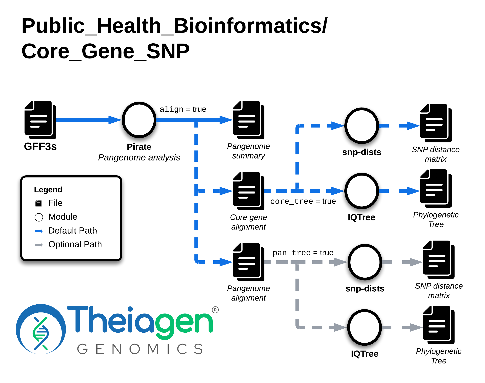

# Core_Gene_SNP

## Quick Facts

{{ render_tsv_table("docs/assets/tables/all_workflows.tsv", sort_by="Name", filters={"Name": "[**Core_Gene_SNP**](../workflows/phylogenetic_construction/core_gene_snp.md)"}, columns=["Workflow Type", "Applicable Kingdom", "Last Known Changes", "Command-line Compatibility","Workflow Level", "Dockstore"]) }}

## Core_Gene_SNP_PHB

!!! caption "Core Gene SNP Workflow Diagram"
    

    {: onload="this.width/=2;this.onload=null;" }
    

The Core_Gene_SNP workflow is intended for core genome and pangenome phylogenetic analysis using [PIRATE](https://github.com/SionBayliss/PIRATE) and [IQ-TREE v1.6.7](https://github.com/iqtree/iqtree2/tree/v1.6.7).

!!! info "Default Parameters"
    Please note that while default parameters for pangenome construction and phylogenetic tree generation are provided, **these default parameters may not suit every dataset and have not been validated against known phylogenies**. Users should take care to select the parameters that are most appropriate for their dataset. Please reach out to [support@theiagen.com](mailto:support@theiagen.com) or one of the other resources listed at the bottom of this page if you would like assistance with this task.

### Inputs

This workflow runs on the set level.

/// html | div[class="searchable-table"]

{{ render_tsv_table("docs/assets/tables/all_inputs.tsv", input_table=True, filters={"Workflow": "Core_Gene_SNP"}, columns=["Terra Task Name", "Variable", "Type", "Description", "Default Value", "Terra Status"], sort_by=[("Terra Status", True), "Terra Task Name", "Variable"]) }}

///

### Workflow Tasks

{{ include_md("common_text/pirate_task.md") }}

!!! dna "Core Tree Generation"
    Turn **off** this behavior by setting `core_tree` to `"false"`.

{{ include_md("common_text/snp_sites_task.md", indent=4) }}
{{ include_md("common_text/iqtree1_task.md", indent=4) }}
{{ include_md("common_text/snp_dists_task.md", indent=4) }}
{{ include_md("common_text/reorder_matrix_task.md", indent=4) }}

!!! dna "Pangenome Tree Generation"
    Turn **on** this behavior by setting `pan_tree` to `"true"`.

{{ include_md("common_text/snp_sites_task.md", indent=4) }}
{{ include_md("common_text/iqtree1_task.md", indent=4) }}
{{ include_md("common_text/snp_dists_task.md", indent=4) }}
{{ include_md("common_text/reorder_matrix_task.md", indent=4) }}

{{ include_md("common_text/data_summary_task.md") }}

### Outputs

/// html | div[class="searchable-table"]

{{ render_tsv_table("docs/assets/tables/all_outputs.tsv", input_table=False, filters={"Workflow": "Core_Gene_SNP"}, columns=["Variable", "Type", "Description"], sort_by=["Variable"]) }}

///

## References

>Sion C Bayliss, Harry A Thorpe, Nicola M Coyle, Samuel K Sheppard, Edward J Feil, PIRATE: A fast and scalable pangenomics toolbox for clustering diverged orthologues in bacteria, _GigaScience_, Volume 8, Issue 10, October 2019, giz119, <https://doi.org/10.1093/gigascience/giz119>
<!-- -->
> Lam-Tung Nguyen, Heiko A. Schmidt, Arndt von Haeseler, Bui Quang Minh, IQ-TREE: A Fast and Effective Stochastic Algorithm for Estimating Maximum-Likelihood Phylogenies, _Molecular Biology and Evolution_, Volume 32, Issue 1, January 2015, Pages 268–274, <https://doi.org/10.1093/molbev/msu300>
<!-- -->
> <https://github.com/tseemann/snp-dists>
