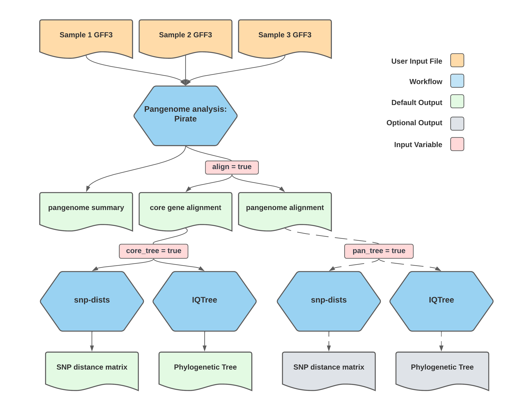

# Core_Gene_SNP

## Quick Facts

{{ render_tsv_table("docs/assets/tables/all_workflows.tsv", sort_by="Name", filter_column="Name", filter_values="[**Core_Gene_SNP**](../workflows/phylogenetic_construction/core_gene_snp.md)", columns=["Workflow Type", "Applicable Kingdom", "Last Known Changes", "Command-line Compatibility","Workflow Level"]) }}

## Core_Gene_SNP_PHB

!!! caption "Core Gene SNP Workflow Diagram"
    {width:45%}

The Core_Gene_SNP workflow is intended for pangenome analysis, core gene alignment, and phylogenetic analysis. The workflow takes in gene sequence data in GFF3 format from a set of samples. It first produces a pangenome summary using [`Pirate`](https://github.com/SionBayliss/PIRATE), which clusters genes within the sample set into orthologous gene families. By default, the workflow also instructs `Pirate` to produce both core gene and pangenome alignments. The workflow subsequently triggers the generation of a phylogenetic tree and SNP distance matrix from the core gene alignment using [`iqtree`](https://github.com/iqtree/iqtree2/tree/v1.6.7) and [`snp-dists`](https://github.com/tseemann/snp-dists), respectively. Optionally, the workflow will also run this analysis using the pangenome alignment. This workflow also features an optional module, `summarize_data`, that creates a presence/absence matrix for the analyzed samples from a list of indicated columns (such as AMR genes, etc.) that can be used in Phandango.

!!! info "Default Parameters"
    Please note that while default parameters for pangenome construction and phylogenetic tree generation are provided, **these default parameters may not suit every dataset and have not been validated against known phylogenies**. Users should take care to select the parameters that are most appropriate for their dataset. Please reach out to [support@theiagen.com](mailto:support@theiagen.com) or one of the other resources listed at the bottom of this page if you would like assistance with this task.

### Inputs

For further detail regarding Pirate options, please see [PIRATE's documentation](https://github.com/SionBayliss/PIRATE). For further detail regarding IQ-TREE options, please see `http://www.iqtree.org/doc/Command-Reference`.

This workflow runs on the set level.

/// html | div[class="searchable-table"]

{{ render_tsv_table("docs/assets/tables/all_inputs.tsv", input_table=True, filters={"Workflow": "Core_Gene_SNP"}, columns=["Terra Task Name", "Variable", "Type", "Description", "Default Value", "Terra Status"], sort_by=[("Terra Status", True), "Terra Task Name", "Variable"]) }}

///

### Workflow Tasks

By default, the Core_Gene_SNP workflow will begin by analyzing the input sample set using [PIRATE](https://github.com/SionBayliss/PIRATE). Pirate takes in GFF3 files and classifies the genes into gene families by sequence identity, outputting a pangenome summary file. The workflow will instruct Pirate to create core gene and pangenome alignments using this gene family data. Setting the "align" input variable to false will turn off this behavior, and the workflow will output only the pangenome summary. The workflow will then use the core gene alignment from `Pirate` to infer a phylogenetic tree using `IQ-TREE`. It will also produce an SNP distance matrix from this alignment using [snp-dists](https://github.com/tseemann/snp-dists). This behavior can be turned off by setting the `core_tree` input variable to false. The workflow will not create a pangenome tree or SNP-matrix by default, but this behavior can be turned on by setting the `pan_tree` input variable to true.

The optional `summarize_data` task performs the following only if all of the `data_summary_*` and `sample_names` optional variables are filled out:

1. Digests a _comma-separated_  list of column names, such as `"amrfinderplus_virulence_genes,amrfinderplus_stress_genes"`, etc. that can be found within the origin Terra data table.
2. It will then parse through those column contents and extract each value; for example, if the `amrfinder_amr_genes` column for a sample contains these values: `"aph(3')-IIIa,tet(O),blaOXA-193"`, the `summarize_data` task will check each sample in the set to see if they also have those AMR genes detected.
3. Outputs a .csv file that indicates presence (TRUE) or absence (empty) for each item in those columns; that is, it will check each sample in the set against the detected items in each column to see if that value was also detected.

By default, this task appends a Phandango coloring tag to color all items from the same column the same; this can be turned off by setting the optional `phandango_coloring` variable to `false`.

### Outputs

/// html | div[class="searchable-table"]

{{ render_tsv_table("docs/assets/tables/all_outputs.tsv", input_table=False, filters={"Workflow": "Core_Gene_SNP"}, columns=["Variable", "Type", "Description"], sort_by=["Variable"]) }}

///

## References

>Sion C Bayliss, Harry A Thorpe, Nicola M Coyle, Samuel K Sheppard, Edward J Feil, PIRATE: A fast and scalable pangenomics toolbox for clustering diverged orthologues in bacteria, _GigaScience_, Volume 8, Issue 10, October 2019, giz119, <https://doi.org/10.1093/gigascience/giz119>
<!-- -->
> Lam-Tung Nguyen, Heiko A. Schmidt, Arndt von Haeseler, Bui Quang Minh, IQ-TREE: A Fast and Effective Stochastic Algorithm for Estimating Maximum-Likelihood Phylogenies, _Molecular Biology and Evolution_, Volume 32, Issue 1, January 2015, Pages 268–274, <https://doi.org/10.1093/molbev/msu300>
<!-- -->
> <https://github.com/tseemann/snp-dists>
