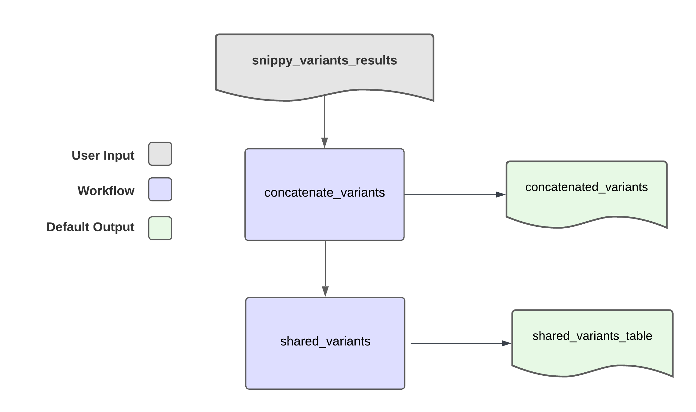

# Find_Shared_Variants

## Quick Facts

| **Workflow Type** | **Applicable Kingdom** | **Last Known Changes** | **Command-line Compatibility** | **Workflow Level** |
|---|---|---|---|---|
| [Phylogenetic Construction](../../workflows_overview/workflows_type.md/#phylogenetic-construction) | [Bacteria](../../workflows_overview/workflows_kingdom.md/#bacteria), [Mycotics](../../workflows_overview/workflows_kingdom.md#mycotics) | PHB v2.0.0 | Yes | Set-level |

## Find_Shared_Variants_PHB

`Find_Shared_Variants_PHB` is a workflow for concatenating the variant results produced by the `Snippy_Variants_PHB` workflow across multiple samples and reshaping the data to illustrate variants that are shared among multiple samples.

!!! caption "Find_Shared_Variants Workflow Diagram"

    

### Inputs

The primary intended input of the workflow is the `snippy_variants_results` output from `Snippy_Variants_PHB` or the `theiaeuk_snippy_variants_results` output of the TheiaEuk workflow. Variant results files from other tools may not be compatible at this time.

All variant data included in the sample set should be generated from aligning sequencing reads to the **same reference genome**. If variant data was generated using different reference genomes, shared variants cannot be identified and results will be less useful.

/// html | div[class="searchable-table"]

{{ input_table("docs/assets/input_tables/all_inputs.tsv", input_table=True, filter_column="Workflow", filter_values="Find_Shared_Variants", columns=["Terra Task Name", "Variable", "Type", "Description", "Default Value", "Terra Status"], sort_by=[("Terra Status", True), "Terra Task Name", "Variable"]) }}

///

### Tasks

??? task "Concatenate Variants"

    ##### Concatenate Variants Task  {#concatenate_variants_task} 

    The `cat_variants` task concatenates variant data from multiple samples into a single file `concatenated_variants`. It is very similar to the `cat_files` task, but also adds a column to the output file that indicates the sample associated with each row of data.

    The `concatenated_variants` file will be in the following format:

    | samplename | CHROM | POS | TYPE | REF | ALT | EVIDENCE | FTYPE | STRAND | NT_POS | AA_POS | EFFECT | LOCUS_TAG | GENE | PRODUCT |
    | --- | --- | --- | --- | --- | --- | --- | --- | --- | --- | --- | --- | --- | --- | --- |
    | sample1 | PEKT02000007 | 5224 | snp | C | G | G:21 C:0 |  |  |  |  |  |  |  |  |
    | sample2 | PEKT02000007 | 34112 | snp | C | G | G:32 C:0 | CDS | + | 153/1620 | 51/539 | missense_variant c.153C>G p.His51Gln | B9J08_002604 | hypothetical protein |  |
    | sample3 | PEKT02000007 | 34487 | snp | T | A | A:41 T:0 | CDS | + | 528/1620 | 176/539 | missense_variant c.528T>A p.Asn176Lys | B9J08_002604 | hypothetical protein |  |

    !!! techdetails "Technical Details"
    
        |  | Links |
        | --- | --- |
        | Task | /tasks/utilities/file_handling/task_cat_files.wdl |
        | Software Source Code | [task_cat_files.wdl](https://github.com/theiagen/public_health_bioinformatics/blob/main/tasks/utilities/file_handling/task_cat_files.wdl) |

??? task "Shared Variants Task"

    ##### Shared Variants Task  {#shared_variants_task} 

    The `shared_variants` task takes in the `concatenated_variants` output from the `cat_variants` task and reshapes the data so that variants are rows and samples are columns. For each variant, samples where the variant was detected are populated with a "1" and samples were **either the variant was not detected or there was insufficient coverage to call variants** are populated with a "0". The resulting table is available as the `shared_variants_table` output.

    The `shared_variants_table` file will be in the following format:

    | CHROM | POS | TYPE | REF | ALT | FTYPE | STRAND | NT_POS | AA_POS | EFFECT | LOCUS_TAG | GENE | PRODUCT | sample1 | sample2 | sample3 |
    | --- | --- | --- | --- | --- | --- | --- | --- | --- | --- | --- | --- | --- | --- | --- | --- |
    | PEKT02000007 | 2693938 | snp | T | C | CDS | - | 1008/3000 | 336/999 | synonymous_variant c.1008A>G p.Lys336Lys | B9J08_003879 | NA | chitin synthase 1 | 1 | 1 | 0 |
    | PEKT02000007 | 2529234 | snp | G | C | CDS | + | 282/336 | 94/111 | missense_variant c.282G>C p.Lys94Asn | B9J08_003804 | NA | cytochrome c | 1 | 1 | 1 |
    | PEKT02000002 | 1043926 | snp | A | G | CDS | - | 542/1464 | 181/487 | missense_variant c.542T>C p.Ile181Thr | B9J08_000976 | NA | dihydrolipoyl dehydrogenase | 1 | 1 | 0 |
    
    !!! techdetails "Technical Details"
        
        |  | Links |
        | --- | --- |
        | Task | task_shared_variants.wdl |
        | Software Source Code | [task_shared_variants.wdl](https://github.com/theiagen/public_health_bioinformatics/blob/main/tasks/phylogenetic_inference/utilities/task_shared_variants.wdl) |

### Outputs

The outputs of this workflow are the `concatenated_variants` file and the `shared_variants_table` file.

| **Variable** | **Type** | **Description** |
| --- | --- | --- |
| concatenated_variants | File | The concatenated variants without presence/absence |
| shared_variants_analysis_date | String | The date the workflow was run |
| shared_variants_table | File | The shared variants table listing presence/absence for each mutation identified in the samples |
| shared_variants_version | String | The version of PHB the workflow is in |
