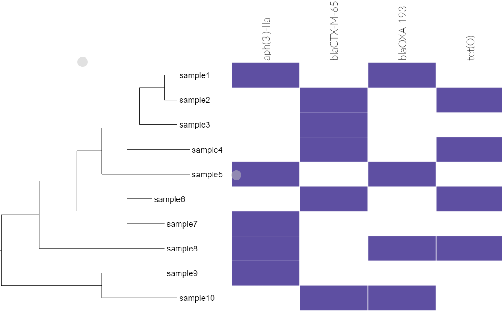

# kSNP4

## Quick Facts

| **Workflow Type** | **Applicable Kingdom** | **Last Known Changes** | **Command-line Compatibility** | **Workflow Level** |
|---|---|---|---|---|
| [Phylogenetic Construction](../../workflows_overview/workflows_type.md/#phylogenetic-construction) | [Bacteria](../../workflows_overview/workflows_kingdom.md/#bacteria), [Mycotics](../../workflows_overview/workflows_kingdom.md#mycotics), [Viral](../../workflows_overview/workflows_kingdom.md/#viral) | PHB v3.0.0 | Yes; some optional features incompatible | Set-level |

## kSNP4_PHB

The kSNP4 workflow is for phylogenetic analysis of bacterial genomes using single nucleotide polymorphisms (SNPs) and is significantly faster and more memory efficient than its predecessor, kSNP3. There are no significant algorithmic changes between the two versions, and most modifications are transparent to the user. The kSNP4 workflow identifies SNPs amongst a set of genome assemblies, then calculates a number of phylogenetic trees based on those SNPs:

- **Pan-genome phylogenetic trees:** The term "pan-genome" is used here to describe the collective genetic content amongst the set of genomes, including regions outside of genes and other coding sequences.  Outputs based on the pan-genome are labeled with `_pan`.
- **Core-genome phylogenetic trees:** The kSNP4 workflow will also generate phylogenetic trees based on the core genome (genetic content that is present in all members of the set of genomes). Outputs based on the core-genome are labeled with `_core`.

This workflow also features an optional module, `summarize_data` that creates a presence/absence matrix for the analyzed samples from a list of indicated columns (such as AMR genes, plasmid types etc.). If the `phandango_coloring` variable is set to `true`, this will be formatted for visualization in [Phandango](https://jameshadfield.github.io/phandango/#/), else it can be viewed in Excel.

While kSNP4 introduces enhancements, much of the foundational information from kSNP3 remains relevant. You can learn more about the kSNP3 workflow, including how to visualize the outputs with MicrobeTrace in the following video, which is still applicable to kSNP4: **📺 [Using kSNP3 in Terra and Visualizing Bacterial Genomic Networks in MicrobeTrace](https://www.youtube.com/watch?v=iRpNDun46R8)**

### Inputs

/// html | div[class="searchable-table"]

{{ input_table("docs/assets/input_tables/all_inputs.tsv", input_table=True, filter_column="Workflow", filter_values="kSNP4", columns=["Terra Task Name", "Variable", "Type", "Description", "Default Value", "Terra Status"], sort_by=[("Terra Status", True), "Terra Task Name", "Variable"]) }}

///

### Workflow Actions

The `ksnp4` workflow is run on the set of assembly files to produce both pan-genome and core-genome phylogenies. This also results in alignment files which - are used by [`snp-dists`](https://github.com/tseemann/snp-dists) to produce a pairwise SNP distance matrix for both the pan-genome and core-genomes.

If you fill out the `data_summary_*` and `sample_names` optional variables, you can use the optional `summarize_data` task. The task takes a comma-separated list of column names from the Terra data table, which should each contain a list of comma-separated items. For example, `"amrfinderplus_virulence_genes,amrfinderplus_stress_genes"` (with quotes, comma separated, no spaces) for these output columns from running TheiaProk. The task checks whether those comma-separated items are present in each row of the data table (sample), then creates a CSV file of these results. The CSV file indicates presence (TRUE) or absence (empty) for each item. By default, the task adds a Phandango coloring tag to group items from the same column, but you can turn this off by setting `phandango_coloring` to `false`.

??? toggle "**Example output CSV**"

    ```text linenums="1"
    Sample_Name,aph(3')-IIa,blaCTX-M-65,blaOXA-193,tet(O)
    sample1,TRUE,,TRUE,TRUE
    sample2,,,FALSE,TRUE
    sample3,,,FALSE,
    ```

??? toggle "**Example use of Phandango coloring**"

    Data summary produced using the `phandango_coloring` option, visualized alongside Newick tree at <http://jameshadfield.github.io/phandango/#/main>

    !!! caption "Example phandango_coloring output"
        

### Outputs

<div class="searchable-table" markdown="1">

| **Variable** | **Type** | **Description** |
|---|---|---|
| ksnp4_core_snp_matrix | File | The SNP matrix made with the core genome; formatted for Phandango if `phandango_coloring` input is `true` |
| ksnp4_core_snp_matrix_status | String | Will print either `The core SNP matrix was produced` OR `The core SNP matrix could not be produced` |
| ksnp4_core_snp_table | File | Formatted version of ksnp4_vcf_ref_genome file with only core SNPs, sorted by number of occurrences in the sample set |
| ksnp4_core_tree | File | The phylogenetic tree made with the core genome |
| ksnp4_docker | String | The docker image used |
| ksnp4_filtered_metadata | File | Optional output file with filtered metadata that is only produced if the optional `summarize_data` task is used. |
| ksnp4_ml_tree | File | Maximum likelihood tree that is only produced if `ksnp4_args` includes `"-ML"`  |
| ksnp4_nj_tree | File | Neighbor joining tree that is only produced if `ksnp4_args` includes `"-NJ"` |
| ksnp4_number_core_snps | String | Number of core SNPs in the sample set |
| ksnp4_number_snps | String | Number of SNPs in the sample set |
| ksnp4_pan_snp_matrix | File | The SNP matrix made with the pangenome; formatted for Phandango if `phandango_coloring` input is `true` |
| ksnp4_pan_tree | File | The phylogenetic tree made with the pangenome |
| ksnp4_snp_dists_version | String | The version of snp_dists used in the workflow |
| ksnp4_snps | File | File containing the set of SNPs used in the analysis. Required if more trees are to be appended to the existing one.  |
| ksnp4_summarized_data | File | CSV presence/absence matrix generated by the `summarize_data` task from the list of columns provided; formatted for Phandango if `phandango_coloring` input is `true` |
| ksnp4_vcf_ref_genome | File | A VCF file containing the variants detected in the core genome |
| ksnp4_vcf_ref_samplename | String | The name of the (user-supplied) sample used as the reference for calling SNPs. |
| ksnp4_vcf_snps_not_in_ref | File | A TSV file of the SNPs not present in the reference genome, but were identified by kSNP4. |
| ksnp4_wf_analysis_date | String | The date the workflow was run |
| ksnp4_wf_version | String | The version of the repository the workflow is hosted in |

</div>

## References

>Barry G Hall, Jeremiah Nisbet, Building Phylogenetic Trees From Genome Sequences With kSNP4, Molecular Biology and Evolution, Volume 40, Issue 11, November 2023, msad235, <https://doi.org/10.1093/molbev/msad235>
<!-- -->
<https://github.com/tseemann/snp-dists>
