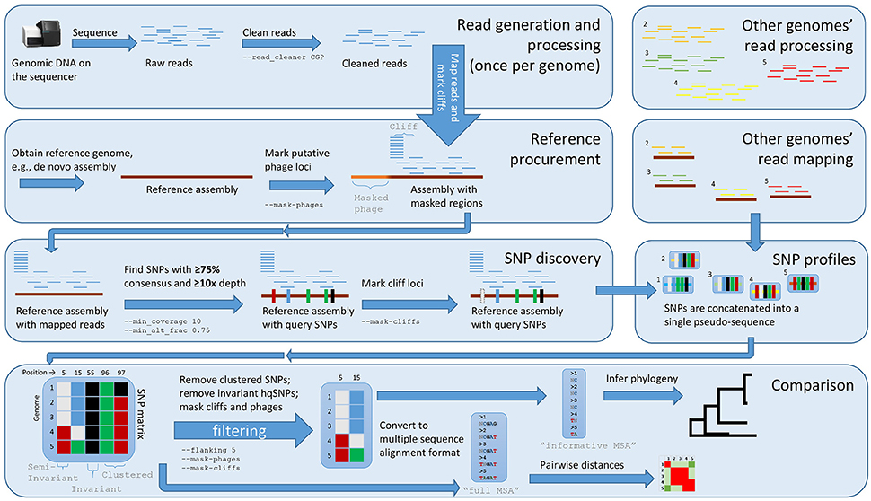

# Lyve_SET

## Quick Facts

| **Workflow Category** | **Applicable Kingdom** | **Last Known Changes** | **Command-line compatibliity** | **Workflow type** |
|---|---|---|---|---|
| [Phylogenetic Construction](../../workflows_overview/workflows-type.md/#phylogenetic-construction) | [Bacteria](../../workflows_overview/workflows-kingdom.md/#bacteria) | PHB v2.1.0 | Yes | Set-level |

## Lyve_SET_PHB

The Lyve_SET WDL workflow runs the [Lyve-SET](https://github.com/lskatz/lyve-SET) pipeline developed by Lee Katz et al. for phylogenetic analysis of bacterial genomes using high quality single nucleotide polymorphisms (hqSNPs). The Lyve_SET workflow identifies SNPs amongst a set of samples by mapping sequencing reads to a reference genome, identifying high quality SNPs, and inferring phylogeny using RAxML.

### Lyve-SET Pipeline (from [Lyve-SET paper](https://www.frontiersin.org/articles/10.3389/fmicb.2017.00375/full))

!!! caption "Lyve-SET Workflow Diagram"
    

### Inputs

| **Terra Task Name** | **Variable** | **Type** | **Description** | **Default attribute** | **Status** |
|---|---|---|---|---|---|
| lyveset_workflow | **dataset_name** | String | Free text string used to label output files | | Required |
| lyveset_workflow | **read1** | Array[File] | Array of read1 files for sample set. We recommend using cleaned rather than raw reads. | | Required |
| lyveset_workflow | **read2** | Array[File] | Array of read2 files for sample set. We recommend using cleaned rather than raw reads. | | Required |
| lyveset_workflow | **reference_genome** | File | Path to reference genome in a Terra-accessible Google bucket. For considerations when choosing a reference genome, see: <https://github.com/lskatz/lyve-SET/blob/master/docs/FAQ.md> | | Required |
| lyveset | **allowedFlanking** | Int | Allowed flanking distance in base pairs. Nucleotides this close together cannot be considered as high-quality. | 0 | Optional |
| lyveset | **cpu** | Int | CPUs for running Lyve-SET | 4 | Optional |
| lyveset | **disk_size** | Int | Disk size for running Lyve-SET | 100 | Optional |
| lyveset | **docker_image** | String | Docker image used for running Lyve-SET | "us-docker.pkg.dev/general-theiagen/staphb/lyveset:1.1.4f" | Optional |
| lyveset | **downsample** | Boolean | If true, downsample all reads to 50x. Approximated according to the ref genome assembly | FALSE | Optional |
| lyveset | **fast** | Boolean | Shorthand for `--downsample --mapper snap --nomask-phages --nomask-cliffs --sample-sites` | FALSE | Optional |
| lyveset | **mapper** | String | Which mapper? Choices: "smalt", "snap" | "smalt" | Optional |
| lyveset | **mask_cliffs** | Boolean | If true, search for and mask 'Cliffs' in pileups | FALSE | Optional |
| lyveset | **mask_phages** | Boolean | If true, search for and mask phages in the reference genome | FALSE | Optional |
| lyveset | **memory** | Int | Memory for running Lyve-SET | 16 | Optional |
| lyveset | **min_alt_frac** | Float | The percent consensus that needs to be reached before a SNP is called. Otherwise, 'N' | 0.75 | Optional |
| lyveset | **min_coverage** | Int | Minimum coverage needed before a SNP is called. Otherwise, 'N' | 10 | Optional |
| lyveset | **nomatrix** | Boolean | If true, do not create an hqSNP matrix | FALSE | Optional |
| lyveset | **nomsa** | Boolean | If true, do not make a multiple sequence alignment | FALSE | Optional |
| lyveset | **notrees** | Boolean | If true, do not make phylogenies | FALSE | Optional |
| lyveset | **presets** | String | See [presets.conf](https://github.com/lskatz/lyve-SET/blob/v1.1.4-head/config/original/presets.conf) for more information |  | Optional |
| lyveset | **read_cleaner** | String | Which read cleaner? Choices: "none", "CGP", "BayesHammer" | "CGP" | Optional |
| lyveset | **sample_sites** | Boolean | If true, randomly choose a genome and find SNPs in a quick and dirty way. Then on the SNP-calling stage, only interrogate those sites for SNPs for each genome (including the randomly-sampled genome). | FALSE | Optional |
| lyveset | **snpcaller** | String | Which SNP caller? Choices: "varscan", "vcftools" | "varscan" | Optional |
| version_capture | **docker** | String | The Docker image used to run the version_capture task | "us-docker.pkg.dev/general-theiagen/theiagen/alpine-plus-bash:3.20.0" | Optional |
| version_capture | **timezone** | String | Set the time zone to get an accurate date of analysis (uses UTC by default) |  | Optional |

### Workflow Actions

The Lyve_SET WDL workflow is run using read data from a set of samples. The workflow will produce a pairwise SNP matrix for the sample set and a maximum likelihood phylogenetic tree. Details regarding the default implementation of Lyve_SET and optional modifications are listed below.

1. Read processing
    1. By default, the Lyve_SET WDL workflow will perform read cleaning using the CG-Pipeline “CGP”. However, read cleaning can be turned off or performed using “BayesHammer” using the `read_cleaner` input variable.
2. Reference procurement
    1. By default, the Lyve_SET WDL workflow will **not** mask phages or cliffs in the reference genome. Cliffs refer to regions of the reference genome where read coverage rises or falls abruptly. Masking phages and cliffs is intended to remove low quality SNPs. Users can invoke phage and cliff masking by setting the `mask_cliffs` and `mask_phages` variables to “true”.
3. SNP discovery
    1. The Lyve_SET WDL workflow uses the default read mapper and variant caller from the Lyve-SET pipeline  (`smalt` and `varscan`). Additional options for each are available using the `mapper` and `snpcaller` input variables.
    2. The workflow also uses the default parameters for variant calling from the Lyve-SET pipeline: the minimum percent consensus to call a base is 0.75 and minimum read depth is 10X. These parameters can be manually modified using the `min_alt_frac` and `min_coverage` input variables.
4. Phylogenetic analysis
    1. The Lyve_SET workflow will attempt to produce a multiple sequence alignment, SNP distance matrix, and phylogenetic tree. These actions can be skipped by indicating `nomsa` = true, `nomatrix` = true, or `notrees` = true, respectively.

### Outputs

For full descriptions of Lyve-SET pipeline outputs, we recommend consulting the Lyve-SET documentation: <https://github.com/lskatz/lyve-SET/blob/master/docs/OUTPUT.md>

The following output files are populated to the Terra data table. However, please note that certain files may not appear in the data table following a run for two main reasons:

1. The user instructed the workflow to skip an analysis step
    1. For example, if `notrees` = true, no tree file will appear
2. The workflow skipped an analysis step due to an issue with the input data
    1. For example, the workflow will not attempt to produce a phylogenetic tree if there are too few samples or if samples are too closely related

| **Variable** | **Type** | **Description** | **Equivalent file from Lyve-SET pipeline** |
| --- | --- | --- | --- |
| lyveset_alignment_fasta | File | The output alignment file in fasta format | project/msa/out.aln.fasta |
| lyveset_docker_image | String | Lyve_SET docker image used for analysis |  |
| lyveset_log | File | Lyve_SET task log file |  |
| lyveset_pairwise_matrix | File | Pairwise SNP distances matrix | project/msa/out.pairwiseMatrix.tsv |
| lyveset_pooled_snps_vcf | File | SNPs vcf | project/msa/out.pooled.snps.vcf.gz |
| lyveset_raxml_tree | File | RAxML-generated tree in newick format | project/msa/out.RAxML_bipartitions |
| lyveset_wf_analysis_date | String | Date analysis was run |  |
| lyveset_wf_version | String | Version of PHB used when running Lyveset_PHB |  |

In addition to these outputs, all of the files produced by the Lyve-SET pipeline are available in the task-level outputs, including intermediate files and individual bam and vcf files for each sample. These files can be accessed viewing the execution directory for the run.

## References

**Lyve-SET** Katz LS, Griswold T, Williams-Newkirk AJ, Wagner D, Petkau A, et al. (2017) A Comparative Analysis of the Lyve-SET Phylogenomics Pipeline for Genomic Epidemiology of Foodborne Pathogens. Frontiers in Microbiology 8.
