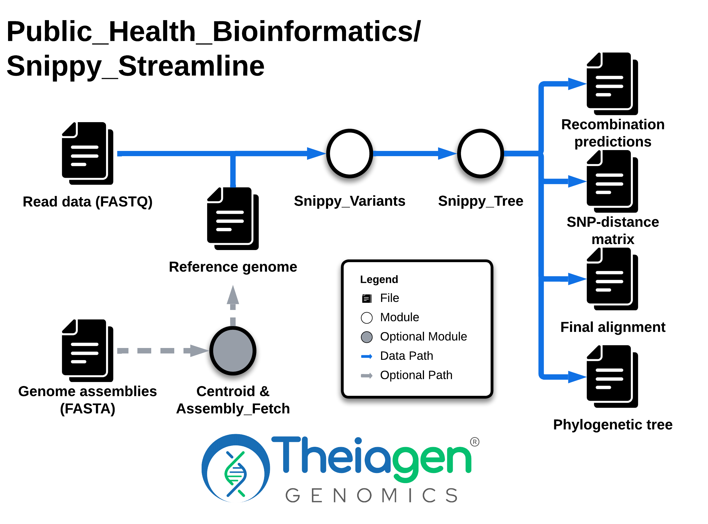

# Snippy_Streamline

## Quick Facts

{{ render_tsv_table("docs/assets/tables/all_workflows.tsv", sort_by="Name", filter_column="Name", filter_values="[**Snippy_Streamline**](../workflows/phylogenetic_construction/snippy_streamline.md)", columns=["Workflow Type", "Applicable Kingdom", "Last Known Changes", "Command-line Compatibility","Workflow Level"]) }}

## Snippy_Streamline_PHB

!!! caption "Snippy_Streamline_PHB Workflow Diagram"
    

    {width=50%}
    

The `Snippy_Streamline` workflow is an all-in-one approach to generating a reference-based phylogenetic tree and associated SNP-distance matrix. The workflow can be run in multiple ways.

!!! dna "Reference Genome Options"

    ==In order to generate a phylogenetic tree, a reference genome is required.== This can be:

    1. provided by the user by filling the `reference_genome_file` input variable
    2. the identified `centroid` genome by setting `use_centroid_as_reference` to true
    3. automatically selected using the `centroid` task and `reference_seeker` task to find a close reference genome to your dataset by providing data in the `assembly_fasta` input variable and leaving the `reference_genome_file` and `use_centroid_as_reference` fields blank

    !!! warning "Automatic Reference Selection"
        If no reference genome is provided, then the user MUST fill in the `assembly_fasta` field for automatic reference genome selection.

!!! dna "Phylogenetic Tree Construction Options"
    There are several options that can be used to customize the phylogenetic tree, including:

    1. masking user-specified regions of the genome (_by providing a bed file to `snippy_core_bed`_)
    2. producing either a core or pan-genome phylogeny and SNP-matrix (_by altering `core_genome`; true [default] = core genome, false = pan-genome_)
    3. choosing the nucleotide substitution (_by altering `iqtree2_model` [see below for possible nucleotide substitution models]_), or allowing IQ-Tree's ModelFinder to identify the best model for your dataset (default)
    4. masking recombination detected by gubbins, or not (_by altering `use_gubbins`; true [default] = recombination masking, false = no recombination masking_)

    !!! warning "Multiple Contigs in Reference Genomes"

        **If reference genomes have multiple contigs, they are incompatible with Gubbins** to mask recombination in the phylogenetic tree. The automatic selection of a reference genome by the workflow may result in a reference with multiple contigs. In this case, an alternative reference genome should be sought, or Gubbins should be turned off (via `use_gubbins = false`).

### Inputs

To run Snippy_Streamline, either a reference genome must be provided (`reference_genome_file`), or you must provide assemblies of the samples in your tree so that the workflow can automatically find and download the closest reference genome to your dataset (via `assembly_fasta`)

!!! info "Input Sequencing Data Requirements"

    **Sequencing data used in the Snippy_Streamline workflow must:**

    - Be Illumina reads
    - Be generated by unbiased whole genome shotgun sequencing
    - Pass appropriate QC thresholds for the taxa to ensure that the reads represent reasonably complete genomes that are free of contamination from other taxa or cross-contamination of the same taxon.
    - If masking recombination with `Gubbins`, input data should represent complete genomes from the same strain/lineage (e.g. MLST) that share a recent common ancestor.

!!! tip "Guidance for optional inputs"

    Several core and optional tasks can be used to generate the Snippy phylogenetic tree, making it highly flexible and suited to a wide range of datasets. You will need to decide which tasks to use depending on the genomes that you are analyzing. Some guidelines for the optional tasks to use for different genome types are provided below.
    
    ??? toggle "Default settings (suitable for most bacteria)"
    
        The default settings are as follows and are suitable for generating phylogenies for most bacteria
        
        - `core_genome` = true (creates core genome phylogeny)
        - `use_gubbins` = true (recombination masked)
        - nucleotide substitution model will be defined by IQTree's Model Finder
    
    ??? toggle "Phylogenies of _Mycobacterium tuberculosis_ complex"
    
        Phylogenies of MTBC are typically constructed with the following options:
        
        - Using the H37Rv reference genome
            - `reference_genome_file` = `"gs://theiagen-public-files-rp/terra/theiaprok-files/Mtb_NC_000962.3.fasta"`
        - Masking repetitive regions of the genome (e.g. PE/PPE genes) that are often misaligned
            - `snippy_core_bed` = `"gs://theiagen-public-files/terra/theiaprok-files/Mtb_NC_000962.3.bed"`
        - Without masking recombination because TB can be considered non-recombinant
            - `use_gubbins` = false
        - Using the core genome
            - `core_genome` = true (as default)

/// html | div[class="searchable-table"]

{{ render_tsv_table("docs/assets/tables/all_inputs.tsv", input_table=True, filters={"Workflow": "Snippy_Streamline"}, columns=["Terra Task Name", "Variable", "Type", "Description", "Default Value", "Terra Status"], sort_by=[("Terra Status", True), "Terra Task Name", "Variable"]) }}

///

### Workflow Tasks

#### Automatic Reference Selection

!!! dna ""
    The following tasks perform automatic reference selection (if no reference genome is provided by the user and `assembly_fasta` is provided).

{{ include_md("common_text/centroid_task.md") }}
{{ include_md("common_text/referenceseeker_task.md") }}
{{ include_md("common_text/ncbi_datasets_task.md", condition="snippy") }}

#### Variant Calling

!!! dna ""
    The following task performs variant calling on the samples using a reference genome (either selected in the previous steps, or provided by the user)

    **Please see the full documentation for [Snippy_Variants](./snippy_variants.md) for more information.**

{{ include_md("common_text/snippy_variants_task.md", condition="snippy_streamline") }}

#### Phylogenetic Construction

!!! dna ""
    The following tasks are a simplified version of the `Snippy_Tree` workflow, which is used to build the phylogenetic tree. The tasks undertaken are exactly the same between both workflows, **but user inputs and outputs have been reduced for clarity and ease**.

    ==**Please see the full documentation for [Snippy_Tree](./snippy_tree.md) for more information.**==

!!! tip "Gubbins Nucleotide Substitution Model"
    In Snippy Streamline, the nucleotide substitution model used by gubbins will always be **GTR+GAMMA**.

{{ include_md("common_text/snippy_core_task.md", condition="snippy_streamline") }}
{{ include_md("common_text/gubbins_task.md", condition="snippy_streamline") }}
{{ include_md("common_text/snp_sites_task.md")}}
{{ include_md("common_text/iqtree2_task.md")}}
{{ include_md("common_text/snp_dists_task.md", condition="snippy")}}
{{ include_md("common_text/data_summary_task.md", condition="snippy")}}
{{ include_md("common_text/shared_variants_task.md", condition="snippy")}}
{{ include_md("common_text/snippy_qc_concatenation_task.md")}}

### Outputs

/// html | div[class="searchable-table"]

{{ render_tsv_table("docs/assets/tables/all_outputs.tsv", input_table=False, filters={"Workflow": "Snippy_Streamline"}, columns=["Variable", "Type", "Description"], sort_by=["Variable"]) }}

///

## References

> Gubbins: Croucher, Nicholas J., Andrew J. Page, Thomas R. Connor, Aidan J. Delaney, Jacqueline A. Keane, Stephen D. Bentley, Julian Parkhill, and Simon R. Harris. 2015. "Rapid Phylogenetic Analysis of Large Samples of Recombinant Bacterial Whole Genome Sequences Using Gubbins." Nucleic Acids Research 43 (3): e15.
<!-- -->
> SNP-sites: Page, Andrew J., Ben Taylor, Aidan J. Delaney, Jorge Soares, Torsten Seemann, Jacqueline A. Keane, and Simon R. Harris. 2016. "SNP-Sites: Rapid Efficient Extraction of SNPs from Multi-FASTA Alignments." Microbial Genomics 2 (4): e000056.
<!-- -->
> IQTree: Nguyen, Lam-Tung, Heiko A. Schmidt, Arndt von Haeseler, and Bui Quang Minh. 2015. "IQ-TREE: A Fast and Effective Stochastic Algorithm for Estimating Maximum-Likelihood Phylogenies." Molecular Biology and Evolution 32 (1): 268–74.
