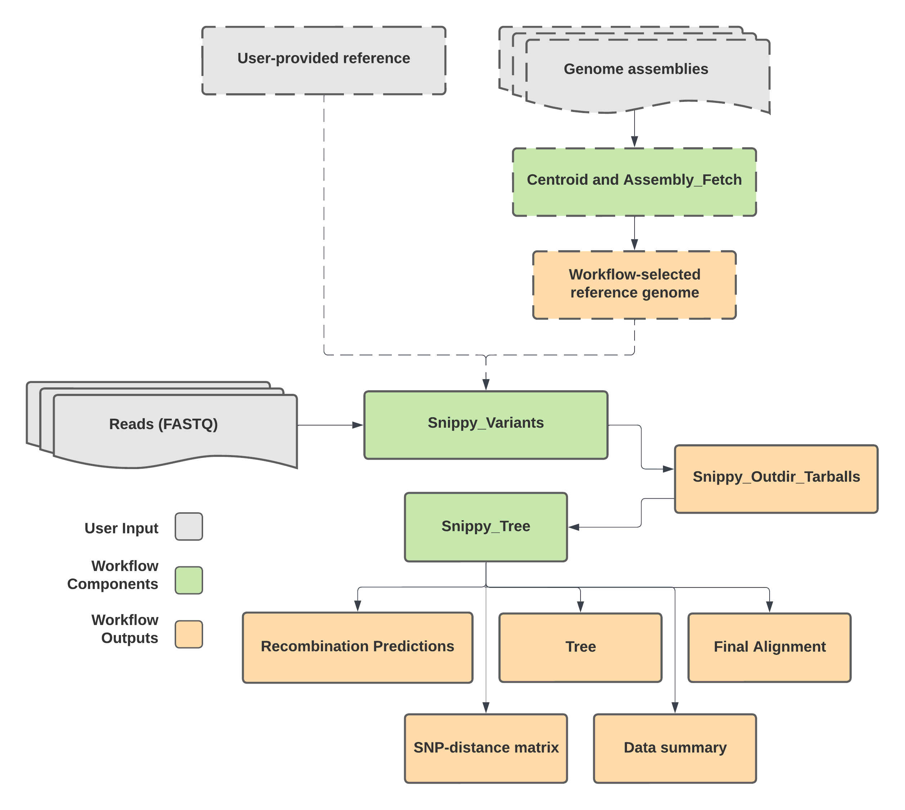

# Snippy_Streamline

## Quick Facts

| **Workflow Type** | **Applicable Kingdom** | **Last Known Changes** | **Command-line Compatibility** | **Workflow Level** |
|---|---|---|---|---|
| [Phylogenetic Construction](../../workflows_overview/workflows_type.md/#phylogenetic-construction) | [Bacteria](../../workflows_overview/workflows_kingdom.md/#bacteria) | PHB v3.0.0 | Yes; some optional features incompatible | Set-level |

## Snippy_Streamline_PHB

!!! caption "Snippy_Streamline_PHB Workflow Diagram"
    <div style="text-align: center;">
    {width=50%}
    </div>

The `Snippy_Streamline` workflow is an all-in-one approach to generating a reference-based phylogenetic tree and associated SNP-distance matrix. The workflow can be run in multiple ways.

!!! dna "Reference Genome Options"

    ==In order to generate a phylogenetic tree, a reference genome is required.== This can be:

    1. provided by the user by filling the `reference_genome_file` input variable
    2. the identified `centroid` genome by setting `use_centroid_as_reference` to true
    3. automatically selected using the `centroid` task and `reference_seeker` task to find a close reference genome to your dataset by providing data in the `assembly_fasta` input variable and leaving the `reference_genome_file` and `use_centroid_as_reference` fields blank

    !!! warning "Automatic Reference Selection"
        If no reference genome is provided, then the user MUST fill in the `assembly_fasta` field for automatic reference genome selection.

!!! dna "Phylogenetic Tree Construction Options"
    There are several options that can be used to customize the phylogenetic tree, including:

    1. masking user-specified regions of the genome (_by providing a bed file to `snippy_core_bed`_)
    2. producing either a core or pan-genome phylogeny and SNP-matrix (_by altering `core_genome`; true [default] = core genome, false = pan-genome_)
    3. choosing the nucleotide substitution (_by altering `iqtree2_model` [see below for possible nucleotide substitution models]_), or allowing IQ-Tree's ModelFinder to identify the best model for your dataset (default)
    4. masking recombination detected by gubbins, or not (_by altering `use_gubbins`; true [default] = recombination masking, false = no recombination masking_)

    !!! warning "Multiple Contigs in Reference Genomes"

        **If reference genomes have multiple contigs, they are incompatible with Gubbins** to mask recombination in the phylogenetic tree. The automatic selection of a reference genome by the workflow may result in a reference with multiple contigs. In this case, an alternative reference genome should be sought, or Gubbins should be turned off (via `use_gubbins = false`).

### Inputs

To run Snippy_Streamline, either a reference genome must be provided (`reference_genome_file`), or you must provide assemblies of the samples in your tree so that the workflow can automatically find and download the closest reference genome to your dataset (via `assembly_fasta`)

!!! info "Input Sequencing Data Requirements"

    **Sequencing data used in the Snippy_Streamline workflow must:**

    - Be Illumina reads
    - Be generated by unbiased whole genome shotgun sequencing
    - Pass appropriate QC thresholds for the taxa to ensure that the reads represent reasonably complete genomes that are free of contamination from other taxa or cross-contamination of the same taxon.
    - If masking recombination with `Gubbins`, input data should represent complete genomes from the same strain/lineage (e.g. MLST) that share a recent common ancestor.

!!! tip "Guidance for optional inputs"

    Several core and optional tasks can be used to generate the Snippy phylogenetic tree, making it highly flexible and suited to a wide range of datasets. You will need to decide which tasks to use depending on the genomes that you are analyzing. Some guidelines for the optional tasks to use for different genome types are provided below.
    
    ??? toggle "Default settings (suitable for most bacteria)"
    
        The default settings are as follows and are suitable for generating phylogenies for most bacteria
        
        - `core_genome` = true (creates core genome phylogeny)
        - `use_gubbins` = true (recombination masked)
        - nucleotide substitution model will be defined by IQTree's Model Finder
    
    ??? toggle "Phylogenies of _Mycobacterium tuberculosis_ complex"
    
        Phylogenies of MTBC are typically constructed with the following options:
        
        - Using the H37Rv reference genome
            - `reference_genome_file` = `"gs://theiagen-public-files-rp/terra/theiaprok-files/Mtb_NC_000962.3.fasta"`
        - Masking repetitive regions of the genome (e.g. PE/PPE genes) that are often misaligned
            - `snippy_core_bed` = `"gs://theiagen-public-files/terra/theiaprok-files/Mtb_NC_000962.3.bed"`
        - Without masking recombination because TB can be considered non-recombinant
            - `use_gubbins` = false
        - Using the core genome
            - `core_genome` = true (as default)

/// html | div[class="searchable-table"]

{{ input_table("docs/assets/input_tables/all_inputs.tsv", input_table=True, filter_column="Workflow", filter_values="Snippy_Streamline", columns=["Terra Task Name", "Variable", "Type", "Description", "Default Value", "Terra Status"], sort_by=[("Terra Status", True), "Terra Task Name", "Variable"]) }}

///

### Workflow Tasks

#### Automatic Reference Selection

!!! dna ""
    The following tasks perform automatic reference selection (if no reference genome is provided by the user and `assembly_fasta` is provided).

??? task "Centroid"
    ##### Centroid  {#centroid} 

    Centroid selects the most central genome among a list of assemblies by computing pairwise mash distances. In `Snippy_Streamline`, this centroid assembly is then used to find a closely related reference genome that can be used to generate the tree.  In order to use `Centroid`, should complete the `samplenames` input. 

    !!! techdetails "`centroid` Technical Details"
        |  | Links |
        | --- | --- |
        | Task | [task_centroid.wdl](https://github.com/theiagen/public_health_bioinformatics/blob/main/tasks/phylogenetic_inference/utilities/task_centroid.wdl) |
        | Software Source Code | <https://github.com/theiagen/centroid> |
        | Software Documentation | <https://github.com/theiagen/centroid> |

??? task "ReferenceSeeker"
    ##### ReferenceSeeker  {#referenceseeker} 

    `ReferenceSeeker` uses your draft assembly to identify closely related bacterial, viral, fungal, or plasmid genome assemblies in [RefSeq](https://www.ncbi.nlm.nih.gov/refseq/).

    Databases for use with ReferenceSeeker are as follows, and can be used by pasting the gs uri in double quotation marks `" "` into the `referenceseeker_db` optional input:

    - archea:  `gs://theiagen-public-files-rp/terra/theiaprok-files/referenceseeker-archaea-refseq-205.v20210406.tar.gz`
    - bacterial (**default**): `gs://theiagen-public-files-rp/terra/theiaprok-files/referenceseeker-bacteria-refseq-205.v20210406.tar.gz`
    - fungi: `gs://theiagen-public-files-rp/terra/theiaprok-files/referenceseeker-fungi-refseq-205.v20210406.tar.gz`
    - plasmids: `gs://theiagen-public-files-rp/terra/theiaprok-files/referenceseeker-plasmids-refseq-205.v20210406.tar.gz`
    - viral: `gs://theiagen-public-files-rp/terra/theiaprok-files/referenceseeker-viral-refseq-205.v20210406.tar.gz`

    For ReferenceSeeker to identify a genome, it must meet user-specified thresholds for sequence coverage (`referenceseeker_conserved_dna_threshold`) and identity (`referenceseeker_ani_threshold`). The default values for these are set according to community standards (conserved DNA >= 69 % and ANI >= 95 %). A list of closely related genomes is provided in `referenceseeker_tsv`. The reference genome that ranks highest according to ANI and conserved DNA values is considered the closest match and will be downloaded, with information about this provided in the `snippy_referenceseeker_top_hit_ncbi_accession` output.

    !!! techdetails "`referenceseeker` Technical Details"
        |  | Links |
        | --- | --- |
        | Task | [task_referenceseeker.wdl](https://github.com/theiagen/public_health_bioinformatics/blob/main/tasks/phylogenetic_inference/utilities/task_referenceseeker.wdl) |
        | Software Source Code | <https://github.com/oschwengers/referenceseeker> |
        | Software Documentation | <https://github.com/oschwengers/referenceseeker> |
        | Original Publication(s) | [ReferenceSeeker: rapid determination of appropriate reference genomes](https://joss.theoj.org/papers/10.21105/joss.01994) |

??? task "NCBI Datasets"
    ##### NCBI Datasets  {#ncbi-datasets} 

    The [`NCBI Datasets`](https://www.ncbi.nlm.nih.gov/datasets/) task downloads specified assemblies from NCBI using either the [virus](https://www.ncbi.nlm.nih.gov/datasets/docs/v2/reference-docs/data-packages/virus-genome/) or [genome](https://www.ncbi.nlm.nih.gov/datasets/docs/v2/reference-docs/data-packages/genome/) (for all other genome types) package as appropriate.
    
    !!! dna "`include_gbff` behavior"
        If `include_gbff` is set to `true`, the gbff file will be used as the reference for `Snippy_Variants` and `Snippy_Tree`. If `include_gbff` is set to `false`, the fasta file will be used as the reference for `Snippy_Variants` and `Snippy_Tree`. Tree topology should not differ, though annotations may.

    !!! techdetails "NCBI Datasets Technical Details"
        |  | Links |
        | --- | --- |
        | Task | [task_ncbi_datasets.wdl](https://github.com/theiagen/public_health_bioinformatics/blob/main/tasks/utilities/data_import/task_ncbi_datasets.wdl) |
        | Software Source Code | <https://github.com/ncbi/datasets> |
        | Software Documentation | <https://github.com/ncbi/datasets> |

#### Variant Calling

!!! dna ""
    The following task performs variant calling on the samples using a reference genome (either selected in the previous steps, or provided by the user)

    **Please see the full documentation for [Snippy_Variants](./snippy_variants.md) for more information.**

??? task "Snippy_Variants"
    ##### Snippy_Variants  {#snippy_variants} 

    `Snippy_Variants` aligns reads for each sample against the reference genome to call SNPs, MNPs and INDELs according to optional input parameters. 

    Optionally, if the user provides a value for `query_gene`, the variant file will be searched for any mutations in the specified regions or annotations. The query string MUST match the gene name or annotation as specified in the GenBank file and the output variant file.

    ??? toggle "QC Metrics from Snippy_Variants"
        This task also extracts QC metrics from the Snippy output for each sample and saves them in per-sample TSV files (`snippy_variants_qc_metrics`). These per-sample QC metrics include the following columns:

        - **samplename**: The name of the sample.
        - **reads_aligned_to_reference**: The number of reads that aligned to the reference genome.
        - **total_reads**: The total number of reads in the sample.
        - **percent_reads_aligned**: The percentage of reads that aligned to the reference genome.
        - **variants_total**: The total number of variants detected between the sample and the reference genome.
        - **percent_ref_coverage**: The percentage of the reference genome covered by reads with a depth greater than or equal to the `min_coverage` threshold (default is 10).
        - **#rname**: Reference sequence name (e.g., chromosome or contig name).
        - **startpos**: Starting position of the reference sequence.
        - **endpos**: Ending position of the reference sequence.
        - **numreads**: Number of reads covering the reference sequence.
        - **covbases**: Number of bases with coverage.
        - **coverage**: Percentage of the reference sequence covered (depth ≥ 1).
        - **meandepth**: Mean depth of coverage over the reference sequence.
        - **meanbaseq**: Mean base quality over the reference sequence.
        - **meanmapq**: Mean mapping quality over the reference sequence.

    !!! techdetails "Snippy Variants Technical Details"
        |  | Links |
        | --- | --- |
        | Task | [task_snippy_variants.wdl](https://github.com/theiagen/public_health_bioinformatics/blob/main/tasks/gene_typing/variant_detection/task_snippy_variants.wdl)<br>[task_snippy_gene_query.wdl](https://github.com/theiagen/public_health_bioinformatics/blob/main/tasks/gene_typing/variant_detection/task_snippy_gene_query.wdl) |
        | Software Source Code | [Snippy on GitHub](https://github.com/tseemann/snippy) |
        | Software Documentation | [Snippy on GitHub](https://github.com/tseemann/snippy) |

#### Phylogenetic Construction

!!! dna ""
    The following tasks are a simplified version of the `Snippy_Tree` workflow, which is used to build the phylogenetic tree. The tasks undertaken are exactly the same between both workflows, **but user inputs and outputs have been reduced for clarity and ease**.

    ==**Please see the full documentation for [Snippy_Tree](./snippy_tree.md) for more information.**==

!!! tip "Gubbins Nucleotide Substitution Model"
    In Snippy Streamline, the nucleotide substitution model used by gubbins will always be **GTR+GAMMA**.

??? task "Snippy"

    ##### Snippy  {#snippy_task} 

    Snippy is used to generate a whole-genome multiple sequence alignment (fasta file) of reads from all the samples we'd like in our tree. 

    When generating the multiple sequence alignment, a bed file can be provided by users to mask certain areas of the genome in the alignment. This is particularly relevant for masking known repetitive regions in _Mycobacterium tuberculosis_  genomes, or masking known regions containing phage sequences.

    !!! info "Why do I see `snippy_core` in Terra?"
        In Terra, this task is named "snippy_core" after the name of the command in the original Snippy tool. Despite the name, this command is NOT being used to make a core genome, but instead a multiple sequence alignment of the whole genome (without any sections masked using a bed file).
        
    !!! techdetails "Snippy Technical Details"
    
        |  | Links |
        | --- | --- |
        | Task | [task_snippy_core.wdl](https://github.com/theiagen/public_health_bioinformatics/blob/main/tasks/phylogenetic_inference/utilities/task_snippy_core.wdl) |
        | Software Source Code | [Snippy on GitHub](https://github.com/tseemann/snippy) |
        | Software Documentation | [Snippy on GitHub](https://github.com/tseemann/snippy) |

??? task "Gubbins (optional)"

    ##### Gubbins (optional)  {#gubbins_task} 

    **_Most optional inputs are hidden in Snippy_Streamline for simplification of the workflow. If you would like to use Gubbins with additional options, please use the `Snippy_Tree` workflow._**

    !!! tip ""
        In Snippy Streamline, the nucleotide substitution model used by gubbins will always be GTR+GAMMA.

    !!! tip "Turn on Gubbins with `use_gubbins`"
        Gubbins runs when the `use_gubbins` option is set to `true` (default=true).
    
    **G**enealogies **U**nbiased **B**y recom**B**inations **I**n **N**ucleotide **S**equences (Gubbins) identifies and masks genomic regions that are predicted to have arisen via recombination. It works by iteratively identifying loci containing elevated densities of SNPs and constructing phylogenies based on the putative single nucleotide variants outside these regions (for more details, see [here](https://github.com/nickjcroucher/gubbins/blob/v3.3/docs/gubbins_manual.md#description-of-the-algorithm)). By default, these phylogenies are constructed using RaxML and a GTR-GAMMA nucleotide substitution model, which will be the most suitable model for most bacterial phylogenetics. 

    Gubbins is the industry standard for masking recombination from bacterial genomes when building phylogenies, but limitations to recombination removal exist. Gubbins cannot distinguish recombination from high densities of SNPs that may result from assembly or alignment errors, mutational hotspots, or regions of the genome with relaxed selection. The tool is also intended only to find recombinant regions that are short relative to the length of the genome, so large regions of recombination may not be masked. These factors should be considered when interpreting resulting phylogenetic trees, but overwhelmingly Gubbins improves our ability to understand ancestral relationships between bacterial genomes.

    !!! techdetails "Gubbins Technical Details"
                
        |  | Links |
        | --- | --- |
        | Task | [task_gubbins.wdl](https://github.com/theiagen/public_health_bioinformatics/blob/main/tasks/phylogenetic_inference/task_gubbins.wdl) |
        | Software Source Code | [Gubbins on GitHub](https://github.com/nickjcroucher/gubbins) |
        | Software Documentation | [Gubbins v3.3 manual](https://github.com/nickjcroucher/gubbins/blob/v3.3/docs/gubbins_manual.md) |
        | Original Publication(s) | [Rapid phylogenetic analysis of large samples of recombinant bacterial whole genome sequences using Gubbins](https://academic.oup.com/nar/article/43/3/e15/2410982) |

??? task "SNP-sites (optional)"

    ##### SNP-sites (optional)  {#snp_sites_task} 

    !!! tip "Turn on SNP-Sites with `core_genome`"
        SNP-sites runs when the `core_genome` option is set to true.

    SNP-sites is used to filter out invariant sites in the whole-genome alignment, thereby creating a core genome alignment for phylogenetic inference. The output is a fasta file containing the core genome of each sample only. If Gubbins has been used, this output fasta will not contain any sites that are predicted to have arisen via recombination.

    !!! techdetails "SNP-sites technical details"
        
        |  | Links |
        | --- | --- |
        | Task | [task_snp_sites.wdl](https://github.com/theiagen/public_health_bioinformatics/blob/main/tasks/phylogenetic_inference/utilities/task_snp_sites.wdl) |
        | Software Source Code | [SNP-sites on GitHub](https://github.com/sanger-pathogens/snp-sites) |
        | Software Documentation | [SNP-sites on GitHub](https://github.com/sanger-pathogens/snp-sites) |
        | Original Publication(s) | [SNP-sites: rapid efficient extraction of SNPs from multi-FASTA alignments](https://www.microbiologyresearch.org/content/journal/mgen/10.1099/mgen.0.000056) |

??? task "IQTree2"

    ##### IQTree2  {#iqtree2_task} 

    IQTree2 is used to build the final phylogeny. It uses the alignment generated in the previous steps of the workflow. The contents of this alignment will depend on whether any sites were masked with recombination.

    The phylogeny is generated using the maximum-likelihood method and a specified nucleotide substitution model. By default, the Snippy_Tree workflow will run Model Finder to determine the most appropriate nucleotide substitution model for your data, but you may specify the nucleotide substitution model yourself using the `iqtree2_model` optional input (see [here](http://www.iqtree.org/doc/Substitution-Models) for available models).

    IQTree will perform assessments of the tree using the Shimodaira–Hasegawa approximate likelihood-ratio test ([SH-aLRT test](https://academic.oup.com/sysbio/article/59/3/307/1702850?login=false)), and ultrafast bootstrapping with [UFBoot2](https://academic.oup.com/mbe/article/35/2/518/4565479), a quicker but less biased alternative to standard bootstrapping. A clade should not typically be trusted if it has less than 80% support from the SH-aLRT test and less than 95% support with ultrafast bootstrapping.

    !!! tip "Nucleotide substitution model"
        When `core_genome`= `true`, the default nucleotide substitution model is set to the General Time Reverside model with Gamma distribution (GTR+G). 
        
        When the user sets `core_genome`= `false`, the default nucleotide substitution model is set to the General Time Reversible model with invariant sites and Gamma distribution (`GTR+I+G`).
                
    !!! techdetails "IQTree2 technical details"
                    
        |  | Links |
        | --- | --- |
        | Task | [task_iqtree2.wdl](https://github.com/theiagen/public_health_bioinformatics/blob/main/tasks/phylogenetic_inference/task_iqtree2.wdl) |
        | Software Source Code | [IQ-TREE on GitHub](https://github.com/iqtree/iqtree2) |
        | Software Documentation | [IQTree documentation](http://www.iqtree.org/doc/) for the latest version (not necessarily the version used in this workflow) |
        | Original Publication(s) | [IQ-TREE 2: New Models and Efficient Methods for Phylogenetic Inference in the Genomic Era](https://academic.oup.com/mbe/article/37/5/1530/5721363)<br>[New Algorithms and Methods to Estimate Maximum-Likelihood Phylogenies: Assessing the Performance of PhyML 3.0](https://academic.oup.com/sysbio/article/59/3/307/1702850?login=false)<br>[Ultrafast Approximation for Phylogenetic Bootstrap](https://academic.oup.com/mbe/article/30/5/1188/997508?login=false)<br> [UFBoot2: Improving the Ultrafast Bootstrap Approximation](https://academic.oup.com/mbe/article/35/2/518/4565479?login=false)<br>[ModelFinder: fast model selection for accurate phylogenetic estimates](https://www.nature.com/articles/nmeth.4285) |

??? task "SNP-dists"

    ##### SNP-dists  {#snp_dists_task} 

    `SNP-dists` computes pairwise SNP distances between genomes. It takes the same alignment of genomes used to generate your phylogenetic tree and produces a matrix of pairwise SNP distances between sequences. This means that if you generated pairwise core-genome phylogeny, the output will consist of pairwise core-genome SNP (cgSNP) distances. Otherwise, these will be whole-genome SNP distances. Regardless of whether core-genome or whole-genome SNPs, this SNP distance matrix will exclude all SNPs in masked regions (i.e. masked with a bed file or gubbins). 

    The SNP-distance output can be visualized using software such as [Phandango](http://jameshadfield.github.io/phandango/#/main) to explore the relationships between the genomic sequences. The task can optionally add a Phandango coloring tag (:c1) to the column names in the output matrix to ensure that all columns are colored with the same color scheme throughout by setting `phandango_coloring` to `true`.

    !!! techdetails "SNP-dists Technical Details"
        
        |  | Links |
        | --- | --- |
        | Task | [task_snp_dists.wdl](https://github.com/theiagen/public_health_bioinformatics/blob/main/tasks/phylogenetic_inference/utilities/task_snp_dists.wdl) |
        | Software Source Code | [SNP-dists on GitHub](https://github.com/tseemann/snp-dists) |
        | Software Documentation | [SNP-dists on GitHub](https://github.com/tseemann/snp-dists) |

??? task "Data summary (optional)"

    ##### Data Summary (optional)  {#data_summary_task} 

    If you fill out the `data_summary_*` and `sample_names` optional variables, you can use the optional `summarize_data` task. The task takes a comma-separated list of column names from the Terra data table, which should each contain a list of comma-separated items. For example, `"amrfinderplus_virulence_genes,amrfinderplus_stress_genes"` (with quotes, comma separated, no spaces) for these output columns from running TheiaProk. The task checks whether those comma-separated items are present in each row of the data table (sample), then creates a CSV file of these results. The CSV file indicates presence (TRUE) or absence (empty) for each item. By default, the task does not add a Phandango coloring tag to group items from the same column, but you can turn this on by setting `phandango_coloring` to `true`.

    ??? toggle "**Example output CSV**"

        ```text linenums="1"
        Sample_Name,aph(3')-IIa,blaCTX-M-65,blaOXA-193,tet(O)
        sample1,TRUE,,TRUE,TRUE
        sample2,,,FALSE,TRUE
        sample3,,,FALSE,
        ```

    ??? toggle "**Example use of Phandango coloring**"

        Data summary produced using the `phandango_coloring` option, visualized alongside Newick tree at <http://jameshadfield.github.io/phandango/#/main>

        !!! caption "Example phandango_coloring output"
            

    !!! techdetails "Data summary technical details"

        |  | Links |
        | --- | --- |
        | Task | [task_summarize_data.wdl](https://github.com/theiagen/public_health_bioinformatics/blob/main/tasks/utilities/data_handling/task_summarize_data.wdl) |

??? task "Concatenate Variants (optional)"

    ##### Concatenate Variants (optional)  {#concatenate_variants_task} 

    ==This task activates when `call_shared_variants` is true.==

    The `cat_variants` task concatenates variant data from multiple samples into a single file `concatenated_variants`. It is very similar to the `cat_files` task, but also adds a column to the output file that indicates the sample associated with each row of data.

    The `concatenated_variants` file will be in the following format:

    | samplename | CHROM | POS | TYPE | REF | ALT | EVIDENCE | FTYPE | STRAND | NT_POS | AA_POS | EFFECT | LOCUS_TAG | GENE | PRODUCT |
    | --- | --- | --- | --- | --- | --- | --- | --- | --- | --- | --- | --- | --- | --- | --- |
    | sample1 | PEKT02000007 | 5224 | snp | C | G | G:21 C:0 |  |  |  |  |  |  |  |  |
    | sample2 | PEKT02000007 | 34112 | snp | C | G | G:32 C:0 | CDS | + | 153/1620 | 51/539 | missense_variant c.153C>G p.His51Gln | B9J08_002604 | hypothetical protein |  |
    | sample3 | PEKT02000007 | 34487 | snp | T | A | A:41 T:0 | CDS | + | 528/1620 | 176/539 | missense_variant c.528T>A p.Asn176Lys | B9J08_002604 | hypothetical protein |  |

    !!! techdetails "Technical Details"
    
        |  | Links |
        | --- | --- |
        | Task | [task_cat_files.wdl](https://github.com/theiagen/public_health_bioinformatics/blob/main/tasks/utilities/file_handling/task_cat_files.wdl) |

??? task "Shared Variants Task (Optional)"

    ##### Shared Variants (optional)  {#shared_variants_task} 

    ==This task activates when `call_shared_variants` is true.==

    The `shared_variants` task takes in the `concatenated_variants` output from the `cat_variants` task and reshapes the data so that variants are rows and samples are columns. For each variant, samples where the variant was detected are populated with a "1" and samples were **either the variant was not detected or there was insufficient coverage to call variants** are populated with a "0". The resulting table is available as the `shared_variants_table` output.

    The `shared_variants_table` file will be in the following format:

    | CHROM | POS | TYPE | REF | ALT | FTYPE | STRAND | NT_POS | AA_POS | EFFECT | LOCUS_TAG | GENE | PRODUCT | sample1 | sample2 | sample3 |
    | --- | --- | --- | --- | --- | --- | --- | --- | --- | --- | --- | --- | --- | --- | --- | --- |
    | PEKT02000007 | 2693938 | snp | T | C | CDS | - | 1008/3000 | 336/999 | synonymous_variant c.1008A>G p.Lys336Lys | B9J08_003879 | NA | chitin synthase 1 | 1 | 1 | 0 |
    | PEKT02000007 | 2529234 | snp | G | C | CDS | + | 282/336 | 94/111 | missense_variant c.282G>C p.Lys94Asn | B9J08_003804 | NA | cytochrome c | 1 | 1 | 1 |
    | PEKT02000002 | 1043926 | snp | A | G | CDS | - | 542/1464 | 181/487 | missense_variant c.542T>C p.Ile181Thr | B9J08_000976 | NA | dihydrolipoyl dehydrogenase | 1 | 1 | 0 |
    
    !!! techdetails "Technical Details"
        |  | Links |
        | --- | --- |
        | Task | [task_shared_variants.wdl](https://github.com/theiagen/public_health_bioinformatics/blob/main/tasks/phylogenetic_inference/utilities/task_shared_variants.wdl) |

??? task "Snippy_Variants QC Metrics Concatenation"

    The per-sample QC metrics generated in `Snippy_Variants` are combined into a single file (`snippy_combined_qc_metrics`). The combined QC metrics file includes the same columns as above for all samples. Note that the last set of columns (`#rname` to `meanmapq`) may repeat for each chromosome or contig in the reference genome.

    The combined QC metrics file includes the same columns as the sample-level file (see [above](#variant-calling) for more details). Note that the last set of columns (`#rname` to `meanmapq`) may repeat for each chromosome or contig in the reference genome.

    !!! tip "QC Metrics for Phylogenetic Analysis"
        These QC metrics provide valuable insights into the quality and coverage of your sequencing data relative to the reference genome. Monitoring these metrics can help identify samples with low coverage, poor alignment, or potential issues that may affect downstream analyses.

    !!! techdetails "Technical Details"
        |  | Links |
        | --- | --- |
        | Task | [task_cat_files.wdl](https://github.com/theiagen/public_health_bioinformatics/blob/main/tasks/utilities/file_handling/task_cat_files.wdl) |

### Outputs

/// html | div[class="searchable-table"]

{{ input_table("docs/assets/tables/all_outputs.tsv", input_table=False, filter_column="Workflow", filter_values="Snippy_Streamline", columns=["Variable", "Type", "Description"], sort_by=["Variable"]) }}

///

## References

> Gubbins: Croucher, Nicholas J., Andrew J. Page, Thomas R. Connor, Aidan J. Delaney, Jacqueline A. Keane, Stephen D. Bentley, Julian Parkhill, and Simon R. Harris. 2015. "Rapid Phylogenetic Analysis of Large Samples of Recombinant Bacterial Whole Genome Sequences Using Gubbins." Nucleic Acids Research 43 (3): e15.
<!-- -->
> SNP-sites: Page, Andrew J., Ben Taylor, Aidan J. Delaney, Jorge Soares, Torsten Seemann, Jacqueline A. Keane, and Simon R. Harris. 2016. "SNP-Sites: Rapid Efficient Extraction of SNPs from Multi-FASTA Alignments." Microbial Genomics 2 (4): e000056.
<!-- -->
> IQTree: Nguyen, Lam-Tung, Heiko A. Schmidt, Arndt von Haeseler, and Bui Quang Minh. 2015. "IQ-TREE: A Fast and Effective Stochastic Algorithm for Estimating Maximum-Likelihood Phylogenies." Molecular Biology and Evolution 32 (1): 268–74.
