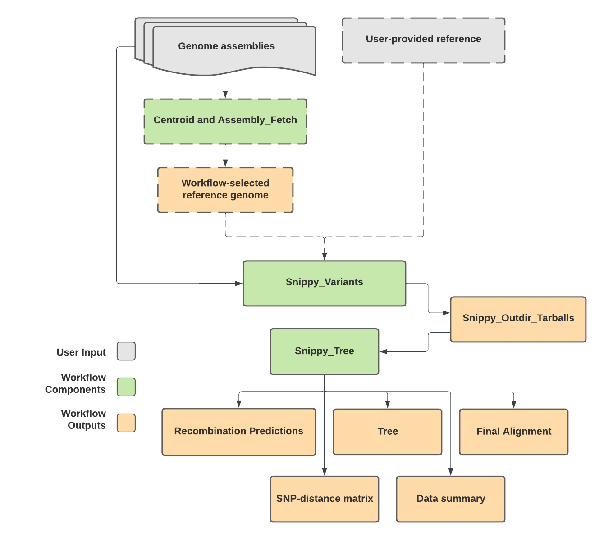

# Snippy_Streamline_FASTA

## Quick Facts

| **Workflow Type** | **Applicable Kingdom** | **Last Known Changes** | **Command-line Compatibility** | **Workflow Level** |
|---|---|---|---|---|
| [Phylogenetic Construction](../../workflows_overview/workflows_type.md/#phylogenetic-construction) | [Bacteria](../../workflows_overview/workflows_kingdom.md/#bacteria) | PHB v2.3.0 | Yes; some optional features incompatible | Set-level |

## Snippy_Streamline_FASTA_PHB

This workflow is a FASTA-compatible version of [Snippy_Streamline](./snippy_streamline.md). Please see the [Snippy_Streamline](./snippy_streamline.md) documentation for more information regarding the workflow tasks.

!!! caption "Snippy_Streamline_FASTA_PHB Workflow Diagram"
    

    {width=50%}
    

The `Snippy_Streamline_FASTA` workflow is an all-in-one approach to generating a reference-based phylogenetic tree and associated SNP-distance matrix. The workflow can be run in multiple ways with options for:

- The reference genome to be provided by the user, or automatically selected using the `Centroid` task and  `Assembly_Fetch` sub-workflow to find a close reference genome to your dataset
- The phylogeny to be generated by optionally
    - masking user-specified regions of the genome (providing a bed file to `snippy_core_bed`)
    - producing either a core or pan-genome phylogeny and SNP-matrix (`core_genome`; default = true)
    - masking recombination detected by gubbins, or not (`use_gubbins`; default=true)
    - choosing the nucleotide substitution (by specifying `iqtree2_model`), or allowing IQ-Tree's ModelFinder to identify the best model for your dataset (default)

!!! info "Assembly Data Requirements"

    Input data used in the Snippy_Streamline_FASTA workflow must:

    - Be assembled genomes in FASTA format
    - Be generated by unbiased whole genome shotgun sequencing
    - Pass appropriate QC thresholds for the taxa to ensure that the assemblies represent reasonably complete genomes that are free of contamination from other taxa or cross-contamination of the same taxon.
    - If masking recombination with `Gubbins`, input data should represent complete genomes from the same strain/lineage (e.g. MLST) that share a recent common ancestor.

!!! warning "Reference Genomes"

    **If reference genomes have multiple contigs, they will not be compatible with using Gubbins** to mask recombination in the phylogenetic tree. The automatic selection of a reference genome by the workflow may result in a reference with multiple contigs. In this case, an alternative reference genome should be sought.

### Workflow Tasks

??? task "Snippy_Variants QC Metrics Concatenation (optional)"

    ##### Snippy_Variants QC Metric Concatenation (optional) {#snippy_variants}

    Optionally, the user can provide the `snippy_variants_qc_metrics` file produced by the Snippy_Variants workflow as input to the workflow to concatenate the reports for each sample in the tree. These per-sample QC metrics include the following columns:

    - **samplename**: The name of the sample.
    - **reads_aligned_to_reference**: The number of reads that aligned to the reference genome.
    - **total_reads**: The total number of reads in the sample.
    - **percent_reads_aligned**: The percentage of reads that aligned to the reference genome.
    - **variants_total**: The total number of variants detected between the sample and the reference genome.
    - **percent_ref_coverage**: The percentage of the reference genome covered by reads with a depth greater than or equal to the `min_coverage` threshold (default is 10).
    - **#rname**: Reference sequence name (e.g., chromosome or contig name).
    - **startpos**: Starting position of the reference sequence.
    - **endpos**: Ending position of the reference sequence.
    - **numreads**: Number of reads covering the reference sequence.
    - **covbases**: Number of bases with coverage.
    - **coverage**: Percentage of the reference sequence covered (depth ≥ 1).
    - **meandepth**: Mean depth of coverage over the reference sequence.
    - **meanbaseq**: Mean base quality over the reference sequence.
    - **meanmapq**: Mean mapping quality over the reference sequence.

    The combined QC metrics file includes the same columns as above for all samples. Note that the last set of columns (`#rname` to `meanmapq`) may repeat for each chromosome or contig in the reference genome.

    !!! tip "QC Metrics for Phylogenetic Analysis"
        These QC metrics provide valuable insights into the quality and coverage of your sequencing data relative to the reference genome. Monitoring these metrics can help identify samples with low coverage, poor alignment, or potential issues that may affect downstream analyses, and we recommend examining them before proceeding with phylogenetic analysis if performing Snippy_Variants and Snippy_Tree separately.

    !!! techdetails "Snippy Variants Technical Details"
        |  | Links |
        | --- | --- |
        | Task | [task_snippy_variants.wdl](https://github.com/theiagen/public_health_bioinformatics/blob/main/tasks/gene_typing/variant_detection/task_snippy_variants.wdl) |
        | Software Source Code | [Snippy on GitHub](https://github.com/tseemann/snippy) |
        | Software Documentation | [Snippy on GitHub](https://github.com/tseemann/snippy) |

### Inputs

| **Terra Task Name** | **Variable** | **Type** | **Description** | **Default Value** | **Terra Status** |
|---|---|---|---|---|---|
| snippy_streamline_fasta | **assembly_fasta** | Array[File] | The assembly files for your samples |  | Required |
| snippy_streamline_fasta | **samplenames** | Array[String] | The names of your samples |  | Required |
| snippy_streamline_fasta | **tree_name** | String | String of your choice to prefix output files |  | Required |
| snippy_streamline_fasta | **reference_genome_file** | File | Reference genome in FASTA or GENBANK format (must be the same reference used in Snippy_Variants workflow); provide this if you want to skip the detection of a suitable reference |  | Optional |
| centroid | **cpu** | Int | Number of CPUs to allocate to the task | 1 | Optional |
| centroid | **disk_size** | Int | Amount of storage (in GB) to allocate to the task | 50 | Optional |
| centroid | **docker** | String | The Docker container to use for the task | us-docker.pkg.dev/general-theiagen/theiagen/centroid:0.1.0 | Optional |
| centroid | **memory** | Int | Amount of memory/RAM (in GB) to allocate to the task | 4 | Optional |
| ncbi_datasets_download_genome_accession | **cpu** | Int | Number of CPUs to allocate to the task | 1 | Optional |
| ncbi_datasets_download_genome_accession | **disk_size** | Int | Amount of storage (in GB) to allocate to the task | 50 | Optional |
| ncbi_datasets_download_genome_accession | **docker** | String | The Docker container to use for the task | us-docker.pkg.dev/general-theiagen/staphb/ncbi-datasets:14.13.2 | Optional |
| ncbi_datasets_download_genome_accession | **include_gbff3** | Boolean | When set to true, outputs a gbff3 file (Genbank file) | FALSE | Optional |
| ncbi_datasets_download_genome_accession | **include_gff** | Boolean | When set to true, outputs a gff file (Annotation file) | FALSE | Optional |
| ncbi_datasets_download_genome_accession | **memory** | Int | Amount of memory/RAM (in GB) to allocate to the task | 4 | Optional |
| ncbi_datasets_download_genome_accession | **use_ncbi_virus** | Boolean | When set to true will download from NCBI Virus Datasets | FALSE | Optional |
| referenceseeker | **cpu** | Int | Number of CPUs to allocate to the task | 4 | Optional |
| referenceseeker | **disk_size** | Int | Amount of storage (in GB) to allocate to the task | 200 | Optional |
| referenceseeker | **docker** | String | The Docker container to use for the task | us-docker.pkg.dev/general-theiagen/biocontainers/referenceseeker:1.8.0--pyhdfd78af_0 | Optional |
| referenceseeker | **memory** | Int | Amount of memory/RAM (in GB) to allocate to the task | 16 | Optional |
| referenceseeker | **referenceseeker_ani_threshold** | Float | Bidirectional average nucleotide identity to use as a cut off for identifying reference assemblies with ReferenceSeeker; default value set according to <https://github.com/oschwengers/referenceseeker#description> | 0.95 | Optional |
| referenceseeker | **referenceseeker_conserved_dna_threshold** | Float | Conserved DNA % to use as a cut off for identifying reference assemblies with ReferenceSeeker; default value set according to <https://github.com/oschwengers/referenceseeker#description> | 0.69 | Optional |
| referenceseeker | **referenceseeker_db** | File | Database to use with ReferenceSeeker | gs://theiagen-public-files-rp/terra/theiaprok-files/referenceseeker-bacteria-refseq-205.v20210406.tar.gz | Optional |
| snippy_tree_wf | **call_shared_variants** | Boolean | Activates the shared variants analysis task | TRUE | Optional |
| snippy_tree_wf | **core_genome** | Boolean | When "true", workflow generates core genome phylogeny; when "false", whole genome is used | TRUE | Optional |
| snippy_tree_wf | **data_summary_column_names** | String | A comma-separated list of the column names from the sample-level data table for generating a data summary (presence/absence .csv matrix) |  | Optional |
| snippy_tree_wf | **data_summary_terra_project** | String | The billing project for your current workspace. This can be found after the "#workspaces/" section in the workspace's URL |  | Optional |
| snippy_tree_wf | **data_summary_terra_table** | String | The name of the sample-level Terra data table that will be used for generating a data summary |  | Optional |
| snippy_tree_wf | **data_summary_terra_workspace** | String | The name of the Terra workspace you are in. This can be found at the top of the webpage, or in the URL after the billing project. |  | Optional |
| snippy_tree_wf | **gubbins_cpu** | Int | Number of CPUs to allocate to the task | 4 | Optional |
| snippy_tree_wf | **gubbins_disk_size** | Int | Amount of storage (in GB) to allocate to the task | 100 | Optional |
| snippy_tree_wf | **gubbins_docker** | String | The Docker container to use for the task | us-docker.pkg.dev/general-theiagen/biocontainers/gubbins:3.3--py310pl5321h8472f5a_0 | Optional |
| snippy_tree_wf | **gubbins_memory** | Int | Amount of memory/RAM (in GB) to allocate to the task | 32 | Optional |
| snippy_tree_wf | **iqtree2_bootstraps** | String | Number of replicates for <http://www.iqtree.org/doc/Tutorial#assessing-branch-supports-with-ultrafast-bootstrap-approximation> (Minimum recommended= 1000) | 1000 | Optional |
| snippy_tree_wf | **iqtree2_cpu** | Int | Number of CPUs to allocate to the task | 4 | Optional |
| snippy_tree_wf | **iqtree2_disk_size** | Int | Amount of storage (in GB) to allocate to the task | 100 | Optional |
| snippy_tree_wf | **iqtree2_docker** | String | The Docker container to use for the task | us-docker.pkg.dev/general-theiagen/staphb/iqtree2:2.1.2 | Optional |
| snippy_tree_wf | **iqtree2_memory** | Int | Amount of memory/RAM (in GB) to allocate to the task | 32 | Optional |
| snippy_tree_wf | **iqtree2_model** | String | Nucelotide substitution model to use when generating the final tree with IQTree2. By default, IQtree runs its ModelFinder algorithm to identify the model it thinks best fits your dataset |  | Optional |
| snippy_tree_wf | **iqtree2_opts** | String | Additional options to pass to IQTree2 |  | Optional |
| snippy_tree_wf | **midpoint_root_tree** | Boolean | A True/False option that determines whether the tree used in the SNP matrix re-ordering task should be re-rooted or not. Options: true of false | TRUE | Optional |
| snippy_tree_wf | **phandango_coloring** | Boolean | Boolean variable that tells the data summary task and the reorder matrix task to include a suffix that enables consistent coloring on Phandango; by default, this suffix is not added. To add this suffix set this variable to true. | FALSE | Optional |
| snippy_tree_wf | **snippy_core_bed** | File | User-provided bed file to mask out regions of the genome when creating multiple sequence alignments |  | Optional |
| snippy_tree_wf | **snippy_core_cpu** | Int | Number of CPUs to allocate to the task | 8 | Optional |
| snippy_tree_wf | **snippy_core_disk_size** | Int | Amount of storage (in GB) to allocate to the task | 100 | Optional |
| snippy_tree_wf | **snippy_core_docker** | String | The Docker container to use for the task | us-docker.pkg.dev/general-theiagen/staphb/snippy:4.6.0 | Optional |
| snippy_tree_wf | **snippy_core_memory** | Int | Amount of memory/RAM (in GB) to allocate to the task | 16 | Optional |
| snippy_tree_wf | **snp_dists_docker** | String | The Docker container to use for the task | us-docker.pkg.dev/general-theiagen/staphb/snp-dists:0.8.2 | Optional |
| snippy_tree_wf | **snp_sites_cpu** | Int | Number of CPUs to allocate to the task | 1 | Optional |
| snippy_tree_wf | **snp_sites_disk_size** | Int | Amount of storage (in GB) to allocate to the task | 100 | Optional |
| snippy_tree_wf | **snp_sites_docker** | String | The Docker container to use for the task | us-docker.pkg.dev/general-theiagen/staphb/snp-sites:2.5.1 | Optional |
| snippy_tree_wf | **snp_sites_memory** | Int | Amount of memory/RAM (in GB) to allocate to the task | 4 | Optional |
| snippy_tree_wf | **use_gubbins** | Boolean | When "true", workflow removes recombination with gubbins tasks; when "false", gubbins is not used | TRUE | Optional |
| snippy_variants_wf | **base_quality** | Int | Minimum quality for a nucleotide to be used in variant calling | 13 | Optional |
| snippy_variants_wf | **cpu** | Int | Number of CPUs to allocate to the task | 4 | Optional |
| snippy_variants_wf | **docker** | String | The Docker container to use for the task | us-docker.pkg.dev/general-theiagen/staphb/snippy:4.6.0 | Optional |
| snippy_variants_wf | **map_qual** | Int | Minimum mapping quality to accept in variant calling |  | Optional |
| snippy_variants_wf | **maxsoft** | Int | Number of bases of alignment to soft-clip before discarding the alignment |  | Optional |
| snippy_variants_wf | **memory** | Int | Amount of memory/RAM (in GB) to allocate to the task | 16 | Optional |
| snippy_variants_wf | **min_coverage** | Int | Minimum read coverage of a position to identify a mutation | 10 | Optional |
| snippy_variants_wf | **min_frac** | Float | Minimum fraction of bases at a given position to identify a mutation | 0.9 | Optional |
| snippy_variants_wf | **min_quality** | Int | Minimum VCF variant call "quality" | 100 | Optional |
| snippy_variants_wf | **query_gene** | String | Indicate a particular gene of interest |  | Optional |
| snippy_variants_wf | **read1** | File | Internal component, do not modify.  |  | Do Not Modify, Optional |
| snippy_variants_wf | **read2** | File | Internal component, do not modify.  |  | Do Not Modify, Optional |
| version_capture | **docker** | String | The Docker container to use for the task | "us-docker.pkg.dev/general-theiagen/theiagen/alpine-plus-bash:3.20.0" | Optional |
| version_capture | **timezone** | String | Set the time zone to get an accurate date of analysis (uses UTC by default) |  | Optional |

### Outputs

| **Variable** | **Type** | **Description** |
|---|---|---|
| snippy_centroid_docker | String | Docker file used for Centroid |
| snippy_centroid_fasta | File | FASTA file for the centroid sample |
| snippy_centroid_mash_tsv | File | TSV file containing mash distances computed by centroid |
| snippy_centroid_samplename | String | Name of the centroid sample |
| snippy_centroid_version | String | Centroid version used |
| snippy_cg_snp_matrix | File | CSV file of core genome pairwise SNP distances between samples, calculated from the final alignment  |
| snippy_combined_qc_metrics | File | Combined QC metrics file containing concatenated QC metrics from all samples. |
| snippy_concatenated_variants | File | The concatenated variants file |
| snippy_filtered_metadata | File | TSV recording the columns of the Terra data table that were used in the summarize_data task |
| snippy_final_alignment | File | Final alignment (FASTA file) used to generate the tree (either after snippy alignment, gubbins recombination removal, and/or core site selection with SNP-sites) |
| snippy_final_tree | File | Final phylogenetic tree produced by Snippy_Streamline |
| snippy_gubbins_branch_stats | File | CSV file showing <https://github.com/nickjcroucher/gubbins/blob/master/docs/gubbins_manual.md#output-statistics> for each branch of the tree   |
| snippy_gubbins_docker | String | Docker file used for Gubbins |
| snippy_gubbins_recombination_gff | File | Recombination statistics in GFF format; these can be viewed in Phandango against the phylogenetic tree |
| snippy_gubbins_version | String | Gubbins version used |
| snippy_iqtree2_docker | String | Docker file used for IQTree2 |
| snippy_iqtree2_model_used | String | Nucleotide substitution model used by IQTree2 |
| snippy_iqtree2_version | String | IQTree2 version used |
| snippy_msa_snps_summary | File | CSV file showing <https://github.com/nickjcroucher/gubbins/blob/master/docs/gubbins_manual.md#output-statistics> for each branch of the tree   |
| snippy_ncbi_datasets_docker | String | Docker file used for NCBI datasets |
| snippy_ncbi_datasets_version | String | NCBI datasets version used |
| snippy_ref | File | Reference genome used by Snippy |
| snippy_ref_metadata_json | File | Metadata associated with the refence genome used by Snippy, in JSON format |
| snippy_referenceseeker_database | String | ReferenceSeeker database used |
| snippy_referenceseeker_docker | String | Docker file used for ReferenceSeeker |
| snippy_referenceseeker_top_hit_ncbi_accession | String | NCBI Accession for the top it identified by Assembly_Fetch |
| snippy_referenceseeker_tsv | File | TSV file of the top hits between the query genome and the Reference Seeker database |
| snippy_referenceseeker_version | String | ReferenceSeeker version used |
| snippy_snp_dists_docker | String | Docker file used for SNP-dists |
| snippy_snp_dists_version | String | SNP-dists version used |
| snippy_snp_sites_docker | String | Docker file used for SNP-sites |
| snippy_snp_sites_version | String | SNP-sites version used |
| snippy_streamline_analysis_date | String | Date of workflow run |
| snippy_streamline_version | String | Version of Snippy_Streamline used |
| snippy_summarized_data | File | CSV presence/absence matrix generated by the summarize_data task (within Snippy_Tree workflow) from the list of columns provided |
| snippy_tree_snippy_docker | String | Docker file used for Snippy in the Snippy_Tree subworkfow |
| snippy_tree_snippy_version | String | Version of Snippy_Tree subworkflow used |
| snippy_variants_outdir_tarball | Array[File] | A compressed file containing the whole directory of snippy output files. This is used when running Snippy_Tree |
| snippy_variants_snippy_docker | Array[String] | Docker file used for Snippy in the Snippy_Variants subworkfow |
| snippy_variants_snippy_version | Array[String] | Version of Snippy_Tree subworkflow used |
| snippy_wg_snp_matrix | File | CSV file of whole genome pairwise SNP distances between samples, calculated from the final alignment |

