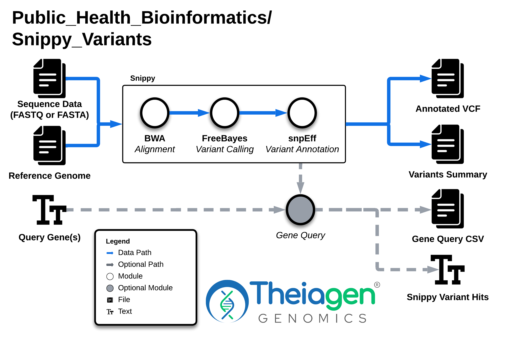

# Snippy_Variants

## Quick Facts

{{ render_tsv_table("docs/assets/tables/all_workflows.tsv", sort_by="Name", filters={"Name": "[**Snippy_Variants**](../workflows/phylogenetic_construction/snippy_variants.md)"}, columns=["Workflow Type", "Applicable Kingdom", "Last Known Changes", "Command-line Compatibility","Workflow Level", "Dockstore"]) }}

## Snippy_Variants_PHB

The `Snippy_Variants` workflow aligns single-end or paired-end reads (in FASTQ format), or assembled sequences (in FASTA format), against a reference genome, then identifies single-nucleotide polymorphisms (SNPs), multi-nucleotide polymorphisms (MNPs), and insertions/deletions (INDELs) across the alignment. If a GenBank file is used as the reference, mutations associated with user-specified query strings (e.g. genes of interest) can additionally be reported to the Terra data table.

!!! caption "Snippy_Variants Workflow Diagram"
    

!!! tip "Example Use Cases"
    - **Finding mutations** (SNPs, MNPs, and INDELs) in your own sample's reads relative to a reference, e.g. mutations in genes of phenotypic interest.
    - **Quality control:** When undertaking quality control of sequenced isolates, it is difficult to identify contamination between multiple closely related genomes using the conventional approaches in TheiaProk (e.g. isolates from an outbreak or transmission cluster). Such contamination may be identified as allele heterogeneity at a significant number of genome positions. `Snippy_Variants` may be used to identify these heterogeneous positions by aligning reads to the assembly of the same reads, or to a closely related reference genome and lowering the thresholds to call SNPs.
    - **Assessing support for a mutation**: `Snippy_Variants` produces a BAM file of the reads aligned to the reference genome. This BAM file can be visualized in IGV (see Theiagen Office Hours recordings) to assess the position of a mutation in supporting reads, or if the assembly of the reads was used as a reference, the position in the contig.
        - Mutations that are only found at the ends of supporting reads may be an error of sequencing.
        - Mutations found at the end of contigs may be assembly errors.

### Inputs

- Single or paired-end reads resulting from Illumina or IonTorrent sequencing can be used. For single-end data, simply omit a value for `read2`
- Assembled genomes can be used. Use the `assembly_fasta` input and omit `read1` and `read2`
- The reference file should be in fasta (e.g. `.fa`, `.fasta`) or [full GenBank](https://github.com/tseemann/snippy/issues/463#issuecomment-863344618) (`.gbk`) format. The mutations identified by Snippy_Variants are highly dependent on the choice of reference genome. Mutations cannot be identified in genomic regions that are present in your query sequence and not the reference.

!!! info "Query String"
    The query string can be a gene or any other annotation that matches the GenBank file/output VCF **EXACTLY**

/// html | div[class="searchable-table"]

{{ render_tsv_table("docs/assets/tables/all_inputs.tsv", input_table=True, filters={"Workflow": "Snippy_Variants"}, columns=["Terra Task Name", "Variable", "Type", "Description", "Default Value", "Terra Status"], sort_by=[("Terra Status", True), "Terra Task Name", "Variable"]) }}

///

### Workflow Tasks

{{ include_md("common_text/snippy_variants_task.md", condition="snippy_variants") }}

### Outputs

!!! tip "Visualize your outputs in IGV"
    Output bam/bai files may be visualized using IGV to manually assess read placement and SNP support.

!!! warning "Note on coverage calculations"
    The outputs from `samtools coverage` (found in the `snippy_variants_coverage_tsv` file) may differ from the `snippy_variants_percent_ref_coverage` due to different calculation methods. `samtools coverage` computes genome-wide coverage metrics (e.g., the proportion of bases covered at depth ≥ 1), while `snippy_variants_percent_ref_coverage` uses a user-defined minimum coverage threshold (default is 10), calculating the proportion of the reference genome with a depth greater than or equal to this threshold.

/// html | div[class="searchable-table"]

{{ render_tsv_table("docs/assets/tables/all_outputs.tsv", input_table=False, filters={"Workflow": "Snippy_Variants"}, columns=["Variable", "Type", "Description"], sort_by=["Variable"]) }}

///

