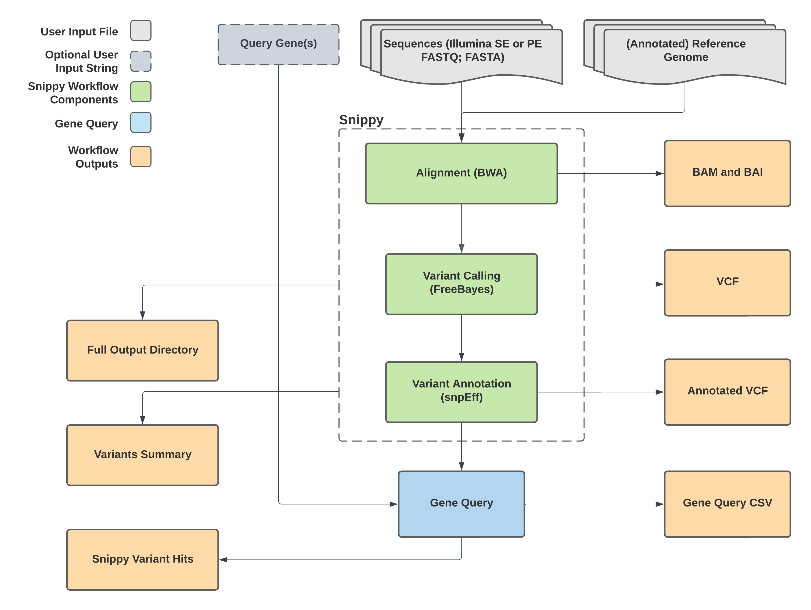

# Snippy_Variants

## Quick Facts

| **Workflow Type** | **Applicable Kingdom** | **Last Known Changes** | **Command-line Compatibility** | **Workflow Level** |
|---|---|---|---|---|
| [Phylogenetic Construction](../../workflows_overview/workflows_type.md/#phylogenetic-construction) | [Bacteria](../../workflows_overview/workflows_kingdom.md/#bacteria), [Mycotics](../../workflows_overview/workflows_kingdom.md#mycotics), [Viral](../../workflows_overview/workflows_kingdom.md/#viral) | PHB v2.2.0 | Yes | Sample-level |

## Snippy_Variants_PHB

The `Snippy_Variants` workflow aligns single-end or paired-end reads (in FASTQ format), or assembled sequences (in FASTA format), against a reference genome, then identifies single-nucleotide polymorphisms (SNPs), multi-nucleotide polymorphisms (MNPs), and insertions/deletions (INDELs) across the alignment. If a GenBank file is used as the reference, mutations associated with user-specified query strings (e.g. genes of interest) can additionally be reported to the Terra data table.

!!! caption "Snippy_Variants Workflow Diagram"
    

!!! tip "Example Use Cases"
    - **Finding mutations** (SNPs, MNPs, and INDELs) in your own sample's reads relative to a reference, e.g. mutations in genes of phenotypic interest.
    - **Quality control:** When undertaking quality control of sequenced isolates, it is difficult to identify contamination between multiple closely related genomes using the conventional approaches in TheiaProk (e.g. isolates from an outbreak or transmission cluster). Such contamination may be identified as allele heterogeneity at a significant number of genome positions. `Snippy_Variants` may be used to identify these heterogeneous positions by aligning reads to the assembly of the same reads, or to a closely related reference genome and lowering the thresholds to call SNPs.
    - **Assessing support for a mutation**: `Snippy_Variants` produces a BAM file of the reads aligned to the reference genome. This BAM file can be visualized in IGV (see Theiagen Office Hours recordings) to assess the position of a mutation in supporting reads, or if the assembly of the reads was used as a reference, the position in the contig.
        - Mutations that are only found at the ends of supporting reads may be an error of sequencing.
        - Mutations found at the end of contigs may be assembly errors.

### Inputs

- Single or paired-end reads resulting from Illumina or IonTorrent sequencing can be used. For single-end data, simply omit a value for `read2`
- Assembled genomes can be used. Use the `assembly_fasta` input and omit `read1` and `read2`
- The reference file should be in fasta (e.g. `.fa`, `.fasta`) or [full GenBank](https://github.com/tseemann/snippy/issues/463#issuecomment-863344618) (`.gbk`) format. The mutations identified by Snippy_Variants are highly dependent on the choice of reference genome. Mutations cannot be identified in genomic regions that are present in your query sequence and not the reference.

!!! info "Query String"
    The query string can be a gene or any other annotation that matches the GenBank file/output VCF **EXACTLY**

| **Terra Task Name** | **Variable** | **Type** | **Description** | **Default Value** | **Terra Status** |
|---|---|---|---|---|---|
| snippy_variants_wf | **reference_genome_file** | File | Reference genome (GenBank file or fasta) |  | Required |
| snippy_variants_wf | **samplename** | String | Names of samples |  | Required |
| snippy_gene_query | **cpu** | Int | Number of CPUs to allocate to the task | 8 | Optional  |
| snippy_gene_query | **disk_size** | Int | Amount of storage (in GB) to allocate to the task | 100 | Optional  |
| snippy_gene_query | **docker** | String | The Docker container to use for the task | us-docker.pkg.dev/general-theiagen/theiagen/terra-tools:2023-06-21 | Optional  |
| snippy_gene_query | **memory** | Int | Amount of memory/RAM (in GB) to allocate to the task | 32 | Optional  |
| snippy_variants | **disk_size** | Int | Amount of storage (in GB) to allocate to the task | 100 | Optional  |
| snippy_variants_wf | **assembly_fasta** | File | Assembly file |  | Optional  |
| snippy_variants_wf | **base_quality** | Int | Minimum quality for a nucleotide to be used in variant calling | 13 | Optional  |
| snippy_variants_wf | **cpus** | Int | Number of CPUs to use | 4 | Optional  |
| snippy_variants_wf | **docker** | String | The Docker container to use for the task | us-docker.pkg.dev/general-theiagen/staphb/snippy:4.6.0 | Optional  |
| snippy_variants_wf | **map_qual** | Int | Minimum mapping quality to accept in variant calling, default from snippy tool is 60 |  | Optional  |
| snippy_variants_wf | **maxsoft** | Int | Number of bases of alignment to soft-clip before discarding the alignment, default from snippy tool is 10 |  | Optional  |
| snippy_variants_wf | **memory** | Int | Amount of memory/RAM (in GB) to allocate to the task | 16 | Optional  |
| snippy_variants_wf | **min_coverage** | Int | Minimum read coverage of a position to identify a mutation | 10 | Optional  |
| snippy_variants_wf | **min_frac** | Float | Minimum fraction of bases at a given position to identify a mutation, default from snippy tool is 0 | 0.9 | Optional  |
| snippy_variants_wf | **min_quality** | Int | Minimum VCF variant call "quality" | 100 | Optional  |
| snippy_variants_wf | **query_gene** | String | Comma-separated strings (e.g. gene names) in which to search for mutations to output to data table |  | Optional  |
| snippy_variants_wf | **read1** | File | Forward read file |  | Optional  |
| snippy_variants_wf | **read2** | File | Reverse read file |  | Optional  |
| version_capture | **docker** | String | The Docker container to use for the task | "us-docker.pkg.dev/general-theiagen/theiagen/alpine-plus-bash:3.20.0" | Optional |
| version_capture | **timezone** | String | Set the time zone to get an accurate date of analysis (uses UTC by default) |  | Optional |

### Workflow Tasks

`Snippy_Variants` uses the snippy tool to align reads to the reference and call SNPs, MNPs and INDELs according to optional input parameters. The output includes a file of variants that is then queried using the `grep` bash command to identify any mutations in specified genes or annotations of interest. The query string MUST match the gene name or annotation as specified in the GenBank file and provided in the output variant file in the `snippy_results` column.

Additionally, `Snippy_Variants` extracts quality control (QC) metrics from the Snippy output for each sample. These per-sample QC metrics are saved in TSV files (`snippy_variants_qc_metrics`). The QC metrics include:

- **Percentage of reads aligned to the reference genome** (`snippy_variants_percent_reads_aligned`).
- **Percentage of the reference genome covered at or above the specified depth threshold** (`snippy_variants_percent_ref_coverage`).

These per-sample QC metrics can be combined into a single file (`snippy_combined_qc_metrics`) in downstream workflows, such as `snippy_tree_wf`, providing an overview of QC metrics across all samples.

### Outputs

!!! tip "Visualize your outputs in IGV"
    Output bam/bai files may be visualized using IGV to manually assess read placement and SNP support.

!!! warning "Note on coverage calculations"
    The outputs from `samtools coverage` (found in the `snippy_variants_coverage_tsv` file) may differ from the `snippy_variants_percent_ref_coverage` due to different calculation methods. `samtools coverage` computes genome-wide coverage metrics (e.g., the proportion of bases covered at depth ≥ 1), while `snippy_variants_percent_ref_coverage` uses a user-defined minimum coverage threshold (default is 10), calculating the proportion of the reference genome with a depth greater than or equal to this threshold.

| **Variable** | **Type** | **Description** |
|---|---|---|
| snippy_variants_bai | File | Indexed bam file of the reads aligned to the reference |
| snippy_variants_bam | File | Bam file of reads aligned to the reference |
| snippy_variants_coverage_tsv | File | Coverage statistics TSV file output by the `samtools coverage` command, providing genome-wide metrics such as the proportion of bases covered (depth ≥ 1), mean depth, and other related statistics.            |
| snippy_variants_docker | String | Docker image for snippy variants task |
| snippy_variants_gene_query_results | File | CSV file detailing results for mutations associated with the query strings specified by the user |
| snippy_variants_hits | String | A summary of mutations associated with the query strings specified by the user |
| snippy_variants_num_reads_aligned | Int | Number of reads that aligned to the reference genome as calculated by samtools view -c command |
| snippy_variants_num_variants | Int | Number of variants detected between sample and reference genome |
| snippy_variants_outdir_tarball | File | A compressed file containing the whole directory of snippy output files. This is used when running Snippy_Tree |
| snippy_variants_percent_reads_aligned | Float | Percentage of reads aligned to the reference genome |
| snippy_variants_percent_ref_coverage| Float | Proportion of the reference genome covered by reads with a depth greater than or equal to the `min_coverage` threshold (default is 10). |
| snippy_variants_query | String | Query strings specified by the user when running the workflow |
| snippy_variants_query_check | String | Verification that query strings are found in the reference genome |
| snippy_variants_results | File | CSV file detailing results for all mutations identified in the query sequence relative to the reference |
| snippy_variants_summary | File | A summary TXT fie showing the number of mutations identified for each mutation type |
| snippy_variants_version | String | Version of Snippy used |
| snippy_variants_wf_version | String | Version of Snippy_Variants used |
