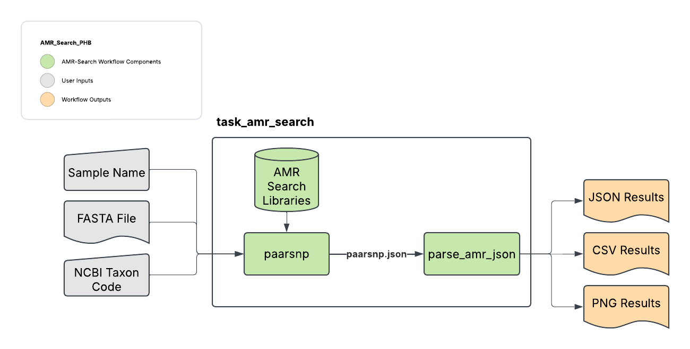

# AMR Search

## Quick Facts

{{ render_tsv_table("docs/assets/tables/all_workflows.tsv", sort_by="Name", filter_column="Name", filter_values="[**AMR_Search**](../workflows/standalone/amr_search.md)", columns=["Workflow Type", "Applicable Kingdom", "Last Known Changes", "Command-line Compatibility","Workflow Level"]) }}

## AMR_Search_PHB

!!! caption "AMR_Search Workflow Diagram"
    

The AMR_Search workflow is a standalone version of Pathogenwatch's AMR profiling functionality utilizing `AMRsearch` tool from Pathogenwatch.

A limited number of species are currently supported and are listed below. NCBI codes are needed from this table to select the correct library.

| Species                      | NCBI Code |
|------------------------------|-----------|
| _Neisseria gonorrhoeae_      | 485       |
| _Staphylococcus aureus_      | 1280      |
| _Salmonella typhi_          | 90370     |
| _Streptococcus pneumoniae_   | 1313      |
| _Klebisiella_                | 570       |
| _Klebsiella pneumoniae_     | 573       |
| _Candida auris_              | 498019    |
| _Vibrio cholerae_            | 666       |
| _Campylobacter_              | 194       |

### Inputs

/// html | div[class="searchable-table"]

{{ render_tsv_table("docs/assets/tables/all_inputs.tsv", input_table=True, filter_column="Workflow", filter_values="AMR_Search", columns=["Terra Task Name", "Variable", "Type", "Description", "Default Value", "Terra Status"], sort_by=[("Terra Status", True), "Terra Task Name", "Variable"]) }}

///

### Workflow Tasks

{{ include_md("common_text/amr_search_task.md") }}

### Outputs

/// html | div[class="searchable-table"]

{{ render_tsv_table("docs/assets/tables/all_outputs.tsv", input_table=False, filter_column="Workflow", filter_values="AMR_Search", columns=["Variable", "Type", "Description"], sort_by=["Variable"]) }}

///

## References

> [Pathogenwatch AMRsearch](https://github.com/pathogenwatch-oss/amr-search)
<!-- -->
> [PAARSNP](https://www.ncbi.nlm.nih.gov/pmc/articles/PMC7545138/)