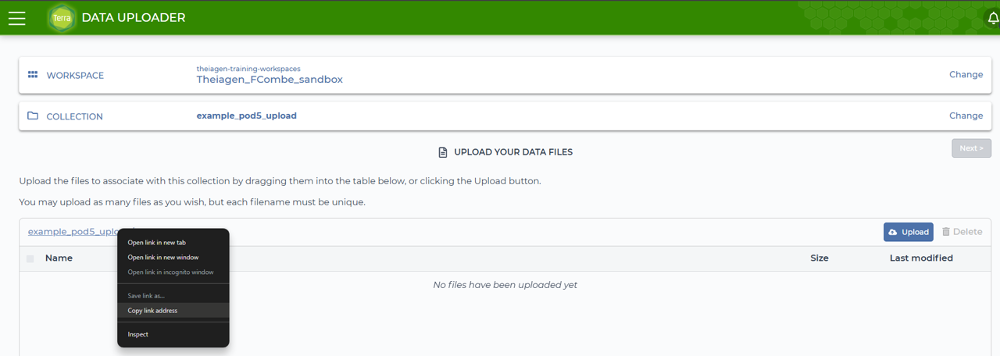
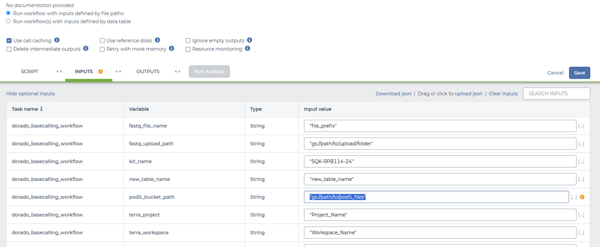

# Dorado Basecalling Workflow

## Quick Facts

| **Workflow Type** | **Applicable Kingdom** | **Last Known Changes** | **Command-line Compatibility** | **Workflow Level** |
|---|---|---|---|---|
| [Standalone](../../workflows_overview/workflows_type.md/#standalone) | [Any Taxa](../../workflows_overview/workflows_kingdom.md/#any-taxa) | v2.3.0 | Yes | Sample-level |

## Dorado_Basecalling_PHB

The Dorado Basecalling workflow is used to convert Oxford Nanopore `POD5` sequencing files into `FASTQ` format by utilizing a GPU-accelerated environment. This workflow is ideal for high-throughput applications where fast and accurate basecalling is essential. The workflow utilizes the Terra Data Uploader to add `POD5` files to a Google Cloud Storage (GCS) bucket and provide the bucket path `(gs://...)` as an input to the workflow, and output final `fastq` files to a user designated terra table for downstream analysis.

### Model Type Selection

Users can configure the basecalling model by setting the `dorado_model` input parameter:

**Default Model: "`sup`" (super accuracy)** is used unless overridden by the user.

**Automatic Detection:** When set to `sup`, `hac`, or `fast`, Dorado will automatically select the appropriate model version if available.

- **Model Type (`sup`):** (Super Accuracy) The most accurate model, recommended for applications requiring the highest basecall accuracy. It is the slowest of the three model types.
- **Model Type (`hac`):** (High Accuracy) A balance between speed and accuracy. Provides basecalls faster but those basecalls will be less accurate than those resulting from using the `sup` model.
- **Model Type (`fast`):** (Fast Model) The fastest model, recommended when speed is prioritized over accuracy, such as for initial analyses or non-critical applications.

**Manual Model Input:** Users can specify the full path or name of a specific model (e.g. `dna_r10.4.1_e8.2_400bps_hac@v4.2.0`).

### Example Manual Models:

- `dna_r10.4.1_e8.2_400bps_sup@v4.2.0`
- `dna_r10.4.1_e8.2_400bps_hac@v4.2.0`
- `dna_r10.4.1_e8.2_400bps_fast@v4.2.0`

??? Info "Supported Kit Names"

    Ensure you use an accepted kit name in the `kit_name` parameter. The following kit names are supported in Dorado:

    ```
    EXP-NBD103, EXP-NBD104, EXP-NBD114, EXP-NBD114-24, EXP-NBD196, EXP-PBC001, EXP-PBC096, 
    SQK-16S024, SQK-16S114-24, SQK-LWB001, SQK-MLK111-96-XL, SQK-MLK114-96-XL, SQK-NBD111-24, 
    SQK-NBD111-96, SQK-NBD114-24, SQK-NBD114-96, SQK-PBK004, SQK-PCB109, SQK-PCB110, SQK-PCB111-24, 
    SQK-PCB114-24, SQK-RAB201, SQK-RAB204, SQK-RBK001, SQK-RBK004, SQK-RBK110-96, SQK-RBK111-24, 
    SQK-RBK111-96, SQK-RBK114-24, SQK-RBK114-96, SQK-RLB001, SQK-RPB004, SQK-RPB114-24, 
    TWIST-16-UDI, TWIST-96A-UDI, VSK-PTC001, VSK-VMK001, VSK-VMK004, VSK-VPS001
    ```

    Select from these options to avoid input errors.

### Inputs

| **Terra Task Name** | **Variable** | **Type** | **Description** | **Default Value** | **Terra Status** |
|---|---|---|---|---|---|
| dorado_basecalling_workflow | **pod5_bucket_path** | String | GCS path of the bucket containing POD5 files. | None | Required |
| dorado_basecalling_workflow | **fastq_file_name** | String | Prefix for naming output FASTQ files | None | Required |
| dorado_basecalling_workflow | **kit_name** | String | Sequencing kit name used (e.g., `SQK-RPB114-24`) | None | Required |
| dorado_basecalling_workflow | **fastq_upload_path** | String | Terra folder path for uploading FASTQ files | None | Required |
| dorado_basecalling_workflow | **terra_project** | String | Terra project ID for FASTQ file upload | None | Required |
| dorado_basecalling_workflow | **terra_workspace** | String | Terra workspace for final FASTQ file upload | None | Required |
| dorado_basecalling_workflow | **dorado_model** | String | Model speed for basecalling ('sup' for super accuracy, 'hac' for high accuracy, or 'fast' for high speed). Users may also specify a full model name. | "sup" | Optional |
| basecall_task.basecall | **cpu** | Int | Number of CPUs allocated | 8 | Optional |
| basecall_task.basecall | **gpuCount** | Int | Number of GPUs to use | 1 | Optional |
| basecall_task.basecall | **gpuType** | String | Type of GPU (e.g., `nvidia-tesla-t4`) | "nvidia-tesla-t4" | Optional |
| basecall_task.basecall | **memory** | Int | Amount of memory to allocate (GB) | 32 | Optional |
| dorado_basecalling_workflow | **assembly_data** | Boolean | Indicates if the data is for assembly | false | Optional |
| dorado_basecalling_workflow | **file_ending** | String? | File extension pattern for identifying files (e.g., ".fastq.gz") | None | Optional |
| dorado_basecalling_workflow | **paired_end** | Boolean | Indicates if data is paired-end | false | Optional |

### Uploading Pod5 Files to Terra `pod5_bucket_path`"

??? toggle "Click for more information"
    To run the Dorado Basecalling Workflow, you must first upload your `POD5 files` to a Google Cloud Storage (GCS) bucket within your Terra workspace. Follow these steps:

    **Step 1: Use the Terra Data Uploader**
    Go to the **"Data"** tab in your Terra workspace. Click **"Upload Files"** and select your `POD5` files for upload. Confirm the upload process and wait for the files to be uploaded.

    **Step 2: Copy the GCS Path**
    After the upload is complete, Right-click the collection name and select "Copy link address."

    

    **Step 3: Paste the GCS Path into the Workflow Input**
    Open the workflow configuration screen in Terra. Paste the copied GCS path into the `pod5_bucket_path` input field for the Dorado Basecalling Workflow.
    
    

!!! info "Detailed Input Information"
    - **dorado_model**: If set to 'sup', 'hac', or 'fast', the workflow will run with automatic model selection. If a full model name is provided, Dorado will use that model directly.
    - **fastq_file_name**: This will serve as a prefix for the output FASTQ files. For example, if you provide `project001-`, the resulting files will be named `project001-barcodeXX.fastq.gz`.
    - **kit_name**: Ensure the correct kit name is provided, as it determines the barcoding and adapter trimming behavior.
    - **fastq_upload_path**: This is the folder path in Terra where the final FASTQ files will be transferred for further analysis. Ensure the path matches your Terra workspace bucket GSURI. Please visit the "Dashboard" tab of your Terra workspace which provides a link to the bucket in the "Cloud Information" drop-down panel. The root GSURI for Terra workspace buckets generally start with `gs://fc-` followed by a unique identifier.

!!! tip "File Naming Guidelines"
    - **Avoid special characters**: Do not include special characters such as underscores (`_`), periods (`.`), or any non-alphanumeric symbols in the `fastq_file_name` prefix, as these can interfere with proper file parsing and sample name recognition.
    - **Use a clear, simple prefix**: The prefix `projectname` will automatically append identifiers like `-barcodeXX.fastq.gz` or `-unclassified.fastq.gz` to name each output file, ensuring each one is distinct.

    ### Examples:

    - **Accepted Prefix**: `projectname-barcode01.fastq.gz`
    - **Not Recommended**: `projectname_2024_test-barcode01.fastq.gz` (would recognize only `projectname` as the sample name, leading to ambiguity with multiple files).

### Workflow Tasks

This workflow is composed of several tasks to process, basecall, and analyze Oxford Nanopore `POD5` files:

??? task "`Transfer POD5 Files`: Transfers `POD5` files to Terra"
    Lists `.pod5` files in the specified GCS bucket and passes their paths to the basecalling task.

??? task "`Dorado Basecalling`: Converts `POD5` files to 'SAM' files"
    The basecalling task takes `POD5` files as input and converts them into 'SAM' format using the specified model. This step leverages GPU acceleration for efficient processing.

??? task "`Samtools Convert`: Converts SAM to BAM"
    Once the SAM files are generated, this task converts them into BAM format, optimizing them for downstream applications and saving storage space.

??? task "`Dorado Demultiplexing`: Produces barcode-specific FASTQ files"
    This task demultiplexes the BAM files based on barcodes, generating individual FASTQ files for each barcode to support further analyses.

??? task "`FASTQ File Transfer`: Transfers files to Terra"
    After demultiplexing, the FASTQ files are uploaded to the Terra workspace bucket for storage and potential use in other workflows.

??? task "`Terra Table Creation`: Creates a Terra table with FASTQ files"
    A Terra table is created to index the uploaded FASTQ files, enabling easy access and integration with other workflows for downstream analyses.

### Outputs

| **Variable** | **Type** | **Description** |
|---|---|---|
| **fastq_files** | Array[File] | FASTQ files produced from basecalling and demultiplexing |
| **terra_table_tsv** | File | TSV file for Terra table upload |
| **dorado_version** | String | Version of Dorado used in the workflow |
| **dorado_model** | String | Model used for basecalling |
|  **samtools_version** | String | Version of Samtools used in the workflow |
|  **dorado_analysis_date** | String | Date of Dorado analysis |
|  **dorado_phb_version** | String | Version of Dorado PHB workflow |

## References
<!-- -->
><https://github.com/nanoporetech/dorado/>
