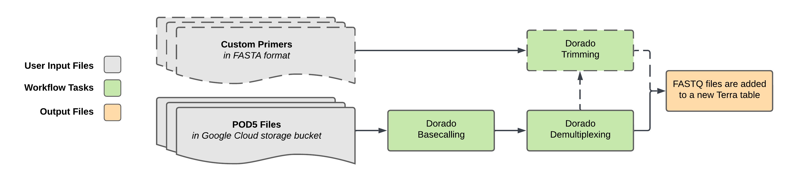

# Dorado Basecalling

## Quick Facts

{{ render_tsv_table("docs/assets/tables/all_workflows.tsv", sort_by="Name", filter_column="Name", filter_values="[**Dorado_Basecalling**](../workflows/standalone/dorado_basecalling.md)", columns=["Workflow Type", "Applicable Kingdom", "Last Known Changes", "Command-line Compatibility","Workflow Level"]) }}

## Dorado_Basecalling_PHB

The Dorado Basecalling workflow is used to convert Oxford Nanopore `POD5` sequencing files into `FASTQ` format by using a GPU-accelerated environment. This workflow is ideal for high-throughput applications where fast and accurate basecalling is essential. Users upload POD5 files to a Google Cloud Storage (GCS) bucket, and then provide that directory's path as a workflow input. The workflow basecalls all POD5 files in the provided location, and then outputs final FASTQ files to a user-designated Terra table for downstream analysis.

!!! caption "Dorado_Basecalling_PHB Workflow Diagram"
    

### Configuring Workflow in Terra

We recommend running this workflow with **"Run workflow with inputs defined by file paths"** selected in Terra. This allows the user to skip the step of creating a Terra table for the POD5 files. The user will only need to provide the GCS path of the POD5 files, and the workflow will automatically find and basecall all POD5 files in that location. The resulting FASTQ files will be added to a Terra table of your choice.

???+ dna "Uploading POD5 Files to Terra `pod5_bucket_path`"
    To run the Dorado Basecalling Workflow, you must first upload your `POD5 files` to a Google Cloud Storage (GCS) bucket within your Terra workspace. Follow these steps:

    1. **Use the Terra Data Uploader**
        
        Go to the **"Data"** tab in your Terra workspace. Click **"Upload Files"** and select your `POD5` files for upload. Confirm the upload process and wait for the files to be uploaded.

    2. **Copy the GCS Path**
        
        After the upload is complete, right-click the collection name and select "Copy link address"

        !!! caption "Copy link address"
            

    3. **Paste the GCS Path into the Workflow Input**
        
        Open the workflow configuration screen in Terra. Paste the copied GCS path into the `pod5_bucket_path` input field for the Dorado Basecalling Workflow. 
        
        Make sure the select the `"Run workflow with inputs defined by file paths"` option, as shown.
    
        !!! caption "Workflow Inputs"
            

### Model Type Selection

Users can configure the basecalling model by setting the `dorado_model` input parameter.

**Automatic Model Detection:** When `dorado_model` is set to either `sup`, `hac`, or `fast`, Dorado will automatically select the appropriate model version if available.

- **`sup`** (super-accurate): This model is the most accurate and is recommended for applications requiring the highest basecall accuracy. It is the slowest of the three model types and requires the most computational resources. _This is the default model for this workflow._
- **`hac`** (high-accuracy): This model provides a balance between speed and accuracy. This model basecalls faster than `sup`, but those basecalls will be less accurate. It is recommended for most users by the Dorado developers.
- **`fast`** (fast model): This model is the fastest and least accurate and is recommended when speed is prioritized over accuracy, such as for initial analyses or non-critical applications.

**Manual Model Input:** Alternatively, users can specify either a simplex model path or a model complex (e.g.`dna_r10.4.1_e8.2_400bps_hac@v4.2.0` or `hac,5mCG_5hmCG`). Please see the [Dorado documentation](https://dorado-docs.readthedocs.io/en/latest/models/models/) for more details on the manual model naming conventions. You can also find the [full list of available simplex and modified basecalling models here](https://dorado-docs.readthedocs.io/en/latest/models/list/).

!!! tip "Example Manual Models"
    - `sup,5mCG_5hmCG,6mA`
    - `dna_r10.4.1_e8.2_400bps_hac@v4.3.0_6mA@v1`
    - `sup@v4.2.0,6mA@v1`

### Supported Kit Names

Ensure you use an accepted barcoding kit name in the `kit_name` parameter. Check if your barcoding kit is supported by the Dorado workflow by clicking the toggle below. If not, please contact <support@theiagen.com> for assistance

??? toggle "Click to see a list of currently accepted kit names"
    - EXP-NBD103
    - EXP-NBD104
    - EXP-NBD114
    - EXP-NBD114-24
    - EXP-NBD196
    - EXP-PBC001
    - EXP-PBC096
    - SQK-16S024
    - SQK-16S114-24
    - SQK-LWB001
    - SQK-MLK111-96-XL
    - SQK-MLK114-96-XL
    - SQK-NBD111-24
    - SQK-NBD111-96
    - SQK-NBD114-24
    - SQK-NBD114-96
    - SQK-PBK004
    - SQK-PCB109
    - SQK-PCB110
    - SQK-PCB111-24
    - SQK-PCB114-24
    - SQK-RAB201
    - SQK-RAB204
    - SQK-RBK001
    - SQK-RBK004
    - SQK-RBK110-96
    - SQK-RBK111-24
    - SQK-RBK111-96
    - SQK-RBK114-24
    - SQK-RBK114-96
    - SQK-RLB001
    - SQK-RPB004
    - SQK-RPB114-24
    - TWIST-16-UDI
    - TWIST-96A-UDI
    - VSK-PTC001
    - VSK-VMK001
    - VSK-VMK004
    - VSK-VPS001

### Inputs

!!! info "Detailed Input Information"
    - **dorado_model**: If set to 'sup', 'hac', or 'fast', the workflow will run with automatic model selection. If a full model name is provided, Dorado will use that model directly. See the [Model Type Selection](#model-type-selection) section for more details.
    - **output_file_prefix**: This will serve as a prefix for the output FASTQ files. For example, if you provide `project001`, the resulting files will be named `project001-barcodeXX.fastq.gz`.

        !!! tip "`output_file_prefix` suggestions"
            - _Avoid special characters_: Do not include special characters (such as `/`, or `&`) or whitespace in the `output_file_prefix` variable
            - _Use a clear, simple prefix_: The prefix `projectname` will be automatically prepended to identifiers like `-barcodeXX.fastq.gz` or `-unclassified.fastq.gz` to name each output file, ensuring each one is distinct.
  
    - **kit_name**: Ensure the correct kit name is provided, as it determines the barcoding and adapter trimming behavior. See the [Supported Kit Names](#supported-kit-names) section for a list of accepted kit names.

!!! tip "Increasing Chunk Size"
    The identified pod5 files will be split into four groups (or the number indicated by `number_chunks`) for basecalling. You can decrease runtime by raising the number of chunks with the `number_chunks` variable.

    We recommend keeping the number of chunks under 20 if running this workflow on Terra in order to prevent VM allocation times from drastically increasing. Walltime drastically increases as the number of chunks nears 20 (upwards of hours to days longer) despite relatively low CPU time.

    If the number of chunks is MORE than the number of pod5 files identified, the number of chunks will be set to the number of identified pod5 files.

/// html | div[class="searchable-table"]

{{ render_tsv_table("docs/assets/tables/all_inputs.tsv", input_table=True, filter_column="Workflow", filter_values="Dorado_Basecalling", columns=["Terra Task Name", "Variable", "Type", "Description", "Default Value", "Terra Status"], sort_by=[("Terra Status", True), "Terra Task Name", "Variable"]) }}

///

### Workflow Tasks

This workflow is composed of several tasks to process, basecall, and analyze Oxford Nanopore `POD5` files.

??? task "`find_files`: Identifying all POD5 files in the `pod5_bucket_path`"
    Since this workflow only recieves a location for the POD5 files, this task was created to search the `pod5_bucket_path` location in order to create a list of all included POD5 files so that later tasks can perform basecalling on them. By default, this task is configured to search for `.pod5` files.

    !!! techdetails "Find Files Technical Details"
        |  | Links |
        | --- | --- |
        | Task | [task_find_files.wdl](https://github.com/theiagen/public_health_bioinformatics/blob/main/tasks/utilities/file_handling/task_find_files.wdl) |

??? task "`chunk_files`: Splitting POD5 files into groups for parallel basecalling"
    In order to improve runtime, POD5 files are split into groups or "chunks" for basecalling. The number of chunks can be indicated by providing a value for the `number_chunks` value. By default, the number of chunks is four.

    !!! techdetails "Chunk Files Technical Details"
        |  | Links |
        | --- | --- |
        | Task | [task_chunk_files.wdl](https://github.com/theiagen/public_health_bioinformatics/blob/main/tasks/utilities/file_handling/task_chunk_files.wdl) |

??? task "`dorado_basecall`: Basecalling POD5 files"
    The basecalling task takes POD5 files as input and converts each individual POD5 into 'BAM' format using the either the default or user-specified model. This step leverages GPU acceleration for efficient processing.

    Please see the [Dorado documentation](https://dorado-docs.readthedocs.io/en/latest/basecaller/basecall_overview/) for more details, but what follows is a brief overview of the basecalling process:

    1. POD5 files are pre-processed via signal scaling and normalization.
    2. The machine learning algorithm decodes the sequence signals into nucleotide base calls. There are different machine learning models that can be specified as input; more details can be found above [here](#model-type-selection).
    3. [Barcode classification](https://dorado-docs.readthedocs.io/en/latest/barcoding/barcoding/) is performed based on the indicated kit name to enable downstream demultiplexing. 

        !!! info "Barcode Trimming"
            Barcode trimming is purposefully **disabled** during the basecalling step to ensure accurate demultiplexing in subsequent workflow steps.

    4. Modified basecalling can be performed if indicated through [modification to the model name](https://dorado-docs.readthedocs.io/en/latest/basecaller/mods/).
    5. [Reads are split](https://dorado-docs.readthedocs.io/en/latest/basecaller/read_splitting/) when a single read contains multiple concatenated reads.

    Other options are available, but currently Dorado_Basecalling_PHB does not support them. Please contact <support@theiagen.com> if you would like additional options.

    !!! techdetails "Dorado Basecalling Technical Details"
        |  | Links |
        | --- | --- |
        | Task | [task_dorado_basecall.wdl](https://github.com/theiagen/public_health_bioinformatics/blob/main/tasks/basecalling/task_dorado_basecall.wdl) |
        | Software Source Code | [Dorado on GitHub](https://github.com/nanoporetech/dorado/) |
        | Software Documentation | [Dorado ReadTheDocs](https://dorado-docs.readthedocs.io/en/latest/) |

??? task "`dorado_demux`: Produces barcode-specific FASTQ files"
    This task takes every basecalled BAM files and demultiplexes them based on the identified barcodes found during basecalling. An individual FASTQ file is generated for each barcode found per BAM file. All FASTQ files that are associated with a single barcode are then merged.

    !!! info "Disabling Barcode Trimming"
        By default, barcodes _are_ trimmed during demultiplexing. 

        This can be disabled by setting the optional input variable `demux_no_trim` to `true`. This allows users to retain untrimmed reads for troubleshooting, such as inspecting reads in the "unclassified" folder when reads are mis-binned or other data issues occur.

    !!! techdetails "Dorado Demultiplexing Technical Details"
        |  | Links |
        | --- | --- |
        | Task | [task_dorado_demux.wdl](https://github.com/theiagen/public_health_bioinformatics/blob/main/tasks/basecalling/task_dorado_demux.wdl) |
        | Software Source Code | [Dorado on GitHub](https://github.com/nanoporetech/dorado/) |
        | Software Documentation | [Dorado ReadTheDocs](https://dorado-docs.readthedocs.io/en/latest/) |

??? task "`dorado_trim`: Custom Primer Trimming (optional)"
    If a the optional input `custom_primers` is provided, this task is activated that will trim the primer sequences from the beginning and end of the demultiplexed reads.

    To determine how to format the FASTA file that is expected in `custom_primers` please see the [Dorado documentation](https://dorado-docs.readthedocs.io/en/latest/barcoding/custom_primers/), specifically the section on "Custom adapter/primer file format".

    !!! tip "Older Dorado Version Used"
        The Dorado version used in this task is not the most up-to-date version (set to v0.8.3) due to a bug in the Dorado subcommand in the latest version (v0.9.0). This will be updated in the future when the bug has been resolved by the Dorado developers. 

    !!! techdetails "Dorado Trimming Technical Details"
        |  | Links |
        | --- | --- |
        | Task | [task_dorado_trim.wdl](https://github.com/theiagen/public_health_bioinformatics/blob/main/tasks/basecalling/task_dorado_trim.wdl) |
        | Software Source Code | [Dorado on GitHub](https://github.com/nanoporetech/dorado/) |
        | Software Documentation | [Dorado ReadTheDocs](https://dorado-docs.readthedocs.io/en/latest/) |

??? task "`create_table_from_array`: Creates a Terra table with FASTQ files"
    The final task in this workflow will create a Terra table using the array of generated FASTQ files. This table will be named according to the `new_table_name` input variable and will contain all the FASTQ files generated during the workflow. The new table will contain the following columns with a row for each identified barcode and a single row for any unclassified reads.

    - `dorado_basecalling_analysis_date`: Date of Dorado analysis
    - `dorado_basecalling_phb_version`: Version of PHB used for the analysis
    - `dorado_docker`: Docker image used in the `dorado_basecall` task
    - `dorado_version`: Version of Dorado used in the `dorado_basecall` task
    - `dorado_model_name`: Model used for basecalling
    - `read1`: the FASTQ file containing the read name
    - `table_created_by`: this column will indicate that this table was created by "Dorado_Basecalling_PHB"
    - `upload_date`: the date the table was uploaded to Terra

    This table will be uploaded to the Terra workspace as indicated through the `terra_project` and `terra_workspace` input variables.

    !!! techdetails "Create Table from Array Technical Details"
        |  | Links |
        | --- | --- |
        | Task | [task_create_terra_table.wdl](https://github.com/theiagen/public_health_bioinformatics/blob/main/tasks/utilities/data_import/task_array_to_terra.wdl) |
        
### Outputs

Please note that if you run this workflow with the `"Run workflow with inputs defined by file paths"` option selected in Terra, these outputs will not be visible in a Terra table, but can be found in the Job Manager.

/// html | div[class="searchable-table"]

{{ render_tsv_table("docs/assets/tables/all_outputs.tsv", input_table=False, filter_column="Workflow", filter_values="Dorado_Basecalling", columns=["Variable", "Type", "Description"], sort_by=["Variable"]) }}

///

## References

><https://github.com/nanoporetech/dorado/>
