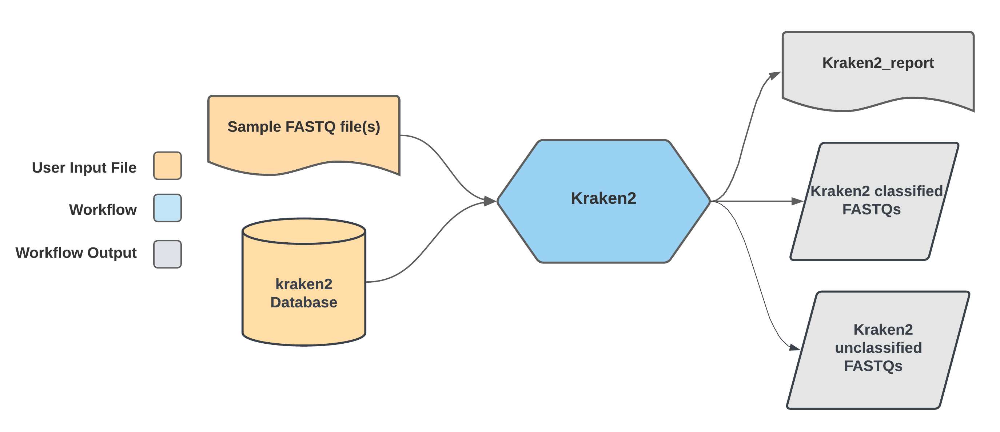

# Kraken2

## Quick Facts

{{ render_tsv_table("docs/assets/tables/all_workflows.tsv", sort_by="Name", filters={"Name": "[**Kraken2**](../workflows/standalone/kraken2.md)"}, columns=["Workflow Type", "Applicable Kingdom", "Last Known Changes", "Command-line Compatibility","Workflow Level", "Dockstore"]) }}

## Kraken2 Workflows

**The Kraken2 workflows assess the taxonomic profile of raw sequencing data (FASTQ files).**

Kraken2 is a bioinformatics tool originally designed for metagenomic applications. It has additionally proven valuable for validating taxonomic assignments and checking contamination of single-species (e.g. bacterial isolate, eukaryotic isolate, viral isolate, etc.) whole genome sequence data.

There are three Kraken2 workflows:

- `Kraken2_PE` is compatible with **Illumina paired-end data**
- `Kraken2_SE` is compatible with **Illumina single-end data**
- `Kraken2_ONT` is compatible with **Oxford Nanopore data**

Besides the data input types, there are minimal differences between these two workflows.

!!! caption "Kraken2 Workflow Diagram"
    

### Databases

!!! info  "Database selection"
    The Kraken2 software is database-dependent and **taxonomic assignments are highly sensitive to the database used**. An appropriate database should contain the expected organism(s) (e.g. *Escherichia coli*) and other taxa that may be present in the reads (e.g. *Citrobacter freundii*, a common contaminant).

#### Suggested databases

<div class="searchable-table" markdown="1">

| Database name | Database Description | Suggested Applications | GCP URI (for usage in Terra) | Source | Database Size (GB) | Date of Last Update |
| --- | --- | --- | --- | --- | --- | --- |
| **Kalamari v5.1** | Kalamari is a database of complete public assemblies, that has been fine-tuned for enteric pathogens and is backed by trusted institutions. [Full list available here ( in chromosomes.tsv and plasmids.tsv)](https://github.com/lskatz/Kalamari/tree/master/src) | Single-isolate enteric bacterial pathogen analysis (Salmonella, Escherichia, Shigella, Listeria, Campylobacter, Vibrio, Yersinia) | **`gs://theiagen-public-resources-rp/reference_data/databases/kraken2/kraken2.kalamari_5.1.tar.gz`** | ‣ | 1.5 | 18/5/2022 |
| **standard 8GB** | Standard RefSeq database (archaea, bacteria, viral, plasmid, human, UniVec_Core) capped at 8GB | Prokaryotic or viral organisms, but for enteric pathogens, we recommend Kalamari | **`gs://theiagen-public-resources-rp/reference_data/databases/kraken2/k2_standard_08gb_20240112.tar.gz`** | <https://benlangmead.github.io/aws-indexes/k2> | 7.5 | 12/1/2024 |
| **standard 16GB** | Standard RefSeq database (archaea, bacteria, viral, plasmid, human, UniVec_Core) capped at 16GB | Prokaryotic or viral organisms, but for enteric pathogens, we recommend Kalamari | **`gs://theiagen-public-resources-rp/reference_data/databases/kraken2/k2_standard_16gb_20240112.tar.gz`** | <https://benlangmead.github.io/aws-indexes/k2> | 15 | 12/1/2024 |
| **standard** | Standard RefSeq database (archaea, bacteria, viral, plasmid, human, UniVec_Core)  | Prokaryotic or viral organisms, but for enteric pathogens, we recommend Kalamari | **`gs://theiagen-public-resources-rp/reference_data/databases/kraken2/k2_standard_20240112.tar.gz`** | <https://benlangmead.github.io/aws-indexes/k2> | 72 | 18/4/2023 |
| **viral** | RefSeq viral | Viral metagenomics | **`gs://theiagen-public-resources-rp/reference_data/databases/kraken2/k2_viral_20240112.tar.gz`** | <https://benlangmead.github.io/aws-indexes/k2> | 0.6 | 12/1/2024 |
| **EuPathDB48** | Eukaryotic pathogen genomes with contaminants removed. [Full list available here](https://genome-idx.s3.amazonaws.com/kraken/k2_eupathdb48_20201113/EuPathDB48_Contents.txt) | Eukaryotic organisms (Candida spp., Aspergillus spp., etc) | **`gs://theiagen-public-resources-rp/reference_data/databases/kraken2/k2_eupathdb48_20201113.tar.gz`** | <https://benlangmead.github.io/aws-indexes/k2> | 30.3 | 13/11/2020 |
| **EuPathDB48** | Eukaryotic pathogen genomes with contaminants removed. [Full list available here](https://genome-idx.s3.amazonaws.com/kraken/k2_eupathdb48_20201113/EuPathDB48_Contents.txt) | Eukaryotic organisms (Candida spp., Aspergillus spp., etc) | **`gs://theiagen-public-resources-rp/reference_data/databases/kraken2/k2_eupathdb48_20230407.tar.gz`** | <https://benlangmead.github.io/aws-indexes/k2> | 11 | 7/4/2023 |

</div>

### Inputs

!!! caption ""
    === "Kraken_PE"
        /// html | div[class="searchable-table"]

        {{ render_tsv_table("docs/assets/tables/all_inputs.tsv", input_table=True, filters={"Workflow": "Kraken_PE"}, columns=["Terra Task Name", "Variable", "Type", "Description", "Default Value", "Terra Status"], sort_by=[("Terra Status", True), "Terra Task Name", "Variable"], indent=8) }}
        ///

    === "Kraken_SE"
        /// html | div[class="searchable-table"]

        {{ render_tsv_table("docs/assets/tables/all_inputs.tsv", input_table=True, filters={"Workflow": "Kraken_SE"}, columns=["Terra Task Name", "Variable", "Type", "Description", "Default Value", "Terra Status"], sort_by=[("Terra Status", True), "Terra Task Name", "Variable"], indent=8) }}
        ///

    === "Kraken_ONT"
        /// html | div[class="searchable-table"]

        {{ render_tsv_table("docs/assets/tables/all_inputs.tsv", input_table=True, filters={"Workflow": "Kraken_ONT"}, columns=["Terra Task Name", "Variable", "Type", "Description", "Default Value", "Terra Status"], sort_by=[("Terra Status", True), "Terra Task Name", "Variable"], indent=8) }}
        ///

### Workflow Tasks

{{ include_md("common_text/kraken2_task.md", condition="kraken") }}

### Outputs

!!! caption ""
    === "Kraken_PE"
        /// html | div[class="searchable-table"]

        {{ render_tsv_table("docs/assets/tables/all_outputs.tsv", input_table=False, filters={"Workflow": "Kraken_PE"}, columns=["Variable", "Type", "Description"], sort_by=["Variable"], indent=8) }}

        ///

    === "Kraken_SE"
        /// html | div[class="searchable-table"]

        {{ render_tsv_table("docs/assets/tables/all_outputs.tsv", input_table=False, filters={"Workflow": "Kraken_SE"}, columns=["Variable", "Type", "Description"], sort_by=["Variable"], indent=8) }}

        ///

    === "Kraken_ONT"
        /// html | div[class="searchable-table"]

        {{ render_tsv_table("docs/assets/tables/all_outputs.tsv", input_table=False, filters={"Workflow": "Kraken_ONT"}, columns=["Variable", "Type", "Description"], sort_by=["Variable"], indent=8) }}

        ///

#### Interpretation of results

The most important outputs of the Kraken2 workflows are the `kraken2_report` files. These will include a breakdown of the number of sequences assigned to a particular taxon, and the percentage of reads assigned. [A complete description of the report format can be found here](https://github.com/DerrickWood/kraken2/blob/master/docs/MANUAL.markdown#standard-kraken-output-format).

When assessing the taxonomic identity of a single isolate's sequence, it is normal that a few reads are assigned to very closely rated taxa due to the shared sequence identity between them. "Very closely related taxa" may be genetically similar species in the same genus, or taxa with which the dominant species have undergone horizontal gene transfer. Unrelated taxa or a high abundance of these closely related taxa is indicative of contamination or sequencing of non-target taxa. Interpretation of the results is dependent on the biological context.

??? toggle "Example Kraken2 report"
    Below is an example `kraken2_report` for a _Klebsiella pneumoniae_ sample. Only the first 30 lines are included here since rows near the bottom are often spurious results with only a few reads assigned to a non-target organism.

    From this report, we can see that 84.35 % of the reads were assigned at the species level (`S` in the 4th column) to "_Klebsiella pneumoniae_". Given almost 6 % of reads were "unclassified" and ~2 % of reads were assigned to very closely related taxa (in the _Klebsiella_ genus), this suggests the reads are from _Klebsiella pneumoniae_ with very little -if any- read contamination. 
    
    ```
     5.98	 108155	108155	U	0	unclassified
     94.02	1699669	0	C	1	
     94.02	1699669	1862	C1	131567	  cellular organisms
     93.91	1697788	2590	D	2	    Bacteria
     93.75	1694805	6312	P	1224	      Proteobacteria
     93.39	1688284	37464	C	1236	        Gammaproteobacteria
     91.31	1650648	35278	O	91347	          Enterobacterales
     89.31	1614639	43698	F	543	            Enterobacteriaceae
     86.40	1561902	22513	G	570	              Klebsiella
     **84.35	1524918	1524918	S	573	                Klebsiella pneumoniae**
      0.75	13596	13596	S	548	                Klebsiella aerogenes
      0.03	600	600	S	244366	                Klebsiella variicola
      0.01	253	253	S	571	                Klebsiella oxytoca
      0.00	17	17	S	1134687	                Klebsiella michiganensis
      0.00	3	0	G1	2608929	                unclassified Klebsiella
      0.00	3	3	S	1972757	                  Klebsiella sp. PO552
      0.00	2	2	S	1463165	                Klebsiella quasipneumoniae
      0.17	3035	129	G	590	              Salmonella
      0.15	2728	909	S	28901	                Salmonella enterica
      0.03	582	582	S1	9000010	                  Salmonella enterica subsp. IIa
      0.02	306	306	S1	59201	                  Salmonella enterica subsp. enterica
      0.01	230	230	S1	9000014	                  Salmonella enterica subsp. IIIa
      0.01	221	221	S1	9000015	                  Salmonella enterica subsp. IIIb
      0.01	136	136	S1	9000016	                  Salmonella enterica subsp. IX
      0.01	132	132	S1	9000011	                  Salmonella enterica subsp. IIb
      0.01	122	122	S1	59208	                  Salmonella enterica subsp. VII
      0.00	41	41	S1	59207	                  Salmonella enterica subsp. indica
      0.00	25	25	S1	9000017	                  Salmonella enterica subsp. X
      0.00	24	24	S1	9000009	                  Salmonella enterica subsp. VIII
      0.01	178	178	S	54736	                Salmonella bongori
    ```

#### Krona visualisation of Kraken2 report

[Krona](https://github.com/marbl/Krona) produces an interactive report that allows hierarchical data, such as the one from Kraken2, to be explored with zooming, multi-layered pie charts. These pie charts are intuitive and highly responsive.

??? toggle "Example Krona report"

    Below is an example of the `krona_html` for a bacterial sample. Taxonomic rank is organised from the centre of the pie chart to the edge, with each slice representing the relative abundance of a given taxa in the sample.
    
    

!!! techdetails "Kraken2 Technical Details"
    |  | Links |
    | --- | --- |
    | Software Source Code | [Kraken2 on GitHub](https://github.com/DerrickWood/kraken2/)  |
    | Software Documentation | <https://github.com/DerrickWood/kraken2/blob/master/docs/MANUAL.markdown> |
    | Original Publication(s) | [Improved metagenomic analysis with Kraken 2](https://link.springer.com/article/10.1186/s13059-019-1891-0) |
