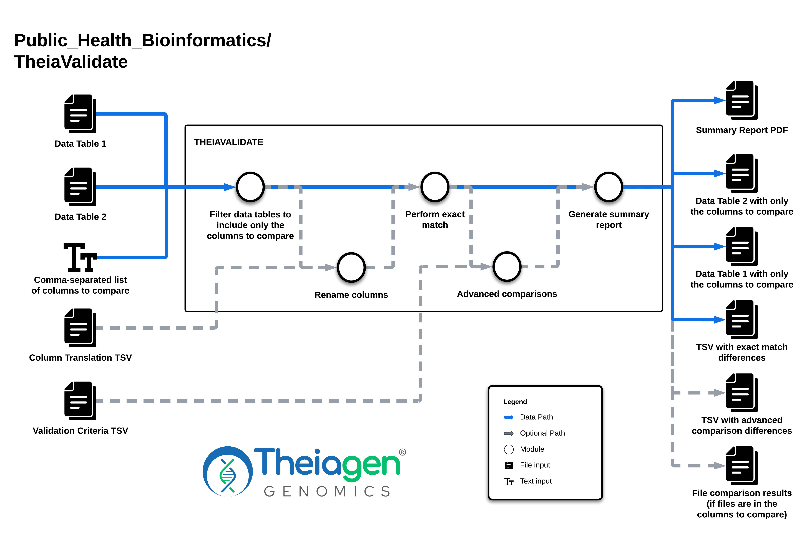

# TheiaValidate

## Quick Facts

{{ render_tsv_table("docs/assets/tables/all_workflows.tsv", sort_by="Name", filter_column="Name", filter_values="[**TheiaValidate**](../workflows/standalone/theiavalidate.md)", columns=["Workflow Type", "Applicable Kingdom", "Last Known Changes", "Command-line Compatibility","Workflow Level"]) }}

## TheiaValidate_PHB

!!! caption "TheiaValidate Workflow Diagram"
    

TheiaValidate performs basic comparisons between user-designated columns in two separate tables. We anticipate this workflow being run to determine if any differences exist between version releases or two workflows, such as TheiaProk_ONT vs TheiaProk_Illumina_PE. A summary PDF report is produced in addition to a Excel spreadsheet that lists the values for any columns that do not have matching content for a sample.

!!! warning
    The two tables being compared **must** have both identical sample names and an equal number of samples. If not, validation will not work or (in the case of unequal number of samples) not be attempted.

In order to enable this workflow to function for different workflow series, we require users to provide a list of columns they want to compare between the two tables. Feel free to use the information below that Theiagen uses to compare versions of the three main workflow series as a _**starting point**_ for your own validations:

!!! tool "Validation Starting Points"
    Please ensure that you adjust these values to make sense for your own validation. Please see the [theiavalidate README](https://github.com/theiagen/theiavalidate/blob/main/README.md) for more information as well.

    | Workflow Series | Validation Criteria TSV | Columns to Compare |
    |---|---|---|
    | TheiaCoV Workflows | [TheiaCov Validation Criteria](../../assets/files/theiavalidate/theiacov-validation-criteria.txt) | abricate_flu_subtype,abricate_flu_type,assembly_length_unambiguous,assembly_mean_coverage,irma_subtype,irma_type,kraken_human,kraken_human_dehosted,kraken_sc2,kraken_sc2_dehosted,kraken_target_org,kraken_target_org_dehosted,nextclade_aa_dels,nextclade_aa_subs,nextclade_clade,nextclade_lineage,nextclade_tamiflu_resistance_aa_subs,num_reads_clean1,num_reads_clean2,number_N,pango_lineage,percent_reference_coverage,vadr_num_alerts |
    | TheiaEuk Workflows | [TheiaEuk Validation Criteria](../../assets/files/theiavalidate/theiaeuk-validation-criteria.txt) | assembly_length,busco_results,clade_type,est_coverage_clean,est_coverage_raw,gambit_predicted_taxon,n50_value,num_reads_clean1,num_reads_clean2,number_contigs,quast_gc_percent,theiaeuk_snippy_variants_hits |
    | TheiaProk Workflows | [TheiaProk Validation Criteria](../../assets/files/theiavalidate/theiaprok-validation-criteria.txt) | abricate_abaum_plasmid_type_genes,agrvate_agr_group,amrfinderplus_amr_core_genes,amrfinderplus_amr_plus_genes,amrfinderplus_stress_genes,amrfinderplus_virulence_genes,ani_highest_percent,ani_top_species_match,assembly_length,busco_results,ectyper_predicted_serotype,emmtypingtool_emm_type,est_coverage_clean,est_coverage_raw,gambit_predicted_taxon,genotyphi_final_genotype,hicap_genes,hicap_serotype,kaptive_k_type,kleborate_genomic_resistance_mutations,kleborate_key_resistance_genes,kleborate_mlst_sequence_type,legsta_predicted_sbt,lissero_serotype,meningotype_serogroup,midas_primary_genus,midas_secondary_genus,midas_secondary_genus_abundance,n50_value,ngmaster_ngmast_sequence_type,ngmaster_ngstar_sequence_type,num_reads_clean1,num_reads_clean2,number_contigs,pasty_serogroup,pbptyper_predicted_1A_2B_2X,plasmidfinder_plasmids,poppunk_gps_cluster,seqsero2_predicted_serotype,seroba_ariba_serotype,seroba_serotype,serotypefinder_serotype,shigatyper_ipaB_presence_absence,shigatyper_predicted_serotype,shigeifinder_cluster,shigeifinder_serotype,sistr_predicted_serotype,sonneityping_final_genotype,spatyper_type,srst2_vibrio_serogroup,staphopiasccmec_types_and_mecA_presence,tbprofiler_main_lineage,tbprofiler_resistance_genes,ts_mlst_predicted_st,virulencefinder_hits |

If additional validation metrics are desired, the user has the ability to provide a `validation_criteria_tsv` file that specifies what type of comparison should be performed. There are several options for additional validation checks:

- **EXACT** performs an exact string match and counts the number of exact match failures/differences
- **IGNORE** does not check the values and says there are 0 failures
- **SET** checks list items (such as `amrfinder_plus_genes` which is a comma-delimited list of genes) for identical content — order does not matter; that is, `mdsA,mdsB` is determined to be same as `mdsB,mdsA`. The EXACT match does not consider these to be the same, but the SET match does.
- **<PERCENT_DIFF\>**, which is an actual decimal value such as **0.02**, calculates the percent difference between _numerical_ columns. If the columns are not numerical, this function will **not** work and will lead to workflow failure. For example, if the decimal percentage is 0.02, the test will indicate a failure if the values in the two columns are more than 2% different.
- Dates, integers, and object-type values are ignored and indicate 0 failures.
- **<RANGE>**, which is an actual integer value such as **10**, calculates the numerical difference between _numerical_ columns. If the columns are not numerical, this function will **not** work and will lead to workflow failure. For example, if the range is 10, the test will indicate a failure if the values in the two columns are more than 10 apart (units ignored).
- **CRITERIA1,CRITERIA2,...** checks the values for the two columns with CRITERIA1 (which must be one of the above) and _then_ with CRITERIA2, etc.; values will pass if at least one criteria is met; the separate criteria **must** be comma-delimited.


### File Comparisons

If a column consists of only GCP URIs (Google Cloud file paths), the files will be localized and compared with either an EXACT match or a SET match. In the SET match, the lines in the file are ordered before comparison. Results are returned to the summary table as expected. The results of each file comparison can be found in the `theiavalidate_diffs`  output column.

### Inputs

Please note that all string inputs **must** be enclosed in quotation marks; for example, "column1,column2" or "workspace1"

/// html | div[class="searchable-table"]

{{ render_tsv_table("docs/assets/tables/all_inputs.tsv", input_table=True, filters={"Workflow": "TheiaValidate"}, columns=["Terra Task Name", "Variable", "Type", "Description", "Default Value", "Terra Status"], sort_by=[("Terra Status", True), "Terra Task Name", "Variable"]) }}

///

The optional `validation_criteria_tsv` file takes the following format (tab-delimited; _a header line is required_):

```text linenums="1"
column_name	criteria
columnB SET
columnC	IGNORE
columnD	0.01
columnE	EXACT
```

Please see above for a description of all available criteria options (EXACT, IGNORE, SET, <PERCENT_DIFF>).

The optional `column_translation_tsv` file takes the following format (tab-delimited; _a header line is required_):

```text linenums="1"
old_name	new_name
column_name_in_table1	column_name_in_table2
column_name_in_table2	column_name_in_table1
internal_column_name	display_column_name
```

Please note that the name in the **second column** will be displayed and used in all output files.

!!! info "Call Caching Disabled"
    If using TheiaValidate workflow version 1.3.0 or higher, the call-caching feature of Terra has been DISABLED to ensure that the workflow is run from the beginning and data is compared fresh. Call-caching will not be enabled, even if the user checks the box ✅ in the Terra workflow interface.

### Outputs

/// html | div[class="searchable-table"]

{{ render_tsv_table("docs/assets/tables/all_outputs.tsv", input_table=False, filters={"Workflow": "TheiaValidate"}, columns=["Variable", "Type", "Description"], sort_by=["Variable"]) }}

///

### Example Data and Outputs

To help demonstrate how TheiaValidate works, please observe the following example and outputs:

???+ toggle "Table1"
    | entity:example_table1_id | columnA-string | columnB-set | columnC-ignore | columnD-float | columnE-missing |
    | --- | --- | --- | --- | --- | --- |
    | sample1 | option1 | item1,item2,item3 | cheese | 1000 | present |
    | sample2 | option1 | item1,item3,item2 | cheesecake | 12 | present |
    | sample3 | option2 | item1,item2,item3 | cake | 14 | present |
    | sample4 | option1 | item2,item1 | cakebatter | 3492 |  |
    | sample5 | option2 | item1,item2 | batter | 3 | present |
  
???+ toggle "Table2"
    | entity:example_table2_id | columnA-string | columnB-set | columnC-ignore | columnD-float | missing |
    | --- | --- | --- | --- | --- | --- |
    | sample1 | option1 | item1,item3,item2 | cheesecake | 999 | present |
    | sample2 | option2 | item1,item2,item3 | batter | 12 | present |
    | sample3 | option1 | item1,item2 | cheese | 24 |  |
    | sample4 | option1 | item1,item2 | cakebatter | 728 |  |
    | sample5 | option2 | item1,item2,item3 | batter | 4 | present |

???+ toggle "Validation Criteria"
    | column | criteria |
    | --- | --- |
    | columnB-set | SET |
    | columnC-ignore | IGNORE |
    | columnD-float | 0.01 |
    | columnE-missing | EXACT |

???+ toggle "Column Translation"
    | missing | columnE-missing |
    | --- | --- |
    | columnA-string | columnA-string |

    _Note: the second row translating_ `columnA-string` _to itself is included to prevent the known bug explained above._

If the above inputs are provided, then the following output files will be generated:

[filtered_example_table1.tsv](../../assets/files/theiavalidate/filtered_example_table1.tsv)

[filtered_example_table2.tsv](../../assets/files/theiavalidate/filtered_example_table2.tsv)

[example_summary.pdf](../../assets/files/theiavalidate/example_summary.pdf)

[example_exact_differences.tsv](../../assets/files/theiavalidate/example_exact_differences.tsv)

[example_validation_criteria_differences.tsv](../../assets/files/theiavalidate/example_validation_criteria_differences.tsv)
